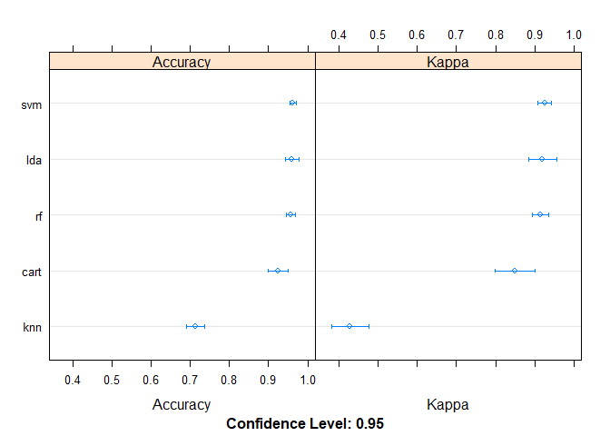

``` r
library(tidyverse)
```

    ## -- Attaching packages --------------------------------------- tidyverse 1.3.0 --

    ## v ggplot2 3.3.2     v purrr   0.3.4
    ## v tibble  3.0.4     v dplyr   1.0.2
    ## v tidyr   1.1.2     v stringr 1.4.0
    ## v readr   1.4.0     v forcats 0.5.0

    ## -- Conflicts ------------------------------------------ tidyverse_conflicts() --
    ## x dplyr::filter() masks stats::filter()
    ## x dplyr::lag()    masks stats::lag()

Reading the dataset
===================

``` r
adverts <- read.csv("http://bit.ly/IPAdvertisingData")
```

Previwing the dataset
=====================

``` r
head(adverts)
```

    ##   Daily.Time.Spent.on.Site Age Area.Income Daily.Internet.Usage
    ## 1                    68.95  35    61833.90               256.09
    ## 2                    80.23  31    68441.85               193.77
    ## 3                    69.47  26    59785.94               236.50
    ## 4                    74.15  29    54806.18               245.89
    ## 5                    68.37  35    73889.99               225.58
    ## 6                    59.99  23    59761.56               226.74
    ##                           Ad.Topic.Line           City Male    Country
    ## 1    Cloned 5thgeneration orchestration    Wrightburgh    0    Tunisia
    ## 2    Monitored national standardization      West Jodi    1      Nauru
    ## 3      Organic bottom-line service-desk       Davidton    0 San Marino
    ## 4 Triple-buffered reciprocal time-frame West Terrifurt    1      Italy
    ## 5         Robust logistical utilization   South Manuel    0    Iceland
    ## 6       Sharable client-driven software      Jamieberg    1     Norway
    ##             Timestamp Clicked.on.Ad
    ## 1 2016-03-27 00:53:11             0
    ## 2 2016-04-04 01:39:02             0
    ## 3 2016-03-13 20:35:42             0
    ## 4 2016-01-10 02:31:19             0
    ## 5 2016-06-03 03:36:18             0
    ## 6 2016-05-19 14:30:17             0

Checking the bottom
===================

``` r
tail(adverts)
```

    ##      Daily.Time.Spent.on.Site Age Area.Income Daily.Internet.Usage
    ## 995                     43.70  28    63126.96               173.01
    ## 996                     72.97  30    71384.57               208.58
    ## 997                     51.30  45    67782.17               134.42
    ## 998                     51.63  51    42415.72               120.37
    ## 999                     55.55  19    41920.79               187.95
    ## 1000                    45.01  26    29875.80               178.35
    ##                             Ad.Topic.Line          City Male
    ## 995         Front-line bifurcated ability  Nicholasland    0
    ## 996         Fundamental modular algorithm     Duffystad    1
    ## 997       Grass-roots cohesive monitoring   New Darlene    1
    ## 998          Expanded intangible solution South Jessica    1
    ## 999  Proactive bandwidth-monitored policy   West Steven    0
    ## 1000      Virtual 5thgeneration emulation   Ronniemouth    0
    ##                     Country           Timestamp Clicked.on.Ad
    ## 995                 Mayotte 2016-04-04 03:57:48             1
    ## 996                 Lebanon 2016-02-11 21:49:00             1
    ## 997  Bosnia and Herzegovina 2016-04-22 02:07:01             1
    ## 998                Mongolia 2016-02-01 17:24:57             1
    ## 999               Guatemala 2016-03-24 02:35:54             0
    ## 1000                 Brazil 2016-06-03 21:43:21             1

Checking the number of rows and columns
=======================================

``` r
#The rows and columns in the data 
cat("The dataset has ", dim(adverts)[1], "rows and ", dim(adverts)[2], " columns")
```

    ## The dataset has  1000 rows and  10  columns

Checking the structure of the dataset
=====================================

``` r
str(adverts)
```

    ## 'data.frame':    1000 obs. of  10 variables:
    ##  $ Daily.Time.Spent.on.Site: num  69 80.2 69.5 74.2 68.4 ...
    ##  $ Age                     : int  35 31 26 29 35 23 33 48 30 20 ...
    ##  $ Area.Income             : num  61834 68442 59786 54806 73890 ...
    ##  $ Daily.Internet.Usage    : num  256 194 236 246 226 ...
    ##  $ Ad.Topic.Line           : chr  "Cloned 5thgeneration orchestration" "Monitored national standardization" "Organic bottom-line service-desk" "Triple-buffered reciprocal time-frame" ...
    ##  $ City                    : chr  "Wrightburgh" "West Jodi" "Davidton" "West Terrifurt" ...
    ##  $ Male                    : int  0 1 0 1 0 1 0 1 1 1 ...
    ##  $ Country                 : chr  "Tunisia" "Nauru" "San Marino" "Italy" ...
    ##  $ Timestamp               : chr  "2016-03-27 00:53:11" "2016-04-04 01:39:02" "2016-03-13 20:35:42" "2016-01-10 02:31:19" ...
    ##  $ Clicked.on.Ad           : int  0 0 0 0 0 0 0 1 0 0 ...

Cleaning the dataset
--------------------

Making all the columns lower cased for uniformity and replacing white spaces
============================================================================

``` r
names(adverts) <- str_replace_all(names(adverts), c(" " = "_"))
names(adverts) <- tolower(names(adverts))
```

Identifying numeric columns
===========================

``` r
num_cols <- unlist(lapply(adverts, is.numeric))
num_cols
```

    ## daily.time.spent.on.site                      age              area.income 
    ##                     TRUE                     TRUE                     TRUE 
    ##     daily.internet.usage            ad.topic.line                     city 
    ##                     TRUE                    FALSE                    FALSE 
    ##                     male                  country                timestamp 
    ##                     TRUE                    FALSE                    FALSE 
    ##            clicked.on.ad 
    ##                     TRUE

They are; daily time spent on site, age, area income, daily internet usage, male, click on ad
=============================================================================================

\# Evaluating if there are any outliers in the numeric class \#Subset
numeric columns of data

``` r
data_num <- adverts[ ,num_cols]                        
```

Plotting boxplots
=================

``` r
boxplot(data_num)
```


\# There were outliers only on the area\_income. Now to check the values

``` r
boxplot.stats(adverts$area.income)$out
```

    ## [1] 17709.98 18819.34 15598.29 15879.10 14548.06 13996.50 14775.50 18368.57

Dealing with the outliers
=========================

Capping
=======

``` r
x <- adverts$area.income
qnt <- quantile(x, probs=c(.25, .75), na.rm = T)
caps <- quantile(x, probs=c(.05, .95), na.rm = T)
H <- 1.5 * IQR(x, na.rm = T)
adverts$area.income[adverts$area.income < (qnt[1] - H)] <- caps[1]
adverts$area.income[adverts$area.income > (qnt[2] + H)] <- caps[2]
```

Checking if there are any outliers left
=======================================

``` r
boxplot.stats(adverts$area.income)$out
```

    ## numeric(0)

Checking for missing values
===========================

``` r
colSums(is.na(adverts))
```

    ## daily.time.spent.on.site                      age              area.income 
    ##                        0                        0                        0 
    ##     daily.internet.usage            ad.topic.line                     city 
    ##                        0                        0                        0 
    ##                     male                  country                timestamp 
    ##                        0                        0                        0 
    ##            clicked.on.ad 
    ##                        0

There are no missing values
===========================

Checking for duplicated columns
===============================

``` r
duplicate_rows <- adverts[duplicated(adverts),]
duplicate_rows
```

    ##  [1] daily.time.spent.on.site age                      area.income             
    ##  [4] daily.internet.usage     ad.topic.line            city                    
    ##  [7] male                     country                  timestamp               
    ## [10] clicked.on.ad           
    ## <0 rows> (or 0-length row.names)

There are no duplicated columns
===============================

Exploratory Analysis
====================

Measures of central tendency
----------------------------

Getting the mean for each numeric column
========================================

``` r
colMeans(data_num)
```

    ## daily.time.spent.on.site                      age              area.income 
    ##                  65.0002                  36.0090               55000.0001 
    ##     daily.internet.usage                     male            clicked.on.ad 
    ##                 180.0001                   0.4810                   0.5000

Getting the median for each numeric column
==========================================

``` r
apply(data_num,2,median)
```

    ## daily.time.spent.on.site                      age              area.income 
    ##                   68.215                   35.000                57012.300 
    ##     daily.internet.usage                     male            clicked.on.ad 
    ##                  183.130                    0.000                    0.500

Getting the mode
================

``` r
getmode <- function(v) {
   uniqv <- unique(v)
   uniqv[which.max(tabulate(match(v, uniqv)))]
}
```

``` r
getmode(adverts$age)
```

    ## [1] 31

``` r
getmode(adverts$daily.time.spent.on.site)
```

    ## [1] 62.26

``` r
getmode(adverts$area.income)
```

    ## [1] 28275.3

``` r
getmode(adverts$daily.internet.usage)
```

    ## [1] 167.22

``` r
getmode(adverts$city)
```

    ## [1] "Lisamouth"

``` r
getmode(adverts$country)
```

    ## [1] "Czech Republic"

``` r
getmode(adverts$clicked.on.ad)
```

    ## [1] 0

``` r
getmode(adverts$timestamp)
```

    ## [1] "2016-03-27 00:53:11"

``` r
getmode(adverts$male)
```

    ## [1] 0

Measures of dispersion
----------------------

Checking the minimum for every numeric column
=============================================

``` r
adverts.min <- apply(subset(data_num, select = c(daily.time.spent.on.site, age, area.income,    daily.internet.usage)),2,min, na.rm = TRUE)
adverts.min
```

    ## daily.time.spent.on.site                      age              area.income 
    ##                    32.60                    19.00                 13996.50 
    ##     daily.internet.usage 
    ##                   104.78

Checking the maximum for every numeric column
=============================================

``` r
adverts.max <- apply(subset(data_num, select = c(daily.time.spent.on.site, age, area.income,    daily.internet.usage)),2,max, na.rm = TRUE)
adverts.max
```

    ## daily.time.spent.on.site                      age              area.income 
    ##                    91.43                    61.00                 79484.80 
    ##     daily.internet.usage 
    ##                   269.96

Checking the range for every numeric column
===========================================

``` r
adverts.range <- apply(subset(data_num, select = c(daily.time.spent.on.site, age, area.income,  daily.internet.usage)),2,range, na.rm = TRUE)
adverts.range
```

    ##      daily.time.spent.on.site age area.income daily.internet.usage
    ## [1,]                    32.60  19     13996.5               104.78
    ## [2,]                    91.43  61     79484.8               269.96

Checking the quantiles for every numeric column
===============================================

``` r
adverts.qnt <- apply(subset(data_num, select = c(daily.time.spent.on.site, age, area.income,    daily.internet.usage)),2,quantile, na.rm = TRUE)
adverts.qnt
```

    ##      daily.time.spent.on.site age area.income daily.internet.usage
    ## 0%                    32.6000  19    13996.50             104.7800
    ## 25%                   51.3600  29    47031.80             138.8300
    ## 50%                   68.2150  35    57012.30             183.1300
    ## 75%                   78.5475  42    65470.64             218.7925
    ## 100%                  91.4300  61    79484.80             269.9600

Checking the variation for every numeric column
===============================================

``` r
adverts.var <- apply(subset(data_num, select = c(daily.time.spent.on.site, age, area.income,    daily.internet.usage)),2,var, na.rm = TRUE)
adverts.var
```

    ## daily.time.spent.on.site                      age              area.income 
    ##             2.513371e+02             7.718611e+01             1.799524e+08 
    ##     daily.internet.usage 
    ##             1.927415e+03

Checking the standard deviation for every numeric column
========================================================

``` r
adverts.sd <- apply(subset(data_num, select = c(daily.time.spent.on.site, age, area.income, daily.internet.usage)),2,sd, na.rm = TRUE)
adverts.sd
```

    ## daily.time.spent.on.site                      age              area.income 
    ##                15.853615                 8.785562             13414.634022 
    ##     daily.internet.usage 
    ##                43.902339

Graphical Univariate
--------------------

Frequency distribution
======================

``` r
# Fetching the age column
age <- adverts$age

# Applying the table() function will compute the frequency distribution of the age variable
age_frequency <- table(age)

# Then applying the barplot function to produce its bar graph
barplot(age_frequency)
```


\# Histogram to show the distribution of time spent daily on site

``` r
hist(adverts$daily.time.spent.on.site)
```


\# Distribution of age

``` r
hist(adverts$age)
```


\# area\_income distribution

``` r
hist(adverts$area.income, col='cadetblue')
```


\# Distribution of daily internet usage

``` r
hist(adverts$daily.internet.usage, col='cadetblue')
```


\# Distribution of gender

``` r
ggplot(adverts,aes(x=toupper(male)))+geom_bar()+xlab(label = "Males and Females")+ylab(label = "Frequency")+theme_classic()
```


\# Distribution of clicked on ad

``` r
ggplot(adverts,aes(x=toupper(clicked.on.ad)))+geom_bar()+xlab(label = "No or Yes")+ylab(label = "Frequency")+theme_classic()
```


Summary
=======

``` r
summary(adverts)
```

    ##  daily.time.spent.on.site      age         area.income    daily.internet.usage
    ##  Min.   :32.60            Min.   :19.00   Min.   :19992   Min.   :104.8       
    ##  1st Qu.:51.36            1st Qu.:29.00   1st Qu.:47032   1st Qu.:138.8       
    ##  Median :68.22            Median :35.00   Median :57012   Median :183.1       
    ##  Mean   :65.00            Mean   :36.01   Mean   :55105   Mean   :180.0       
    ##  3rd Qu.:78.55            3rd Qu.:42.00   3rd Qu.:65471   3rd Qu.:218.8       
    ##  Max.   :91.43            Max.   :61.00   Max.   :79485   Max.   :270.0       
    ##  ad.topic.line          city                male         country         
    ##  Length:1000        Length:1000        Min.   :0.000   Length:1000       
    ##  Class :character   Class :character   1st Qu.:0.000   Class :character  
    ##  Mode  :character   Mode  :character   Median :0.000   Mode  :character  
    ##                                        Mean   :0.481                     
    ##                                        3rd Qu.:1.000                     
    ##                                        Max.   :1.000                     
    ##   timestamp         clicked.on.ad
    ##  Length:1000        Min.   :0.0  
    ##  Class :character   1st Qu.:0.0  
    ##  Mode  :character   Median :0.5  
    ##                     Mean   :0.5  
    ##                     3rd Qu.:1.0  
    ##                     Max.   :1.0

Checking the number of people who clicked on ads and who did not
================================================================

``` r
table(adverts$clicked.on.ad)
```

    ## 
    ##   0   1 
    ## 500 500

Checking the number of men and women
====================================

``` r
table(adverts$male)
```

    ## 
    ##   0   1 
    ## 519 481

From this we can see that the dataset was pretty much balanced
==============================================================

Bivariate Analysis
------------------

Correlation
===========

Correlation matrix
==================

``` r
M<-cor(data_num)
head(round(M,2))
```

    ##                          daily.time.spent.on.site   age area.income
    ## daily.time.spent.on.site                     1.00 -0.33        0.31
    ## age                                         -0.33  1.00       -0.18
    ## area.income                                  0.31 -0.18        1.00
    ## daily.internet.usage                         0.52 -0.37        0.34
    ## male                                        -0.02 -0.02        0.00
    ## clicked.on.ad                               -0.75  0.49       -0.48
    ##                          daily.internet.usage  male clicked.on.ad
    ## daily.time.spent.on.site                 0.52 -0.02         -0.75
    ## age                                     -0.37 -0.02          0.49
    ## area.income                              0.34  0.00         -0.48
    ## daily.internet.usage                     1.00  0.03         -0.79
    ## male                                     0.03  1.00         -0.04
    ## clicked.on.ad                           -0.79 -0.04          1.00

Covariance
==========

``` r
# Finding the covariance between daily_time_spent_on_site and age
# Assigning a variable to each column
site_time <- adverts$daily.time.spent.on.site
age <- adverts$age
cov(site_time, age)
```

    ## [1] -46.17415

``` r
# Covariance between daily_time_spent_on_site and income
income <- adverts$area.income
cov(site_time, income)
```

    ## [1] 65541.26

Scatter plot
============

``` r
# Scatter plot to compare income vs time spent on site
plot(site_time, income, xlab="Time spent on site", ylab="Area income")
```


``` r
clicked <- adverts$clicked.on.ad
# Scatter plot to compare income vs clicked on ad
plot(clicked, income, xlab="Income", ylab="Clicked on ad")
```


``` r
# Age vs time spent on site
plot(site_time, age, xlab="Time spent on site", ylab="Age")
```


Implementing the solution
-------------------------

``` r
#Create a dataframe that selects those that clicked on an ad
yes <-  adverts %>% filter(adverts$clicked.on.ad  == 1); 
```

``` r
# A summary of those that clicked
summary(yes)
```

    ##  daily.time.spent.on.site      age         area.income    daily.internet.usage
    ##  Min.   :32.60            Min.   :19.00   Min.   :19992   Min.   :104.8       
    ##  1st Qu.:42.84            1st Qu.:34.00   1st Qu.:39107   1st Qu.:123.6       
    ##  Median :51.53            Median :40.00   Median :49417   Median :138.8       
    ##  Mean   :53.15            Mean   :40.33   Mean   :48825   Mean   :145.5       
    ##  3rd Qu.:62.08            3rd Qu.:47.00   3rd Qu.:59241   3rd Qu.:161.2       
    ##  Max.   :91.37            Max.   :61.00   Max.   :78521   Max.   :270.0       
    ##  ad.topic.line          city                male         country         
    ##  Length:500         Length:500         Min.   :0.000   Length:500        
    ##  Class :character   Class :character   1st Qu.:0.000   Class :character  
    ##  Mode  :character   Mode  :character   Median :0.000   Mode  :character  
    ##                                        Mean   :0.462                     
    ##                                        3rd Qu.:1.000                     
    ##                                        Max.   :1.000                     
    ##   timestamp         clicked.on.ad
    ##  Length:500         Min.   :1    
    ##  Class :character   1st Qu.:1    
    ##  Mode  :character   Median :1    
    ##                     Mean   :1    
    ##                     3rd Qu.:1    
    ##                     Max.   :1

``` r
#See the various distributions

#Age distribution
hist(yes$age, col='maroon')
```


``` r
#See the area_income distribution 
hist(yes$area.income, col='yellow')
```


``` r
#See the daily_internet_usage distribution 
hist(yes$daily.internet.usage, col='blueviolet')
```


``` r
#daily_time_spent_on_site distribution 
hist(yes$daily.time.spent.on.site, col='grey')
```


``` r
#Distribution of the countries 

countries <- table(yes$country)
countries
```

    ## 
    ##                                         Afghanistan 
    ##                                                   5 
    ##                                             Albania 
    ##                                                   4 
    ##                                             Algeria 
    ##                                                   3 
    ##                                      American Samoa 
    ##                                                   3 
    ##                                             Andorra 
    ##                                                   2 
    ##                                              Angola 
    ##                                                   1 
    ##                                            Anguilla 
    ##                                                   3 
    ##        Antarctica (the territory South of 60 deg S) 
    ##                                                   2 
    ##                                 Antigua and Barbuda 
    ##                                                   4 
    ##                                           Argentina 
    ##                                                   1 
    ##                                             Armenia 
    ##                                                   1 
    ##                                           Australia 
    ##                                                   7 
    ##                                             Austria 
    ##                                                   1 
    ##                                          Azerbaijan 
    ##                                                   1 
    ##                                             Bahamas 
    ##                                                   4 
    ##                                             Bahrain 
    ##                                                   2 
    ##                                          Bangladesh 
    ##                                                   2 
    ##                                            Barbados 
    ##                                                   2 
    ##                                             Belarus 
    ##                                                   3 
    ##                                             Belgium 
    ##                                                   2 
    ##                                              Belize 
    ##                                                   3 
    ##                                               Benin 
    ##                                                   1 
    ##                                              Bhutan 
    ##                                                   1 
    ##                              Bosnia and Herzegovina 
    ##                                                   3 
    ##                           Bouvet Island (Bouvetoya) 
    ##                                                   2 
    ##                                              Brazil 
    ##                                                   3 
    ## British Indian Ocean Territory (Chagos Archipelago) 
    ##                                                   1 
    ##                              British Virgin Islands 
    ##                                                   1 
    ##                                   Brunei Darussalam 
    ##                                                   2 
    ##                                            Bulgaria 
    ##                                                   4 
    ##                                        Burkina Faso 
    ##                                                   1 
    ##                                             Burundi 
    ##                                                   2 
    ##                                            Cambodia 
    ##                                                   2 
    ##                                              Canada 
    ##                                                   3 
    ##                                      Cayman Islands 
    ##                                                   3 
    ##                            Central African Republic 
    ##                                                   1 
    ##                                                Chad 
    ##                                                   2 
    ##                                               Chile 
    ##                                                   3 
    ##                                               China 
    ##                                                   4 
    ##                                    Christmas Island 
    ##                                                   4 
    ##                                            Colombia 
    ##                                                   1 
    ##                                             Comoros 
    ##                                                   1 
    ##                                               Congo 
    ##                                                   3 
    ##                                        Cook Islands 
    ##                                                   1 
    ##                                          Costa Rica 
    ##                                                   2 
    ##                                       Cote d'Ivoire 
    ##                                                   3 
    ##                                                Cuba 
    ##                                                   4 
    ##                                              Cyprus 
    ##                                                   4 
    ##                                      Czech Republic 
    ##                                                   4 
    ##                                             Denmark 
    ##                                                   2 
    ##                                            Djibouti 
    ##                                                   1 
    ##                                            Dominica 
    ##                                                   2 
    ##                                  Dominican Republic 
    ##                                                   2 
    ##                                             Ecuador 
    ##                                                   2 
    ##                                               Egypt 
    ##                                                   3 
    ##                                         El Salvador 
    ##                                                   4 
    ##                                   Equatorial Guinea 
    ##                                                   3 
    ##                                             Eritrea 
    ##                                                   3 
    ##                                             Estonia 
    ##                                                   1 
    ##                                            Ethiopia 
    ##                                                   7 
    ##                         Falkland Islands (Malvinas) 
    ##                                                   2 
    ##                                       Faroe Islands 
    ##                                                   2 
    ##                                                Fiji 
    ##                                                   3 
    ##                                             Finland 
    ##                                                   1 
    ##                                              France 
    ##                                                   5 
    ##                                       French Guiana 
    ##                                                   3 
    ##                                    French Polynesia 
    ##                                                   1 
    ##                         French Southern Territories 
    ##                                                   1 
    ##                                              Gambia 
    ##                                                   1 
    ##                                             Georgia 
    ##                                                   2 
    ##                                             Germany 
    ##                                                   1 
    ##                                               Ghana 
    ##                                                   2 
    ##                                              Greece 
    ##                                                   3 
    ##                                           Greenland 
    ##                                                   1 
    ##                                             Grenada 
    ##                                                   2 
    ##                                          Guadeloupe 
    ##                                                   1 
    ##                                                Guam 
    ##                                                   2 
    ##                                           Guatemala 
    ##                                                   3 
    ##                                            Guernsey 
    ##                                                   2 
    ##                                              Guinea 
    ##                                                   2 
    ##                                       Guinea-Bissau 
    ##                                                   1 
    ##                                              Guyana 
    ##                                                   3 
    ##                                               Haiti 
    ##                                                   1 
    ##                   Heard Island and McDonald Islands 
    ##                                                   2 
    ##                       Holy See (Vatican City State) 
    ##                                                   1 
    ##                                            Honduras 
    ##                                                   2 
    ##                                           Hong Kong 
    ##                                                   4 
    ##                                             Hungary 
    ##                                                   5 
    ##                                             Iceland 
    ##                                                   1 
    ##                                           Indonesia 
    ##                                                   4 
    ##                                                Iran 
    ##                                                   3 
    ##                                             Ireland 
    ##                                                   1 
    ##                                         Isle of Man 
    ##                                                   1 
    ##                                              Israel 
    ##                                                   2 
    ##                                               Italy 
    ##                                                   1 
    ##                                             Jamaica 
    ##                                                   2 
    ##                                               Japan 
    ##                                                   2 
    ##                                              Jersey 
    ##                                                   4 
    ##                                          Kazakhstan 
    ##                                                   2 
    ##                                               Kenya 
    ##                                                   4 
    ##                                            Kiribati 
    ##                                                   1 
    ##                                               Korea 
    ##                                                   3 
    ##                                              Kuwait 
    ##                                                   1 
    ##                                     Kyrgyz Republic 
    ##                                                   1 
    ##                    Lao People's Democratic Republic 
    ##                                                   2 
    ##                                              Latvia 
    ##                                                   4 
    ##                                             Lebanon 
    ##                                                   4 
    ##                                             Liberia 
    ##                                                   6 
    ##                              Libyan Arab Jamahiriya 
    ##                                                   2 
    ##                                       Liechtenstein 
    ##                                                   6 
    ##                                           Lithuania 
    ##                                                   3 
    ##                                          Luxembourg 
    ##                                                   3 
    ##                                               Macao 
    ##                                                   3 
    ##                                           Macedonia 
    ##                                                   1 
    ##                                          Madagascar 
    ##                                                   2 
    ##                                              Malawi 
    ##                                                   2 
    ##                                            Maldives 
    ##                                                   2 
    ##                                                Mali 
    ##                                                   1 
    ##                                               Malta 
    ##                                                   3 
    ##                                    Marshall Islands 
    ##                                                   1 
    ##                                          Martinique 
    ##                                                   3 
    ##                                          Mauritania 
    ##                                                   1 
    ##                                           Mauritius 
    ##                                                   1 
    ##                                             Mayotte 
    ##                                                   5 
    ##                                              Mexico 
    ##                                                   4 
    ##                                          Micronesia 
    ##                                                   4 
    ##                                             Moldova 
    ##                                                   2 
    ##                                              Monaco 
    ##                                                   1 
    ##                                            Mongolia 
    ##                                                   4 
    ##                                          Montenegro 
    ##                                                   2 
    ##                                          Montserrat 
    ##                                                   1 
    ##                                             Morocco 
    ##                                                   1 
    ##                                             Myanmar 
    ##                                                   1 
    ##                                             Namibia 
    ##                                                   1 
    ##                                               Nauru 
    ##                                                   1 
    ##                                         Netherlands 
    ##                                                   3 
    ##                                Netherlands Antilles 
    ##                                                   2 
    ##                                       New Caledonia 
    ##                                                   2 
    ##                                         New Zealand 
    ##                                                   2 
    ##                                               Niger 
    ##                                                   2 
    ##                                      Norfolk Island 
    ##                                                   2 
    ##                            Northern Mariana Islands 
    ##                                                   2 
    ##                                              Norway 
    ##                                                   1 
    ##                                            Pakistan 
    ##                                                   1 
    ##                                               Palau 
    ##                                                   2 
    ##                               Palestinian Territory 
    ##                                                   2 
    ##                                    Papua New Guinea 
    ##                                                   3 
    ##                                            Paraguay 
    ##                                                   1 
    ##                                                Peru 
    ##                                                   5 
    ##                                         Philippines 
    ##                                                   3 
    ##                                    Pitcairn Islands 
    ##                                                   1 
    ##                                              Poland 
    ##                                                   3 
    ##                                            Portugal 
    ##                                                   1 
    ##                                         Puerto Rico 
    ##                                                   3 
    ##                                               Qatar 
    ##                                                   2 
    ##                                             Romania 
    ##                                                   1 
    ##                                  Russian Federation 
    ##                                                   1 
    ##                                              Rwanda 
    ##                                                   2 
    ##                                    Saint Barthelemy 
    ##                                                   2 
    ##                                        Saint Helena 
    ##                                                   2 
    ##                               Saint Kitts and Nevis 
    ##                                                   1 
    ##                                         Saint Lucia 
    ##                                                   1 
    ##                                        Saint Martin 
    ##                                                   2 
    ##                           Saint Pierre and Miquelon 
    ##                                                   3 
    ##                    Saint Vincent and the Grenadines 
    ##                                                   3 
    ##                                               Samoa 
    ##                                                   4 
    ##                                          San Marino 
    ##                                                   1 
    ##                               Sao Tome and Principe 
    ##                                                   2 
    ##                                        Saudi Arabia 
    ##                                                   3 
    ##                                             Senegal 
    ##                                                   5 
    ##                                              Serbia 
    ##                                                   3 
    ##                                          Seychelles 
    ##                                                   1 
    ##                                        Sierra Leone 
    ##                                                   2 
    ##                                           Singapore 
    ##                                                   1 
    ##                                            Slovenia 
    ##                                                   1 
    ##                                             Somalia 
    ##                                                   2 
    ##                                        South Africa 
    ##                                                   6 
    ##        South Georgia and the South Sandwich Islands 
    ##                                                   1 
    ##                                               Spain 
    ##                                                   3 
    ##                                            Suriname 
    ##                                                   1 
    ##                        Svalbard & Jan Mayen Islands 
    ##                                                   4 
    ##                                              Sweden 
    ##                                                   1 
    ##                                         Switzerland 
    ##                                                   3 
    ##                                Syrian Arab Republic 
    ##                                                   1 
    ##                                              Taiwan 
    ##                                                   4 
    ##                                          Tajikistan 
    ##                                                   2 
    ##                                            Tanzania 
    ##                                                   1 
    ##                                            Thailand 
    ##                                                   2 
    ##                                         Timor-Leste 
    ##                                                   1 
    ##                                                Togo 
    ##                                                   1 
    ##                                             Tokelau 
    ##                                                   3 
    ##                                               Tonga 
    ##                                                   2 
    ##                                 Trinidad and Tobago 
    ##                                                   2 
    ##                                             Tunisia 
    ##                                                   1 
    ##                                              Turkey 
    ##                                                   7 
    ##                                        Turkmenistan 
    ##                                                   2 
    ##                            Turks and Caicos Islands 
    ##                                                   3 
    ##                                              Tuvalu 
    ##                                                   3 
    ##                                              Uganda 
    ##                                                   4 
    ##                                             Ukraine 
    ##                                                   1 
    ##                                United Arab Emirates 
    ##                                                   3 
    ##                                      United Kingdom 
    ##                                                   2 
    ##                United States Minor Outlying Islands 
    ##                                                   2 
    ##                            United States of America 
    ##                                                   3 
    ##                        United States Virgin Islands 
    ##                                                   2 
    ##                                             Uruguay 
    ##                                                   1 
    ##                                          Uzbekistan 
    ##                                                   1 
    ##                                             Vanuatu 
    ##                                                   1 
    ##                                           Venezuela 
    ##                                                   3 
    ##                                             Vietnam 
    ##                                                   2 
    ##                                   Wallis and Futuna 
    ##                                                   1 
    ##                                      Western Sahara 
    ##                                                   4 
    ##                                               Yemen 
    ##                                                   2 
    ##                                              Zambia 
    ##                                                   3 
    ##                                            Zimbabwe 
    ##                                                   4

Modeling
========

``` r
names(data_num)
```

    ## [1] "daily.time.spent.on.site" "age"                     
    ## [3] "area.income"              "daily.internet.usage"    
    ## [5] "male"                     "clicked.on.ad"

SVM
---

Splitting the data into training set and testing set.
=====================================================

install.packages(“numDeriv”)

``` r
library(numDeriv)
library(caret)
```

    ## Loading required package: lattice

    ## 
    ## Attaching package: 'caret'

    ## The following object is masked from 'package:purrr':
    ## 
    ##     lift

``` r
intrain <- createDataPartition(y = data_num$clicked.on.ad, p= 0.7, list = FALSE)
training <- data_num[intrain,]
testing <- data_num[-intrain,]
```

``` r
# We check the dimensions of out training dataframe and testing dataframe
dim(training); 
```

    ## [1] 700   6

``` r
dim(testing)
```

    ## [1] 300   6

Factorizing the categorical variable
====================================

``` r
training[["clicked.on.ad"]] = factor(training[["clicked.on.ad"]])
```

Controlling all the computational overheads using the traincolntrol() method
============================================================================

``` r
trctrl <- trainControl(method = "repeatedcv", number = 10, repeats = 3)
```

Checking the result of the train model
======================================

``` r
svm_Linear <- train(clicked.on.ad ~., data = training, method = "svmLinear",
trControl=trctrl,
preProcess = c("center", "scale"),
tuneLength = 10)
```

Making Predictions
==================

``` r
test_pred <- predict(svm_Linear, newdata = testing)
test_pred
```

    ##   [1] 0 0 1 1 1 1 0 1 0 0 1 0 1 1 1 0 0 1 0 1 1 1 1 0 0 0 1 1 1 1 1 0 0 0 1 0 0
    ##  [38] 1 0 0 0 1 0 1 0 1 1 0 0 1 1 1 0 1 1 1 1 1 0 1 0 0 0 1 0 1 0 1 1 0 0 0 1 1
    ##  [75] 1 0 1 0 1 1 0 1 0 1 0 0 0 1 1 1 0 0 1 1 0 0 0 0 0 1 0 0 0 1 0 1 1 0 1 0 0
    ## [112] 0 0 1 0 0 1 0 1 1 0 1 0 0 1 0 0 0 1 0 0 1 1 0 0 1 0 1 1 1 0 0 1 1 1 0 1 1
    ## [149] 0 0 1 0 1 1 0 0 0 1 1 1 1 0 1 0 0 0 0 1 0 1 0 1 0 0 0 0 1 0 0 1 1 0 1 1 0
    ## [186] 1 0 0 1 0 0 1 0 0 0 0 1 1 1 0 0 0 0 0 0 1 1 1 1 0 0 1 1 1 0 1 0 0 0 1 0 0
    ## [223] 1 0 1 0 1 1 0 1 1 0 1 0 0 1 1 0 0 1 1 0 0 1 0 0 1 0 1 1 1 0 0 1 1 1 0 1 1
    ## [260] 0 0 1 1 1 1 0 0 0 1 0 0 0 1 0 1 1 0 1 0 0 1 1 0 1 1 1 0 0 0 1 0 1 1 1 1 1
    ## [297] 0 1 0 1
    ## Levels: 0 1

Plotting a confusion matrix to check for accuracy
=================================================

``` r
confusionMatrix(table(test_pred, testing$clicked.on.ad))
```

    ## Confusion Matrix and Statistics
    ## 
    ##          
    ## test_pred   0   1
    ##         0 147   5
    ##         1   3 145
    ##                                           
    ##                Accuracy : 0.9733          
    ##                  95% CI : (0.9481, 0.9884)
    ##     No Information Rate : 0.5             
    ##     P-Value [Acc > NIR] : <2e-16          
    ##                                           
    ##                   Kappa : 0.9467          
    ##                                           
    ##  Mcnemar's Test P-Value : 0.7237          
    ##                                           
    ##             Sensitivity : 0.9800          
    ##             Specificity : 0.9667          
    ##          Pos Pred Value : 0.9671          
    ##          Neg Pred Value : 0.9797          
    ##              Prevalence : 0.5000          
    ##          Detection Rate : 0.4900          
    ##    Detection Prevalence : 0.5067          
    ##       Balanced Accuracy : 0.9733          
    ##                                           
    ##        'Positive' Class : 0               
    ## 

``` r
# Run algorithms using 10-fold cross validation
control <- trainControl(method="cv", number=10)
metric <- "Accuracy"
```

``` r
# a) linear algorithms
set.seed(7)
fit.lda <- train(clicked.on.ad~., data=training, method="lda", metric=metric, trControl=control)
# b) nonlinear algorithms
# CART
set.seed(7)
fit.cart <- train(clicked.on.ad~., data=training, method="rpart", metric=metric, trControl=control)
# kNN
set.seed(7)
fit.knn <- train(clicked.on.ad~., data=training, method="knn", metric=metric, trControl=control)
# c) advanced algorithms
# SVM
set.seed(7)
fit.svm <- train(clicked.on.ad~., data=training, method="svmRadial", metric=metric, trControl=control)
# Random Forest
set.seed(7)
fit.rf <- train(clicked.on.ad~., data=training, method="rf", metric=metric, trControl=control)
```

``` r
# summarize accuracy of models
results <- resamples(list(lda=fit.lda, cart=fit.cart, knn=fit.knn, svm=fit.svm, rf=fit.rf))
summary(results)
```

    ## 
    ## Call:
    ## summary.resamples(object = results)
    ## 
    ## Models: lda, cart, knn, svm, rf 
    ## Number of resamples: 10 
    ## 
    ## Accuracy 
    ##           Min.   1st Qu.    Median      Mean   3rd Qu.      Max. NA's
    ## lda  0.9142857 0.9464286 0.9642857 0.9600000 0.9821429 0.9857143    0
    ## cart 0.8571429 0.9035714 0.9214286 0.9242857 0.9500000 0.9714286    0
    ## knn  0.6571429 0.7000000 0.7214286 0.7142857 0.7285714 0.7571429    0
    ## svm  0.9428571 0.9571429 0.9571429 0.9628571 0.9714286 0.9857143    0
    ## rf   0.9285714 0.9571429 0.9571429 0.9571429 0.9571429 0.9857143    0
    ## 
    ## Kappa 
    ##           Min.   1st Qu.    Median      Mean   3rd Qu.      Max. NA's
    ## lda  0.8285714 0.8928571 0.9285714 0.9200000 0.9642857 0.9714286    0
    ## cart 0.7142857 0.8071429 0.8428571 0.8485714 0.9000000 0.9428571    0
    ## knn  0.3142857 0.4000000 0.4428571 0.4285714 0.4571429 0.5142857    0
    ## svm  0.8857143 0.9142857 0.9142857 0.9257143 0.9428571 0.9714286    0
    ## rf   0.8571429 0.9142857 0.9142857 0.9142857 0.9142857 0.9714286    0

``` r
# compare accuracy of models
dotplot(results)
```



Summarizing the best model
--------------------------

``` r
print(fit.svm)
```

    ## Support Vector Machines with Radial Basis Function Kernel 
    ## 
    ## 700 samples
    ##   5 predictor
    ##   2 classes: '0', '1' 
    ## 
    ## No pre-processing
    ## Resampling: Cross-Validated (10 fold) 
    ## Summary of sample sizes: 630, 630, 630, 630, 630, 630, ... 
    ## Resampling results across tuning parameters:
    ## 
    ##   C     Accuracy   Kappa    
    ##   0.25  0.9628571  0.9257143
    ##   0.50  0.9614286  0.9228571
    ##   1.00  0.9600000  0.9200000
    ## 
    ## Tuning parameter 'sigma' was held constant at a value of 0.2159791
    ## Accuracy was used to select the optimal model using the largest value.
    ## The final values used for the model were sigma = 0.2159791 and C = 0.25.

Making Predictions
==================

``` r
# estimate skill of SVM on the training dataset
predictions <- predict(fit.svm, training)
confusionMatrix(predictions, training$clicked.on.ad)
```

    ## Confusion Matrix and Statistics
    ## 
    ##           Reference
    ## Prediction   0   1
    ##          0 345  18
    ##          1   5 332
    ##                                           
    ##                Accuracy : 0.9671          
    ##                  95% CI : (0.9511, 0.9791)
    ##     No Information Rate : 0.5             
    ##     P-Value [Acc > NIR] : < 2e-16         
    ##                                           
    ##                   Kappa : 0.9343          
    ##                                           
    ##  Mcnemar's Test P-Value : 0.01234         
    ##                                           
    ##             Sensitivity : 0.9857          
    ##             Specificity : 0.9486          
    ##          Pos Pred Value : 0.9504          
    ##          Neg Pred Value : 0.9852          
    ##              Prevalence : 0.5000          
    ##          Detection Rate : 0.4929          
    ##    Detection Prevalence : 0.5186          
    ##       Balanced Accuracy : 0.9671          
    ##                                           
    ##        'Positive' Class : 0               
    ## 

Conclusions
===========

Support Vector Machine (SVM) is so far the best model with an accuracy
score of 96.86%. It made 678 correct predictions and 22 wrongs ones. The
model can be further improved by tweaking some of the parameters.
