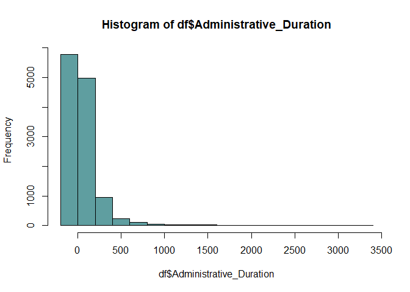

Problem definition
==================

The brand’s Sales and Marketing team would like to understand their
customer’s behavior from data that they have collected over the past
year. More specifically, they would like to learn the characteristics of
customer groups.

Defining the Metric for Success
===============================

1.  Perform clustering stating insights drawn from your analysis and
    visualizations.
2.  Upon implementation, provide comparisons between the approaches
    learned this week i.e. K-Means clustering vs Hierarchical clustering
    highlighting the strengths and limitations of each approach in the
    context of your analysis.

Understanding the Context
=========================

Recording the experimental design
=================================

1.  Problem Definition
2.  Data Sourcing
3.  Check the Data
4.  Perform Data Cleaning
5.  Perform Exploratory Data Analysis (Univariate, Bivariate &
    Multivariate)
6.  Implement the Solution
7.  Challenge the Solution
8.  Follow up Questions

Appropriateness of the Data
===========================

-   The dataset consists of 10 numerical and 8 categorical attributes.
    The ‘Revenue’ attribute can be used as the class label.
-   “Administrative”, “Administrative Duration”, “Informational”,
    “Informational Duration”, “Product Related” and “Product Related
    Duration” represents the number of different types of pages visited
    by the visitor in that session and total time spent in each of these
    page categories. The values of these features are derived from the
    URL information of the pages visited by the user and updated in
    real-time when a user takes an action, e.g. moving from one page to
    another.
-   The “Bounce Rate”, “Exit Rate” and “Page Value” features represent
    the metrics measured by “Google Analytics” for each page in the
    e-commerce site. The value of the “Bounce Rate” feature for a web
    page refers to the percentage of visitors who enter the site from
    that page and then leave (“bounce”) without triggering any other
    requests to the analytics server during that session.
-   The value of the “Exit Rate” feature for a specific web page is
    calculated as for all pageviews to the page, the percentage that was
    the last in the session.
-   The “Page Value” feature represents the average value for a web page
    that a user visited before completing an e-commerce transaction.
-   The “Special Day” feature indicates the closeness of the site
    visiting time to a specific special day (e.g. Mother’s Day,
    Valentine’s Day) in which the sessions are more likely to be
    finalized with the transaction. The value of this attribute is
    determined by considering the dynamics of e-commerce such as the
    duration between the order date and delivery date. For example, for
    Valentina’s day, this value takes a nonzero value between February 2
    and February 12, zero before and after this date unless it is close
    to another special day, and its maximum value of 1 on February 8.
-   The dataset also includes the operating system, browser, region,
    traffic type, visitor type as returning or new visitor, a Boolean
    value indicating whether the date of the visit is weekend, and month
    of the year.

Importing the libraries
=======================

``` r
library(tidyverse)
```

    ## -- Attaching packages --------------------------------------- tidyverse 1.3.0 --

    ## v ggplot2 3.3.2     v purrr   0.3.4
    ## v tibble  3.0.4     v dplyr   1.0.2
    ## v tidyr   1.1.2     v stringr 1.4.0
    ## v readr   1.4.0     v forcats 0.5.0

    ## -- Conflicts ------------------------------------------ tidyverse_conflicts() --
    ## x dplyr::filter() masks stats::filter()
    ## x dplyr::lag()    masks stats::lag()

``` r
library(ggplot2)
library(caret)
```

    ## Loading required package: lattice

    ## 
    ## Attaching package: 'caret'

    ## The following object is masked from 'package:purrr':
    ## 
    ##     lift

``` r
library(caretEnsemble)
```

    ## 
    ## Attaching package: 'caretEnsemble'

    ## The following object is masked from 'package:ggplot2':
    ## 
    ##     autoplot

``` r
library(mice)
```

    ## 
    ## Attaching package: 'mice'

    ## The following objects are masked from 'package:base':
    ## 
    ##     cbind, rbind

``` r
library(GGally)
```

    ## Registered S3 method overwritten by 'GGally':
    ##   method from   
    ##   +.gg   ggplot2

``` r
library(rpart)
library(readr)
library(dplyr)
library(dendextend)
```

    ## 
    ## ---------------------
    ## Welcome to dendextend version 1.14.0
    ## Type citation('dendextend') for how to cite the package.
    ## 
    ## Type browseVignettes(package = 'dendextend') for the package vignette.
    ## The github page is: https://github.com/talgalili/dendextend/
    ## 
    ## Suggestions and bug-reports can be submitted at: https://github.com/talgalili/dendextend/issues
    ## Or contact: <tal.galili@gmail.com>
    ## 
    ##  To suppress this message use:  suppressPackageStartupMessages(library(dendextend))
    ## ---------------------

    ## 
    ## Attaching package: 'dendextend'

    ## The following object is masked from 'package:rpart':
    ## 
    ##     prune

    ## The following object is masked from 'package:stats':
    ## 
    ##     cutree

``` r
library(factoextra)
```

    ## Welcome! Want to learn more? See two factoextra-related books at https://goo.gl/ve3WBa

``` r
library(cluster)
```

Data Sourcing
=============

``` r
df <- read.csv("http://bit.ly/EcommerceCustomersDataset")
```

Checking the data
=================

``` r
# Previewing the head and the bottom
head(df)
```

    ##   Administrative Administrative_Duration Informational Informational_Duration
    ## 1              0                       0             0                      0
    ## 2              0                       0             0                      0
    ## 3              0                      -1             0                     -1
    ## 4              0                       0             0                      0
    ## 5              0                       0             0                      0
    ## 6              0                       0             0                      0
    ##   ProductRelated ProductRelated_Duration BounceRates ExitRates PageValues
    ## 1              1                0.000000  0.20000000 0.2000000          0
    ## 2              2               64.000000  0.00000000 0.1000000          0
    ## 3              1               -1.000000  0.20000000 0.2000000          0
    ## 4              2                2.666667  0.05000000 0.1400000          0
    ## 5             10              627.500000  0.02000000 0.0500000          0
    ## 6             19              154.216667  0.01578947 0.0245614          0
    ##   SpecialDay Month OperatingSystems Browser Region TrafficType
    ## 1          0   Feb                1       1      1           1
    ## 2          0   Feb                2       2      1           2
    ## 3          0   Feb                4       1      9           3
    ## 4          0   Feb                3       2      2           4
    ## 5          0   Feb                3       3      1           4
    ## 6          0   Feb                2       2      1           3
    ##         VisitorType Weekend Revenue
    ## 1 Returning_Visitor   FALSE   FALSE
    ## 2 Returning_Visitor   FALSE   FALSE
    ## 3 Returning_Visitor   FALSE   FALSE
    ## 4 Returning_Visitor   FALSE   FALSE
    ## 5 Returning_Visitor    TRUE   FALSE
    ## 6 Returning_Visitor   FALSE   FALSE

``` r
tail(df)
```

    ##       Administrative Administrative_Duration Informational
    ## 12325              0                       0             1
    ## 12326              3                     145             0
    ## 12327              0                       0             0
    ## 12328              0                       0             0
    ## 12329              4                      75             0
    ## 12330              0                       0             0
    ##       Informational_Duration ProductRelated ProductRelated_Duration BounceRates
    ## 12325                      0             16                 503.000 0.000000000
    ## 12326                      0             53                1783.792 0.007142857
    ## 12327                      0              5                 465.750 0.000000000
    ## 12328                      0              6                 184.250 0.083333333
    ## 12329                      0             15                 346.000 0.000000000
    ## 12330                      0              3                  21.250 0.000000000
    ##        ExitRates PageValues SpecialDay Month OperatingSystems Browser Region
    ## 12325 0.03764706    0.00000          0   Nov                2       2      1
    ## 12326 0.02903061   12.24172          0   Dec                4       6      1
    ## 12327 0.02133333    0.00000          0   Nov                3       2      1
    ## 12328 0.08666667    0.00000          0   Nov                3       2      1
    ## 12329 0.02105263    0.00000          0   Nov                2       2      3
    ## 12330 0.06666667    0.00000          0   Nov                3       2      1
    ##       TrafficType       VisitorType Weekend Revenue
    ## 12325           1 Returning_Visitor   FALSE   FALSE
    ## 12326           1 Returning_Visitor    TRUE   FALSE
    ## 12327           8 Returning_Visitor    TRUE   FALSE
    ## 12328          13 Returning_Visitor    TRUE   FALSE
    ## 12329          11 Returning_Visitor   FALSE   FALSE
    ## 12330           2       New_Visitor    TRUE   FALSE

``` r
#The rows and columns in the data 
cat("The dataset has ", dim(df)[1], "rows and ", dim(df)[2], " columns")
```

    ## The dataset has  12330 rows and  18  columns

``` r
# Checking the structure of the dataset
str(df)
```

    ## 'data.frame':    12330 obs. of  18 variables:
    ##  $ Administrative         : int  0 0 0 0 0 0 0 1 0 0 ...
    ##  $ Administrative_Duration: num  0 0 -1 0 0 0 -1 -1 0 0 ...
    ##  $ Informational          : int  0 0 0 0 0 0 0 0 0 0 ...
    ##  $ Informational_Duration : num  0 0 -1 0 0 0 -1 -1 0 0 ...
    ##  $ ProductRelated         : int  1 2 1 2 10 19 1 1 2 3 ...
    ##  $ ProductRelated_Duration: num  0 64 -1 2.67 627.5 ...
    ##  $ BounceRates            : num  0.2 0 0.2 0.05 0.02 ...
    ##  $ ExitRates              : num  0.2 0.1 0.2 0.14 0.05 ...
    ##  $ PageValues             : num  0 0 0 0 0 0 0 0 0 0 ...
    ##  $ SpecialDay             : num  0 0 0 0 0 0 0.4 0 0.8 0.4 ...
    ##  $ Month                  : chr  "Feb" "Feb" "Feb" "Feb" ...
    ##  $ OperatingSystems       : int  1 2 4 3 3 2 2 1 2 2 ...
    ##  $ Browser                : int  1 2 1 2 3 2 4 2 2 4 ...
    ##  $ Region                 : int  1 1 9 2 1 1 3 1 2 1 ...
    ##  $ TrafficType            : int  1 2 3 4 4 3 3 5 3 2 ...
    ##  $ VisitorType            : chr  "Returning_Visitor" "Returning_Visitor" "Returning_Visitor" "Returning_Visitor" ...
    ##  $ Weekend                : logi  FALSE FALSE FALSE FALSE TRUE FALSE ...
    ##  $ Revenue                : logi  FALSE FALSE FALSE FALSE FALSE FALSE ...

Data Cleaning
=============

``` r
# Checking for missing values
colSums(is.na(df))
```

    ##          Administrative Administrative_Duration           Informational 
    ##                      14                      14                      14 
    ##  Informational_Duration          ProductRelated ProductRelated_Duration 
    ##                      14                      14                      14 
    ##             BounceRates               ExitRates              PageValues 
    ##                      14                      14                       0 
    ##              SpecialDay                   Month        OperatingSystems 
    ##                       0                       0                       0 
    ##                 Browser                  Region             TrafficType 
    ##                       0                       0                       0 
    ##             VisitorType                 Weekend                 Revenue 
    ##                       0                       0                       0

``` r
# Dealing with missing values
# Omitting the columns with null values since they're insignificant
df <- na.omit(df)
```

``` r
# Checking if there are any more null values
colSums(is.na(df))
```

    ##          Administrative Administrative_Duration           Informational 
    ##                       0                       0                       0 
    ##  Informational_Duration          ProductRelated ProductRelated_Duration 
    ##                       0                       0                       0 
    ##             BounceRates               ExitRates              PageValues 
    ##                       0                       0                       0 
    ##              SpecialDay                   Month        OperatingSystems 
    ##                       0                       0                       0 
    ##                 Browser                  Region             TrafficType 
    ##                       0                       0                       0 
    ##             VisitorType                 Weekend                 Revenue 
    ##                       0                       0                       0

``` r
# Checking for duplicated rows
duplicate_rows <- df[duplicated(df),]
duplicate_rows
```

    ##       Administrative Administrative_Duration Informational
    ## 159                0                       0             0
    ## 179                0                       0             0
    ## 419                0                       0             0
    ## 457                0                       0             0
    ## 484                0                       0             0
    ## 513                0                       0             0
    ## 555                0                       0             0
    ## 590                0                       0             0
    ## 660                0                       0             0
    ## 775                0                       0             0
    ## 873                0                       0             0
    ## 890                0                       0             0
    ## 923                0                       0             0
    ## 948                0                       0             0
    ## 975                0                       0             0
    ## 1035               0                       0             0
    ## 1120               0                       0             0
    ## 1171               0                       0             0
    ## 1177               0                       0             0
    ## 1214               0                       0             0
    ## 1215               0                       0             0
    ## 1292               0                       0             0
    ## 1326               0                       0             0
    ## 1357               0                       0             0
    ## 1367               0                       0             0
    ## 1382               0                       0             0
    ## 1391               0                       0             0
    ## 1395               0                       0             0
    ## 1437               0                       0             0
    ## 1454               0                       0             0
    ## 1516               0                       0             0
    ## 1574               0                       0             0
    ## 1609               0                       0             0
    ## 1698               0                       0             0
    ## 1776               0                       0             0
    ## 1805               0                       0             0
    ## 1840               0                       0             0
    ## 1867               0                       0             0
    ## 1926               0                       0             0
    ## 1934               0                       0             0
    ## 1950               0                       0             0
    ## 2057               0                       0             0
    ## 2058               0                       0             0
    ## 2236               0                       0             0
    ## 2622               0                       0             0
    ## 2740               0                       0             0
    ## 3232               0                       0             0
    ## 3273               0                       0             0
    ## 3282               0                       0             0
    ## 3578               0                       0             0
    ## 3651               0                       0             0
    ## 3664               0                       0             0
    ## 3722               0                       0             0
    ## 3892               0                       0             0
    ## 4164               0                       0             0
    ## 4183               0                       0             0
    ## 4232               0                       0             0
    ## 4344               0                       0             0
    ## 4375               0                       0             0
    ## 4404               0                       0             0
    ## 4427               0                       0             0
    ## 4464               0                       0             0
    ## 4490               0                       0             0
    ## 4553               0                       0             0
    ## 4818               0                       0             0
    ## 4884               0                       0             0
    ## 4914               0                       0             0
    ## 5039               0                       0             0
    ## 5044               0                       0             0
    ## 5057               0                       0             0
    ## 5119               0                       0             0
    ## 5199               0                       0             0
    ## 5200               0                       0             0
    ## 5255               0                       0             0
    ## 5277               0                       0             0
    ## 5287               0                       0             0
    ## 5356               0                       0             0
    ## 5408               0                       0             0
    ## 6930               0                       0             0
    ## 7152               0                       0             0
    ## 7636               0                       0             0
    ## 8545               0                       0             0
    ## 9307               0                       0             0
    ## 9495               0                       0             0
    ## 9552               0                       0             0
    ## 9569               0                       0             0
    ## 9582               0                       0             0
    ## 9719               0                       0             0
    ## 9770               0                       0             0
    ## 9879               0                       0             0
    ## 9908               0                       0             0
    ## 10147              0                       0             0
    ## 10223              0                       0             0
    ## 10270              0                       0             0
    ## 10573              0                       0             0
    ## 10632              0                       0             0
    ## 10752              0                       0             0
    ## 10796              0                       0             0
    ## 10842              0                       0             0
    ## 10989              0                       0             0
    ## 11044              0                       0             0
    ## 11206              0                       0             0
    ## 11405              0                       0             0
    ## 11524              0                       0             0
    ## 11582              0                       0             0
    ## 11625              0                       0             0
    ## 11659              0                       0             0
    ## 11734              0                       0             0
    ## 11748              0                       0             0
    ## 11802              0                       0             0
    ## 11814              0                       0             0
    ## 11828              0                       0             0
    ## 11935              0                       0             0
    ## 11939              0                       0             0
    ## 12160              0                       0             0
    ## 12181              0                       0             0
    ## 12186              0                       0             0
    ##       Informational_Duration ProductRelated ProductRelated_Duration BounceRates
    ## 159                        0              1                       0         0.2
    ## 179                        0              1                       0         0.2
    ## 419                        0              1                       0         0.2
    ## 457                        0              1                       0         0.2
    ## 484                        0              1                       0         0.2
    ## 513                        0              1                       0         0.2
    ## 555                        0              1                       0         0.2
    ## 590                        0              1                       0         0.2
    ## 660                        0              2                       0         0.2
    ## 775                        0              1                       0         0.2
    ## 873                        0              1                       0         0.2
    ## 890                        0              1                       0         0.2
    ## 923                        0              1                       0         0.2
    ## 948                        0              1                       0         0.2
    ## 975                        0              1                       0         0.2
    ## 1035                       0              1                       0         0.2
    ## 1120                       0              1                       0         0.2
    ## 1171                       0              1                       0         0.2
    ## 1177                       0              1                       0         0.2
    ## 1214                       0              1                       0         0.2
    ## 1215                       0              1                       0         0.2
    ## 1292                       0              2                       0         0.2
    ## 1326                       0              1                       0         0.2
    ## 1357                       0              2                       0         0.2
    ## 1367                       0              1                       0         0.2
    ## 1382                       0              1                       0         0.2
    ## 1391                       0              1                       0         0.2
    ## 1395                       0              1                       0         0.2
    ## 1437                       0              1                       0         0.2
    ## 1454                       0              1                       0         0.2
    ## 1516                       0              1                       0         0.2
    ## 1574                       0              1                       0         0.2
    ## 1609                       0              1                       0         0.2
    ## 1698                       0              1                       0         0.2
    ## 1776                       0              1                       0         0.2
    ## 1805                       0              1                       0         0.2
    ## 1840                       0              1                       0         0.2
    ## 1867                       0              1                       0         0.2
    ## 1926                       0              1                       0         0.2
    ## 1934                       0              1                       0         0.2
    ## 1950                       0              1                       0         0.2
    ## 2057                       0              1                       0         0.2
    ## 2058                       0              1                       0         0.2
    ## 2236                       0              1                       0         0.2
    ## 2622                       0              1                       0         0.2
    ## 2740                       0              1                       0         0.2
    ## 3232                       0              1                       0         0.2
    ## 3273                       0              1                       0         0.2
    ## 3282                       0              1                       0         0.2
    ## 3578                       0              1                       0         0.2
    ## 3651                       0              1                       0         0.2
    ## 3664                       0              1                       0         0.2
    ## 3722                       0              1                       0         0.2
    ## 3892                       0              1                       0         0.2
    ## 4164                       0              1                       0         0.2
    ## 4183                       0              1                       0         0.2
    ## 4232                       0              1                       0         0.2
    ## 4344                       0              1                       0         0.2
    ## 4375                       0              1                       0         0.2
    ## 4404                       0              1                       0         0.2
    ## 4427                       0              1                       0         0.2
    ## 4464                       0              1                       0         0.2
    ## 4490                       0              1                       0         0.2
    ## 4553                       0              2                       0         0.2
    ## 4818                       0              1                       0         0.2
    ## 4884                       0              1                       0         0.2
    ## 4914                       0              1                       0         0.2
    ## 5039                       0              1                       0         0.2
    ## 5044                       0              1                       0         0.2
    ## 5057                       0              1                       0         0.2
    ## 5119                       0              1                       0         0.2
    ## 5199                       0              1                       0         0.2
    ## 5200                       0              2                       0         0.2
    ## 5255                       0              1                       0         0.2
    ## 5277                       0              1                       0         0.2
    ## 5287                       0              1                       0         0.2
    ## 5356                       0              1                       0         0.2
    ## 5408                       0              1                       0         0.2
    ## 6930                       0              1                       0         0.2
    ## 7152                       0              1                       0         0.2
    ## 7636                       0              1                       0         0.2
    ## 8545                       0              1                       0         0.2
    ## 9307                       0              1                       0         0.2
    ## 9495                       0              1                       0         0.2
    ## 9552                       0              1                       0         0.2
    ## 9569                       0              1                       0         0.2
    ## 9582                       0              1                       0         0.2
    ## 9719                       0              1                       0         0.2
    ## 9770                       0              1                       0         0.2
    ## 9879                       0              1                       0         0.2
    ## 9908                       0              1                       0         0.2
    ## 10147                      0              1                       0         0.2
    ## 10223                      0              2                       0         0.2
    ## 10270                      0              1                       0         0.2
    ## 10573                      0              1                       0         0.2
    ## 10632                      0              1                       0         0.2
    ## 10752                      0              1                       0         0.2
    ## 10796                      0              1                       0         0.2
    ## 10842                      0              1                       0         0.2
    ## 10989                      0              1                       0         0.2
    ## 11044                      0              1                       0         0.2
    ## 11206                      0              1                       0         0.2
    ## 11405                      0              1                       0         0.2
    ## 11524                      0              1                       0         0.2
    ## 11582                      0              1                       0         0.2
    ## 11625                      0              1                       0         0.2
    ## 11659                      0              1                       0         0.2
    ## 11734                      0              1                       0         0.2
    ## 11748                      0              1                       0         0.2
    ## 11802                      0              1                       0         0.2
    ## 11814                      0              1                       0         0.2
    ## 11828                      0              1                       0         0.2
    ## 11935                      0              1                       0         0.2
    ## 11939                      0              1                       0         0.2
    ## 12160                      0              1                       0         0.2
    ## 12181                      0              1                       0         0.2
    ## 12186                      0              1                       0         0.2
    ##       ExitRates PageValues SpecialDay Month OperatingSystems Browser Region
    ## 159         0.2          0        0.0   Feb                1       1      1
    ## 179         0.2          0        0.0   Feb                3       2      3
    ## 419         0.2          0        0.0   Mar                1       1      1
    ## 457         0.2          0        0.0   Mar                2       2      4
    ## 484         0.2          0        0.0   Mar                3       2      3
    ## 513         0.2          0        0.0   Mar                2       2      1
    ## 555         0.2          0        0.0   Mar                2       2      1
    ## 590         0.2          0        0.0   Mar                2       2      1
    ## 660         0.2          0        0.0   Mar                2       5      1
    ## 775         0.2          0        0.0   Mar                2       2      4
    ## 873         0.2          0        0.0   Mar                3       2      3
    ## 890         0.2          0        0.0   Mar                1       1      2
    ## 923         0.2          0        0.0   Mar                3       2      2
    ## 948         0.2          0        0.0   Mar                2       2      1
    ## 975         0.2          0        0.0   Mar                2       2      1
    ## 1035        0.2          0        0.0   Mar                2       2      1
    ## 1120        0.2          0        0.0   Mar                2       2      1
    ## 1171        0.2          0        0.0   Mar                3       2      1
    ## 1177        0.2          0        0.0   Mar                2       4      1
    ## 1214        0.2          0        0.0   Mar                3       2      3
    ## 1215        0.2          0        0.0   Mar                1       1      1
    ## 1292        0.2          0        0.0   Mar                2       2      1
    ## 1326        0.2          0        0.0   Mar                1       1      3
    ## 1357        0.2          0        0.0   Mar                1       1      1
    ## 1367        0.2          0        0.0   Mar                1       1      8
    ## 1382        0.2          0        0.0   Mar                1       1      4
    ## 1391        0.2          0        0.0   Mar                2       2      1
    ## 1395        0.2          0        0.0   Mar                2       2      1
    ## 1437        0.2          0        0.0   Mar                3       2      3
    ## 1454        0.2          0        0.0   Mar                2       2      1
    ## 1516        0.2          0        0.0   Mar                1       1      1
    ## 1574        0.2          0        0.0   Mar                2       2      1
    ## 1609        0.2          0        0.0   Mar                2       2      7
    ## 1698        0.2          0        0.0   Mar                2       2      2
    ## 1776        0.2          0        0.0   Mar                3       2      1
    ## 1805        0.2          0        0.0   Mar                1       1      8
    ## 1840        0.2          0        0.0   Mar                2       2      1
    ## 1867        0.2          0        0.0   Mar                1       1      1
    ## 1926        0.2          0        0.0   Mar                3       2      1
    ## 1934        0.2          0        0.0   Mar                2       2      1
    ## 1950        0.2          0        0.0   Mar                2       2      1
    ## 2057        0.2          0        0.0   Mar                3       2      3
    ## 2058        0.2          0        0.0   Mar                2       4      1
    ## 2236        0.2          0        0.0   May                1       1      4
    ## 2622        0.2          0        0.0   May                1       1      1
    ## 2740        0.2          0        0.0   May                2       2      1
    ## 3232        0.2          0        0.0   May                2       4      1
    ## 3273        0.2          0        0.0   May                1       1      3
    ## 3282        0.2          0        0.0   May                1       1      1
    ## 3578        0.2          0        0.0   May                2       2      1
    ## 3651        0.2          0        0.0   May                2       2      4
    ## 3664        0.2          0        0.0   May                1       1      1
    ## 3722        0.2          0        0.0   May                1       1      4
    ## 3892        0.2          0        0.0   May                2       2      7
    ## 4164        0.2          0        0.0   May                1       1      4
    ## 4183        0.2          0        0.0   May                1       1      1
    ## 4232        0.2          0        0.0   May                2       2      2
    ## 4344        0.2          0        0.0   May                3       2      1
    ## 4375        0.2          0        0.0   May                2       2      1
    ## 4404        0.2          0        0.0   May                2       2      1
    ## 4427        0.2          0        0.0   May                2       2      1
    ## 4464        0.2          0        0.0   May                1       1      1
    ## 4490        0.2          0        0.0   May                3       2      9
    ## 4553        0.2          0        0.0   May                2       2      2
    ## 4818        0.2          0        0.0   May                2       2      1
    ## 4884        0.2          0        0.0   May                2       2      1
    ## 4914        0.2          0        0.8   May                2       2      1
    ## 5039        0.2          0        0.0   May                3       2      3
    ## 5044        0.2          0        0.0   May                2       2      1
    ## 5057        0.2          0        0.0   May                2       2      6
    ## 5119        0.2          0        0.0   May                1       1      6
    ## 5199        0.2          0        0.0   May                2       2      1
    ## 5200        0.2          0        0.0   May                2       2      2
    ## 5255        0.2          0        0.6   May                2       2      1
    ## 5277        0.2          0        0.0   May                3       2      3
    ## 5287        0.2          0        0.0   May                1       1      3
    ## 5356        0.2          0        0.0   May                1       1      3
    ## 5408        0.2          0        0.0   May                2       4      1
    ## 6930        0.2          0        0.0  June                2       2      1
    ## 7152        0.2          0        0.0  June                2       2      1
    ## 7636        0.2          0        0.0  June                3       2      3
    ## 8545        0.2          0        0.0   Nov                3       2      3
    ## 9307        0.2          0        0.0   Dec                3       2      3
    ## 9495        0.2          0        0.0   Dec                2       2      1
    ## 9552        0.2          0        0.0   Nov                3       2      4
    ## 9569        0.2          0        0.0   Dec                2       2      8
    ## 9582        0.2          0        0.0   Nov                2       2      1
    ## 9719        0.2          0        0.0   Nov                3       2      7
    ## 9770        0.2          0        0.0   Dec                2       2      2
    ## 9879        0.2          0        0.0   Dec                2       2      6
    ## 9908        0.2          0        0.0   Dec                2       2      1
    ## 10147       0.2          0        0.0   Dec                8      13      9
    ## 10223       0.2          0        0.0   Nov                1       1      1
    ## 10270       0.2          0        0.0   Nov                1       1      3
    ## 10573       0.2          0        0.0   Nov                2       2      3
    ## 10632       0.2          0        0.0   Nov                2       2      1
    ## 10752       0.2          0        0.0   Dec                1       1      1
    ## 10796       0.2          0        0.0   Nov                1       1      4
    ## 10842       0.2          0        0.0   Nov                2       2      3
    ## 10989       0.2          0        0.0   Nov                2       4      3
    ## 11044       0.2          0        0.0   Dec                3       2      6
    ## 11206       0.2          0        0.0   Dec                8      13      9
    ## 11405       0.2          0        0.0   Nov                3       2      1
    ## 11524       0.2          0        0.0   Dec                2       2      1
    ## 11582       0.2          0        0.0   Dec                8      13      9
    ## 11625       0.2          0        0.0   Nov                3       2      1
    ## 11659       0.2          0        0.0   Dec                1       1      1
    ## 11734       0.2          0        0.0   Nov                2       2      1
    ## 11748       0.2          0        0.0   Nov                1       1      3
    ## 11802       0.2          0        0.0   Dec                1       1      4
    ## 11814       0.2          0        0.0   Dec                2       2      1
    ## 11828       0.2          0        0.0   Dec                2       2      1
    ## 11935       0.2          0        0.0   Dec                1       1      1
    ## 11939       0.2          0        0.0   Dec                1       1      4
    ## 12160       0.2          0        0.0   Dec                1       1      1
    ## 12181       0.2          0        0.0   Dec                1      13      9
    ## 12186       0.2          0        0.0   Dec                8      13      9
    ##       TrafficType       VisitorType Weekend Revenue
    ## 159             3 Returning_Visitor   FALSE   FALSE
    ## 179             3 Returning_Visitor   FALSE   FALSE
    ## 419             1 Returning_Visitor    TRUE   FALSE
    ## 457             1 Returning_Visitor   FALSE   FALSE
    ## 484             1 Returning_Visitor   FALSE   FALSE
    ## 513             1 Returning_Visitor   FALSE   FALSE
    ## 555             1 Returning_Visitor   FALSE   FALSE
    ## 590             1 Returning_Visitor   FALSE   FALSE
    ## 660             1 Returning_Visitor   FALSE   FALSE
    ## 775             1 Returning_Visitor   FALSE   FALSE
    ## 873             1 Returning_Visitor   FALSE   FALSE
    ## 890             1 Returning_Visitor   FALSE   FALSE
    ## 923             1 Returning_Visitor   FALSE   FALSE
    ## 948             1 Returning_Visitor   FALSE   FALSE
    ## 975             1 Returning_Visitor   FALSE   FALSE
    ## 1035            1 Returning_Visitor   FALSE   FALSE
    ## 1120            1 Returning_Visitor   FALSE   FALSE
    ## 1171            1 Returning_Visitor   FALSE   FALSE
    ## 1177            1 Returning_Visitor   FALSE   FALSE
    ## 1214            1 Returning_Visitor   FALSE   FALSE
    ## 1215            3 Returning_Visitor   FALSE   FALSE
    ## 1292            1 Returning_Visitor   FALSE   FALSE
    ## 1326            3 Returning_Visitor   FALSE   FALSE
    ## 1357            1 Returning_Visitor   FALSE   FALSE
    ## 1367            1 Returning_Visitor   FALSE   FALSE
    ## 1382            1 Returning_Visitor   FALSE   FALSE
    ## 1391            1 Returning_Visitor   FALSE   FALSE
    ## 1395            1 Returning_Visitor   FALSE   FALSE
    ## 1437            1 Returning_Visitor   FALSE   FALSE
    ## 1454            1 Returning_Visitor   FALSE   FALSE
    ## 1516            3 Returning_Visitor    TRUE   FALSE
    ## 1574            1 Returning_Visitor   FALSE   FALSE
    ## 1609            1 Returning_Visitor   FALSE   FALSE
    ## 1698            1 Returning_Visitor   FALSE   FALSE
    ## 1776            1 Returning_Visitor   FALSE   FALSE
    ## 1805            1 Returning_Visitor   FALSE   FALSE
    ## 1840            3 Returning_Visitor   FALSE   FALSE
    ## 1867            9 Returning_Visitor    TRUE   FALSE
    ## 1926            1 Returning_Visitor   FALSE   FALSE
    ## 1934            1 Returning_Visitor   FALSE   FALSE
    ## 1950            1 Returning_Visitor   FALSE   FALSE
    ## 2057            1 Returning_Visitor   FALSE   FALSE
    ## 2058            1 Returning_Visitor   FALSE   FALSE
    ## 2236            3 Returning_Visitor   FALSE   FALSE
    ## 2622            3 Returning_Visitor   FALSE   FALSE
    ## 2740            1 Returning_Visitor   FALSE   FALSE
    ## 3232            3 Returning_Visitor   FALSE   FALSE
    ## 3273            3 Returning_Visitor   FALSE   FALSE
    ## 3282            3 Returning_Visitor   FALSE   FALSE
    ## 3578            4 Returning_Visitor   FALSE   FALSE
    ## 3651            1 Returning_Visitor   FALSE   FALSE
    ## 3664            3 Returning_Visitor   FALSE   FALSE
    ## 3722            3 Returning_Visitor   FALSE   FALSE
    ## 3892            4 Returning_Visitor   FALSE   FALSE
    ## 4164            3 Returning_Visitor   FALSE   FALSE
    ## 4183            3 Returning_Visitor   FALSE   FALSE
    ## 4232            1 Returning_Visitor   FALSE   FALSE
    ## 4344           13 Returning_Visitor   FALSE   FALSE
    ## 4375            3 Returning_Visitor   FALSE   FALSE
    ## 4404            3 Returning_Visitor   FALSE   FALSE
    ## 4427            3 Returning_Visitor   FALSE   FALSE
    ## 4464            3 Returning_Visitor   FALSE   FALSE
    ## 4490            3 Returning_Visitor   FALSE   FALSE
    ## 4553            3 Returning_Visitor   FALSE   FALSE
    ## 4818            3 Returning_Visitor   FALSE   FALSE
    ## 4884            3 Returning_Visitor   FALSE   FALSE
    ## 4914            1 Returning_Visitor   FALSE   FALSE
    ## 5039            3 Returning_Visitor   FALSE   FALSE
    ## 5044            3 Returning_Visitor   FALSE   FALSE
    ## 5057            3 Returning_Visitor   FALSE   FALSE
    ## 5119            4 Returning_Visitor    TRUE   FALSE
    ## 5199           13 Returning_Visitor   FALSE   FALSE
    ## 5200            3 Returning_Visitor   FALSE   FALSE
    ## 5255            1 Returning_Visitor   FALSE   FALSE
    ## 5277           13 Returning_Visitor   FALSE   FALSE
    ## 5287           15 Returning_Visitor   FALSE   FALSE
    ## 5356            3 Returning_Visitor   FALSE   FALSE
    ## 5408            6 Returning_Visitor   FALSE   FALSE
    ## 6930            1 Returning_Visitor   FALSE   FALSE
    ## 7152            1 Returning_Visitor   FALSE   FALSE
    ## 7636           13 Returning_Visitor   FALSE   FALSE
    ## 8545            3 Returning_Visitor   FALSE   FALSE
    ## 9307            1 Returning_Visitor    TRUE   FALSE
    ## 9495            3 Returning_Visitor   FALSE   FALSE
    ## 9552            3 Returning_Visitor   FALSE   FALSE
    ## 9569            1 Returning_Visitor   FALSE   FALSE
    ## 9582            1 Returning_Visitor   FALSE   FALSE
    ## 9719           13 Returning_Visitor   FALSE   FALSE
    ## 9770            1 Returning_Visitor   FALSE   FALSE
    ## 9879           13 Returning_Visitor   FALSE   FALSE
    ## 9908           13 Returning_Visitor   FALSE   FALSE
    ## 10147          20             Other   FALSE   FALSE
    ## 10223           1 Returning_Visitor   FALSE   FALSE
    ## 10270           2 Returning_Visitor   FALSE   FALSE
    ## 10573           1 Returning_Visitor   FALSE   FALSE
    ## 10632           1 Returning_Visitor   FALSE   FALSE
    ## 10752           1 Returning_Visitor    TRUE   FALSE
    ## 10796           1 Returning_Visitor   FALSE   FALSE
    ## 10842           1 Returning_Visitor   FALSE   FALSE
    ## 10989           3 Returning_Visitor   FALSE   FALSE
    ## 11044           1 Returning_Visitor   FALSE   FALSE
    ## 11206          20             Other   FALSE   FALSE
    ## 11405          13 Returning_Visitor   FALSE   FALSE
    ## 11524          13 Returning_Visitor   FALSE   FALSE
    ## 11582          20             Other   FALSE   FALSE
    ## 11625           1 Returning_Visitor   FALSE   FALSE
    ## 11659           1 Returning_Visitor    TRUE   FALSE
    ## 11734           1 Returning_Visitor   FALSE   FALSE
    ## 11748           3 Returning_Visitor   FALSE   FALSE
    ## 11802           1 Returning_Visitor    TRUE   FALSE
    ## 11814           1 Returning_Visitor   FALSE   FALSE
    ## 11828           1 Returning_Visitor   FALSE   FALSE
    ## 11935           2       New_Visitor   FALSE   FALSE
    ## 11939           1 Returning_Visitor    TRUE   FALSE
    ## 12160           3 Returning_Visitor   FALSE   FALSE
    ## 12181          20 Returning_Visitor   FALSE   FALSE
    ## 12186          20             Other   FALSE   FALSE

``` r
# Dealing with the duplicated rows
# Removing them
df <- unique(df)
```

``` r
# Rechecking for duplicated rows
duplicate_rows <- df[duplicated(df),]
duplicate_rows
```

    ##  [1] Administrative          Administrative_Duration Informational          
    ##  [4] Informational_Duration  ProductRelated          ProductRelated_Duration
    ##  [7] BounceRates             ExitRates               PageValues             
    ## [10] SpecialDay              Month                   OperatingSystems       
    ## [13] Browser                 Region                  TrafficType            
    ## [16] VisitorType             Weekend                 Revenue                
    ## <0 rows> (or 0-length row.names)

``` r
# Checking for outliers
# First we get the numeric columns first
num_cols <- unlist(lapply(df, is.numeric))
num_df <- df[ ,num_cols]
num_df
```

    ##      Administrative Administrative_Duration Informational
    ## 1                 0                0.000000             0
    ## 2                 0                0.000000             0
    ## 3                 0               -1.000000             0
    ## 4                 0                0.000000             0
    ## 5                 0                0.000000             0
    ## 6                 0                0.000000             0
    ## 7                 0               -1.000000             0
    ## 8                 1               -1.000000             0
    ## 9                 0                0.000000             0
    ## 10                0                0.000000             0
    ## 11                0                0.000000             0
    ## 12                0                0.000000             0
    ## 13                0                0.000000             0
    ## 14                0                0.000000             0
    ## 15                0                0.000000             0
    ## 16                2               53.000000             0
    ## 17                0               -1.000000             0
    ## 18                0                0.000000             0
    ## 19                0                0.000000             0
    ## 20                0                0.000000             0
    ## 21                0                0.000000             0
    ## 22                0               -1.000000             0
    ## 23                0                0.000000             0
    ## 24                0                0.000000             0
    ## 25                0               -1.000000             0
    ## 26                0                0.000000             0
    ## 27                4               64.600000             0
    ## 28                0                0.000000             0
    ## 29                0                0.000000             0
    ## 30                1                6.000000             1
    ## 31                0                0.000000             0
    ## 32                0                0.000000             0
    ## 33                0                0.000000             0
    ## 34                0                0.000000             0
    ## 35                0                0.000000             0
    ## 36                0                0.000000             0
    ## 37                0                0.000000             0
    ## 38                2               18.000000             0
    ## 39                0                0.000000             0
    ## 40                0                0.000000             0
    ## 41                1                9.000000             0
    ## 42                0                0.000000             0
    ## 43                0                0.000000             0
    ## 44                0                0.000000             0
    ## 45                0                0.000000             0
    ## 46                0                0.000000             0
    ## 47                0                0.000000             0
    ## 48                0                0.000000             0
    ## 49                0                0.000000             0
    ## 50                0               -1.000000             0
    ## 51                0               -1.000000             0
    ## 52                0                0.000000             0
    ## 53                0                0.000000             0
    ## 54                0                0.000000             0
    ## 55                0                0.000000             0
    ## 56                0                0.000000             0
    ## 57                0                0.000000             0
    ## 58                4               56.000000             2
    ## 59                0                0.000000             0
    ## 60                2               16.000000             0
    ## 61                0                0.000000             0
    ## 62                0                0.000000             0
    ## 63               12              279.416667             0
    ## 64                0                0.000000             0
    ## 65                0               -1.000000             0
    ## 66                3               87.833333             0
    ## 67                4               44.000000             0
    ## 68                0                0.000000             0
    ## 69                0                0.000000             0
    ## 70                0                0.000000             0
    ## 71                0                0.000000             0
    ## 72                0                0.000000             0
    ## 73                0                0.000000             0
    ## 74                0                0.000000             0
    ## 75                0                0.000000             0
    ## 76                0                0.000000             0
    ## 77               10             1005.666667             0
    ## 78                0                0.000000             0
    ## 79                0                0.000000             0
    ## 80                0                0.000000             0
    ## 81                0                0.000000             0
    ## 82                0                0.000000             0
    ## 83                0                0.000000             0
    ## 84                0                0.000000             0
    ## 85                0                0.000000             0
    ## 86                0                0.000000             0
    ## 87                0                0.000000             0
    ## 88                0                0.000000             0
    ## 89                0                0.000000             0
    ## 90                0                0.000000             0
    ## 91                2               36.000000             0
    ## 92                0                0.000000             0
    ## 93                0                0.000000             0
    ## 94                0                0.000000             0
    ## 95                0                0.000000             0
    ## 96                0                0.000000             0
    ## 97                0                0.000000             0
    ## 98                0                0.000000             0
    ## 99                0                0.000000             1
    ## 100               0                0.000000             0
    ## 101               3               18.333333             0
    ## 102               4               61.000000             0
    ## 103               0                0.000000             0
    ## 104               2               31.000000             1
    ## 105               3               58.500000             0
    ## 106               0                0.000000             0
    ## 107               0                0.000000             1
    ## 108               0                0.000000             0
    ## 109               0                0.000000             0
    ## 110               6              326.250000             4
    ## 111               0                0.000000             0
    ## 112               0                0.000000             0
    ## 113               0                0.000000             0
    ## 114               2               22.000000             0
    ## 115               0                0.000000             1
    ## 116               0                0.000000             0
    ## 117               0                0.000000             0
    ## 118               0                0.000000             0
    ## 119               0                0.000000             0
    ## 120               0                0.000000             0
    ## 121               0                0.000000             0
    ## 122               0                0.000000             0
    ## 123               0                0.000000             2
    ## 124               0                0.000000             0
    ## 125               0                0.000000             0
    ## 126               0                0.000000             0
    ## 127               0                0.000000             0
    ## 128               0                0.000000             0
    ## 129               4              462.000000             0
    ## 130               0                0.000000             0
    ## 131               0                0.000000             0
    ## 132               2               20.000000             0
    ## 133               0               -1.000000             0
    ## 134               0                0.000000             0
    ## 135               6              111.500000             0
    ## 136               0                0.000000             0
    ## 137               0                0.000000             0
    ## 138               0                0.000000             0
    ## 139               0                0.000000             0
    ## 140               4              103.625000             0
    ## 141               0               -1.000000             0
    ## 142               0                0.000000             0
    ## 143               3               19.000000             0
    ## 144               0                0.000000             0
    ## 145               0                0.000000             1
    ## 146               0                0.000000             0
    ## 147               0                0.000000             0
    ## 148               0                0.000000             0
    ## 149               0                0.000000             0
    ## 150               0                0.000000             0
    ## 151               0                0.000000             0
    ## 152               0                0.000000             0
    ## 153               0                0.000000             0
    ## 154               0                0.000000             0
    ## 155               0                0.000000             0
    ## 156               0                0.000000             0
    ## 157               0                0.000000             0
    ## 158               0                0.000000             0
    ## 160               0                0.000000             0
    ## 161               0                0.000000             0
    ## 162               2               58.000000             2
    ## 163               1                9.500000             0
    ## 164               0                0.000000             0
    ## 165               0                0.000000             0
    ## 166               0                0.000000             0
    ## 167               0                0.000000             0
    ## 168               0                0.000000             0
    ## 169               0                0.000000             0
    ## 170               0                0.000000             0
    ## 171               1                0.000000             0
    ## 172               0                0.000000             0
    ## 173               0                0.000000             0
    ## 174               0                0.000000             0
    ## 175               5               41.300000             0
    ## 176               3               87.000000             0
    ## 177               0                0.000000             0
    ## 178               1                0.000000             0
    ## 180               0                0.000000             0
    ## 181               0                0.000000             0
    ## 182               0               -1.000000             0
    ## 183               0               -1.000000             0
    ## 184               0                0.000000             0
    ## 185               0                0.000000            16
    ## 186               0                0.000000             0
    ## 187               2                9.000000             0
    ## 188              10              293.778205             2
    ## 189               9              111.500000             1
    ## 190               3               47.000000             1
    ## 191               0                0.000000             0
    ## 192               3             1226.000000             5
    ## 193               3               52.000000             0
    ## 194               0                0.000000             0
    ## 195               0                0.000000             0
    ## 196               0                0.000000             0
    ## 197               2               56.000000             1
    ## 198               3              112.960784             0
    ## 199               0                0.000000             0
    ## 200               3               94.000000             2
    ## 201               1               32.000000             0
    ## 202               0                0.000000             0
    ## 203               5              218.000000             0
    ## 204               0                0.000000             0
    ## 205               1              119.000000             0
    ## 206               3              281.000000             0
    ## 207               1               18.000000             0
    ## 208               2               40.000000             0
    ## 209               3              107.000000             0
    ## 210               0                0.000000             0
    ## 211               2               49.000000             1
    ## 212               0                0.000000             0
    ## 213               0                0.000000             0
    ## 214               4               57.000000             0
    ## 215               2                2.000000             3
    ## 216               2              123.000000             2
    ## 217               2              118.000000             0
    ## 218               0                0.000000             0
    ## 219               0                0.000000             0
    ## 220               0                0.000000             0
    ## 221               2               38.000000             0
    ## 222               0                0.000000             0
    ## 223               0                0.000000             0
    ## 224               1               54.000000             0
    ## 225               1              993.000000             0
    ## 226               0                0.000000             0
    ## 227               5               74.250000             2
    ## 228               0                0.000000             0
    ## 229               0                0.000000             0
    ## 230               0                0.000000             0
    ## 231               2               32.000000             0
    ## 232               6              666.833333             0
    ## 233               0                0.000000             0
    ## 234               1               73.000000             1
    ## 235               2              154.000000             0
    ## 236               3               49.333333             5
    ## 237               3              118.500000             0
    ## 238               6              153.500000             0
    ## 239               0                0.000000             0
    ## 240               0                0.000000             0
    ## 241               8               72.250000             1
    ## 242               2               24.500000             0
    ## 243               1                0.000000             0
    ## 244               0                0.000000             1
    ## 245               0                0.000000             0
    ## 246               0                0.000000             0
    ## 247               0                0.000000             0
    ## 248               1               22.000000             0
    ## 249              16              155.631313             0
    ## 250               1               21.333333             1
    ## 251               2              191.000000             1
    ## 252               0                0.000000             0
    ## 253               0               -1.000000             0
    ## 254               0                0.000000             0
    ## 255               0                0.000000             0
    ## 256               4               96.500000             0
    ## 257               1               13.000000             0
    ## 258               5             1388.750000             0
    ## 259               0                0.000000             0
    ## 260               0                0.000000             1
    ## 261               3               51.000000             0
    ## 262               0                0.000000             0
    ## 263               1              158.000000             1
    ## 264               0                0.000000             0
    ## 265               0                0.000000             0
    ## 266               0                0.000000             0
    ## 267               0                0.000000             0
    ## 268               0                0.000000             0
    ## 269               0                0.000000             0
    ## 270               0                0.000000             0
    ## 271               1               10.000000             0
    ## 272               0                0.000000             0
    ## 273               1               28.000000             1
    ## 274               4               27.000000             0
    ## 275               0                0.000000             0
    ## 276               0                0.000000             0
    ## 277               4               15.000000             0
    ## 278               0                0.000000             0
    ## 279               0                0.000000             0
    ## 280               0                0.000000             0
    ## 281               0                0.000000             0
    ## 282               0                0.000000             0
    ## 283              13             1249.809524             4
    ## 284               0                0.000000             0
    ## 285               2              390.000000             0
    ## 286               0                0.000000             0
    ## 287               0                0.000000             0
    ## 288               0                0.000000             0
    ## 289              11              215.523809             1
    ## 290               0                0.000000             0
    ## 291               1               11.000000             0
    ## 292               2               20.000000             0
    ## 293               0                0.000000             0
    ## 294               0                0.000000             0
    ## 295               2                8.000000             1
    ## 296               0                0.000000             0
    ## 297               0                0.000000             0
    ## 298               4              171.250000             0
    ## 299               0                0.000000             0
    ## 300               0                0.000000             0
    ## 301               5              227.333333             0
    ## 302               0                0.000000             0
    ## 303               0                0.000000             0
    ## 304               0                0.000000             0
    ## 305               0                0.000000             0
    ## 306               0                0.000000             1
    ## 307               0                0.000000             0
    ## 308               0                0.000000             0
    ## 309               0                0.000000             0
    ## 310               5               86.000000             0
    ## 311               0                0.000000             0
    ## 312               0                0.000000             0
    ## 313               2                7.000000             0
    ## 314               0                0.000000             1
    ## 315               7              186.976191             2
    ## 316               3              138.000000             2
    ## 317               0                0.000000             0
    ## 318               2              374.000000             0
    ## 319               2               61.000000             0
    ## 320               1               14.000000             0
    ## 321               1               38.000000             0
    ## 322               0                0.000000             0
    ## 323               0                0.000000             0
    ## 324               2               96.000000             0
    ## 325               6              615.250000             0
    ## 326               4              111.000000             0
    ## 327               2              147.000000             0
    ## 328               0                0.000000             0
    ## 329               3               53.166667             0
    ## 330               2               58.000000             0
    ## 331               0                0.000000             0
    ## 332               3               48.500000             0
    ## 333               1               21.000000             3
    ## 334               4              115.333333             0
    ## 335               0                0.000000             1
    ## 336               1                8.000000             0
    ## 337               1               32.285714             0
    ## 338               0                0.000000             0
    ## 339               0                0.000000             0
    ## 340               1               11.000000             0
    ## 341               0                0.000000             0
    ## 342               0                0.000000             0
    ## 343               0                0.000000             0
    ## 344               0                0.000000             0
    ## 345               0                0.000000             0
    ## 346               4              277.750000             0
    ## 347               0                0.000000             0
    ## 348               6              241.166667             0
    ## 349               3               64.000000             0
    ## 350               1               25.500000             0
    ## 351               2               64.000000             0
    ## 352               0                0.000000             0
    ## 353               8              130.000000             1
    ## 354               9               79.000000             1
    ## 355               3               84.000000             0
    ## 356               0                0.000000             1
    ## 357               0                0.000000             0
    ## 358               0                0.000000             0
    ## 359               3               41.000000             0
    ## 360               0                0.000000             0
    ## 361               0                0.000000             0
    ## 362               0                0.000000             0
    ## 363               1               14.000000             0
    ## 364               4               86.000000             0
    ## 365               0                0.000000             0
    ## 366               3              618.000000             0
    ## 367               0                0.000000             0
    ## 368               1               11.888889             0
    ## 369               5               51.500000             0
    ## 370               2                7.000000             0
    ## 371               8              269.000000             0
    ## 372               0                0.000000             0
    ## 373               2               44.500000             0
    ## 374               1                3.000000            14
    ## 375               0                0.000000             0
    ## 376               0                0.000000             0
    ## 377               4               61.000000             0
    ## 378               3               90.000000             0
    ## 379               0                0.000000             0
    ## 380               2              102.500000             3
    ## 381               0                0.000000             0
    ## 382               0                0.000000             0
    ## 383               1               17.000000             0
    ## 384               0               -1.000000             0
    ## 385               9              213.321429             5
    ## 386               0                0.000000             0
    ## 387               0                0.000000             0
    ## 388               0                0.000000             0
    ## 389               0                0.000000             0
    ## 390               0                0.000000             0
    ## 391               6               71.500000             0
    ## 392               0                0.000000             0
    ## 393               1                6.000000             0
    ## 394               3              304.000000             0
    ## 395               0                0.000000             0
    ## 396               7              151.000000             0
    ## 397               3              199.750000             0
    ## 398               1               13.500000             1
    ## 399               0                0.000000             0
    ## 400               7              191.200000             4
    ## 401               2               47.000000             0
    ## 402               0                0.000000             0
    ## 403               5              197.000000             4
    ## 404               3              115.125000             0
    ## 405               4              312.750000             0
    ## 406               0                0.000000             0
    ## 407               4              724.000000             0
    ## 408               0                0.000000             0
    ## 409               8              237.500000             4
    ## 410               3               66.333333             0
    ## 411               0                0.000000             0
    ## 412               2              190.000000             1
    ## 413               4              174.000000             1
    ## 414               3              227.000000             0
    ## 415               1               23.000000             0
    ## 416               0                0.000000             0
    ## 417               0                0.000000             2
    ## 418               0                0.000000             0
    ## 420               0                0.000000             0
    ## 421               1               26.000000             1
    ## 422               0                0.000000             0
    ## 423               0                0.000000             0
    ## 424               2               41.000000             0
    ## 425               4               74.000000             2
    ## 426               0                0.000000             0
    ## 427               0                0.000000             0
    ## 428               0                0.000000             0
    ## 429               0                0.000000             0
    ## 430               0                0.000000             0
    ## 431               2               74.000000             0
    ## 432               0                0.000000             0
    ## 433               2               45.000000             0
    ## 434               2              112.000000             0
    ## 435               0                0.000000             0
    ## 436               2               37.000000             0
    ## 437               0                0.000000             0
    ## 438               0                0.000000             0
    ## 439               1                5.500000             0
    ## 440               3               50.000000             0
    ## 441               0                0.000000             0
    ## 442               2               26.000000             0
    ## 443               0                0.000000             0
    ## 444               5              113.500000             0
    ## 445               0                0.000000             0
    ## 446               3              279.000000             0
    ## 447               3              228.000000             1
    ## 448               3               55.000000             2
    ## 449               6              112.500000             0
    ## 450               1               17.000000             0
    ## 451               0                0.000000             0
    ## 452               0                0.000000             0
    ## 453               0                0.000000             0
    ## 454               0                0.000000             0
    ## 455               1                8.500000             0
    ## 456               0                0.000000             0
    ## 458               0                0.000000             0
    ## 459               0                0.000000             0
    ## 460               0                0.000000             0
    ## 461               7              319.500000             0
    ## 462               0                0.000000             0
    ## 463               0                0.000000             1
    ## 464               0                0.000000             0
    ## 465               0                0.000000             0
    ## 466               5               97.500000             0
    ## 467               7              182.083333             0
    ## 468               3               97.000000             0
    ## 469               0                0.000000             0
    ## 470               3               34.833333             0
    ## 471               0                0.000000             3
    ## 472               0                0.000000             0
    ## 473               0                0.000000             0
    ## 474               0                0.000000             2
    ## 475               0                0.000000             0
    ## 476               1               77.000000             0
    ## 477               3              107.000000             0
    ## 478              10              614.166667             0
    ## 479              13              315.966667             1
    ## 480               0                0.000000             0
    ## 481               1                0.000000             0
    ## 482               0                0.000000             0
    ## 483               2               11.000000             0
    ## 485               2               47.666667             0
    ## 486               0                0.000000             0
    ## 487               0                0.000000             0
    ## 488               0                0.000000             0
    ## 489               0                0.000000             0
    ## 490               2               30.000000             1
    ## 491               0                0.000000             0
    ## 492               0                0.000000             0
    ## 493               0                0.000000             0
    ## 494               0                0.000000             0
    ## 495               2               25.000000             0
    ## 496               0                0.000000             0
    ## 497               8              359.000000             2
    ## 498               0                0.000000             0
    ## 499               5               59.000000             0
    ## 500               4             1347.750000             0
    ## 501               0                0.000000             0
    ## 502               0                0.000000             0
    ## 503              18              280.950000             6
    ## 504               4              100.300000             0
    ## 505               1               23.000000             0
    ## 506               6               53.380952             0
    ## 507               2                8.000000             0
    ## 508               0                0.000000             0
    ## 509               1                0.000000             1
    ## 510               0                0.000000             0
    ## 511              14              416.392857             6
    ## 512               6              573.500000             1
    ## 514               6              465.833333             2
    ## 515               0                0.000000             1
    ## 516               0                0.000000             0
    ## 517               0                0.000000             0
    ## 518               9               97.642857             0
    ## 519               0                0.000000             0
    ## 520               3              148.000000             0
    ## 521               0                0.000000             0
    ## 522               3               58.000000             0
    ## 523               0                0.000000             0
    ## 524               1                3.000000             0
    ## 525               4               97.611111             0
    ## 526               4               57.000000             0
    ## 527               2               34.000000             0
    ## 528               0                0.000000             0
    ## 529               0                0.000000             0
    ## 530               1                7.000000             0
    ## 531               2               37.500000             0
    ## 532               1                3.000000             0
    ## 533               0               -1.000000             0
    ## 534               0                0.000000             0
    ## 535               0                0.000000             0
    ## 536               2               22.500000             0
    ## 537               0                0.000000             1
    ## 538               0                0.000000             0
    ## 539               0                0.000000             0
    ## 540               0                0.000000             0
    ## 541               0               -1.000000             0
    ## 542               0                0.000000             0
    ## 543               0                0.000000             0
    ## 544               2               38.000000             0
    ## 545               6               77.000000             3
    ## 546               2               58.500000             2
    ## 547               0                0.000000             0
    ## 548               6               99.333333             1
    ## 549               3              117.000000             0
    ## 550               0                0.000000             0
    ## 551               2               16.666667             0
    ## 552               0                0.000000             0
    ## 553              12               81.500000             0
    ## 554               0                0.000000             0
    ## 556               0                0.000000             1
    ## 557               4               34.000000             0
    ## 558               4               38.500000             0
    ## 559               0                0.000000             0
    ## 560               0                0.000000             0
    ## 561               7              156.250000             0
    ## 562               3               15.000000             0
    ## 563               0               -1.000000             0
    ## 564               0                0.000000             2
    ## 565               0                0.000000             0
    ## 566               1               19.000000             0
    ## 567               0                0.000000             0
    ## 568               1                7.000000             0
    ## 569               0                0.000000             0
    ## 570               0                0.000000             0
    ## 571               0                0.000000             0
    ## 572               0                0.000000             0
    ## 573               0                0.000000             0
    ## 574               0                0.000000             0
    ## 575               5               67.500000             3
    ## 576              12              311.409091             0
    ## 577               0                0.000000             0
    ## 578               0                0.000000             0
    ## 579               3               14.000000             0
    ## 580               6              145.000000             0
    ## 581               0                0.000000             0
    ## 582               0                0.000000             1
    ## 583               1               43.000000             0
    ## 584               0                0.000000             0
    ## 585               4               84.000000             0
    ## 586               0                0.000000             0
    ## 587               4              120.000000             0
    ## 588               0                0.000000             1
    ## 589               0                0.000000             0
    ## 591               0                0.000000             0
    ## 592               0               -1.000000             0
    ## 593               0                0.000000             0
    ## 594               5              263.000000             0
    ## 595               1                0.000000             0
    ## 596               9               72.944444             2
    ## 597               0                0.000000             0
    ## 598               0                0.000000             0
    ## 599               0                0.000000             0
    ## 600               1               18.500000             0
    ## 601               6               87.333333             0
    ## 602               6               99.605882             0
    ## 603               3               63.000000             0
    ## 604               3               68.000000             1
    ## 605               0                0.000000             0
    ## 606               0                0.000000             0
    ## 607               3               68.500000             0
    ## 608               1              135.000000             0
    ## 609               0                0.000000             0
    ## 610               1               34.000000             0
    ## 611               6              176.250000            12
    ## 612              16              315.144986             6
    ## 613               6              523.214286             2
    ## 614               4               76.000000             0
    ## 615               3              118.666667             0
    ## 616               0                0.000000             0
    ## 617               8              174.500000             0
    ## 618               1               40.000000             0
    ## 619               8              201.166667             3
    ## 620              13              374.875000             1
    ## 621               4               56.000000             0
    ## 622               3               92.833333             0
    ## 623               0                0.000000             0
    ## 624               0                0.000000             0
    ## 625               1                4.000000             3
    ## 626               2              102.000000             0
    ## 627               0                0.000000             0
    ## 628               1               11.000000             0
    ## 629               0                0.000000             1
    ## 630               0                0.000000             0
    ## 631               3              187.000000             2
    ## 632               0                0.000000             0
    ## 633               4              185.000000             0
    ## 634               0                0.000000             0
    ## 635               0                0.000000             0
    ## 636               8              166.200000             5
    ## 637               0                0.000000             0
    ## 638               0                0.000000             0
    ## 639               0               -1.000000             0
    ## 640               2               84.000000             0
    ## 641               3               86.000000             0
    ## 642              17              754.109524             2
    ## 643               3               24.000000             0
    ## 644               0                0.000000             0
    ## 645               8               17.348485             0
    ## 646               0                0.000000             0
    ## 647               2               15.000000             0
    ## 648               0                0.000000             0
    ## 649               3               36.000000             1
    ## 650               2               34.000000             0
    ## 651               0                0.000000             0
    ## 652               0                0.000000             0
    ## 653               2               47.000000             0
    ## 654               0                0.000000             0
    ## 655               5               44.500000             1
    ## 656               6              125.500000             0
    ## 657               0                0.000000             0
    ## 658               2               42.000000             2
    ## 659               0                0.000000             0
    ## 661               0                0.000000             0
    ## 662               2               95.000000             0
    ## 663               4               56.500000             0
    ## 664               0                0.000000             0
    ## 665               0                0.000000             0
    ## 666               5              134.928571             2
    ## 667               0                0.000000             0
    ## 668               2               64.000000             0
    ## 669               3               68.000000             0
    ## 670               2               20.500000             0
    ## 671               0                0.000000             0
    ## 672               0                0.000000             0
    ## 673               3               11.333333             0
    ## 674               0                0.000000             0
    ## 675               5              504.000000             0
    ## 676               2               25.000000             0
    ## 677               2               20.000000             0
    ## 678               1               19.666667             0
    ## 679               1               13.000000             0
    ## 680               0                0.000000             0
    ## 681               0                0.000000             0
    ## 682               6               76.333333             0
    ## 683               2               45.444444             1
    ## 684               3               31.000000             0
    ## 685               0                0.000000             0
    ## 686               0                0.000000             0
    ## 687               0                0.000000             0
    ## 688               0                0.000000             0
    ## 689               0                0.000000             0
    ## 690               0                0.000000             4
    ## 691               0                0.000000             0
    ## 692               0                0.000000             0
    ## 693               8              125.166667             0
    ## 694               2               13.000000             0
    ## 695               1               72.666667             4
    ## 696               5              100.916667             0
    ## 697               7               60.000000             3
    ## 698               3               49.500000             1
    ## 699               8              466.500000             2
    ## 700               0                0.000000             0
    ## 701               0                0.000000             0
    ## 702               5              175.230769             0
    ## 703               6               96.857143             0
    ## 704               0                0.000000             0
    ## 705              19              402.185714             4
    ## 706               0                0.000000             0
    ## 707               4              178.200000             0
    ## 708               7              156.500000             1
    ## 709               5               58.000000             0
    ## 710               0                0.000000             0
    ## 711               1               43.000000             0
    ## 712               0                0.000000             0
    ## 713               0                0.000000             1
    ## 714               0                0.000000             0
    ## 715               0                0.000000             0
    ## 716               0                0.000000             0
    ## 717               2              306.000000             0
    ## 718               3               72.000000             1
    ## 719               0                0.000000             0
    ## 720               1              202.000000             0
    ## 721               0                0.000000             0
    ## 722               0                0.000000             0
    ## 723               4              359.300000             4
    ## 724               0                0.000000             0
    ## 725               0                0.000000             0
    ## 726               0                0.000000             0
    ## 727               1               39.000000             0
    ## 728               0                0.000000             0
    ## 729               0                0.000000             0
    ## 730               0                0.000000             0
    ## 731               2               41.500000             2
    ## 732               0                0.000000             0
    ## 733               0                0.000000             0
    ## 734               2              123.000000             0
    ## 735               3               42.000000             0
    ## 736               0                0.000000             1
    ## 737               0                0.000000             0
    ## 738               1               22.000000             0
    ## 739               2               95.500000             0
    ## 740               2               48.666667             0
    ## 741               5              294.700000             6
    ## 742               0                0.000000             0
    ## 743               1                0.000000             0
    ## 744               0                0.000000             0
    ## 745               0                0.000000             0
    ## 746               0                0.000000             0
    ## 747               3              125.000000             1
    ## 748               3               12.000000             1
    ## 749               1               10.500000             0
    ## 750               0                0.000000             0
    ## 751               0                0.000000             0
    ## 752               3               99.000000             0
    ## 753               6              171.083333             0
    ## 754               7              159.500000             0
    ## 755               1                5.000000             0
    ## 756               5              206.000000             0
    ## 757               2               40.000000             2
    ## 758               0                0.000000             0
    ## 759               0                0.000000             0
    ## 760               0                0.000000             0
    ## 761               6              262.250000             3
    ## 762               2               44.000000             0
    ## 763               0                0.000000             0
    ## 764               0                0.000000             0
    ## 765               0                0.000000             0
    ## 766               0                0.000000             0
    ## 767               0                0.000000             0
    ## 768               0                0.000000             0
    ## 769               2               62.500000             0
    ## 770              15              937.174603             3
    ## 771               2               48.000000             0
    ## 772               0                0.000000             0
    ## 773               6              437.391304             2
    ## 774               7              159.333333             0
    ## 776               2               32.500000             0
    ## 777               0                0.000000             2
    ## 778              11              212.741667             3
    ## 779               0                0.000000             0
    ## 780               3               16.333333             0
    ## 781               0                0.000000             0
    ## 782               0                0.000000             0
    ## 783               4              130.000000             0
    ## 784               4               15.000000             1
    ## 785               0                0.000000             1
    ## 786               0                0.000000             0
    ## 787               0                0.000000             0
    ## 788               2               44.000000             0
    ## 789               9              140.500000             0
    ## 790               0                0.000000             0
    ## 791               0                0.000000             0
    ## 792               0                0.000000             0
    ## 793               4               56.000000             1
    ## 794               3              281.000000             0
    ## 795               2               88.000000             0
    ## 796               1                0.000000             0
    ## 797               9              110.409091             1
    ## 798               0                0.000000             0
    ## 799               0                0.000000             0
    ## 800              10              316.140503             7
    ## 801               0                0.000000             0
    ## 802               2               27.000000             0
    ## 803               3               74.000000             2
    ## 804               0                0.000000             0
    ## 805               0                0.000000             0
    ## 806               0                0.000000             0
    ## 807               1                0.000000             1
    ## 808               0                0.000000             0
    ## 809               2              140.000000             0
    ## 810               3              119.000000             0
    ## 811               7              301.700000             6
    ## 812               0                0.000000             0
    ## 813               0                0.000000             0
    ## 814               0                0.000000             0
    ## 815               0                0.000000             0
    ## 816               6              113.500000             0
    ## 817               3              421.000000             0
    ## 818               2              115.000000             0
    ## 819               0                0.000000             2
    ## 820               0                0.000000             0
    ## 821               1                9.000000             0
    ## 822               0                0.000000             0
    ## 823               0                0.000000             0
    ## 824               0                0.000000             0
    ## 825               0                0.000000             0
    ## 826               0                0.000000             0
    ## 827               2              208.000000             1
    ## 828               0                0.000000             0
    ## 829               5              193.000000             1
    ## 830               1                3.000000             0
    ## 831               4               87.500000             1
    ## 832               0                0.000000             0
    ## 833               0                0.000000             0
    ## 834               5               42.181818             0
    ## 835               3              132.500000             0
    ## 836               7              163.666667             0
    ## 837               2               83.000000             0
    ## 838               5              117.833333             0
    ## 839               3               95.000000             0
    ## 840               0                0.000000             0
    ## 841               3               60.000000             0
    ## 842               0                0.000000             0
    ## 843               5               55.500000             0
    ## 844               0                0.000000             0
    ## 845               8              160.500000             2
    ## 846               4               64.333333             1
    ## 847               4               73.333333             0
    ## 848               0                0.000000             0
    ## 849               9              215.233333             5
    ## 850               4               81.500000             0
    ## 851               0                0.000000             1
    ## 852               7              201.500000             0
    ## 853               0                0.000000             0
    ## 854               8              492.416667             4
    ## 855               7              146.250000             0
    ## 856               5              156.269048             4
    ## 857               0                0.000000             0
    ## 858               4               13.619048             0
    ## 859               0                0.000000             0
    ## 860               2               14.000000             0
    ## 861               0                0.000000             0
    ## 862               0                0.000000             0
    ## 863               1               12.000000             0
    ## 864               6              352.500000             0
    ## 865               0                0.000000             0
    ## 866               0                0.000000             0
    ## 867               5               92.750000             1
    ## 868               0                0.000000             0
    ## 869               0                0.000000             0
    ## 870               3              168.000000             0
    ## 871               0                0.000000             0
    ## 872               5              179.500000             0
    ## 874               8              274.500000             0
    ## 875               3               64.500000             0
    ## 876               0                0.000000             0
    ## 877               1                4.000000             2
    ## 878               9              171.666667             3
    ## 879               0                0.000000             0
    ## 880               0                0.000000             0
    ## 881               0                0.000000             0
    ## 882               1                0.000000             0
    ## 883               9              311.916667             0
    ## 884               1               98.500000             0
    ## 885               9              867.922619             0
    ## 886               3              147.000000             0
    ## 887               2               27.000000             0
    ## 888               3              106.750000             0
    ## 889               0                0.000000             0
    ## 891               0                0.000000             0
    ## 892               1               55.000000             1
    ## 893               0                0.000000             0
    ## 894               0                0.000000             0
    ## 895               5              241.666667             5
    ## 896               0                0.000000             0
    ## 897               1               47.000000             0
    ## 898               0                0.000000             0
    ## 899               3               35.000000             0
    ## 900               0                0.000000             0
    ## 901               0                0.000000             0
    ## 902               0                0.000000             0
    ## 903               0                0.000000             0
    ## 904               0                0.000000             0
    ## 905               3               33.000000             2
    ## 906               3              152.500000             5
    ## 907              11              828.052632             6
    ## 908               0                0.000000             0
    ## 909               0                0.000000             0
    ## 910               4              162.000000             3
    ## 911               4              539.500000             0
    ## 912               0                0.000000             0
    ## 913               4              120.500000             0
    ## 914               0                0.000000             0
    ## 915               0                0.000000             0
    ## 916               1               12.000000             0
    ## 917              12              285.011905             0
    ## 918               0                0.000000             0
    ## 919              10              198.500000             2
    ## 920               4              224.000000             1
    ## 921               0                0.000000             0
    ## 922               4              162.500000             2
    ## 924               2               77.500000             3
    ## 925               6              192.500000             0
    ## 926               6              148.800000             4
    ## 927               0                0.000000             0
    ## 928               0                0.000000             0
    ## 929               0                0.000000             0
    ## 930               0                0.000000             0
    ## 931               0                0.000000             0
    ## 932               4             1521.000000             2
    ## 933              13              112.266667             0
    ## 934               0                0.000000             0
    ## 935               3              150.000000             0
    ## 936               0                0.000000             0
    ## 937               0                0.000000             0
    ## 938               0                0.000000             4
    ## 939               0                0.000000             0
    ## 940               4              167.500000             0
    ## 941               4               57.000000             1
    ## 942               5              345.000000             0
    ## 943               0                0.000000             0
    ## 944               0                0.000000             0
    ## 945              11              267.166667             0
    ## 946               0                0.000000             0
    ## 947               3              123.000000             0
    ## 949               3             1373.500000             0
    ## 950               5               29.000000             0
    ## 951               0                0.000000             0
    ## 952               0                0.000000             0
    ## 953               8               29.500000             0
    ## 954               0                0.000000             0
    ## 955               0                0.000000             0
    ## 956               5               79.333333             3
    ## 957               0                0.000000             0
    ## 958               0                0.000000             0
    ## 959               3               16.000000             0
    ## 960               0                0.000000             0
    ## 961               0                0.000000             0
    ## 962               2               33.000000             0
    ## 963               3              139.000000             0
    ## 964               2               47.000000             0
    ## 965               0                0.000000             0
    ## 966               1               54.500000             0
    ## 967              14              272.500000             2
    ## 968               0                0.000000             0
    ## 969               0                0.000000             0
    ## 970               0                0.000000             0
    ## 971               5              169.000000             0
    ## 972               4               59.250000             0
    ## 973               4              175.000000             0
    ## 974               0                0.000000             0
    ## 976               4              159.000000             0
    ## 977               0                0.000000             0
    ## 978               0                0.000000             0
    ## 979               0                0.000000             0
    ## 980              11              247.333333             2
    ## 981               0                0.000000             0
    ## 982               2               78.333333             0
    ## 983               0                0.000000             0
    ## 984               1               16.000000             0
    ## 985               1                8.000000             0
    ## 986               0                0.000000             0
    ## 987               5              267.500000             0
    ## 988               1               14.000000             0
    ## 989               0                0.000000             0
    ## 990               2               17.000000             0
    ## 991               1               12.000000             0
    ## 992               5              114.750000             0
    ## 993               0                0.000000             0
    ## 994               0                0.000000             0
    ## 995               0                0.000000             0
    ## 996               1               10.000000             0
    ## 997              10              164.500000             1
    ## 998               0                0.000000             0
    ## 999               0                0.000000             0
    ## 1000              0                0.000000             0
    ## 1001              0                0.000000             0
    ## 1002              4              387.500000             0
    ## 1003              2              123.000000             0
    ## 1004              4              272.500000             0
    ## 1005              0                0.000000             0
    ## 1006              0                0.000000             0
    ## 1007              0                0.000000             0
    ## 1008              0                0.000000             0
    ## 1009              0                0.000000             0
    ## 1010              4              320.500000             0
    ## 1011              0                0.000000             0
    ## 1012              2               35.000000             0
    ## 1013              0                0.000000             0
    ## 1014              0                0.000000             0
    ## 1015              0                0.000000             0
    ## 1016              2               34.000000             0
    ## 1017              2               47.000000             0
    ## 1018              2               11.000000             3
    ## 1019              0                0.000000             0
    ## 1020              3               13.000000             0
    ## 1021              0                0.000000             0
    ## 1022              2               36.000000             0
    ## 1023              0                0.000000             0
    ## 1024              0                0.000000             0
    ## 1025              0                0.000000             0
    ## 1026              3               33.000000             0
    ## 1027              7               97.000000             6
    ## 1028              0                0.000000             0
    ## 1029              0                0.000000             0
    ## 1030              1               37.000000             0
    ## 1031              4               55.000000             0
    ## 1032              0                0.000000             0
    ## 1033              3               26.000000             0
    ## 1034              0                0.000000             0
    ## 1036              0                0.000000             0
    ## 1037              2               24.500000             1
    ## 1038              1               24.000000             3
    ## 1039              0                0.000000             0
    ## 1040              0                0.000000             0
    ## 1041              1                0.000000             0
    ## 1042              9              122.000000             1
    ## 1043              1              123.000000             0
    ## 1044              3              308.000000             0
    ## 1045              0                0.000000             0
    ## 1046              0                0.000000             0
    ## 1047              0                0.000000             0
    ## 1048              0                0.000000             0
    ## 1049              0                0.000000             0
    ## 1050              5               72.500000             0
    ## 1051              1               21.000000             1
    ## 1052              6              233.083333             2
    ## 1053              0                0.000000             0
    ## 1054              0                0.000000             0
    ## 1055              4              315.000000             0
    ## 1056              0                0.000000             0
    ## 1057              0                0.000000             0
    ## 1058              0                0.000000             0
    ## 1059              6              192.500000             0
    ## 1060              0                0.000000             0
    ## 1061              0                0.000000             0
    ## 1062              0                0.000000             0
    ## 1063              0                0.000000             0
    ## 1064              3               43.500000             0
    ## 1065              4               76.000000             0
    ## 1067              0                0.000000             0
    ## 1068              2               35.000000             0
    ## 1069              3               13.000000             0
    ## 1070              6              160.095238             3
    ## 1071              0                0.000000             0
    ## 1072              0                0.000000             0
    ## 1073              1               45.000000             0
    ## 1074              4              177.166667             0
    ## 1075              0                0.000000             0
    ## 1076              0                0.000000             1
    ## 1077              4               43.500000             0
    ## 1078              0                0.000000             0
    ## 1079              0                0.000000             0
    ## 1080              0                0.000000             0
    ## 1081              0                0.000000             0
    ## 1082              0                0.000000             2
    ## 1083              0                0.000000             0
    ## 1084              0                0.000000             0
    ## 1085              5              159.000000             0
    ## 1086              0                0.000000             0
    ## 1087              0                0.000000             0
    ## 1088              0                0.000000             0
    ## 1089              0                0.000000             0
    ## 1090              1               54.000000             1
    ## 1091              0                0.000000             0
    ## 1092              2               34.000000             0
    ## 1093              0                0.000000             0
    ## 1094              0                0.000000             0
    ## 1095              0                0.000000             0
    ## 1096              3               36.000000             0
    ## 1097              7              196.000000             3
    ## 1098              1                0.000000             2
    ## 1099              0                0.000000             0
    ## 1100              0                0.000000             0
    ## 1101              0                0.000000             1
    ## 1102              2               21.000000             1
    ## 1103             10              231.000000             1
    ## 1104              0                0.000000             0
    ## 1105              0                0.000000             0
    ## 1106             15             1011.361111             2
    ## 1107              6               60.000000             2
    ## 1108              0                0.000000             0
    ## 1109              3               61.000000             0
    ## 1110              0                0.000000             0
    ## 1111              0                0.000000             0
    ## 1112              3              227.000000             0
    ## 1113              0                0.000000             5
    ## 1114              1              464.000000             0
    ## 1115              0                0.000000             0
    ## 1116              0                0.000000             3
    ## 1117              0                0.000000             0
    ## 1118              3               80.428571             0
    ## 1119              0                0.000000             0
    ## 1121              0                0.000000             0
    ## 1122              0                0.000000             0
    ## 1123              3               61.500000             0
    ## 1124              0                0.000000             0
    ## 1125              0                0.000000             0
    ## 1126              1               58.000000             0
    ## 1127              0                0.000000             0
    ## 1128              2              243.000000             0
    ## 1129              0                0.000000             0
    ## 1130              1                4.000000             0
    ## 1131              0                0.000000             0
    ## 1132              9              210.666667             3
    ## 1138              1              156.142857             0
    ## 1139              2                0.000000             0
    ## 1140              5              282.000000             0
    ## 1141              0                0.000000             0
    ## 1142              3              512.833333             2
    ## 1143              0                0.000000             0
    ## 1144              0                0.000000             0
    ## 1145              1              112.000000             0
    ## 1146              4               73.500000             0
    ## 1147              3              184.688889             0
    ## 1148              5               75.166667             0
    ## 1149              0                0.000000             0
    ## 1150              0                0.000000             0
    ## 1151              0                0.000000             0
    ## 1152              1               19.000000             0
    ## 1153              6              302.000000             0
    ## 1154              0                0.000000             0
    ## 1155              0                0.000000             0
    ## 1156              0                0.000000             0
    ## 1157              0                0.000000             1
    ## 1158             10              117.333333             0
    ## 1159              0                0.000000             0
    ## 1160              1                7.000000             0
    ## 1161              1                0.000000             0
    ## 1162              1                0.000000             0
    ## 1163              0                0.000000             0
    ## 1164              0                0.000000             1
    ## 1165              1               14.000000             0
    ## 1166              1                5.000000             0
    ## 1167              2              107.000000             0
    ## 1168              1               31.000000             3
    ## 1169              0                0.000000             0
    ## 1170              0                0.000000             0
    ## 1172              0                0.000000             1
    ## 1173              0                0.000000             0
    ## 1174              1                7.000000             0
    ## 1175              0                0.000000             0
    ## 1176              0                0.000000             0
    ## 1178              2               52.000000             1
    ## 1179              0                0.000000             0
    ## 1180              1               19.000000             0
    ## 1181              0                0.000000             0
    ## 1182              1                0.000000             0
    ## 1183              9              204.083333             0
    ## 1184              2              151.000000             0
    ## 1185              6               98.000000             0
    ## 1186              6               52.000000             1
    ## 1187              0                0.000000             0
    ## 1188              0                0.000000             0
    ## 1189              4              600.423077             0
    ## 1190              0                0.000000             0
    ## 1191              4              132.000000             0
    ## 1192              0                0.000000             0
    ## 1193              3               23.000000             0
    ## 1194              2               20.000000             0
    ## 1195              3               39.000000             0
    ## 1196              2              152.833333             0
    ## 1197              0                0.000000             0
    ## 1198              0                0.000000             0
    ## 1199              0                0.000000             0
    ## 1200              0                0.000000             0
    ## 1201              4               16.666667             0
    ## 1202              0                0.000000             0
    ## 1203              2              197.000000             4
    ## 1204              0                0.000000             0
    ## 1205              0                0.000000             0
    ## 1206              2               15.000000             0
    ## 1207              0                0.000000             0
    ## 1208              5              710.333333             0
    ## 1209              4               84.000000             0
    ## 1210              0                0.000000             0
    ## 1211              3              151.000000             0
    ## 1212              4               83.500000             0
    ## 1213              0                0.000000             0
    ## 1216              0                0.000000             0
    ## 1217              0                0.000000             0
    ## 1218              0                0.000000             0
    ## 1219              9              848.142857             4
    ## 1220              0                0.000000             0
    ## 1221              0                0.000000             0
    ## 1222              3              130.833333             1
    ## 1223              0                0.000000             0
    ## 1224              0                0.000000             0
    ## 1225              2               27.000000             0
    ## 1226              0                0.000000             0
    ## 1227              0                0.000000             2
    ## 1228              0                0.000000             0
    ## 1229              0                0.000000             0
    ## 1230              2               12.000000             0
    ## 1231              0                0.000000             0
    ## 1232             11              281.630952             0
    ## 1233              0                0.000000             0
    ## 1234              9              160.000000             0
    ## 1235              0                0.000000             0
    ## 1236              0                0.000000             0
    ## 1237              0                0.000000             0
    ## 1238              0                0.000000             0
    ## 1239              0                0.000000             0
    ## 1240              0                0.000000             0
    ## 1241              0                0.000000             0
    ## 1242              3               31.333333             0
    ## 1243              0                0.000000             0
    ## 1244              0                0.000000             0
    ## 1245              0                0.000000             0
    ## 1246              3               81.000000             1
    ## 1247              1                5.500000             0
    ## 1248              4               81.000000             0
    ## 1249              1               18.000000             0
    ## 1250              0                0.000000             0
    ## 1251              0                0.000000             0
    ## 1252              3               91.000000             2
    ## 1253              2               85.500000             0
    ## 1254              1               42.000000             2
    ## 1255              5               36.333333             3
    ## 1256              0                0.000000             0
    ## 1257              2               33.000000             0
    ## 1258              0                0.000000             0
    ## 1259              7              110.250000             0
    ## 1260              0                0.000000             0
    ## 1261              0                0.000000             0
    ## 1262              0                0.000000             0
    ## 1263              2               27.000000             1
    ## 1264              0                0.000000             0
    ## 1265              4              155.500000             0
    ## 1266              0                0.000000             0
    ## 1267              0                0.000000             0
    ## 1268              5              487.500000             0
    ## 1269              0                0.000000             3
    ## 1270              0                0.000000             0
    ## 1271              0                0.000000             0
    ## 1272              0                0.000000             0
    ## 1273              5              376.800000             3
    ## 1274              4              985.500000             4
    ## 1275              0                0.000000             0
    ## 1276              0                0.000000             0
    ## 1277              7              606.000000             1
    ## 1278             11             1640.590909             0
    ## 1279              1                0.000000             0
    ## 1280              0                0.000000             0
    ## 1281              2               63.000000             0
    ## 1282             11              228.027778             1
    ## 1283              0                0.000000             0
    ## 1284              6              136.555556             0
    ## 1285              3               76.000000             0
    ## 1286              0                0.000000             0
    ## 1287              0                0.000000             0
    ## 1288              2               11.000000             0
    ## 1289              1                0.000000             0
    ## 1290              0                0.000000             0
    ## 1291              0                0.000000             0
    ## 1293              0                0.000000             0
    ## 1294              0                0.000000             0
    ## 1295              1                1.333333             0
    ## 1296              0                0.000000             0
    ## 1297              0                0.000000             0
    ## 1298              0                0.000000             0
    ## 1299              0                0.000000             1
    ## 1300              0                0.000000             0
    ## 1301              0                0.000000             0
    ## 1302              5              310.000000             1
    ## 1303              5             1417.500000             0
    ## 1304              3              960.000000             0
    ## 1305              2               18.000000             0
    ## 1306              0                0.000000             0
    ## 1307              2               52.000000             0
    ## 1308              0                0.000000             0
    ## 1309              0                0.000000             0
    ## 1310              0                0.000000             0
    ## 1311              2               18.333333             0
    ## 1312              5              106.000000             0
    ## 1313              6               91.888889             0
    ## 1314              3               18.000000             0
    ## 1315              2               36.000000             0
    ## 1316              0                0.000000             1
    ## 1317              2               17.000000             0
    ## 1318              0                0.000000             0
    ## 1319              7              139.500000             0
    ## 1320              0                0.000000             0
    ## 1321              4              178.000000             2
    ## 1322              3              180.000000             0
    ## 1323              2              107.333333             0
    ## 1324              4               52.000000             1
    ## 1325              2              211.000000             1
    ## 1327              0                0.000000             2
    ## 1328              1                4.000000             0
    ## 1329              1               69.000000             0
    ## 1330              4              183.250000             1
    ## 1331              2               55.000000             0
    ## 1332              0                0.000000             0
    ## 1333              0                0.000000             0
    ## 1334              0                0.000000             0
    ## 1335              0                0.000000             1
    ## 1336              1                3.000000             2
    ## 1337              1              613.666667             0
    ## 1338              0                0.000000             0
    ## 1339              0                0.000000             0
    ## 1340              2               11.923077             2
    ## 1341              1                0.000000             0
    ## 1342              1                8.000000             1
    ## 1343              1                7.000000             7
    ## 1344              2              102.000000             0
    ## 1345              0                0.000000             0
    ## 1346              1                7.000000             0
    ## 1347              3             1499.571429             1
    ## 1348              0                0.000000             0
    ## 1349              0                0.000000             0
    ## 1350              1                0.000000             0
    ## 1351              1               74.000000             0
    ## 1352              2             1223.000000             4
    ## 1353              0                0.000000             0
    ## 1354              4              206.333333             0
    ## 1355              3               67.000000             0
    ## 1356              0                0.000000             0
    ## 1358              3              242.000000             0
    ## 1359              0                0.000000             0
    ## 1360              7              217.833333             1
    ## 1361              0                0.000000             0
    ## 1362              2              136.666667             1
    ## 1363             12              739.209195             1
    ## 1364              0                0.000000             0
    ## 1365              0                0.000000             0
    ## 1366              4               33.000000             0
    ## 1368              3               14.000000             0
    ## 1369              4               68.500000             2
    ## 1370              5               91.833333             0
    ## 1371              1               31.000000             0
    ## 1372              0                0.000000             0
    ## 1373              2               58.000000             0
    ## 1374              0                0.000000             0
    ## 1375              0                0.000000             0
    ## 1376              0                0.000000             0
    ## 1377              0                0.000000             0
    ## 1378              5               89.750000             0
    ## 1379              1                9.500000             0
    ## 1380              9              165.500000             0
    ## 1381              0                0.000000             0
    ## 1383              0                0.000000             0
    ## 1384              0                0.000000             0
    ## 1385              3               57.000000             0
    ## 1386              0                0.000000             1
    ## 1387              1               13.000000             0
    ## 1388              3               63.000000             0
    ## 1389              3              134.000000             0
    ## 1390              0                0.000000             0
    ## 1392              0                0.000000             0
    ## 1393              2               34.000000             0
    ## 1394              4               67.071429             0
    ## 1396              0                0.000000             0
    ## 1397              0                0.000000             0
    ## 1398              8               87.500000             0
    ## 1399              1               22.000000             0
    ## 1400              0                0.000000             0
    ## 1401              0                0.000000             0
    ## 1402              1               17.500000             0
    ## 1403              0                0.000000             0
    ## 1404              0                0.000000             0
    ## 1405              1               14.000000             0
    ## 1406              5               69.333333             1
    ## 1407              2              148.000000             0
    ## 1408              1               85.000000             4
    ## 1409              0                0.000000             0
    ## 1410              0                0.000000             0
    ## 1411              4              103.000000             1
    ## 1412              0                0.000000             0
    ## 1413              0                0.000000             0
    ## 1414              2               33.000000             0
    ## 1415              1               69.500000             0
    ## 1416              0                0.000000             0
    ## 1417              7               77.500000             0
    ## 1418              4              171.000000             0
    ## 1419              2               94.000000             0
    ## 1420              0                0.000000             0
    ## 1421              7               64.142857             1
    ## 1422              0                0.000000             0
    ## 1423              0                0.000000             0
    ## 1424              4              143.000000             1
    ## 1425              1               26.000000             0
    ## 1426              3              221.000000             0
    ## 1427              1               10.000000             0
    ## 1428              4              118.000000             3
    ## 1429              1                0.000000             0
    ## 1430              1               38.000000             0
    ## 1431              0                0.000000             0
    ## 1432              3              124.000000             0
    ## 1433              0                0.000000             0
    ## 1434              2              117.000000             0
    ## 1435              0                0.000000             0
    ## 1436              2               75.000000             0
    ## 1438              0                0.000000             0
    ## 1439              0                0.000000             0
    ## 1440              2               94.000000             0
    ## 1441              3              219.000000             0
    ## 1442              2               45.000000             0
    ## 1443              3               60.833333             0
    ## 1444              0                0.000000             0
    ## 1445              0                0.000000             3
    ## 1446              2               14.000000             0
    ## 1447              0                0.000000             0
    ## 1448              0                0.000000             0
    ## 1449              8              182.648052             6
    ## 1450              8              154.291667             0
    ## 1451              0                0.000000             0
    ## 1452              0                0.000000             0
    ## 1453              0                0.000000             0
    ## 1455              0                0.000000             0
    ## 1456              0                0.000000             0
    ## 1457              0                0.000000             0
    ## 1458              2               17.000000             1
    ## 1459              2               32.000000             1
    ## 1460              0                0.000000             0
    ## 1461              0                0.000000             1
    ## 1462              5              108.200000             0
    ## 1463              0                0.000000             0
    ## 1464             10             1559.750000             1
    ## 1465              5              249.166667             0
    ## 1466              2               37.000000             0
    ## 1467              1                0.000000             1
    ## 1468              0                0.000000             0
    ## 1469              5               65.000000             2
    ## 1470              0                0.000000             0
    ## 1471              6              143.166667             0
    ## 1472              4               66.333333             2
    ## 1473              4               14.000000             0
    ## 1478              0                0.000000             0
    ## 1479              0                0.000000             0
    ## 1480              5              102.533333             0
    ## 1481              0                0.000000             0
    ## 1482              0                0.000000             0
    ## 1483              1               85.000000             0
    ## 1484              0                0.000000             0
    ## 1485              6              197.800000             0
    ## 1486              1               63.000000             1
    ## 1487              3               31.500000             0
    ## 1488              7               81.250000             0
    ## 1489              0                0.000000             0
    ## 1490              2              120.000000             0
    ## 1491              4              149.250000             0
    ## 1492              5              172.200000             0
    ## 1493              5              523.916667             2
    ## 1494              0                0.000000             0
    ## 1495              1               19.000000             0
    ## 1496             11              377.833333             0
    ## 1497              4              129.416667             3
    ## 1498              9              298.666667             0
    ## 1499              0                0.000000             0
    ## 1500              0                0.000000             0
    ## 1501              3               59.000000             0
    ## 1502              0                0.000000             0
    ## 1503              0                0.000000             0
    ## 1504              0                0.000000             0
    ## 1505              1                5.000000             0
    ## 1506              0                0.000000             0
    ## 1507              0                0.000000             0
    ## 1508              0                0.000000             0
    ## 1509              0                0.000000             0
    ## 1510             24              876.233333             5
    ## 1511              1               95.500000             0
    ## 1512              6              129.750000             0
    ## 1513              6              408.200000             0
    ## 1514              0                0.000000             1
    ## 1515              0                0.000000             0
    ## 1517              2               24.428571             7
    ## 1518              4               52.333333             1
    ## 1519              0                0.000000             0
    ## 1520             10              382.833333             4
    ## 1521              0                0.000000             1
    ## 1522              0                0.000000             0
    ## 1523              0                0.000000             0
    ## 1524              1               27.500000             0
    ## 1525              6              475.000000             0
    ## 1526              2                6.000000             0
    ## 1527              2              210.000000             0
    ## 1528              2               31.500000             0
    ## 1529              5               46.000000             1
    ## 1530              9              546.000000             0
    ## 1531              1               47.500000             0
    ## 1532              0                0.000000             0
    ## 1533              0                0.000000             0
    ## 1534              3               48.333333             0
    ## 1535              0                0.000000             0
    ## 1536              3               28.500000             0
    ## 1537              0                0.000000             0
    ## 1538              1               30.000000             0
    ## 1539              2               16.000000             0
    ## 1540              0                0.000000             0
    ## 1541              0                0.000000             0
    ## 1542              0                0.000000             0
    ## 1543              1               10.000000             1
    ## 1544              3               79.000000             0
    ## 1545              2               18.000000             0
    ## 1546              7              250.333333             0
    ## 1547              2               77.000000             0
    ## 1548              2               12.000000             0
    ## 1549              6               77.333333             1
    ## 1550              0                0.000000             0
    ## 1551              0                0.000000             0
    ## 1552              0                0.000000             0
    ## 1553              4               63.333333             0
    ## 1554              0                0.000000             0
    ## 1555              7              108.666667             6
    ## 1556              0                0.000000             0
    ## 1557              7              230.166667             3
    ## 1558              1                3.000000             0
    ## 1559              0                0.000000             0
    ## 1560              0                0.000000             0
    ## 1561              0                0.000000             0
    ## 1562              2               15.000000             0
    ## 1563              0                0.000000             0
    ## 1564              0                0.000000             0
    ## 1565              1               18.000000             4
    ## 1566              1                5.500000             1
    ## 1567              0                0.000000             0
    ## 1568              0                0.000000             0
    ## 1569              0                0.000000             0
    ## 1570              0                0.000000             0
    ## 1571              3               79.750000             0
    ## 1572              2               60.000000             0
    ## 1573             11             2047.234848             9
    ## 1575              3               14.500000             0
    ## 1576              1               11.428571             0
    ## 1577              0                0.000000             0
    ## 1578              3               32.000000             0
    ## 1579              0                0.000000             0
    ## 1580             11              348.654762             1
    ## 1581              0                0.000000             0
    ## 1582              0                0.000000             0
    ## 1583              7              187.833333             0
    ## 1584              1                9.000000             0
    ## 1585              5              184.333333             1
    ## 1586              0                0.000000             0
    ## 1587              2               66.000000             1
    ## 1588              0                0.000000             0
    ## 1589              0                0.000000             0
    ## 1590              2              124.000000             0
    ## 1591              0                0.000000             0
    ## 1592              2               69.000000             2
    ## 1593              1               41.000000             0
    ## 1594              2               14.000000             0
    ## 1595              0                0.000000             0
    ## 1596              0                0.000000             0
    ## 1597              0                0.000000             0
    ## 1598              1               24.000000             1
    ## 1599              0                0.000000             0
    ## 1600              0                0.000000             0
    ## 1601              1                6.000000             0
    ## 1602              0                0.000000             0
    ## 1603              1              412.000000             0
    ## 1604              0                0.000000             0
    ## 1605              0                0.000000             0
    ## 1606             14             1130.502941             6
    ## 1607              0                0.000000             0
    ## 1608              0                0.000000             0
    ## 1610              0                0.000000             3
    ## 1611              0                0.000000             0
    ## 1612              5              132.466667             0
    ## 1613              0                0.000000             0
    ## 1614              0                0.000000             0
    ## 1615              0                0.000000             0
    ## 1616              1                4.000000             0
    ## 1617              0                0.000000             0
    ## 1618              4               82.000000             0
    ## 1619              0                0.000000             0
    ## 1620              0                0.000000             0
    ## 1621              5               73.500000             0
    ## 1622              0                0.000000             0
    ## 1623              4               25.500000             0
    ## 1624              2              236.000000             0
    ## 1625              0                0.000000             0
    ## 1626              0                0.000000             0
    ## 1627              4              158.333333             1
    ## 1628              0                0.000000             0
    ## 1629              6              187.000000             0
    ## 1630              8              206.000000             3
    ## 1631              1               41.000000             0
    ## 1632              0                0.000000             0
    ## 1633              0                0.000000             0
    ## 1634              0                0.000000             0
    ## 1635              0                0.000000             0
    ## 1636              7              170.000000             0
    ## 1637              2                9.000000             1
    ## 1638              0                0.000000             0
    ## 1639              0                0.000000             0
    ## 1640              1               87.000000             3
    ## 1641              0                0.000000             0
    ## 1642              0                0.000000             0
    ## 1643              0                0.000000             0
    ## 1644              5              217.666667             0
    ## 1645              8              699.166667             0
    ## 1646              1                9.000000             0
    ## 1647              8              227.532692             3
    ## 1648              2               78.000000             0
    ## 1649              0                0.000000             0
    ## 1650              1                4.750000             2
    ## 1651              6              101.333333             0
    ## 1652              0                0.000000             0
    ## 1653              1                7.000000             2
    ## 1654              0                0.000000             0
    ## 1655              3               14.500000             2
    ## 1656              1                9.000000             0
    ## 1657              2               60.000000             0
    ## 1658              0                0.000000             0
    ## 1659              1                3.000000             0
    ## 1660              0                0.000000             0
    ## 1661              0                0.000000             0
    ## 1662              1               54.000000             0
    ## 1663              0                0.000000             0
    ## 1664              0                0.000000             0
    ## 1665              6              190.285714             6
    ## 1666              2               15.666667             0
    ## 1667              8              183.000000             4
    ## 1668              1               14.000000             0
    ## 1669              0                0.000000             0
    ## 1670              5              248.500000             0
    ## 1671              0                0.000000             0
    ## 1672              1               25.000000             0
    ## 1673              2               21.000000             0
    ## 1674              0                0.000000             0
    ## 1675              0                0.000000             0
    ## 1676              1              146.000000             0
    ## 1677              0                0.000000             1
    ## 1678              5              274.333333             0
    ## 1679             14             1155.666667             0
    ## 1680              0                0.000000             0
    ## 1681              0                0.000000             0
    ## 1682              6              355.500000             0
    ## 1683              3               35.000000             0
    ## 1684              0                0.000000             0
    ## 1685              6               99.000000             1
    ## 1686              0                0.000000             6
    ## 1687              0                0.000000             0
    ## 1688              2               21.000000             0
    ## 1689              0                0.000000             0
    ## 1690              0                0.000000             0
    ## 1691              4               74.000000             0
    ## 1692              0                0.000000             1
    ## 1693              0                0.000000             0
    ## 1694              0                0.000000             0
    ## 1695              2               66.000000             0
    ## 1696              0                0.000000             0
    ## 1697              1               24.000000             0
    ## 1699              5               32.000000             2
    ## 1700              3               78.000000             0
    ## 1701              0                0.000000             0
    ## 1702              0                0.000000             0
    ## 1703              0                0.000000             0
    ## 1704              1              102.500000             0
    ## 1705              4              103.000000             0
    ## 1706              2               52.000000             0
    ## 1707              0                0.000000             0
    ## 1708              4              352.000000             0
    ## 1709              0                0.000000             0
    ## 1710              5              120.000000             1
    ## 1711              9              162.050000             0
    ## 1712              1               26.000000             1
    ## 1713              0                0.000000             0
    ## 1714              0                0.000000             0
    ## 1715              0                0.000000             0
    ## 1716              0                0.000000             0
    ## 1717              0                0.000000             0
    ## 1718              0                0.000000             0
    ## 1719              0                0.000000             0
    ## 1720              1                6.000000             0
    ## 1721              0                0.000000             0
    ## 1722              0                0.000000             0
    ## 1723              6               45.833333             2
    ## 1724              0                0.000000             0
    ## 1725              2               77.500000             0
    ## 1726              0                0.000000             0
    ## 1727              4              136.000000             0
    ## 1728              0                0.000000             0
    ## 1729              2               76.000000             0
    ## 1730              0                0.000000             0
    ## 1731              0                0.000000             0
    ## 1732              3              275.000000             1
    ## 1733              7              161.000000             3
    ## 1734              3              206.666667             0
    ## 1735              0                0.000000             0
    ## 1736              2               28.000000             0
    ## 1737              0                0.000000             0
    ## 1738              0                0.000000             0
    ## 1739              2               24.000000             0
    ## 1740              5              238.375000             0
    ## 1741              0                0.000000             0
    ## 1742              0                0.000000             0
    ## 1743              0                0.000000             0
    ## 1744              1                4.000000             2
    ## 1745              0                0.000000             0
    ## 1746              0                0.000000             0
    ## 1747              0                0.000000             0
    ## 1748              7              213.391667             0
    ## 1749              0                0.000000             0
    ## 1750              0                0.000000             0
    ## 1751              0                0.000000             0
    ## 1752              7              156.000000             0
    ## 1753              0                0.000000             0
    ## 1754              5               84.250000             0
    ## 1755              0                0.000000             0
    ## 1756              4              135.000000             0
    ## 1757              0                0.000000             0
    ## 1758              0                0.000000             0
    ## 1759              3               43.000000             0
    ## 1760              0                0.000000             0
    ## 1761              0                0.000000             0
    ## 1762              8              377.512820             3
    ## 1763              6              137.000000             0
    ## 1764              0                0.000000             0
    ## 1765              0                0.000000             0
    ## 1766              2               37.000000             0
    ## 1767              0                0.000000             0
    ## 1768              0                0.000000             0
    ## 1769              0                0.000000             0
    ## 1770              1               14.000000             1
    ## 1771              0                0.000000             0
    ## 1772              0                0.000000             1
    ## 1773              0                0.000000             0
    ## 1774              6              155.000000             0
    ## 1775              3               42.600000             2
    ## 1777              3               62.000000             2
    ## 1778              4               55.750000             0
    ## 1779              0                0.000000             0
    ## 1780              2               26.000000             0
    ## 1781              3               79.000000             0
    ## 1782              0                0.000000             0
    ## 1783              8              429.333333             1
    ## 1784              6              111.000000             0
    ## 1785              0                0.000000             0
    ## 1786              0                0.000000             0
    ## 1787              1               40.000000             5
    ## 1788              3               73.000000             0
    ## 1789              0                0.000000             0
    ## 1790              4               40.000000             2
    ## 1791              2               11.000000             0
    ## 1792              0                0.000000             0
    ## 1793              0                0.000000             0
    ## 1794              6               55.000000             1
    ## 1795              0                0.000000             0
    ## 1796              0                0.000000             0
    ## 1797              8              167.000000             3
    ## 1798              0                0.000000             0
    ## 1799              6              139.000000             0
    ## 1800              0                0.000000             0
    ## 1801              2               22.000000             1
    ## 1802              2              134.000000             0
    ## 1803              3               39.000000             0
    ## 1804              0                0.000000             2
    ## 1806              2              110.000000             0
    ## 1807              0                0.000000             0
    ## 1808              2               43.000000             0
    ## 1809              0                0.000000             0
    ## 1810              4              485.333333             2
    ## 1811              1              100.000000             2
    ## 1812              0                0.000000             0
    ## 1813              4               70.500000             0
    ## 1814              0                0.000000             0
    ## 1815              0                0.000000             0
    ## 1816              2               10.000000             2
    ## 1817              3              160.500000             0
    ## 1818              0                0.000000             0
    ## 1819              0                0.000000             0
    ## 1820              0                0.000000             0
    ## 1821              0                0.000000             1
    ## 1822              0                0.000000             0
    ## 1823              5             1283.000000             3
    ## 1824              7               63.500000             5
    ## 1825              2               24.600000             0
    ## 1826              3               22.833333             0
    ## 1827             12              187.277778             3
    ## 1828              2               98.250000             0
    ## 1829              0                0.000000             0
    ## 1830              3               23.000000             0
    ## 1831              0                0.000000             0
    ## 1832              0                0.000000             0
    ## 1833              0                0.000000             0
    ## 1834              2               89.000000             3
    ## 1835              1               45.000000             0
    ## 1836              3               31.600000             0
    ## 1837              0                0.000000             0
    ## 1838              3              648.000000             4
    ## 1839              0                0.000000             0
    ## 1841              3               18.750000             0
    ## 1842              0                0.000000             0
    ## 1843              2               28.000000             2
    ## 1844              0                0.000000             0
    ## 1845              0                0.000000             0
    ## 1846              4              197.000000             1
    ## 1847              7              211.500000             0
    ## 1848              0                0.000000             0
    ## 1849              0                0.000000             0
    ## 1850              5              494.166667             0
    ## 1851              0                0.000000             0
    ## 1852             10              511.500000             4
    ## 1853              3               58.066667             0
    ## 1854              0                0.000000             0
    ## 1855              2              125.500000             0
    ## 1856              8              387.600000             3
    ## 1857              5              143.833333             1
    ## 1858              1                6.000000             0
    ## 1859              1               11.500000             0
    ## 1860              0                0.000000             0
    ## 1861              5              141.000000             0
    ## 1862              2              135.000000             1
    ## 1863              0                0.000000             0
    ## 1864              0                0.000000             0
    ## 1865              4               48.000000             0
    ## 1866              8               57.062500             3
    ## 1868              2                6.000000             1
    ## 1869              0                0.000000             0
    ## 1870              2                7.000000             0
    ## 1871              4               63.000000             0
    ## 1872              0                0.000000             0
    ## 1873              1               40.000000             0
    ## 1874              5               28.000000             0
    ## 1875              1               12.833333             3
    ## 1876              0                0.000000             1
    ## 1877              4              179.607143             2
    ## 1878              0                0.000000             0
    ## 1879              6              135.650000             0
    ## 1880              0                0.000000             0
    ## 1881              4               62.500000             1
    ## 1882              1               30.000000             0
    ## 1883              0                0.000000             0
    ## 1884              2               21.000000             0
    ## 1885              0                0.000000             0
    ## 1886              4               56.000000             0
    ## 1887              0                0.000000             0
    ## 1888              0                0.000000             0
    ## 1889              3               40.000000             0
    ## 1890              0                0.000000             0
    ## 1891              3               36.000000             1
    ## 1892              4               45.333333             0
    ## 1893              3               39.600000             0
    ## 1894              0                0.000000             0
    ## 1895              2               35.000000             0
    ## 1896              6              228.000000             5
    ## 1897              0                0.000000             0
    ## 1898              0                0.000000             0
    ## 1899              1               34.000000             2
    ## 1900              0                0.000000             0
    ## 1901              9              309.000000             0
    ## 1902             13              456.988095             3
    ## 1903              0                0.000000             0
    ## 1904              5               78.500000             1
    ## 1905              1               75.000000             4
    ## 1906              4               99.500000             0
    ## 1907              1               28.000000             0
    ## 1908              0                0.000000             0
    ## 1909              0                0.000000             0
    ## 1910              0                0.000000             0
    ## 1911              0                0.000000             0
    ## 1912              4               64.000000             0
    ## 1913              2               37.000000             0
    ## 1914              6              163.666667            10
    ## 1915              5              333.000000             2
    ## 1916              0                0.000000             0
    ## 1917              0                0.000000             0
    ## 1918              1               51.000000             2
    ## 1919              1               44.000000             0
    ## 1920              5              825.000000             0
    ## 1921              3               44.000000             0
    ## 1922              4              203.833333             0
    ## 1923              0                0.000000             0
    ## 1924              8              195.316667             0
    ## 1925              0                0.000000             0
    ## 1927              0                0.000000             0
    ## 1928              0                0.000000             0
    ## 1929              2                9.500000             0
    ## 1930              0                0.000000             0
    ## 1931              0                0.000000             0
    ## 1932              0                0.000000             0
    ## 1933              0                0.000000             0
    ## 1935              0                0.000000             0
    ## 1936              9               74.333333             1
    ## 1937              1                7.000000             1
    ## 1938              1               13.000000             0
    ## 1939              1                0.000000             0
    ## 1940              4               55.500000             0
    ## 1941              2               80.666667             0
    ## 1942              0                0.000000             0
    ## 1943              7              156.716667             0
    ## 1944              0                0.000000             0
    ## 1945              3              172.000000             0
    ## 1946              0                0.000000             0
    ## 1947              5              146.000000             0
    ## 1948              3               13.000000             0
    ## 1949              0                0.000000             0
    ## 1951              0                0.000000             0
    ## 1952              1               11.000000             0
    ## 1953              3               42.000000             0
    ## 1954              3               33.000000             0
    ## 1955              0                0.000000             0
    ## 1956              0                0.000000             1
    ## 1957              1               38.000000             0
    ## 1958              9              324.300000             4
    ## 1959              5              413.500000             0
    ## 1960              0                0.000000             2
    ## 1961              5               55.500000             0
    ## 1962              0                0.000000             0
    ## 1963              0                0.000000             0
    ## 1964              7               75.050000             0
    ## 1965              3               43.000000             0
    ## 1966              0                0.000000             0
    ## 1967              0                0.000000             0
    ## 1968              0                0.000000             0
    ## 1969              0                0.000000             0
    ## 1970              0                0.000000             0
    ## 1971              2               77.000000             0
    ## 1972              1               29.000000             1
    ## 1973              3               78.000000             0
    ## 1974              3               52.000000             0
    ## 1975              0                0.000000             0
    ## 1976              8              354.833333             1
    ## 1977              0                0.000000             0
    ## 1978              0                0.000000             1
    ## 1979              0                0.000000             0
    ## 1980              7              169.500000             0
    ## 1981              0                0.000000             0
    ## 1982              0                0.000000             0
    ## 1983              6              104.000000             1
    ## 1984              2                4.000000             0
    ## 1985              9               81.000000             0
    ## 1986              1                0.000000             0
    ## 1987              0                0.000000             1
    ## 1988              0                0.000000             0
    ## 1989             12              765.666667             0
    ## 1990             13              214.882353             0
    ## 1991              1              143.000000             4
    ## 1992              0                0.000000             0
    ## 1993              2               15.500000             0
    ## 1994              0                0.000000             0
    ## 1995              2               42.000000             0
    ## 1996              0                0.000000             0
    ## 1997              1              702.000000             0
    ## 1998              4               22.500000             0
    ## 1999              1               14.000000             0
    ## 2000              3              188.000000             0
    ## 2001              8              352.242857             6
    ## 2002              4               73.750000             1
    ## 2003              0                0.000000             0
    ## 2004              0                0.000000             0
    ## 2005              1               95.000000             0
    ## 2006              0                0.000000             0
    ## 2007              6              145.000000             6
    ## 2008              0                0.000000             0
    ## 2009              3              221.500000             4
    ## 2010              0                0.000000             0
    ## 2011              4               82.500000             3
    ## 2012              6               92.000000             3
    ## 2013              9              183.500000             2
    ## 2014              0                0.000000             0
    ## 2015              2               36.000000             0
    ## 2016              8              139.681818             8
    ## 2017              4               50.500000             3
    ## 2018              9              124.125000             0
    ## 2019              0                0.000000             0
    ## 2020              0                0.000000             0
    ## 2021              1                5.000000             0
    ## 2022              0                0.000000             1
    ## 2023              2               47.500000             0
    ## 2024              0                0.000000             0
    ## 2025              0                0.000000             0
    ## 2026              0                0.000000             0
    ## 2027              0                0.000000             0
    ## 2028              4               55.325758             0
    ## 2029              0                0.000000             0
    ## 2030              0                0.000000             0
    ## 2031              1              185.000000             6
    ## 2032             13              241.766667             0
    ## 2033              5              145.500000             0
    ## 2034              2              160.000000             0
    ## 2035              2               28.666667             0
    ## 2036              0                0.000000             0
    ## 2037              6              253.000000             0
    ## 2041              2              220.333333             1
    ## 2042              7              445.333333             1
    ## 2043              2               50.000000             0
    ## 2044              0                0.000000             0
    ## 2045              5               76.000000             0
    ## 2046             13              654.775000             8
    ## 2047              0               -1.000000             0
    ## 2048              0                0.000000             0
    ## 2049              0                0.000000             0
    ## 2050              0                0.000000             0
    ## 2051              0                0.000000             0
    ## 2052              5               87.000000             0
    ## 2053              0               -1.000000             0
    ## 2054              2               17.000000             0
    ## 2055              0                0.000000             0
    ## 2056              0                0.000000             0
    ## 2059              3               96.000000             0
    ## 2060              0                0.000000             0
    ## 2061              0                0.000000             0
    ## 2062              0               -1.000000             0
    ## 2063              4               35.125000             0
    ## 2064              4               71.500000             0
    ## 2065              9              222.500000             2
    ## 2066              4              200.833333             0
    ## 2067              2               33.500000             1
    ## 2068              0                0.000000             0
    ## 2069              0                0.000000             0
    ## 2070              7              120.500000             0
    ## 2071              5              243.666667             1
    ## 2072              5               53.000000             1
    ## 2073              0                0.000000             0
    ## 2074              4              148.500000             1
    ## 2075              0                0.000000             0
    ## 2076              0                0.000000             1
    ## 2077              1                6.000000             0
    ## 2078              2               26.000000             0
    ## 2079              1                6.000000             0
    ## 2080              5              129.500000             0
    ## 2081              3              223.000000             1
    ## 2082              0                0.000000             0
    ## 2083              0                0.000000             0
    ## 2084              0                0.000000             0
    ## 2085              1                5.000000             0
    ## 2086              2               91.000000             3
    ## 2087              1               78.000000             0
    ## 2088              0                0.000000             0
    ## 2089              0                0.000000             0
    ## 2090              0                0.000000             0
    ## 2091              3               46.500000             0
    ## 2092              0                0.000000             0
    ## 2093              0                0.000000             0
    ## 2094              2              254.000000             1
    ## 2095              0                0.000000             0
    ## 2096              0                0.000000             0
    ## 2097              0                0.000000             0
    ## 2098              0                0.000000             0
    ## 2099              5               85.666667             0
    ## 2100              3              154.500000             0
    ## 2101              0                0.000000             0
    ## 2102              0                0.000000             0
    ## 2103              0                0.000000             0
    ## 2104              7              598.000000             3
    ## 2105              0                0.000000             0
    ## 2106              1                3.000000             0
    ## 2107              0                0.000000             0
    ## 2108              1                7.000000             0
    ## 2109              0                0.000000             0
    ## 2110              3              226.954545             0
    ## 2111              6               97.882353             2
    ## 2112              4              515.600000             0
    ## 2113              1              397.500000             3
    ## 2114              2               16.500000             0
    ## 2115              2               30.000000             0
    ## 2116              6               60.000000             1
    ## 2117              0                0.000000             0
    ## 2118              0                0.000000             0
    ## 2119              1               22.750000             0
    ## 2120              0                0.000000             0
    ## 2121              4               46.500000             0
    ## 2122              0                0.000000             0
    ## 2123              3               27.000000             0
    ## 2124              3               23.000000             0
    ## 2125              0                0.000000             0
    ## 2126              3               62.000000             0
    ## 2127              2              102.000000             0
    ## 2128              0                0.000000             0
    ## 2129              3               61.000000             0
    ## 2130              0                0.000000             0
    ## 2131              0                0.000000             0
    ## 2132              0                0.000000             0
    ## 2133              7              238.466667             7
    ## 2134              1               92.000000             0
    ## 2135              0                0.000000             0
    ## 2136              0                0.000000             0
    ## 2137              0                0.000000             0
    ## 2138              0                0.000000             0
    ## 2139              0                0.000000             0
    ## 2140              0                0.000000             0
    ## 2141              9              175.933333             0
    ## 2142              0                0.000000             0
    ## 2143              0                0.000000             0
    ## 2144              4               47.000000             0
    ## 2145              4               92.000000             0
    ## 2146              1                4.000000             0
    ## 2147              0                0.000000             0
    ## 2148              0                0.000000             0
    ## 2149              0                0.000000             0
    ## 2150              0                0.000000             0
    ## 2151              2              675.333333             0
    ## 2152              0                0.000000             0
    ## 2153              2               37.000000             1
    ## 2154              2              129.000000             0
    ## 2155              0                0.000000             0
    ## 2156              0                0.000000             0
    ## 2157              0                0.000000             0
    ## 2158              0                0.000000             0
    ## 2159              0                0.000000             0
    ## 2160              0                0.000000             0
    ## 2161              2              144.000000             0
    ## 2162              1                6.000000             0
    ## 2163              0                0.000000             0
    ## 2164              1                0.000000             0
    ## 2165              7               89.500000             0
    ## 2166              3               91.750000             0
    ## 2167              0                0.000000             0
    ## 2168              1               81.000000             0
    ## 2169              0                0.000000             0
    ## 2170              3              296.000000             0
    ## 2171              0                0.000000             0
    ## 2172              0                0.000000             0
    ## 2173              0                0.000000             0
    ## 2174              3              269.166667             0
    ## 2175              3              168.750000             0
    ## 2176              0                0.000000             0
    ## 2177              0                0.000000             0
    ## 2178              0                0.000000             0
    ## 2179              3              430.833333             1
    ## 2180              0                0.000000             0
    ## 2181              0                0.000000             0
    ## 2182              7              150.500000             0
    ## 2183              0                0.000000             0
    ## 2184              0                0.000000             0
    ## 2185              2               53.000000             0
    ## 2186              3              102.000000             2
    ## 2187              5               47.500000             0
    ## 2188              0                0.000000             0
    ## 2189              5              724.500000             0
    ## 2190              0                0.000000             0
    ## 2191              0                0.000000             1
    ## 2192              1                7.500000             0
    ## 2193              1               28.000000             4
    ## 2194              4              130.500000             2
    ## 2195              0                0.000000             0
    ## 2196              0                0.000000             0
    ## 2197              0                0.000000             0
    ## 2198              0                0.000000             0
    ## 2199              0                0.000000             0
    ## 2200              2               96.000000             0
    ## 2201              7              228.125000             0
    ## 2202              7              133.166667             2
    ## 2203              9              357.250000             3
    ## 2204              0                0.000000             3
    ## 2205              3               14.000000             0
    ## 2206              1                6.000000             0
    ## 2207              0                0.000000             0
    ## 2208              0                0.000000             0
    ## 2209              2              418.666667             0
    ## 2210              6              335.119048             1
    ## 2211              0                0.000000             0
    ## 2212              0                0.000000             0
    ## 2213              1               10.000000             0
    ## 2214              9              329.297619             1
    ## 2215              6               91.984848             3
    ## 2216              2               47.000000             0
    ## 2217              6              153.275000             3
    ## 2218              4               86.000000             0
    ## 2219              0                0.000000             0
    ## 2220              6               89.000000             3
    ## 2221              0                0.000000             0
    ## 2222              2                2.000000             0
    ## 2223              0                0.000000             0
    ## 2224              0                0.000000             0
    ## 2225              1                0.000000             0
    ## 2226              0                0.000000             2
    ## 2227              2               48.000000             0
    ## 2228             10              527.000000             3
    ## 2229              1              135.500000             0
    ## 2230              0                0.000000             0
    ## 2231              3              133.500000             4
    ## 2232              7              186.100000             0
    ## 2233              0                0.000000             0
    ## 2234              0                0.000000             0
    ## 2235              5               69.000000             4
    ## 2237              0                0.000000             0
    ## 2238              0                0.000000             0
    ## 2239              4               91.000000             1
    ## 2240              0                0.000000             0
    ## 2241              0                0.000000             0
    ## 2242              0                0.000000             0
    ## 2243              5               43.400000             0
    ## 2244              4               32.666667             0
    ## 2245              6               86.200000             0
    ## 2246              0                0.000000             1
    ## 2247              1              299.000000             0
    ## 2248             10              295.694056             0
    ## 2249              2               14.500000             0
    ## 2250              1               41.000000             4
    ## 2251              0                0.000000             0
    ## 2252              0                0.000000             1
    ## 2253              0                0.000000             0
    ## 2254              3              177.000000             0
    ## 2255              3               77.000000             5
    ## 2256              5              187.266667             2
    ## 2257              5              587.000000             0
    ## 2258              3               76.500000             2
    ## 2259              1               35.000000             1
    ## 2260              0                0.000000             2
    ## 2261              1                7.000000             1
    ## 2262              0                0.000000             0
    ## 2263             15              161.764411             7
    ## 2264              0                0.000000             0
    ## 2265              0                0.000000             0
    ## 2266              1                5.000000             0
    ## 2267              0                0.000000             0
    ## 2268              1               25.000000             0
    ## 2269              0                0.000000             1
    ## 2270              2               36.500000             0
    ## 2271              2              145.000000             0
    ## 2272              1               13.000000             0
    ## 2273              0                0.000000             0
    ## 2274              0                0.000000             6
    ## 2275              3               80.000000             0
    ## 2276              7               75.846154             4
    ## 2277              0                0.000000             0
    ## 2278              7              164.500000             0
    ## 2279              4              309.000000             0
    ## 2280              0                0.000000             1
    ## 2281              3               47.000000             0
    ## 2282              0                0.000000             1
    ## 2283              0                0.000000             0
    ## 2284              0                0.000000             0
    ## 2285             12              240.200000             0
    ## 2286              0                0.000000             0
    ## 2287              0                0.000000             0
    ## 2288              0                0.000000             0
    ## 2289              2              123.000000             0
    ## 2290              0                0.000000             0
    ## 2291              2               29.333333             0
    ## 2292              1               47.000000             0
    ## 2293              5              152.875000             2
    ## 2294              0                0.000000             0
    ## 2295              0                0.000000             0
    ## 2296              0                0.000000             0
    ## 2297              0                0.000000             0
    ## 2298              1               10.000000             1
    ## 2299              0                0.000000             0
    ## 2300              0                0.000000             0
    ## 2301              4               96.500000             0
    ## 2302              3               44.000000             4
    ## 2303              0                0.000000             0
    ## 2304              1               35.000000             0
    ## 2305              0                0.000000             0
    ## 2306              5               72.500000             0
    ## 2307              1               38.000000             1
    ## 2308              0                0.000000             0
    ## 2309              0                0.000000             0
    ## 2310              3               76.750000             1
    ## 2311              0                0.000000             0
    ## 2312              2              353.000000             0
    ## 2313             15              275.910444             6
    ## 2314              4              104.500000             4
    ## 2315              0                0.000000             0
    ## 2316              3              134.000000             0
    ## 2317              0                0.000000             0
    ## 2318              0                0.000000             0
    ## 2319              6               43.100000             0
    ## 2320              8              119.000000             0
    ## 2321              0                0.000000             2
    ## 2322              0                0.000000             0
    ## 2323              4               38.500000             1
    ## 2324              0                0.000000             0
    ## 2325              2               16.666667             0
    ## 2326              0                0.000000             0
    ## 2327              0                0.000000             0
    ## 2328              2               18.000000             4
    ## 2329              3              231.000000             0
    ## 2330              0                0.000000             0
    ## 2331              1               24.000000             0
    ## 2332              0                0.000000             0
    ## 2333              1                0.000000             0
    ## 2334              0                0.000000             0
    ## 2335              0                0.000000             0
    ## 2336              4               92.250000             1
    ## 2337              7              145.000000             0
    ## 2338              4              155.500000             0
    ## 2339              7              135.916667             0
    ## 2340              0                0.000000             0
    ## 2341              0                0.000000             1
    ## 2342              0                0.000000             0
    ## 2343              5              119.150000             0
    ## 2344              0                0.000000             0
    ## 2345              0                0.000000             0
    ## 2346              0                0.000000             0
    ## 2347              8              123.000000             0
    ## 2348              4               59.000000             0
    ## 2349              4              107.533333             2
    ## 2350              3               84.000000             0
    ## 2351              0                0.000000             0
    ## 2352              0                0.000000             0
    ## 2353              0                0.000000             0
    ## 2354              0                0.000000             0
    ## 2355              0                0.000000             0
    ## 2356              0                0.000000             0
    ## 2357              0                0.000000             0
    ## 2358              4              124.000000             0
    ## 2359              0                0.000000             0
    ## 2360              2               61.166667             0
    ## 2361              2               39.500000             1
    ## 2362              0                0.000000             1
    ## 2363              0                0.000000             0
    ## 2364              0                0.000000             0
    ## 2365              0                0.000000             0
    ## 2366              0                0.000000             0
    ## 2367              8              217.000000             2
    ## 2368              1               80.000000             2
    ## 2369              0                0.000000             0
    ## 2370              6              124.500000             5
    ## 2371              3              277.666667             1
    ## 2372              8              398.700000             0
    ## 2373              0                0.000000             0
    ## 2374              1               56.000000             0
    ## 2375              1               29.000000             0
    ## 2376              0                0.000000             0
    ## 2377              5              147.750000             0
    ## 2378              0                0.000000             0
    ## 2379              0                0.000000             0
    ## 2380              4              149.500000             3
    ## 2381              0                0.000000             1
    ## 2382              0                0.000000             0
    ## 2383              2               13.500000             0
    ## 2384              0                0.000000             0
    ## 2385              3               42.333333             0
    ## 2386              0                0.000000             0
    ## 2387              0                0.000000             0
    ## 2388              0                0.000000             0
    ## 2389              6               34.000000             0
    ## 2390              7              200.500000             0
    ## 2391              4               85.000000             0
    ## 2392              7              424.166667             0
    ## 2393              0                0.000000             0
    ## 2394              0                0.000000             0
    ## 2395              0                0.000000             0
    ## 2396              3               65.166667             2
    ## 2397              0                0.000000             0
    ## 2398             10              220.000000             2
    ## 2399              0                0.000000             0
    ## 2400              6              389.750000             3
    ## 2401              8              462.000000             1
    ## 2402              0                0.000000             0
    ## 2403              0                0.000000             0
    ## 2404              2               37.000000             0
    ## 2405              0                0.000000             0
    ## 2406              2               28.000000             0
    ## 2407              5              118.700000             1
    ## 2408              0                0.000000             0
    ## 2409              0                0.000000             0
    ## 2410              0                0.000000             0
    ## 2411              3                9.000000             0
    ## 2412              2               89.750000             1
    ## 2413              0                0.000000             0
    ## 2414              0                0.000000             0
    ## 2415              9              281.750000             2
    ## 2416             10              513.553571             9
    ## 2417              1                0.000000             0
    ## 2418              0                0.000000             0
    ## 2419              0                0.000000             0
    ## 2420              4               69.000000             1
    ## 2421              0                0.000000             0
    ## 2422              3              131.750000             0
    ## 2423              4               15.500000             0
    ## 2424              0                0.000000             0
    ## 2425              1                4.000000             0
    ## 2426              0                0.000000             0
    ## 2427              1                4.500000             0
    ## 2428              0                0.000000             0
    ## 2429             11              143.833333             3
    ## 2430              0                0.000000             0
    ## 2431              0                0.000000             0
    ## 2432              0                0.000000             0
    ## 2433              0                0.000000             0
    ## 2434              0                0.000000             0
    ## 2435              1                3.000000             0
    ## 2436              0                0.000000             0
    ## 2437              0                0.000000             0
    ## 2438              0                0.000000             0
    ## 2439              0                0.000000             2
    ## 2440              0                0.000000             0
    ## 2441              2               37.000000             0
    ## 2442              8              181.166667             3
    ## 2443              0                0.000000             0
    ## 2444              3               45.000000             0
    ## 2445              2               33.000000             0
    ## 2446              3               54.500000             4
    ## 2447              2             1687.500000             0
    ## 2448              0                0.000000             0
    ## 2449              0                0.000000             0
    ## 2450              0                0.000000             0
    ## 2451              0                0.000000             0
    ## 2452              7              146.000000             2
    ## 2453              2               20.000000             0
    ## 2454              0                0.000000             0
    ## 2455              4              431.000000             0
    ## 2456              0                0.000000             0
    ## 2457              0                0.000000             0
    ## 2458             11              210.855556             0
    ## 2459              0                0.000000             0
    ## 2460              3               58.333333             0
    ## 2461              2               32.000000             0
    ## 2462              1                5.000000             0
    ## 2463              0                0.000000             0
    ## 2464              0                0.000000             0
    ## 2465              0                0.000000             2
    ## 2466              5               52.000000             0
    ## 2467              0                0.000000             2
    ## 2468              1               27.000000             0
    ## 2469              7               92.500000             0
    ## 2470              5               70.000000             0
    ## 2471              0                0.000000             0
    ## 2472              3               49.333333             2
    ## 2473              5              427.000000             2
    ## 2474             14              662.535714             2
    ## 2475              0                0.000000             0
    ## 2476              0                0.000000             0
    ## 2477              5              626.000000             1
    ## 2478              0                0.000000             0
    ## 2479              2              109.000000             5
    ## 2480              0                0.000000             0
    ## 2481              0                0.000000             0
    ## 2482              3               91.000000             0
    ## 2483              0                0.000000             0
    ## 2484              2               23.000000             0
    ## 2485              8              131.333333             1
    ## 2486              0                0.000000             0
    ## 2487              9              128.571429             1
    ## 2488              0                0.000000             0
    ## 2489              0                0.000000             0
    ## 2490              5              230.333333             2
    ## 2491              2               90.000000             0
    ## 2492              7              245.333333             0
    ## 2493              0                0.000000             0
    ## 2494              0                0.000000             0
    ## 2495              0                0.000000             0
    ## 2496              0                0.000000             0
    ## 2497              0                0.000000             0
    ## 2498              1              337.000000             1
    ## 2499              0                0.000000             0
    ## 2500              0                0.000000             0
    ## 2501              0                0.000000             0
    ## 2502              3              117.500000             0
    ## 2503              0                0.000000             0
    ## 2504              6              105.500000             0
    ## 2505              0                0.000000             0
    ## 2506              6               62.500000             0
    ## 2507              0                0.000000             0
    ## 2508              5              243.000000             0
    ## 2509              1                9.000000             0
    ## 2510              0                0.000000             0
    ## 2511              0                0.000000             0
    ## 2512              0                0.000000             0
    ## 2513              2               16.500000             0
    ## 2514              1                0.000000             0
    ## 2515              2               40.000000             0
    ## 2516              2               12.000000             0
    ## 2517              0                0.000000             2
    ## 2518              0                0.000000             0
    ## 2519              0                0.000000             0
    ## 2520              0                0.000000             0
    ## 2521              0                0.000000             0
    ## 2522              0                0.000000             0
    ## 2523              2               58.000000             5
    ## 2524              0                0.000000             0
    ## 2525             11               79.750000             0
    ## 2526              6              109.500000             1
    ## 2527              0                0.000000             1
    ## 2528              0                0.000000             0
    ## 2529              0                0.000000             0
    ## 2530              1               47.166667             1
    ## 2531              2              115.000000             2
    ## 2532              0                0.000000             0
    ## 2533              0                0.000000             0
    ## 2534              0                0.000000             0
    ## 2535              0                0.000000             0
    ## 2536              4               71.300000             0
    ## 2537              0                0.000000             0
    ## 2538              6              140.000000             1
    ## 2539             10              750.750000             3
    ## 2540              8              121.666667             2
    ## 2541              0                0.000000             0
    ## 2542              0                0.000000             0
    ## 2543              5              243.000000             3
    ## 2544              0                0.000000             0
    ## 2545              0                0.000000             0
    ## 2546              0                0.000000             0
    ## 2547              0                0.000000             0
    ## 2548              0                0.000000             0
    ## 2549              0                0.000000             0
    ## 2550              0                0.000000             0
    ## 2551              0                0.000000             0
    ## 2552              0                0.000000             0
    ## 2553              0                0.000000             2
    ## 2554              4               70.833333             1
    ## 2555              0                0.000000             0
    ## 2556              6               86.083333             0
    ## 2557              0                0.000000             0
    ## 2558             10              252.500000             2
    ## 2559              4              126.000000             0
    ## 2560              5              318.000000             0
    ## 2561              9              331.166667             4
    ## 2562              9              169.500000             2
    ## 2563              0                0.000000             0
    ## 2564              0                0.000000             0
    ## 2565             12              203.471429             1
    ## 2566              2               94.000000             0
    ## 2567              8              359.000000             1
    ## 2568              0                0.000000             0
    ## 2569              7              135.500000             2
    ## 2570              0                0.000000             0
    ## 2571              0                0.000000             0
    ## 2572              0                0.000000             0
    ## 2573              0                0.000000             0
    ## 2574              0                0.000000             0
    ## 2575              0                0.000000             0
    ## 2576              1               13.000000             0
    ## 2577              0                0.000000             0
    ## 2578              4               21.000000             0
    ## 2579              3              109.000000             0
    ## 2580              3              189.000000             1
    ## 2581              1               36.000000             0
    ## 2582              2               25.000000             3
    ## 2583              0                0.000000             4
    ## 2584              0                0.000000             0
    ## 2585              4               82.166667             0
    ## 2586              0                0.000000             0
    ## 2587              0                0.000000             0
    ## 2588              8               63.000000             0
    ## 2589              0                0.000000             0
    ## 2590              2              101.500000             0
    ## 2591             19              704.869925             2
    ## 2592              0                0.000000             0
    ## 2593              0                0.000000             0
    ## 2594              0                0.000000             0
    ## 2595              0                0.000000             0
    ## 2596              0                0.000000             0
    ## 2597              0                0.000000             0
    ## 2598              2               27.000000             2
    ## 2599              0                0.000000             0
    ## 2600             24              196.138592             1
    ## 2601              0                0.000000             0
    ## 2602              0                0.000000             0
    ## 2603              7              114.250000             1
    ## 2604              0                0.000000             0
    ## 2605              2              100.000000             0
    ## 2606              0                0.000000             0
    ## 2607             12              432.583333             3
    ## 2608              0                0.000000             0
    ## 2609              9              118.000000             2
    ## 2610              0                0.000000             0
    ## 2611              0                0.000000             0
    ## 2612              0                0.000000             0
    ## 2613              0                0.000000             0
    ## 2614              0                0.000000             0
    ## 2615              5               99.666667             0
    ## 2616              0                0.000000             0
    ## 2617              8              364.500000             0
    ## 2618             12              345.833333             0
    ## 2619              1               11.428571             2
    ## 2620              0                0.000000             0
    ## 2621              1               19.000000             0
    ## 2623              0                0.000000             0
    ## 2624              4              248.666667             3
    ## 2625              0                0.000000             0
    ## 2626              5              168.000000             0
    ## 2627              5              106.321429             4
    ## 2628              2               48.000000             0
    ## 2629              0                0.000000             0
    ## 2630              0                0.000000             0
    ## 2631              0                0.000000             0
    ## 2632             10              262.000000             0
    ## 2633              4              122.000000             3
    ## 2634              1               11.000000             3
    ## 2635              3               90.000000             0
    ## 2636              0                0.000000             0
    ## 2637              3              166.000000             1
    ## 2638             14              230.106944             0
    ## 2639              0                0.000000             0
    ## 2640              2               95.000000             0
    ## 2641              0                0.000000             0
    ## 2642              0                0.000000             0
    ## 2643              0                0.000000             0
    ## 2644              2               30.000000             0
    ## 2645              1                7.000000             0
    ## 2646              4              118.454545             0
    ## 2647              0                0.000000             0
    ## 2648              0                0.000000             0
    ## 2649             10              156.833333             2
    ## 2650              0                0.000000             0
    ## 2651             10              290.333333             0
    ## 2652              0                0.000000             0
    ## 2653              1              113.000000             0
    ## 2654              2               45.000000             0
    ## 2655              0                0.000000             0
    ## 2656              2              199.000000             0
    ## 2657              0                0.000000             0
    ## 2658              0                0.000000             0
    ## 2659              2               26.500000             0
    ## 2660              2               77.000000             0
    ## 2661              2              161.000000             0
    ## 2662              0                0.000000             0
    ## 2663              0                0.000000             0
    ## 2664              8              535.750000             2
    ## 2665              5               88.000000             0
    ## 2666              0                0.000000             0
    ## 2667              5               72.425000             2
    ## 2668              0                0.000000             0
    ## 2669              6               96.000000             4
    ## 2670              0                0.000000             0
    ## 2671              0                0.000000             0
    ## 2672              2               65.000000             0
    ## 2673              1                0.000000             0
    ## 2674              2               97.000000             0
    ## 2675              0                0.000000             0
    ## 2676              5               52.000000             0
    ## 2677              0                0.000000             0
    ## 2678              0                0.000000             1
    ## 2679              1                5.000000             0
    ## 2680              0                0.000000             0
    ## 2681              0                0.000000             0
    ## 2682              0                0.000000             0
    ## 2683              0                0.000000             0
    ## 2684              0                0.000000             0
    ## 2685              0                0.000000             0
    ## 2686              0                0.000000             0
    ## 2687              0                0.000000             0
    ## 2688              3               91.833333             0
    ## 2689              0                0.000000             0
    ## 2690              0                0.000000             0
    ## 2691              0                0.000000             0
    ## 2692              0                0.000000             0
    ## 2693              6              450.400000             0
    ## 2694              1               22.000000             0
    ## 2695              0                0.000000             0
    ## 2696              2               26.000000             0
    ## 2697              2               14.000000             0
    ## 2698              0                0.000000             0
    ## 2699              0                0.000000             0
    ## 2700              0                0.000000             0
    ## 2701              0                0.000000             0
    ## 2702              0                0.000000             0
    ## 2703              0                0.000000             0
    ## 2704             10              166.931818             2
    ## 2705              0                0.000000             0
    ## 2706              0                0.000000             0
    ## 2707              0                0.000000             0
    ## 2708              0                0.000000             0
    ## 2709              1               69.500000             0
    ## 2710              0                0.000000             0
    ## 2711             10              198.400000             2
    ## 2712              4              135.666667             0
    ## 2713              0                0.000000             0
    ## 2714              0                0.000000             0
    ## 2715              0                0.000000             0
    ## 2716              0                0.000000             0
    ## 2717              0                0.000000             0
    ## 2718              5               95.325000             0
    ## 2719              0                0.000000             0
    ## 2720              0                0.000000             0
    ## 2721              1               16.000000             0
    ## 2722              1                0.000000             0
    ## 2723              0                0.000000             0
    ## 2724              0                0.000000             0
    ## 2725              6               40.166667             0
    ## 2726             10              299.603175             2
    ## 2727              4              454.000000             3
    ## 2728              0                0.000000             0
    ## 2729              5               54.000000             0
    ## 2730              1               21.000000             0
    ## 2731              0                0.000000             0
    ## 2732              8              103.500000             0
    ## 2733              3               45.500000             0
    ## 2734              2              114.000000             0
    ## 2735              0                0.000000             0
    ## 2736             10              150.000000             0
    ## 2737              0                0.000000             0
    ## 2738              2               11.000000             0
    ## 2739              8              245.333333             4
    ## 2741              3               42.000000             0
    ## 2742              6               61.666667             0
    ## 2743              0                0.000000             0
    ## 2744              0                0.000000             0
    ## 2745              0                0.000000             0
    ## 2746              1              114.000000             1
    ## 2747              8               79.166667             2
    ## 2748              0                0.000000             0
    ## 2749              0                0.000000             0
    ## 2750              3              275.000000             2
    ## 2751              3               38.000000             0
    ## 2752              0                0.000000             0
    ## 2753              5              138.500000             0
    ## 2755              0                0.000000             0
    ## 2756              4               61.000000             0
    ## 2757              0                0.000000             0
    ## 2758             12              155.600000             6
    ## 2759              0                0.000000             0
    ## 2760             10              259.166667             0
    ## 2761              3                6.000000             0
    ## 2762              0                0.000000             0
    ## 2763              0                0.000000             0
    ## 2764              0                0.000000             0
    ## 2765              0                0.000000             0
    ## 2766              6               86.500000             1
    ## 2767              9              299.083333             1
    ## 2768              0                0.000000             0
    ## 2769              0                0.000000             0
    ## 2770              0                0.000000             0
    ## 2771              0                0.000000             0
    ## 2772              2              166.000000             2
    ## 2773              0                0.000000             0
    ## 2774              1               11.000000             2
    ## 2775              0                0.000000             0
    ## 2776              5              103.000000             0
    ## 2777             11              376.500000             4
    ## 2778              0                0.000000             1
    ## 2779              0                0.000000             0
    ## 2780              3               69.000000             0
    ## 2781              0                0.000000             0
    ## 2782              0                0.000000             0
    ## 2783              5              230.250000             2
    ## 2784              5              205.500000             1
    ## 2785              0                0.000000             1
    ## 2786              0                0.000000             0
    ## 2787              2               25.000000             0
    ## 2788              0                0.000000             0
    ## 2789              0                0.000000             0
    ## 2790              0                0.000000             0
    ## 2791              2               35.000000             0
    ## 2792              1               44.500000             0
    ## 2793              0                0.000000             0
    ## 2794              0                0.000000             0
    ## 2795              0                0.000000             0
    ## 2796              3               29.000000             0
    ## 2797              0                0.000000             0
    ## 2798              0                0.000000             0
    ## 2799              1               20.000000             0
    ## 2800              0                0.000000             0
    ## 2801              0                0.000000             0
    ## 2802              0                0.000000             1
    ## 2803              8              206.000000             0
    ## 2804              0                0.000000             0
    ## 2805              0                0.000000             0
    ## 2806              0                0.000000             0
    ## 2807              0                0.000000             0
    ## 2808              0                0.000000             0
    ## 2809              0                0.000000             0
    ## 2810              1                0.000000             0
    ## 2811              1               41.333333             0
    ## 2812              0                0.000000             0
    ## 2813              0                0.000000             0
    ## 2814              1               25.750000             3
    ## 2815              0                0.000000             0
    ## 2816              0                0.000000             0
    ## 2817              0                0.000000             0
    ## 2818              3               52.000000             0
    ## 2819              0                0.000000             0
    ## 2820              0                0.000000             0
    ## 2821              0                0.000000             0
    ## 2822             14              173.083333             3
    ## 2823              3               62.000000             0
    ## 2824              3               37.000000             0
    ## 2825             10              620.952381             5
    ## 2826              0                0.000000             0
    ## 2827              0                0.000000             0
    ## 2828              7               65.833333             0
    ## 2829              0                0.000000             0
    ## 2830              0                0.000000             0
    ## 2831              0                0.000000             0
    ## 2832              0                0.000000             0
    ## 2833              0                0.000000             0
    ## 2834              0                0.000000             0
    ## 2835              4               52.000000             0
    ## 2836              2                5.000000             0
    ## 2837              0                0.000000             0
    ## 2838              1                7.000000             0
    ## 2839              0                0.000000             0
    ## 2840              7              204.500000             2
    ## 2841              0                0.000000             0
    ## 2842              0                0.000000             0
    ## 2843              3               52.333333             5
    ## 2844              0                0.000000             0
    ## 2845             11              498.900000             3
    ## 2846              0                0.000000             0
    ## 2847              0                0.000000             0
    ## 2848              1               13.000000             0
    ## 2849              0                0.000000             0
    ## 2850              0                0.000000             0
    ## 2851              4              101.000000             0
    ## 2852              0                0.000000             0
    ## 2853              0                0.000000             0
    ## 2854              0                0.000000             0
    ## 2855              0                0.000000             1
    ## 2856              2               55.000000             0
    ## 2857              6             1541.500000             0
    ## 2858              0                0.000000             0
    ## 2859              0                0.000000             0
    ## 2860             10              197.166667             0
    ## 2861              6               66.772727             1
    ## 2862              0                0.000000             0
    ## 2863              4               82.000000             0
    ## 2864              1               65.000000             0
    ## 2865              0                0.000000             0
    ## 2866              5               86.500000             0
    ## 2867              2              105.000000             0
    ## 2868              0                0.000000             0
    ## 2869              2               37.500000             0
    ## 2870              0                0.000000             0
    ## 2871              0                0.000000             0
    ## 2872              0                0.000000             0
    ## 2873              0                0.000000             0
    ## 2874              0                0.000000             0
    ## 2875              0                0.000000             0
    ## 2876              0                0.000000             0
    ## 2877              4               19.500000             0
    ## 2878              0                0.000000             0
    ## 2879              5              196.666667             0
    ## 2880              0                0.000000             0
    ## 2881              0                0.000000             0
    ## 2882              5              188.000000             0
    ## 2883              0                0.000000             0
    ## 2884              3              105.000000             0
    ## 2885              4               91.000000             2
    ## 2886              0                0.000000             0
    ## 2887              1               28.000000             0
    ## 2888              6              162.107143             0
    ## 2889              0                0.000000             0
    ## 2890              1               37.000000             0
    ## 2891              6               66.166667             2
    ## 2892              6              128.500000             0
    ## 2893              0                0.000000             0
    ## 2894              0                0.000000             0
    ## 2895              7              290.666667             0
    ## 2896              0                0.000000             0
    ## 2897              0                0.000000             0
    ## 2898              0                0.000000             0
    ## 2899              0                0.000000             0
    ## 2900              0                0.000000             0
    ## 2901              0                0.000000             0
    ## 2902              6               57.500000             0
    ## 2903              5              102.067692             2
    ## 2904              4               60.000000             0
    ## 2905              0                0.000000             0
    ## 2906             14              578.500000             2
    ## 2907              2               38.500000             2
    ## 2908              5               85.000000             0
    ## 2909              0                0.000000             0
    ## 2910              0                0.000000             0
    ## 2911              0                0.000000             0
    ## 2912              1               36.000000             0
    ## 2913              5              246.250000             1
    ## 2914              0                0.000000             0
    ## 2915              0                0.000000             0
    ## 2916              0                0.000000             0
    ## 2917              0                0.000000             0
    ## 2918              0                0.000000             0
    ## 2919              0                0.000000             0
    ## 2920              2               19.000000             0
    ## 2921              0                0.000000             0
    ## 2922              0                0.000000             0
    ## 2923              1                3.000000             0
    ## 2924              0                0.000000             1
    ## 2925              0                0.000000             0
    ## 2926              3               55.000000             0
    ## 2927              0                0.000000             0
    ## 2928              0                0.000000             1
    ## 2929              0                0.000000             0
    ## 2930              1               68.000000             0
    ## 2931              3              124.000000             0
    ## 2932              0                0.000000             0
    ## 2933              1               29.000000             2
    ## 2934              4              164.000000             0
    ## 2935              4               35.666667             2
    ## 2936              1                8.000000             0
    ## 2937              0                0.000000             2
    ## 2938              0                0.000000             0
    ## 2939              8              168.166667             0
    ## 2940             12              331.300000             0
    ## 2941              0                0.000000             0
    ## 2942              5              548.314286             6
    ## 2943              8              102.000000             0
    ## 2944              0                0.000000             0
    ## 2945              3              166.000000             0
    ## 2946              1               45.000000             0
    ## 2947              0                0.000000             0
    ## 2948              0                0.000000             0
    ## 2949              0                0.000000             0
    ## 2950              0                0.000000             0
    ## 2951              0                0.000000             0
    ## 2952              1                3.500000             0
    ## 2953              1                0.000000             0
    ## 2954              0                0.000000             0
    ## 2955              0                0.000000             0
    ## 2956              0                0.000000             0
    ## 2957              2               65.500000             0
    ## 2958              0                0.000000             0
    ## 2959              4               38.000000             0
    ## 2960              0                0.000000             0
    ## 2961              0                0.000000             0
    ## 2962              0                0.000000             0
    ## 2963              0                0.000000             0
    ## 2964              0                0.000000             0
    ## 2965              6              105.000000             1
    ## 2966              0                0.000000             0
    ## 2967              0                0.000000             0
    ## 2968             13              228.916667             1
    ## 2969              8              249.000000             1
    ## 2970             10              236.408333             3
    ## 2971              1                4.500000             3
    ## 2972              0                0.000000             0
    ## 2973              3              135.000000             0
    ## 2974              0                0.000000             2
    ## 2975             10              261.500000             4
    ## 2976              0                0.000000             1
    ## 2977              0                0.000000             0
    ## 2978              0                0.000000             0
    ## 2979              0                0.000000             0
    ## 2980              0                0.000000             0
    ## 2981              0                0.000000             0
    ## 2982              0                0.000000             0
    ## 2983              2               98.000000             0
    ## 2984              0                0.000000             0
    ## 2985              3               23.000000             2
    ## 2986              0                0.000000             0
    ## 2987              5               18.000000             1
    ## 2988              1               64.000000             0
    ## 2989              2               23.000000             0
    ## 2990              0                0.000000             0
    ## 2991              0                0.000000             0
    ## 2992              0                0.000000             0
    ## 2993              4              166.500000             1
    ## 2994              2               74.000000             0
    ## 2995              1               42.000000             0
    ## 2996              2              172.000000             0
    ## 2997              3              232.900000             7
    ## 2998              3              176.000000             0
    ## 2999              1                5.000000             0
    ## 3000              0                0.000000             0
    ## 3001              1                6.000000             2
    ## 3002              4               56.666667             0
    ## 3003              0                0.000000             0
    ## 3004              1               19.000000             1
    ## 3005              0                0.000000             0
    ## 3006              0                0.000000             0
    ## 3007              3               52.333333             0
    ## 3008              0                0.000000             0
    ## 3009              0                0.000000             0
    ## 3010              0                0.000000             0
    ## 3011              0                0.000000             0
    ## 3012              6               89.466667             1
    ## 3013              0                0.000000             0
    ## 3014              0                0.000000             0
    ## 3015              1                9.000000             0
    ## 3016              3              111.000000             0
    ## 3017              3              120.000000             0
    ## 3018              0                0.000000             0
    ## 3019              0                0.000000             0
    ## 3020              9              149.933333             2
    ## 3021              0                0.000000             0
    ## 3022              3               53.250000             1
    ## 3023              0                0.000000             0
    ## 3024              2               60.000000             6
    ## 3025              1               97.000000             0
    ## 3026              2               21.000000             0
    ## 3027              0                0.000000             0
    ## 3028              0                0.000000             0
    ## 3029              0                0.000000             0
    ## 3030              5              497.750000             1
    ## 3031              0                0.000000             0
    ## 3032              5               65.000000             0
    ## 3033              3              149.000000             0
    ## 3034              5              316.800000             0
    ## 3035              0                0.000000             0
    ## 3036              3               49.750000             0
    ## 3037              2               74.500000             0
    ## 3038              3               40.000000             0
    ## 3039              3               65.500000             2
    ## 3040              9              233.500000             2
    ## 3041              1               41.000000             0
    ## 3042              0                0.000000             1
    ## 3043              0                0.000000             0
    ## 3044              0                0.000000             0
    ## 3045              0                0.000000             1
    ## 3046              2              149.666667             0
    ## 3047              0                0.000000             0
    ## 3048              0                0.000000             0
    ## 3049              0                0.000000             0
    ## 3050              4              172.000000             0
    ## 3051              0                0.000000             0
    ## 3052              0                0.000000             0
    ## 3053              0                0.000000             2
    ## 3054              0                0.000000             0
    ## 3055              5              158.000000             0
    ## 3056              0                0.000000             0
    ## 3057              0                0.000000             0
    ## 3058              0                0.000000             0
    ## 3059              0                0.000000             0
    ## 3060              7              134.000000             2
    ## 3061              0                0.000000             0
    ## 3062              0                0.000000             0
    ## 3063              1               26.000000             2
    ## 3064              1               38.000000             2
    ## 3065              0                0.000000             1
    ## 3066              0                0.000000             0
    ## 3067              4               26.000000             0
    ## 3068              1               57.000000             3
    ## 3069              2               33.000000             0
    ## 3070              0                0.000000             0
    ## 3071              3              314.500000             0
    ## 3072              2               10.666667             0
    ## 3073              0                0.000000             0
    ## 3074              6              106.500000             0
    ## 3075              2               83.000000             0
    ## 3076              0                0.000000             0
    ## 3077              1              537.000000             0
    ## 3078              0                0.000000             0
    ## 3079              8              211.964286             0
    ## 3080              4               69.000000             1
    ## 3081              0                0.000000             0
    ## 3082              3               19.500000             0
    ## 3083              0                0.000000             0
    ## 3084              3               55.000000             0
    ## 3085              0                0.000000             0
    ## 3086              0                0.000000             0
    ## 3087              1                0.000000             0
    ## 3088              6              175.000000             1
    ## 3089              0                0.000000             0
    ## 3090              3               81.000000             0
    ## 3091              0                0.000000             0
    ## 3092              7              106.828571             0
    ## 3093             10              161.708333             1
    ## 3094              1               50.333333             0
    ## 3095              5              766.833333             0
    ## 3096              0                0.000000             0
    ## 3097              0                0.000000             0
    ## 3098              3               29.333333             0
    ## 3099              1                4.000000             0
    ## 3100              0                0.000000             1
    ## 3101              0                0.000000             0
    ## 3102              0                0.000000             0
    ## 3103              0                0.000000             0
    ## 3104              0                0.000000             0
    ## 3105              4              130.500000             0
    ## 3106             11             1215.333333             0
    ## 3107              0                0.000000             0
    ## 3108              0                0.000000             0
    ## 3109              0                0.000000             0
    ## 3110              1               69.000000             0
    ## 3111              0                0.000000             0
    ## 3112              0                0.000000             0
    ## 3113              0                0.000000             0
    ## 3114              1                4.000000             0
    ## 3115              2                7.000000             1
    ## 3116              0                0.000000             0
    ## 3117              0                0.000000             0
    ## 3118              2               37.000000             0
    ## 3119              2               57.500000             0
    ## 3120              3              148.666667             0
    ## 3121              0                0.000000             0
    ## 3122              8              152.333333             0
    ## 3123              7              405.258333             1
    ## 3124              0                0.000000             0
    ## 3125              0                0.000000             0
    ## 3126              1               60.000000             1
    ## 3127              0                0.000000             0
    ## 3128              0                0.000000             2
    ## 3129              0                0.000000             0
    ## 3130              1              294.000000             0
    ## 3131              2               28.000000             0
    ## 3132              0                0.000000             0
    ## 3133              0                0.000000             0
    ## 3134              0                0.000000             2
    ## 3135              0                0.000000             0
    ## 3136              0                0.000000             0
    ## 3137              0                0.000000             0
    ## 3138              0                0.000000             0
    ## 3139              0                0.000000             0
    ## 3140              4               99.500000             0
    ## 3141              2               70.000000             0
    ## 3142              0                0.000000             0
    ## 3143              0                0.000000             0
    ## 3144             12              637.938889             0
    ## 3145              0                0.000000             0
    ## 3146              0                0.000000             0
    ## 3147              7               84.550000             0
    ## 3148              0                0.000000             0
    ## 3149              9              381.866667             1
    ## 3150              8              236.833333             0
    ## 3151              0                0.000000             0
    ## 3152              0                0.000000             0
    ## 3153              2               22.000000             0
    ## 3154              5              244.500000             0
    ## 3155              4              109.000000             2
    ## 3156              2              180.500000             0
    ## 3157             17              592.001401             4
    ## 3158              0                0.000000             0
    ## 3159              3              335.000000             0
    ## 3160              0                0.000000             0
    ## 3161              1               58.000000             0
    ## 3162              0                0.000000             0
    ## 3163             10              118.000000             0
    ## 3164              3               41.000000             0
    ## 3165              9              269.800000             0
    ## 3166              1               15.000000             0
    ## 3167              0                0.000000             0
    ## 3168              0                0.000000             0
    ## 3169              4               97.000000             0
    ## 3170             16              235.250000             1
    ## 3171              0                0.000000             0
    ## 3172              4               98.000000             4
    ## 3173              6              277.166667             2
    ## 3174              0                0.000000             0
    ## 3175              0                0.000000             0
    ## 3176              3               25.083333             0
    ## 3177              0                0.000000             0
    ## 3178              1               27.000000             0
    ## 3179              0                0.000000             2
    ## 3180              2              124.000000             1
    ## 3181              0                0.000000             0
    ## 3182              0                0.000000             0
    ## 3183              0                0.000000             0
    ## 3184              0                0.000000             0
    ## 3185              1               76.000000             0
    ## 3186             15             1629.333333             3
    ## 3187              1               62.500000             3
    ## 3188              0                0.000000             0
    ## 3189              6               51.000000             0
    ## 3190              0                0.000000             1
    ## 3191              1               24.000000             0
    ## 3192              5              505.000000             0
    ## 3193              0                0.000000             0
    ## 3194              4               38.000000             3
    ## 3195              0                0.000000             0
    ## 3196              6               32.500000             2
    ## 3197              3              108.500000             0
    ## 3198              3              154.000000             2
    ## 3199              0                0.000000             0
    ## 3200              0                0.000000             0
    ## 3201              4              118.903226             6
    ## 3202              1               17.000000             0
    ## 3203              8              192.555556             1
    ## 3204              2               40.000000             1
    ## 3205              2              267.000000             0
    ## 3206              6              107.000000             1
    ## 3207              9              146.000000             0
    ## 3208              5               54.833333             0
    ## 3209              0                0.000000             0
    ## 3210              0                0.000000             0
    ## 3211              0                0.000000             0
    ## 3212              2               29.000000             1
    ## 3213              0                0.000000             0
    ## 3214              8              239.833333             2
    ## 3215              0                0.000000             0
    ## 3216              4              210.500000             0
    ## 3217              2               36.400000             0
    ## 3218              3               69.166667             0
    ## 3219              0                0.000000             0
    ## 3220              3              509.666667             0
    ## 3221              6              111.000000             0
    ## 3222              4               20.000000             0
    ## 3223              1               46.000000             0
    ## 3224              0                0.000000             0
    ## 3225              2              125.000000             0
    ## 3226              0                0.000000             0
    ## 3227              1                7.000000             0
    ## 3228             10             1751.047619             3
    ## 3229              5              827.200000             2
    ## 3230              2               55.000000             0
    ## 3231              2               25.000000             0
    ## 3233              0                0.000000             0
    ## 3234              2               15.000000             0
    ## 3235              2               93.000000             3
    ## 3236              4               73.000000             0
    ## 3237              6               77.000000             0
    ## 3238              1              260.000000             0
    ## 3239              2               13.000000             0
    ## 3240              2               33.000000             0
    ## 3241              2              566.000000             0
    ## 3242              0                0.000000             0
    ## 3243              0                0.000000             0
    ## 3244              3               42.000000             0
    ## 3245              7               85.529167             3
    ## 3246              0                0.000000             0
    ## 3247              4              191.000000             0
    ## 3248              0                0.000000             0
    ## 3249              8              186.500000             0
    ## 3250              0                0.000000             0
    ## 3251              0                0.000000             0
    ## 3252              4               47.000000             0
    ## 3253              0                0.000000             0
    ## 3254              0                0.000000             1
    ## 3255              1               10.000000             2
    ## 3256              0                0.000000             0
    ## 3257              0                0.000000             0
    ## 3258              0                0.000000             0
    ## 3259              0                0.000000             0
    ## 3260              1                6.000000             0
    ## 3261             11              361.476190             1
    ## 3262              2               32.000000             0
    ## 3263              0                0.000000             0
    ## 3264              0                0.000000             0
    ## 3265              0                0.000000             0
    ## 3266              0                0.000000             0
    ## 3267              4               61.000000             0
    ## 3268              0                0.000000             1
    ## 3269              9              794.883333             0
    ## 3270              0                0.000000             0
    ## 3271              0                0.000000             0
    ## 3272              7               89.900000             3
    ## 3274              0                0.000000             0
    ## 3275              0                0.000000             0
    ## 3276              0                0.000000             0
    ## 3277              1               27.000000             0
    ## 3278              5              162.500000             1
    ## 3279              0                0.000000             0
    ## 3280              0                0.000000             0
    ## 3281              3              204.750000             0
    ## 3283              0                0.000000             0
    ## 3284              0                0.000000             0
    ## 3285              2               32.000000             0
    ## 3286              0                0.000000             0
    ## 3287              3              112.000000             0
    ## 3288              0                0.000000             0
    ## 3289              1                0.000000             0
    ## 3290              6               91.500000             0
    ## 3291              0                0.000000             0
    ## 3292              5              423.500000             2
    ## 3293              0                0.000000             0
    ## 3294              9              174.475000             0
    ## 3295              0                0.000000             0
    ## 3296              0                0.000000             0
    ## 3297              1                9.000000             5
    ## 3298              1               26.000000             0
    ## 3299              0                0.000000             0
    ## 3300              0                0.000000             0
    ## 3301              1               41.000000             0
    ## 3302              0                0.000000             0
    ## 3303              0                0.000000             0
    ## 3304              3               40.000000             0
    ## 3305              0                0.000000             0
    ## 3306              0                0.000000             0
    ## 3307              0                0.000000             0
    ## 3308              0                0.000000             0
    ## 3309             12              418.333333             2
    ## 3310              1               88.000000             0
    ## 3311              2               86.000000             0
    ## 3312              0                0.000000             0
    ## 3313              0                0.000000             0
    ## 3314              1                5.000000             2
    ## 3315              0                0.000000             2
    ## 3316              3              249.000000             0
    ## 3317              1               20.000000             0
    ## 3318              0                0.000000             0
    ## 3319              3              100.000000             0
    ## 3320              0                0.000000             0
    ## 3321              1               32.000000             0
    ## 3322              5               90.875000             1
    ## 3323              0                0.000000             0
    ## 3324              1               10.000000             0
    ## 3325              3              110.500000             0
    ## 3326              0                0.000000             0
    ## 3327              4               14.000000             0
    ## 3328              0                0.000000             0
    ## 3329              8              144.500000             4
    ## 3330              6              211.000000             1
    ## 3331              0                0.000000             0
    ## 3332              0                0.000000             0
    ## 3333              1               47.000000             0
    ## 3334              0                0.000000             0
    ## 3335              2               98.000000             0
    ## 3336              0                0.000000             0
    ## 3337             10              207.866667             0
    ## 3338              0                0.000000             0
    ## 3339              8              656.000000             1
    ## 3340              0                0.000000             0
    ## 3341              1                6.000000             1
    ## 3342              4              319.000000             1
    ## 3343              2              108.000000             0
    ## 3344              0                0.000000             0
    ## 3345              0                0.000000             0
    ## 3346              0                0.000000             3
    ## 3347              0                0.000000             0
    ## 3348              0                0.000000             1
    ## 3349              8              105.564423             5
    ## 3350              0                0.000000             0
    ## 3351              5               20.000000             0
    ## 3352              0                0.000000             0
    ## 3353              0                0.000000             0
    ## 3354              0                0.000000             0
    ## 3355              0                0.000000             0
    ## 3356              2               50.500000             0
    ## 3357              0                0.000000             0
    ## 3358              3               30.500000             0
    ## 3359              0                0.000000             0
    ## 3360             10              341.428571             0
    ## 3361              3              105.000000             0
    ## 3362              0                0.000000             0
    ## 3363              0                0.000000             0
    ## 3364              0                0.000000             0
    ## 3365              5               99.166667             1
    ## 3366              5              436.000000             0
    ## 3367              0                0.000000             0
    ## 3368              0                0.000000             0
    ## 3369              1               43.000000             1
    ## 3370              8              102.666667             0
    ## 3371              7              195.875000             2
    ## 3372              0                0.000000             0
    ## 3373              4              204.500000             0
    ## 3374              0                0.000000             0
    ## 3375              3               94.000000             0
    ## 3376              1              255.000000             0
    ## 3377              0                0.000000             0
    ## 3378              1                5.000000             1
    ## 3379              0                0.000000             1
    ## 3380              0                0.000000             0
    ## 3381              1                4.000000             0
    ## 3382              0                0.000000             0
    ## 3383              0                0.000000             0
    ## 3384              0                0.000000             0
    ## 3385              2               43.000000             0
    ## 3386              0                0.000000             0
    ## 3387              0                0.000000             0
    ## 3388              0                0.000000             0
    ## 3389              5              113.500000             0
    ## 3390              0                0.000000             0
    ## 3391              1                3.000000             0
    ## 3392              0                0.000000             0
    ## 3393              6              220.000000             2
    ## 3394              0                0.000000             1
    ## 3395              0                0.000000             0
    ## 3396              2               37.333333             0
    ## 3397              1               29.000000             0
    ## 3398              2               59.500000             1
    ## 3399             11              336.500000             0
    ## 3400              1               63.000000             0
    ## 3401              0                0.000000             0
    ## 3402              2                7.000000             0
    ## 3403              0                0.000000             0
    ## 3404              0                0.000000             0
    ## 3405              0                0.000000             0
    ## 3406              1                0.000000             0
    ## 3407              0                0.000000             0
    ## 3408             15              168.429198             2
    ## 3409              2                5.000000             0
    ## 3410              3               11.666667             0
    ## 3411              7               53.250000             0
    ## 3412              4              132.000000             1
    ## 3413              7               44.166667             0
    ## 3414              7               41.375000             0
    ## 3415              1               24.000000             0
    ## 3416              0                0.000000             0
    ## 3417              0                0.000000             0
    ## 3418              0                0.000000             0
    ## 3419              0                0.000000             0
    ## 3420              0                0.000000             0
    ## 3421              6               65.000000             2
    ## 3422              0                0.000000             0
    ## 3423              8              567.357143             1
    ## 3424              2               39.000000             0
    ## 3425              2                7.500000             0
    ## 3426              1               25.000000             0
    ## 3427              0                0.000000             1
    ## 3428              0                0.000000             0
    ## 3429              0                0.000000             0
    ## 3430             12              316.550000             3
    ## 3431              2               59.833333             0
    ## 3432              0                0.000000             0
    ## 3433              2               20.000000             0
    ## 3434              0                0.000000             0
    ## 3435              0                0.000000             0
    ## 3436              2               38.000000             0
    ## 3437              0                0.000000             0
    ## 3438              1                5.000000             0
    ## 3439              0                0.000000             0
    ## 3440             11              100.096537             0
    ## 3441              0                0.000000             0
    ## 3442              7              160.333333             0
    ## 3443              2               42.166667             0
    ## 3444              2               81.000000             0
    ## 3445              0                0.000000             0
    ## 3446              0                0.000000             0
    ## 3447              0                0.000000             0
    ## 3448              0                0.000000             0
    ## 3449              5              119.000000             0
    ## 3450              1                0.000000             0
    ## 3451              0                0.000000             0
    ## 3452              0                0.000000             0
    ## 3453              0                0.000000             0
    ## 3454              4               32.100000             1
    ## 3455              0                0.000000             0
    ## 3456              0                0.000000             0
    ## 3457              0                0.000000             0
    ## 3458              4               34.000000             0
    ## 3459              0                0.000000             0
    ## 3460              0                0.000000             0
    ## 3461              5              133.000000             0
    ## 3462              0                0.000000             0
    ## 3463              0                0.000000             0
    ## 3464              0                0.000000             0
    ## 3465              1               29.500000             0
    ## 3466              0                0.000000             0
    ## 3467              0                0.000000             0
    ## 3468              1               38.000000             0
    ## 3469              1               32.333333             1
    ## 3470              0                0.000000             0
    ## 3471              0                0.000000             0
    ## 3472              1               74.000000             0
    ## 3473              1               10.000000             0
    ## 3474              0                0.000000             0
    ## 3475              7               71.000000             0
    ## 3476              0                0.000000             0
    ## 3477              1               27.000000             0
    ## 3478              0                0.000000             0
    ## 3479              4               75.600000             0
    ## 3480              0                0.000000             2
    ## 3481              0                0.000000             0
    ## 3482              2               32.500000             0
    ## 3483              8              120.666667             2
    ## 3484              0                0.000000             0
    ## 3485              0                0.000000             0
    ## 3486              0                0.000000             0
    ## 3487              4              128.500000             0
    ## 3488              1               28.000000             0
    ## 3489              3               51.500000             0
    ## 3490              2               57.000000             1
    ## 3491              0                0.000000             0
    ## 3492             14              247.136364             2
    ## 3493              0                0.000000             0
    ## 3494              2              256.000000             0
    ## 3495              0                0.000000             0
    ## 3496              2               37.500000             0
    ## 3497              0                0.000000             0
    ## 3498              0                0.000000             0
    ## 3499              0                0.000000             0
    ## 3500             10               76.166667             0
    ## 3501              4              202.000000             0
    ## 3502              0                0.000000             0
    ## 3503              1               18.000000             0
    ## 3504              7              160.230769             0
    ## 3505              0                0.000000             0
    ## 3506              2              338.000000             0
    ## 3507              0                0.000000             3
    ## 3508              0                0.000000             0
    ## 3509              0                0.000000             0
    ## 3510              2              844.000000             0
    ## 3511              3               73.500000             3
    ## 3512              2               13.333333             0
    ## 3513              4              324.500000             0
    ## 3514              0                0.000000             0
    ## 3515              0                0.000000             0
    ## 3516              7              159.500000             0
    ## 3517              1               37.000000             0
    ## 3518              4               80.000000             0
    ## 3519              1                8.500000             0
    ## 3520              0                0.000000             0
    ## 3521              0                0.000000             0
    ## 3522              1              241.000000             0
    ## 3523              0                0.000000             0
    ## 3524              0                0.000000             0
    ## 3525             16              284.850000             0
    ## 3526              0                0.000000             1
    ## 3527              7               64.750000             1
    ## 3528              0                0.000000             0
    ## 3529              1                2.000000             0
    ## 3530              4               47.500000             0
    ## 3531              6              108.916667             0
    ## 3532              0                0.000000             0
    ## 3533              0                0.000000             0
    ## 3534              3               25.571429             1
    ## 3535              4              123.000000             1
    ## 3536              1               48.000000             0
    ## 3537              1               64.000000             0
    ## 3538              4               69.000000             0
    ## 3539              0                0.000000             0
    ## 3540              0                0.000000             0
    ## 3541              2               18.000000             0
    ## 3542              4              322.500000             1
    ## 3543              2              178.500000             2
    ## 3544              0                0.000000             0
    ## 3545              1               82.000000             0
    ## 3546              0                0.000000             0
    ## 3547              0                0.000000             0
    ## 3548              0                0.000000             0
    ## 3549              8              176.666667             2
    ## 3550              1                0.000000             0
    ## 3551              0                0.000000             0
    ## 3552              1              418.000000             3
    ## 3553              0                0.000000             0
    ## 3554              0                0.000000             0
    ## 3555              1               23.000000             0
    ## 3556              1               12.500000             0
    ## 3557              0                0.000000             0
    ## 3558              0                0.000000             0
    ## 3559              0                0.000000             0
    ## 3560              0                0.000000             0
    ## 3561              0                0.000000             0
    ## 3562              5               66.966667             2
    ## 3563              1              120.000000             1
    ## 3564              0                0.000000             0
    ## 3565              5               54.000000             0
    ## 3566              0                0.000000             0
    ## 3567              0                0.000000             0
    ## 3568              0                0.000000             0
    ## 3569              0                0.000000             0
    ## 3570              0                0.000000             0
    ## 3571              1                4.000000             0
    ## 3572              7              374.369048             0
    ## 3573              0                0.000000             0
    ## 3574              1                5.500000             0
    ## 3575              0                0.000000             9
    ## 3576              0                0.000000             0
    ## 3577              0                0.000000             0
    ## 3579              6              374.000000             0
    ## 3580              0                0.000000             0
    ## 3581              0                0.000000             0
    ## 3582              0                0.000000             2
    ## 3583              1               41.000000             0
    ## 3584              1               15.000000             0
    ## 3585              0                0.000000             0
    ## 3586              1               11.000000             0
    ## 3587              0                0.000000             1
    ## 3588              0                0.000000             0
    ## 3589              1                9.000000             0
    ## 3590              0                0.000000             0
    ## 3591              0                0.000000             0
    ## 3592              7               54.636364             1
    ## 3593              0                0.000000             0
    ## 3594              1               45.000000             0
    ## 3595              2               44.333333             0
    ## 3596              0                0.000000             0
    ## 3597              4              738.000000             0
    ## 3598              0                0.000000             0
    ## 3599              0                0.000000             0
    ## 3600              1               72.000000             0
    ## 3601              0                0.000000             1
    ## 3602              1               12.000000             0
    ## 3603              9              468.366667             1
    ## 3604              5               55.500000             0
    ## 3605              3              283.666667             1
    ## 3606              0                0.000000             0
    ## 3607              0                0.000000             0
    ## 3608              0                0.000000             0
    ## 3609              0                0.000000             0
    ## 3610              0                0.000000             0
    ## 3611              0                0.000000             0
    ## 3612              3               53.500000             0
    ## 3613              0                0.000000             0
    ## 3614              8              132.000000             0
    ## 3615              0                0.000000             0
    ## 3616              3              101.000000             0
    ## 3617              0                0.000000             0
    ## 3618              0                0.000000             0
    ## 3619              1              109.000000             0
    ## 3620              7              278.833333             2
    ## 3621              0                0.000000             0
    ## 3622              1                0.000000             0
    ## 3623              0                0.000000             0
    ## 3624              0                0.000000             0
    ## 3625              0                0.000000             0
    ## 3626              0                0.000000             0
    ## 3627              1               21.500000             2
    ## 3628              0                0.000000             0
    ## 3629              4              250.857143             1
    ## 3630              0                0.000000             0
    ## 3631              6              545.000000             4
    ## 3632              0                0.000000             0
    ## 3633              0                0.000000             0
    ## 3634              6               60.000000             0
    ## 3635              0                0.000000             0
    ## 3636              1               13.000000             1
    ## 3637              3               37.300000             4
    ## 3638              0                0.000000             0
    ## 3639              5               68.000000             0
    ## 3640              0                0.000000             0
    ## 3641              0                0.000000             0
    ## 3642              0                0.000000             0
    ## 3643              4              237.833333             0
    ## 3644              0                0.000000             0
    ## 3645              3              120.666667             0
    ## 3646              0                0.000000             0
    ## 3647              3              119.000000             1
    ## 3648              0                0.000000             0
    ## 3649              0                0.000000             0
    ## 3650              0                0.000000             0
    ## 3652              2                7.000000             0
    ## 3653              1               65.000000             0
    ## 3654              0                0.000000             0
    ## 3655              4             1764.000000             1
    ## 3656              1               68.000000             0
    ## 3657              0                0.000000             0
    ## 3658              0                0.000000             0
    ## 3659              0                0.000000             0
    ## 3660              2               63.666667             0
    ## 3661              0                0.000000             0
    ## 3662              0                0.000000             0
    ## 3663              0                0.000000             0
    ## 3665              2               37.500000             0
    ## 3666             10              312.000000             0
    ## 3667              0                0.000000             0
    ## 3668              6              299.000000             1
    ## 3669              0                0.000000             1
    ## 3670              1                0.000000             1
    ## 3671              0                0.000000             0
    ## 3672              0                0.000000             0
    ## 3673              0                0.000000             0
    ## 3674              0                0.000000             0
    ## 3675              6               93.500000             0
    ## 3676              0                0.000000             0
    ## 3677              0                0.000000             0
    ## 3678              0                0.000000             0
    ## 3679              2               67.000000             0
    ## 3680              0                0.000000             0
    ## 3681             12              251.866667             0
    ## 3682              3              121.000000             0
    ## 3683              3               71.000000             3
    ## 3684              0                0.000000             0
    ## 3685              5              110.000000             0
    ## 3686              0                0.000000             0
    ## 3687              7              136.666667             1
    ## 3688              0                0.000000             0
    ## 3689              1                8.000000             0
    ## 3690             11              167.166667             6
    ## 3691              2               15.000000             0
    ## 3692              5              142.700000             0
    ## 3693              2              114.000000             0
    ## 3694              0                0.000000             0
    ## 3695              0                0.000000             0
    ## 3696              3               86.000000             0
    ## 3697              0                0.000000             0
    ## 3698              5              147.000000             0
    ## 3699              0                0.000000             0
    ## 3700              4               47.000000             0
    ## 3701              0                0.000000             0
    ## 3702              0                0.000000             0
    ## 3703              0                0.000000             0
    ## 3704              8              276.866667             0
    ## 3705              0                0.000000             0
    ## 3706              0                0.000000             1
    ## 3707              2              132.000000             0
    ## 3708              1               64.000000             0
    ## 3709              4              103.500000             0
    ## 3710              0                0.000000             0
    ## 3711              0                0.000000             0
    ## 3712              3               23.000000             0
    ## 3713              5             1321.250000             0
    ## 3714              7              190.583333             2
    ## 3715              1                7.000000             0
    ## 3716              4               67.000000             0
    ## 3717              4              131.000000             1
    ## 3718              2               46.000000             0
    ## 3719              3               67.000000             0
    ## 3720              1               77.000000             1
    ## 3721              0                0.000000             0
    ## 3723              0                0.000000             0
    ## 3724              0                0.000000             0
    ## 3725              0                0.000000             0
    ## 3726              0                0.000000             2
    ## 3727              2                7.000000             0
    ## 3728              0                0.000000             1
    ## 3729              2               15.000000             0
    ## 3730              7              397.833333             0
    ## 3731              0                0.000000             0
    ## 3732              0                0.000000             1
    ## 3733              3              251.000000             2
    ## 3734              0                0.000000             0
    ## 3735              0                0.000000             0
    ## 3736              0                0.000000             0
    ## 3737              3              203.000000             0
    ## 3738              0                0.000000             0
    ## 3739              5              232.400000             0
    ## 3740              0                0.000000             0
    ## 3741              0                0.000000             0
    ## 3742              0                0.000000             0
    ## 3743              0                0.000000             0
    ## 3744              0                0.000000             0
    ## 3745              3               22.333333             1
    ## 3746              5               54.000000             0
    ## 3747              0                0.000000             0
    ## 3748              1               23.000000             0
    ## 3749              2              116.000000             0
    ## 3750              2               26.000000             3
    ## 3751              4               90.500000             0
    ## 3752              0                0.000000             0
    ## 3753              9              159.716667             1
    ## 3754              0                0.000000             0
    ## 3755              0                0.000000             0
    ## 3756              0                0.000000             0
    ## 3757              1               18.000000             1
    ## 3758              2              156.000000             1
    ## 3759              3               47.000000             1
    ## 3760              4              766.833333             0
    ## 3761              0                0.000000             1
    ## 3762              0                0.000000             0
    ## 3763              0                0.000000             0
    ## 3764              0                0.000000             0
    ## 3765              4              318.666667             0
    ## 3766              6               63.000000             1
    ## 3767              0                0.000000             0
    ## 3768              1               14.000000             0
    ## 3769              1                5.384615             0
    ## 3770              0                0.000000             0
    ## 3771              0                0.000000             0
    ## 3772              1               15.000000             0
    ## 3773              4              147.500000             1
    ## 3774              2               10.000000             1
    ## 3775              0                0.000000             0
    ## 3776              0                0.000000             0
    ## 3777              0                0.000000             0
    ## 3778              0                0.000000             0
    ## 3779              0                0.000000             0
    ## 3780              5              131.200000             3
    ## 3781              3               61.500000             0
    ## 3782              2              386.000000             1
    ## 3783              3              179.500000             0
    ## 3784              0                0.000000             0
    ## 3785              0                0.000000             0
    ## 3786              0                0.000000             0
    ## 3787              1               45.500000             3
    ## 3788              0                0.000000             0
    ## 3789              2               26.666667             0
    ## 3790              0                0.000000             0
    ## 3791              4               91.000000             0
    ## 3792              0                0.000000             0
    ## 3793              0                0.000000             0
    ## 3794              0                0.000000             0
    ## 3795              3               44.750000             0
    ## 3796              5               53.000000             0
    ## 3797              1               49.000000             0
    ## 3798              1               53.000000             0
    ## 3799              0                0.000000             0
    ## 3800              0                0.000000             0
    ## 3801              2              225.000000             0
    ## 3802              7              108.000000             2
    ## 3803              2               90.000000             0
    ## 3804              2               84.000000             0
    ## 3805              0                0.000000             0
    ## 3806              5               33.000000             0
    ## 3807              4              368.833333             0
    ## 3808              5               73.500000             1
    ## 3809              5               68.666667             0
    ## 3810              0                0.000000             0
    ## 3811              3               45.000000             1
    ## 3812              8              839.000000             0
    ## 3813             12              402.500000             0
    ## 3814              0                0.000000             0
    ## 3815              1               33.000000             0
    ## 3816              1               19.000000             0
    ## 3817              0                0.000000             0
    ## 3818              1               51.000000             2
    ## 3819              0                0.000000             0
    ## 3820              0                0.000000             0
    ## 3821              1               31.000000             0
    ## 3822              2               21.333333             0
    ## 3823              6               71.500000             1
    ## 3824              7               51.000000             3
    ## 3825              0                0.000000             0
    ## 3826              2               72.500000             0
    ## 3827              0                0.000000             0
    ## 3828              0                0.000000             0
    ## 3829              2               71.300000             0
    ## 3830              0                0.000000             0
    ## 3831              0                0.000000             0
    ## 3832              1                0.000000             0
    ## 3833              5               37.000000             1
    ## 3834              0                0.000000             0
    ## 3835              2               30.000000             1
    ## 3836              2               23.000000             0
    ## 3837              0                0.000000             0
    ## 3838              1                4.000000             0
    ## 3839              0                0.000000             0
    ## 3840              0                0.000000             0
    ## 3841              2              105.000000             0
    ## 3842              0                0.000000             0
    ## 3843              1                4.000000             0
    ## 3844              0                0.000000             0
    ## 3845              0                0.000000             0
    ## 3846              0                0.000000             0
    ## 3847              1               20.500000             1
    ## 3848              1               38.000000             0
    ## 3849              1                6.000000             0
    ## 3850              5              112.333333             0
    ## 3851              0                0.000000             0
    ## 3852              0                0.000000             0
    ## 3853              6              245.466667             0
    ## 3854              5               86.166667             1
    ## 3855              0                0.000000             0
    ## 3856              1               10.000000             3
    ## 3857              0                0.000000             0
    ## 3858              4              104.500000             1
    ## 3859              0                0.000000             0
    ## 3860              0                0.000000             0
    ## 3861              0                0.000000             0
    ## 3862              0                0.000000             0
    ## 3863              0                0.000000             0
    ## 3864              9              177.000000             2
    ## 3865              0                0.000000             5
    ## 3866              5              129.500000             0
    ## 3867              3               52.000000             0
    ## 3868              0                0.000000             0
    ## 3869              0                0.000000             0
    ## 3870              2               25.500000             0
    ## 3871              0                0.000000             0
    ## 3872              2               87.250000             0
    ## 3873              4               57.500000             0
    ## 3874              0                0.000000             0
    ## 3875              5               50.666667             0
    ## 3876              5               41.000000             1
    ## 3877              8              294.500000             3
    ## 3878              0                0.000000             0
    ## 3879              4              362.000000             1
    ## 3880              0                0.000000             0
    ## 3881              7               96.000000             3
    ## 3882              0                0.000000             0
    ## 3883              4              157.000000             0
    ## 3884              0                0.000000             0
    ## 3885              8              820.800000             1
    ## 3886              0                0.000000             0
    ## 3887              0                0.000000             0
    ## 3888              0                0.000000             0
    ## 3889              8              157.000000             4
    ## 3890              4              316.833333             1
    ## 3891              2               17.000000             0
    ## 3893              0                0.000000             0
    ## 3894              0                0.000000             0
    ## 3895              0                0.000000             0
    ## 3896              2              235.000000             0
    ## 3897              9              367.000000             0
    ## 3898              4               51.019231             0
    ## 3899              4              165.000000             0
    ## 3900              0                0.000000             0
    ## 3901              0                0.000000             0
    ## 3902              0                0.000000             0
    ## 3903              0                0.000000             0
    ## 3904              0                0.000000             0
    ## 3905              0                0.000000             0
    ## 3906              6              175.000000             0
    ## 3907              1                4.000000             0
    ## 3908              0                0.000000             0
    ## 3909              0                0.000000             0
    ## 3910              0                0.000000             0
    ## 3911              3               38.166667             0
    ## 3912              0                0.000000             0
    ## 3913             14              375.278571             0
    ## 3914              1                0.000000             0
    ## 3915              3              143.000000             2
    ## 3916              0                0.000000             0
    ## 3917              9              139.000000             1
    ## 3918              1                9.000000             0
    ## 3919              0                0.000000             0
    ## 3920              1                8.000000             0
    ## 3921              5               96.250000             0
    ## 3922              0                0.000000             0
    ## 3923              1               72.000000             1
    ## 3924              6               40.666667             0
    ## 3925              0                0.000000             0
    ## 3926              2                0.000000             0
    ## 3927              1                4.000000             0
    ## 3928              0                0.000000             0
    ## 3929              0                0.000000             0
    ## 3930              2               38.333333             0
    ## 3931              0                0.000000             8
    ## 3932              5              114.666667             0
    ## 3933              0                0.000000             0
    ## 3934              0                0.000000             0
    ## 3935              1                9.000000             1
    ## 3936              6              142.300000             0
    ## 3937              2              180.000000             3
    ## 3938              2               87.000000             0
    ## 3939              5              339.166667             0
    ## 3940              2              133.000000             0
    ## 3941              0                0.000000             0
    ## 3942              0                0.000000             0
    ## 3943              0                0.000000             0
    ## 3944              0                0.000000             0
    ## 3945              3               64.000000             0
    ## 3946              0                0.000000             0
    ## 3947              0                0.000000             1
    ## 3948              1               24.500000             0
    ## 3949              0                0.000000             0
    ## 3950              0                0.000000             0
    ## 3951              0                0.000000             0
    ## 3952              0                0.000000             0
    ## 3953              8               41.000000             0
    ## 3954              2               81.500000             1
    ## 3955              0                0.000000             0
    ## 3956              9              219.250000             2
    ## 3957              0                0.000000             0
    ## 3958              0                0.000000             0
    ## 3959              0                0.000000             0
    ## 3960              0                0.000000             0
    ## 3961              0                0.000000             0
    ## 3962              1               11.000000             0
    ## 3963              0                0.000000             0
    ## 3964              0                0.000000             2
    ## 3965              1               35.000000             0
    ## 3966              0                0.000000             0
    ## 3967              7               78.300000             5
    ## 3968              4              120.000000             4
    ## 3969              1                5.000000             0
    ## 3970              0                0.000000             3
    ## 3971              0                0.000000             0
    ## 3972              0                0.000000             1
    ## 3973              2               15.600000             0
    ## 3974              0                0.000000             0
    ## 3975              0                0.000000             0
    ## 3976              0                0.000000             0
    ## 3977              8              259.833333             0
    ## 3978              1                5.000000             0
    ## 3979              1               15.000000             0
    ## 3980              0                0.000000             0
    ## 3981              0                0.000000             0
    ## 3982              6               88.000000             0
    ## 3983              0                0.000000             0
    ## 3984              0                0.000000             0
    ## 3985              0                0.000000             0
    ## 3986              0                0.000000             0
    ## 3987              0                0.000000             0
    ## 3988              0                0.000000             0
    ## 3989              5              389.000000             0
    ## 3990              0                0.000000             0
    ## 3991              4              122.500000             0
    ## 3992              2              127.000000             0
    ## 3993              1                0.000000             1
    ## 3994              0                0.000000             0
    ## 3995              0                0.000000             0
    ## 3996              2              139.000000             1
    ## 3997              0                0.000000             0
    ## 3998              3               78.500000             0
    ## 3999              2               96.000000             2
    ## 4000              2              162.000000             0
    ## 4001              4               41.333333             0
    ## 4002              0                0.000000             0
    ## 4003              0                0.000000             0
    ## 4004              0                0.000000             0
    ## 4005              1               69.000000             1
    ## 4006              0                0.000000             0
    ## 4007              0                0.000000             0
    ## 4008              3               48.000000             0
    ## 4009              0                0.000000             0
    ## 4010              2               84.500000             0
    ## 4011              0                0.000000             1
    ## 4012              0                0.000000             0
    ## 4013              4               85.000000             0
    ## 4014              3               72.500000             4
    ## 4015              0                0.000000             0
    ## 4016              0                0.000000             0
    ## 4017              0                0.000000             0
    ## 4018              2                5.000000             0
    ## 4019              2               73.000000             0
    ## 4020              0                0.000000             0
    ## 4021              0                0.000000             0
    ## 4022              5               35.750000             0
    ## 4023              0                0.000000             0
    ## 4024              8              149.500000             0
    ## 4025              0                0.000000             0
    ## 4026              3               91.500000             0
    ## 4027              5              117.333333             4
    ## 4028             13              388.300000             8
    ## 4029              0                0.000000             0
    ## 4030              1               27.000000             2
    ## 4031              8              245.083333             1
    ## 4032              3               13.000000             0
    ## 4033              0                0.000000             1
    ## 4034              0                0.000000             0
    ## 4035              4              214.000000             1
    ## 4036              3               99.000000             0
    ## 4037              0                0.000000             0
    ## 4038              5               52.500000             0
    ## 4039              0                0.000000             0
    ## 4040              0                0.000000             0
    ## 4041              0                0.000000             0
    ## 4042              0                0.000000             0
    ## 4043              5              142.500000             1
    ## 4044              1                4.000000             0
    ## 4045              0                0.000000             0
    ## 4046              0                0.000000             0
    ## 4047              3               37.000000             1
    ## 4048              0                0.000000             0
    ## 4049              0                0.000000             0
    ## 4050              5              543.000000             6
    ## 4051              0                0.000000             0
    ## 4052              0                0.000000             0
    ## 4053              5               79.000000             1
    ## 4054              0                0.000000             0
    ## 4055              0                0.000000             0
    ## 4056              0                0.000000             0
    ## 4057              8              143.166667             1
    ## 4058              0                0.000000             0
    ## 4059              0                0.000000             0
    ## 4060              2              738.000000             0
    ## 4061              4              132.000000             0
    ## 4062              2                9.166667             2
    ## 4063              8              245.166667             2
    ## 4064              0                0.000000             0
    ## 4065              0                0.000000             0
    ## 4066              8              246.500000             0
    ## 4067              0                0.000000             0
    ## 4068              4               65.166667             0
    ## 4069              7              156.900000             0
    ## 4070              0                0.000000             0
    ## 4071              4               74.214286             0
    ## 4072              0                0.000000             0
    ## 4073              5              210.777778             3
    ## 4074              0                0.000000             0
    ## 4075              0                0.000000             7
    ## 4076              3               92.166667             1
    ## 4077              3              102.000000             0
    ## 4078              1               37.000000             0
    ## 4079              0                0.000000             0
    ## 4080              0                0.000000             0
    ## 4081              2               51.000000             0
    ## 4082              3               90.511111             0
    ## 4083              0                0.000000             1
    ## 4084              2               37.000000             0
    ## 4085              8              185.000000             0
    ## 4086              0                0.000000             0
    ## 4087              0                0.000000             0
    ## 4088              0                0.000000             0
    ## 4089              0                0.000000             0
    ## 4090              1               21.000000             0
    ## 4091              0                0.000000             2
    ## 4092              0                0.000000             0
    ## 4093              0                0.000000             0
    ## 4094              3              131.000000             0
    ## 4095              1                0.000000             0
    ## 4096              0                0.000000             0
    ## 4097              0                0.000000             0
    ## 4098              0                0.000000             0
    ## 4099              4              165.000000             0
    ## 4100              1                6.000000             0
    ## 4101              1                6.000000             0
    ## 4102              3               30.000000             0
    ## 4103              3              222.500000             0
    ## 4104              0                0.000000             0
    ## 4105              2                8.500000             0
    ## 4106             15              641.535714             3
    ## 4107              0                0.000000             0
    ## 4108              0                0.000000             0
    ## 4109             10              815.766667             3
    ## 4110              7              128.166667             1
    ## 4111              0                0.000000             0
    ## 4112              6              203.500000             0
    ## 4113             10             1271.500000             0
    ## 4114              0                0.000000             0
    ## 4115             11              494.166667             4
    ## 4116             13              313.033333             0
    ## 4117              0                0.000000             2
    ## 4118              0                0.000000             0
    ## 4119              3               61.196429             0
    ## 4120              2               10.000000             5
    ## 4121              3              602.000000             0
    ## 4122              0                0.000000             0
    ## 4123              0                0.000000             0
    ## 4124              0                0.000000             0
    ## 4125              0                0.000000             0
    ## 4126              0                0.000000             0
    ## 4127              0                0.000000             0
    ## 4128              0                0.000000             0
    ## 4129              0                0.000000             0
    ## 4130              3               19.000000             0
    ## 4131             11              157.058333             5
    ## 4132              4              203.500000             0
    ## 4133              6               99.500000             0
    ## 4134              2              279.500000             0
    ## 4135             11              334.750000             0
    ## 4136              0                0.000000             0
    ## 4137              0                0.000000             0
    ## 4138              4              144.500000             0
    ## 4139              0                0.000000             0
    ## 4140              0                0.000000             0
    ## 4141              2              282.500000             0
    ## 4142              0                0.000000             0
    ## 4143              0                0.000000             0
    ## 4144              2               46.333333             0
    ## 4145              0                0.000000             0
    ## 4146              0                0.000000             0
    ## 4147              5              321.666667             7
    ## 4148              0                0.000000             0
    ## 4149              0                0.000000             1
    ## 4150              2               29.000000             0
    ## 4151              7               84.666667             2
    ## 4152              3               54.000000             0
    ## 4153              0                0.000000             0
    ## 4154              4               94.000000             0
    ## 4155              1               70.000000             0
    ## 4156              0                0.000000             0
    ## 4157              0                0.000000             0
    ## 4158             10              253.900000             7
    ## 4159              0                0.000000             0
    ## 4160              0                0.000000             0
    ## 4161              2               44.000000             2
    ## 4162              0                0.000000             0
    ## 4163              7              105.750000             0
    ## 4165              0                0.000000             0
    ## 4166              8              117.500000             0
    ## 4167              0                0.000000             0
    ## 4168              0                0.000000             0
    ## 4169              1              512.000000             0
    ## 4170              2              100.000000             1
    ## 4171              0                0.000000             0
    ## 4172              0                0.000000             0
    ## 4173             10              196.000000             0
    ## 4174             17              975.750000             0
    ## 4175              1                7.000000             1
    ## 4176              0                0.000000             0
    ## 4177              0                0.000000             0
    ## 4178              2              143.800000             1
    ## 4179              0                0.000000             0
    ## 4180              3               32.000000             0
    ## 4181              7              129.666667             3
    ## 4182             10              323.550000             0
    ## 4184              0                0.000000             0
    ## 4185              4              198.500000             0
    ## 4186              4              153.250000             0
    ## 4187              0                0.000000             0
    ## 4188              1                0.000000             2
    ## 4189              0                0.000000             0
    ## 4190              5               99.000000             0
    ## 4191              1                5.000000             0
    ## 4192              4              109.500000             0
    ## 4193              0                0.000000             0
    ## 4194              7             1474.500000             2
    ## 4195              2               38.000000             0
    ## 4196              5               73.000000             0
    ## 4197              0                0.000000             0
    ## 4198              3               19.333333             0
    ## 4199              0                0.000000             0
    ## 4200             10              464.150000             4
    ## 4201              0                0.000000             0
    ## 4202              0                0.000000             1
    ## 4203              0                0.000000             0
    ## 4204              0                0.000000             0
    ## 4205              1                0.000000             0
    ## 4206              0                0.000000             0
    ## 4207              6              523.333333             3
    ## 4208              6              162.500000             0
    ## 4209              0                0.000000             0
    ## 4210              2               42.000000             0
    ## 4211              0                0.000000             0
    ## 4212              1                4.000000             0
    ## 4213              0                0.000000             0
    ## 4214              2              173.000000             0
    ## 4215              0                0.000000             0
    ## 4216              3               45.000000             0
    ## 4217              0                0.000000             0
    ## 4218              0                0.000000             0
    ## 4219              1                4.000000             0
    ## 4220              0                0.000000             0
    ## 4221              8               77.000000             0
    ## 4222              0                0.000000             0
    ## 4223              4               98.000000             1
    ## 4224              1               15.000000             0
    ## 4225              0                0.000000             0
    ## 4226              0                0.000000             0
    ## 4227              8               31.100000            11
    ## 4228              4               76.166667             0
    ## 4229              0                0.000000             0
    ## 4230              0                0.000000             1
    ## 4231              9              299.633333             4
    ## 4233              1                4.000000             0
    ## 4234              0                0.000000             0
    ## 4235              8              433.100000             2
    ## 4236              3               35.333333             0
    ## 4237              0                0.000000             0
    ## 4238              0                0.000000             0
    ## 4239              0                0.000000             0
    ## 4240              1               14.000000             0
    ## 4241              0                0.000000             0
    ## 4242              0                0.000000             1
    ## 4243              0                0.000000             0
    ## 4244              0                0.000000             0
    ## 4245              0                0.000000             1
    ## 4246              2               10.000000             1
    ## 4247              6              140.333333             0
    ## 4248              4              127.000000             0
    ## 4249              5              200.000000             1
    ## 4250              0                0.000000             0
    ## 4251              4               44.500000             0
    ## 4252              4               63.000000             0
    ## 4253              5               77.500000             0
    ## 4254              3              270.000000             1
    ## 4255              0                0.000000             0
    ## 4256              0                0.000000             0
    ## 4257              0                0.000000             0
    ## 4258              9              104.985714             0
    ## 4259              3              117.000000             0
    ## 4260              8               57.500000             0
    ## 4261              2              310.857143             3
    ## 4262              2               37.000000             0
    ## 4263              2               88.000000             2
    ## 4264              8              732.250000             0
    ## 4265              0                0.000000             0
    ## 4266              0                0.000000             0
    ## 4267              4              126.500000             0
    ## 4268              1                9.000000             0
    ## 4269             10              139.500000             0
    ## 4270              1               42.000000             1
    ## 4271              0                0.000000             0
    ## 4272              0                0.000000             1
    ## 4273              9              216.750000             0
    ## 4274              8              321.600000             0
    ## 4275              1                9.000000             0
    ## 4276              9              666.000000             0
    ## 4277              0                0.000000             0
    ## 4278              0                0.000000             0
    ## 4279              8              332.666667             8
    ## 4280              2              115.000000             5
    ## 4281              3               17.000000             0
    ## 4282              2               45.000000             0
    ## 4283              3               59.000000             0
    ## 4284              0                0.000000             1
    ## 4285              1               11.000000             0
    ## 4286              5              661.000000             3
    ## 4287              0                0.000000             0
    ## 4288              0                0.000000             1
    ## 4289              0                0.000000             0
    ## 4290              0                0.000000             0
    ## 4291              1               24.000000             0
    ## 4292              0                0.000000             0
    ## 4293              0                0.000000             0
    ## 4294              0                0.000000             0
    ## 4295              0                0.000000             0
    ## 4296              4              259.000000             1
    ## 4297              0                0.000000             0
    ## 4298              4               46.000000             1
    ## 4299              0                0.000000             0
    ## 4300             15              591.663636             0
    ## 4301              0                0.000000             1
    ## 4302              8              228.833333             1
    ## 4303              0                0.000000             0
    ## 4304              0                0.000000             0
    ## 4305              0                0.000000             0
    ## 4306              0                0.000000             0
    ## 4307              0                0.000000             0
    ## 4308              1               18.000000             0
    ## 4309              0                0.000000             0
    ## 4310              0                0.000000             1
    ## 4311              0                0.000000             0
    ## 4312              0                0.000000             0
    ## 4313              4              221.000000             0
    ## 4314              1                0.000000             0
    ## 4315              0                0.000000             0
    ## 4316              0                0.000000             0
    ## 4317             15              370.275000            12
    ## 4318              6               34.400000             0
    ## 4319              0                0.000000             0
    ## 4320              0                0.000000             0
    ## 4321              6              200.333333             0
    ## 4322              7              214.333333             5
    ## 4323              0                0.000000             0
    ## 4324              9              208.400000             0
    ## 4325              0                0.000000             0
    ## 4326              0                0.000000             0
    ## 4327              9              779.355662             4
    ## 4328              1                9.500000             0
    ## 4329              0                0.000000             0
    ## 4330              8              172.200000             0
    ## 4331              0                0.000000             0
    ## 4332              9               64.088235             1
    ## 4333              4              160.583333             1
    ## 4334              5               62.000000             0
    ## 4335              0                0.000000             0
    ## 4336              0                0.000000             0
    ## 4337              2               67.000000             0
    ## 4338              0                0.000000             0
    ## 4339              0                0.000000             0
    ## 4340              0                0.000000             0
    ## 4341              0                0.000000             0
    ## 4342              5              262.500000             0
    ## 4343              0                0.000000             0
    ## 4345              0                0.000000             0
    ## 4346              0                0.000000             0
    ## 4347              2               39.500000             4
    ## 4348              4               87.000000             0
    ## 4349              4              244.000000             0
    ## 4350              0                0.000000             0
    ## 4351              1               21.000000             0
    ## 4352              0                0.000000             0
    ## 4353             10              293.000000             0
    ## 4354              7              340.611111             2
    ## 4355              3               30.500000             0
    ## 4356              1                3.000000             0
    ## 4357              0                0.000000             0
    ## 4358              4               89.500000             0
    ## 4359              8              137.075000             0
    ## 4360              7              157.500000             1
    ## 4361              0                0.000000             0
    ## 4362              0                0.000000             0
    ## 4363              4               45.000000             0
    ## 4364              0                0.000000             0
    ## 4365              0                0.000000             0
    ## 4366              0                0.000000             0
    ## 4367              0                0.000000             0
    ## 4368              0                0.000000             0
    ## 4369              2               88.000000             0
    ## 4370              0                0.000000             0
    ## 4371              1               87.000000             0
    ## 4372              3              106.000000             0
    ## 4373              9              726.366667             0
    ## 4374              1                8.000000             0
    ## 4376              1               43.666667             0
    ## 4377              0                0.000000             0
    ## 4378              0                0.000000             0
    ## 4379             14             1261.916667            12
    ## 4380              3               74.000000             0
    ## 4381              2               59.000000             0
    ## 4382              2               32.000000             2
    ## 4383              0                0.000000             0
    ## 4384              7              123.500000             0
    ## 4385              4               60.000000             2
    ## 4386              0                0.000000             0
    ## 4387              0                0.000000             0
    ## 4388              0                0.000000             0
    ## 4389              6              224.000000             0
    ## 4390              8               71.666667             0
    ## 4391              0                0.000000             0
    ## 4392              2               28.000000             0
    ## 4393              0                0.000000             0
    ## 4394              4               61.500000             0
    ## 4395              1                2.000000             1
    ## 4396              0                0.000000             0
    ## 4397              1                0.000000             0
    ## 4398              0                0.000000             0
    ## 4399             16              770.600000             0
    ## 4400              0                0.000000             0
    ## 4401              1              101.000000             0
    ## 4402              6              186.866667             0
    ## 4403              0                0.000000             0
    ## 4405              2               53.500000             0
    ## 4406              0                0.000000             0
    ## 4407              4               82.666667             0
    ## 4408              0                0.000000             0
    ## 4409             10              236.900000             0
    ## 4410              0                0.000000             0
    ## 4411              0                0.000000             0
    ## 4412              5               39.000000             2
    ## 4413              1              194.000000             0
    ## 4414              2               44.000000             0
    ## 4415              0                0.000000             0
    ## 4416              0                0.000000             0
    ## 4417              0                0.000000             0
    ## 4418              9              424.000000             0
    ## 4419              0                0.000000             0
    ## 4420              8               62.500000             0
    ## 4421              0                0.000000             0
    ## 4422              4              134.500000             2
    ## 4423              0                0.000000             0
    ## 4424              6              253.750000             3
    ## 4425              5               76.333333             2
    ## 4426              0                0.000000             0
    ## 4428              0                0.000000             0
    ## 4429              4              158.000000             0
    ## 4430              0                0.000000             0
    ## 4431              3               53.000000             0
    ## 4432              7              161.250000             1
    ## 4433              2              471.500000             5
    ## 4434             10               62.500000             1
    ## 4435              3              135.500000             0
    ## 4436              0                0.000000             1
    ## 4437              0                0.000000             0
    ## 4438              3               80.000000             1
    ## 4439              4               75.000000             0
    ## 4440              2               57.000000             0
    ## 4441              0                0.000000             0
    ## 4442              6               75.000000             0
    ## 4443              1               89.000000             0
    ## 4444             13              313.090909             4
    ## 4445              3              137.566667             2
    ## 4446              0                0.000000             0
    ## 4447              5               47.071429             0
    ## 4448              0                0.000000             0
    ## 4449              0                0.000000             0
    ## 4450              6              132.000000             1
    ## 4451              3               46.000000             3
    ## 4452              2              273.000000             1
    ## 4453              0                0.000000             0
    ## 4454              3              105.000000             0
    ## 4455              1                3.000000             0
    ## 4456              0                0.000000             0
    ## 4457              3              109.000000             0
    ## 4458              0                0.000000             0
    ## 4459              1               19.000000             0
    ## 4460              0                0.000000             0
    ## 4461              0                0.000000             0
    ## 4462              2                0.000000             0
    ## 4463              3              405.166667             2
    ## 4465              0                0.000000             0
    ## 4466              0                0.000000             0
    ## 4467              3               25.400000             0
    ## 4468              1               52.000000             0
    ## 4469              1                0.000000             0
    ## 4470              4              174.000000             0
    ## 4471              0                0.000000             0
    ## 4472              0                0.000000             0
    ## 4473              9              406.416667             0
    ## 4474              1                6.400000             0
    ## 4475              0                0.000000             0
    ## 4476              0                0.000000             0
    ## 4477              1               18.000000             0
    ## 4478              0                0.000000             0
    ## 4479              0                0.000000             0
    ## 4480              1               63.000000             0
    ## 4481              0                0.000000             0
    ## 4482              0                0.000000             0
    ## 4483              1                0.000000             0
    ## 4484              0                0.000000             0
    ## 4485              2              179.000000             1
    ## 4486              7              271.333333             0
    ## 4487              0                0.000000             0
    ## 4488              0                0.000000             0
    ## 4489              7              280.000000             0
    ## 4491              3              168.000000             1
    ## 4492              3               48.000000             0
    ## 4493              0                0.000000             0
    ## 4494              8              674.000000             0
    ## 4495              0                0.000000             0
    ## 4496              7               40.500000             0
    ## 4497              2              820.000000             0
    ## 4498              0                0.000000             0
    ## 4499              0                0.000000             0
    ## 4500              0                0.000000             0
    ## 4501              4              104.000000             1
    ## 4502              1              108.000000             0
    ## 4503              4               64.500000             0
    ## 4504              0                0.000000             0
    ## 4505              1               18.000000             0
    ## 4506              9              255.866667             0
    ## 4507              3              209.000000             0
    ## 4508              0                0.000000             0
    ## 4509              1               37.000000             0
    ## 4510             22             1951.279141             1
    ## 4511              0                0.000000             1
    ## 4512              6               70.500000             2
    ## 4513              0                0.000000             0
    ## 4514              1              132.000000             0
    ## 4515              0                0.000000             0
    ## 4516             13              318.720238             1
    ## 4517              9               98.944444             1
    ## 4518              0                0.000000             0
    ## 4519              5              215.500000             0
    ## 4520              0                0.000000             0
    ## 4521              2               17.000000             2
    ## 4522             15              365.111111             4
    ## 4523              0                0.000000             0
    ## 4524              0                0.000000             0
    ## 4525              0                0.000000             0
    ## 4526              0                0.000000             0
    ## 4527              0                0.000000             0
    ## 4528              0                0.000000             2
    ## 4529              0                0.000000             0
    ## 4530              0                0.000000             0
    ## 4531              4               84.000000             3
    ## 4532              3              119.000000             0
    ## 4533              5               84.333333             1
    ## 4534              0                0.000000             0
    ## 4535              0                0.000000             0
    ## 4536              0                0.000000             0
    ## 4537              3              118.000000             0
    ## 4538              0                0.000000             0
    ## 4539              0                0.000000             0
    ## 4540              4               36.000000             0
    ## 4541              6              108.000000             2
    ## 4542              2               10.000000             1
    ## 4543              3              377.000000             0
    ## 4544              2               33.000000             0
    ## 4545              4              155.000000             0
    ## 4546              3               17.000000             0
    ## 4547              5              136.000000             0
    ## 4548              1                4.000000             0
    ## 4549              0                0.000000             0
    ## 4550              6               98.833333             1
    ## 4551              0                0.000000             1
    ## 4552              0                0.000000             0
    ## 4554              0                0.000000             0
    ## 4555              0                0.000000             1
    ## 4556              1               43.000000             0
    ## 4557             12              633.500000             0
    ## 4558              0                0.000000             0
    ## 4559              0                0.000000             0
    ## 4560              0                0.000000             0
    ## 4561              1               23.000000             2
    ## 4562              0                0.000000             3
    ## 4563              0                0.000000             0
    ## 4564              2               45.000000             2
    ## 4565              0                0.000000             0
    ## 4566              1                0.000000             0
    ## 4567              2               51.000000             0
    ## 4568              5               47.333333             0
    ## 4569              3               73.500000             8
    ## 4570              0                0.000000             0
    ## 4571              0                0.000000             0
    ## 4572              0                0.000000             0
    ## 4573              0                0.000000             0
    ## 4574              5              109.833333             1
    ## 4575              3              738.400000             0
    ## 4576              0                0.000000             0
    ## 4577              8              178.166667             1
    ## 4578              0                0.000000             0
    ## 4579              4              173.250000             0
    ## 4580              0                0.000000             3
    ## 4581              6              102.500000             1
    ## 4582              0                0.000000             1
    ## 4583              0                0.000000             0
    ## 4584              0                0.000000             0
    ## 4585              0                0.000000             0
    ## 4586              6              281.333333             3
    ## 4587              0                0.000000             0
    ## 4588              3               75.000000             0
    ## 4589              0                0.000000             0
    ## 4590              0                0.000000             0
    ## 4591              0                0.000000             0
    ## 4592              3              515.000000             0
    ## 4593              0                0.000000             0
    ## 4594              3              195.000000             0
    ## 4595              2               31.333333             2
    ## 4596              0                0.000000             0
    ## 4597              0                0.000000             0
    ## 4598              0                0.000000             0
    ## 4599              4              183.000000             1
    ## 4600              0                0.000000             0
    ## 4601              0                0.000000             0
    ## 4602             11             1064.000000             1
    ## 4603              0                0.000000             0
    ## 4604              9              208.266667             0
    ## 4605              0                0.000000             0
    ## 4606              0                0.000000             0
    ## 4607              3               14.500000             0
    ## 4608              0                0.000000             0
    ## 4609              4              112.000000             0
    ## 4610              4              103.000000             0
    ## 4611              0                0.000000             0
    ## 4612              5               69.500000             0
    ## 4613              0                0.000000             0
    ## 4614              3              334.600000             0
    ## 4615              0                0.000000             0
    ## 4616              2               29.000000             1
    ## 4617              5              115.111111             2
    ## 4618              0                0.000000             0
    ## 4619              0                0.000000             0
    ## 4620              0                0.000000             0
    ## 4621              0                0.000000             0
    ## 4622              2               51.666667             0
    ## 4623              5               78.400000             0
    ## 4624              2               58.000000             0
    ## 4625              0                0.000000             0
    ## 4626              0                0.000000             0
    ## 4627              0                0.000000             0
    ## 4628              0                0.000000             0
    ## 4629              0                0.000000             0
    ## 4630              0                0.000000             0
    ## 4631              8               50.750000             1
    ## 4632              0                0.000000             0
    ## 4633              4               15.000000             1
    ## 4634              0                0.000000             0
    ## 4635              0                0.000000             0
    ## 4636              0                0.000000             0
    ## 4637              0                0.000000             0
    ## 4638              4               99.291667             0
    ## 4639              0                0.000000             0
    ## 4640              0                0.000000             0
    ## 4641              0                0.000000             0
    ## 4642              3               99.000000             0
    ## 4643              7              624.200000             3
    ## 4644              3               96.000000             0
    ## 4645              0                0.000000             0
    ## 4646              6             1279.500000             0
    ## 4647              0                0.000000             0
    ## 4648              3               34.000000             1
    ## 4649              0                0.000000             0
    ## 4650              1              174.000000             0
    ## 4651              0                0.000000             0
    ## 4652              6               49.183333             0
    ## 4653              0                0.000000             0
    ## 4654              0                0.000000             0
    ## 4655              0                0.000000             0
    ## 4656             10              237.833333             2
    ## 4657              2               15.000000             0
    ## 4658              0                0.000000             2
    ## 4659              5               91.500000             0
    ## 4660              0                0.000000             0
    ## 4661              0                0.000000             0
    ## 4662              0                0.000000             0
    ## 4663              0                0.000000             0
    ## 4664              8              228.500000             0
    ## 4665             10              268.166667             0
    ## 4666              0                0.000000             0
    ## 4667              0                0.000000             0
    ## 4668              0                0.000000             0
    ## 4669              1               54.000000             0
    ## 4670              0                0.000000             0
    ## 4671              7              147.790769             2
    ## 4672              4              141.761905             0
    ## 4673              0                0.000000             0
    ## 4674              0                0.000000             0
    ## 4675             11               82.234848             0
    ## 4676              0                0.000000             0
    ## 4677              0                0.000000             0
    ## 4678              0                0.000000             0
    ## 4679              7              213.433333             0
    ## 4680              5              176.000000             0
    ## 4681              5              454.000000             1
    ## 4682             16              313.866667             3
    ## 4683              3               25.200000             0
    ## 4684              3              152.000000             0
    ## 4685              0                0.000000             0
    ## 4686              0                0.000000             0
    ## 4687              0                0.000000             0
    ## 4688              1               40.250000             0
    ## 4689              3               39.500000             2
    ## 4690              1               31.000000             2
    ## 4691              0                0.000000             0
    ## 4692              0                0.000000             0
    ## 4693              0                0.000000             0
    ## 4694              5               46.000000             1
    ## 4695              1               32.000000             0
    ## 4696              5               43.750000             1
    ## 4697              4              182.000000             0
    ## 4698              5              248.800000             4
    ## 4699              1               15.000000             1
    ## 4700              0                0.000000             0
    ## 4701             13              189.221515             3
    ## 4702              0                0.000000             0
    ## 4703              4               89.800000             1
    ## 4704              0                0.000000             0
    ## 4705              0                0.000000             0
    ## 4706              0                0.000000             0
    ## 4707              0                0.000000             0
    ## 4708              3               61.666667             0
    ## 4709              1              101.000000             0
    ## 4710              0                0.000000             0
    ## 4711              1              113.666667             1
    ## 4712              0                0.000000             0
    ## 4713              0                0.000000             2
    ## 4714              0                0.000000             0
    ## 4715              1               19.333333             1
    ## 4716              0                0.000000             0
    ## 4717              4               75.000000             0
    ## 4718              0                0.000000             0
    ## 4719              0                0.000000             0
    ## 4720              0                0.000000             1
    ## 4721              0                0.000000             0
    ## 4722              0                0.000000             0
    ## 4723              1                4.000000             0
    ## 4724              0                0.000000             0
    ## 4725              3               51.000000             3
    ## 4726              7              989.900000             0
    ## 4727              0                0.000000             0
    ## 4728              1                5.000000             0
    ## 4729              2               67.666667             1
    ## 4730              0                0.000000             0
    ## 4731              0                0.000000             0
    ## 4732              0                0.000000             0
    ## 4733              4              298.000000             1
    ## 4734              0                0.000000             0
    ## 4735              2              107.000000             0
    ## 4736              0                0.000000             0
    ## 4737              0                0.000000             0
    ## 4738              0                0.000000             0
    ## 4739              0                0.000000             0
    ## 4740              0                0.000000             0
    ## 4741              3               61.000000             0
    ## 4742              0                0.000000             0
    ## 4743              5               75.892857             0
    ## 4744              0                0.000000             0
    ## 4745              3               37.500000             0
    ## 4746              0                0.000000             0
    ## 4747              0                0.000000             0
    ## 4748              0                0.000000             0
    ## 4749              1               36.000000             0
    ## 4750              5              123.500000             2
    ## 4751              1              116.000000             0
    ## 4752              8              127.700000             3
    ## 4753              2               54.000000             0
    ## 4754              2               24.000000             0
    ## 4755              1               19.000000             0
    ## 4756              0                0.000000             0
    ## 4757              0                0.000000             0
    ## 4758              0                0.000000             0
    ## 4759              6               98.666667             3
    ## 4760              1               31.000000             2
    ## 4761              4              139.000000             1
    ## 4762              1               24.000000             1
    ## 4763              2               37.000000             0
    ## 4764              0                0.000000             2
    ## 4765              0                0.000000             0
    ## 4766              0                0.000000             2
    ## 4767              1                2.000000             0
    ## 4768              1                0.000000             0
    ## 4769              0                0.000000             0
    ## 4770              6              141.500000             3
    ## 4771              2               86.000000             0
    ## 4772              0                0.000000             0
    ## 4773              0                0.000000             0
    ## 4774              0                0.000000             0
    ## 4775              7              149.916667             0
    ## 4776              1               21.000000             0
    ## 4777              0                0.000000             0
    ## 4778              1                5.000000             0
    ## 4779              8               26.416667             1
    ## 4780              0                0.000000             0
    ## 4781              2               48.833333             6
    ## 4782              4               88.628571             0
    ## 4783              0                0.000000             0
    ## 4784              0                0.000000             0
    ## 4785              2               52.000000             0
    ## 4786              0                0.000000             0
    ## 4787              7              119.000000             0
    ## 4788              3               39.000000             0
    ## 4789             12               81.222222             0
    ## 4790              0                0.000000             1
    ## 4791              0                0.000000             0
    ## 4792              4               91.333333             0
    ## 4793              0                0.000000             0
    ## 4794              9              181.375000             0
    ## 4795              0                0.000000             0
    ## 4796              4              115.000000             0
    ## 4797              1               17.000000             0
    ## 4798              3               74.000000             0
    ## 4799              6              135.500000             0
    ## 4800              0               -1.000000             0
    ## 4801              0                0.000000             0
    ## 4802              0                0.000000             0
    ## 4803              6              561.000000             0
    ## 4804              0                0.000000             0
    ## 4805              0                0.000000             0
    ## 4806              5               60.000000             1
    ## 4807              0                0.000000             0
    ## 4808              4              114.333333             0
    ## 4809              2               70.000000             0
    ## 4810              4              147.333333             0
    ## 4811              1                5.000000             0
    ## 4812              1               56.000000             0
    ## 4813              0                0.000000             0
    ## 4814              0                0.000000             1
    ## 4815              0                0.000000             0
    ## 4816              0                0.000000             0
    ## 4817              6              394.100000             4
    ## 4819              0                0.000000             0
    ## 4820              0                0.000000             0
    ## 4821              2               56.200000             0
    ## 4822              6              104.113636             3
    ## 4823              0                0.000000             0
    ## 4824              0                0.000000             0
    ## 4825              0                0.000000             0
    ## 4826              0                0.000000             0
    ## 4827              0                0.000000             3
    ## 4828              0                0.000000             0
    ## 4829              5             1023.000000             0
    ## 4830              0                0.000000             0
    ## 4831              0                0.000000             0
    ## 4832              5              341.400000             0
    ## 4833              8              117.023809             2
    ## 4834              3              150.000000             0
    ## 4835              0                0.000000             0
    ## 4836              0                0.000000             0
    ## 4837              6              449.250000             0
    ## 4838              2               14.000000             2
    ## 4839              0                0.000000             0
    ## 4840              0                0.000000             0
    ## 4841              0                0.000000             2
    ## 4842              8              121.166667             0
    ## 4843              0                0.000000             0
    ## 4844              0                0.000000             0
    ## 4845              9              146.250000             0
    ## 4846              7              233.000000             0
    ## 4847              2              135.000000             0
    ## 4848              0                0.000000             0
    ## 4849              2              127.000000             0
    ## 4850              0                0.000000             0
    ## 4851              5              224.583333             5
    ## 4852              1               23.000000             0
    ## 4853              0                0.000000             0
    ## 4854              0                0.000000             0
    ## 4855             10              268.000000             2
    ## 4856              0                0.000000             0
    ## 4857              1               16.000000             0
    ## 4858              2               55.000000             1
    ## 4859              0                0.000000             0
    ## 4860              1                4.000000             0
    ## 4861              0                0.000000             0
    ## 4862              0                0.000000             0
    ## 4863              0                0.000000             0
    ## 4864              0                0.000000             0
    ## 4865              0                0.000000             0
    ## 4866              1                0.000000             3
    ## 4867              3               33.000000             0
    ## 4868              1               15.000000             1
    ## 4869              0                0.000000             0
    ## 4870              4               46.400000             0
    ## 4871             12              672.095238             2
    ## 4872              3              604.500000             6
    ## 4873              1               90.000000             0
    ## 4874              0                0.000000             0
    ## 4875              7              188.166667             0
    ## 4876              0                0.000000             0
    ## 4877              0                0.000000             0
    ## 4878              0                0.000000             0
    ## 4879              4               82.000000             0
    ## 4880              1              178.000000             0
    ## 4881              4              177.000000             0
    ## 4882              0                0.000000             0
    ## 4883              0                0.000000             1
    ## 4885              5             2156.166667             2
    ## 4886              0                0.000000             0
    ## 4887              0                0.000000             0
    ## 4888              0                0.000000             0
    ## 4889              5              105.500000             0
    ## 4890              6              475.750000             1
    ## 4891              0                0.000000             0
    ## 4892              1               30.000000             0
    ## 4893              6               79.100000             0
    ## 4894              0                0.000000             0
    ## 4895              0                0.000000             1
    ## 4896              1               34.000000             0
    ## 4897              0                0.000000             0
    ## 4898              6              595.100000             3
    ## 4899              0                0.000000             0
    ## 4900              7               74.000000             3
    ## 4901              6              212.000000             1
    ## 4902              3               27.533333             1
    ## 4903              4              133.583333             2
    ## 4904             11              136.333333             2
    ## 4905              9              417.250000             0
    ## 4906              0                0.000000             0
    ## 4907              1               56.000000             0
    ## 4908              4               40.500000             0
    ## 4909              0                0.000000             0
    ## 4910              0                0.000000             0
    ## 4911              0                0.000000             0
    ## 4912              0                0.000000             0
    ## 4913              0                0.000000             0
    ## 4915              0                0.000000             0
    ## 4916              0               -1.000000             0
    ## 4917              0                0.000000             0
    ## 4918              1               90.000000             0
    ## 4919              8              114.500000             0
    ## 4920              0                0.000000             0
    ## 4921              6              124.861111             3
    ## 4922              0                0.000000             0
    ## 4923              3               54.000000             0
    ## 4924              2               47.666667             0
    ## 4925              0                0.000000             0
    ## 4926              0                0.000000             0
    ## 4927              0                0.000000             0
    ## 4928              3               60.000000             0
    ## 4929              5              236.250000             0
    ## 4930              0                0.000000             0
    ## 4931              1                6.000000             0
    ## 4932              0                0.000000             0
    ## 4933              2               57.000000             0
    ## 4934              8               57.833333             1
    ## 4935              0                0.000000             0
    ## 4936              0                0.000000             0
    ## 4937              8              440.104167             7
    ## 4938             24              290.860369             6
    ## 4939              0                0.000000             0
    ## 4940              0                0.000000             0
    ## 4941              4               80.000000             0
    ## 4942              2               17.000000             0
    ## 4943              1                4.000000             0
    ## 4944              0                0.000000             0
    ## 4945              0                0.000000             1
    ## 4946              2              683.000000             0
    ## 4947              0                0.000000             1
    ## 4948              2               11.000000             0
    ## 4949              0                0.000000             0
    ## 4950              4               91.000000             3
    ## 4951              2              115.600000             2
    ## 4952              0                0.000000             0
    ## 4953              7              170.833333             1
    ## 4954              7               67.000000             2
    ## 4955              0                0.000000             0
    ## 4956              0                0.000000             0
    ## 4957              0                0.000000             0
    ## 4958              0                0.000000             0
    ## 4959              0                0.000000             0
    ## 4960              0                0.000000             0
    ## 4961              2               42.500000             0
    ## 4962              0                0.000000             0
    ## 4963              2                4.000000             0
    ## 4964              9              105.428571             1
    ## 4965              1               22.000000             0
    ## 4966              0                0.000000             0
    ## 4967              1               78.000000             1
    ## 4968              8              197.666667             0
    ## 4969              3              148.000000             2
    ## 4970              0                0.000000             0
    ## 4971              2                0.000000             0
    ## 4972              2               27.583333             0
    ## 4973              0                0.000000             0
    ## 4974              0                0.000000             0
    ## 4975              0                0.000000             2
    ## 4976              0                0.000000             3
    ## 4977              0                0.000000             0
    ## 4978              1               14.000000             1
    ## 4979              0                0.000000             0
    ## 4980              0                0.000000             0
    ## 4981              0                0.000000             0
    ## 4982              5               81.666667             0
    ## 4983              0                0.000000             0
    ## 4984              0                0.000000             0
    ## 4985              0                0.000000             0
    ## 4986              3               47.000000             0
    ## 4987              1               55.000000             2
    ## 4988              3              470.000000             0
    ## 4989              0                0.000000             0
    ## 4990              0                0.000000             0
    ## 4991              5               73.500000             1
    ## 4992              0                0.000000             0
    ## 4993              3              120.250000             5
    ## 4994              3              156.800000             4
    ## 4995              4              417.000000             0
    ## 4996              1                7.000000             0
    ## 4997              0                0.000000             0
    ## 4998              2               11.000000             1
    ## 4999              3              285.800000             1
    ## 5000              0                0.000000             0
    ## 5001              0                0.000000             0
    ## 5002              1                7.000000             0
    ## 5003              0                0.000000             0
    ## 5004              1               28.000000             0
    ## 5005              2             1172.000000             0
    ## 5006              5              200.500000             0
    ## 5007              5              237.250000             0
    ## 5008              0                0.000000             0
    ## 5009              7              221.000000             0
    ## 5010             13              611.047059             7
    ## 5011              0                0.000000             0
    ## 5012              0                0.000000             0
    ## 5013              0                0.000000             0
    ## 5014              0                0.000000             3
    ## 5015              0                0.000000             0
    ## 5016              0                0.000000             0
    ## 5017              1                4.000000             0
    ## 5018              0                0.000000             0
    ## 5019              1               17.000000             4
    ## 5020              8              224.000000             0
    ## 5021              1                3.000000             0
    ## 5022              0                0.000000             0
    ## 5023              1               14.000000             1
    ## 5024              0                0.000000             0
    ## 5025              0                0.000000             2
    ## 5026              0                0.000000             0
    ## 5027              0                0.000000             0
    ## 5028             10              586.648019             3
    ## 5029              3               14.000000             0
    ## 5030              0                0.000000             0
    ## 5031             10              363.333333             0
    ## 5032             10              154.791667             2
    ## 5033              0                0.000000             0
    ## 5034              0                0.000000             0
    ## 5035              1               17.500000             0
    ## 5036              0                0.000000             2
    ## 5037              0                0.000000             0
    ## 5038              0                0.000000             0
    ## 5040              9              183.708333             1
    ## 5041              1               33.000000             1
    ## 5042              0                0.000000             2
    ## 5043              3              112.000000             0
    ## 5045              1               76.000000             0
    ## 5046             18              255.716667             0
    ## 5047              0                0.000000             0
    ## 5048              3               83.000000             0
    ## 5049              0                0.000000             0
    ## 5050              0                0.000000             0
    ## 5051              1               51.000000             0
    ## 5052             12              194.036232             3
    ## 5053              0                0.000000             0
    ## 5054              0                0.000000             0
    ## 5055              0                0.000000             0
    ## 5056              1               57.000000             3
    ## 5058              0                0.000000             0
    ## 5059              2               11.500000             0
    ## 5060              1                9.000000             1
    ## 5061              0                0.000000             0
    ## 5062              0                0.000000             0
    ## 5063              0                0.000000             0
    ## 5064              0                0.000000             0
    ## 5065              0                0.000000             0
    ## 5066              0                0.000000             0
    ## 5067              2               15.000000             0
    ## 5068              8              201.333333             2
    ## 5069              0                0.000000             0
    ## 5070              0                0.000000             0
    ## 5071              0                0.000000             0
    ## 5072              3               26.000000             0
    ## 5073              7              134.750000             0
    ## 5074              2               16.000000             0
    ## 5075              0                0.000000             0
    ## 5076              4              116.000000             1
    ## 5077              3               42.000000             0
    ## 5078              0                0.000000             0
    ## 5079              0                0.000000             0
    ## 5080              2               29.000000             1
    ## 5081              2               12.000000             0
    ## 5082              0                0.000000             0
    ## 5083              1                0.000000             1
    ## 5084              1               43.000000             0
    ## 5085              0                0.000000             0
    ## 5086              3              108.000000             0
    ## 5087              0                0.000000             0
    ## 5088              0                0.000000             1
    ## 5089              3               57.000000             1
    ## 5090              6              110.000000             0
    ## 5091             12              310.633333             0
    ## 5092              4              699.000000             0
    ## 5093              0                0.000000             0
    ## 5094              0                0.000000             0
    ## 5095              8               85.500000             0
    ## 5096              0               -1.000000             0
    ## 5097              0               -1.000000             0
    ## 5098              0                0.000000             0
    ## 5099              0                0.000000             0
    ## 5100              2              248.000000             1
    ## 5101              3               53.000000             2
    ## 5102              0                0.000000             0
    ## 5103              9              363.875000             0
    ## 5104              0                0.000000             0
    ## 5105              0                0.000000             0
    ## 5106              1              115.000000             0
    ## 5107              0                0.000000             0
    ## 5108              0               -1.000000             0
    ## 5109              1               11.000000             0
    ## 5110              0                0.000000             0
    ## 5111              0                0.000000             0
    ## 5112              8              274.500000             0
    ## 5113              0                0.000000             0
    ## 5114              0                0.000000             0
    ## 5115              2              178.000000             0
    ## 5116              6               17.000000             0
    ## 5117              5               78.000000             0
    ## 5118              0                0.000000             0
    ## 5120              0                0.000000             0
    ## 5121              0                0.000000             0
    ## 5122              0                0.000000             0
    ## 5123              0                0.000000             0
    ## 5124              5              188.000000             0
    ## 5125              1               -1.000000             0
    ## 5126              0                0.000000             0
    ## 5127              0                0.000000             0
    ## 5128              5               75.000000             0
    ## 5129              4               38.305556             0
    ## 5130              0                0.000000             0
    ## 5131              5              130.333333             1
    ## 5132              1               28.000000             0
    ## 5133              1              273.000000             2
    ## 5134              0                0.000000             0
    ## 5135              0                0.000000             0
    ## 5136              6               89.000000             1
    ## 5137              0                0.000000             0
    ## 5138              0                0.000000             0
    ## 5139              0                0.000000             0
    ## 5140              5              131.995614             0
    ## 5141              4              147.666667             2
    ## 5142              1               18.500000             0
    ## 5143              2               78.000000             0
    ## 5144              0                0.000000             0
    ## 5145              3               26.000000             0
    ## 5146              9              249.500000             0
    ## 5147              7              356.000000             1
    ## 5148              0                0.000000             0
    ## 5149              2               25.000000             0
    ## 5150              6              169.566667             0
    ## 5151              6               46.272727             0
    ## 5152              4               74.333333             3
    ## 5153             17             2629.253968            24
    ## 5154              3               92.000000             0
    ## 5155              0                0.000000             0
    ## 5156              0                0.000000             0
    ## 5157              0                0.000000             0
    ## 5158              0                0.000000             0
    ## 5159              2               79.500000             2
    ## 5160              2               70.666667             1
    ## 5161              0                0.000000             0
    ## 5162              9              150.000000             0
    ## 5163              2               46.500000             1
    ## 5164              0                0.000000             0
    ## 5165              0                0.000000             0
    ## 5166              0                0.000000             0
    ## 5167              1               44.000000             0
    ## 5168              0                0.000000             0
    ## 5169              0                0.000000             0
    ## 5170              0                0.000000             0
    ## 5171              0                0.000000             0
    ## 5172              0                0.000000             0
    ## 5173              3               45.000000             0
    ## 5174              2               32.000000             0
    ## 5175              7              176.500000             0
    ## 5176              0                0.000000             0
    ## 5177              0                0.000000             0
    ## 5178              0                0.000000             0
    ## 5179              7              286.833333             7
    ## 5180              0                0.000000             0
    ## 5181              0                0.000000             0
    ## 5182              0                0.000000             0
    ## 5183              9               65.500000             0
    ## 5184              2              101.500000             0
    ## 5185              0                0.000000             2
    ## 5186              9              134.766667             0
    ## 5187              3              159.000000             2
    ## 5188              4               92.000000             0
    ## 5189              7              187.166667             2
    ## 5190              1               30.500000             1
    ## 5191              5               46.000000             0
    ## 5192              0                0.000000             0
    ## 5193              1               10.500000             0
    ## 5194              1                5.000000             3
    ## 5195              9              505.500000             0
    ## 5196              3              138.000000             2
    ## 5197              1               11.500000             0
    ## 5198              2              223.000000             0
    ## 5201              1               94.000000             0
    ## 5202              0                0.000000             0
    ## 5203              0                0.000000             0
    ## 5204              6              703.500000             3
    ## 5205              0                0.000000             0
    ## 5206              2               37.000000             0
    ## 5207              0                0.000000             0
    ## 5208              5              325.333333             4
    ## 5209              8              190.250000             1
    ## 5210              0                0.000000             0
    ## 5211              0                0.000000             0
    ## 5212              0                0.000000             0
    ## 5213              0                0.000000             0
    ## 5214              0                0.000000             2
    ## 5215              4              104.000000             0
    ## 5216              3              137.000000             4
    ## 5217              3              101.000000             0
    ## 5218             15              189.214286             8
    ## 5219              4               86.600000             0
    ## 5220              1               53.000000             0
    ## 5221              0                0.000000             1
    ## 5222              0                0.000000             1
    ## 5223              4              183.000000             3
    ## 5224              0                0.000000             1
    ## 5225              0                0.000000             0
    ## 5226              3              238.400000             0
    ## 5227              2              114.000000             0
    ## 5228              0                0.000000             0
    ## 5229              0                0.000000             0
    ## 5230              0                0.000000             0
    ## 5231              0                0.000000             0
    ## 5232              0                0.000000             0
    ## 5233              0                0.000000             0
    ## 5234              0                0.000000             0
    ## 5235              0                0.000000             0
    ## 5236              5               52.500000             0
    ## 5237              0                0.000000             1
    ## 5238             10              200.583333             1
    ## 5239              1               39.000000             0
    ## 5240              6              312.000000             1
    ## 5241              0                0.000000             0
    ## 5242              2              261.000000             0
    ## 5243              2               30.500000             2
    ## 5244              1               10.000000             2
    ## 5245              3               14.000000             0
    ## 5246              0                0.000000             0
    ## 5247              2                8.500000             0
    ## 5248              0                0.000000             0
    ## 5249              2               44.000000             0
    ## 5250              5               80.000000             0
    ## 5251              0                0.000000             3
    ## 5252              7              204.387500             4
    ## 5253              1               19.000000             0
    ## 5254              0                0.000000             0
    ## 5256              0                0.000000             0
    ## 5257              0                0.000000             0
    ## 5258              0                0.000000             0
    ## 5259              1               11.000000             0
    ## 5260              0                0.000000             0
    ## 5261              2               29.000000             1
    ## 5262              1               30.000000             3
    ## 5263              1               20.000000             0
    ## 5264              9              181.000000             4
    ## 5265              0                0.000000             0
    ## 5266              0                0.000000             0
    ## 5267              1               16.000000             1
    ## 5268              4               64.250000             1
    ## 5269              0                0.000000             0
    ## 5270              0                0.000000             0
    ## 5271              0                0.000000             0
    ## 5272              0                0.000000             0
    ## 5273              6               79.500000             1
    ## 5274              0                0.000000             0
    ## 5275              1               48.000000             0
    ## 5276              7              215.200000             0
    ## 5278              3               62.142857             0
    ## 5279              0                0.000000             0
    ## 5280              0                0.000000             0
    ## 5281              1               53.000000             0
    ## 5282              6              210.500000             0
    ## 5283              0                0.000000             0
    ## 5284              0                0.000000             0
    ## 5285              0                0.000000             0
    ## 5286              0                0.000000             0
    ## 5288              3               30.250000             0
    ## 5289              0                0.000000             0
    ## 5290              5              181.333333             0
    ## 5291              0                0.000000             0
    ## 5292              0                0.000000             0
    ## 5293              0                0.000000             0
    ## 5294              0                0.000000             1
    ## 5295              0                0.000000             0
    ## 5296              2               59.000000             1
    ## 5297              0                0.000000             0
    ## 5298              3               55.000000             0
    ## 5299              0                0.000000             0
    ## 5300             10              183.750000             1
    ## 5301              1                7.000000             0
    ## 5302              1               10.000000             0
    ## 5303              0                0.000000             0
    ## 5304              0                0.000000             0
    ## 5305              0                0.000000             0
    ## 5306              0                0.000000             0
    ## 5307              0                0.000000             0
    ## 5308              0                0.000000             0
    ## 5309              0                0.000000             0
    ## 5310              0                0.000000             0
    ## 5311              0                0.000000             0
    ## 5312              0                0.000000             0
    ## 5313              1              115.000000             0
    ## 5314              0                0.000000             0
    ## 5315              0                0.000000             0
    ## 5316              0                0.000000             0
    ## 5317              1                6.000000             0
    ## 5318              0                0.000000             0
    ## 5319              5               71.666667             1
    ## 5320              5               53.500000             0
    ## 5321              0                0.000000             0
    ## 5322              4               63.600000             0
    ## 5323              1               77.000000             0
    ## 5324              0                0.000000             0
    ## 5325              1               30.000000             1
    ## 5326              0                0.000000             0
    ## 5327              0                0.000000             0
    ## 5328              0                0.000000             0
    ## 5329              0                0.000000             0
    ## 5330              0                0.000000             0
    ## 5331              0                0.000000             0
    ## 5332              0                0.000000             0
    ## 5333              0                0.000000             0
    ## 5334              9              443.291667             1
    ## 5335              1               32.750000             1
    ## 5336              1              107.000000             0
    ## 5337              0                0.000000             0
    ## 5338              0                0.000000             0
    ## 5339              2               51.000000             2
    ## 5340              1               62.000000             1
    ## 5341              0                0.000000             0
    ## 5342              0                0.000000             0
    ## 5343              0                0.000000             0
    ## 5344              4               53.000000             0
    ## 5345              7               48.500000             0
    ## 5346              1                2.000000             0
    ## 5347              3               44.000000             0
    ## 5348              0                0.000000             0
    ## 5349              0                0.000000             0
    ## 5350              0                0.000000             0
    ## 5351              0                0.000000             0
    ## 5352              0                0.000000             0
    ## 5353              2              121.000000             0
    ## 5354              2               26.666667             0
    ## 5355              0                0.000000             0
    ## 5357              0                0.000000             0
    ## 5358              0                0.000000             0
    ## 5359              0                0.000000             0
    ## 5360              0                0.000000             1
    ## 5361              4              200.523809             0
    ## 5362              0                0.000000             0
    ## 5363              1                5.000000             1
    ## 5364              0                0.000000             0
    ## 5365              4              138.333333             0
    ## 5366              2              158.000000             0
    ## 5367              0                0.000000             0
    ## 5368              2               87.000000             0
    ## 5369              7               63.166667             0
    ## 5370              8               69.833333             1
    ## 5371              0                0.000000             1
    ## 5372              6              313.000000             2
    ## 5373              0                0.000000             0
    ## 5374              0                0.000000             0
    ## 5375              4              292.190476             1
    ## 5376              0                0.000000             0
    ## 5377              0                0.000000             0
    ## 5378              0                0.000000             0
    ## 5379              0                0.000000             0
    ## 5380              0                0.000000             0
    ## 5381              0                0.000000             0
    ## 5382              7               52.400000             3
    ## 5383              0                0.000000             0
    ## 5384              0                0.000000             0
    ## 5385              0                0.000000             0
    ## 5386              1                4.000000             0
    ## 5387              0                0.000000             0
    ## 5388              0                0.000000             0
    ## 5389              0                0.000000             0
    ## 5390              1                4.000000             0
    ## 5391              0                0.000000             0
    ## 5392              0                0.000000             0
    ## 5393              0                0.000000             0
    ## 5394              4              132.666667             0
    ## 5395              6               51.500000             0
    ## 5396              0                0.000000             0
    ## 5397              4              250.000000             0
    ## 5398              1               90.000000             1
    ## 5399              0                0.000000             0
    ## 5400              3               78.000000             0
    ## 5401              0                0.000000             0
    ## 5402             11              771.928571             2
    ## 5403              1               34.000000             0
    ## 5404              0                0.000000             0
    ## 5405              2               95.000000             3
    ## 5406              0                0.000000             0
    ## 5407              0                0.000000             0
    ## 5409              3              295.666667             0
    ## 5410              1               20.000000             0
    ## 5411              2               30.000000             0
    ## 5412              0                0.000000             0
    ## 5413              0                0.000000             0
    ## 5414              9              184.000000             5
    ## 5415              0                0.000000             0
    ## 5416              0                0.000000             0
    ## 5417              0                0.000000             0
    ## 5418              4               57.000000             0
    ## 5419              0                0.000000             0
    ## 5420              5              154.833333             7
    ## 5421              2               45.000000             2
    ## 5422              0                0.000000             0
    ## 5423              4               31.000000             1
    ## 5424              1                3.000000             0
    ## 5425              1               34.000000             0
    ## 5426              6              200.222222             2
    ## 5427              2               40.000000             0
    ## 5428              0                0.000000             1
    ## 5429              5               33.666667             0
    ## 5430              1                0.000000             0
    ## 5431              0                0.000000             0
    ## 5432              0                0.000000             0
    ## 5433              0                0.000000             0
    ## 5434              4               24.166667             0
    ## 5435              9              194.416667             2
    ## 5436              4               58.000000             0
    ## 5437              0                0.000000             0
    ## 5438              0                0.000000             1
    ## 5439              2               11.000000             0
    ## 5440              1              149.500000             0
    ## 5441              3              453.000000             3
    ## 5442              1               32.000000             0
    ## 5443              0                0.000000             0
    ## 5444              3              101.666667             0
    ## 5445              2               59.000000             0
    ## 5446              0                0.000000             0
    ## 5447              4              316.500000             0
    ## 5448              9              309.250000             0
    ## 5449              3               35.500000             0
    ## 5450              5               69.500000             4
    ## 5451              2               42.000000             0
    ## 5452              4               85.928571             0
    ## 5453              0                0.000000             0
    ## 5454              2               76.000000             1
    ## 5455              0                0.000000             0
    ## 5456              0                0.000000             0
    ## 5457              3               40.200000             0
    ## 5458              1               63.400000             0
    ## 5459              6              618.066667             0
    ## 5460              0                0.000000             0
    ## 5461              3              152.600000             0
    ## 5462              7               56.300000             0
    ## 5463              0                0.000000             0
    ## 5464              1               39.200000             2
    ## 5465              3               89.600000             0
    ## 5466              2              104.300000             0
    ## 5467              0                0.000000             0
    ## 5468              4              204.200000             0
    ## 5469             17              180.133333             1
    ## 5470              1               12.000000             0
    ## 5471              2               13.000000             0
    ## 5472              0                0.000000             0
    ## 5473              3               41.200000             0
    ## 5474              4              101.800000             0
    ## 5475              1               26.200000             0
    ## 5476              2               79.600000             3
    ## 5477              4              159.000000             0
    ## 5478              7              227.900000             0
    ## 5479              2               47.400000             0
    ## 5480              0                0.000000             0
    ## 5481              1                0.000000             0
    ## 5482              0                0.000000             0
    ## 5483              2              196.600000             0
    ## 5484              3               33.200000             0
    ## 5485              0                0.000000             0
    ## 5486              3                9.500000             0
    ## 5487              2               55.400000             0
    ## 5488              0                0.000000             0
    ## 5489             10             1222.400000             0
    ## 5490              0                0.000000             0
    ## 5491              3               13.733333             1
    ## 5492              1               23.200000             0
    ## 5493              5              150.700000             0
    ## 5494              5               66.600000             0
    ## 5495              0                0.000000             0
    ## 5496              1               92.600000             0
    ## 5497              0                0.000000             0
    ## 5498             13             1013.056909             2
    ## 5499              1               48.400000             0
    ## 5500              1               57.400000             0
    ## 5501              7              297.600000             0
    ## 5502              0                0.000000             0
    ## 5503              0                0.000000             0
    ## 5504              0                0.000000             0
    ## 5505              0                0.000000             0
    ## 5506              0                0.000000             0
    ## 5507              2               56.733333             0
    ## 5508              1               86.600000             0
    ## 5509              7               38.600000             0
    ## 5510              6              545.650000             3
    ## 5511              3               94.600000             0
    ## 5512              6               53.000000             0
    ## 5513              3               28.800000             5
    ## 5514              5               46.520000             0
    ## 5515              1               41.400000             0
    ## 5516              6               82.140000             0
    ## 5517              0                0.000000             0
    ## 5518              3              397.700000             4
    ## 5519              0                0.000000             0
    ## 5520             16              932.797143             0
    ## 5521              3               56.800000             1
    ## 5522              1               10.000000             0
    ## 5523              0                0.000000             0
    ## 5524             10               89.980000             0
    ## 5525              0                0.000000             0
    ## 5526              1               67.500000             0
    ## 5527             13              234.566667             0
    ## 5528              2               63.500000             0
    ## 5529              1                4.000000             0
    ## 5530              0                0.000000             0
    ## 5531              5              196.880000             0
    ## 5532              5               60.200000             0
    ## 5533              5              271.000000             2
    ## 5534              6               85.200000             0
    ## 5535              1               62.466667             0
    ## 5536             10              164.066667             0
    ## 5537             18              189.264615             0
    ## 5538              2              196.600000             0
    ## 5539              1                5.066667             0
    ## 5540              2               94.700000             0
    ## 5541              1               45.400000             0
    ## 5542              1               38.800000             0
    ## 5543              2               21.000000             0
    ## 5544              5               82.600000             1
    ## 5545              0                0.000000             0
    ## 5546              6               89.800000             0
    ## 5547              5              850.000000             0
    ## 5548              0                0.000000             0
    ## 5549              0                0.000000             0
    ## 5550              0                0.000000             0
    ## 5551              4              585.800000             0
    ## 5552              0                0.000000             0
    ## 5553              0                0.000000             2
    ## 5554              0                0.000000             0
    ## 5555             10              491.666667             0
    ## 5556             10              340.900000             3
    ## 5557              2              112.800000             0
    ## 5558              0                0.000000             0
    ## 5559              0                0.000000             0
    ## 5560              0                0.000000             0
    ## 5561              0                0.000000             0
    ## 5562             17              698.133333             1
    ## 5563              0                0.000000             0
    ## 5564              3               32.200000             0
    ## 5565              1               16.600000             0
    ## 5566              4               54.200000             1
    ## 5567              0                0.000000             0
    ## 5568              1               11.000000             0
    ## 5569              0                0.000000             0
    ## 5570             11              455.066667             3
    ## 5571              2               32.200000             1
    ## 5572              4              601.900000             0
    ## 5573              1              136.500000             0
    ## 5574              0                0.000000             0
    ## 5575              4               49.300000             0
    ## 5576             10              278.666667             0
    ## 5577              0                0.000000             0
    ## 5578              1              118.800000             0
    ## 5579              0                0.000000             0
    ## 5580              2               13.000000             0
    ## 5581              1               44.000000             0
    ## 5582              1                4.000000             0
    ## 5583              0                0.000000             0
    ## 5584              2               75.050000             0
    ## 5585              1               17.100000             1
    ## 5586              1                2.000000             6
    ## 5587              1                4.000000             0
    ## 5588              1                5.000000             0
    ## 5589              0                0.000000             0
    ## 5590              0                0.000000             0
    ## 5591              0                0.000000             0
    ## 5592              0                0.000000             0
    ## 5593              2              268.080000             0
    ## 5594              1               22.200000             0
    ## 5595              0                0.000000             0
    ## 5596              0                0.000000             0
    ## 5597              7               68.400000             0
    ## 5598             24              468.100663             6
    ## 5599              3               43.200000             0
    ## 5600              2              132.000000             1
    ## 5601              6               45.033333             1
    ## 5602              0                0.000000             0
    ## 5603              1               80.600000             0
    ## 5604              4               26.200000             0
    ## 5605             12              137.900000             0
    ## 5606              0                0.000000             0
    ## 5607              2                9.600000             3
    ## 5608              2              161.200000             0
    ## 5609              9              301.000000             0
    ## 5610              2               45.200000             0
    ## 5611              2              167.400000             0
    ## 5612              0                0.000000             0
    ## 5613              0                0.000000             0
    ## 5614              2               19.400000             3
    ## 5615              3              157.400000             0
    ## 5616              0                0.000000             0
    ## 5617              5               56.800000             0
    ## 5618              4              459.500000             4
    ## 5619              0                0.000000             0
    ## 5620              0                0.000000             0
    ## 5621              2               42.200000             0
    ## 5622              0                0.000000             0
    ## 5623              1               12.000000             0
    ## 5624              0                0.000000             0
    ## 5625              0                0.000000             0
    ## 5626              0                0.000000             0
    ## 5627              0                0.000000             0
    ## 5628              3               69.600000             0
    ## 5629              0                0.000000             0
    ## 5630              6               66.550000             0
    ## 5631              8              103.733333             0
    ## 5632              4               60.400000             0
    ## 5633              2              423.600000             0
    ## 5634              6               63.683333             0
    ## 5635              5              148.500000             0
    ## 5636              4               96.600000             0
    ## 5637              0                0.000000             0
    ## 5638              8              628.366667             1
    ## 5639              1               13.100000             0
    ## 5640              4               25.000000             0
    ## 5641              3               58.400000             0
    ## 5642              0                0.000000             0
    ## 5643              3              118.000000             0
    ## 5644              8               77.500000             0
    ## 5645              4               61.633333             0
    ## 5646              5               68.800000             0
    ## 5647              3               11.600000             0
    ## 5648              0                0.000000             0
    ## 5649              2               34.180952             0
    ## 5650              3               36.300000             0
    ## 5651              3              498.600000             1
    ## 5652              1               23.200000             0
    ## 5653              4              194.400000             0
    ## 5654              0                0.000000             0
    ## 5655              3               28.650000             0
    ## 5656              2               66.500000             0
    ## 5657              2              194.900000             0
    ## 5658              0                0.000000             0
    ## 5659              5               44.666667             1
    ## 5660              2               83.600000             1
    ## 5661              0                0.000000             0
    ## 5662              0                0.000000             0
    ## 5663              1               11.000000             0
    ## 5664              0                0.000000             0
    ## 5665              0                0.000000             0
    ## 5666              7               79.200000             0
    ## 5667              0                0.000000             1
    ## 5668              5               35.700000             5
    ## 5669              3               59.790000             0
    ## 5670              0                0.000000             0
    ## 5671              1               15.200000             0
    ## 5672              0                0.000000             0
    ## 5673              0                0.000000             0
    ## 5674              4               96.400000             0
    ## 5675              5               77.000000             0
    ## 5676              0                0.000000             2
    ## 5677              1                0.000000             0
    ## 5678              0                0.000000             0
    ## 5679              2                8.000000             2
    ## 5680              0                0.000000             4
    ## 5681              0                0.000000             0
    ## 5682              1               11.000000             0
    ## 5683              1               66.400000             0
    ## 5684              4               28.733333             0
    ## 5685              6              661.766667             6
    ## 5686              1               53.400000             0
    ## 5687              2               23.800000             0
    ## 5688              2               13.000000             0
    ## 5689              1               23.960000             0
    ## 5690              9               64.500000             3
    ## 5691              9              358.258333             3
    ## 5692              0                0.000000             0
    ## 5693              0                0.000000             0
    ## 5694              2               82.600000             0
    ## 5695              0                0.000000             0
    ## 5696              2               31.200000             0
    ## 5697              0                0.000000             0
    ## 5698              7              199.850000             0
    ## 5699              1                5.500000             6
    ## 5700              0                0.000000             0
    ## 5701              4               64.600000             2
    ## 5702              0                0.000000             0
    ## 5703              2               53.400000             0
    ## 5704              5               59.900000             2
    ## 5705              1               23.200000             0
    ## 5706              1                0.000000             0
    ## 5707              1               46.400000             0
    ## 5708              8              176.250000             1
    ## 5709              9               68.400000             1
    ## 5710              5              265.043333             1
    ## 5711              4               68.733333             0
    ## 5712              9              219.933333             0
    ## 5713              0                0.000000             2
    ## 5714              2               70.600000             0
    ## 5715              0                0.000000             0
    ## 5716              1               70.000000             0
    ## 5717              8              166.700000             0
    ## 5718              0                0.000000             1
    ## 5719              1               54.400000             0
    ## 5720              5              152.100000             0
    ## 5721              0                0.000000             0
    ## 5722              0                0.000000             0
    ## 5723              2               58.400000             0
    ## 5724              1              106.800000             0
    ## 5725              0                0.000000             0
    ## 5726              0                0.000000             0
    ## 5727              0                0.000000             0
    ## 5728              3               82.600000             0
    ## 5729              7              275.084444             0
    ## 5730              1               17.200000             0
    ## 5731             11              189.483333             1
    ## 5732              0                0.000000             0
    ## 5733              4               74.500000             0
    ## 5734              3               33.600000             0
    ## 5735              0                0.000000             0
    ## 5736              4              304.600000             0
    ## 5737              0                0.000000             0
    ## 5738              1                5.500000             0
    ## 5739              0                0.000000             0
    ## 5740              0                0.000000             0
    ## 5741              0                0.000000             0
    ## 5742              0                0.000000             0
    ## 5743              2               22.200000             0
    ## 5744              0                0.000000             0
    ## 5745              3              102.800000             0
    ## 5746              4              353.400000             2
    ## 5747              5              151.333333             0
    ## 5748              2               36.200000             3
    ## 5749             10              208.513333             0
    ## 5750              0                0.000000             0
    ## 5751              4              175.866667             0
    ## 5752              5               30.000000             1
    ## 5753              1               26.200000             0
    ## 5754              0                0.000000             0
    ## 5755              6             1672.033333             0
    ## 5756              5              187.100000             0
    ## 5757              8              133.350000             2
    ## 5758              9              570.266667             0
    ## 5759             15              238.683809             0
    ## 5760              6              144.833333             0
    ## 5761              2               40.800000             0
    ## 5762              0                0.000000             0
    ## 5763              9              122.200000             0
    ## 5764              0                0.000000             0
    ## 5765              2               25.200000             4
    ## 5766              0                0.000000             0
    ## 5767              2               73.750000             0
    ## 5768              2               68.600000             0
    ## 5769              1               19.400000             0
    ## 5770             10              242.633333             4
    ## 5771              3               17.945455             1
    ## 5772              0                0.000000             0
    ## 5773              6               80.500000             1
    ## 5774              4              158.200000             0
    ## 5775              0                0.000000             0
    ## 5776              3              180.800000             0
    ## 5777              7             2720.500000             3
    ## 5778              2              154.600000             2
    ## 5779              1              125.000000             0
    ## 5780              2               75.600000             1
    ## 5781              2               10.300000             0
    ## 5782              4              124.600000             0
    ## 5783             12              139.366667             0
    ## 5784              1               12.066667             0
    ## 5785              0                0.000000             0
    ## 5786              0                0.000000             0
    ## 5787              0                0.000000             0
    ## 5788              3               45.800000             0
    ## 5789              1               15.200000             0
    ## 5790              0                0.000000             0
    ## 5791              4              133.800000             2
    ## 5792              0                0.000000             0
    ## 5793              1               21.200000             0
    ## 5794              0                0.000000             0
    ## 5795              0                0.000000             0
    ## 5796              0                0.000000             0
    ## 5797              0                0.000000             0
    ## 5798              0                0.000000             2
    ## 5799              0                0.000000             0
    ## 5800              0                0.000000             0
    ## 5801              0                0.000000             0
    ## 5802              0                0.000000             0
    ## 5803              2               23.000000             1
    ## 5804              0                0.000000             1
    ## 5805              0                0.000000             0
    ## 5806              9              115.400000             0
    ## 5807              9              211.000000             1
    ## 5808              1               28.200000             1
    ## 5809              2               40.900000             0
    ## 5810             10              275.333333             1
    ## 5811              2               35.200000             0
    ## 5812              0                0.000000             0
    ## 5813              8              246.533333             0
    ## 5814              4              245.800000             1
    ## 5815              0                0.000000             0
    ## 5816             16              391.683333             0
    ## 5817              4               43.466667             0
    ## 5818              8              452.500000             0
    ## 5819              7              123.200000             0
    ## 5820              0                0.000000             0
    ## 5821              2               35.300000             0
    ## 5822              0                0.000000             0
    ## 5823              0                0.000000             0
    ## 5824              4               96.800000             1
    ## 5825              4              103.000000             0
    ## 5826              2               15.200000             0
    ## 5827              4               71.700000             0
    ## 5828              6              631.107317             3
    ## 5829              7               94.840000             0
    ## 5830             11              196.150000             0
    ## 5831              0                0.000000             0
    ## 5832              1              215.600000             2
    ## 5833              6               88.280000             0
    ## 5834              5              271.750000             1
    ## 5835              0                0.000000             2
    ## 5836              1                8.100000             0
    ## 5837              3              195.400000             2
    ## 5838              3               36.200000             0
    ## 5839              4               71.333333             0
    ## 5840              0                0.000000             3
    ## 5841              0                0.000000             0
    ## 5842              0                0.000000             0
    ## 5843              0                0.000000             0
    ## 5844              3               25.600000             0
    ## 5845              6              103.900000             3
    ## 5846             11              603.800000             2
    ## 5847              0                0.000000             0
    ## 5848              0                0.000000             0
    ## 5849              1               17.200000             0
    ## 5850              0                0.000000             0
    ## 5851              3               61.400000             1
    ## 5852              0                0.000000             0
    ## 5853              0                0.000000             0
    ## 5854              2               61.500000             0
    ## 5855              4              134.100000             0
    ## 5856              1               65.400000             0
    ## 5857              0                0.000000             0
    ## 5858              2               55.400000             0
    ## 5859              0                0.000000             0
    ## 5860              0                0.000000             0
    ## 5861              0                0.000000             0
    ## 5862             11              456.233333             1
    ## 5863              2               95.300000             0
    ## 5864              0                0.000000             1
    ## 5865              7               70.500000             0
    ## 5866              0                0.000000             0
    ## 5867              0                0.000000             0
    ## 5868              0                0.000000             0
    ## 5869              0                0.000000             0
    ## 5870              1               10.000000             1
    ## 5871              0                0.000000             0
    ## 5872              2               11.000000             0
    ## 5873              0                0.000000             0
    ## 5874              1               15.800000             3
    ## 5875              4               68.666667             0
    ## 5876              1               30.866667             3
    ## 5877              0                0.000000             0
    ## 5878              8              498.980965             6
    ## 5879              0                0.000000             0
    ## 5880              5               84.345455             3
    ## 5881              0                0.000000             0
    ## 5882              1                0.000000             0
    ## 5883              1               32.700000             0
    ## 5884              4              438.800000             0
    ## 5885              0                0.000000             0
    ## 5886              9              181.816667             0
    ## 5887              0                0.000000             0
    ## 5888              0                0.000000             0
    ## 5889              1               49.400000             0
    ## 5890              0                0.000000             0
    ## 5891              6              141.058333             0
    ## 5892              5              103.900000             1
    ## 5893              0                0.000000             2
    ## 5894              8              112.270000             0
    ## 5895              0                0.000000             0
    ## 5896              4              227.480000             3
    ## 5897              0                0.000000             0
    ## 5898              2               37.200000             0
    ## 5899              2              267.800000             0
    ## 5900              3              107.800000             0
    ## 5901             12              232.340476             1
    ## 5902              3               50.946154             1
    ## 5903             14              603.900000             2
    ## 5904              5              168.200000             0
    ## 5905              1               18.200000             0
    ## 5906              0                0.000000             0
    ## 5907              1                5.500000             3
    ## 5908              0                0.000000             0
    ## 5909              4              239.600000             2
    ## 5910             10              172.327778             0
    ## 5911              3               39.300000             0
    ## 5912              1               28.200000             0
    ## 5913              2              214.600000             3
    ## 5914              5              154.200000             0
    ## 5915              2              165.133333             0
    ## 5916              1               22.200000             0
    ## 5917             12              245.733333             4
    ## 5918             15              169.033333             0
    ## 5919              6              176.600000             2
    ## 5920              2               18.000000             2
    ## 5921              0                0.000000             0
    ## 5922              3               81.600000             0
    ## 5923              4              140.066667             0
    ## 5924              0                0.000000             0
    ## 5925              0                0.000000             0
    ## 5926              0                0.000000             0
    ## 5927              9              252.667619             1
    ## 5928              0                0.000000             0
    ## 5929              5               43.325000             1
    ## 5930              4              135.400000             0
    ## 5931              0                0.000000             0
    ## 5932              0                0.000000             0
    ## 5933              0                0.000000             0
    ## 5934              0                0.000000             0
    ## 5935              5               68.014286             1
    ## 5936              1              129.000000             1
    ## 5937              0                0.000000             0
    ## 5938             11              362.300000             0
    ## 5939              3               90.700000             3
    ## 5940              8              760.900000             3
    ## 5941              6               67.400000             0
    ## 5942              1               17.200000             0
    ## 5943              1             1566.600000             0
    ## 5944              0                0.000000             0
    ## 5945              0                0.000000             0
    ## 5946              0                0.000000             0
    ## 5947              3               59.200000             0
    ## 5948              3               50.150000             0
    ## 5949              8              166.460000             1
    ## 5950              0                0.000000             0
    ## 5951              1                6.000000             0
    ## 5952              5              241.350000             0
    ## 5953              4               48.832434             4
    ## 5954              3               60.166667             0
    ## 5955              4              131.400000             0
    ## 5956              0                0.000000             0
    ## 5957              4               42.200000             0
    ## 5958              3               62.900000             1
    ## 5959              0                0.000000             0
    ## 5960              0                0.000000             0
    ## 5961              0                0.000000             0
    ## 5962              3               80.600000             2
    ## 5963              3               13.000000             1
    ## 5964              3               89.800000             0
    ## 5965              0                0.000000             0
    ## 5966              6              177.600000             0
    ## 5967              4              103.800000             0
    ## 5968              0                0.000000             0
    ## 5969              0                0.000000             0
    ## 5970              3              230.100000             0
    ## 5971             10              228.350000             0
    ## 5972             12              381.500000             1
    ## 5973              6              188.500000             0
    ## 5974              1               37.200000             0
    ## 5975              1                5.000000             0
    ## 5976              2               34.200000             0
    ## 5977              4               53.400000             0
    ## 5978              0                0.000000             0
    ## 5979              8              168.166667             0
    ## 5980              0                0.000000             0
    ## 5981              2               41.200000             0
    ## 5982              4              160.200000             2
    ## 5983              2                9.000000             0
    ## 5984              3              214.600000             0
    ## 5985              0                0.000000             0
    ## 5986              0                0.000000             0
    ## 5987              3               29.200000             0
    ## 5988              0                0.000000             0
    ## 5989              4               26.000000             0
    ## 5990              4               59.860000             1
    ## 5991              9              399.800000             5
    ## 5992              0                0.000000             0
    ## 5993              0                0.000000             0
    ## 5994              6              344.200000             3
    ## 5995              4              108.533333             0
    ## 5996              0                0.000000             0
    ## 5997              0                0.000000             3
    ## 5998              0                0.000000             0
    ## 5999             13              408.600000             0
    ## 6000              0                0.000000             0
    ## 6001              0                0.000000             1
    ## 6002              1               21.200000             0
    ## 6003              2               91.600000             2
    ## 6004              1               77.100000             0
    ## 6005              3               67.400000             2
    ## 6006              6             1013.886667             1
    ## 6007              7              117.666667             0
    ## 6008              5              401.150000             0
    ## 6009              0                0.000000             0
    ## 6010              4              206.250000             0
    ## 6011              3              552.200000             1
    ## 6012              6              130.500000             2
    ## 6013              4               65.600000             0
    ## 6014              0                0.000000             1
    ## 6015              6               47.300000             0
    ## 6016              0                0.000000             0
    ## 6017              3               57.600000             0
    ## 6018              0                0.000000             0
    ## 6019              1               55.400000             0
    ## 6020              0                0.000000             0
    ## 6021              8              116.972222             9
    ## 6022              0                0.000000             0
    ## 6023              8              167.450000             1
    ## 6024              4               32.200000             2
    ## 6025              0                0.000000             0
    ## 6026              6              100.100000             0
    ## 6027              0                0.000000             0
    ## 6028              0                0.000000             0
    ## 6029              6               69.400000             1
    ## 6030              6              288.000000             0
    ## 6031             12              187.775000             0
    ## 6032              3               39.000000             0
    ## 6033              0                0.000000             0
    ## 6034              2               21.000000             0
    ## 6035              0                0.000000             2
    ## 6036              4               57.300000             0
    ## 6037              3               40.600000             0
    ## 6038              0                0.000000             0
    ## 6039              6               91.200000             1
    ## 6040              2               17.200000             0
    ## 6041              3               26.000000             0
    ## 6042              5              102.866667             0
    ## 6043              0                0.000000             0
    ## 6044              0                0.000000             0
    ## 6045              0                0.000000             0
    ## 6046              0                0.000000             0
    ## 6047             11              110.786667             5
    ## 6048              1               14.200000             2
    ## 6049              2               39.200000             0
    ## 6050              0                0.000000             0
    ## 6051              5              106.800000             0
    ## 6052              5              211.050000             0
    ## 6053              1                6.000000             0
    ## 6054             10              700.633333             0
    ## 6055              0                0.000000             0
    ## 6056              2               12.600000             0
    ## 6057              0                0.000000             0
    ## 6058              0                0.000000             0
    ## 6059              3              102.600000             0
    ## 6060              8              139.200000             0
    ## 6061              6              134.360000             0
    ## 6062              4               65.900000             0
    ## 6063              0                0.000000             1
    ## 6064              4               69.233333             3
    ## 6065              0                0.000000             0
    ## 6066              1               72.600000             0
    ## 6067             14             1220.914286             4
    ## 6068              6              754.533333             0
    ## 6069              0                0.000000             0
    ## 6070              1               46.000000             0
    ## 6071              1               28.200000             0
    ## 6072              6              113.000000             0
    ## 6073              8             1013.171429             4
    ## 6074              0                0.000000             0
    ## 6075              8              131.000000             0
    ## 6076              0                0.000000             0
    ## 6077              4              102.300000             0
    ## 6078              0                0.000000             0
    ## 6079              4               99.333333             1
    ## 6080              2               17.200000             0
    ## 6081              3               79.220000             2
    ## 6082              1               51.400000             0
    ## 6083              6               92.571429             1
    ## 6084              2              112.900000             0
    ## 6085              0                0.000000             0
    ## 6086              3               67.200000             0
    ## 6087              0                0.000000             2
    ## 6088              0                0.000000             0
    ## 6089              0                0.000000             0
    ## 6090              4               69.966667             0
    ## 6091              5               78.633333             0
    ## 6092              0                0.000000             0
    ## 6093              6              186.666667             2
    ## 6094              0                0.000000             0
    ## 6095              2              145.200000             0
    ## 6096              0                0.000000             0
    ## 6097              6              106.180000             2
    ## 6098              0                0.000000             0
    ## 6099              0                0.000000             0
    ## 6100              5              140.600000             0
    ## 6101              2               38.040000             0
    ## 6102              2                9.000000             0
    ## 6103              6              440.281395             1
    ## 6104              9              216.230000             1
    ## 6105              7              154.400000             0
    ## 6106              5              153.000000             0
    ## 6107              0                0.000000             0
    ## 6108              1               39.200000             0
    ## 6109              3               37.600000             0
    ## 6110              1               45.400000             0
    ## 6111              0                0.000000             2
    ## 6112              3               82.533333             1
    ## 6113              1              227.600000             0
    ## 6114              2              129.000000             0
    ## 6115              0                0.000000             0
    ## 6116              0                0.000000             0
    ## 6117              3              273.660000             0
    ## 6118              5               32.600000             0
    ## 6119              2               22.200000             0
    ## 6120              4              381.800000             0
    ## 6121              0                0.000000             0
    ## 6122              0                0.000000             1
    ## 6123              0                0.000000             0
    ## 6124              0                0.000000             0
    ## 6125              0                0.000000             3
    ## 6126              4              423.100000             0
    ## 6127              3              103.800000             0
    ## 6128             15              104.654545             1
    ## 6129              0                0.000000             0
    ## 6130              4              211.800000             0
    ## 6131              0                0.000000             0
    ## 6132              0                0.000000             0
    ## 6133              0                0.000000             0
    ## 6134              7               54.842857             7
    ## 6135              0                0.000000             0
    ## 6136              1                7.100000             0
    ## 6137             11              265.433333             2
    ## 6138              1               38.200000             0
    ## 6139              0                0.000000             1
    ## 6140              1              197.400000             0
    ## 6141              0                0.000000             0
    ## 6142              0                0.000000             0
    ## 6143              0                0.000000             0
    ## 6144              1               58.400000             0
    ## 6145              6              107.040000             3
    ## 6146              2               28.200000             1
    ## 6147              4              209.500000             0
    ## 6148              0                0.000000             0
    ## 6149              3               23.000000             0
    ## 6150              4              115.700000             0
    ## 6151              3               41.200000             1
    ## 6152             12              255.516667             0
    ## 6153              8              108.700000             0
    ## 6154              4               34.200000             0
    ## 6155              0                0.000000             0
    ## 6156              3               39.200000             0
    ## 6157              4              234.300000             0
    ## 6158              5               44.016667             0
    ## 6159              4               20.000000             0
    ## 6160              8              116.960714             4
    ## 6161              3              142.200000             0
    ## 6162              9              501.483333             0
    ## 6163              6              207.092857             1
    ## 6164              1               14.200000             0
    ## 6165              0                0.000000             0
    ## 6166             10             2407.423810             3
    ## 6167              6               60.366667             3
    ## 6168              6               78.513333             1
    ## 6169              1                6.000000             0
    ## 6170              0                0.000000             0
    ## 6171              4              117.320000             2
    ## 6172              0                0.000000             0
    ## 6173              2               67.600000             0
    ## 6174              2               75.600000             2
    ## 6175              0                0.000000             0
    ## 6176              1              137.500000             1
    ## 6177              3               89.250000             0
    ## 6178              0                0.000000             0
    ## 6179              9             1104.200000             0
    ## 6180              1               56.400000             1
    ## 6181              0                0.000000             0
    ## 6182              3               73.600000             0
    ## 6183              3              152.000000             1
    ## 6184              0                0.000000             0
    ## 6185              1               65.400000             0
    ## 6186              0                0.000000             0
    ## 6187              8              279.266667             0
    ## 6188              5              318.266667             0
    ## 6189              0                0.000000             0
    ## 6190              0                0.000000             0
    ## 6191             12              217.649123             4
    ## 6192              7              317.914286             4
    ## 6193              4               30.300000             0
    ## 6194              0                0.000000             0
    ## 6195              8              289.000000             0
    ## 6196              0                0.000000             0
    ## 6197              0                0.000000             0
    ## 6198              3               33.466667             0
    ## 6199              0                0.000000             0
    ## 6200              3               50.373333             4
    ## 6201              4               50.933333             0
    ## 6202              4               45.800000             2
    ## 6203              0                0.000000             0
    ## 6204              1                0.000000             1
    ## 6205              7              397.264444             1
    ## 6206              7              105.466667             0
    ## 6207              9              306.460000             0
    ## 6208              3               67.866667             2
    ## 6209              5              140.600000             0
    ## 6210              5               60.800000             0
    ## 6211              0                0.000000             0
    ## 6212              0                0.000000             0
    ## 6213              3               96.800000             0
    ## 6214              9              779.000000             0
    ## 6215              7              778.400000             0
    ## 6216              2               28.057143             0
    ## 6217              0                0.000000             0
    ## 6218              2               76.600000             0
    ## 6219              2              134.000000             0
    ## 6220              1               18.200000             0
    ## 6221              5              368.400000             0
    ## 6222              7               54.333333             0
    ## 6223              5               87.800000             0
    ## 6224              7               58.600000             0
    ## 6225              0                0.000000             0
    ## 6226              2              190.400000             1
    ## 6227              0                0.000000             0
    ## 6228              0                0.000000             0
    ## 6229              2              213.600000             4
    ## 6230             14              293.633333             3
    ## 6231              2                7.000000             0
    ## 6232              1               22.200000             0
    ## 6233              0                0.000000             0
    ## 6234              0                0.000000             0
    ## 6235              8              126.000000             1
    ## 6236              4               54.933333             0
    ## 6237              0                0.000000             0
    ## 6238              1               27.200000             0
    ## 6239              6              322.350000             0
    ## 6240              1               52.400000             0
    ## 6241              9               96.186667             1
    ## 6242             16              254.253245             3
    ## 6243              4              169.200000             0
    ## 6244              3               86.950000             6
    ## 6245              5               49.800000             0
    ## 6246              2               15.000000             0
    ## 6247              0                0.000000             1
    ## 6248              2              298.200000             0
    ## 6249              4              275.100000             1
    ## 6250              1               29.200000             1
    ## 6251              2               53.400000             0
    ## 6252              2               46.400000             0
    ## 6253              5              118.900000             4
    ## 6254             11              169.883333             2
    ## 6255              1                0.000000             0
    ## 6256              1               12.000000             0
    ## 6257              1               21.200000             0
    ## 6258              1               26.200000             0
    ## 6259              4              206.066667             0
    ## 6260              1                3.000000             0
    ## 6261              0               -1.000000             0
    ## 6262             10              264.900000             1
    ## 6263              0                0.000000             0
    ## 6264              0                0.000000             0
    ## 6265              0                0.000000             0
    ## 6266              1               29.200000             0
    ## 6267              7              101.083333             0
    ## 6268              0                0.000000             0
    ## 6269              0                0.000000             0
    ## 6270              1               39.200000             0
    ## 6271              6              333.540000             0
    ## 6272             12              569.825000             0
    ## 6273              4               48.800000             0
    ## 6274             15              304.583333             0
    ## 6275              1               18.200000             0
    ## 6276              0                0.000000             0
    ## 6277              2               28.200000             0
    ## 6278              2               82.600000             6
    ## 6279              5               39.800000             2
    ## 6280              0                0.000000             0
    ## 6281              1                0.000000             0
    ## 6282              3               81.400000             0
    ## 6283              0                0.000000             1
    ## 6284              0                0.000000             0
    ## 6285              3               48.400000             0
    ## 6286              1               11.100000             0
    ## 6287              2               53.850000             0
    ## 6288              0                0.000000             0
    ## 6289              8               89.900000             3
    ## 6290              2               23.200000             0
    ## 6291              1               29.200000             0
    ## 6292              0                0.000000             0
    ## 6293              2               27.466667             3
    ## 6294              5              419.000000             0
    ## 6295              0                0.000000             0
    ## 6296              2               61.480000             0
    ## 6297              6              268.950000             2
    ## 6298              9              178.520000             3
    ## 6299              2              175.200000             0
    ## 6300              4              228.720000             0
    ## 6301              3               80.600000             0
    ## 6302              8              146.533333             0
    ## 6303              0                0.000000             1
    ## 6304              8              101.142857             0
    ## 6305             11              201.840000             0
    ## 6306              1              129.360000             0
    ## 6307              7              142.350000             0
    ## 6308              0                0.000000             0
    ## 6309              1               32.200000             0
    ## 6310              3               55.333333             0
    ## 6311              9              103.933333             0
    ## 6312             21              157.888333             3
    ## 6313              0                0.000000             0
    ## 6314              4               82.466667             0
    ## 6315              0                0.000000             0
    ## 6316              0                0.000000             0
    ## 6317              1               94.800000             0
    ## 6318              1               21.200000             0
    ## 6319              2               69.000000             0
    ## 6320              8              115.200000             1
    ## 6321              4              118.800000             0
    ## 6322              0                0.000000             0
    ## 6323              8              296.860000             8
    ## 6324              0                0.000000             0
    ## 6325             11              361.600000             4
    ## 6326              7               61.080000             0
    ## 6327              6               71.500000             0
    ## 6328              0                0.000000             0
    ## 6329             10              168.906667             2
    ## 6330              2               42.400000             0
    ## 6331              5               34.442424             0
    ## 6332              1                7.000000             2
    ## 6333              7               99.800000             5
    ## 6334              0                0.000000             0
    ## 6335              0                0.000000             0
    ## 6336              2               43.200000             1
    ## 6337              2               56.400000             1
    ## 6338              3               84.500000             0
    ## 6339              0                0.000000             0
    ## 6340              1               28.200000             0
    ## 6341              1               20.200000             6
    ## 6342              2               58.400000             0
    ## 6343              0                0.000000             0
    ## 6344              3               40.550000             0
    ## 6345              1               23.200000             0
    ## 6346              0                0.000000             0
    ## 6347              0                0.000000             0
    ## 6348             11              471.626667             4
    ## 6349              2              241.600000             0
    ## 6350              0                0.000000             0
    ## 6351              4               65.400000             0
    ## 6352              4               12.000000             0
    ## 6353              0                0.000000             0
    ## 6354              4               60.200000             0
    ## 6355              7               56.300000             0
    ## 6356              3              117.800000             0
    ## 6357              0                0.000000             0
    ## 6358              0                0.000000             0
    ## 6359              9              179.378571             0
    ## 6360              0                0.000000             3
    ## 6361              3               98.600000             0
    ## 6362              3               29.440000             1
    ## 6363              6              158.670450             1
    ## 6364              2               24.200000             0
    ## 6365              1               27.200000             0
    ## 6366              2               20.200000             0
    ## 6367              0                0.000000             0
    ## 6368              3              356.600000             0
    ## 6369              2               24.000000             0
    ## 6370              0                0.000000             0
    ## 6371              1              249.800000             2
    ## 6372              8              315.845679             4
    ## 6373              1                0.000000             2
    ## 6374              1               15.100000             0
    ## 6375              4               19.800000             0
    ## 6376              0                0.000000             0
    ## 6377              0                0.000000             0
    ## 6378              0                0.000000             0
    ## 6379              2               34.200000             0
    ## 6380              4              143.066667             1
    ## 6381              4               65.680000             1
    ## 6382              2              115.200000             0
    ## 6383              0                0.000000             0
    ## 6384              1                0.000000             3
    ## 6385              7              140.900000             1
    ## 6386              1               11.000000             0
    ## 6387              3               32.000000             0
    ## 6388              3               66.333333             0
    ## 6389              2               12.100000             0
    ## 6390              7               98.733333             2
    ## 6391              0                0.000000             0
    ## 6392              0                0.000000             0
    ## 6393              0                0.000000             0
    ## 6394              1               64.400000             0
    ## 6395              3              145.200000             0
    ## 6396              0                0.000000             0
    ## 6397              0                0.000000             0
    ## 6398              2               24.200000             0
    ## 6399              0                0.000000             0
    ## 6400              0                0.000000             0
    ## 6401              1                8.000000             0
    ## 6402              2               58.400000             0
    ## 6403              0                0.000000             0
    ## 6404              3              184.733333             0
    ## 6405              0                0.000000             0
    ## 6406              5               75.663492             0
    ## 6407              2               49.400000             0
    ## 6408              1               50.400000             0
    ## 6409              4              123.400000             0
    ## 6410              0                0.000000             0
    ## 6411              1               10.000000             0
    ## 6412              6              432.200000             0
    ## 6413              2              139.000000             0
    ## 6414             11              251.309091             2
    ## 6415              0                0.000000             0
    ## 6416              0                0.000000             0
    ## 6417              2               36.400000             0
    ## 6418              0                0.000000             0
    ## 6419              3              113.100000             0
    ## 6420              3               38.300000             0
    ## 6421              2               43.733333             0
    ## 6422             10              131.340000             2
    ## 6423              7              136.500000             1
    ## 6424              4              275.100000             2
    ## 6425              0                0.000000             0
    ## 6426             11              385.566667             0
    ## 6427              4               59.533333             0
    ## 6428              0                0.000000             0
    ## 6429              1               54.400000             0
    ## 6430              2               64.400000             0
    ## 6431              2               31.200000             2
    ## 6432              0                0.000000             0
    ## 6433              3               16.000000             0
    ## 6434              1                0.000000             0
    ## 6435              0                0.000000             0
    ## 6436              7              119.400000             0
    ## 6437              3               23.200000             0
    ## 6438              1               22.200000             2
    ## 6439              3               82.957143             0
    ## 6440              1                2.000000             0
    ## 6441              0                0.000000             0
    ## 6442              0                0.000000             0
    ## 6443              0                0.000000             0
    ## 6444              1               68.600000             1
    ## 6445              1                4.000000             1
    ## 6446              3               60.400000             0
    ## 6447              2               89.333333             0
    ## 6448              2               66.266667             1
    ## 6449              7               98.466667             0
    ## 6450              0                0.000000             0
    ## 6451              7              667.250000             0
    ## 6452              0                0.000000             0
    ## 6453              6              206.030000             0
    ## 6454              3               82.600000             0
    ## 6455             13              498.900000             0
    ## 6456              2              109.800000             0
    ## 6457              8              115.700000             0
    ## 6458             15              149.031609             2
    ## 6459              2               20.200000             0
    ## 6460              3               86.100000             2
    ## 6461              0                0.000000             0
    ## 6462              0                0.000000             0
    ## 6463             11              903.700000             1
    ## 6464              0                0.000000             0
    ## 6465              1               73.600000             1
    ## 6466              0                0.000000             0
    ## 6467              2               28.200000             0
    ## 6468              9              236.800000             0
    ## 6469              2               24.133333             0
    ## 6470              3               23.000000             0
    ## 6471              0                0.000000             0
    ## 6472              3               80.600000             2
    ## 6473              0                0.000000             0
    ## 6474              6               82.011111             2
    ## 6475             14              416.200000             0
    ## 6476              0                0.000000             0
    ## 6477              7              125.453333             1
    ## 6478              3              319.400000             1
    ## 6479              4              117.800000             0
    ## 6480              2              126.000000             1
    ## 6481              1                4.000000             0
    ## 6482              0                0.000000             0
    ## 6483              7              114.200000             0
    ## 6484              0                0.000000             0
    ## 6485              2              165.200000             0
    ## 6486              0                0.000000             0
    ## 6487              2              191.400000             0
    ## 6488             14              484.461579             2
    ## 6489             15              419.179525             0
    ## 6490              4              149.950000             0
    ## 6491              5               36.866667             0
    ## 6492              3               79.600000             0
    ## 6493              0                0.000000             0
    ## 6494              5               69.600000             3
    ## 6495              2               58.400000             0
    ## 6496              3              202.133333             0
    ## 6497              0                0.000000             0
    ## 6498              1               34.300000             0
    ## 6499              0                0.000000             3
    ## 6500              3               70.933333             3
    ## 6501             13              243.650000             0
    ## 6502              0                0.000000             0
    ## 6503             10              170.150000             0
    ## 6504              0                0.000000             0
    ## 6505              1              134.000000             0
    ## 6506              0                0.000000             0
    ## 6507              2               67.500000             2
    ## 6508              0                0.000000             0
    ## 6509              1               30.200000             0
    ## 6510              3               49.200000             0
    ## 6511              2               81.600000             1
    ## 6512              3               98.100000             2
    ## 6513              2               67.000000             0
    ## 6514             10              706.556667             0
    ## 6515              0                0.000000             2
    ## 6516              0                0.000000             0
    ## 6517              0                0.000000             0
    ## 6518              2               88.600000             0
    ## 6519              7              155.000000             0
    ## 6520              0                0.000000             0
    ## 6521              5               49.200000             4
    ## 6522              2               84.600000             0
    ## 6523              1               85.100000             0
    ## 6524              0                0.000000             0
    ## 6525              0                0.000000             0
    ## 6526              2               24.200000             0
    ## 6527              0                0.000000             2
    ## 6528              1               31.200000             0
    ## 6529              2               91.900000             0
    ## 6530              2               31.600000             0
    ## 6531              2               99.200000             0
    ## 6532              6              175.100000             0
    ## 6533              0                0.000000             0
    ## 6534              0                0.000000             0
    ## 6535             10               80.066667             1
    ## 6536              4               70.500000             0
    ## 6537              6              128.500000             1
    ## 6538              0                0.000000             0
    ## 6539              0                0.000000             0
    ## 6540              1               23.200000             0
    ## 6541              4               11.000000             0
    ## 6542              0                0.000000             0
    ## 6543              5              173.966667             0
    ## 6544              5              174.300000             0
    ## 6545              1                7.000000             0
    ## 6546              5              415.550000             0
    ## 6547              2               21.200000             0
    ## 6548              1               59.400000             0
    ## 6549              5              115.800000             0
    ## 6550              5              399.200000             2
    ## 6551              5              106.900000             0
    ## 6552              0                0.000000             0
    ## 6553              0                0.000000             0
    ## 6554              5               32.000000             0
    ## 6555              4               54.400000             0
    ## 6556              2              217.866667             0
    ## 6557              0                0.000000             0
    ## 6558              3              212.600000             0
    ## 6559              1              160.200000             0
    ## 6560              8               85.482234             1
    ## 6561              0                0.000000             0
    ## 6562              1              169.200000             0
    ## 6563              8              125.733333             0
    ## 6564              1               22.200000             0
    ## 6565              0                0.000000             0
    ## 6566              3               86.600000             0
    ## 6567             10              154.022917             0
    ## 6568              3              132.920000             4
    ## 6569             14              260.736111             3
    ## 6570              0                0.000000             0
    ## 6571              0                0.000000             0
    ## 6572              9              162.625000             0
    ## 6573              3               72.600000             0
    ## 6574              3               92.600000             0
    ## 6575              0                0.000000             0
    ## 6576              2                4.000000             0
    ## 6577              5               43.000000             0
    ## 6578              0                0.000000             0
    ## 6579              0                0.000000             0
    ## 6580              4               81.600000             0
    ## 6581              0                0.000000             2
    ## 6582              0                0.000000             0
    ## 6583              2              287.500000             2
    ## 6584              6              189.800000             0
    ## 6585              8              129.900000             0
    ## 6586              3               50.066667             0
    ## 6587              0                0.000000             0
    ## 6588              1                3.000000             0
    ## 6589              3               35.200000             0
    ## 6590              5               31.700000             3
    ## 6591              6              159.700000             1
    ## 6592              5              246.600000             0
    ## 6593              2              227.600000             0
    ## 6594              9              215.500000             1
    ## 6595              0                0.000000             0
    ## 6596              1               28.200000             1
    ## 6597              8              173.411551             0
    ## 6598              1                0.000000             0
    ## 6599              8              217.400000             2
    ## 6600              2               22.200000             0
    ## 6601              0                0.000000             0
    ## 6602             18              608.140000             6
    ## 6603              3              444.700000             0
    ## 6604              8              376.333333             3
    ## 6605              1               81.600000             0
    ## 6606              2               31.100000             3
    ## 6607              0                0.000000             0
    ## 6608              9              294.658788             2
    ## 6609              2               23.200000             0
    ## 6610              0                0.000000             0
    ## 6611              3               47.200000             0
    ## 6612              0                0.000000             0
    ## 6613              0                0.000000             0
    ## 6614             16              314.505000             0
    ## 6615              0                0.000000             0
    ## 6616              0                0.000000             0
    ## 6617              0                0.000000             2
    ## 6618              0                0.000000             0
    ## 6619              2              140.166667             4
    ## 6620             10              515.613333             3
    ## 6621              0                0.000000             0
    ## 6622              2               20.200000             0
    ## 6623              1               19.200000             0
    ## 6624              1               47.400000             0
    ## 6625              0                0.000000             0
    ## 6626              7              168.700000             0
    ## 6627              0                0.000000             0
    ## 6628              5              178.920000             1
    ## 6629              0                0.000000             0
    ## 6630              2               26.200000             0
    ## 6631              0                0.000000             0
    ## 6632              7               46.300000             0
    ## 6633              0                0.000000             0
    ## 6634              5              209.200000             0
    ## 6635              0                0.000000             0
    ## 6636              2               55.400000             2
    ## 6637              0                0.000000             0
    ## 6638              0                0.000000             0
    ## 6639              7              103.600000             0
    ## 6640              2              182.400000             0
    ## 6641             15              190.550000             2
    ## 6642              5              161.107692             5
    ## 6643              2               33.200000             0
    ## 6644              0                0.000000             0
    ## 6645              8              308.585965             0
    ## 6646              4             1660.300000             0
    ## 6647              2               36.200000             0
    ## 6648             13              913.522222             3
    ## 6649              0                0.000000             0
    ## 6650              6              180.066667             0
    ## 6651              1               20.200000             0
    ## 6652              0                0.000000             0
    ## 6653              0                0.000000             0
    ## 6654              0                0.000000             0
    ## 6655              5               74.400000             0
    ## 6656              0                0.000000             0
    ## 6657              3               94.600000             0
    ## 6658              0                0.000000             1
    ## 6659              2               73.958333             0
    ## 6660              0                0.000000             0
    ## 6661              0                0.000000             0
    ## 6662              9              177.200000             0
    ## 6663              0                0.000000             0
    ## 6664              4               94.866667             0
    ## 6665              2               33.400000             0
    ## 6666              2              143.800000             2
    ## 6667              7              327.235714             4
    ## 6668              2               16.200000             0
    ## 6669              0                0.000000             0
    ## 6670              0                0.000000             0
    ## 6671              5               57.400000             0
    ## 6672              7              186.666667             7
    ## 6673              3               54.800000             1
    ## 6674              1               27.200000             0
    ## 6675             19              341.816667             1
    ## 6676              4               80.600000             0
    ## 6677              0                0.000000             1
    ## 6678              0                0.000000             0
    ## 6679              3              240.800000             1
    ## 6680              1                0.000000             0
    ## 6681              3               16.000000             0
    ## 6682              0                0.000000             1
    ## 6683              1               52.400000             0
    ## 6684              1                8.000000             0
    ## 6685             20              199.456273             7
    ## 6686              3              666.200000             5
    ## 6687              3                5.000000             0
    ## 6688              6              446.383333             0
    ## 6689              3              106.600000             0
    ## 6690             12              221.727917             4
    ## 6691              0                0.000000             0
    ## 6692             18              167.000000             0
    ## 6693              1                5.000000             0
    ## 6694             10              141.633333             0
    ## 6695              2               35.300000             0
    ## 6696              1               26.200000             0
    ## 6697              2               46.400000             0
    ## 6698              0                0.000000             1
    ## 6699              0                0.000000             2
    ## 6700              2              137.000000             0
    ## 6701              0                0.000000             0
    ## 6702              0                0.000000             0
    ## 6703              0                0.000000             0
    ## 6704              3              103.600000             0
    ## 6705              0                0.000000             0
    ## 6706              0                0.000000             0
    ## 6707              6              141.000000             0
    ## 6708              4              391.300000             0
    ## 6709              6               73.300000             1
    ## 6710              4               40.200000             1
    ## 6711              2              178.300000             2
    ## 6712              4              176.913333             1
    ## 6713              3               26.700000             2
    ## 6714             12              178.650000             0
    ## 6715              4               72.295238             1
    ## 6716              6              130.000000             2
    ## 6717              0                0.000000             0
    ## 6718              0                0.000000             0
    ## 6719              0                0.000000             0
    ## 6720              7              351.083333             1
    ## 6721              0                0.000000             0
    ## 6722              0                0.000000             0
    ## 6723              3              113.800000             0
    ## 6724              0                0.000000             0
    ## 6725              7              143.280000             0
    ## 6726              5              141.140000             0
    ## 6727              7              135.283333             3
    ## 6728             10              519.000000             0
    ## 6729              0                0.000000             2
    ## 6730              2               76.600000             0
    ## 6731              2               49.400000             2
    ## 6732              0                0.000000             0
    ## 6733              1               29.533333             0
    ## 6734              2               35.200000             2
    ## 6735              4               40.200000             1
    ## 6736              0                0.000000             0
    ## 6737              1               24.200000             0
    ## 6738              1              216.600000             0
    ## 6739              0                0.000000             0
    ## 6740              4               98.600000             0
    ## 6741              3               79.400000             0
    ## 6742              9              122.517143             0
    ## 6743              4              107.800000             3
    ## 6744              0                0.000000             0
    ## 6745              5               69.800000             0
    ## 6746              0                0.000000             5
    ## 6747              0                0.000000             0
    ## 6748              0                0.000000             0
    ## 6749              6              202.100000             0
    ## 6750              5               85.166667             4
    ## 6751              2               27.200000             0
    ## 6752              1               92.600000             0
    ## 6753              4              136.500000             0
    ## 6754              3               55.050000             0
    ## 6755              1               16.200000             1
    ## 6756              0                0.000000             0
    ## 6757              4               21.100000             2
    ## 6758             12              430.157017            14
    ## 6759              0                0.000000             0
    ## 6760              1               71.600000             0
    ## 6761              5               53.300000             0
    ## 6762              1                7.000000             0
    ## 6763              1              175.480000             0
    ## 6764              4               96.400000             2
    ## 6765              8              287.700000             0
    ## 6766             12              150.133333             0
    ## 6767              2               70.600000             0
    ## 6768              3               42.200000             0
    ## 6769              0                0.000000             0
    ## 6770              2               83.400000             2
    ## 6771             13              140.550000             1
    ## 6772              9              449.816667             0
    ## 6773              7              123.433333             0
    ## 6774              3               67.400000             0
    ## 6775              0                0.000000             0
    ## 6776              1               78.600000             0
    ## 6777              6               52.700000             0
    ## 6778              7               76.150000             0
    ## 6779             10               81.366667             0
    ## 6780              3               61.650000             7
    ## 6781              8              187.700000             0
    ## 6782             10              579.133333             0
    ## 6783              1              146.000000             0
    ## 6784              0                0.000000             0
    ## 6785              0                0.000000             0
    ## 6786              4               20.066667             1
    ## 6787              5               79.700000             0
    ## 6788              8              161.668571             0
    ## 6789              3              267.500000             0
    ## 6790              3              285.200000             0
    ## 6791              1               28.200000             0
    ## 6792             13              246.533333             0
    ## 6793              5              113.700000             0
    ## 6794             10              215.244507             2
    ## 6795              2               29.866667             2
    ## 6796              0                0.000000             0
    ## 6797              0                0.000000             0
    ## 6798              4               53.400000             2
    ## 6799              2              128.800000             2
    ## 6800              3              213.000000             0
    ## 6801              1               82.600000             0
    ## 6802              1                0.000000             0
    ## 6803             14              337.580000             0
    ## 6804              5               69.900000             0
    ## 6805              3               93.800000             0
    ## 6806              2               76.600000             0
    ## 6807              1               46.400000             0
    ## 6808              1               18.200000             0
    ## 6809              0                0.000000             0
    ## 6810             10              214.783333             3
    ## 6811              0                0.000000             0
    ## 6812              3              420.100000             2
    ## 6813              0                0.000000             1
    ## 6814              0                0.000000             0
    ## 6815              0                0.000000             0
    ## 6816              6               88.600000             0
    ## 6817              1              156.200000             0
    ## 6818              4              264.133333             1
    ## 6819              0                0.000000             0
    ## 6820              0                0.000000             0
    ## 6821             13              255.915929             0
    ## 6822              0                0.000000             0
    ## 6823              5               61.400000             1
    ## 6824              1               12.000000             0
    ## 6825             19              230.394836             3
    ## 6826              0                0.000000             3
    ## 6827              1               19.200000             0
    ## 6828              0                0.000000             0
    ## 6829              1               21.200000             1
    ## 6830              1               20.200000             0
    ## 6831              0                0.000000             0
    ## 6832             11              734.633333             0
    ## 6833              0                0.000000             0
    ## 6834             11              104.973333             2
    ## 6835              3               57.500000             2
    ## 6836              1               23.200000             0
    ## 6837              1               15.200000             2
    ## 6838              0                0.000000             2
    ## 6839              9              132.050000             4
    ## 6840              0                0.000000             0
    ## 6841              0                0.000000             1
    ## 6842              3               58.400000             0
    ## 6843              5              224.800000             0
    ## 6844              4               49.300000             0
    ## 6845              4              242.800000             0
    ## 6846              1               56.400000             1
    ## 6847              2               91.650000             0
    ## 6848              0                0.000000             0
    ## 6849              8               86.061905             2
    ## 6850              6              231.900000             0
    ## 6851              4              151.800000             0
    ## 6852              0                0.000000             1
    ## 6853             11             1305.114737             4
    ## 6854              0                0.000000             0
    ## 6855              5              109.400000             4
    ## 6856              4               76.800000             0
    ## 6857              0                0.000000             0
    ## 6858              0                0.000000             0
    ## 6859              1                6.000000             0
    ## 6860              0                0.000000             0
    ## 6861              3              120.600000             3
    ## 6862              4              110.566667             0
    ## 6863              8              146.600000             1
    ## 6864              5              147.400000             0
    ## 6865              3               47.800000             0
    ## 6866              0                0.000000             0
    ## 6867              2               37.000000             0
    ## 6868              0                0.000000             0
    ## 6869             11              213.972222             4
    ## 6870             10             1427.025000             1
    ## 6871             14              295.200000             3
    ## 6872              8              196.550000             0
    ## 6873              2               19.100000             0
    ## 6874              6               32.066667             0
    ## 6875              0                0.000000             0
    ## 6876              1               22.200000             0
    ## 6877              4              253.150000             0
    ## 6878              8              293.000000             0
    ## 6879              3               46.400000             0
    ## 6880              0                0.000000             0
    ## 6881              1                4.000000             0
    ## 6882              1               10.000000             0
    ## 6883              9              275.740000             1
    ## 6884              5              327.400000             0
    ## 6885              4              183.600000             0
    ## 6886              7              132.000000             4
    ## 6887              6              101.200000             2
    ## 6888              1               12.600000             0
    ## 6889              3               59.500000             0
    ## 6890              5               28.583333             0
    ## 6891              3               10.000000             0
    ## 6892             11               92.101515             0
    ## 6893              8              279.280000             0
    ## 6894              9              410.550000             0
    ## 6895              4              131.000000             0
    ## 6896              0                0.000000             0
    ## 6897              1               20.200000             0
    ## 6898             11              155.600000             0
    ## 6899             14             1097.016667             1
    ## 6900              0                0.000000             1
    ## 6901              2              253.066667             1
    ## 6902              1                5.000000             0
    ## 6903              3               83.600000             0
    ## 6904              1                0.000000             0
    ## 6905              4              102.200000             0
    ## 6906             17               96.160606             5
    ## 6907              5              176.680000             3
    ## 6908              1               54.900000             0
    ## 6909              0                0.000000             2
    ## 6910              1              150.200000             1
    ## 6911              1               27.200000             0
    ## 6912              7              257.400000             0
    ## 6913              2               10.771429             0
    ## 6914              1               88.700000             0
    ## 6915              3              251.814286             2
    ## 6916              2              119.800000             1
    ## 6917              0                0.000000             0
    ## 6918              1                9.000000             0
    ## 6919              6              287.000000             0
    ## 6920              3               35.400000             0
    ## 6921              0                0.000000             0
    ## 6922             11              344.100000             2
    ## 6923              0                0.000000             0
    ## 6924              0                0.000000             0
    ## 6925              3              119.029508             2
    ## 6926              4              133.800000             0
    ## 6927              0                0.000000             0
    ## 6928              5               62.600000             0
    ## 6929              0                0.000000             0
    ## 6931              4               62.000000             1
    ## 6932              0                0.000000             0
    ## 6933              2               68.600000             0
    ## 6934             10               78.900000             0
    ## 6935              5               85.166667             1
    ## 6936              1               19.600000             0
    ## 6937             14               88.190476             5
    ## 6938              4              104.200000             0
    ## 6939              3               90.600000             0
    ## 6940              8              456.900000             0
    ## 6941              0                0.000000             0
    ## 6942             13              428.022222             2
    ## 6943             13              205.700000             0
    ## 6944              0                0.000000             0
    ## 6945              5               39.700000             0
    ## 6946              1               51.400000             0
    ## 6947              0                0.000000             0
    ## 6948              0                0.000000             0
    ## 6949              8              221.330000             2
    ## 6950              3               46.900000             0
    ## 6951              9              124.426667             0
    ## 6952              4               82.000000             0
    ## 6953              0                0.000000             0
    ## 6954              0                0.000000             0
    ## 6955              4               31.600000             0
    ## 6956              0                0.000000             0
    ## 6957              4              659.506667             3
    ## 6958              9              135.100000             0
    ## 6959              6              360.916667             4
    ## 6960             16              445.350000             0
    ## 6961              3               49.400000             0
    ## 6962              4               76.600000             7
    ## 6963              3               37.200000             1
    ## 6964              3               53.400000             0
    ## 6965              1                0.000000             1
    ## 6966              3               22.200000             0
    ## 6967              2               43.200000             0
    ## 6968              2               58.600000             0
    ## 6969              1               16.600000             0
    ## 6970             13              219.475000             0
    ## 6971              1                0.000000             0
    ## 6972              6              168.850000             0
    ## 6973              4               92.100000             2
    ## 6974              1                3.500000             0
    ## 6975              0                0.000000             2
    ## 6976              0                0.000000             0
    ## 6977              0                0.000000             0
    ## 6978              0                0.000000             0
    ## 6979              0                0.000000             0
    ## 6980              9              299.450000             2
    ## 6981              0                0.000000             0
    ## 6982              2              337.600000             0
    ## 6983              4              120.900000             0
    ## 6984              3               61.266667             0
    ## 6985              1              162.200000             0
    ## 6986              2               43.400000             0
    ## 6987              0                0.000000             0
    ## 6988              2               57.400000             2
    ## 6989              0                0.000000             0
    ## 6990              7              109.500000             0
    ## 6991              0                0.000000             0
    ## 6992              3               67.000000             0
    ## 6993             13              314.610714             0
    ## 6994              1               26.200000             1
    ## 6995              0                0.000000             0
    ## 6996              5              113.666667             0
    ## 6997              3               97.800000             0
    ## 6998              3               49.400000             4
    ## 6999             10              549.000000             5
    ## 7000              4               70.400000             2
    ## 7001              0                0.000000             0
    ## 7002              0                0.000000             0
    ## 7003              0                0.000000             0
    ## 7004              5               52.466667             1
    ## 7005              1                0.000000             0
    ## 7006              0                0.000000             0
    ## 7007              3               59.500000             0
    ## 7008             10              593.466667             1
    ## 7009              0                0.000000             0
    ## 7010              3               76.500000             0
    ## 7011              5               44.200000             5
    ## 7012              7              398.000000             0
    ## 7013              0                0.000000             0
    ## 7014              5               20.000000             0
    ## 7015              0                0.000000             0
    ## 7016              4               54.600000             2
    ## 7017              0                0.000000             0
    ## 7018              1               43.400000             0
    ## 7019              2               74.400000             0
    ## 7020              0                0.000000             0
    ## 7021             10              128.114286             0
    ## 7022              0                0.000000             0
    ## 7023              2              287.200000             0
    ## 7024              8               43.950000             1
    ## 7025              1               29.200000             0
    ## 7026              0                0.000000             0
    ## 7027              2               70.600000             0
    ## 7028              2               46.400000             1
    ## 7029              1                5.000000             0
    ## 7030              2               46.300000             0
    ## 7031              8               66.200000             3
    ## 7032              0                0.000000             0
    ## 7033              3               51.480000             0
    ## 7034              2               39.200000             0
    ## 7035              0                0.000000             0
    ## 7036              0                0.000000             0
    ## 7037             13              345.016667             0
    ## 7038              1              119.800000             0
    ## 7039              5              218.800000             0
    ## 7040             11              373.620000             9
    ## 7041              4              193.400000             0
    ## 7042              3              318.200000             0
    ## 7043              0                0.000000             0
    ## 7044              0                0.000000             0
    ## 7045              2               24.000000             0
    ## 7046             11              225.220000             2
    ## 7047              0                0.000000             0
    ## 7048              3               49.400000             2
    ## 7049              3               63.400000             0
    ## 7050              1                7.000000             0
    ## 7051              0                0.000000             0
    ## 7052              0                0.000000             0
    ## 7053              2              141.600000             0
    ## 7054             11              240.100000             1
    ## 7055              1                0.000000             3
    ## 7056              6              109.200000             0
    ## 7057              2               75.600000             2
    ## 7058              3              346.000000             1
    ## 7059              3               60.733333             0
    ## 7060              8              114.080000             0
    ## 7061              0                0.000000             0
    ## 7062              5               91.316667             0
    ## 7063              0                0.000000             0
    ## 7064             10              170.926357             0
    ## 7065              0                0.000000             0
    ## 7066              9              146.300000             4
    ## 7067              2               35.800000             0
    ## 7068              2               72.600000             0
    ## 7069              1               23.200000             0
    ## 7070              5              153.566667             0
    ## 7071              0                0.000000             0
    ## 7072              2               23.200000             0
    ## 7073              2              174.600000             0
    ## 7074             16              178.799550             2
    ## 7075              1              128.000000             2
    ## 7076              0                0.000000             0
    ## 7077              0                0.000000             0
    ## 7078              0                0.000000             0
    ## 7079              0                0.000000             0
    ## 7080              5              390.870000             2
    ## 7081             10              291.235714             0
    ## 7082              2               60.500000             0
    ## 7083              4              218.966667             0
    ## 7084              0                0.000000             0
    ## 7085              0                0.000000             0
    ## 7086              0                0.000000             0
    ## 7087              8              101.851111             4
    ## 7088              7              405.550000             1
    ## 7089              3               75.400000             0
    ## 7090              3               75.600000             0
    ## 7091              6               85.966667             1
    ## 7092              8              192.433333             2
    ## 7093              5              136.100000             0
    ## 7094              2               40.200000             2
    ## 7095              5              473.166667             2
    ## 7096              0                0.000000             0
    ## 7097              4              341.600000             0
    ## 7098              2               25.200000             0
    ## 7099              0                0.000000             5
    ## 7100              0                0.000000             0
    ## 7101              1               41.400000             0
    ## 7102              3               79.933333             0
    ## 7103              0                0.000000             0
    ## 7104              6              202.400000             1
    ## 7105              0                0.000000             0
    ## 7106              0                0.000000             0
    ## 7107              8              134.373333             3
    ## 7108              0                0.000000             0
    ## 7109              0                0.000000             0
    ## 7110              2               20.200000             0
    ## 7111              4               93.600000             0
    ## 7112              0                0.000000             0
    ## 7113              2              168.400000             0
    ## 7114              6              109.600000             0
    ## 7115              5               56.733333             1
    ## 7116              8              111.930000             0
    ## 7117              0                0.000000             0
    ## 7118              1               28.200000             0
    ## 7119              4              338.000000             0
    ## 7120              2              180.900000             0
    ## 7121              0                0.000000             0
    ## 7122             10              337.900000             1
    ## 7123              4              130.300000             2
    ## 7124              1                0.000000             0
    ## 7125              3               48.350000             2
    ## 7126              0                0.000000             0
    ## 7127              2               30.200000             0
    ## 7128              3              177.880000             0
    ## 7129              7              234.433333             0
    ## 7130             10              380.433333             0
    ## 7131              6              102.400000             2
    ## 7132              1              149.200000             0
    ## 7133              0                0.000000             0
    ## 7134              1              122.000000             0
    ## 7135             15              382.346667             2
    ## 7136              6              266.700000             0
    ## 7137              4              504.300000             0
    ## 7138              0                0.000000             0
    ## 7139              1               23.200000             0
    ## 7140              1               82.600000             0
    ## 7141              9               87.800000             1
    ## 7142              0                0.000000             0
    ## 7143              3              250.800000             2
    ## 7144              5              170.833333             0
    ## 7145              5              256.100000             2
    ## 7146              7              312.800000             1
    ## 7147              6              259.183333             0
    ## 7148              7              301.077778             0
    ## 7149              1              106.300000             0
    ## 7150              5              116.200000             0
    ## 7151              2               39.400000             0
    ## 7153              5               81.200000             0
    ## 7154              3               41.300000             0
    ## 7155             12               98.850000             1
    ## 7156              1               30.700000             0
    ## 7157              2               61.500000             0
    ## 7158              0                0.000000             0
    ## 7159              1               38.200000             1
    ## 7160              0                0.000000             1
    ## 7161             15              831.622222             0
    ## 7162              0                0.000000             0
    ## 7163              2               73.600000             0
    ## 7164              0                0.000000             0
    ## 7165              9              292.300000             0
    ## 7166              2               25.600000             0
    ## 7167              1               10.000000             0
    ## 7168              5              335.800000             0
    ## 7169             12              203.280000             4
    ## 7170              7              302.900000             0
    ## 7171              2               20.200000             0
    ## 7172              0                0.000000             0
    ## 7173              3               47.400000             0
    ## 7174              1               61.400000             0
    ## 7175              8              353.700000             6
    ## 7176              4              105.266667             0
    ## 7177              9              185.800000             0
    ## 7178              6               35.100000             0
    ## 7179              5              145.883333             0
    ## 7180              2              116.800000             0
    ## 7181              0                0.000000             0
    ## 7182              6              174.750000             2
    ## 7183              2              146.900000             0
    ## 7184              1              108.800000             0
    ## 7185              0                0.000000             0
    ## 7186              0                0.000000             0
    ## 7187              9              433.800000             2
    ## 7188              1               29.200000             0
    ## 7189              2               11.000000             0
    ## 7190              3               95.600000             0
    ## 7191              0                0.000000             0
    ## 7192              0                0.000000             0
    ## 7193              7              204.100000             0
    ## 7194              4               32.333333             0
    ## 7195              8              400.650000             0
    ## 7196              3              118.550000             0
    ## 7197              2              152.000000             0
    ## 7198              9              257.093333             2
    ## 7199              2               33.866667             4
    ## 7200              0                0.000000             0
    ## 7201              3               84.000000             0
    ## 7202              2                9.000000             0
    ## 7203              2               14.200000             0
    ## 7204              8               97.600000             0
    ## 7205              1               47.400000             0
    ## 7206              0                0.000000             1
    ## 7207              9              158.355564             3
    ## 7208              3              264.000000             0
    ## 7209              1                0.000000             0
    ## 7210              0                0.000000             7
    ## 7211              0               -1.000000             0
    ## 7212              3               90.600000             0
    ## 7213              0                0.000000             0
    ## 7214              0                0.000000             0
    ## 7215              1               10.100000             0
    ## 7216              0                0.000000             1
    ## 7217              0                0.000000             0
    ## 7218              0                0.000000             0
    ## 7219              0                0.000000             0
    ## 7220              4              296.200000             0
    ## 7221              1               55.400000             0
    ## 7222              1              229.800000             0
    ## 7223              1               34.266667             2
    ## 7224              4               34.933333             0
    ## 7225              3              294.200000             2
    ## 7226              6              205.000000             0
    ## 7227             11              280.336667             0
    ## 7228              9              179.453333             7
    ## 7229              0                0.000000             0
    ## 7230              7               36.050000             0
    ## 7231              4               46.400000             0
    ## 7232              0                0.000000             0
    ## 7233              0                0.000000             0
    ## 7234              5              260.100000             0
    ## 7235              1               18.200000             0
    ## 7236             18              198.990000             2
    ##      Informational_Duration ProductRelated ProductRelated_Duration BounceRates
    ## 1                  0.000000              1                0.000000 0.200000000
    ## 2                  0.000000              2               64.000000 0.000000000
    ## 3                 -1.000000              1               -1.000000 0.200000000
    ## 4                  0.000000              2                2.666667 0.050000000
    ## 5                  0.000000             10              627.500000 0.020000000
    ## 6                  0.000000             19              154.216667 0.015789474
    ## 7                 -1.000000              1               -1.000000 0.200000000
    ## 8                 -1.000000              1               -1.000000 0.200000000
    ## 9                  0.000000              2               37.000000 0.000000000
    ## 10                 0.000000              3              738.000000 0.000000000
    ## 11                 0.000000              3              395.000000 0.000000000
    ## 12                 0.000000             16              407.750000 0.018750000
    ## 13                 0.000000              7              280.500000 0.000000000
    ## 14                 0.000000              6               98.000000 0.000000000
    ## 15                 0.000000              2               68.000000 0.000000000
    ## 16                 0.000000             23             1668.285119 0.008333333
    ## 17                -1.000000              1               -1.000000 0.200000000
    ## 18                 0.000000             13              334.966667 0.000000000
    ## 19                 0.000000              2               32.000000 0.000000000
    ## 20                 0.000000             20             2981.166667 0.000000000
    ## 21                 0.000000              8              136.166667 0.000000000
    ## 22                -1.000000              1               -1.000000 0.200000000
    ## 23                 0.000000              3              105.000000 0.000000000
    ## 24                 0.000000              2               15.000000 0.000000000
    ## 25                -1.000000              1               -1.000000 0.200000000
    ## 26                 0.000000              5              156.000000 0.000000000
    ## 27                 0.000000             32             1135.444444 0.002857143
    ## 28                 0.000000              4               76.000000 0.050000000
    ## 29                 0.000000              4               63.000000 0.000000000
    ## 30                 0.000000             45             1582.750000 0.043478261
    ## 31                 0.000000              2               35.000000 0.000000000
    ## 32                 0.000000              3               78.000000 0.000000000
    ## 33                 0.000000              8              209.500000 0.000000000
    ## 34                 0.000000             10              183.666667 0.040000000
    ## 35                 0.000000             14              380.500000 0.014285714
    ## 36                 0.000000             52             2086.242857 0.015384615
    ## 37                 0.000000              8              388.000000 0.025000000
    ## 38                 0.000000              5              298.000000 0.000000000
    ## 39                 0.000000              7               63.000000 0.028571429
    ## 40                 0.000000              9              482.000000 0.000000000
    ## 41                 0.000000             46             4084.393939 0.000000000
    ## 42                 0.000000              3               22.000000 0.000000000
    ## 43                 0.000000             15              310.166667 0.000000000
    ## 44                 0.000000              2               34.000000 0.000000000
    ## 45                 0.000000              4               88.000000 0.000000000
    ## 46                 0.000000             22              622.250000 0.003030303
    ## 47                 0.000000             14              222.400000 0.017142857
    ## 48                 0.000000              3               80.000000 0.066666667
    ## 49                 0.000000             11              800.833333 0.000000000
    ## 50                -1.000000              1               -1.000000 0.200000000
    ## 51                -1.000000              1               -1.000000 0.200000000
    ## 52                 0.000000             12              265.166667 0.011111111
    ## 53                 0.000000              2               29.000000 0.000000000
    ## 54                 0.000000              4              160.000000 0.000000000
    ## 55                 0.000000              4              135.666667 0.050000000
    ## 56                 0.000000              1                0.000000 0.200000000
    ## 57                 0.000000              1                0.000000 0.200000000
    ## 58               120.000000             36              998.741667 0.000000000
    ## 59                 0.000000              4              104.000000 0.000000000
    ## 60                 0.000000             16              381.686508 0.011764706
    ## 61                 0.000000              6              169.000000 0.000000000
    ## 62                 0.000000              8              400.800000 0.050000000
    ## 63                 0.000000             42             1553.583333 0.009000000
    ## 64                 0.000000             14              706.500000 0.000000000
    ## 65                -1.000000              1               -1.000000 0.200000000
    ## 66                 0.000000             27              798.333333 0.000000000
    ## 67                 0.000000             90             6951.972222 0.002150538
    ## 68                 0.000000              1                0.000000 0.200000000
    ## 69                 0.000000             18              902.000000 0.000000000
    ## 70                 0.000000              1                0.000000 0.200000000
    ## 71                 0.000000              1                0.000000 0.200000000
    ## 72                 0.000000             20              197.377778 0.025000000
    ## 73                 0.000000              2               43.000000 0.000000000
    ## 74                 0.000000              8              426.666667 0.000000000
    ## 75                 0.000000              3              135.000000 0.000000000
    ## 76                 0.000000             16              588.333333 0.000000000
    ## 77                 0.000000             36             2111.341667 0.004347826
    ## 78                 0.000000              2               76.000000 0.000000000
    ## 79                 0.000000              1                0.000000 0.200000000
    ## 80                 0.000000              1                0.000000 0.200000000
    ## 81                 0.000000              7              208.000000 0.000000000
    ## 82                 0.000000              4              270.000000 0.000000000
    ## 83                 0.000000              6               39.500000 0.000000000
    ## 84                 0.000000             12              375.000000 0.016666667
    ## 85                 0.000000              1                0.000000 0.200000000
    ## 86                 0.000000              1                0.000000 0.200000000
    ## 87                 0.000000              7              150.000000 0.057142857
    ## 88                 0.000000              3              138.000000 0.000000000
    ## 89                 0.000000              7              337.500000 0.028571429
    ## 90                 0.000000             19              620.033333 0.000000000
    ## 91                 0.000000             15              168.846154 0.000000000
    ## 92                 0.000000              1                0.000000 0.200000000
    ## 93                 0.000000              2               52.000000 0.000000000
    ## 94                 0.000000             13              649.250000 0.000000000
    ## 95                 0.000000             27              925.333333 0.003703704
    ## 96                 0.000000              2               33.000000 0.000000000
    ## 97                 0.000000              6             1566.500000 0.050000000
    ## 98                 0.000000              4              105.000000 0.000000000
    ## 99                 0.000000              7               50.000000 0.038095238
    ## 100                0.000000             16              644.200000 0.004166667
    ## 101                0.000000             38             2635.177778 0.000000000
    ## 102                0.000000             19              607.000000 0.000000000
    ## 103                0.000000              6              415.000000 0.000000000
    ## 104               16.000000             36             2083.530952 0.000000000
    ## 105                0.000000             17              281.666667 0.007058824
    ## 106                0.000000              2               27.000000 0.150000000
    ## 107                0.000000              9              215.000000 0.044444444
    ## 108                0.000000             12              162.000000 0.050000000
    ## 109                0.000000              2              114.000000 0.050000000
    ## 110               94.000000            128             5062.213753 0.000854701
    ## 111                0.000000              4              253.000000 0.000000000
    ## 112                0.000000              4                0.000000 0.200000000
    ## 113                0.000000              1                0.000000 0.200000000
    ## 114                0.000000             25              436.500000 0.008000000
    ## 115               93.000000             30             1045.833333 0.012903226
    ## 116                0.000000             12              317.833333 0.000000000
    ## 117                0.000000             21             1146.333333 0.000000000
    ## 118                0.000000             11              577.000000 0.018181818
    ## 119                0.000000              8               95.000000 0.000000000
    ## 120                0.000000              6              301.500000 0.000000000
    ## 121                0.000000              6              243.000000 0.000000000
    ## 122                0.000000              4              135.500000 0.000000000
    ## 123               75.000000             14              442.333333 0.000000000
    ## 124                0.000000              3               41.000000 0.000000000
    ## 125                0.000000             11              292.900000 0.028000000
    ## 126                0.000000              1                0.000000 0.200000000
    ## 127                0.000000              9             1238.333333 0.000000000
    ## 128                0.000000             10              225.466667 0.000000000
    ## 129                0.000000             51             1873.216667 0.000000000
    ## 130                0.000000              3               13.000000 0.133333333
    ## 131                0.000000              2              222.000000 0.000000000
    ## 132                0.000000             16              214.833333 0.000000000
    ## 133               -1.000000              1               -1.000000 0.200000000
    ## 134                0.000000              6             2017.166667 0.000000000
    ## 135                0.000000             26              449.027778 0.000000000
    ## 136                0.000000              6              158.166667 0.000000000
    ## 137                0.000000              9              303.666667 0.005555556
    ## 138                0.000000              3               25.000000 0.000000000
    ## 139                0.000000              2               42.000000 0.050000000
    ## 140                0.000000             14             1003.416667 0.000000000
    ## 141               -1.000000              1               -1.000000 0.200000000
    ## 142                0.000000              9              272.500000 0.000000000
    ## 143                0.000000              8              344.000000 0.000000000
    ## 144                0.000000              1                0.000000 0.200000000
    ## 145               19.000000             10              852.000000 0.000000000
    ## 146                0.000000              3              780.000000 0.066666667
    ## 147                0.000000              3             1038.000000 0.000000000
    ## 148                0.000000              4              573.000000 0.000000000
    ## 149                0.000000             28             1231.233333 0.007142857
    ## 150                0.000000             11              316.666667 0.000000000
    ## 151                0.000000             20              873.736508 0.007500000
    ## 152                0.000000              1                0.000000 0.200000000
    ## 153                0.000000              4               16.000000 0.100000000
    ## 154                0.000000             19              615.000000 0.000000000
    ## 155                0.000000              9              261.750000 0.000000000
    ## 156                0.000000             21              615.883117 0.033333333
    ## 157                0.000000              1                0.000000 0.200000000
    ## 158                0.000000              6              117.500000 0.000000000
    ## 160                0.000000              1                0.000000 0.200000000
    ## 161                0.000000             23              501.666667 0.008695652
    ## 162               22.000000             31              829.166667 0.030303030
    ## 163                0.000000             23             1223.000000 0.015217391
    ## 164                0.000000              6              467.000000 0.000000000
    ## 165                0.000000             23              737.166667 0.008695652
    ## 166                0.000000             12              129.000000 0.000000000
    ## 167                0.000000              5               63.000000 0.000000000
    ## 168                0.000000              5              125.000000 0.086666667
    ## 169                0.000000             11              684.333333 0.018181818
    ## 170                0.000000             20              665.472222 0.000000000
    ## 171                0.000000             15              487.500000 0.000000000
    ## 172                0.000000             17              437.166667 0.011111111
    ## 173                0.000000              3               55.000000 0.066666667
    ## 174                0.000000              1                0.000000 0.200000000
    ## 175                0.000000             24              446.927778 0.000000000
    ## 176                0.000000             10              320.500000 0.000000000
    ## 177                0.000000              7              666.000000 0.000000000
    ## 178                0.000000             21              405.709524 0.010743802
    ## 180                0.000000              6              163.250000 0.033333333
    ## 181                0.000000             17              284.250000 0.000000000
    ## 182               -1.000000              1               -1.000000 0.200000000
    ## 183               -1.000000              1               -1.000000 0.200000000
    ## 184                0.000000              8              260.000000 0.008333333
    ## 185             1210.397619              5              279.857143 0.003174603
    ## 186                0.000000             20              927.450000 0.011111111
    ## 187                0.000000             50              836.800000 0.000000000
    ## 188              153.000000             96             3283.166739 0.001960784
    ## 189               48.500000             49             1868.819697 0.000000000
    ## 190               51.000000             68             3008.124108 0.007142857
    ## 191                0.000000              2                0.000000 0.200000000
    ## 192                3.000000             24             3230.250000 0.036190476
    ## 193                0.000000              9              319.000000 0.000000000
    ## 194                0.000000              3               42.000000 0.000000000
    ## 195                0.000000             22              354.333333 0.009090909
    ## 196                0.000000             98             3556.612410 0.002061856
    ## 197              144.000000             67             2563.783333 0.000000000
    ## 198                0.000000             13             3014.018519 0.013068182
    ## 199                0.000000             17              840.233333 0.000000000
    ## 200              125.000000             55             1970.844805 0.000000000
    ## 201                0.000000             50             2867.000000 0.000000000
    ## 202                0.000000              5               43.000000 0.000000000
    ## 203                0.000000             13              284.500000 0.000000000
    ## 204                0.000000              3              133.500000 0.000000000
    ## 205                0.000000             12              297.666667 0.000000000
    ## 206                0.000000             16              453.750000 0.000000000
    ## 207                0.000000             16             1331.750000 0.000000000
    ## 208                0.000000              5              558.500000 0.000000000
    ## 209                0.000000              4              145.833333 0.000000000
    ## 210                0.000000              8              731.000000 0.000000000
    ## 211              127.000000              4              188.000000 0.033333333
    ## 212                0.000000             14              565.333333 0.037619048
    ## 213                0.000000              2               50.000000 0.000000000
    ## 214                0.000000              7              591.000000 0.006666667
    ## 215              261.000000             10              281.000000 0.000000000
    ## 216              306.333333             18              483.833333 0.000000000
    ## 217                0.000000              4               42.000000 0.000000000
    ## 218                0.000000             35             1192.386111 0.005714286
    ## 219                0.000000             12              198.000000 0.016666667
    ## 220                0.000000              3               15.000000 0.000000000
    ## 221                0.000000             14              643.000000 0.000000000
    ## 222                0.000000              5               23.000000 0.080000000
    ## 223                0.000000              4               14.000000 0.100000000
    ## 224                0.000000              6              210.500000 0.000000000
    ## 225                0.000000             28             1529.304670 0.001481481
    ## 226                0.000000              2               19.000000 0.000000000
    ## 227               84.000000             37             1599.083333 0.000000000
    ## 228                0.000000              9              102.500000 0.000000000
    ## 229                0.000000             16             2337.000000 0.000000000
    ## 230                0.000000             19             1883.500000 0.010526316
    ## 231                0.000000             50             1245.300000 0.004000000
    ## 232                0.000000             22             1674.583333 0.000000000
    ## 233                0.000000              9              132.000000 0.011111111
    ## 234              740.000000             50             1434.255128 0.000000000
    ## 235                0.000000             18              367.250000 0.005263158
    ## 236              303.250000              7              148.500000 0.000000000
    ## 237                0.000000             29             1482.210784 0.006896552
    ## 238                0.000000             34             1048.492063 0.011578947
    ## 239                0.000000              9              478.000000 0.000000000
    ## 240                0.000000             16              980.250000 0.000000000
    ## 241               21.500000             51             1124.693074 0.022807018
    ## 242                0.000000             22              353.166667 0.018181818
    ## 243                0.000000             18             1489.083333 0.023529412
    ## 244             1220.000000             28             2389.333333 0.016666667
    ## 245                0.000000              7              753.000000 0.000000000
    ## 246                0.000000             31              688.166667 0.000000000
    ## 247                0.000000             14              811.000000 0.015384615
    ## 248                0.000000              9              415.250000 0.033333333
    ## 249                0.000000             32              908.013456 0.005000000
    ## 250              235.000000             71             2753.378571 0.012676056
    ## 251              100.000000             46             2452.582143 0.007246377
    ## 252                0.000000             18             5188.500000 0.000000000
    ## 253               -1.000000              1               -1.000000 0.200000000
    ## 254                0.000000              5               57.000000 0.080000000
    ## 255                0.000000              2                8.000000 0.000000000
    ## 256                0.000000             19             1430.659091 0.010000000
    ## 257                0.000000              2               20.000000 0.000000000
    ## 258                0.000000              4             1373.750000 0.000000000
    ## 259                0.000000             45              844.250000 0.000000000
    ## 260                0.000000              7              188.000000 0.000000000
    ## 261                0.000000             14              527.375000 0.015555556
    ## 262                0.000000              1                0.000000 0.200000000
    ## 263               64.000000             29             1916.761905 0.006451613
    ## 264                0.000000              9              116.333333 0.000000000
    ## 265                0.000000             30              397.000000 0.000000000
    ## 266                0.000000             63             5220.083333 0.000000000
    ## 267                0.000000             20              219.333333 0.000000000
    ## 268                0.000000              5               74.000000 0.000000000
    ## 269                0.000000             15             1559.600000 0.000000000
    ## 270                0.000000              6              236.500000 0.000000000
    ## 271                0.000000             14              348.666667 0.035714286
    ## 272                0.000000              1                0.000000 0.200000000
    ## 273               47.000000             13              224.500000 0.000000000
    ## 274                0.000000             42              601.766667 0.000000000
    ## 275                0.000000              5               75.500000 0.020000000
    ## 276                0.000000              2              153.000000 0.000000000
    ## 277                0.000000             10              197.200000 0.000000000
    ## 278                0.000000             18             3658.500000 0.016666667
    ## 279                0.000000              5             1162.500000 0.000000000
    ## 280                0.000000             32              556.600000 0.014583333
    ## 281                0.000000              3               41.000000 0.000000000
    ## 282                0.000000             11              300.071429 0.000000000
    ## 283              205.000000             36             1626.625433 0.010638298
    ## 284                0.000000              6               69.250000 0.000000000
    ## 285                0.000000             10             1169.100000 0.020000000
    ## 286                0.000000              8              402.000000 0.000000000
    ## 287                0.000000              1                0.000000 0.200000000
    ## 288                0.000000             35             3324.333333 0.011428571
    ## 289               70.000000             87             3037.499952 0.002150538
    ## 290                0.000000              4               59.000000 0.000000000
    ## 291                0.000000             51             1059.253472 0.010588235
    ## 292                0.000000              7              720.000000 0.000000000
    ## 293                0.000000             40              905.485606 0.013500000
    ## 294                0.000000              1                0.000000 0.200000000
    ## 295               14.333333             14              603.666667 0.000000000
    ## 296                0.000000             13              328.916667 0.000000000
    ## 297                0.000000             33              778.816667 0.000000000
    ## 298                0.000000             22              851.559524 0.004545455
    ## 299                0.000000              1                0.000000 0.200000000
    ## 300                0.000000              3              227.500000 0.000000000
    ## 301                0.000000             17              528.900000 0.000000000
    ## 302                0.000000             15              872.833333 0.000000000
    ## 303                0.000000              2                0.000000 0.200000000
    ## 304                0.000000             35              835.066667 0.012571429
    ## 305                0.000000              4               82.500000 0.000000000
    ## 306                0.000000              1               13.000000 0.000000000
    ## 307                0.000000              2                9.000000 0.000000000
    ## 308                0.000000              2                7.000000 0.000000000
    ## 309                0.000000             12               94.500000 0.033333333
    ## 310                0.000000             23              267.300000 0.000000000
    ## 311                0.000000             29             3312.500000 0.013793103
    ## 312                0.000000              3               75.000000 0.000000000
    ## 313                0.000000             10               75.000000 0.050000000
    ## 314               24.000000             27             1547.500000 0.003703704
    ## 315               40.000000             35             1276.157071 0.000000000
    ## 316              136.000000             54             2631.100000 0.000000000
    ## 317                0.000000              2               96.000000 0.000000000
    ## 318                0.000000              3             1370.000000 0.000000000
    ## 319                0.000000              5               97.000000 0.000000000
    ## 320                0.000000             46             1380.166667 0.000000000
    ## 321                0.000000             23             1483.600000 0.022916667
    ## 322                0.000000              5              156.000000 0.000000000
    ## 323                0.000000             10              240.750000 0.000000000
    ## 324                0.000000             37             1238.500000 0.005128205
    ## 325                0.000000             68             2524.719048 0.000000000
    ## 326                0.000000              4               54.000000 0.000000000
    ## 327                0.000000              2               35.000000 0.000000000
    ## 328                0.000000             15              175.916667 0.013333333
    ## 329                0.000000             11              263.600000 0.000000000
    ## 330                0.000000              7              101.800000 0.000000000
    ## 331                0.000000              1                0.000000 0.200000000
    ## 332                0.000000             55             1042.242857 0.000000000
    ## 333              116.000000             21              613.666667 0.008333333
    ## 334                0.000000             64             1588.944444 0.003076923
    ## 335              929.000000             75             4105.666667 0.002631579
    ## 336                0.000000             14              269.500000 0.000000000
    ## 337                0.000000              8             1236.200000 0.000000000
    ## 338                0.000000             49             1384.016667 0.000000000
    ## 339                0.000000              4               52.000000 0.000000000
    ## 340                0.000000             29              664.750000 0.000000000
    ## 341                0.000000              7               64.000000 0.000000000
    ## 342                0.000000              1                0.000000 0.200000000
    ## 343                0.000000              8              326.500000 0.100000000
    ## 344                0.000000             25             1690.977778 0.008000000
    ## 345                0.000000              1                0.000000 0.200000000
    ## 346                0.000000              3              178.750000 0.000000000
    ## 347                0.000000             12              407.000000 0.000000000
    ## 348                0.000000             39             1513.566667 0.005128205
    ## 349                0.000000             24              832.090909 0.000000000
    ## 350                0.000000             12              250.833333 0.000000000
    ## 351                0.000000             15              565.666667 0.000000000
    ## 352                0.000000             10              194.000000 0.020000000
    ## 353               18.000000             19              298.000000 0.000000000
    ## 354              155.500000             55             1743.066667 0.000000000
    ## 355                0.000000             27              655.916667 0.000000000
    ## 356                9.000000             30             1992.833333 0.000000000
    ## 357                0.000000              3                0.000000 0.200000000
    ## 358                0.000000             24              308.863553 0.000000000
    ## 359                0.000000             46             2749.666667 0.000000000
    ## 360                0.000000              1                0.000000 0.200000000
    ## 361                0.000000             25              812.000000 0.000000000
    ## 362                0.000000             12              166.000000 0.028571429
    ## 363                0.000000              4               65.000000 0.000000000
    ## 364                0.000000             46             2450.688095 0.027083333
    ## 365                0.000000             10              226.833333 0.000000000
    ## 366                0.000000              9              341.000000 0.000000000
    ## 367                0.000000             13              226.000000 0.000000000
    ## 368                0.000000            111             3510.879903 0.000098300
    ## 369                0.000000              2                6.000000 0.000000000
    ## 370                0.000000             27              559.400000 0.014814815
    ## 371                0.000000             33             1109.883333 0.013888889
    ## 372                0.000000              5              239.000000 0.000000000
    ## 373                0.000000              7              212.166667 0.000000000
    ## 374             1165.166667             81             2820.952419 0.008897485
    ## 375                0.000000              6               44.000000 0.066666667
    ## 376                0.000000              8              781.000000 0.028571429
    ## 377                0.000000             14              175.666667 0.000000000
    ## 378                0.000000             25              397.884615 0.005333333
    ## 379                0.000000             25              770.028571 0.011200000
    ## 380               60.000000             22             1034.975000 0.000000000
    ## 381                0.000000              2               12.000000 0.000000000
    ## 382                0.000000              3                8.000000 0.066666667
    ## 383                0.000000             22              399.800000 0.019047619
    ## 384               -1.000000              1               -1.000000 0.200000000
    ## 385              528.000000             61             2258.430586 0.010000000
    ## 386                0.000000              2              254.000000 0.000000000
    ## 387                0.000000              7               67.000000 0.000000000
    ## 388                0.000000              4               57.000000 0.000000000
    ## 389                0.000000             12              240.416667 0.000000000
    ## 390                0.000000              8              551.166667 0.025000000
    ## 391                0.000000             47             1532.200000 0.009929078
    ## 392                0.000000              7              379.500000 0.057142857
    ## 393                0.000000             14              548.185714 0.028571429
    ## 394                0.000000             31             1735.301587 0.015625000
    ## 395                0.000000              3              103.000000 0.000000000
    ## 396                0.000000             44             1406.100000 0.004081633
    ## 397                0.000000              8              331.400000 0.000000000
    ## 398               28.000000             88             1759.275703 0.004545455
    ## 399                0.000000              1                0.000000 0.200000000
    ## 400              654.333333             31             1204.600433 0.000854701
    ## 401                0.000000             39             1743.366667 0.000000000
    ## 402                0.000000             10              236.000000 0.000000000
    ## 403              246.000000             17              427.083333 0.000000000
    ## 404                0.000000             46              909.522619 0.004255319
    ## 405                0.000000             14              702.916667 0.000000000
    ## 406                0.000000             40              962.333333 0.000000000
    ## 407                0.000000              2              159.000000 0.000000000
    ## 408                0.000000              2               24.000000 0.000000000
    ## 409              142.000000             30             1569.625000 0.000000000
    ## 410                0.000000             15              424.833333 0.000000000
    ## 411                0.000000             16              154.833333 0.000000000
    ## 412                0.000000             37              758.442857 0.000000000
    ## 413               18.500000             11              305.875000 0.000000000
    ## 414                0.000000              2               62.000000 0.000000000
    ## 415                0.000000             15              656.250000 0.028571429
    ## 416                0.000000             29              617.500000 0.006896552
    ## 417               39.000000             15              245.000000 0.000000000
    ## 418                0.000000              3               20.000000 0.000000000
    ## 420                0.000000              2               22.000000 0.000000000
    ## 421                0.000000             55              872.400000 0.003508772
    ## 422                0.000000              1                0.000000 0.200000000
    ## 423                0.000000             38             1372.000000 0.005405405
    ## 424                0.000000              7              139.000000 0.022222222
    ## 425              629.000000            149             5042.458059 0.003870968
    ## 426                0.000000              5              288.500000 0.000000000
    ## 427                0.000000              2                0.000000 0.200000000
    ## 428                0.000000              6              192.000000 0.000000000
    ## 429                0.000000             27              954.666667 0.000000000
    ## 430                0.000000              1                0.000000 0.200000000
    ## 431                0.000000             13              429.000000 0.013333333
    ## 432                0.000000             41             1546.500000 0.000000000
    ## 433                0.000000              9               96.466667 0.000000000
    ## 434                0.000000              9              198.833333 0.000000000
    ## 435                0.000000              8              181.000000 0.075000000
    ## 436                0.000000             15              208.500000 0.000000000
    ## 437                0.000000             21              517.423809 0.019047619
    ## 438                0.000000             12              358.066667 0.000000000
    ## 439                0.000000             22              339.250000 0.000000000
    ## 440                0.000000             13              796.000000 0.000000000
    ## 441                0.000000             31             1759.416667 0.000000000
    ## 442                0.000000             19             3277.000000 0.015789474
    ## 443                0.000000             13              265.166667 0.000000000
    ## 444                0.000000             13              437.200000 0.000000000
    ## 445                0.000000              6               92.000000 0.000000000
    ## 446                0.000000              0                0.000000 0.000000000
    ## 447              267.500000             23             1266.267677 0.002197802
    ## 448                4.000000              2               19.000000 0.000000000
    ## 449                0.000000             47             1882.113409 0.004000000
    ## 450                0.000000             12              616.400000 0.000000000
    ## 451                0.000000              5              155.000000 0.040000000
    ## 452                0.000000             11              814.500000 0.000000000
    ## 453                0.000000             21              460.416667 0.019047619
    ## 454                0.000000              5              819.500000 0.000000000
    ## 455                0.000000             30              659.200000 0.000000000
    ## 456                0.000000              5              427.000000 0.000000000
    ## 458                0.000000             17              766.500000 0.000000000
    ## 459                0.000000              1                0.000000 0.200000000
    ## 460                0.000000             14             2425.000000 0.000000000
    ## 461                0.000000             11              416.500000 0.000000000
    ## 462                0.000000             15              638.642857 0.003571429
    ## 463              132.000000              8              445.000000 0.000000000
    ## 464                0.000000              4               81.000000 0.000000000
    ## 465                0.000000             20             1985.000000 0.030000000
    ## 466                0.000000             24              758.144444 0.040000000
    ## 467                0.000000             15              310.900000 0.000000000
    ## 468                0.000000             15              482.000000 0.012500000
    ## 469                0.000000              2                0.000000 0.200000000
    ## 470                0.000000             30              709.833333 0.026666667
    ## 471               57.000000             31             4547.166667 0.012903226
    ## 472                0.000000              9             1040.000000 0.077777778
    ## 473                0.000000              3              223.000000 0.066666667
    ## 474               14.000000             11              687.500000 0.020512821
    ## 475                0.000000             30              632.583333 0.000000000
    ## 476                0.000000              9              312.000000 0.000000000
    ## 477                0.000000             45             2502.966667 0.000000000
    ## 478                0.000000             47             3608.900000 0.000000000
    ## 479                0.000000             15              406.575000 0.019047619
    ## 480                0.000000              1                0.000000 0.200000000
    ## 481                0.000000             39             2487.500000 0.017105263
    ## 482                0.000000             15              212.800000 0.019047619
    ## 483                0.000000             20              510.000000 0.013636364
    ## 485                0.000000              5               72.333333 0.000000000
    ## 486                0.000000             13               96.500000 0.030769231
    ## 487                0.000000              8              267.000000 0.000000000
    ## 488                0.000000              8              481.166667 0.000000000
    ## 489                0.000000              4             2528.000000 0.000000000
    ## 490              148.500000             24             1530.194444 0.007407407
    ## 491                0.000000              7              289.500000 0.000000000
    ## 492                0.000000              1               10.000000 0.000000000
    ## 493                0.000000             16              676.750000 0.014285714
    ## 494                0.000000              4               36.000000 0.050000000
    ## 495                0.000000              6               65.000000 0.000000000
    ## 496                0.000000             16              630.750000 0.000000000
    ## 497              954.000000             14              336.500000 0.000000000
    ## 498                0.000000              5               77.000000 0.000000000
    ## 499                0.000000              3               44.666667 0.000000000
    ## 500                0.000000             22             3410.875000 0.019871795
    ## 501                0.000000             10              322.500000 0.040000000
    ## 502                0.000000             11              919.000000 0.000000000
    ## 503              762.500000             79             2096.911364 0.003333333
    ## 504                0.000000             66             2868.133333 0.011428571
    ## 505                0.000000             27             1058.893939 0.000000000
    ## 506                0.000000              5               54.380952 0.000000000
    ## 507                0.000000             11              543.500000 0.007692308
    ## 508                0.000000             29             1089.000000 0.006896552
    ## 509               60.000000             43             1131.808333 0.028787879
    ## 510                0.000000              7              314.500000 0.033333333
    ## 511              449.333333            258            11301.204160 0.000000000
    ## 512                0.000000             33             1946.942857 0.005882353
    ## 514               71.000000             26             1558.000000 0.006666667
    ## 515              212.500000             21             1198.750000 0.000000000
    ## 516                0.000000              1                0.000000 0.200000000
    ## 517                0.000000             17              927.166667 0.000000000
    ## 518                0.000000             37              584.595887 0.005128205
    ## 519                0.000000              4              135.500000 0.000000000
    ## 520                0.000000              8              292.500000 0.000000000
    ## 521                0.000000              2               68.500000 0.000000000
    ## 522                0.000000             23              364.166667 0.004000000
    ## 523                0.000000             26              694.300000 0.023076923
    ## 524                0.000000              3              236.000000 0.000000000
    ## 525                0.000000             24             1128.468254 0.038461538
    ## 526                0.000000              5               81.000000 0.000000000
    ## 527                0.000000             21              521.500000 0.018181818
    ## 528                0.000000              7              496.750000 0.000000000
    ## 529                0.000000              9              104.833333 0.022222222
    ## 530                0.000000              4               45.000000 0.000000000
    ## 531                0.000000              2              492.500000 0.000000000
    ## 532                0.000000             40              624.750000 0.000000000
    ## 533               -1.000000              1               -1.000000 0.200000000
    ## 534                0.000000              6              116.500000 0.000000000
    ## 535                0.000000              8              144.000000 0.025000000
    ## 536                0.000000             28              686.322222 0.000000000
    ## 537             1411.000000              1             1411.000000 0.000000000
    ## 538                0.000000              7              126.000000 0.028571429
    ## 539                0.000000              6              185.000000 0.000000000
    ## 540                0.000000              6              218.000000 0.000000000
    ## 541               -1.000000              1               -1.000000 0.200000000
    ## 542                0.000000             30              484.672619 0.000000000
    ## 543                0.000000             19              439.833333 0.005555556
    ## 544                0.000000             21              733.700000 0.000000000
    ## 545              447.000000             34             1469.702381 0.000000000
    ## 546              125.000000             16              485.833333 0.000000000
    ## 547                0.000000              3               19.000000 0.000000000
    ## 548               28.500000              5              345.500000 0.000000000
    ## 549                0.000000             20              543.800000 0.009523810
    ## 550                0.000000              3               48.000000 0.000000000
    ## 551                0.000000             22              343.369048 0.001298701
    ## 552                0.000000              9              171.000000 0.022222222
    ## 553                0.000000             61             2202.579167 0.005797101
    ## 554                0.000000             11              299.500000 0.036363636
    ## 556               90.000000             11             1056.500000 0.018181818
    ## 557                0.000000             46              627.308333 0.000000000
    ## 558                0.000000             33              583.833333 0.002631579
    ## 559                0.000000              7              221.500000 0.000000000
    ## 560                0.000000             44              441.791667 0.004545455
    ## 561                0.000000             37             1037.355013 0.000000000
    ## 562                0.000000             11              246.000000 0.018181818
    ## 563               -1.000000              1               -1.000000 0.000000000
    ## 564               18.000000              1               46.000000 0.000000000
    ## 565                0.000000             80              801.802381 0.000000000
    ## 566                0.000000             40             1361.166667 0.005000000
    ## 567                0.000000              5               53.000000 0.040000000
    ## 568                0.000000             17             2648.500000 0.012500000
    ## 569                0.000000              3               27.000000 0.066666667
    ## 570                0.000000             13              255.000000 0.000000000
    ## 571                0.000000              2              221.500000 0.000000000
    ## 572                0.000000              7              225.000000 0.028571429
    ## 573                0.000000              7              125.000000 0.000000000
    ## 574                0.000000             12              323.000000 0.033333333
    ## 575              245.000000             32             1929.329762 0.000000000
    ## 576                0.000000             96             4233.480700 0.006635802
    ## 577                0.000000              5              116.000000 0.000000000
    ## 578                0.000000              2                0.000000 0.200000000
    ## 579                0.000000             27             1585.666667 0.026666667
    ## 580                0.000000             13              644.000000 0.000000000
    ## 581                0.000000              5              488.500000 0.032727273
    ## 582               15.000000             25             1235.650000 0.041666667
    ## 583                0.000000             37             1505.166667 0.000000000
    ## 584                0.000000              7              495.000000 0.000000000
    ## 585                0.000000             21              270.000000 0.000000000
    ## 586                0.000000              2                0.000000 0.200000000
    ## 587                0.000000             13              293.000000 0.000000000
    ## 588                0.000000             51             2122.656061 0.000000000
    ## 589                0.000000             35             1231.160256 0.005714286
    ## 591                0.000000             17              341.666667 0.011764706
    ## 592               -1.000000              1               -1.000000 0.200000000
    ## 593                0.000000             21             1686.333333 0.000000000
    ## 594                0.000000              3              212.000000 0.000000000
    ## 595                0.000000             34             2161.979365 0.006250000
    ## 596              125.095238             17              318.073016 0.008695652
    ## 597                0.000000              1               13.000000 0.000000000
    ## 598                0.000000             30              390.666667 0.006666667
    ## 599                0.000000             11              253.000000 0.000000000
    ## 600                0.000000             12              208.000000 0.045454545
    ## 601                0.000000             62             1470.853037 0.000000000
    ## 602                0.000000             83             2585.618350 0.000000000
    ## 603                0.000000             13              400.333333 0.030769231
    ## 604              103.000000             10              808.500000 0.000000000
    ## 605                0.000000             12             1484.000000 0.000000000
    ## 606                0.000000              4              505.000000 0.000000000
    ## 607                0.000000             37             1121.205556 0.005405405
    ## 608                0.000000              2              141.000000 0.000000000
    ## 609                0.000000              3              234.000000 0.000000000
    ## 610                0.000000              7              179.000000 0.000000000
    ## 611              404.000000             41             2720.671429 0.012962963
    ## 612              147.866667            173             6255.017866 0.002531328
    ## 613              263.000000             48             2309.732468 0.003846154
    ## 614                0.000000             39             1936.550000 0.004761905
    ## 615                0.000000             17              694.000000 0.003703704
    ## 616                0.000000             11              125.000000 0.018181818
    ## 617                0.000000             10              195.500000 0.000000000
    ## 618                0.000000             27             1400.500000 0.000000000
    ## 619               41.000000             18              914.166667 0.000000000
    ## 620               53.000000             88             5958.071931 0.002105263
    ## 621                0.000000             31              270.491667 0.000000000
    ## 622                0.000000             24              463.816667 0.002666667
    ## 623                0.000000             16              371.500000 0.012500000
    ## 624                0.000000              6               13.000000 0.133333333
    ## 625              148.500000              5              185.833333 0.000000000
    ## 626                0.000000             16              502.833333 0.000000000
    ## 627                0.000000              3             1016.500000 0.066666667
    ## 628                0.000000             16              253.000000 0.000000000
    ## 629              126.000000             17              887.066667 0.012500000
    ## 630                0.000000             58             3200.366667 0.003448276
    ## 631               41.000000             48             1769.697383 0.000606061
    ## 632                0.000000             14             1037.500000 0.014285714
    ## 633                0.000000             40             1694.750000 0.020512821
    ## 634                0.000000             37             1643.435516 0.005555556
    ## 635                0.000000              7              383.500000 0.000000000
    ## 636              371.000000             23              626.221368 0.004444444
    ## 637                0.000000              4               34.000000 0.100000000
    ## 638                0.000000             27             1070.461905 0.000000000
    ## 639               -1.000000              1               -1.000000 0.200000000
    ## 640                0.000000              3              195.000000 0.000000000
    ## 641                0.000000             22             1187.833333 0.009090909
    ## 642               77.000000             31             1021.619336 0.004545455
    ## 643                0.000000              6               58.000000 0.000000000
    ## 644                0.000000             18              771.083333 0.055555556
    ## 645                0.000000             19              291.258974 0.000000000
    ## 646                0.000000             15              695.400000 0.014285714
    ## 647                0.000000              3               21.000000 0.000000000
    ## 648                0.000000             45             1594.283333 0.000000000
    ## 649              395.000000             12              343.583333 0.000000000
    ## 650                0.000000             81             2241.002381 0.002439024
    ## 651                0.000000              2                5.000000 0.000000000
    ## 652                0.000000              2               63.000000 0.000000000
    ## 653                0.000000             21              825.083333 0.000000000
    ## 654                0.000000             54             1357.617830 0.000000000
    ## 655                4.000000             37              836.333333 0.005000000
    ## 656                0.000000             19             1409.416667 0.002469136
    ## 657                0.000000             10               60.500000 0.020000000
    ## 658               54.000000             10              420.000000 0.000000000
    ## 659                0.000000              1                0.000000 0.200000000
    ## 661                0.000000              9              389.000000 0.000000000
    ## 662                0.000000             15              449.500000 0.012500000
    ## 663                0.000000              8              202.166667 0.000000000
    ## 664                0.000000              2               17.000000 0.000000000
    ## 665                0.000000             12              689.285714 0.000000000
    ## 666               41.000000             31             2013.595238 0.000000000
    ## 667                0.000000             17              933.416667 0.031932773
    ## 668                0.000000             19              371.227273 0.001666667
    ## 669                0.000000              8              306.000000 0.000000000
    ## 670                0.000000             21              719.738095 0.004347826
    ## 671                0.000000              1                0.000000 0.200000000
    ## 672                0.000000              2               56.000000 0.000000000
    ## 673                0.000000             20              302.388889 0.000000000
    ## 674                0.000000             19              491.666667 0.011111111
    ## 675                0.000000             13              922.083333 0.023529412
    ## 676                0.000000             20              667.916667 0.000000000
    ## 677                0.000000             13              181.500000 0.000000000
    ## 678                0.000000             14              512.111111 0.028571429
    ## 679                0.000000             15              317.000000 0.000000000
    ## 680                0.000000             17               85.666667 0.023529412
    ## 681                0.000000              8              128.500000 0.000000000
    ## 682                0.000000              7               78.833333 0.004444444
    ## 683               40.666667             57              851.642653 0.000000000
    ## 684                0.000000             58             1400.438961 0.000000000
    ## 685                0.000000              6               84.000000 0.000000000
    ## 686                0.000000             12              167.222222 0.000000000
    ## 687                0.000000             12              396.500000 0.000000000
    ## 688                0.000000              2               22.000000 0.000000000
    ## 689                0.000000              5              371.000000 0.000000000
    ## 690              399.333333             46             1814.583333 0.003673469
    ## 691                0.000000              4               30.500000 0.000000000
    ## 692                0.000000             27              644.000000 0.007692308
    ## 693                0.000000             27             1802.250000 0.006060606
    ## 694                0.000000             23              855.166667 0.008000000
    ## 695              345.000000             24              879.909091 0.000000000
    ## 696                0.000000             56             1432.223333 0.000000000
    ## 697               23.000000            111             2524.501905 0.001694915
    ## 698               29.500000             45             1545.500000 0.000000000
    ## 699               75.250000             44             1616.425824 0.006944444
    ## 700                0.000000              8              332.000000 0.000000000
    ## 701                0.000000              1               40.000000 0.000000000
    ## 702                0.000000             20             2224.850000 0.004347826
    ## 703                0.000000             28              672.545238 0.000000000
    ## 704                0.000000              6              551.000000 0.033333333
    ## 705              116.000000             64             3179.354257 0.002531646
    ## 706                0.000000             10              203.000000 0.000000000
    ## 707                0.000000              9              368.200000 0.020000000
    ## 708              122.000000             26              694.712121 0.000000000
    ## 709                0.000000             10              657.261905 0.000000000
    ## 710                0.000000              7              974.666667 0.085714286
    ## 711                0.000000             43             1223.347222 0.000000000
    ## 712                0.000000             10              276.000000 0.044444444
    ## 713              844.000000              6             1108.000000 0.066666667
    ## 714                0.000000              7              223.000000 0.000000000
    ## 715                0.000000              3              261.000000 0.000000000
    ## 716                0.000000             21             1372.700000 0.019047619
    ## 717                0.000000             14              964.500000 0.000000000
    ## 718                0.000000             38              461.500000 0.010000000
    ## 719                0.000000              4               41.000000 0.050000000
    ## 720                0.000000              2                8.000000 0.000000000
    ## 721                0.000000              1                0.000000 0.200000000
    ## 722                0.000000              7               39.250000 0.028571429
    ## 723              407.000000             69             5485.105556 0.010526316
    ## 724                0.000000              8              450.000000 0.000000000
    ## 725                0.000000              1                0.000000 0.200000000
    ## 726                0.000000             20              438.333333 0.020000000
    ## 727                0.000000             15              787.000000 0.000000000
    ## 728                0.000000              1                0.000000 0.200000000
    ## 729                0.000000              6              319.000000 0.000000000
    ## 730                0.000000             15             1148.000000 0.014285714
    ## 731               60.500000             21              534.500000 0.004347826
    ## 732                0.000000             20              644.400000 0.000000000
    ## 733                0.000000             14              875.000000 0.000000000
    ## 734                0.000000              7              873.000000 0.000000000
    ## 735                0.000000             31             3121.369048 0.002857143
    ## 736               81.000000             82             3214.020563 0.000000000
    ## 737                0.000000              3               14.000000 0.000000000
    ## 738                0.000000             52             1551.666667 0.001818182
    ## 739                0.000000             13              334.500000 0.000000000
    ## 740                0.000000             48             3726.333333 0.000000000
    ## 741              329.500000             59             2816.781781 0.003214696
    ## 742                0.000000             38              667.166667 0.000000000
    ## 743                0.000000             41             1202.904762 0.011529933
    ## 744                0.000000              3                0.000000 0.200000000
    ## 745                0.000000             20             1117.333333 0.000000000
    ## 746                0.000000              9              211.000000 0.000000000
    ## 747               70.000000             29              705.400000 0.000000000
    ## 748               24.000000              3                5.333333 0.033333333
    ## 749                0.000000              7              525.000000 0.000000000
    ## 750                0.000000             13              635.333333 0.000000000
    ## 751                0.000000             50             1803.768849 0.001360544
    ## 752                0.000000             37             2419.133333 0.007894737
    ## 753                0.000000             28              952.285714 0.000000000
    ## 754                0.000000             14              249.000000 0.011764706
    ## 755                0.000000             13              271.000000 0.000000000
    ## 756                0.000000             15              650.696193 0.000000000
    ## 757              162.000000             17              481.666667 0.024561404
    ## 758                0.000000              7              258.500000 0.028571429
    ## 759                0.000000             14              510.500000 0.000000000
    ## 760                0.000000             16              600.750000 0.000000000
    ## 761              298.000000             49             2302.021242 0.000308642
    ## 762                0.000000             26             1636.016667 0.007692308
    ## 763                0.000000             16              519.750000 0.012500000
    ## 764                0.000000              1                0.000000 0.200000000
    ## 765                0.000000             11              673.000000 0.018181818
    ## 766                0.000000              4              173.500000 0.000000000
    ## 767                0.000000             16              156.533333 0.000000000
    ## 768                0.000000             21              574.533333 0.000000000
    ## 769                0.000000             17              548.333333 0.000000000
    ## 770              357.000000            109             6682.677557 0.000833333
    ## 771                0.000000             51             1671.375000 0.001098901
    ## 772                0.000000             11             1390.166667 0.012121212
    ## 773              235.550000             83             2503.881781 0.002197802
    ## 774                0.000000             24              520.666667 0.000000000
    ## 776                0.000000             19              423.816667 0.005952381
    ## 777               30.000000             11             1114.916667 0.000000000
    ## 778              104.000000             71             1678.905125 0.000000000
    ## 779                0.000000             29              438.866667 0.000000000
    ## 780                0.000000             23              505.583333 0.008000000
    ## 781                0.000000              9               76.000000 0.022222222
    ## 782                0.000000              7              203.500000 0.000000000
    ## 783                0.000000             28              818.791667 0.000000000
    ## 784               17.000000             17              490.000000 0.000000000
    ## 785                0.000000             12              645.916667 0.000000000
    ## 786                0.000000              8              142.000000 0.000000000
    ## 787                0.000000              6               25.000000 0.000000000
    ## 788                0.000000             16              672.500000 0.005555556
    ## 789                0.000000             35             1090.490476 0.013675214
    ## 790                0.000000              3               30.000000 0.000000000
    ## 791                0.000000             13              244.166667 0.000000000
    ## 792                0.000000             13              129.500000 0.061538462
    ## 793               88.000000             22             1734.780952 0.000000000
    ## 794                0.000000              6              145.000000 0.000000000
    ## 795                0.000000             16             1106.333333 0.025000000
    ## 796                0.000000             17              684.916667 0.015686275
    ## 797               51.000000             62             3120.211102 0.000563380
    ## 798                0.000000             12             1178.666667 0.024242424
    ## 799                0.000000              3               58.000000 0.000000000
    ## 800              321.666667            287            12983.787710 0.000668896
    ## 801                0.000000              6              139.000000 0.000000000
    ## 802                0.000000              6              558.000000 0.000000000
    ## 803               26.000000             53              893.511111 0.003571429
    ## 804                0.000000              5               26.500000 0.040000000
    ## 805                0.000000              2                0.000000 0.200000000
    ## 806                0.000000              3                0.000000 0.200000000
    ## 807                0.000000             15              708.533333 0.000000000
    ## 808                0.000000              8              244.000000 0.025000000
    ## 809                0.000000              6              130.000000 0.000000000
    ## 810                0.000000             41             1282.500000 0.000000000
    ## 811              336.500000             42             1981.016667 0.005660377
    ## 812                0.000000              8              186.500000 0.000000000
    ## 813                0.000000              6              119.000000 0.000000000
    ## 814                0.000000             22             1310.500000 0.009523810
    ## 815                0.000000              4             1111.000000 0.000000000
    ## 816                0.000000             18             1066.500000 0.000000000
    ## 817                0.000000              4              110.500000 0.000000000
    ## 818                0.000000              5               36.000000 0.000000000
    ## 819               76.500000             22              850.533333 0.004545455
    ## 820                0.000000              3               16.000000 0.033333333
    ## 821                0.000000              5               49.000000 0.000000000
    ## 822                0.000000             10              214.250000 0.000000000
    ## 823                0.000000              3                0.000000 0.200000000
    ## 824                0.000000              7              141.833333 0.064285714
    ## 825                0.000000              5              143.500000 0.000000000
    ## 826                0.000000             51             5818.916667 0.000980392
    ## 827               50.000000             30             1461.666667 0.000000000
    ## 828                0.000000             13              123.000000 0.000000000
    ## 829               13.000000             66             2049.458471 0.004489796
    ## 830                0.000000             11              271.716667 0.000000000
    ## 831               20.000000             36             1279.166667 0.000000000
    ## 832                0.000000              4                0.000000 0.200000000
    ## 833                0.000000              4               70.500000 0.050000000
    ## 834                0.000000             12              231.181818 0.000000000
    ## 835                0.000000             36             1567.966667 0.000000000
    ## 836                0.000000              8              119.333333 0.015384615
    ## 837                0.000000             15              605.885714 0.000000000
    ## 838                0.000000             35              502.547619 0.010256410
    ## 839                0.000000             27              808.700000 0.006896552
    ## 840                0.000000              3               58.000000 0.000000000
    ## 841                0.000000             19              494.500000 0.000000000
    ## 842                0.000000              6              203.150000 0.000000000
    ## 843                0.000000             63             1656.316667 0.004166667
    ## 844                0.000000             32             1420.250000 0.006250000
    ## 845             1467.000000             26              721.000000 0.000000000
    ## 846               13.000000             27             1433.916667 0.000000000
    ## 847                0.000000             17              478.833333 0.000000000
    ## 848                0.000000              7              182.000000 0.028571429
    ## 849              450.000000             35             1974.352381 0.004761905
    ## 850                0.000000             12              223.583333 0.000000000
    ## 851               26.000000             15              817.416667 0.026666667
    ## 852                0.000000             17              750.166667 0.000000000
    ## 853                0.000000              2               13.000000 0.100000000
    ## 854              384.000000             52             4699.277778 0.007258065
    ## 855                0.000000             42             1030.266667 0.000000000
    ## 856               90.000000             35              776.019048 0.000000000
    ## 857                0.000000              3              558.000000 0.000000000
    ## 858                0.000000             27              520.333333 0.000000000
    ## 859                0.000000              8              349.500000 0.000000000
    ## 860                0.000000             31              754.500000 0.000000000
    ## 861                0.000000             13              305.000000 0.000000000
    ## 862                0.000000             21              399.851190 0.000000000
    ## 863                0.000000              6               74.000000 0.000000000
    ## 864                0.000000             21              696.666667 0.000000000
    ## 865                0.000000              3               59.000000 0.000000000
    ## 866                0.000000              3               50.000000 0.000000000
    ## 867               74.750000             84             2756.215152 0.000000000
    ## 868                0.000000             12              425.166667 0.000000000
    ## 869                0.000000             78             1781.696970 0.003205128
    ## 870                0.000000              7              296.166667 0.000000000
    ## 871                0.000000              1                0.000000 0.200000000
    ## 872                0.000000             36             1792.800000 0.000000000
    ## 874                0.000000             24              515.575758 0.000000000
    ## 875                0.000000             35             1334.551371 0.000000000
    ## 876                0.000000              6               64.000000 0.100000000
    ## 877              102.000000             31              624.583333 0.016216216
    ## 878              109.750000             41             1284.663492 0.016326531
    ## 879                0.000000             10              316.500000 0.000000000
    ## 880                0.000000             22              925.833333 0.018181818
    ## 881                0.000000              7               97.000000 0.057142857
    ## 882                0.000000              1               28.000000 0.000000000
    ## 883                0.000000             40              633.400000 0.002272727
    ## 884                0.000000              5              436.500000 0.000000000
    ## 885                0.000000            137             3909.368290 0.000000000
    ## 886                0.000000              3               24.000000 0.000000000
    ## 887                0.000000             18              915.166667 0.021052632
    ## 888                0.000000              5              137.333333 0.000000000
    ## 889                0.000000              5               95.000000 0.040000000
    ## 891                0.000000             24              778.166667 0.000000000
    ## 892               47.000000             47             1842.950000 0.000000000
    ## 893                0.000000             27             1206.000000 0.016000000
    ## 894                0.000000              9              324.500000 0.014814815
    ## 895              229.000000             38             1054.944444 0.010869565
    ## 896                0.000000             12              402.166667 0.041666667
    ## 897                0.000000              5              388.000000 0.000000000
    ## 898                0.000000              1                0.000000 0.200000000
    ## 899                0.000000             16              352.000000 0.000000000
    ## 900                0.000000             11              194.000000 0.000000000
    ## 901                0.000000             15              751.800000 0.026666667
    ## 902                0.000000              9              465.500000 0.006666667
    ## 903                0.000000             25              585.000000 0.000000000
    ## 904                0.000000             10              253.500000 0.000000000
    ## 905               84.500000              4               46.500000 0.000000000
    ## 906              243.500000             43             3065.945238 0.000000000
    ## 907              389.366667             57             2099.930554 0.003333333
    ## 908                0.000000              2               30.000000 0.000000000
    ## 909                0.000000              3               52.000000 0.000000000
    ## 910               75.500000              4              158.500000 0.000000000
    ## 911                0.000000              1                0.000000 0.000000000
    ## 912                0.000000              9              250.500000 0.000000000
    ## 913                0.000000             66             3960.646154 0.002941176
    ## 914                0.000000              9              280.000000 0.000000000
    ## 915                0.000000             13              281.547619 0.003846154
    ## 916                0.000000             13             2004.500000 0.028571429
    ## 917                0.000000             53              967.210697 0.000892857
    ## 918                0.000000              6              100.000000 0.000000000
    ## 919              158.000000              6               73.214286 0.000000000
    ## 920               32.000000             20              789.350000 0.000000000
    ## 921                0.000000             30             1281.000000 0.006666667
    ## 922               44.500000             20             1115.266667 0.000000000
    ## 924               92.000000             18              341.291667 0.000000000
    ## 925                0.000000            113             3000.666667 0.003478261
    ## 926               81.333333             29             1715.687897 0.010909091
    ## 927                0.000000              8              607.000000 0.037500000
    ## 928                0.000000              2               31.000000 0.000000000
    ## 929                0.000000             16             1027.657143 0.012500000
    ## 930                0.000000              1                0.000000 0.200000000
    ## 931                0.000000              8              196.500000 0.000000000
    ## 932               64.000000             30             2284.687302 0.019354839
    ## 933                0.000000             49             1503.490909 0.000000000
    ## 934                0.000000              1                0.000000 0.200000000
    ## 935                0.000000             12              271.333333 0.000000000
    ## 936                0.000000              6               97.333333 0.000000000
    ## 937                0.000000              5              161.333333 0.000000000
    ## 938               32.500000              7               67.000000 0.000000000
    ## 939                0.000000             34             1006.257576 0.000000000
    ## 940                0.000000             22              869.900000 0.000000000
    ## 941                0.000000             19              479.866667 0.000000000
    ## 942                0.000000              7              229.500000 0.030000000
    ## 943                0.000000              1                0.000000 0.200000000
    ## 944                0.000000             20              606.000000 0.000000000
    ## 945                0.000000             39              881.441667 0.004166667
    ## 946                0.000000              1                0.000000 0.200000000
    ## 947                0.000000              8              371.666667 0.000000000
    ## 949                0.000000             43             2798.073810 0.000000000
    ## 950                0.000000              4               12.000000 0.000000000
    ## 951                0.000000             42             1185.666667 0.000000000
    ## 952                0.000000              2               60.000000 0.000000000
    ## 953                0.000000             89             6770.274267 0.006315789
    ## 954                0.000000              5              337.250000 0.000000000
    ## 955                0.000000             13              323.916667 0.000000000
    ## 956              242.055556             17             1142.816919 0.006818182
    ## 957                0.000000              1                0.000000 0.200000000
    ## 958                0.000000              4              148.500000 0.050000000
    ## 959                0.000000             11              207.000000 0.000000000
    ## 960                0.000000              2               11.000000 0.000000000
    ## 961                0.000000              6               53.000000 0.000000000
    ## 962                0.000000              9              354.000000 0.000000000
    ## 963                0.000000             10              277.142857 0.000000000
    ## 964                0.000000             17              411.625000 0.000000000
    ## 965                0.000000             16              392.142857 0.006250000
    ## 966                0.000000             68             3135.517677 0.003361345
    ## 967               52.250000             55             1127.288305 0.003125000
    ## 968                0.000000             25              954.470238 0.000000000
    ## 969                0.000000             33             3506.166667 0.000000000
    ## 970                0.000000             19              370.380952 0.000000000
    ## 971                0.000000              3               50.000000 0.000000000
    ## 972                0.000000              9              139.250000 0.015384615
    ## 973                0.000000             15              270.500000 0.000000000
    ## 974                0.000000              9              321.000000 0.033333333
    ## 976                0.000000              3               64.750000 0.000000000
    ## 977                0.000000              4               26.500000 0.000000000
    ## 978                0.000000             14              927.277778 0.000000000
    ## 979                0.000000              7              141.166667 0.000000000
    ## 980              369.000000             90             7221.000000 0.001030928
    ## 981                0.000000             12              218.500000 0.000000000
    ## 982                0.000000             12              262.500000 0.028571429
    ## 983                0.000000             17              469.416667 0.000000000
    ## 984                0.000000             27             1240.916667 0.000000000
    ## 985                0.000000              5              143.500000 0.000000000
    ## 986                0.000000              7              101.000000 0.028571429
    ## 987                0.000000              5               62.500000 0.022222222
    ## 988                0.000000              6              156.000000 0.000000000
    ## 989                0.000000              6              104.000000 0.000000000
    ## 990                0.000000             15             1349.000000 0.000000000
    ## 991                0.000000             11              331.250000 0.016666667
    ## 992                0.000000              8              301.500000 0.000000000
    ## 993                0.000000              8              157.571429 0.000000000
    ## 994                0.000000              1                0.000000 0.200000000
    ## 995                0.000000             19              224.958333 0.000000000
    ## 996                0.000000             39             1152.500000 0.011965812
    ## 997                3.000000             61             2292.679762 0.000000000
    ## 998                0.000000              9              329.000000 0.022222222
    ## 999                0.000000              8              111.666667 0.000000000
    ## 1000               0.000000             15             1074.428571 0.015384615
    ## 1001               0.000000             32             1080.047619 0.000000000
    ## 1002               0.000000             23              666.946429 0.007692308
    ## 1003               0.000000             14              239.000000 0.000000000
    ## 1004               0.000000             14              279.900000 0.000000000
    ## 1005               0.000000              1                0.000000 0.200000000
    ## 1006               0.000000             15             1674.000000 0.000000000
    ## 1007               0.000000              3               15.000000 0.000000000
    ## 1008               0.000000             22              480.966667 0.004848485
    ## 1009               0.000000              3               62.000000 0.000000000
    ## 1010               0.000000             23             1841.171429 0.000000000
    ## 1011               0.000000              2               37.500000 0.000000000
    ## 1012               0.000000             11              131.300000 0.000000000
    ## 1013               0.000000              2               92.000000 0.000000000
    ## 1014               0.000000              3               78.333333 0.000000000
    ## 1015               0.000000              7              114.600000 0.028571429
    ## 1016               0.000000             18              671.000000 0.000000000
    ## 1017               0.000000             11              624.000000 0.000000000
    ## 1018             123.333333             34              448.750000 0.021621622
    ## 1019               0.000000              4               35.000000 0.000000000
    ## 1020               0.000000              7               79.500000 0.000000000
    ## 1021               0.000000             10              189.500000 0.000000000
    ## 1022               0.000000             15             2190.666667 0.000000000
    ## 1023               0.000000              2                0.000000 0.200000000
    ## 1024               0.000000              2                0.000000 0.200000000
    ## 1025               0.000000              5              672.500000 0.000000000
    ## 1026               0.000000             67             2502.816667 0.006060606
    ## 1027             281.500000             83             1778.125214 0.007967033
    ## 1028               0.000000              4               49.500000 0.050000000
    ## 1029               0.000000             12              261.000000 0.033333333
    ## 1030               0.000000             12              663.500000 0.000000000
    ## 1031               0.000000             16              284.900000 0.003333333
    ## 1032               0.000000              7              236.000000 0.057142857
    ## 1033               0.000000             19              576.083333 0.009090909
    ## 1034               0.000000              3               77.000000 0.000000000
    ## 1036               0.000000              3               79.000000 0.066666667
    ## 1037             710.000000             66             4566.952839 0.006470588
    ## 1038             125.500000             65             8646.000000 0.000000000
    ## 1039               0.000000             17              600.500000 0.000000000
    ## 1040               0.000000             21              434.500000 0.000000000
    ## 1041               0.000000             35              499.400000 0.011764706
    ## 1042              87.000000             50             1694.797619 0.008928571
    ## 1043               0.000000              7              181.500000 0.000000000
    ## 1044               0.000000             54             1306.151974 0.003508772
    ## 1045               0.000000              6               75.000000 0.000000000
    ## 1046               0.000000              6               61.000000 0.000000000
    ## 1047               0.000000             12             1165.333333 0.004166667
    ## 1048               0.000000              1                0.000000 0.200000000
    ## 1049               0.000000              6               70.833333 0.000000000
    ## 1050               0.000000             31              649.307143 0.000000000
    ## 1051              61.000000             49             1647.152381 0.000000000
    ## 1052              63.000000             60             3135.442572 0.001666667
    ## 1053               0.000000              9              181.333333 0.029629630
    ## 1054               0.000000              9              159.000000 0.000000000
    ## 1055               0.000000              8              465.833333 0.000000000
    ## 1056               0.000000              3              112.000000 0.066666667
    ## 1057               0.000000             40              952.966667 0.001666667
    ## 1058               0.000000              8              372.833333 0.000000000
    ## 1059               0.000000             14              327.000000 0.000000000
    ## 1060               0.000000              1                0.000000 0.200000000
    ## 1061               0.000000              6             1057.000000 0.000000000
    ## 1062               0.000000              3               12.000000 0.000000000
    ## 1063               0.000000              1               36.000000 0.000000000
    ## 1064               0.000000             30             2264.333333 0.000000000
    ## 1065               0.000000             28              866.000000 0.000000000
    ## 1067               0.000000             17              701.542424 0.013333333
    ## 1068               0.000000             20              979.083333 0.000000000
    ## 1069               0.000000             28              324.769231 0.000000000
    ## 1070              94.500000             47             1682.870247 0.001333333
    ## 1071               0.000000              9              210.000000 0.044444444
    ## 1072               0.000000             20              332.000000 0.030000000
    ## 1073               0.000000             13             1610.916667 0.000000000
    ## 1074               0.000000             50             1188.566667 0.007843137
    ## 1075               0.000000              3               98.000000 0.000000000
    ## 1076              36.333333             38             1663.683333 0.005405405
    ## 1077               0.000000             39              930.300000 0.001190476
    ## 1078               0.000000             21             1003.000000 0.000000000
    ## 1079               0.000000              3               69.000000 0.000000000
    ## 1080               0.000000             27             1199.725758 0.007407407
    ## 1081               0.000000             34             1524.058333 0.019393939
    ## 1082              45.000000             11              624.000000 0.015384615
    ## 1083               0.000000             37             1229.766667 0.005405405
    ## 1084               0.000000             13              972.600000 0.000000000
    ## 1085               0.000000             17              438.433333 0.003030303
    ## 1086               0.000000             10              270.000000 0.000000000
    ## 1087               0.000000              3              333.000000 0.000000000
    ## 1088               0.000000             20              504.233333 0.010000000
    ## 1089               0.000000             27              845.500000 0.000000000
    ## 1090             237.000000             16              744.500000 0.013333333
    ## 1091               0.000000             21             1129.000000 0.009523810
    ## 1092               0.000000              8              358.000000 0.000000000
    ## 1093               0.000000             24              832.000000 0.000000000
    ## 1094               0.000000              4               36.500000 0.000000000
    ## 1095               0.000000              7              157.000000 0.000000000
    ## 1096               0.000000              9               71.333333 0.000000000
    ## 1097             138.500000             11              227.500000 0.000000000
    ## 1098              56.000000             22             1054.309524 0.004761905
    ## 1099               0.000000              6              308.166667 0.083333333
    ## 1100               0.000000             10              229.250000 0.000000000
    ## 1101              29.000000              9              225.833333 0.000000000
    ## 1102              26.000000             22              326.583333 0.018181818
    ## 1103               8.000000            104             3486.690476 0.003301887
    ## 1104               0.000000              8              863.333333 0.000000000
    ## 1105               0.000000              1               67.000000 0.100000000
    ## 1106             171.500000             54             1405.131241 0.000000000
    ## 1107              61.000000             23             1031.704762 0.000000000
    ## 1108               0.000000             24              917.083333 0.008333333
    ## 1109               0.000000             19              573.657143 0.036842105
    ## 1110               0.000000              5               94.500000 0.000000000
    ## 1111               0.000000             13              238.166667 0.000000000
    ## 1112               0.000000              3              164.000000 0.000000000
    ## 1113              14.000000             31              750.590476 0.007407407
    ## 1114               0.000000             19             1834.083333 0.020000000
    ## 1115               0.000000             19              606.833333 0.031578947
    ## 1116             300.000000             13              509.121429 0.006666667
    ## 1117               0.000000              2               19.000000 0.000000000
    ## 1118               0.000000             61             5900.351378 0.000000000
    ## 1119               0.000000              1                0.000000 0.200000000
    ## 1121               0.000000             13              449.333333 0.006153846
    ## 1122               0.000000             12              200.000000 0.000000000
    ## 1123               0.000000             16              946.166667 0.000000000
    ## 1124               0.000000              2                0.000000 0.200000000
    ## 1125               0.000000              3              514.000000 0.000000000
    ## 1126               0.000000              5               64.000000 0.000000000
    ## 1127               0.000000              2              210.000000 0.000000000
    ## 1128               0.000000             12             1180.500000 0.000000000
    ## 1129               0.000000              9              771.500000 0.022222222
    ## 1130               0.000000             37             1096.750000 0.000000000
    ## 1131               0.000000              5              381.666667 0.000000000
    ## 1132             127.000000             55             1509.594444 0.006451613
    ## 1138               0.000000             18             1181.198413 0.000000000
    ## 1139               0.000000             17             1394.666667 0.000000000
    ## 1140               0.000000              8              326.000000 0.000000000
    ## 1141               0.000000              9              459.830769 0.000000000
    ## 1142             278.000000              3              162.000000 0.000000000
    ## 1143               0.000000              1                0.000000 0.200000000
    ## 1144               0.000000              1                0.000000 0.200000000
    ## 1145               0.000000             37             2043.500000 0.005555556
    ## 1146               0.000000             24              663.466667 0.002564103
    ## 1147               0.000000            129             7669.250794 0.000000000
    ## 1148               0.000000             12              115.166667 0.028571429
    ## 1149               0.000000             11              296.450000 0.000000000
    ## 1150               0.000000             56             2633.869048 0.003703704
    ## 1151               0.000000             19              392.000000 0.021052632
    ## 1152               0.000000             13              748.666667 0.000000000
    ## 1153               0.000000             18              834.666667 0.004761905
    ## 1154               0.000000              2                5.000000 0.000000000
    ## 1155               0.000000              1                0.000000 0.200000000
    ## 1156               0.000000              3               11.000000 0.050000000
    ## 1157              37.000000             15              497.333333 0.012500000
    ## 1158               0.000000             28              631.989682 0.017647059
    ## 1159               0.000000             11              315.600000 0.000000000
    ## 1160               0.000000             14              183.333333 0.000000000
    ## 1161               0.000000              8              192.166667 0.000000000
    ## 1162               0.000000             16             1296.600000 0.022222222
    ## 1163               0.000000              3               17.000000 0.100000000
    ## 1164              41.000000             13              698.000000 0.000000000
    ## 1165               0.000000             17             1093.142857 0.000000000
    ## 1166               0.000000              9             2397.500000 0.000000000
    ## 1167               0.000000              3               56.000000 0.000000000
    ## 1168              62.000000             11              196.200000 0.000000000
    ## 1169               0.000000              3               39.666667 0.000000000
    ## 1170               0.000000              1                0.000000 0.200000000
    ## 1172              42.000000             20              408.333333 0.000000000
    ## 1173               0.000000              2                0.000000 0.200000000
    ## 1174               0.000000             29              906.566667 0.000000000
    ## 1175               0.000000              4              149.000000 0.000000000
    ## 1176               0.000000             30             1224.750000 0.000000000
    ## 1178              17.666667             18             1262.000000 0.000000000
    ## 1179               0.000000             12              207.000000 0.000000000
    ## 1180               0.000000              7              115.666667 0.000000000
    ## 1181               0.000000              1                0.000000 0.200000000
    ## 1182               0.000000              3              321.500000 0.050000000
    ## 1183               0.000000             63             3552.702381 0.000000000
    ## 1184               0.000000             19              716.357143 0.004761905
    ## 1185               0.000000             12              343.000000 0.019444444
    ## 1186              24.000000             56             3763.166667 0.003389831
    ## 1187               0.000000              7              272.500000 0.000000000
    ## 1188               0.000000              3               81.000000 0.000000000
    ## 1189               0.000000             17             1883.827222 0.000751880
    ## 1190               0.000000              7              251.666667 0.028571429
    ## 1191               0.000000              7             1413.333333 0.036000000
    ## 1192               0.000000              3               79.500000 0.000000000
    ## 1193               0.000000              6               83.000000 0.000000000
    ## 1194               0.000000             17              584.500000 0.000000000
    ## 1195               0.000000             30              940.833333 0.012121212
    ## 1196               0.000000             20              791.666667 0.011111111
    ## 1197               0.000000             77             4346.541667 0.003070175
    ## 1198               0.000000              5               50.500000 0.000000000
    ## 1199               0.000000              6               74.000000 0.000000000
    ## 1200               0.000000              8               83.000000 0.057142857
    ## 1201               0.000000             68             2593.741667 0.002941176
    ## 1202               0.000000              6               59.000000 0.000000000
    ## 1203             219.000000             53             1518.761111 0.007272727
    ## 1204               0.000000              6               62.000000 0.000000000
    ## 1205               0.000000             30              365.400000 0.027586207
    ## 1206               0.000000              7               50.500000 0.000000000
    ## 1207               0.000000             12              468.000000 0.016666667
    ## 1208               0.000000             23             7533.272727 0.000000000
    ## 1209               0.000000             35             1059.000000 0.000000000
    ## 1210               0.000000              5               52.000000 0.000000000
    ## 1211               0.000000              6              892.000000 0.000000000
    ## 1212               0.000000              9              430.500000 0.000000000
    ## 1213               0.000000             17              132.633333 0.011764706
    ## 1216               0.000000             14              363.318182 0.014285714
    ## 1217               0.000000              3               73.000000 0.000000000
    ## 1218               0.000000              8              612.000000 0.000000000
    ## 1219             388.666667             33              595.009524 0.000000000
    ## 1220               0.000000              6              495.000000 0.000000000
    ## 1221               0.000000              4               49.500000 0.000000000
    ## 1222             109.000000             47             1813.208333 0.000000000
    ## 1223               0.000000              9              218.000000 0.000000000
    ## 1224               0.000000              4              102.000000 0.000000000
    ## 1225               0.000000             23             1278.090909 0.000000000
    ## 1226               0.000000              3               25.000000 0.000000000
    ## 1227             445.000000             38              996.516667 0.000854701
    ## 1228               0.000000              6               69.500000 0.000000000
    ## 1229               0.000000             40             1530.248485 0.005128205
    ## 1230               0.000000             43             2595.280952 0.009090909
    ## 1231               0.000000             12              471.500000 0.016666667
    ## 1232               0.000000             54              923.675735 0.000000000
    ## 1233               0.000000             10              153.000000 0.020000000
    ## 1234               0.000000             48             3946.008333 0.007272727
    ## 1235               0.000000             26              648.400000 0.000000000
    ## 1236               0.000000              5               56.000000 0.040000000
    ## 1237               0.000000              1                0.000000 0.200000000
    ## 1238               0.000000             21              263.000000 0.009523810
    ## 1239               0.000000              6              193.000000 0.000000000
    ## 1240               0.000000              3               38.000000 0.100000000
    ## 1241               0.000000              8              116.000000 0.025000000
    ## 1242               0.000000             33             1077.869048 0.001562500
    ## 1243               0.000000              5              266.333333 0.040000000
    ## 1244               0.000000              3               17.000000 0.000000000
    ## 1245               0.000000              3               67.500000 0.000000000
    ## 1246               0.000000             28              499.666667 0.000000000
    ## 1247               0.000000              7              286.000000 0.025000000
    ## 1248               0.000000              8              112.728571 0.000000000
    ## 1249               0.000000             24             1571.000000 0.000000000
    ## 1250               0.000000             11              241.000000 0.000000000
    ## 1251               0.000000             11              187.000000 0.031818182
    ## 1252             338.000000             11              451.000000 0.000000000
    ## 1253               0.000000             42             1741.483333 0.000000000
    ## 1254              80.500000             46              838.683333 0.000000000
    ## 1255              53.000000             22              406.000000 0.002564103
    ## 1256               0.000000             18              437.187500 0.011111111
    ## 1257               0.000000             28              898.500000 0.000000000
    ## 1258               0.000000             19              215.750000 0.000000000
    ## 1259               0.000000             20              266.583333 0.011111111
    ## 1260               0.000000              6              546.000000 0.000000000
    ## 1261               0.000000             16             2156.000000 0.018750000
    ## 1262               0.000000             17              557.166667 0.023529412
    ## 1263              35.000000             19              461.050000 0.016666667
    ## 1264               0.000000             18             1473.333333 0.011111111
    ## 1265               0.000000             13              474.833333 0.000000000
    ## 1266               0.000000              1                0.000000 0.200000000
    ## 1267               0.000000              6              212.000000 0.026666667
    ## 1268               0.000000             11              500.000000 0.000000000
    ## 1269              56.000000             10              369.000000 0.000000000
    ## 1270               0.000000              5              136.666667 0.020000000
    ## 1271               0.000000             10              243.200000 0.020000000
    ## 1272               0.000000             12              459.000000 0.000000000
    ## 1273             105.666667              6              441.466667 0.000000000
    ## 1274             308.000000              6              328.000000 0.000000000
    ## 1275               0.000000              3               36.000000 0.000000000
    ## 1276               0.000000             20              518.666667 0.000000000
    ## 1277              33.000000             26              631.458333 0.000000000
    ## 1278               0.000000             16             1849.833333 0.000000000
    ## 1279               0.000000              8              436.000000 0.000000000
    ## 1280               0.000000              5              132.000000 0.000000000
    ## 1281               0.000000             35              850.333333 0.000000000
    ## 1282              32.000000             17              457.795727 0.007258065
    ## 1283               0.000000              5              143.000000 0.000000000
    ## 1284               0.000000             59             3224.819084 0.002985075
    ## 1285               0.000000             24             1038.845238 0.000000000
    ## 1286               0.000000              1                0.000000 0.200000000
    ## 1287               0.000000              6              216.000000 0.000000000
    ## 1288               0.000000             20              363.666667 0.010000000
    ## 1289               0.000000             17             1314.250000 0.045833333
    ## 1290               0.000000              5              146.000000 0.146666667
    ## 1291               0.000000              8              228.000000 0.000000000
    ## 1293               0.000000             11              419.750000 0.000000000
    ## 1294               0.000000             15              270.000000 0.028571429
    ## 1295               0.000000             32              395.222222 0.006060606
    ## 1296               0.000000              4                9.000000 0.100000000
    ## 1297               0.000000             17              945.010870 0.006334842
    ## 1298               0.000000              3               90.000000 0.000000000
    ## 1299              55.000000              9              936.833333 0.000000000
    ## 1300               0.000000              3                8.000000 0.000000000
    ## 1301               0.000000             20              447.500000 0.020000000
    ## 1302              73.000000             16              416.400000 0.000000000
    ## 1303               0.000000             36             1051.248276 0.000000000
    ## 1304               0.000000             10             1218.000000 0.000000000
    ## 1305               0.000000             15              756.333333 0.012500000
    ## 1306               0.000000              5              210.000000 0.120000000
    ## 1307               0.000000             24              427.083333 0.026388889
    ## 1308               0.000000              2               31.000000 0.000000000
    ## 1309               0.000000              4              388.000000 0.050000000
    ## 1310               0.000000              4              151.500000 0.000000000
    ## 1311               0.000000             36             1387.606061 0.005263158
    ## 1312               0.000000             30             1418.000000 0.000000000
    ## 1313               0.000000             25              437.222222 0.028571429
    ## 1314               0.000000             14              411.500000 0.000000000
    ## 1315               0.000000             13              142.000000 0.000000000
    ## 1316              28.000000             13              474.666667 0.000000000
    ## 1317               0.000000             20             1415.625000 0.012698413
    ## 1318               0.000000              1                0.000000 0.000000000
    ## 1319               0.000000             30             1448.752381 0.006060606
    ## 1320               0.000000              3               96.500000 0.000000000
    ## 1321             209.000000             17             2777.666667 0.000000000
    ## 1322               0.000000             12             1436.500000 0.000000000
    ## 1323               0.000000              8              224.000000 0.000000000
    ## 1324               7.000000             46             3087.000000 0.003773585
    ## 1325              58.000000             71             3424.583333 0.001315789
    ## 1327              46.000000              9              546.000000 0.000000000
    ## 1328               0.000000             43             1418.500000 0.000000000
    ## 1329               0.000000              8              423.000000 0.000000000
    ## 1330              21.000000             20              651.400000 0.000000000
    ## 1331               0.000000              6              249.500000 0.000000000
    ## 1332               0.000000             11              337.000000 0.045454545
    ## 1333               0.000000              1                0.000000 0.200000000
    ## 1334               0.000000             26             1377.769697 0.000000000
    ## 1335              83.000000             16              223.000000 0.000000000
    ## 1336             373.000000              6               66.833333 0.000000000
    ## 1337               0.000000              4              957.000000 0.161904762
    ## 1338               0.000000              2              135.000000 0.000000000
    ## 1339               0.000000             36             1166.726190 0.000000000
    ## 1340             139.000000             80             4099.737392 0.004117063
    ## 1341               0.000000              4               31.000000 0.000000000
    ## 1342             101.000000             12              205.976191 0.015384615
    ## 1343             141.000000             25             1644.000000 0.002150538
    ## 1344               0.000000              4              268.000000 0.000000000
    ## 1345               0.000000              8              158.500000 0.000000000
    ## 1346               0.000000             11              298.000000 0.000000000
    ## 1347             186.000000             31             2905.943651 0.000000000
    ## 1348               0.000000             41              419.000000 0.013008130
    ## 1349               0.000000              5              279.000000 0.000000000
    ## 1350               0.000000             43             1286.688889 0.004545455
    ## 1351               0.000000             49             1616.083333 0.004000000
    ## 1352             416.000000             21             2755.670940 0.004545455
    ## 1353               0.000000             26              655.783333 0.003846154
    ## 1354               0.000000             20              917.350000 0.000000000
    ## 1355               0.000000             12              353.000000 0.000000000
    ## 1356               0.000000              2               27.000000 0.000000000
    ## 1358               0.000000             12              286.000000 0.000000000
    ## 1359               0.000000              6              835.833333 0.033333333
    ## 1360              23.500000             18              338.127273 0.000000000
    ## 1361               0.000000              2               22.000000 0.000000000
    ## 1362               9.500000             20             1572.571429 0.000000000
    ## 1363              16.000000             21             1321.059195 0.009032258
    ## 1364               0.000000              2                0.000000 0.200000000
    ## 1365               0.000000              2              187.000000 0.100000000
    ## 1366               0.000000             19              502.458333 0.000000000
    ## 1368               0.000000             20             1424.928571 0.010000000
    ## 1369             845.000000             82             2448.784448 0.000374532
    ## 1370               0.000000             32             1480.666667 0.000000000
    ## 1371               0.000000              6               25.500000 0.066666667
    ## 1372               0.000000              5              236.000000 0.000000000
    ## 1373               0.000000             50              952.434524 0.000000000
    ## 1374               0.000000              5              182.000000 0.000000000
    ## 1375               0.000000             24              854.333333 0.000000000
    ## 1376               0.000000              3               39.000000 0.000000000
    ## 1377               0.000000             15             1332.833333 0.014285714
    ## 1378               0.000000             16              467.916667 0.011111111
    ## 1379               0.000000             25              674.250000 0.000000000
    ## 1380               0.000000             50             2207.391667 0.001724138
    ## 1381               0.000000             10              300.000000 0.000000000
    ## 1383               0.000000              6              177.500000 0.033333333
    ## 1384               0.000000             34              311.500000 0.000000000
    ## 1385               0.000000             15              486.516667 0.000000000
    ## 1386             255.000000             15             1418.250000 0.000000000
    ## 1387               0.000000             10              391.850000 0.018055556
    ## 1388               0.000000             10              142.666667 0.000000000
    ## 1389               0.000000             53             1659.319697 0.000000000
    ## 1390               0.000000              1                0.000000 0.200000000
    ## 1392               0.000000             59             1560.601163 0.005172414
    ## 1393               0.000000             65             1451.227362 0.003030303
    ## 1394               0.000000             21             2588.958333 0.000000000
    ## 1396               0.000000              3               80.000000 0.000000000
    ## 1397               0.000000              1                0.000000 0.200000000
    ## 1398               0.000000             31              496.583333 0.005405405
    ## 1399               0.000000             21              678.273809 0.000000000
    ## 1400               0.000000              4               55.000000 0.000000000
    ## 1401               0.000000              4               34.000000 0.100000000
    ## 1402               0.000000              8              163.000000 0.000000000
    ## 1403               0.000000              7              286.500000 0.000000000
    ## 1404               0.000000             20             1395.258333 0.000000000
    ## 1405               0.000000             10               90.000000 0.000000000
    ## 1406               0.000000              5              142.000000 0.000000000
    ## 1407               0.000000              9              416.666667 0.000000000
    ## 1408             208.500000             12              413.800000 0.000000000
    ## 1409               0.000000              2              403.000000 0.100000000
    ## 1410               0.000000              6              106.000000 0.100000000
    ## 1411              41.000000             16              515.000000 0.000000000
    ## 1412               0.000000             26              392.000000 0.007692308
    ## 1413               0.000000              1                0.000000 0.200000000
    ## 1414               0.000000             25             1720.000000 0.000000000
    ## 1415               0.000000              8              226.500000 0.000000000
    ## 1416               0.000000             10              130.166667 0.055555556
    ## 1417               0.000000             14              192.933333 0.000000000
    ## 1418               0.000000             20              745.333333 0.009523810
    ## 1419               0.000000              5               97.000000 0.000000000
    ## 1420               0.000000              4              233.000000 0.050000000
    ## 1421               0.000000             20             1409.809524 0.008695652
    ## 1422               0.000000             12              448.500000 0.000000000
    ## 1423               0.000000              6               73.750000 0.033333333
    ## 1424              20.500000             10              386.150000 0.000000000
    ## 1425               0.000000             16              638.833333 0.000000000
    ## 1426               0.000000             17              489.583333 0.000000000
    ## 1427               0.000000             23              660.816667 0.000000000
    ## 1428              67.000000             44             1489.144444 0.004081633
    ## 1429               0.000000             20             2270.833333 0.000000000
    ## 1430               0.000000             12              121.000000 0.028571429
    ## 1431               0.000000             15              296.000000 0.000000000
    ## 1432               0.000000              0                0.000000 0.000000000
    ## 1433               0.000000             12              481.833333 0.000000000
    ## 1434               0.000000             13              309.933333 0.000000000
    ## 1435               0.000000              7               55.000000 0.057142857
    ## 1436               0.000000             14              851.000000 0.000000000
    ## 1438               0.000000              3               55.000000 0.066666667
    ## 1439               0.000000              7               88.333333 0.000000000
    ## 1440               0.000000             25              893.100000 0.000000000
    ## 1441               0.000000             12              526.333333 0.022222222
    ## 1442               0.000000             26              535.345960 0.007407407
    ## 1443               0.000000             18              884.633333 0.021052632
    ## 1444               0.000000              2               24.000000 0.000000000
    ## 1445             100.000000             22             2175.993651 0.010000000
    ## 1446               0.000000              8               57.000000 0.000000000
    ## 1447               0.000000             28             1028.116667 0.000000000
    ## 1448               0.000000              4               93.000000 0.000000000
    ## 1449             291.500000             35             1373.464719 0.001550388
    ## 1450               0.000000             34              991.367857 0.005263158
    ## 1451               0.000000              1                1.000000 0.000000000
    ## 1452               0.000000              7              147.250000 0.028571429
    ## 1453               0.000000              2                0.000000 0.200000000
    ## 1455               0.000000              9             1225.500000 0.022222222
    ## 1456               0.000000              3              183.000000 0.000000000
    ## 1457               0.000000             10              250.800000 0.000000000
    ## 1458             105.000000              9              148.250000 0.020000000
    ## 1459              70.000000             16              504.083333 0.005714286
    ## 1460               0.000000             43             1650.416667 0.000000000
    ## 1461               0.000000             28             2743.216667 0.020689655
    ## 1462               0.000000             37             1288.533333 0.005263158
    ## 1463               0.000000             15              447.500000 0.030000000
    ## 1464               7.000000             41             1663.761905 0.004347826
    ## 1465               0.000000             22             1165.583333 0.000000000
    ## 1466               0.000000              3               17.000000 0.000000000
    ## 1467              60.500000             46             1038.916667 0.021276596
    ## 1468               0.000000             12              249.500000 0.005555556
    ## 1469              34.000000             17             1302.500000 0.000000000
    ## 1470               0.000000             10              172.500000 0.010000000
    ## 1471               0.000000             50              925.947619 0.000000000
    ## 1472              58.166667             38             1524.702381 0.000000000
    ## 1473               0.000000             13              288.000000 0.012500000
    ## 1478               0.000000             13             1476.300000 0.007692308
    ## 1479               0.000000              9              685.000000 0.000000000
    ## 1480               0.000000             74             2396.690316 0.002699055
    ## 1481               0.000000              7              451.833333 0.028571429
    ## 1482               0.000000             25             1512.523810 0.000000000
    ## 1483               0.000000             14              306.500000 0.000000000
    ## 1484               0.000000              5               62.000000 0.120000000
    ## 1485               0.000000             48             3332.293511 0.000000000
    ## 1486               0.000000             22             2815.416667 0.000000000
    ## 1487               0.000000             13              956.500000 0.000000000
    ## 1488               0.000000             37             1500.422543 0.014634146
    ## 1489               0.000000             20             2271.000000 0.000000000
    ## 1490               0.000000              8              588.166667 0.000000000
    ## 1491               0.000000             27             1212.809524 0.000000000
    ## 1492               0.000000             23              792.722222 0.000000000
    ## 1493              21.000000             25              439.523810 0.000000000
    ## 1494               0.000000              2                5.000000 0.000000000
    ## 1495               0.000000             22              525.266667 0.000000000
    ## 1496               0.000000             40             1337.842794 0.008695652
    ## 1497              62.000000             43             1770.625000 0.004255319
    ## 1498               0.000000             27             1084.500000 0.000000000
    ## 1499               0.000000              1                0.000000 0.200000000
    ## 1500               0.000000             93             4261.842857 0.002930403
    ## 1501               0.000000             29              527.208333 0.000000000
    ## 1502               0.000000              4                0.000000 0.200000000
    ## 1503               0.000000              7              110.000000 0.057142857
    ## 1504               0.000000             15             1733.666667 0.000000000
    ## 1505               0.000000             12              306.000000 0.000000000
    ## 1506               0.000000              2               62.000000 0.000000000
    ## 1507               0.000000              2                5.000000 0.000000000
    ## 1508               0.000000             14              198.522150 0.001230769
    ## 1509               0.000000             17              504.000000 0.000000000
    ## 1510             625.500000             34             1588.666667 0.000000000
    ## 1511               0.000000              7              381.500000 0.000000000
    ## 1512               0.000000             42             1173.070000 0.000000000
    ## 1513               0.000000             33              878.623809 0.000000000
    ## 1514               0.000000             35             1928.000000 0.008333333
    ## 1515               0.000000              5               83.000000 0.040000000
    ## 1517             278.166667             76             2735.728571 0.002439024
    ## 1518             239.000000             14              337.500000 0.000000000
    ## 1519               0.000000              1                0.000000 0.200000000
    ## 1520             319.300000             72             4163.797619 0.000297619
    ## 1521              65.000000             15             1728.321429 0.014285714
    ## 1522               0.000000              6              255.000000 0.000000000
    ## 1523               0.000000             13              449.600000 0.000000000
    ## 1524               0.000000             11              243.666667 0.000000000
    ## 1525               0.000000             33             2760.716667 0.038596491
    ## 1526               0.000000             42             1503.250000 0.001550388
    ## 1527               0.000000             10              591.166667 0.020000000
    ## 1528               0.000000             12              402.500000 0.000000000
    ## 1529              17.000000             33             1540.583333 0.000000000
    ## 1530               0.000000             28             1561.083333 0.010000000
    ## 1531               0.000000             15             1330.300000 0.000000000
    ## 1532               0.000000              2               42.000000 0.000000000
    ## 1533               0.000000              5              360.750000 0.000000000
    ## 1534               0.000000             15              245.500000 0.014285714
    ## 1535               0.000000              4                7.000000 0.000000000
    ## 1536               0.000000             15              608.416667 0.000000000
    ## 1537               0.000000             18              708.250000 0.000000000
    ## 1538               0.000000              7              157.500000 0.000000000
    ## 1539               0.000000             33             1123.242857 0.006060606
    ## 1540               0.000000             19              926.633333 0.011111111
    ## 1541               0.000000             39             2808.666667 0.000000000
    ## 1542               0.000000             26             1685.266667 0.007692308
    ## 1543               0.000000             69             2124.726768 0.002898551
    ## 1544               0.000000             38             1272.916667 0.004878049
    ## 1545               0.000000             30              474.500000 0.000000000
    ## 1546               0.000000              7              180.333333 0.000000000
    ## 1547               0.000000             43             1607.297619 0.002272727
    ## 1548               0.000000              8               60.000000 0.000000000
    ## 1549              52.333333              6              126.666667 0.000000000
    ## 1550               0.000000              7              865.277778 0.000000000
    ## 1551               0.000000             49             2612.357143 0.000000000
    ## 1552               0.000000             22              850.208333 0.000000000
    ## 1553               0.000000             13              556.666667 0.000000000
    ## 1554               0.000000              9              186.700000 0.000000000
    ## 1555             853.750000            194             6737.271825 0.000123762
    ## 1556               0.000000             24             1762.250000 0.008333333
    ## 1557             222.000000            140             8961.407671 0.001379310
    ## 1558               0.000000             14              128.000000 0.000000000
    ## 1559               0.000000              8              213.500000 0.000000000
    ## 1560               0.000000             21              849.883333 0.012698413
    ## 1561               0.000000              1                0.000000 0.200000000
    ## 1562               0.000000             13               77.000000 0.014285714
    ## 1563               0.000000              2               73.000000 0.050000000
    ## 1564               0.000000              8              316.000000 0.000000000
    ## 1565             123.500000             24             4114.083333 0.000000000
    ## 1566              12.000000             54             1470.966667 0.009090909
    ## 1567               0.000000              7              451.000000 0.000000000
    ## 1568               0.000000              3               48.000000 0.000000000
    ## 1569               0.000000              3              189.000000 0.000000000
    ## 1570               0.000000             27              780.166667 0.000000000
    ## 1571               0.000000              3               73.500000 0.040000000
    ## 1572               0.000000             20              717.616667 0.000000000
    ## 1573            1146.666667             45             3641.213151 0.002636535
    ## 1575               0.000000             25             1040.750000 0.000000000
    ## 1576               0.000000             13              833.233333 0.000000000
    ## 1577               0.000000              1                0.000000 0.200000000
    ## 1578               0.000000             20              453.625000 0.000000000
    ## 1579               0.000000              5               51.250000 0.000000000
    ## 1580              11.000000             64             1229.289286 0.000000000
    ## 1581               0.000000             28             1202.000000 0.000000000
    ## 1582               0.000000              4              538.000000 0.000000000
    ## 1583               0.000000             36             1775.516667 0.000000000
    ## 1584               0.000000              7              638.000000 0.037500000
    ## 1585             108.000000             10              558.800000 0.000000000
    ## 1586               0.000000              3              190.000000 0.033333333
    ## 1587               0.000000             10              302.000000 0.042857143
    ## 1588               0.000000              5              164.000000 0.040000000
    ## 1589               0.000000              5              218.000000 0.000000000
    ## 1590               0.000000             13              495.000000 0.000000000
    ## 1591               0.000000              2               30.000000 0.000000000
    ## 1592              92.000000             37              796.957143 0.000000000
    ## 1593               0.000000              9              314.900000 0.000000000
    ## 1594               0.000000             49              789.958333 0.004166667
    ## 1595               0.000000             19              422.833333 0.010526316
    ## 1596               0.000000              7              362.000000 0.000000000
    ## 1597               0.000000             18              628.833333 0.000000000
    ## 1598             239.000000             11              839.500000 0.016666667
    ## 1599               0.000000             31             5764.366667 0.032258065
    ## 1600               0.000000              3              161.000000 0.000000000
    ## 1601               0.000000             20              739.833333 0.019047619
    ## 1602               0.000000              5               66.000000 0.000000000
    ## 1603               0.000000             54             2377.000000 0.000000000
    ## 1604               0.000000              2               22.000000 0.000000000
    ## 1605               0.000000              9              381.000000 0.000000000
    ## 1606             261.633333             26             2559.898333 0.015789474
    ## 1607               0.000000             23              553.150000 0.034782609
    ## 1608               0.000000             37              651.000000 0.005405405
    ## 1610              65.000000             15             1957.616667 0.000000000
    ## 1611               0.000000              2                0.000000 0.200000000
    ## 1612               0.000000             59             1660.222222 0.000000000
    ## 1613               0.000000              8              170.000000 0.075000000
    ## 1614               0.000000              4               47.000000 0.100000000
    ## 1615               0.000000              7              165.000000 0.042857143
    ## 1616               0.000000              0                0.000000 0.000000000
    ## 1617               0.000000             14              406.866667 0.000000000
    ## 1618               0.000000             23              570.516667 0.007407407
    ## 1619               0.000000             37             1138.500000 0.000000000
    ## 1620               0.000000             63             2777.616667 0.000000000
    ## 1621               0.000000             26              463.758333 0.000000000
    ## 1622               0.000000              1                0.000000 0.200000000
    ## 1623               0.000000             28              775.500000 0.006451613
    ## 1624               0.000000             18              490.066667 0.000000000
    ## 1625               0.000000             14              266.016667 0.000000000
    ## 1626               0.000000              5             1306.000000 0.060000000
    ## 1627               9.000000              9              634.200000 0.005555556
    ## 1628               0.000000              1                0.000000 0.000000000
    ## 1629               0.000000             22             1220.433333 0.007692308
    ## 1630             132.000000             39             1750.333333 0.000000000
    ## 1631               0.000000             43             1087.250000 0.000000000
    ## 1632               0.000000             22              762.547619 0.000000000
    ## 1633               0.000000              9              244.500000 0.000000000
    ## 1634               0.000000             10             1010.000000 0.022222222
    ## 1635               0.000000              2               32.000000 0.000000000
    ## 1636               0.000000             27             1342.666667 0.003333333
    ## 1637             201.000000             33             1593.388889 0.011428571
    ## 1638               0.000000              9              639.000000 0.000000000
    ## 1639               0.000000              4              521.000000 0.100000000
    ## 1640              40.000000             17              546.000000 0.000000000
    ## 1641               0.000000              8              377.500000 0.012500000
    ## 1642               0.000000             14              183.666667 0.000000000
    ## 1643               0.000000              5               84.000000 0.040000000
    ## 1644               0.000000             18              494.666667 0.000000000
    ## 1645               0.000000             62             1003.965152 0.009850746
    ## 1646               0.000000             32              536.683333 0.000000000
    ## 1647             292.684211             66             3025.521713 0.015995116
    ## 1648               0.000000             24              424.000000 0.000000000
    ## 1649               0.000000              5              171.500000 0.000000000
    ## 1650              78.000000             67             1231.136508 0.002985075
    ## 1651               0.000000             10              266.500000 0.028571429
    ## 1652               0.000000             16             1533.000000 0.000000000
    ## 1653             562.000000             36             1300.190476 0.010810811
    ## 1654               0.000000              2               74.000000 0.100000000
    ## 1655             907.833333             28              804.283333 0.014141414
    ## 1656               0.000000             19              734.583333 0.016666667
    ## 1657               0.000000             44             3113.516667 0.001481481
    ## 1658               0.000000              3               64.000000 0.000000000
    ## 1659               0.000000              7              114.833333 0.014285714
    ## 1660               0.000000              6               95.500000 0.000000000
    ## 1661               0.000000              7               93.666667 0.028571429
    ## 1662               0.000000              3               59.000000 0.000000000
    ## 1663               0.000000              3               26.000000 0.000000000
    ## 1664               0.000000             62             1136.603030 0.000000000
    ## 1665             609.000000             47             2989.494048 0.000000000
    ## 1666               0.000000             30             1724.250000 0.013793103
    ## 1667             571.500000             14              333.600000 0.000000000
    ## 1668               0.000000             21              334.785714 0.000000000
    ## 1669               0.000000              9              355.166667 0.000000000
    ## 1670               0.000000             11              456.666667 0.000000000
    ## 1671               0.000000             15             1298.500000 0.026666667
    ## 1672               0.000000             28             2258.833333 0.007142857
    ## 1673               0.000000             65             2881.133333 0.000000000
    ## 1674               0.000000             10              206.500000 0.000000000
    ## 1675               0.000000              8              143.000000 0.000000000
    ## 1676               0.000000             11              267.833333 0.018181818
    ## 1677              57.000000              5              454.000000 0.000000000
    ## 1678               0.000000             13              717.600000 0.000000000
    ## 1679               0.000000             20             1069.168290 0.000000000
    ## 1680               0.000000             27              807.833333 0.022222222
    ## 1681               0.000000             15              477.000000 0.000000000
    ## 1682               0.000000             11              134.900000 0.013333333
    ## 1683               0.000000             16              314.000000 0.000000000
    ## 1684               0.000000              5               59.000000 0.080000000
    ## 1685               1.000000             23              637.000000 0.000000000
    ## 1686             270.333333             11              160.500000 0.000000000
    ## 1687               0.000000              8             1577.000000 0.000000000
    ## 1688               0.000000             11              660.166667 0.000000000
    ## 1689               0.000000              7              169.000000 0.000000000
    ## 1690               0.000000              6               89.333333 0.000000000
    ## 1691               0.000000             37             2517.048459 0.005128205
    ## 1692               0.000000              1               44.000000 0.000000000
    ## 1693               0.000000              5               29.000000 0.000000000
    ## 1694               0.000000              2               86.000000 0.000000000
    ## 1695               0.000000             18              229.750000 0.021052632
    ## 1696               0.000000              4               17.000000 0.000000000
    ## 1697               0.000000             17              498.333333 0.000000000
    ## 1699               3.000000             33             1039.766667 0.000000000
    ## 1700               0.000000             11              369.166667 0.000000000
    ## 1701               0.000000             23             1669.000000 0.000000000
    ## 1702               0.000000              3               44.500000 0.000000000
    ## 1703               0.000000              6              140.000000 0.000000000
    ## 1704               0.000000              5               97.000000 0.000000000
    ## 1705               0.000000             13              250.166667 0.000000000
    ## 1706               0.000000             17              221.200000 0.000000000
    ## 1707               0.000000             12              127.000000 0.016666667
    ## 1708               0.000000             17              229.333333 0.011111111
    ## 1709               0.000000              7              370.833333 0.028571429
    ## 1710               0.000000             27             1583.596154 0.000000000
    ## 1711               0.000000             27              399.693939 0.000000000
    ## 1712              55.000000             12              457.000000 0.014285714
    ## 1713               0.000000              3               24.000000 0.066666667
    ## 1714               0.000000              5              180.333333 0.020000000
    ## 1715               0.000000             15              581.416667 0.000000000
    ## 1716               0.000000             13              574.666667 0.000000000
    ## 1717               0.000000              5               56.000000 0.000000000
    ## 1718               0.000000             16             1011.000000 0.000000000
    ## 1719               0.000000             15              139.833333 0.026666667
    ## 1720               0.000000             16              608.833333 0.011764706
    ## 1721               0.000000              6             1251.000000 0.033333333
    ## 1722               0.000000             14              264.500000 0.000000000
    ## 1723             284.000000             54             1509.800000 0.000000000
    ## 1724               0.000000             22              356.800000 0.000000000
    ## 1725               0.000000             19              598.783333 0.000000000
    ## 1726               0.000000              4              298.000000 0.100000000
    ## 1727               0.000000             31             1141.833333 0.000000000
    ## 1728               0.000000              6               93.000000 0.000000000
    ## 1729               0.000000             40             1209.802992 0.004878049
    ## 1730               0.000000              1                0.000000 0.200000000
    ## 1731               0.000000              2               67.000000 0.000000000
    ## 1732              29.500000             30             1107.047619 0.000000000
    ## 1733             775.500000             19             4996.666667 0.008000000
    ## 1734               0.000000             15              936.166667 0.018750000
    ## 1735               0.000000             16              666.100000 0.000000000
    ## 1736               0.000000              6              170.833333 0.000000000
    ## 1737               0.000000             37             1118.647186 0.000000000
    ## 1738               0.000000              2               86.000000 0.000000000
    ## 1739               0.000000             28             1206.614719 0.000000000
    ## 1740               0.000000             24             2174.375000 0.008928571
    ## 1741               0.000000              2               30.500000 0.000000000
    ## 1742               0.000000              6              330.000000 0.066666667
    ## 1743               0.000000             13              437.250000 0.069230769
    ## 1744              11.000000            110             3211.827706 0.003571429
    ## 1745               0.000000             59             3036.400000 0.000000000
    ## 1746               0.000000              9              640.666667 0.000000000
    ## 1747               0.000000             30              480.250000 0.007777778
    ## 1748               0.000000             32             1350.391667 0.000000000
    ## 1749               0.000000              7               38.000000 0.000000000
    ## 1750               0.000000             12              976.200000 0.016666667
    ## 1751               0.000000              8               70.200000 0.025000000
    ## 1752               0.000000             60             2126.461941 0.008087680
    ## 1753               0.000000             44             1112.000000 0.000000000
    ## 1754               0.000000             19              409.750000 0.000000000
    ## 1755               0.000000              2              171.000000 0.000000000
    ## 1756               0.000000             12              401.285714 0.000000000
    ## 1757               0.000000             10              423.833333 0.000000000
    ## 1758               0.000000              2              115.000000 0.000000000
    ## 1759               0.000000             10              427.166667 0.000000000
    ## 1760               0.000000             39              609.500000 0.000000000
    ## 1761               0.000000             12              547.333333 0.000000000
    ## 1762             265.000000             60             2062.890972 0.014009662
    ## 1763               0.000000             49             1077.007576 0.000000000
    ## 1764               0.000000              2               19.000000 0.000000000
    ## 1765               0.000000             20             1606.333333 0.010000000
    ## 1766               0.000000             21              775.333333 0.000000000
    ## 1767               0.000000             13              973.500000 0.000000000
    ## 1768               0.000000              4               32.000000 0.000000000
    ## 1769               0.000000             24              727.500000 0.000000000
    ## 1770               0.000000             14              710.250000 0.000000000
    ## 1771               0.000000             48             3644.752381 0.000000000
    ## 1772              44.000000             41             1089.750000 0.000000000
    ## 1773               0.000000             14              494.000000 0.000000000
    ## 1774               0.000000             84             2566.220887 0.000000000
    ## 1775              41.500000             18             1049.516667 0.023809524
    ## 1777             193.000000              4              139.000000 0.000000000
    ## 1778               0.000000             19              685.950000 0.000000000
    ## 1779               0.000000              8              758.166667 0.025000000
    ## 1780               0.000000             46             1852.750000 0.000000000
    ## 1781               0.000000             36             2517.000000 0.000000000
    ## 1782               0.000000             19              751.333333 0.000000000
    ## 1783              56.000000             35             1549.857143 0.005263158
    ## 1784               0.000000             12              202.250000 0.025000000
    ## 1785               0.000000             29              669.967949 0.013793103
    ## 1786               0.000000              7               95.000000 0.014285714
    ## 1787             279.500000             62             1088.830952 0.000980392
    ## 1788               0.000000              9             2151.000000 0.000000000
    ## 1789               0.000000             12              130.500000 0.000000000
    ## 1790             146.000000             56             2866.902020 0.000000000
    ## 1791               0.000000             19              608.942857 0.009090909
    ## 1792               0.000000              7              360.750000 0.000000000
    ## 1793               0.000000              2                7.000000 0.000000000
    ## 1794               7.000000            132             4056.175369 0.005882353
    ## 1795               0.000000              4               46.000000 0.000000000
    ## 1796               0.000000              1                0.000000 0.200000000
    ## 1797             869.000000             34              771.591667 0.009090909
    ## 1798               0.000000              5              112.000000 0.000000000
    ## 1799               0.000000             29              491.100000 0.000000000
    ## 1800               0.000000              2               14.000000 0.000000000
    ## 1801              49.000000             22              602.166667 0.000000000
    ## 1802               0.000000              7               77.333333 0.000000000
    ## 1803               0.000000              2                4.000000 0.000000000
    ## 1804              90.000000              9              103.666667 0.018181818
    ## 1806               0.000000              4              125.000000 0.000000000
    ## 1807               0.000000             24              387.884615 0.025000000
    ## 1808               0.000000              3               23.000000 0.000000000
    ## 1809               0.000000              3              249.000000 0.000000000
    ## 1810              18.000000             19              345.383333 0.000000000
    ## 1811             111.000000             13             1001.000000 0.000000000
    ## 1812               0.000000              8               70.666667 0.025000000
    ## 1813               0.000000             20             1298.000000 0.000000000
    ## 1814               0.000000              4               75.500000 0.000000000
    ## 1815               0.000000              2               57.000000 0.000000000
    ## 1816             451.500000             27             1686.966667 0.006451613
    ## 1817               0.000000             10              370.500000 0.000000000
    ## 1818               0.000000              4              738.000000 0.100000000
    ## 1819               0.000000             13               89.000000 0.046153846
    ## 1820               0.000000              5              164.333333 0.060000000
    ## 1821               0.000000             24             2244.666667 0.008000000
    ## 1822               0.000000              2                5.000000 0.000000000
    ## 1823             148.500000             50             3246.977381 0.000000000
    ## 1824             100.250000             62             1573.233333 0.000000000
    ## 1825               0.000000             26              779.505159 0.011111111
    ## 1826               0.000000            115             2625.009524 0.000000000
    ## 1827              88.583333             43             3266.127778 0.004242424
    ## 1828               0.000000             10              303.250000 0.000000000
    ## 1829               0.000000             17              806.666667 0.000000000
    ## 1830               0.000000             30              465.416667 0.000000000
    ## 1831               0.000000              7             1018.000000 0.000000000
    ## 1832               0.000000              7              261.500000 0.000000000
    ## 1833               0.000000              4              910.000000 0.000000000
    ## 1834             119.000000             41             4270.141667 0.004444444
    ## 1835               0.000000             10              413.000000 0.000000000
    ## 1836               0.000000             17              372.800000 0.013333333
    ## 1837               0.000000             18              550.500000 0.000000000
    ## 1838             168.833333             31             1300.728987 0.000555556
    ## 1839               0.000000              4               44.000000 0.050000000
    ## 1841               0.000000              7               68.750000 0.000000000
    ## 1842               0.000000             37              684.727273 0.005405405
    ## 1843             175.500000             27             1253.333333 0.006666667
    ## 1844               0.000000              4              331.000000 0.050000000
    ## 1845               0.000000             30             1791.700000 0.013333333
    ## 1846              25.000000             46             1596.672282 0.000000000
    ## 1847               0.000000             54             9128.283883 0.011461988
    ## 1848               0.000000              7              128.000000 0.000000000
    ## 1849               0.000000             13              313.000000 0.000000000
    ## 1850               0.000000              8              204.000000 0.000000000
    ## 1851               0.000000              2               49.000000 0.000000000
    ## 1852             164.000000             73             2490.138095 0.000000000
    ## 1853               0.000000              5               86.000000 0.000000000
    ## 1854               0.000000              9              140.000000 0.022222222
    ## 1855               0.000000              6              162.750000 0.000000000
    ## 1856              32.000000            328             9694.260714 0.001780415
    ## 1857              55.000000             19             1762.500000 0.000000000
    ## 1858               0.000000             61             2183.500000 0.000000000
    ## 1859               0.000000             10              234.475000 0.000000000
    ## 1860               0.000000             10              139.708333 0.000000000
    ## 1861               0.000000             33             1371.633333 0.000000000
    ## 1862               2.000000             11              711.566667 0.000000000
    ## 1863               0.000000              7              232.666667 0.000000000
    ## 1864               0.000000              3               51.500000 0.000000000
    ## 1865               0.000000              2               11.000000 0.000000000
    ## 1866             172.000000             23              176.819363 0.019444444
    ## 1868              35.000000             12              240.000000 0.014285714
    ## 1869               0.000000              9              415.833333 0.000000000
    ## 1870               0.000000              3               66.000000 0.000000000
    ## 1871               0.000000              5               95.500000 0.000000000
    ## 1872               0.000000             11              200.850000 0.036363636
    ## 1873               0.000000             15              839.500000 0.018750000
    ## 1874               0.000000              6               80.000000 0.000000000
    ## 1875              77.000000             31             2372.333333 0.000000000
    ## 1876              65.500000             49              574.833333 0.000000000
    ## 1877               5.500000             34             1045.102381 0.000000000
    ## 1878               0.000000              7              971.000000 0.028571429
    ## 1879               0.000000             40             1589.273810 0.000000000
    ## 1880               0.000000             10             1656.666667 0.060000000
    ## 1881              64.000000             56             1246.919048 0.003333333
    ## 1882               0.000000             16              597.600000 0.000000000
    ## 1883               0.000000             31             3888.166667 0.020000000
    ## 1884               0.000000             34             2600.258333 0.011111111
    ## 1885               0.000000              9              223.000000 0.000000000
    ## 1886               0.000000             10              709.000000 0.000000000
    ## 1887               0.000000              5               82.000000 0.100000000
    ## 1888               0.000000             23              760.250000 0.000000000
    ## 1889               0.000000              9             1362.000000 0.000000000
    ## 1890               0.000000              1                0.000000 0.200000000
    ## 1891              62.000000             19              924.333333 0.000000000
    ## 1892               0.000000             53             1440.298918 0.012727273
    ## 1893               0.000000             53              856.752240 0.000000000
    ## 1894               0.000000              2                8.000000 0.000000000
    ## 1895               0.000000              2                6.000000 0.000000000
    ## 1896              89.333333             18              513.466667 0.000000000
    ## 1897               0.000000              2                0.000000 0.200000000
    ## 1898               0.000000             15              748.566667 0.016000000
    ## 1899               9.000000              3              149.000000 0.000000000
    ## 1900               0.000000              2              288.000000 0.000000000
    ## 1901               0.000000             25              383.083333 0.018181818
    ## 1902              72.833333             39              976.710317 0.004166667
    ## 1903               0.000000             32             1916.633333 0.015625000
    ## 1904              26.000000             48             1266.119048 0.000000000
    ## 1905             250.666667             44             1679.833333 0.000000000
    ## 1906               0.000000             16              315.166667 0.000000000
    ## 1907               0.000000              8              290.000000 0.000000000
    ## 1908               0.000000              6              463.500000 0.000000000
    ## 1909               0.000000              4             1833.000000 0.000000000
    ## 1910               0.000000              9              196.000000 0.000000000
    ## 1911               0.000000              2                0.000000 0.200000000
    ## 1912               0.000000             53             1200.892857 0.001818182
    ## 1913               0.000000              7              139.333333 0.000000000
    ## 1914             403.000000             15              665.566667 0.007142857
    ## 1915             166.000000             12              151.900000 0.031111111
    ## 1916               0.000000              5             1620.000000 0.140000000
    ## 1917               0.000000             24             1268.000000 0.012500000
    ## 1918             117.285714             15              969.102381 0.005882353
    ## 1919               0.000000             25              773.466667 0.000000000
    ## 1920               0.000000             33              808.166667 0.000000000
    ## 1921               0.000000             14              469.876191 0.000000000
    ## 1922               0.000000             30              823.500000 0.000000000
    ## 1923               0.000000              8              201.000000 0.000000000
    ## 1924               0.000000             54             1063.950000 0.000000000
    ## 1925               0.000000             13              412.000000 0.000000000
    ## 1927               0.000000             14             1789.398810 0.000000000
    ## 1928               0.000000             18              644.125000 0.006250000
    ## 1929               0.000000             18              529.702381 0.000000000
    ## 1930               0.000000             10              254.000000 0.020000000
    ## 1931               0.000000              7              221.714286 0.028571429
    ## 1932               0.000000              1                0.000000 0.200000000
    ## 1933               0.000000             30              312.333333 0.000000000
    ## 1935               0.000000             22              325.750000 0.000000000
    ## 1936             419.000000             63             2717.327381 0.002857143
    ## 1937               0.000000             79             3380.691558 0.002666667
    ## 1938               0.000000             19              614.944444 0.000000000
    ## 1939               0.000000              1               19.000000 0.000000000
    ## 1940               0.000000             33             1274.190476 0.005714286
    ## 1941               0.000000             12             1071.611111 0.030769231
    ## 1942               0.000000             10              408.000000 0.000000000
    ## 1943               0.000000             52             2335.064286 0.007142857
    ## 1944               0.000000              2               18.000000 0.100000000
    ## 1945               0.000000             53             1299.383333 0.000000000
    ## 1946               0.000000              6               83.000000 0.016666667
    ## 1947               0.000000              8              489.000000 0.000000000
    ## 1948               0.000000             16              226.500000 0.000000000
    ## 1949               0.000000              8              233.666667 0.025000000
    ## 1951               0.000000              1                0.000000 0.200000000
    ## 1952               0.000000              5               71.000000 0.000000000
    ## 1953               0.000000             16             1266.500000 0.000000000
    ## 1954               0.000000              8              182.583333 0.000000000
    ## 1955               0.000000             12              169.300000 0.000000000
    ## 1956               0.000000             37             1358.750000 0.001754386
    ## 1957               0.000000              5              131.000000 0.033333333
    ## 1958             205.000000             71             2816.438810 0.000000000
    ## 1959               0.000000             25             3484.233333 0.000000000
    ## 1960             156.000000              6              131.000000 0.000000000
    ## 1961               0.000000             12             1076.500000 0.000000000
    ## 1962               0.000000              8              357.250000 0.000000000
    ## 1963               0.000000              6              197.000000 0.000000000
    ## 1964               0.000000             31              489.145238 0.011111111
    ## 1965               0.000000             11              610.000000 0.000000000
    ## 1966               0.000000             17              445.000000 0.047058824
    ## 1967               0.000000             17              588.666667 0.011764706
    ## 1968               0.000000             24              580.200000 0.000000000
    ## 1969               0.000000             32              999.000000 0.000000000
    ## 1970               0.000000             16              622.000000 0.000000000
    ## 1971               0.000000              6              112.000000 0.000000000
    ## 1972              13.500000             24             1005.849206 0.000000000
    ## 1973               0.000000              3               29.000000 0.033333333
    ## 1974               0.000000             60             3451.751515 0.006666667
    ## 1975               0.000000              5               96.500000 0.000000000
    ## 1976              57.000000             19             2217.333333 0.008333333
    ## 1977               0.000000              4               50.000000 0.000000000
    ## 1978               0.000000             16              485.666667 0.000000000
    ## 1979               0.000000              9              388.000000 0.066666667
    ## 1980               0.000000             21              484.950000 0.008695652
    ## 1981               0.000000              3               55.000000 0.000000000
    ## 1982               0.000000              7              111.666667 0.000000000
    ## 1983               0.000000             14              269.500000 0.000000000
    ## 1984               0.000000             10              284.000000 0.000000000
    ## 1985               0.000000             34             1219.113725 0.007017544
    ## 1986               0.000000             21              574.722619 0.000000000
    ## 1987               0.000000             46             4053.092208 0.014184397
    ## 1988               0.000000             18             1485.416667 0.000000000
    ## 1989               0.000000              7              634.166667 0.015384615
    ## 1990               0.000000             41             1182.106162 0.000000000
    ## 1991              48.000000             16              333.750000 0.000000000
    ## 1992               0.000000              2                4.000000 0.000000000
    ## 1993               0.000000             28              550.066667 0.000000000
    ## 1994               0.000000              1                0.000000 0.200000000
    ## 1995               0.000000             29              218.000000 0.000000000
    ## 1996               0.000000             93             2243.666667 0.010989011
    ## 1997               0.000000             38             2193.150794 0.012280702
    ## 1998               0.000000             15              289.850000 0.000000000
    ## 1999               0.000000             13              909.500000 0.000000000
    ## 2000               0.000000             22             1436.450000 0.000000000
    ## 2001             241.500000             45             1998.444081 0.009090909
    ## 2002              58.000000             12              777.500000 0.000000000
    ## 2003               0.000000              4              126.500000 0.016666667
    ## 2004               0.000000              8              100.000000 0.000000000
    ## 2005               0.000000             27              598.450000 0.000000000
    ## 2006               0.000000              7               87.714286 0.042857143
    ## 2007             199.000000             40             1834.166667 0.000000000
    ## 2008               0.000000              2               15.000000 0.000000000
    ## 2009             172.000000             28             1365.216667 0.000000000
    ## 2010               0.000000              6               36.000000 0.066666667
    ## 2011             419.000000             22             1005.806061 0.000000000
    ## 2012             101.000000             76             5186.116667 0.004878049
    ## 2013              29.666667             52             2211.608333 0.008888889
    ## 2014               0.000000              8              167.000000 0.000000000
    ## 2015               0.000000             47             2102.581502 0.004166667
    ## 2016             353.333333             45             2003.415152 0.007142857
    ## 2017              54.000000             41             1490.552778 0.000000000
    ## 2018               0.000000             35             1988.658333 0.008943089
    ## 2019               0.000000              8              148.750000 0.000000000
    ## 2020               0.000000              2              134.000000 0.000000000
    ## 2021               0.000000             16              191.071429 0.000000000
    ## 2022               0.000000             16              222.000000 0.025000000
    ## 2023               0.000000              5              116.500000 0.000000000
    ## 2024               0.000000              3              190.000000 0.000000000
    ## 2025               0.000000             68              809.245635 0.002985075
    ## 2026               0.000000              8              262.166667 0.000000000
    ## 2027               0.000000              4               22.000000 0.050000000
    ## 2028               0.000000             11              234.992424 0.000000000
    ## 2029               0.000000              8              258.000000 0.025000000
    ## 2030               0.000000              2                0.000000 0.200000000
    ## 2031             263.000000              6              133.333333 0.000000000
    ## 2032               0.000000             12              255.300000 0.002000000
    ## 2033               0.000000             96             1524.748377 0.000000000
    ## 2034               0.000000             17             1306.666667 0.010526316
    ## 2035               0.000000             12              224.166667 0.000000000
    ## 2036               0.000000             24              473.683333 0.008333333
    ## 2037               0.000000             21              686.400000 0.003846154
    ## 2041              70.500000             75             3537.991667 0.011714286
    ## 2042             135.500000             52             1896.272222 0.005310734
    ## 2043               0.000000             29              598.297619 0.000000000
    ## 2044               0.000000             10              127.500000 0.000000000
    ## 2045               0.000000              7              154.000000 0.000000000
    ## 2046             604.800000            160             5349.563713 0.001142857
    ## 2047              -1.000000              1               -1.000000 0.000000000
    ## 2048               0.000000              3               77.000000 0.000000000
    ## 2049               0.000000              7               98.500000 0.071428571
    ## 2050               0.000000             12              810.000000 0.000000000
    ## 2051               0.000000              3              903.000000 0.000000000
    ## 2052               0.000000             86             2973.008333 0.002222222
    ## 2053              -1.000000              1               -1.000000 0.200000000
    ## 2054               0.000000              7             1093.000000 0.037500000
    ## 2055               0.000000              3              137.000000 0.000000000
    ## 2056               0.000000              8              136.750000 0.005000000
    ## 2059               0.000000              6              384.000000 0.000000000
    ## 2060               0.000000              9              125.000000 0.000000000
    ## 2061               0.000000              2               44.000000 0.000000000
    ## 2062              -1.000000              1               -1.000000 0.200000000
    ## 2063               0.000000             31             1975.458333 0.000000000
    ## 2064               0.000000             42              758.750000 0.004444444
    ## 2065              46.666667             20             1267.155556 0.001481481
    ## 2066               0.000000             18              381.333333 0.000000000
    ## 2067              91.000000             31             1271.821212 0.000000000
    ## 2068               0.000000             32              827.646212 0.000000000
    ## 2069               0.000000              5               36.000000 0.150000000
    ## 2070               0.000000             19             1011.500000 0.000000000
    ## 2071             415.000000             20             1267.233333 0.000000000
    ## 2072              97.000000             66             4891.972222 0.000000000
    ## 2073               0.000000             27              694.303571 0.000000000
    ## 2074             118.000000            150             4764.429997 0.000000000
    ## 2075               0.000000             31             1350.500000 0.006451613
    ## 2076              56.000000             17             1385.833333 0.005882353
    ## 2077               0.000000             15              500.000000 0.026666667
    ## 2078               0.000000             22              285.988095 0.000000000
    ## 2079               0.000000              6               45.500000 0.057142857
    ## 2080               0.000000             13             1507.333333 0.016666667
    ## 2081              24.000000             27             1460.566667 0.000000000
    ## 2082               0.000000              4              214.000000 0.000000000
    ## 2083               0.000000              6              136.500000 0.000000000
    ## 2084               0.000000              6              254.000000 0.025000000
    ## 2085               0.000000             13              545.571429 0.013333333
    ## 2086             865.000000             27             1244.833333 0.000000000
    ## 2087               0.000000             21              555.894444 0.000000000
    ## 2088               0.000000             19              429.633333 0.000000000
    ## 2089               0.000000             10              111.000000 0.000000000
    ## 2090               0.000000              1                0.000000 0.200000000
    ## 2091               0.000000             16              402.690476 0.000000000
    ## 2092               0.000000             15              292.694444 0.000000000
    ## 2093               0.000000             24              654.066667 0.000000000
    ## 2094              39.000000             95             4990.959524 0.004123711
    ## 2095               0.000000              4              158.000000 0.050000000
    ## 2096               0.000000             77             3332.208333 0.002040816
    ## 2097               0.000000            130             4164.936905 0.006153846
    ## 2098               0.000000              1                0.000000 0.200000000
    ## 2099               0.000000             25             1194.500000 0.000000000
    ## 2100               0.000000             21              638.333333 0.000000000
    ## 2101               0.000000             13              152.250000 0.030769231
    ## 2102               0.000000             17              631.500000 0.011764706
    ## 2103               0.000000              9               58.000000 0.155555556
    ## 2104             144.500000             83             6860.632738 0.011512297
    ## 2105               0.000000              2                0.000000 0.200000000
    ## 2106               0.000000             28              271.125000 0.000000000
    ## 2107               0.000000              1                0.000000 0.200000000
    ## 2108               0.000000            151             2564.278157 0.009172260
    ## 2109               0.000000             12              896.500000 0.008333333
    ## 2110               0.000000             57             4895.022989 0.003333333
    ## 2111               9.000000             58             2293.599020 0.008357771
    ## 2112               0.000000             77             1449.683333 0.000000000
    ## 2113              89.500000              8              249.000000 0.066666667
    ## 2114               0.000000              5               37.500000 0.000000000
    ## 2115               0.000000             10              121.000000 0.016666667
    ## 2116              30.000000             51             1403.841919 0.003636364
    ## 2117               0.000000              8              227.000000 0.025000000
    ## 2118               0.000000              8              228.000000 0.025000000
    ## 2119               0.000000             16              461.083333 0.000000000
    ## 2120               0.000000              2               12.000000 0.000000000
    ## 2121               0.000000             34              762.500000 0.000000000
    ## 2122               0.000000              5               74.500000 0.000000000
    ## 2123               0.000000             21              898.000000 0.015384615
    ## 2124               0.000000              5               91.000000 0.000000000
    ## 2125               0.000000             19              583.166667 0.010526316
    ## 2126               0.000000             13              392.928571 0.012500000
    ## 2127               0.000000             13              177.500000 0.000000000
    ## 2128               0.000000             13              436.000000 0.030769231
    ## 2129               0.000000             79             2819.966667 0.006097561
    ## 2130               0.000000              2                4.000000 0.000000000
    ## 2131               0.000000              1                0.000000 0.200000000
    ## 2132               0.000000             23             1888.500000 0.000000000
    ## 2133             300.900000             33             1801.371429 0.005500000
    ## 2134               0.000000            117            13158.666670 0.006896552
    ## 2135               0.000000              6              140.000000 0.000000000
    ## 2136               0.000000              5              252.500000 0.000000000
    ## 2137               0.000000             12              666.000000 0.000000000
    ## 2138               0.000000             36              851.333333 0.010810811
    ## 2139               0.000000             18              224.000000 0.011764706
    ## 2140               0.000000             13              253.333333 0.030769231
    ## 2141               0.000000             28              717.219048 0.005882353
    ## 2142               0.000000             22              370.333333 0.018181818
    ## 2143               0.000000              1                0.000000 0.200000000
    ## 2144               0.000000             29             5198.533333 0.000000000
    ## 2145               0.000000             19             1148.838095 0.012121212
    ## 2146               0.000000             13              152.666667 0.033333333
    ## 2147               0.000000              6              474.000000 0.000000000
    ## 2148               0.000000             15              907.500000 0.006666667
    ## 2149               0.000000             12              505.333333 0.083333333
    ## 2150               0.000000             20              497.000000 0.015000000
    ## 2151               0.000000             46             1103.916667 0.000000000
    ## 2152               0.000000              4                0.000000 0.200000000
    ## 2153              18.000000             25              430.500000 0.000000000
    ## 2154               0.000000             31              866.700000 0.011827957
    ## 2155               0.000000             21             1492.166667 0.023809524
    ## 2156               0.000000              7               17.000000 0.085714286
    ## 2157               0.000000              7              137.500000 0.000000000
    ## 2158               0.000000             20              950.328571 0.072108844
    ## 2159               0.000000              2                7.000000 0.000000000
    ## 2160               0.000000             18              286.000000 0.011111111
    ## 2161               0.000000             25             1711.333333 0.000000000
    ## 2162               0.000000             45             2487.333333 0.018604651
    ## 2163               0.000000              5              829.500000 0.000000000
    ## 2164               0.000000              7               88.000000 0.062500000
    ## 2165               0.000000             26             1163.333333 0.000000000
    ## 2166               0.000000             20             1171.333333 0.003174603
    ## 2167               0.000000              8              149.000000 0.133333333
    ## 2168               0.000000             12              131.500000 0.000000000
    ## 2169               0.000000              4               81.500000 0.000000000
    ## 2170               0.000000              9              394.500000 0.000000000
    ## 2171               0.000000             17              336.000000 0.000000000
    ## 2172               0.000000             21              452.797619 0.000000000
    ## 2173               0.000000              1                0.000000 0.200000000
    ## 2174               0.000000             36             2281.208333 0.022916667
    ## 2175               0.000000             36             1262.833333 0.000000000
    ## 2176               0.000000              1                0.000000 0.200000000
    ## 2177               0.000000              1              643.000000 0.133333333
    ## 2178               0.000000              6              189.000000 0.066666667
    ## 2179             262.000000             49             2338.567766 0.023529412
    ## 2180               0.000000              6              181.000000 0.000000000
    ## 2181               0.000000             24              597.833333 0.008333333
    ## 2182               0.000000             28              549.083333 0.000000000
    ## 2183               0.000000              1                0.000000 0.200000000
    ## 2184               0.000000             10              170.000000 0.040000000
    ## 2185               0.000000              4               46.000000 0.026666667
    ## 2186             108.000000             51             1742.325216 0.003636364
    ## 2187               0.000000             40              787.200000 0.000000000
    ## 2188               0.000000             33             1239.500000 0.070588235
    ## 2189               0.000000             23              867.333333 0.000000000
    ## 2190               0.000000              1                0.000000 0.200000000
    ## 2191               0.000000            124             4093.430519 0.005816216
    ## 2192               0.000000             19              216.166667 0.038095238
    ## 2193             162.000000             23              659.083333 0.013580247
    ## 2194              51.000000             43             2265.529221 0.004000000
    ## 2195               0.000000              8              729.000000 0.041666667
    ## 2196               0.000000             23             1299.500000 0.034782609
    ## 2197               0.000000              6              103.000000 0.000000000
    ## 2198               0.000000             16              129.333333 0.000000000
    ## 2199               0.000000              2              162.000000 0.000000000
    ## 2200               0.000000              5              122.000000 0.028571429
    ## 2201               0.000000             71             1294.251207 0.002631579
    ## 2202              80.000000             10              246.791667 0.000000000
    ## 2203             115.000000             45             2889.250000 0.000000000
    ## 2204             470.000000             84             3882.025758 0.004909561
    ## 2205               0.000000             25             4207.666667 0.008333333
    ## 2206               0.000000             18              199.500000 0.016666667
    ## 2207               0.000000             28             2529.750000 0.066666667
    ## 2208               0.000000              9             2081.000000 0.044444444
    ## 2209               0.000000             21             1845.666667 0.018787879
    ## 2210               8.000000             51             1927.031548 0.003954802
    ## 2211               0.000000              1                0.000000 0.200000000
    ## 2212               0.000000             11              831.933333 0.000000000
    ## 2213               0.000000             82              706.299603 0.000000000
    ## 2214              75.000000             32             1888.547619 0.010810811
    ## 2215              58.952381             54             2407.322811 0.003448276
    ## 2216               0.000000             42             1528.382468 0.000000000
    ## 2217             394.000000             25              599.100000 0.013333333
    ## 2218               0.000000             34             4656.800366 0.006306306
    ## 2219               0.000000              5              151.200000 0.000000000
    ## 2220              12.000000             75             5378.045851 0.020132610
    ## 2221               0.000000              7              212.000000 0.028571429
    ## 2222               0.000000              0                0.000000 0.100000000
    ## 2223               0.000000             16              748.400000 0.014285714
    ## 2224               0.000000             38              314.833333 0.010526316
    ## 2225               0.000000             19              867.833333 0.015000000
    ## 2226              56.000000              9              379.000000 0.000000000
    ## 2227               0.000000              3               66.500000 0.050000000
    ## 2228             213.000000             26              994.822222 0.000000000
    ## 2229               0.000000             50              824.666667 0.000000000
    ## 2230               0.000000              1                0.000000 0.200000000
    ## 2231             191.000000             15              443.933333 0.000000000
    ## 2232               0.000000             32              906.300000 0.005128205
    ## 2233               0.000000              3               57.000000 0.000000000
    ## 2234               0.000000              6              117.000000 0.083333333
    ## 2235             163.000000             50             2424.750000 0.000000000
    ## 2237               0.000000              1                0.000000 0.200000000
    ## 2238               0.000000              3              311.000000 0.100000000
    ## 2239             188.000000            160             2418.529040 0.004878049
    ## 2240               0.000000             39              905.600000 0.012820513
    ## 2241               0.000000              8              100.000000 0.075000000
    ## 2242               0.000000             30              986.500000 0.006666667
    ## 2243               0.000000             32             3121.555556 0.009259259
    ## 2244               0.000000             34             1378.966667 0.007894737
    ## 2245               0.000000             49             3003.419048 0.010526316
    ## 2246              25.000000             43             2053.933333 0.012878788
    ## 2247               0.000000              4              212.500000 0.000000000
    ## 2248               0.000000             29              785.474359 0.000000000
    ## 2249               0.000000             23              316.333333 0.008333333
    ## 2250             360.000000             28              769.500000 0.024242424
    ## 2251               0.000000             15              298.166667 0.013333333
    ## 2252              48.000000             32             1808.333333 0.050000000
    ## 2253               0.000000             30             1184.500000 0.006666667
    ## 2254               0.000000              3              184.500000 0.040000000
    ## 2255             243.000000            127             2573.875000 0.000256410
    ## 2256              17.000000             64             2121.304304 0.003188406
    ## 2257               0.000000            125             4639.410534 0.012433862
    ## 2258              66.000000             16              315.366667 0.000000000
    ## 2259              49.500000             11             1464.000000 0.000000000
    ## 2260             236.000000             66             1483.550000 0.000000000
    ## 2261              97.000000             53             2247.608298 0.004848485
    ## 2262               0.000000             19              950.000000 0.000000000
    ## 2263             227.250000            104             6254.420122 0.028065242
    ## 2264               0.000000              1                0.000000 0.200000000
    ## 2265               0.000000              3               29.000000 0.000000000
    ## 2266               0.000000              7              228.000000 0.000000000
    ## 2267               0.000000              2              205.000000 0.000000000
    ## 2268               0.000000             35             1570.500000 0.000000000
    ## 2269               0.000000             14              101.000000 0.131250000
    ## 2270               0.000000             11              295.900000 0.000000000
    ## 2271               0.000000              7              196.500000 0.000000000
    ## 2272               0.000000             15              524.500000 0.000000000
    ## 2273               0.000000              2                0.000000 0.200000000
    ## 2274             451.500000             28              674.434524 0.005882353
    ## 2275               0.000000             32              931.500000 0.008823529
    ## 2276             246.333333             16              672.879487 0.021428571
    ## 2277               0.000000              5                0.000000 0.200000000
    ## 2278               0.000000             73             3022.478571 0.002631579
    ## 2279               0.000000             27              877.500000 0.000000000
    ## 2280             416.000000             20              412.833333 0.019047619
    ## 2281               0.000000             22              486.500000 0.000000000
    ## 2282              51.000000             29             1225.500000 0.000000000
    ## 2283               0.000000              1                0.000000 0.200000000
    ## 2284               0.000000              2                0.000000 0.200000000
    ## 2285               0.000000             90             1221.853846 0.002061856
    ## 2286               0.000000             14              258.000000 0.164285714
    ## 2287               0.000000             30             1370.833333 0.042145594
    ## 2288               0.000000             15             1652.000000 0.040000000
    ## 2289               0.000000              6              178.333333 0.000000000
    ## 2290               0.000000             43             1146.500000 0.006976744
    ## 2291               0.000000             98             2680.828571 0.009183673
    ## 2292               0.000000             11              197.500000 0.000000000
    ## 2293              81.000000             46             2295.182143 0.004081633
    ## 2294               0.000000              1                0.000000 0.200000000
    ## 2295               0.000000             17              248.900000 0.000000000
    ## 2296               0.000000              2               44.000000 0.000000000
    ## 2297               0.000000             44             1151.116667 0.000000000
    ## 2298               0.000000             28              830.000000 0.013793103
    ## 2299               0.000000             15              125.250000 0.025000000
    ## 2300               0.000000              3               17.000000 0.000000000
    ## 2301               0.000000             42             2172.333333 0.000000000
    ## 2302            1636.000000             49             4945.083333 0.009259259
    ## 2303               0.000000             21              358.250000 0.038095238
    ## 2304               0.000000             13              233.166667 0.000000000
    ## 2305               0.000000             20              528.000000 0.000000000
    ## 2306               0.000000             16             1154.766667 0.005263158
    ## 2307              16.000000             30             1522.816667 0.026666667
    ## 2308               0.000000             13              468.166667 0.000000000
    ## 2309               0.000000             15              432.500000 0.000000000
    ## 2310               0.000000             36             1100.916667 0.007692308
    ## 2311               0.000000             33              663.233333 0.026470588
    ## 2312               0.000000             24             2874.083333 0.025000000
    ## 2313             606.750000             47             1813.864610 0.007377049
    ## 2314             261.833333             13              214.692208 0.033333333
    ## 2315               0.000000              2               28.000000 0.000000000
    ## 2316               0.000000              5               78.500000 0.000000000
    ## 2317               0.000000             28              534.583333 0.000000000
    ## 2318               0.000000             10              262.666667 0.020000000
    ## 2319               0.000000             56             1056.150000 0.026502732
    ## 2320               0.000000             31             1273.875000 0.000000000
    ## 2321              66.000000             27              875.500000 0.000000000
    ## 2322               0.000000              1                0.000000 0.200000000
    ## 2323             308.000000             14              582.000000 0.000000000
    ## 2324               0.000000             13                0.000000 0.200000000
    ## 2325               0.000000              9               63.666667 0.088888889
    ## 2326               0.000000              1                0.000000 0.200000000
    ## 2327               0.000000             22             1443.250000 0.063636364
    ## 2328              15.000000             30              569.119048 0.000000000
    ## 2329               0.000000             16              386.444444 0.000000000
    ## 2330               0.000000             13              399.500000 0.000000000
    ## 2331               0.000000             10              238.500000 0.000000000
    ## 2332               0.000000              3               17.000000 0.066666667
    ## 2333               0.000000              0                0.000000 0.200000000
    ## 2334               0.000000              1                0.000000 0.200000000
    ## 2335               0.000000              2               59.000000 0.000000000
    ## 2336               0.000000             47             1506.220833 0.000000000
    ## 2337               0.000000              7               96.000000 0.000000000
    ## 2338               0.000000             20              588.900000 0.000000000
    ## 2339               0.000000             43             1719.416667 0.004347826
    ## 2340               0.000000              4               41.000000 0.100000000
    ## 2341             257.000000             31             1906.800000 0.018750000
    ## 2342               0.000000             10              262.500000 0.000000000
    ## 2343               0.000000             17              457.233333 0.000000000
    ## 2344               0.000000              1                0.000000 0.200000000
    ## 2345               0.000000              6              227.333333 0.000000000
    ## 2346               0.000000              2                0.000000 0.000000000
    ## 2347               0.000000              8               95.000000 0.009090909
    ## 2348               0.000000              8              517.500000 0.000000000
    ## 2349             298.000000             16              570.333333 0.011764706
    ## 2350               0.000000             15              183.095238 0.000000000
    ## 2351               0.000000             10              366.000000 0.020000000
    ## 2352               0.000000              3              133.500000 0.100000000
    ## 2353               0.000000              1                0.000000 0.200000000
    ## 2354               0.000000             25              280.933333 0.000000000
    ## 2355               0.000000              4               44.000000 0.000000000
    ## 2356               0.000000              9              265.600000 0.022222222
    ## 2357               0.000000              1                0.000000 0.200000000
    ## 2358               0.000000              3              165.000000 0.000000000
    ## 2359               0.000000              5              109.000000 0.080000000
    ## 2360               0.000000             47              901.250000 0.008333333
    ## 2361             161.000000             34             1406.209524 0.010810811
    ## 2362              33.000000             25              972.250000 0.019230769
    ## 2363               0.000000             34              965.833333 0.000000000
    ## 2364               0.000000              2                0.000000 0.200000000
    ## 2365               0.000000              5              214.000000 0.000000000
    ## 2366               0.000000              7              267.000000 0.000000000
    ## 2367             281.500000              5              236.166667 0.000000000
    ## 2368              48.000000             25              879.666667 0.000000000
    ## 2369               0.000000              6             1044.000000 0.000000000
    ## 2370             132.833333             45              901.091667 0.004000000
    ## 2371              32.000000             32             1671.257393 0.005555556
    ## 2372               0.000000             50             1483.366667 0.000000000
    ## 2373               0.000000             19             5538.916667 0.024000000
    ## 2374               0.000000             11              191.000000 0.000000000
    ## 2375               0.000000             20              451.933333 0.014285714
    ## 2376               0.000000             10              224.000000 0.000000000
    ## 2377               0.000000             44              670.300000 0.012765957
    ## 2378               0.000000              5              210.000000 0.160000000
    ## 2379               0.000000             19              900.916667 0.027777778
    ## 2380              56.500000             10              368.000000 0.000000000
    ## 2381               0.000000              0                0.000000 0.200000000
    ## 2382               0.000000              9              216.000000 0.066666667
    ## 2383               0.000000             23             1580.166667 0.024000000
    ## 2384               0.000000             40              587.691176 0.005000000
    ## 2385               0.000000             64             2471.391775 0.005555556
    ## 2386               0.000000             23              502.466667 0.000000000
    ## 2387               0.000000              7              317.000000 0.025000000
    ## 2388               0.000000             65             3864.428571 0.006153846
    ## 2389               0.000000             69             2456.297619 0.001408451
    ## 2390               0.000000             66             2656.183333 0.000925926
    ## 2391               0.000000             19              599.000000 0.015000000
    ## 2392               0.000000             13             1212.000000 0.000000000
    ## 2393               0.000000              3              127.000000 0.000000000
    ## 2394               0.000000              9                0.000000 0.200000000
    ## 2395               0.000000             10              173.250000 0.000000000
    ## 2396              16.000000             23              599.333333 0.008333333
    ## 2397               0.000000             48             2215.866667 0.001041667
    ## 2398              88.000000             77             5284.765079 0.000000000
    ## 2399               0.000000             17              433.133333 0.023529412
    ## 2400             545.000000             65             1690.790351 0.014642857
    ## 2401              57.000000             63             1621.152083 0.007692308
    ## 2402               0.000000             13              454.500000 0.000000000
    ## 2403               0.000000             14              197.500000 0.021428571
    ## 2404               0.000000             29              911.500000 0.022988506
    ## 2405               0.000000             10              196.500000 0.044444444
    ## 2406               0.000000              7              115.666667 0.000000000
    ## 2407              26.000000             41             1019.293939 0.049481481
    ## 2408               0.000000             53              715.500000 0.022641509
    ## 2409               0.000000            150             3147.584294 0.005547653
    ## 2410               0.000000             11              321.958333 0.000000000
    ## 2411               0.000000             22              169.500000 0.009090909
    ## 2412              89.000000             49             2104.311400 0.009615385
    ## 2413               0.000000             12              499.000000 0.000000000
    ## 2414               0.000000              9              120.000000 0.000000000
    ## 2415             144.500000            116             7009.095996 0.000000000
    ## 2416             186.000000            105             8704.372405 0.026260504
    ## 2417               0.000000              1                0.000000 0.200000000
    ## 2418               0.000000             42             2058.250000 0.021138211
    ## 2419               0.000000              1                0.000000 0.200000000
    ## 2420               0.000000             19              580.500000 0.010526316
    ## 2421               0.000000              1                0.000000 0.200000000
    ## 2422               0.000000             52             1701.857143 0.003200000
    ## 2423               0.000000             15              312.700000 0.010000000
    ## 2424               0.000000              2                0.000000 0.200000000
    ## 2425               0.000000              9              495.000000 0.022222222
    ## 2426               0.000000              6              202.000000 0.033333333
    ## 2427               0.000000             39              908.333333 0.000000000
    ## 2428               0.000000             30              480.500000 0.033333333
    ## 2429             404.583333             58             3473.857143 0.005714286
    ## 2430               0.000000              5              277.000000 0.000000000
    ## 2431               0.000000              5              226.000000 0.086666667
    ## 2432               0.000000              5              138.000000 0.020000000
    ## 2433               0.000000              8               59.000000 0.000000000
    ## 2434               0.000000              1                0.000000 0.200000000
    ## 2435               0.000000             19              273.000000 0.035294118
    ## 2436               0.000000             10                0.000000 0.200000000
    ## 2437               0.000000             16              360.000000 0.000000000
    ## 2438               0.000000              2               40.000000 0.000000000
    ## 2439              28.000000              1                0.000000 0.066666667
    ## 2440               0.000000             27             1547.500000 0.000000000
    ## 2441               0.000000             25             1127.250000 0.002666667
    ## 2442              52.000000             29              996.083333 0.002777778
    ## 2443               0.000000             13              227.700000 0.027777778
    ## 2444               0.000000             10              579.333333 0.000000000
    ## 2445               0.000000             12              237.000000 0.000000000
    ## 2446             472.000000             14              678.500000 0.000000000
    ## 2447               0.000000             29             3098.033333 0.000000000
    ## 2448               0.000000              6               81.000000 0.080000000
    ## 2449               0.000000             12              285.166667 0.000000000
    ## 2450               0.000000              1              340.200000 0.066666667
    ## 2451               0.000000             10              231.000000 0.120000000
    ## 2452              37.000000             28             2054.114286 0.000000000
    ## 2453               0.000000             21             2008.833333 0.000000000
    ## 2454               0.000000             19             1065.900000 0.016666667
    ## 2455               0.000000              6              619.000000 0.000000000
    ## 2456               0.000000             21              584.133333 0.000000000
    ## 2457               0.000000              1                0.000000 0.200000000
    ## 2458               0.000000            149             4107.119658 0.006369427
    ## 2459               0.000000             12              293.500000 0.050000000
    ## 2460               0.000000              9              229.666667 0.033333333
    ## 2461               0.000000             11              155.833333 0.000000000
    ## 2462               0.000000             92             1688.058761 0.004347826
    ## 2463               0.000000             10              234.000000 0.022222222
    ## 2464               0.000000             13              197.200000 0.030769231
    ## 2465              39.666667             89             3509.130952 0.005617978
    ## 2466               0.000000             16              866.500000 0.000000000
    ## 2467             499.000000             12              755.000000 0.000000000
    ## 2468               0.000000              4               30.000000 0.040000000
    ## 2469               0.000000             48             1681.523810 0.000000000
    ## 2470               0.000000             61             2635.616270 0.000000000
    ## 2471               0.000000             22              231.500000 0.036363636
    ## 2472             346.166667              9              194.333333 0.000000000
    ## 2473             108.000000             36             1564.161905 0.018333333
    ## 2474              58.000000             41              854.286325 0.018750000
    ## 2475               0.000000              4              124.500000 0.050000000
    ## 2476               0.000000             34             1021.750000 0.000000000
    ## 2477              66.000000             77             2660.150000 0.000000000
    ## 2478               0.000000              2               12.000000 0.050000000
    ## 2479             125.000000              1               34.000000 0.000000000
    ## 2480               0.000000              2               17.000000 0.100000000
    ## 2481               0.000000             36             1135.166667 0.007407407
    ## 2482               0.000000             13              298.233333 0.000000000
    ## 2483               0.000000             12              554.500000 0.000000000
    ## 2484               0.000000             22              335.666667 0.000000000
    ## 2485               4.000000             95             2107.583333 0.000000000
    ## 2486               0.000000              4               96.333333 0.000000000
    ## 2487              10.666667             75             2755.336111 0.002812500
    ## 2488               0.000000             69              653.277778 0.014705882
    ## 2489               0.000000              4               44.000000 0.000000000
    ## 2490              64.000000             33              964.047619 0.000000000
    ## 2491               0.000000             22              650.666667 0.026086957
    ## 2492               0.000000              5              256.666667 0.027272727
    ## 2493               0.000000              5               28.000000 0.120000000
    ## 2494               0.000000             23             1516.966667 0.000000000
    ## 2495               0.000000             24              648.067857 0.016666667
    ## 2496               0.000000             16              462.000000 0.012500000
    ## 2497               0.000000              6               63.000000 0.000000000
    ## 2498              39.000000             16              630.500000 0.000000000
    ## 2499               0.000000              5               42.000000 0.040000000
    ## 2500               0.000000             19              688.666667 0.042105263
    ## 2501               0.000000              8              181.000000 0.000000000
    ## 2502               0.000000             14              285.416667 0.000000000
    ## 2503               0.000000              7               61.333333 0.014285714
    ## 2504               0.000000             81             2961.483333 0.007058824
    ## 2505               0.000000             23              406.000000 0.030434783
    ## 2506               0.000000             60             3222.758730 0.014367816
    ## 2507               0.000000              7              128.000000 0.028571429
    ## 2508               0.000000             19              500.788095 0.000000000
    ## 2509               0.000000             22              375.750000 0.053968254
    ## 2510               0.000000             16              534.916667 0.000000000
    ## 2511               0.000000              8              134.000000 0.000000000
    ## 2512               0.000000             27             2098.238095 0.037037037
    ## 2513               0.000000             48              869.100000 0.008510638
    ## 2514               0.000000              0                0.000000 0.200000000
    ## 2515               0.000000             21             1494.500000 0.009090909
    ## 2516               0.000000             13              510.000000 0.000000000
    ## 2517              52.000000             12              699.250000 0.023809524
    ## 2518               0.000000              5              331.333333 0.053333333
    ## 2519               0.000000              2                0.000000 0.200000000
    ## 2520               0.000000              8              321.000000 0.000000000
    ## 2521               0.000000              1                0.000000 0.200000000
    ## 2522               0.000000             13               88.000000 0.115384615
    ## 2523             115.000000             71             1563.930952 0.006578947
    ## 2524               0.000000              3               55.000000 0.044444444
    ## 2525               0.000000             31              419.250000 0.006818182
    ## 2526              21.000000            157             4643.755952 0.001687764
    ## 2527             172.000000             21              564.500000 0.000000000
    ## 2528               0.000000              6               65.666667 0.066666667
    ## 2529               0.000000              1                0.000000 0.200000000
    ## 2530               3.000000             42             1462.659125 0.004651163
    ## 2531              31.000000             23              404.619048 0.000000000
    ## 2532               0.000000             13              392.000000 0.000000000
    ## 2533               0.000000             19              960.733333 0.015789474
    ## 2534               0.000000              1                0.000000 0.200000000
    ## 2535               0.000000             38              726.276190 0.031578947
    ## 2536               0.000000             66             4415.333333 0.009950249
    ## 2537               0.000000              7               40.000000 0.142857143
    ## 2538              12.000000             52              723.315873 0.001212121
    ## 2539              80.000000             49             1088.050000 0.011320755
    ## 2540              62.000000             30             1688.726190 0.000000000
    ## 2541               0.000000              3                0.000000 0.200000000
    ## 2542               0.000000             50              998.954545 0.007600000
    ## 2543             106.000000             22             1654.722222 0.028571429
    ## 2544               0.000000             12              281.500000 0.016666667
    ## 2545               0.000000             14             1501.000000 0.093333333
    ## 2546               0.000000             13              153.583333 0.000000000
    ## 2547               0.000000              3              109.000000 0.000000000
    ## 2548               0.000000             19              483.583333 0.021052632
    ## 2549               0.000000             38              586.333333 0.010526316
    ## 2550               0.000000              1                0.000000 0.200000000
    ## 2551               0.000000             41             2213.000000 0.004545455
    ## 2552               0.000000              7               50.500000 0.057142857
    ## 2553              10.000000             15              178.000000 0.019607843
    ## 2554              30.000000             27             1150.192063 0.003125000
    ## 2555               0.000000              1                0.000000 0.200000000
    ## 2556               0.000000             32              892.916667 0.005714286
    ## 2557               0.000000             12              173.000000 0.000000000
    ## 2558             506.000000             14              289.666667 0.000000000
    ## 2559               0.000000             22              633.985714 0.004166667
    ## 2560               0.000000             36             1837.966667 0.032894737
    ## 2561             154.000000            154             8038.325302 0.007332941
    ## 2562             724.000000             31              706.983766 0.005714286
    ## 2563               0.000000              1                0.000000 0.200000000
    ## 2564               0.000000              4              352.000000 0.000000000
    ## 2565               0.000000            220            11308.097950 0.001699507
    ## 2566               0.000000              9              501.500000 0.060000000
    ## 2567              16.000000             19              497.666667 0.007692308
    ## 2568               0.000000             27              406.000000 0.064285714
    ## 2569              30.000000            129             4115.978571 0.001470588
    ## 2570               0.000000              4                2.333333 0.150000000
    ## 2571               0.000000             12              121.500000 0.025000000
    ## 2572               0.000000              9              869.000000 0.000000000
    ## 2573               0.000000              4              403.000000 0.050000000
    ## 2574               0.000000              1               12.000000 0.000000000
    ## 2575               0.000000             15              865.000000 0.026666667
    ## 2576               0.000000             13              220.333333 0.000000000
    ## 2577               0.000000              3              222.000000 0.133333333
    ## 2578               0.000000             16              657.166667 0.000000000
    ## 2579               0.000000              6              131.000000 0.000000000
    ## 2580              32.000000             26             1517.900000 0.000000000
    ## 2581               0.000000             17              538.287879 0.000000000
    ## 2582              52.000000             60             4139.625000 0.013636364
    ## 2583             140.000000             26              832.833333 0.006896552
    ## 2584               0.000000              9              464.000000 0.000000000
    ## 2585               0.000000             45              673.481380 0.016326531
    ## 2586               0.000000             18              217.000000 0.005555556
    ## 2587               0.000000             13              472.995238 0.015384615
    ## 2588               0.000000             36             1500.380952 0.010810811
    ## 2589               0.000000              6              241.000000 0.000000000
    ## 2590               0.000000             16              692.666667 0.000000000
    ## 2591             269.500000            187             9487.639162 0.000033500
    ## 2592               0.000000             15              455.500000 0.000000000
    ## 2593               0.000000              2               49.000000 0.000000000
    ## 2594               0.000000              4              259.000000 0.100000000
    ## 2595               0.000000             20             2065.150000 0.005000000
    ## 2596               0.000000             34             4190.750000 0.021764706
    ## 2597               0.000000              3               65.000000 0.100000000
    ## 2598               6.000000              6              129.200000 0.029629630
    ## 2599               0.000000             37              607.466667 0.000000000
    ## 2600              28.000000            113             8699.407065 0.019308469
    ## 2601               0.000000             24             2022.250000 0.008333333
    ## 2602               0.000000             21              761.250000 0.000000000
    ## 2603              17.333333             25              874.583333 0.000000000
    ## 2604               0.000000             21             1483.000000 0.007894737
    ## 2605               0.000000             22              639.500000 0.000000000
    ## 2606               0.000000             18              356.000000 0.011111111
    ## 2607             112.000000             42             2132.683333 0.021288515
    ## 2608               0.000000             22              431.083333 0.018181818
    ## 2609              10.000000             16              401.950000 0.004761905
    ## 2610               0.000000             28             2524.000000 0.008928571
    ## 2611               0.000000             11              151.500000 0.016666667
    ## 2612               0.000000              4              117.500000 0.050000000
    ## 2613               0.000000             31              822.650000 0.020689655
    ## 2614               0.000000              5              102.000000 0.000000000
    ## 2615               0.000000             14             1714.166667 0.000000000
    ## 2616               0.000000              1                0.000000 0.200000000
    ## 2617               0.000000             26              783.500000 0.007692308
    ## 2618               0.000000             52             3258.071212 0.000000000
    ## 2619             146.000000             20             1329.261905 0.010434783
    ## 2620               0.000000              1                0.000000 0.200000000
    ## 2621               0.000000              8               87.000000 0.000000000
    ## 2623               0.000000             43              813.800000 0.023255814
    ## 2624             382.333333             30             1039.477564 0.004285714
    ## 2625               0.000000              9              531.000000 0.000000000
    ## 2626               0.000000             31             1239.083333 0.006666667
    ## 2627             189.000000             37             1306.028022 0.004263566
    ## 2628               0.000000             24              543.750000 0.016000000
    ## 2629               0.000000              9              315.600000 0.022222222
    ## 2630               0.000000              8              258.833333 0.037500000
    ## 2631               0.000000             27              420.000000 0.000000000
    ## 2632               0.000000             22              623.416667 0.018518519
    ## 2633             124.000000             12             1040.333333 0.000000000
    ## 2634              27.500000            154             3395.729484 0.007660455
    ## 2635               0.000000              4              126.000000 0.000000000
    ## 2636               0.000000              2               21.000000 0.000000000
    ## 2637             140.000000             35              701.500000 0.029411765
    ## 2638               0.000000             52             2059.109203 0.003747073
    ## 2639               0.000000              3               11.000000 0.033333333
    ## 2640               0.000000             10              203.416667 0.000000000
    ## 2641               0.000000              4               60.000000 0.050000000
    ## 2642               0.000000              7               65.000000 0.114285714
    ## 2643               0.000000             21              197.333333 0.009523810
    ## 2644               0.000000             24              300.666667 0.008333333
    ## 2645               0.000000             28              471.000000 0.029629630
    ## 2646               0.000000            112             7968.903361 0.003093259
    ## 2647               0.000000              8              105.000000 0.000000000
    ## 2648               0.000000             26             2607.500000 0.024000000
    ## 2649              14.000000             51              865.672222 0.007407407
    ## 2650               0.000000             42             1076.977778 0.010975610
    ## 2651               0.000000             60             2818.094444 0.016666667
    ## 2652               0.000000              5              234.966667 0.000000000
    ## 2653               0.000000             13              935.000000 0.000000000
    ## 2654               0.000000             22             1662.733333 0.000000000
    ## 2655               0.000000              1                0.000000 0.200000000
    ## 2656               0.000000             10              155.000000 0.000000000
    ## 2657               0.000000             13              436.600000 0.002564103
    ## 2658               0.000000              6               80.000000 0.100000000
    ## 2659               0.000000             47              716.625000 0.000000000
    ## 2660               0.000000             32             1223.416667 0.000000000
    ## 2661               0.000000             28             1286.750000 0.000000000
    ## 2662               0.000000              2               83.000000 0.000000000
    ## 2663               0.000000             35              897.666667 0.011764706
    ## 2664              12.000000             22             2178.672222 0.013827160
    ## 2665               0.000000             34             3195.828571 0.002564103
    ## 2666               0.000000              5              116.500000 0.000000000
    ## 2667              72.000000             33             1143.657143 0.000000000
    ## 2668               0.000000              1               43.000000 0.000000000
    ## 2669             141.166667             50             2871.262932 0.001851852
    ## 2670               0.000000             25              417.966667 0.000000000
    ## 2671               0.000000              3              129.000000 0.000000000
    ## 2672               0.000000             13             1248.000000 0.000000000
    ## 2673               0.000000              9              837.666667 0.000000000
    ## 2674               0.000000             23              418.233333 0.000000000
    ## 2675               0.000000              8              370.000000 0.000000000
    ## 2676               0.000000             21              743.916667 0.004000000
    ## 2677               0.000000              1                0.000000 0.200000000
    ## 2678             113.000000             27             3178.583333 0.025000000
    ## 2679               0.000000             17              463.666667 0.000000000
    ## 2680               0.000000             23              178.600000 0.086956522
    ## 2681               0.000000              1                0.000000 0.200000000
    ## 2682               0.000000              8               24.000000 0.150000000
    ## 2683               0.000000             12              689.750000 0.000000000
    ## 2684               0.000000              0                0.000000 0.200000000
    ## 2685               0.000000             39              963.166667 0.005405405
    ## 2686               0.000000              6              387.000000 0.133333333
    ## 2687               0.000000              1                0.000000 0.200000000
    ## 2688               0.000000             11              534.000000 0.015384615
    ## 2689               0.000000              1                0.000000 0.200000000
    ## 2690               0.000000             26              338.233333 0.024871795
    ## 2691               0.000000             20              255.750000 0.000000000
    ## 2692               0.000000              9              228.500000 0.022222222
    ## 2693               0.000000              6               72.900000 0.000000000
    ## 2694               0.000000             26              982.833333 0.000000000
    ## 2695               0.000000             22              473.500000 0.000000000
    ## 2696               0.000000              4              636.000000 0.000000000
    ## 2697               0.000000             58             1806.504167 0.013793103
    ## 2698               0.000000              6               21.000000 0.000000000
    ## 2699               0.000000             40             1111.245175 0.014750000
    ## 2700               0.000000             11             1055.500000 0.018181818
    ## 2701               0.000000              7               59.000000 0.000000000
    ## 2702               0.000000              2               23.000000 0.000000000
    ## 2703               0.000000              5               25.000000 0.120000000
    ## 2704             246.000000             51             2697.487879 0.004310345
    ## 2705               0.000000              1                0.000000 0.200000000
    ## 2706               0.000000              3              115.000000 0.000000000
    ## 2707               0.000000             15              272.333333 0.013333333
    ## 2708               0.000000              1                0.000000 0.200000000
    ## 2709               0.000000             16              895.809524 0.000000000
    ## 2710               0.000000             16              200.000000 0.034375000
    ## 2711             114.000000             26              607.977778 0.000000000
    ## 2712               0.000000             28              615.816667 0.007407407
    ## 2713               0.000000              1                0.000000 0.200000000
    ## 2714               0.000000              6             1133.666667 0.028205128
    ## 2715               0.000000              5              131.500000 0.040000000
    ## 2716               0.000000             30             2759.833333 0.025000000
    ## 2717               0.000000             42             1433.083333 0.005000000
    ## 2718               0.000000             15              743.666667 0.010000000
    ## 2719               0.000000             16              680.750000 0.000000000
    ## 2720               0.000000             11              118.666667 0.027272727
    ## 2721               0.000000              7              136.000000 0.000000000
    ## 2722               0.000000             19             2236.900000 0.000000000
    ## 2723               0.000000             29             2841.000000 0.000000000
    ## 2724               0.000000              2               15.000000 0.000000000
    ## 2725               0.000000             41              895.833333 0.057142857
    ## 2726             166.000000             86             2559.541228 0.008333333
    ## 2727             584.000000             25             1161.767949 0.018070818
    ## 2728               0.000000             17              252.000000 0.023529412
    ## 2729               0.000000              4               13.000000 0.028571429
    ## 2730               0.000000             11              385.000000 0.000000000
    ## 2731               0.000000             29              582.000000 0.006896552
    ## 2732               0.000000             64             1550.211111 0.000000000
    ## 2733               0.000000             43             1738.250000 0.006349206
    ## 2734               0.000000             17              176.666667 0.078947368
    ## 2735               0.000000              2                3.000000 0.100000000
    ## 2736               0.000000             24              304.523077 0.000000000
    ## 2737               0.000000              9              268.500000 0.055555556
    ## 2738               0.000000             14              101.250000 0.000000000
    ## 2739             168.500000             14              361.500000 0.009090909
    ## 2741               0.000000             41              492.683333 0.000000000
    ## 2742               0.000000             18              397.666667 0.000000000
    ## 2743               0.000000              5               73.000000 0.040000000
    ## 2744               0.000000              2                0.000000 0.200000000
    ## 2745               0.000000             67             4290.833333 0.000000000
    ## 2746             173.000000             36             2542.333333 0.042592593
    ## 2747              45.000000             62             3657.101515 0.000952381
    ## 2748               0.000000             10               60.000000 0.000000000
    ## 2749               0.000000             18              920.000000 0.122222222
    ## 2750              97.000000             34              670.422619 0.010810811
    ## 2751               0.000000             83             2101.466667 0.000000000
    ## 2752               0.000000              1                0.000000 0.200000000
    ## 2753               0.000000             11              578.333333 0.050000000
    ## 2755               0.000000              7               82.000000 0.000000000
    ## 2756               0.000000             16              502.500000 0.000000000
    ## 2757               0.000000              5              465.500000 0.120000000
    ## 2758             282.000000             52             1283.052597 0.024747475
    ## 2759               0.000000             23              226.256410 0.008695652
    ## 2760               0.000000             46             1535.242063 0.021938776
    ## 2761               0.000000             24              762.333333 0.030769231
    ## 2762               0.000000              3                0.000000 0.200000000
    ## 2763               0.000000             16              177.500000 0.025000000
    ## 2764               0.000000              7               80.000000 0.028571429
    ## 2765               0.000000             34             1266.333333 0.005882353
    ## 2766               2.000000             39             1050.708333 0.021162791
    ## 2767               0.000000             14              212.833333 0.010526316
    ## 2768               0.000000             35             1386.716667 0.020000000
    ## 2769               0.000000              1                0.000000 0.200000000
    ## 2770               0.000000             27             2514.250000 0.000000000
    ## 2771               0.000000              8              125.000000 0.000000000
    ## 2772              55.000000             10             1968.250000 0.014285714
    ## 2773               0.000000              9              300.000000 0.011111111
    ## 2774              42.000000             37             1517.750000 0.019512195
    ## 2775               0.000000             26             1056.666667 0.016571429
    ## 2776               0.000000             16              399.000000 0.021052632
    ## 2777              63.000000            104             2743.819189 0.000000000
    ## 2778             125.000000             12              332.000000 0.000000000
    ## 2779               0.000000              4               56.000000 0.100000000
    ## 2780               0.000000             37              769.000000 0.000000000
    ## 2781               0.000000             13              178.833333 0.000000000
    ## 2782               0.000000              7               88.000000 0.000000000
    ## 2783             135.000000             27              517.392857 0.000000000
    ## 2784               8.000000             37             1683.633333 0.000000000
    ## 2785             165.000000             12              833.000000 0.016666667
    ## 2786               0.000000             25              319.333333 0.016666667
    ## 2787               0.000000             20              733.500000 0.012698413
    ## 2788               0.000000              6              224.000000 0.000000000
    ## 2789               0.000000             11              822.000000 0.054545455
    ## 2790               0.000000             14              838.550000 0.000000000
    ## 2791               0.000000             44             2479.000000 0.022727273
    ## 2792               0.000000             18              519.500000 0.000000000
    ## 2793               0.000000             38             1035.935714 0.037894737
    ## 2794               0.000000              2                0.000000 0.200000000
    ## 2795               0.000000              8              149.000000 0.000000000
    ## 2796               0.000000              8              160.500000 0.000000000
    ## 2797               0.000000              2                0.000000 0.200000000
    ## 2798               0.000000             10                3.000000 0.140000000
    ## 2799               0.000000             20              219.500000 0.120000000
    ## 2800               0.000000              7              858.500000 0.028571429
    ## 2801               0.000000              2               54.500000 0.100000000
    ## 2802              25.000000             15              412.833333 0.000000000
    ## 2803               0.000000              8              107.000000 0.000000000
    ## 2804               0.000000             14              342.500000 0.000000000
    ## 2805               0.000000             31             1138.504762 0.020000000
    ## 2806               0.000000             16              544.833333 0.004761905
    ## 2807               0.000000              7              176.333333 0.000000000
    ## 2808               0.000000              2               19.000000 0.000000000
    ## 2809               0.000000             13              687.500000 0.000000000
    ## 2810               0.000000              3               22.000000 0.066666667
    ## 2811               0.000000             44             3227.500000 0.000000000
    ## 2812               0.000000             39              440.666667 0.015789474
    ## 2813               0.000000              3               65.000000 0.111111111
    ## 2814             189.500000             22             2297.801282 0.014743590
    ## 2815               0.000000              6               28.000000 0.066666667
    ## 2816               0.000000             10               22.500000 0.100000000
    ## 2817               0.000000             15              194.066667 0.001904762
    ## 2818               0.000000             56             2145.563492 0.011403509
    ## 2819               0.000000             33             1703.321429 0.000000000
    ## 2820               0.000000             15             1999.833333 0.015384615
    ## 2821               0.000000              1                0.000000 0.200000000
    ## 2822             424.500000            115             3382.287999 0.005346832
    ## 2823               0.000000             13             2038.000000 0.000000000
    ## 2824               0.000000             53             2409.068434 0.001960784
    ## 2825            1307.000000            131             9487.940434 0.001726619
    ## 2826               0.000000            159             4668.052051 0.005696203
    ## 2827               0.000000             12              201.666667 0.018181818
    ## 2828               0.000000              7              156.833333 0.000000000
    ## 2829               0.000000              8              412.166667 0.000000000
    ## 2830               0.000000             50             2617.233333 0.000000000
    ## 2831               0.000000              1                0.000000 0.200000000
    ## 2832               0.000000             22              465.705128 0.000000000
    ## 2833               0.000000              8              245.000000 0.100000000
    ## 2834               0.000000             14              803.000000 0.046153846
    ## 2835               0.000000             16              360.000000 0.000000000
    ## 2836               0.000000              3               20.000000 0.053333333
    ## 2837               0.000000              3              258.500000 0.000000000
    ## 2838               0.000000             20              887.583333 0.000000000
    ## 2839               0.000000             14              394.250000 0.000000000
    ## 2840              37.000000             52             1941.083333 0.017543860
    ## 2841               0.000000             16              142.500000 0.037500000
    ## 2842               0.000000              6              270.214286 0.000000000
    ## 2843              81.500000             23              541.666667 0.001111111
    ## 2844               0.000000              1                0.000000 0.200000000
    ## 2845             147.166667             43             1090.060606 0.004081633
    ## 2846               0.000000              2               34.000000 0.000000000
    ## 2847               0.000000              4              219.500000 0.000000000
    ## 2848               0.000000             14              253.800000 0.000000000
    ## 2849               0.000000             12              202.000000 0.000000000
    ## 2850               0.000000             38             2259.533333 0.002105263
    ## 2851               0.000000             14              797.333333 0.000000000
    ## 2852               0.000000             29              594.966667 0.013793103
    ## 2853               0.000000              7              117.000000 0.000000000
    ## 2854               0.000000              9              108.000000 0.000000000
    ## 2855               3.500000             13              503.000000 0.000000000
    ## 2856               0.000000             46             1425.750000 0.008888889
    ## 2857               0.000000              8              188.500000 0.000000000
    ## 2858               0.000000             20             1722.866667 0.010000000
    ## 2859               0.000000              6              313.000000 0.000000000
    ## 2860               0.000000             35             1078.727778 0.000000000
    ## 2861              83.000000             62             2050.395743 0.005882353
    ## 2862               0.000000              1                0.000000 0.200000000
    ## 2863               0.000000             32             1040.166667 0.011764706
    ## 2864               0.000000             65             1803.758333 0.004687500
    ## 2865               0.000000             12              136.500000 0.016666667
    ## 2866               0.000000             68             2241.844444 0.010958904
    ## 2867               0.000000             19              482.500000 0.000000000
    ## 2868               0.000000             25             1225.857143 0.012000000
    ## 2869               0.000000             10              573.166667 0.000000000
    ## 2870               0.000000             16              507.833333 0.000000000
    ## 2871               0.000000              5              108.000000 0.000000000
    ## 2872               0.000000             11              458.500000 0.000000000
    ## 2873               0.000000              4               25.000000 0.050000000
    ## 2874               0.000000             10              724.000000 0.000000000
    ## 2875               0.000000              5               93.500000 0.000000000
    ## 2876               0.000000             19              196.500000 0.000000000
    ## 2877               0.000000             47              483.300000 0.016326531
    ## 2878               0.000000             37              511.166667 0.018018018
    ## 2879               0.000000             94             2129.536752 0.003157895
    ## 2880               0.000000             16              480.300000 0.012500000
    ## 2881               0.000000             13              143.000000 0.100000000
    ## 2882               0.000000             22              352.800000 0.000000000
    ## 2883               0.000000              6              657.500000 0.000000000
    ## 2884               0.000000             37             1384.383333 0.006766917
    ## 2885              39.000000             16             1280.166667 0.000000000
    ## 2886               0.000000              5               95.500000 0.000000000
    ## 2887               0.000000            115             1822.008117 0.001169591
    ## 2888               0.000000             31             1269.766667 0.012121212
    ## 2889               0.000000             10              149.600000 0.020000000
    ## 2890               0.000000             23             1817.000000 0.053333333
    ## 2891             120.000000            204             9143.435714 0.004807692
    ## 2892               0.000000             68             1080.150000 0.000000000
    ## 2893               0.000000              7              316.250000 0.000000000
    ## 2894               0.000000             40             1783.250000 0.008333333
    ## 2895               0.000000             35             1384.533333 0.001754386
    ## 2896               0.000000             12              197.500000 0.000000000
    ## 2897               0.000000              5                0.000000 0.200000000
    ## 2898               0.000000             23              996.438095 0.000000000
    ## 2899               0.000000              7              368.500000 0.000000000
    ## 2900               0.000000              3               54.500000 0.000000000
    ## 2901               0.000000              4              228.500000 0.033333333
    ## 2902               0.000000             66             1285.548533 0.004109589
    ## 2903              16.000000            142             6223.870847 0.000000000
    ## 2904               0.000000             33              841.033333 0.015151515
    ## 2905               0.000000             25             1250.500000 0.056000000
    ## 2906             913.000000             31              699.500000 0.000000000
    ## 2907              15.000000             50             1766.855952 0.002884615
    ## 2908               0.000000             24              567.450000 0.040000000
    ## 2909               0.000000              5               90.666667 0.040000000
    ## 2910               0.000000             14              158.500000 0.000000000
    ## 2911               0.000000             24              981.166667 0.051388889
    ## 2912               0.000000             19             1661.750000 0.000000000
    ## 2913               9.000000             14              548.250000 0.022222222
    ## 2914               0.000000             36              808.083333 0.000000000
    ## 2915               0.000000              7               87.500000 0.028571429
    ## 2916               0.000000             11              276.000000 0.000000000
    ## 2917               0.000000             19              130.500000 0.084210526
    ## 2918               0.000000              8              321.500000 0.075000000
    ## 2919               0.000000              1                0.000000 0.200000000
    ## 2920               0.000000             23             1875.744689 0.028571429
    ## 2921               0.000000              3              117.000000 0.066666667
    ## 2922               0.000000             48             4346.916667 0.020138889
    ## 2923               0.000000             45              884.335714 0.001086957
    ## 2924              31.000000             41             1678.733333 0.010000000
    ## 2925               0.000000             24              325.833333 0.000000000
    ## 2926               0.000000             19              436.000000 0.000000000
    ## 2927               0.000000              3               27.000000 0.066666667
    ## 2928              44.000000             14              549.500000 0.000000000
    ## 2929               0.000000              1                0.000000 0.200000000
    ## 2930               0.000000             55             4277.000000 0.003636364
    ## 2931               0.000000             13              173.000000 0.000000000
    ## 2932               0.000000              6              179.500000 0.033333333
    ## 2933             149.000000             11              561.550000 0.014285714
    ## 2934               0.000000             30             2136.000000 0.000000000
    ## 2935               9.000000             43             2797.816667 0.000000000
    ## 2936               0.000000             28              643.875000 0.000000000
    ## 2937              47.000000             32              898.833333 0.068571429
    ## 2938               0.000000             31              453.000000 0.000000000
    ## 2939               0.000000             28              888.000000 0.014285714
    ## 2940               0.000000            206             9997.728571 0.001439737
    ## 2941               0.000000             16              588.333333 0.028571429
    ## 2942             448.500000            102             5703.476786 0.001739130
    ## 2943               0.000000             83             1495.580952 0.000000000
    ## 2944               0.000000              6               66.500000 0.011111111
    ## 2945               0.000000              2              134.000000 0.000000000
    ## 2946               0.000000             22             2905.500000 0.010000000
    ## 2947               0.000000             18              521.500000 0.022222222
    ## 2948               0.000000              5               47.000000 0.020000000
    ## 2949               0.000000              1                0.000000 0.200000000
    ## 2950               0.000000             52             1192.317857 0.006410256
    ## 2951               0.000000             22              355.666667 0.047619048
    ## 2952               0.000000             11              332.500000 0.000000000
    ## 2953               0.000000             11              297.300000 0.000000000
    ## 2954               0.000000             53             2309.995238 0.047479439
    ## 2955               0.000000             26              810.371377 0.019230769
    ## 2956               0.000000              7              384.500000 0.000000000
    ## 2957               0.000000             53              975.972222 0.001851852
    ## 2958               0.000000              4              127.000000 0.000000000
    ## 2959               0.000000              6              107.000000 0.006060606
    ## 2960               0.000000              6               50.000000 0.000000000
    ## 2961               0.000000             43             3382.083333 0.000000000
    ## 2962               0.000000              8              541.500000 0.050000000
    ## 2963               0.000000              2               25.000000 0.000000000
    ## 2964               0.000000              9              210.500000 0.044444444
    ## 2965               0.000000             43             1343.097619 0.037878788
    ## 2966               0.000000              9              953.833333 0.000000000
    ## 2967               0.000000             24              674.500000 0.041666667
    ## 2968              10.000000             64              817.016377 0.000000000
    ## 2969              36.333333             31             1124.916667 0.000000000
    ## 2970             118.000000            313             7428.181584 0.002509267
    ## 2971              61.000000            145             5577.826456 0.002688695
    ## 2972               0.000000             17              887.833333 0.006250000
    ## 2973               0.000000             25             2765.200000 0.008000000
    ## 2974              13.000000              4              145.000000 0.000000000
    ## 2975             406.000000             60             3121.283333 0.002857143
    ## 2976               0.000000             57             1190.548851 0.007017544
    ## 2977               0.000000             18              410.916667 0.105263158
    ## 2978               0.000000             25              710.500000 0.032000000
    ## 2979               0.000000              9              319.666667 0.033333333
    ## 2980               0.000000              1                0.000000 0.200000000
    ## 2981               0.000000              5               91.000000 0.000000000
    ## 2982               0.000000              6              191.000000 0.066666667
    ## 2983               0.000000             20              401.500000 0.000000000
    ## 2984               0.000000              7              117.500000 0.000000000
    ## 2985              10.166667             85             1311.072012 0.002657807
    ## 2986               0.000000              4              157.000000 0.000000000
    ## 2987               9.500000             17              414.333333 0.000000000
    ## 2988               0.000000             54             1155.033333 0.001282051
    ## 2989               0.000000             97             1589.183333 0.008070175
    ## 2990               0.000000              2              233.500000 0.000000000
    ## 2991               0.000000             28             1384.071429 0.007142857
    ## 2992               0.000000              1                0.000000 0.000000000
    ## 2993              27.000000             21              452.814103 0.044000000
    ## 2994               0.000000             30             1708.083333 0.006666667
    ## 2995               0.000000             10             1057.000000 0.022222222
    ## 2996               0.000000             61             3374.916667 0.001111111
    ## 2997             646.000000             83             5448.994444 0.008888889
    ## 2998               0.000000             21              654.500000 0.009090909
    ## 2999               0.000000             17              389.000000 0.000000000
    ## 3000               0.000000             11             1435.000000 0.054545455
    ## 3001              15.000000             19              512.066667 0.009523810
    ## 3002               0.000000             21              797.295238 0.000000000
    ## 3003               0.000000             22              555.866667 0.009523810
    ## 3004               0.000000             56             2954.759524 0.013793103
    ## 3005               0.000000              2                0.000000 0.200000000
    ## 3006               0.000000              5               97.166667 0.000000000
    ## 3007               0.000000              2              291.000000 0.000000000
    ## 3008               0.000000              4               36.000000 0.100000000
    ## 3009               0.000000             18              472.000000 0.030555556
    ## 3010               0.000000             14              628.000000 0.014285714
    ## 3011               0.000000              6              129.000000 0.000000000
    ## 3012              32.000000             81             1141.061905 0.001605136
    ## 3013               0.000000              5              105.000000 0.040000000
    ## 3014               0.000000              5              273.500000 0.000000000
    ## 3015               0.000000             11              467.000000 0.000000000
    ## 3016               0.000000             25              461.222222 0.000000000
    ## 3017               0.000000              5              198.000000 0.000000000
    ## 3018               0.000000              7              220.333333 0.000000000
    ## 3019               0.000000              5              241.000000 0.000000000
    ## 3020              26.666667             67             1783.122222 0.000000000
    ## 3021               0.000000             34              731.523809 0.020588235
    ## 3022              77.000000            198             3057.809524 0.000000000
    ## 3023               0.000000             90              601.790196 0.002222222
    ## 3024             459.000000             17             1370.067857 0.021739130
    ## 3025               0.000000              4               59.000000 0.000000000
    ## 3026               0.000000             27              694.000000 0.007142857
    ## 3027               0.000000              4               39.000000 0.040000000
    ## 3028               0.000000             27              321.666667 0.051190476
    ## 3029               0.000000             11              540.500000 0.000000000
    ## 3030              10.000000             51             4977.850000 0.000000000
    ## 3031               0.000000             20             1066.166667 0.005000000
    ## 3032               0.000000             48             1142.666667 0.000000000
    ## 3033               0.000000             25             1294.183333 0.014814815
    ## 3034               0.000000             26             1086.178571 0.014285714
    ## 3035               0.000000             14              221.500000 0.000000000
    ## 3036               0.000000             59              754.226191 0.000000000
    ## 3037               0.000000             22              432.571429 0.000000000
    ## 3038               0.000000             19             1051.500000 0.008333333
    ## 3039              12.000000             39             1101.333333 0.009523810
    ## 3040             102.000000             81             2477.666667 0.001149425
    ## 3041               0.000000             37             1501.166667 0.000000000
    ## 3042              18.000000             85             1736.447368 0.003069054
    ## 3043               0.000000             13               94.500000 0.015384615
    ## 3044               0.000000             10              269.000000 0.000000000
    ## 3045              18.000000             36              833.083333 0.032432432
    ## 3046               0.000000              4               86.750000 0.000000000
    ## 3047               0.000000             44              547.000000 0.060000000
    ## 3048               0.000000              5             1474.500000 0.000000000
    ## 3049               0.000000              1                0.000000 0.200000000
    ## 3050               0.000000             11              787.000000 0.033333333
    ## 3051               0.000000              3               17.000000 0.066666667
    ## 3052               0.000000              7              323.500000 0.000000000
    ## 3053             163.000000             62              813.051948 0.003225806
    ## 3054               0.000000             11             2028.500000 0.000000000
    ## 3055               0.000000             56             2220.871465 0.003389831
    ## 3056               0.000000             15              440.000000 0.000000000
    ## 3057               0.000000             17             1356.000000 0.000000000
    ## 3058               0.000000              6              399.000000 0.000000000
    ## 3059               0.000000             13              231.500000 0.015384615
    ## 3060             196.000000             11              438.583333 0.012500000
    ## 3061               0.000000              5              164.000000 0.000000000
    ## 3062               0.000000              8              347.666667 0.087500000
    ## 3063              33.000000              6               64.000000 0.000000000
    ## 3064              20.000000             57             2931.580303 0.004000000
    ## 3065              55.000000             63             1462.450000 0.000000000
    ## 3066               0.000000             22              402.500000 0.047619048
    ## 3067               0.000000             18              727.619048 0.000000000
    ## 3068              59.500000             15              553.166667 0.000000000
    ## 3069               0.000000             22              460.666667 0.000000000
    ## 3070               0.000000              2                0.000000 0.200000000
    ## 3071               0.000000             22             2837.166667 0.000000000
    ## 3072               0.000000             34              541.500000 0.017142857
    ## 3073               0.000000              2               13.000000 0.000000000
    ## 3074               0.000000              3               70.500000 0.000000000
    ## 3075               0.000000              3              264.000000 0.000000000
    ## 3076               0.000000             89             1638.888095 0.014367816
    ## 3077               0.000000             14             1383.500000 0.000000000
    ## 3078               0.000000              5              215.000000 0.040000000
    ## 3079               0.000000             26             1382.665140 0.017283951
    ## 3080             537.000000             42              352.500000 0.004255319
    ## 3081               0.000000             41             1444.166667 0.009756098
    ## 3082               0.000000             16              250.083333 0.000000000
    ## 3083               0.000000             15              327.500000 0.000000000
    ## 3084               0.000000             48             1085.078571 0.015833333
    ## 3085               0.000000             58             2665.798039 0.007142857
    ## 3086               0.000000              5              164.000000 0.040000000
    ## 3087               0.000000             20              816.500000 0.050000000
    ## 3088              10.000000             25             2877.500000 0.007692308
    ## 3089               0.000000              3               36.000000 0.000000000
    ## 3090               0.000000             19              448.033333 0.000000000
    ## 3091               0.000000              6               30.000000 0.183333333
    ## 3092               0.000000            181             6842.002513 0.000000000
    ## 3093               0.000000            126             2645.833333 0.004511278
    ## 3094               0.000000             21              586.189286 0.000000000
    ## 3095               0.000000             37             1133.016667 0.000000000
    ## 3096               0.000000             42              562.666667 0.009340659
    ## 3097               0.000000             11              219.500000 0.018181818
    ## 3098               0.000000             35              468.000000 0.011428571
    ## 3099               0.000000             62             3000.250794 0.004918033
    ## 3100              20.000000             13              816.954545 0.028571429
    ## 3101               0.000000              1                0.000000 0.200000000
    ## 3102               0.000000              9              143.000000 0.055555556
    ## 3103               0.000000             15             1861.500000 0.000000000
    ## 3104               0.000000              6              815.000000 0.050000000
    ## 3105               0.000000              6              165.500000 0.000000000
    ## 3106               0.000000             26             1090.916667 0.014193548
    ## 3107               0.000000              8              133.000000 0.000000000
    ## 3108               0.000000              9               83.000000 0.044444444
    ## 3109               0.000000              7               24.000000 0.042857143
    ## 3110               0.000000             25              533.071429 0.000000000
    ## 3111               0.000000             13              303.400000 0.000000000
    ## 3112               0.000000             31              516.476191 0.006896552
    ## 3113               0.000000              5               72.500000 0.000000000
    ## 3114               0.000000             34              652.923809 0.006250000
    ## 3115               0.000000             79             3393.903571 0.017761848
    ## 3116               0.000000             11              210.000000 0.009090909
    ## 3117               0.000000             10              466.500000 0.000000000
    ## 3118               0.000000             28             2778.333333 0.007142857
    ## 3119               0.000000             10              677.500000 0.047619048
    ## 3120               0.000000             23              908.466667 0.033333333
    ## 3121               0.000000             22              346.833333 0.038095238
    ## 3122               0.000000             25              481.166667 0.000000000
    ## 3123              88.000000             22              661.630952 0.007692308
    ## 3124               0.000000             13              324.000000 0.000000000
    ## 3125               0.000000             11              185.000000 0.000000000
    ## 3126              15.000000             26              670.166667 0.000000000
    ## 3127               0.000000             15              183.833333 0.066666667
    ## 3128             193.250000            106             5633.538274 0.008878505
    ## 3129               0.000000              5               17.000000 0.000000000
    ## 3130               0.000000             12              936.000000 0.000000000
    ## 3131               0.000000             42             1329.666667 0.000000000
    ## 3132               0.000000              1               24.000000 0.000000000
    ## 3133               0.000000             26             1026.750000 0.000000000
    ## 3134              76.000000             35             2068.928571 0.000000000
    ## 3135               0.000000              4              118.000000 0.050000000
    ## 3136               0.000000              9              167.000000 0.022222222
    ## 3137               0.000000              3               35.000000 0.066666667
    ## 3138               0.000000              1                0.000000 0.200000000
    ## 3139               0.000000              4               57.000000 0.100000000
    ## 3140               0.000000             46              953.068687 0.000000000
    ## 3141               0.000000             11              714.500000 0.014285714
    ## 3142               0.000000              1                0.000000 0.200000000
    ## 3143               0.000000              5               25.000000 0.120000000
    ## 3144               0.000000             61             1797.298291 0.025147059
    ## 3145               0.000000             10              154.500000 0.000000000
    ## 3146               0.000000              8              118.000000 0.000000000
    ## 3147               0.000000             48              805.099298 0.000000000
    ## 3148               0.000000              9              138.500000 0.022222222
    ## 3149              33.000000             38             1190.616667 0.004444444
    ## 3150               0.000000             20              411.388889 0.009523810
    ## 3151               0.000000             47              778.761905 0.042553191
    ## 3152               0.000000             18              495.000000 0.011111111
    ## 3153               0.000000             22              512.050000 0.043750000
    ## 3154               0.000000             21              998.400000 0.004000000
    ## 3155              34.000000             30             1049.833333 0.012500000
    ## 3156               0.000000             12              472.916667 0.000000000
    ## 3157            1360.000000            157             5645.176455 0.002692308
    ## 3158               0.000000              1                0.000000 0.200000000
    ## 3159               0.000000              6             1615.000000 0.000000000
    ## 3160               0.000000              5               28.333333 0.040000000
    ## 3161               0.000000              2                7.000000 0.000000000
    ## 3162               0.000000             19              283.500000 0.000000000
    ## 3163               0.000000             85             2694.833333 0.000000000
    ## 3164               0.000000             32             1130.846970 0.014705882
    ## 3165               0.000000            112             2478.622727 0.000000000
    ## 3166               0.000000             29             1714.400000 0.024074074
    ## 3167               0.000000             46             2213.366667 0.034782609
    ## 3168               0.000000              2                0.000000 0.200000000
    ## 3169               0.000000             22              739.583333 0.009090909
    ## 3170              46.666667             74             3206.193407 0.004819277
    ## 3171               0.000000              1                0.000000 0.200000000
    ## 3172             216.000000             17             1243.500000 0.000000000
    ## 3173             900.500000             24             1448.333333 0.000000000
    ## 3174               0.000000              1                0.000000 0.200000000
    ## 3175               0.000000             11              304.000000 0.000000000
    ## 3176               0.000000             25              304.500000 0.000000000
    ## 3177               0.000000             86             1699.666667 0.013953488
    ## 3178               0.000000              4              467.000000 0.000000000
    ## 3179              13.000000             63             4833.925000 0.006153846
    ## 3180               9.000000            109             3731.138116 0.004861111
    ## 3181               0.000000              2               20.000000 0.000000000
    ## 3182               0.000000              1                0.000000 0.200000000
    ## 3183               0.000000              6              245.000000 0.083333333
    ## 3184               0.000000              1              504.000000 0.000000000
    ## 3185               0.000000             19             1263.333333 0.011764706
    ## 3186             214.500000            112             4509.823016 0.004166667
    ## 3187             196.000000             36              585.178355 0.000000000
    ## 3188               0.000000              0                0.000000 0.200000000
    ## 3189               0.000000             26              536.000000 0.007407407
    ## 3190              78.000000             18              570.333333 0.000000000
    ## 3191               0.000000             15              496.750000 0.000000000
    ## 3192               0.000000             85             2197.195238 0.015000000
    ## 3193               0.000000              4               72.666667 0.000000000
    ## 3194             909.000000             23              542.333333 0.000000000
    ## 3195               0.000000             10              342.166667 0.000000000
    ## 3196              62.500000             80             1190.418903 0.005714286
    ## 3197               0.000000              2               74.666667 0.000000000
    ## 3198             107.000000             58             1978.214286 0.000000000
    ## 3199               0.000000             79             3129.393438 0.018258179
    ## 3200               0.000000             11              751.500000 0.018181818
    ## 3201             104.500000            111             2748.624538 0.005420054
    ## 3202               0.000000             12              321.833333 0.015384615
    ## 3203              91.000000            109             2926.431962 0.000000000
    ## 3204              93.666667             54             2070.643939 0.003773585
    ## 3205               0.000000              8              214.333333 0.040000000
    ## 3206              10.500000              5               39.500000 0.000000000
    ## 3207               0.000000             49             1592.133333 0.003636364
    ## 3208               0.000000             26              986.916667 0.000000000
    ## 3209               0.000000             12              418.333333 0.000000000
    ## 3210               0.000000             12             1111.000000 0.000000000
    ## 3211               0.000000              4              536.500000 0.000000000
    ## 3212              38.500000             32              410.116667 0.004301075
    ## 3213               0.000000              3                5.000000 0.100000000
    ## 3214              33.000000             79             2650.408502 0.000766284
    ## 3215               0.000000             15              450.200000 0.000000000
    ## 3216               0.000000            131             2749.058333 0.009090909
    ## 3217               0.000000             75             1959.304762 0.005479452
    ## 3218               0.000000             35              869.061111 0.000000000
    ## 3219               0.000000             25             1320.500000 0.000000000
    ## 3220               0.000000             19              976.338235 0.000000000
    ## 3221               0.000000             13              522.000000 0.000000000
    ## 3222               0.000000             57             1008.916667 0.003508772
    ## 3223               0.000000             17              931.000000 0.027777778
    ## 3224               0.000000              1                0.000000 0.200000000
    ## 3225               0.000000              7               49.000000 0.025000000
    ## 3226               0.000000              6               25.000000 0.133333333
    ## 3227               0.000000             26              933.333333 0.008000000
    ## 3228              69.000000             22             1552.547619 0.013725490
    ## 3229              48.500000             71             3439.733242 0.000000000
    ## 3230               0.000000             16             1851.500000 0.023529412
    ## 3231               0.000000              5               40.000000 0.066666667
    ## 3233               0.000000             20              457.583333 0.022222222
    ## 3234               0.000000             33             2081.500000 0.000000000
    ## 3235             808.500000             33             1310.472222 0.018518519
    ## 3236               0.000000             34             1001.166667 0.000000000
    ## 3237               0.000000             42             3436.066667 0.000757576
    ## 3238               0.000000             11              198.166667 0.000000000
    ## 3239               0.000000             17              296.233333 0.012500000
    ## 3240               0.000000             13             1649.000000 0.000000000
    ## 3241               0.000000             11              574.333333 0.000000000
    ## 3242               0.000000              6              161.000000 0.000000000
    ## 3243               0.000000             39             2643.333333 0.000000000
    ## 3244               0.000000             10              706.000000 0.000000000
    ## 3245             255.500000             45             2996.487500 0.014814815
    ## 3246               0.000000              5              108.000000 0.000000000
    ## 3247               0.000000             45             2171.174592 0.000000000
    ## 3248               0.000000             23              255.638889 0.000000000
    ## 3249               0.000000             57             1925.102381 0.005000000
    ## 3250               0.000000              8              202.333333 0.000000000
    ## 3251               0.000000             15              239.000000 0.048888889
    ## 3252               0.000000             26              380.166667 0.000000000
    ## 3253               0.000000             16               79.000000 0.025000000
    ## 3254               1.000000             93             4324.737073 0.021112782
    ## 3255             108.000000             89             2114.083333 0.000000000
    ## 3256               0.000000              2              149.000000 0.000000000
    ## 3257               0.000000             15              894.000000 0.000000000
    ## 3258               0.000000             36              925.833333 0.041666667
    ## 3259               0.000000              4               50.000000 0.000000000
    ## 3260               0.000000              2               85.000000 0.000000000
    ## 3261              68.000000             35              625.085689 0.011149826
    ## 3262               0.000000              7              164.500000 0.000000000
    ## 3263               0.000000             20              275.666667 0.066666667
    ## 3264               0.000000             89             5044.756890 0.002528736
    ## 3265               0.000000              5              691.000000 0.000000000
    ## 3266               0.000000              2                0.000000 0.200000000
    ## 3267               0.000000            117             1569.866667 0.003418803
    ## 3268               1.500000             43             1368.484848 0.015909091
    ## 3269               0.000000             36             1697.550000 0.017500000
    ## 3270               0.000000              1                0.000000 0.200000000
    ## 3271               0.000000             23             1134.500000 0.066459627
    ## 3272              84.000000             58             2787.250000 0.000000000
    ## 3274               0.000000             11              297.250000 0.000000000
    ## 3275               0.000000             27              352.083333 0.014814815
    ## 3276               0.000000              4               26.000000 0.000000000
    ## 3277               0.000000             15             1486.666667 0.000000000
    ## 3278              11.000000             82             1164.099635 0.010714286
    ## 3279               0.000000             18             1360.500000 0.016666667
    ## 3280               0.000000              6              156.000000 0.000000000
    ## 3281               0.000000             46             1942.933333 0.010119048
    ## 3283               0.000000             10              133.833333 0.000000000
    ## 3284               0.000000              5               36.000000 0.066666667
    ## 3285               0.000000             30             1407.500000 0.006451613
    ## 3286               0.000000              1                0.000000 0.200000000
    ## 3287               0.000000             20             1187.500000 0.000000000
    ## 3288               0.000000             40             1090.566667 0.018392857
    ## 3289               0.000000              1                0.000000 0.200000000
    ## 3290               0.000000              9              115.500000 0.018181818
    ## 3291               0.000000              8              463.000000 0.000000000
    ## 3292             111.500000              6               91.500000 0.050000000
    ## 3293               0.000000             42              840.833333 0.000000000
    ## 3294               0.000000             43              895.973169 0.000000000
    ## 3295               0.000000              7               76.500000 0.007142857
    ## 3296               0.000000              7              104.333333 0.085714286
    ## 3297              86.000000             26              466.500000 0.000000000
    ## 3298               0.000000             11              345.166667 0.022222222
    ## 3299               0.000000              8              203.000000 0.012500000
    ## 3300               0.000000             20              869.800000 0.011111111
    ## 3301               0.000000              6               68.500000 0.000000000
    ## 3302               0.000000             57              980.833333 0.007142857
    ## 3303               0.000000             45             1438.722222 0.004545455
    ## 3304               0.000000             10              423.666667 0.000000000
    ## 3305               0.000000              8              185.500000 0.025000000
    ## 3306               0.000000              5               74.000000 0.000000000
    ## 3307               0.000000             13              421.166667 0.000000000
    ## 3308               0.000000              7              578.200000 0.000000000
    ## 3309              85.000000            127             6931.049725 0.004347826
    ## 3310               0.000000             11              522.666667 0.000000000
    ## 3311               0.000000             36             1720.416667 0.000000000
    ## 3312               0.000000             22             2464.900000 0.003030303
    ## 3313               0.000000              8              240.000000 0.000000000
    ## 3314             134.000000            101             5459.967105 0.038654646
    ## 3315              15.000000             15              328.416667 0.000000000
    ## 3316               0.000000              8             1046.500000 0.040000000
    ## 3317               0.000000              8              268.000000 0.000000000
    ## 3318               0.000000             14              354.250000 0.000000000
    ## 3319               0.000000              8              127.666667 0.000000000
    ## 3320               0.000000              3               15.000000 0.066666667
    ## 3321               0.000000              9              455.000000 0.000000000
    ## 3322              15.000000             58             2153.718590 0.007526882
    ## 3323               0.000000              8              166.250000 0.000000000
    ## 3324               0.000000             11              578.000000 0.000000000
    ## 3325               0.000000             10              284.000000 0.000000000
    ## 3326               0.000000              2              130.000000 0.000000000
    ## 3327               0.000000             28              341.350000 0.007142857
    ## 3328               0.000000              4               40.500000 0.000000000
    ## 3329             181.722222             52             2826.790048 0.007258065
    ## 3330              58.000000             41             2078.666667 0.008333333
    ## 3331               0.000000              2                0.000000 0.200000000
    ## 3332               0.000000              1                0.000000 0.200000000
    ## 3333               0.000000             19              881.166667 0.000000000
    ## 3334               0.000000             30              950.833333 0.006666667
    ## 3335               0.000000             44             2279.222222 0.001111111
    ## 3336               0.000000             16              729.000000 0.012500000
    ## 3337               0.000000              8              217.866667 0.000000000
    ## 3338               0.000000             12              354.000000 0.000000000
    ## 3339               9.000000             39             1390.866667 0.000000000
    ## 3340               0.000000              4              104.000000 0.000000000
    ## 3341               7.000000             25              591.892857 0.000000000
    ## 3342              21.500000             33             1829.183333 0.000000000
    ## 3343               0.000000              8              316.500000 0.033333333
    ## 3344               0.000000             25              903.700000 0.036000000
    ## 3345               0.000000              5              517.500000 0.025000000
    ## 3346             341.333333             59             2946.600000 0.003278689
    ## 3347               0.000000             29              740.500000 0.000000000
    ## 3348               0.000000             34             4566.238095 0.020476190
    ## 3349             249.000000            128             3158.561476 0.005474453
    ## 3350               0.000000              2               55.000000 0.000000000
    ## 3351               0.000000             56              441.216667 0.008474576
    ## 3352               0.000000              3              242.000000 0.066666667
    ## 3353               0.000000              5             1439.500000 0.000000000
    ## 3354               0.000000             12              312.666667 0.000000000
    ## 3355               0.000000              8               56.333333 0.000000000
    ## 3356               0.000000             14              689.383333 0.000000000
    ## 3357               0.000000             15              614.333333 0.007692308
    ## 3358               0.000000             23              422.730303 0.008333333
    ## 3359               0.000000             24              485.283974 0.004938272
    ## 3360               0.000000             78             2588.077268 0.008333333
    ## 3361               0.000000             34              603.707143 0.000000000
    ## 3362               0.000000              2                0.000000 0.200000000
    ## 3363               0.000000              6              600.000000 0.000000000
    ## 3364               0.000000              8               82.833333 0.000000000
    ## 3365              27.000000             33              483.266667 0.002777778
    ## 3366               0.000000              7               26.000000 0.066666667
    ## 3367               0.000000             12              272.666667 0.000000000
    ## 3368               0.000000              1                0.000000 0.200000000
    ## 3369               0.000000              3               65.000000 0.000000000
    ## 3370               0.000000             49             4051.375000 0.007272727
    ## 3371               0.000000             68             1725.870671 0.003200000
    ## 3372               0.000000             27              359.000000 0.000000000
    ## 3373               0.000000             12              159.000000 0.000000000
    ## 3374               0.000000             24              676.166667 0.000000000
    ## 3375               0.000000             19              707.266667 0.000000000
    ## 3376               0.000000             35             1178.000000 0.035294118
    ## 3377               0.000000              6               56.000000 0.000000000
    ## 3378             292.000000             35             1916.900000 0.000000000
    ## 3379              12.000000             57             2773.166667 0.015517241
    ## 3380               0.000000             18              297.300000 0.000000000
    ## 3381               0.000000             18              631.666667 0.000000000
    ## 3382               0.000000             14             1340.750000 0.000000000
    ## 3383               0.000000             23              282.500000 0.043478261
    ## 3384               0.000000              7               76.000000 0.000000000
    ## 3385               0.000000             17              434.000000 0.000000000
    ## 3386               0.000000              4              464.666667 0.000000000
    ## 3387               0.000000              5              240.500000 0.080000000
    ## 3388               0.000000             24              530.000000 0.000000000
    ## 3389               0.000000             24              495.273810 0.016666667
    ## 3390               0.000000             62             2232.450000 0.008196721
    ## 3391               0.000000              5              151.000000 0.000000000
    ## 3392               0.000000              2               49.000000 0.000000000
    ## 3393             327.000000             50             1845.166667 0.011111111
    ## 3394              19.000000             27             1523.050000 0.000000000
    ## 3395               0.000000              5               70.000000 0.040000000
    ## 3396               0.000000             31             1552.883333 0.000000000
    ## 3397               0.000000             25              381.357143 0.000000000
    ## 3398              20.000000             96             5604.977381 0.004888889
    ## 3399               0.000000             40             1239.949603 0.025000000
    ## 3400               0.000000              9              265.250000 0.000000000
    ## 3401               0.000000             24              657.666667 0.013636364
    ## 3402               0.000000              3               11.000000 0.000000000
    ## 3403               0.000000             25             1157.452381 0.012000000
    ## 3404               0.000000             17             1673.653846 0.039215686
    ## 3405               0.000000             16              355.500000 0.000000000
    ## 3406               0.000000             90             5621.599206 0.000000000
    ## 3407               0.000000             11              123.000000 0.000000000
    ## 3408              10.000000             98             2806.829918 0.013144750
    ## 3409               0.000000              3               32.000000 0.000000000
    ## 3410               0.000000             39              557.245238 0.028947368
    ## 3411               0.000000             42              650.033333 0.004347826
    ## 3412              23.000000             24             1614.226190 0.000000000
    ## 3413               0.000000            108             2973.125000 0.005309735
    ## 3414               0.000000             67             3014.290476 0.001917808
    ## 3415               0.000000             54              801.509524 0.007547170
    ## 3416               0.000000              3               27.000000 0.100000000
    ## 3417               0.000000              8               70.500000 0.075000000
    ## 3418               0.000000             23              363.500000 0.000000000
    ## 3419               0.000000             15              436.000000 0.013333333
    ## 3420               0.000000             31             1087.000000 0.000000000
    ## 3421             243.000000             19              681.619048 0.000000000
    ## 3422               0.000000            119             1243.180556 0.000000000
    ## 3423             122.000000             41             2504.699567 0.000000000
    ## 3424               0.000000              9              128.000000 0.000000000
    ## 3425               0.000000             63             1903.666667 0.008064516
    ## 3426               0.000000             14              397.000000 0.036250000
    ## 3427             232.000000             16              343.200000 0.000000000
    ## 3428               0.000000              5               71.000000 0.000000000
    ## 3429               0.000000             24              653.000000 0.008333333
    ## 3430             221.000000             67             1564.444444 0.002631579
    ## 3431               0.000000             70             2509.250000 0.000000000
    ## 3432               0.000000              3                0.000000 0.166666667
    ## 3433               0.000000             24              242.000000 0.018181818
    ## 3434               0.000000             13              646.791667 0.005128205
    ## 3435               0.000000             23              209.833333 0.002173913
    ## 3436               0.000000             11              713.000000 0.000000000
    ## 3437               0.000000              4              112.500000 0.000000000
    ## 3438               0.000000             44              630.316667 0.025000000
    ## 3439               0.000000              1                0.000000 0.200000000
    ## 3440               0.000000            122             6141.432139 0.013593814
    ## 3441               0.000000             19              536.266667 0.044736842
    ## 3442               0.000000             31              590.516667 0.005208333
    ## 3443               0.000000             17              490.533333 0.000000000
    ## 3444               0.000000             18              631.000000 0.010000000
    ## 3445               0.000000              6              916.250000 0.000000000
    ## 3446               0.000000              2               37.000000 0.000000000
    ## 3447               0.000000             16              571.500000 0.041666667
    ## 3448               0.000000             14             1025.000000 0.042857143
    ## 3449               0.000000             49             1143.348504 0.000000000
    ## 3450               0.000000             23              975.750000 0.000000000
    ## 3451               0.000000             13              169.000000 0.015384615
    ## 3452               0.000000             20              499.666667 0.010000000
    ## 3453               0.000000              7              139.500000 0.000000000
    ## 3454              75.000000             88             3827.753571 0.000000000
    ## 3455               0.000000              5               24.000000 0.040000000
    ## 3456               0.000000             91             2058.534091 0.021348315
    ## 3457               0.000000             15             1639.500000 0.025000000
    ## 3458               0.000000              3               24.000000 0.000000000
    ## 3459               0.000000             11              720.500000 0.000000000
    ## 3460               0.000000              6               56.000000 0.040000000
    ## 3461               0.000000             16              324.500000 0.000000000
    ## 3462               0.000000             36              472.666667 0.075675676
    ## 3463               0.000000              5               38.000000 0.120000000
    ## 3464               0.000000              4              568.478261 0.050000000
    ## 3465               0.000000             29              569.166667 0.000000000
    ## 3466               0.000000              3                0.000000 0.200000000
    ## 3467               0.000000             37             1669.559524 0.016190476
    ## 3468               0.000000             29              986.833333 0.013793103
    ## 3469              56.000000             62             2414.900000 0.000000000
    ## 3470               0.000000             24              330.083333 0.037500000
    ## 3471               0.000000              6               83.000000 0.033333333
    ## 3472               0.000000             21              744.833333 0.000000000
    ## 3473               0.000000             16              120.000000 0.053333333
    ## 3474               0.000000              2                0.000000 0.200000000
    ## 3475               0.000000             34             1540.750000 0.004878049
    ## 3476               0.000000              8               89.500000 0.000000000
    ## 3477               0.000000             17             1723.000000 0.000000000
    ## 3478               0.000000              7              191.000000 0.000000000
    ## 3479               0.000000             94             1576.205078 0.010752688
    ## 3480              23.000000             15              506.000000 0.033333333
    ## 3481               0.000000             39              537.000000 0.005128205
    ## 3482               0.000000             12              239.750000 0.000000000
    ## 3483             559.000000             44             1470.333333 0.016000000
    ## 3484               0.000000              3              105.250000 0.000000000
    ## 3485               0.000000             21             1636.500000 0.042857143
    ## 3486               0.000000              1                0.000000 0.200000000
    ## 3487               0.000000             14              273.250000 0.000000000
    ## 3488               0.000000             19              362.000000 0.000000000
    ## 3489               0.000000             21             1623.500000 0.000000000
    ## 3490               4.000000             35             1643.333333 0.010526316
    ## 3491               0.000000              4                0.000000 0.200000000
    ## 3492             120.666667             56             1080.266667 0.018840580
    ## 3493               0.000000             12              152.000000 0.000000000
    ## 3494               0.000000             14              574.500000 0.000000000
    ## 3495               0.000000             11              142.416667 0.000000000
    ## 3496               0.000000             55             1420.472496 0.001212121
    ## 3497               0.000000              5               19.000000 0.000000000
    ## 3498               0.000000             10             3291.000000 0.020000000
    ## 3499               0.000000             47             1144.483333 0.041843972
    ## 3500               0.000000             17              404.000000 0.000000000
    ## 3501               0.000000             28              714.966667 0.014666667
    ## 3502               0.000000             25              527.500000 0.000000000
    ## 3503               0.000000              8               66.000000 0.075000000
    ## 3504               0.000000            125             4313.139103 0.001736111
    ## 3505               0.000000             15              454.750000 0.026666667
    ## 3506               0.000000             17             1205.566667 0.012500000
    ## 3507              29.000000             41             1652.750000 0.013636364
    ## 3508               0.000000              7              239.500000 0.000000000
    ## 3509               0.000000             14             1539.000000 0.015384615
    ## 3510               0.000000              6              192.500000 0.050000000
    ## 3511             171.000000             76             2208.788095 0.000000000
    ## 3512               0.000000            105             2062.443592 0.012205270
    ## 3513               0.000000             30             1456.783333 0.000000000
    ## 3514               0.000000             12              260.000000 0.050000000
    ## 3515               0.000000              7              604.000000 0.000000000
    ## 3516               0.000000             13              362.500000 0.000000000
    ## 3517               0.000000             30             1584.300000 0.000000000
    ## 3518               0.000000             79             3855.200000 0.012345679
    ## 3519               0.000000             14              543.833333 0.000000000
    ## 3520               0.000000             12              574.000000 0.016666667
    ## 3521               0.000000             10              127.750000 0.053333333
    ## 3522               0.000000             39             2666.000000 0.015384615
    ## 3523               0.000000              3                0.000000 0.200000000
    ## 3524               0.000000             23             1166.333333 0.000000000
    ## 3525               0.000000            276             4758.380638 0.001034483
    ## 3526              16.000000              8              308.000000 0.000000000
    ## 3527              17.000000            100             2463.244841 0.001886792
    ## 3528               0.000000              3               28.000000 0.000000000
    ## 3529               0.000000             24              958.250000 0.025000000
    ## 3530               0.000000             16              331.333333 0.000000000
    ## 3531               0.000000             24              516.416667 0.000000000
    ## 3532               0.000000             18              689.666667 0.023529412
    ## 3533               0.000000             22              887.354762 0.010000000
    ## 3534               0.000000             15             2026.476190 0.011764706
    ## 3535              29.500000             16              529.333333 0.000000000
    ## 3536               0.000000             52             2376.861905 0.016666667
    ## 3537               0.000000             33             1564.173810 0.006250000
    ## 3538               0.000000             20             1180.000000 0.000000000
    ## 3539               0.000000             14              291.600000 0.000000000
    ## 3540               0.000000              2              203.000000 0.000000000
    ## 3541               0.000000             32              871.833333 0.009375000
    ## 3542              29.000000             78             3098.992857 0.007692308
    ## 3543             314.000000             19             2340.500000 0.000000000
    ## 3544               0.000000              5              108.000000 0.000000000
    ## 3545               0.000000             59             1927.122222 0.007909605
    ## 3546               0.000000             15              143.750000 0.080000000
    ## 3547               0.000000              9              553.000000 0.000000000
    ## 3548               0.000000              7              855.000000 0.000000000
    ## 3549             153.000000             27              880.800000 0.007291667
    ## 3550               0.000000              7               37.000000 0.083333333
    ## 3551               0.000000             29             1721.125000 0.042528736
    ## 3552              76.000000             70             3345.685836 0.002515091
    ## 3553               0.000000             29              809.166667 0.017857143
    ## 3554               0.000000             10              466.750000 0.000000000
    ## 3555               0.000000             35             1513.000000 0.040000000
    ## 3556               0.000000             51              769.992857 0.000000000
    ## 3557               0.000000             11              126.666667 0.072727273
    ## 3558               0.000000             25              317.500000 0.012500000
    ## 3559               0.000000              9              389.000000 0.122222222
    ## 3560               0.000000              2               44.000000 0.000000000
    ## 3561               0.000000             13              252.000000 0.000000000
    ## 3562             416.000000            291            12065.181350 0.001226310
    ## 3563              85.000000             33              616.433333 0.000000000
    ## 3564               0.000000             10              978.000000 0.000000000
    ## 3565               0.000000             16              487.666667 0.000000000
    ## 3566               0.000000              3               60.000000 0.000000000
    ## 3567               0.000000              1                0.000000 0.200000000
    ## 3568               0.000000             23              647.500000 0.028571429
    ## 3569               0.000000             14              204.500000 0.046153846
    ## 3570               0.000000             10               72.000000 0.080000000
    ## 3571               0.000000             18              143.850000 0.000000000
    ## 3572               0.000000              5              258.083333 0.004545455
    ## 3573               0.000000              7               99.700000 0.000000000
    ## 3574               0.000000              7              277.000000 0.044444444
    ## 3575            1779.166667             12             1886.500000 0.007017544
    ## 3576               0.000000             80             1987.533333 0.035000000
    ## 3577               0.000000             17              391.866667 0.000000000
    ## 3579               0.000000             83              791.955952 0.013636364
    ## 3580               0.000000              9              127.500000 0.000000000
    ## 3581               0.000000             38             2259.200000 0.022222222
    ## 3582             109.000000             23             1232.733333 0.000000000
    ## 3583               0.000000             30             1018.000000 0.000000000
    ## 3584               0.000000             29             1397.500000 0.011555556
    ## 3585               0.000000             18              292.500000 0.013888889
    ## 3586               0.000000             11              183.500000 0.000000000
    ## 3587             134.333333             16              765.445454 0.006666667
    ## 3588               0.000000             20             1006.666667 0.000000000
    ## 3589               0.000000             12              764.750000 0.000000000
    ## 3590               0.000000              2               61.000000 0.000000000
    ## 3591               0.000000             48             1304.666667 0.016666667
    ## 3592              75.000000             67             1336.554221 0.000000000
    ## 3593               0.000000             12              336.800000 0.000000000
    ## 3594               0.000000              8              183.000000 0.000000000
    ## 3595               0.000000             19              813.100000 0.000000000
    ## 3596               0.000000              2                0.000000 0.200000000
    ## 3597               0.000000             21              664.333333 0.000000000
    ## 3598               0.000000              1                0.000000 0.200000000
    ## 3599               0.000000              6              655.000000 0.033333333
    ## 3600               0.000000             10              343.000000 0.000000000
    ## 3601               3.000000             51             5407.788889 0.001923077
    ## 3602               0.000000             18              691.500000 0.000000000
    ## 3603              88.000000            114             3772.405525 0.000000000
    ## 3604               0.000000              4               24.500000 0.022222222
    ## 3605              17.000000             27             2154.723810 0.036781609
    ## 3606               0.000000             22              883.000000 0.133333333
    ## 3607               0.000000              4               33.000000 0.100000000
    ## 3608               0.000000             14              632.000000 0.028571429
    ## 3609               0.000000              3               25.000000 0.066666667
    ## 3610               0.000000             14              180.500000 0.085714286
    ## 3611               0.000000              9               73.666667 0.000000000
    ## 3612               0.000000             26             1097.050000 0.000000000
    ## 3613               0.000000             10              611.000000 0.020000000
    ## 3614               0.000000             20              413.000000 0.011111111
    ## 3615               0.000000             20              724.133333 0.074074074
    ## 3616               0.000000              7              441.000000 0.020000000
    ## 3617               0.000000             65             1803.584127 0.023794872
    ## 3618               0.000000             11              855.250000 0.018181818
    ## 3619               0.000000              9              466.666667 0.000000000
    ## 3620              15.000000             38             2311.090909 0.004651163
    ## 3621               0.000000             15              309.800000 0.000000000
    ## 3622               0.000000             27              889.000000 0.021428571
    ## 3623               0.000000              9               78.250000 0.077777778
    ## 3624               0.000000             11              142.166667 0.020000000
    ## 3625               0.000000              5               57.000000 0.000000000
    ## 3626               0.000000             22              647.666667 0.009090909
    ## 3627             323.000000             14              836.833333 0.000000000
    ## 3628               0.000000             18              133.000000 0.038888889
    ## 3629              37.500000             71             1145.571429 0.000000000
    ## 3630               0.000000             15              984.000000 0.015384615
    ## 3631             101.500000             53             2797.213095 0.004098361
    ## 3632               0.000000              2                0.000000 0.200000000
    ## 3633               0.000000              3              108.000000 0.000000000
    ## 3634               0.000000              4               34.000000 0.000000000
    ## 3635               0.000000              6              399.000000 0.033333333
    ## 3636              53.000000             16              388.744444 0.000000000
    ## 3637             166.000000             67             3872.509420 0.039495923
    ## 3638               0.000000              4               59.000000 0.125000000
    ## 3639               0.000000             36              818.500000 0.007894737
    ## 3640               0.000000             57             4115.233333 0.003508772
    ## 3641               0.000000             10              146.766667 0.000000000
    ## 3642               0.000000             17              212.833333 0.041176471
    ## 3643               0.000000             66             3268.075758 0.005882353
    ## 3644               0.000000             17              295.000000 0.011764706
    ## 3645               0.000000              8              261.600000 0.000000000
    ## 3646               0.000000              3               62.000000 0.100000000
    ## 3647              86.000000             25              413.722222 0.000000000
    ## 3648               0.000000             13             1005.000000 0.000000000
    ## 3649               0.000000             54             2222.900000 0.003703704
    ## 3650               0.000000              1                0.000000 0.200000000
    ## 3652               0.000000             21              467.952381 0.047619048
    ## 3653               0.000000             13              531.000000 0.033333333
    ## 3654               0.000000              4              142.000000 0.000000000
    ## 3655               0.000000              3               86.000000 0.000000000
    ## 3656               0.000000             20              870.666667 0.000000000
    ## 3657               0.000000              7             1010.166667 0.028571429
    ## 3658               0.000000              9               27.500000 0.044444444
    ## 3659               0.000000             72             1353.115146 0.002857143
    ## 3660               0.000000             26              542.166667 0.008333333
    ## 3661               0.000000             28              623.966667 0.023214286
    ## 3662               0.000000              4              123.000000 0.000000000
    ## 3663               0.000000              2               19.000000 0.000000000
    ## 3665               0.000000             12              375.000000 0.000000000
    ## 3666               0.000000             18              782.500000 0.000000000
    ## 3667               0.000000              7              442.166667 0.000000000
    ## 3668              41.000000             36              696.402778 0.000000000
    ## 3669              39.000000             14              443.208333 0.012000000
    ## 3670             313.000000              6              135.500000 0.028571429
    ## 3671               0.000000             23              213.500000 0.100000000
    ## 3672               0.000000              2              262.000000 0.100000000
    ## 3673               0.000000              5             1144.000000 0.120000000
    ## 3674               0.000000              2               16.000000 0.000000000
    ## 3675               0.000000             23              251.333333 0.000000000
    ## 3676               0.000000             13              171.500000 0.019230769
    ## 3677               0.000000             22              892.000000 0.000000000
    ## 3678               0.000000              1                0.000000 0.200000000
    ## 3679               0.000000             59              468.191667 0.000000000
    ## 3680               0.000000              7              180.000000 0.028571429
    ## 3681               0.000000             60             1993.915257 0.005970149
    ## 3682               0.000000             17              174.833333 0.017647059
    ## 3683             246.000000             39             1501.333333 0.000000000
    ## 3684               0.000000             14              121.000000 0.092857143
    ## 3685               0.000000             39             1584.044444 0.000000000
    ## 3686               0.000000             25              438.075000 0.008000000
    ## 3687               7.000000             25              687.533333 0.013793103
    ## 3688               0.000000             12              103.000000 0.133333333
    ## 3689               0.000000             29              826.850000 0.007142857
    ## 3690             348.000000            172             4086.144897 0.000555556
    ## 3691               0.000000             10              894.666667 0.000000000
    ## 3692               0.000000             29             1858.733333 0.025806452
    ## 3693               0.000000             24              368.333333 0.092592593
    ## 3694               0.000000              3                6.000000 0.066666667
    ## 3695               0.000000              8              211.333333 0.000000000
    ## 3696               0.000000             26             1197.666667 0.000000000
    ## 3697               0.000000              6              671.666667 0.000000000
    ## 3698               0.000000             36             3473.733333 0.015384615
    ## 3699               0.000000             16             2515.100000 0.053571429
    ## 3700               0.000000              6              173.000000 0.012500000
    ## 3701               0.000000             60              967.250000 0.006779661
    ## 3702               0.000000              8              388.500000 0.000000000
    ## 3703               0.000000              7              906.000000 0.000000000
    ## 3704               0.000000             19              548.883117 0.000000000
    ## 3705               0.000000              7              262.375000 0.009523810
    ## 3706              17.000000              8              549.000000 0.022222222
    ## 3707               0.000000              6             1564.000000 0.044444444
    ## 3708               0.000000             15              188.500000 0.000000000
    ## 3709               0.000000             28              884.804062 0.000000000
    ## 3710               0.000000              4               81.000000 0.000000000
    ## 3711               0.000000             19             1651.928571 0.024561404
    ## 3712               0.000000             14              243.833333 0.000000000
    ## 3713               0.000000              7               54.500000 0.000000000
    ## 3714            1131.000000             46             5492.366667 0.019090909
    ## 3715               0.000000              7              151.500000 0.000000000
    ## 3716               0.000000             60              731.333333 0.034920635
    ## 3717               0.000000             39             1752.942857 0.020075188
    ## 3718               0.000000             13              195.000000 0.000000000
    ## 3719               0.000000              7              274.250000 0.012500000
    ## 3720             335.000000             33             3583.166667 0.020000000
    ## 3721               0.000000             13              474.681818 0.015384615
    ## 3723               0.000000              4               79.000000 0.000000000
    ## 3724               0.000000              9               71.750000 0.000000000
    ## 3725               0.000000             66             6100.527778 0.010606061
    ## 3726              15.000000             93             3646.278788 0.017204301
    ## 3727               0.000000             11              778.000000 0.018181818
    ## 3728               2.500000             14              592.566667 0.013333333
    ## 3729               0.000000             23              343.666667 0.025000000
    ## 3730               0.000000             28             1249.628205 0.000000000
    ## 3731               0.000000              7             1260.666667 0.057142857
    ## 3732              55.000000             38             1377.409524 0.000877193
    ## 3733             104.000000             15              675.833333 0.000000000
    ## 3734               0.000000             18             1259.000000 0.010526316
    ## 3735               0.000000             16             1472.000000 0.016666667
    ## 3736               0.000000              6              219.500000 0.011111111
    ## 3737               0.000000             28             2394.000000 0.033333333
    ## 3738               0.000000             29              364.166667 0.020689655
    ## 3739               0.000000              6              190.400000 0.042857143
    ## 3740               0.000000             14              253.166667 0.014285714
    ## 3741               0.000000             49              579.583333 0.000000000
    ## 3742               0.000000              9              953.833333 0.000000000
    ## 3743               0.000000              7              297.000000 0.028571429
    ## 3744               0.000000             21              597.333333 0.090476190
    ## 3745               0.000000            105             2900.638469 0.009433962
    ## 3746               0.000000             15              304.500000 0.000000000
    ## 3747               0.000000              3               55.000000 0.066666667
    ## 3748               0.000000              7              934.000000 0.000000000
    ## 3749               0.000000             16             1098.000000 0.017647059
    ## 3750             140.833333             65             5478.530087 0.009523810
    ## 3751               0.000000             37             1873.166667 0.000000000
    ## 3752               0.000000             72             2129.333333 0.000000000
    ## 3753              20.000000             39             1721.872725 0.009740260
    ## 3754               0.000000             14              655.166667 0.000000000
    ## 3755               0.000000             31             1008.416667 0.000000000
    ## 3756               0.000000              1                0.000000 0.200000000
    ## 3757              16.000000             33              504.000000 0.006060606
    ## 3758             201.000000             14             1033.066667 0.012500000
    ## 3759              51.000000             16              463.416667 0.000000000
    ## 3760               0.000000            217             4153.276587 0.000070900
    ## 3761               0.000000             23              456.333333 0.043478261
    ## 3762               0.000000              7               84.333333 0.052380952
    ## 3763               0.000000              4               56.500000 0.050000000
    ## 3764               0.000000              7              128.333333 0.000000000
    ## 3765               0.000000             32             1205.583333 0.006451613
    ## 3766              16.000000            187             4987.688889 0.003108808
    ## 3767               0.000000              2               33.000000 0.000000000
    ## 3768               0.000000             30             1845.333333 0.027083333
    ## 3769               0.000000             36             1195.726923 0.013725490
    ## 3770               0.000000             31              457.404780 0.000000000
    ## 3771               0.000000              3               69.000000 0.000000000
    ## 3772               0.000000             12              189.666667 0.015384615
    ## 3773              37.500000             25              788.266667 0.007142857
    ## 3774              17.000000             21             1647.500000 0.000000000
    ## 3775               0.000000             24             1483.333333 0.008333333
    ## 3776               0.000000              5               50.000000 0.160000000
    ## 3777               0.000000             12              304.750000 0.000000000
    ## 3778               0.000000              2             1207.000000 0.000000000
    ## 3779               0.000000              8              123.000000 0.000000000
    ## 3780              27.000000             21              893.450000 0.017391304
    ## 3781               0.000000              6              794.500000 0.000000000
    ## 3782              25.000000             31             2725.000000 0.010909091
    ## 3783               0.000000             22              746.166667 0.000000000
    ## 3784               0.000000              1                0.000000 0.200000000
    ## 3785               0.000000             14              433.833333 0.039285714
    ## 3786               0.000000              6                4.000000 0.142857143
    ## 3787              58.000000              6              311.500000 0.000000000
    ## 3788               0.000000              7              123.500000 0.000000000
    ## 3789               0.000000            159             1905.652754 0.004113924
    ## 3790               0.000000              5              162.500000 0.040000000
    ## 3791               0.000000              4               61.000000 0.000000000
    ## 3792               0.000000             15              304.166667 0.000000000
    ## 3793               0.000000             20              301.500000 0.028571429
    ## 3794               0.000000              7              210.000000 0.000000000
    ## 3795               0.000000              7              102.000000 0.066666667
    ## 3796               0.000000             38             2246.166667 0.016923077
    ## 3797               0.000000              4             2210.500000 0.000000000
    ## 3798               0.000000             13              417.000000 0.000000000
    ## 3799               0.000000              2              689.000000 0.000000000
    ## 3800               0.000000             15              789.666667 0.000000000
    ## 3801               0.000000              6              549.000000 0.000000000
    ## 3802              42.000000             32              879.916667 0.021951220
    ## 3803               0.000000              3              202.833333 0.000000000
    ## 3804               0.000000             25              506.766667 0.017391304
    ## 3805               0.000000             20              806.500000 0.010000000
    ## 3806               0.000000             54             1835.066667 0.003773585
    ## 3807               0.000000            115             5016.351205 0.006837607
    ## 3808               0.000000             79             5664.146032 0.045356473
    ## 3809               0.000000             11              126.500000 0.015476190
    ## 3810               0.000000             97             7515.583333 0.004166667
    ## 3811              87.000000             26              485.833333 0.008000000
    ## 3812               0.000000             72             1248.242262 0.000000000
    ## 3813               0.000000             38             1485.566667 0.006818182
    ## 3814               0.000000              4               67.000000 0.000000000
    ## 3815               0.000000             57             2816.553070 0.000000000
    ## 3816               0.000000             24             3209.000000 0.008695652
    ## 3817               0.000000             13              136.000000 0.142857143
    ## 3818             176.000000             37             1420.733333 0.000000000
    ## 3819               0.000000              5              108.000000 0.000000000
    ## 3820               0.000000              8              152.000000 0.037500000
    ## 3821               0.000000             10              347.000000 0.000000000
    ## 3822               0.000000              3               45.333333 0.000000000
    ## 3823              37.000000             15              287.291667 0.000000000
    ## 3824             222.000000             21              654.500000 0.000000000
    ## 3825               0.000000              8              202.833333 0.000000000
    ## 3826               0.000000             10             1580.000000 0.000000000
    ## 3827               0.000000             81             2071.000000 0.012345679
    ## 3828               0.000000             16              190.750000 0.000000000
    ## 3829               0.000000             18              813.800000 0.010526316
    ## 3830               0.000000              9               76.000000 0.000000000
    ## 3831               0.000000             56             4377.983333 0.004285714
    ## 3832               0.000000              8              162.500000 0.000000000
    ## 3833              16.000000             18              463.500000 0.000000000
    ## 3834               0.000000             17              182.000000 0.000000000
    ## 3835             134.000000             31              519.916667 0.000000000
    ## 3836               0.000000             31              618.000000 0.000000000
    ## 3837               0.000000              7              193.333333 0.028571429
    ## 3838               0.000000             37             1296.942857 0.013888889
    ## 3839               0.000000              3               20.000000 0.000000000
    ## 3840               0.000000              2              157.000000 0.000000000
    ## 3841               0.000000             16              305.428571 0.000000000
    ## 3842               0.000000              8               65.000000 0.025000000
    ## 3843               0.000000             36              440.600000 0.011111111
    ## 3844               0.000000              4               61.000000 0.000000000
    ## 3845               0.000000              7             1689.000000 0.028571429
    ## 3846               0.000000              2               17.000000 0.000000000
    ## 3847              13.000000             57             1518.903694 0.000000000
    ## 3848               0.000000             16              727.714286 0.038888889
    ## 3849               0.000000             24              302.983333 0.018181818
    ## 3850               0.000000             55             2831.561111 0.000000000
    ## 3851               0.000000             20              480.857143 0.001754386
    ## 3852               0.000000              6               82.000000 0.150000000
    ## 3853               0.000000             57             1575.216667 0.006896552
    ## 3854              13.000000             55             1546.503822 0.015577078
    ## 3855               0.000000              2                0.000000 0.200000000
    ## 3856              47.666667             34              944.297619 0.000000000
    ## 3857               0.000000              6              186.000000 0.000000000
    ## 3858              54.000000             25              796.300000 0.000000000
    ## 3859               0.000000             17               65.000000 0.047058824
    ## 3860               0.000000             26             1035.821429 0.003846154
    ## 3861               0.000000             20              298.500000 0.010000000
    ## 3862               0.000000              1              612.000000 0.000000000
    ## 3863               0.000000            141             2886.523521 0.004316547
    ## 3864             500.000000             88             2663.823810 0.008163265
    ## 3865             161.500000             60             2789.166667 0.000000000
    ## 3866               0.000000             33              982.000000 0.000000000
    ## 3867               0.000000             13              295.666667 0.014285714
    ## 3868               0.000000             26             3242.000000 0.005555556
    ## 3869               0.000000             50             1735.595238 0.000000000
    ## 3870               0.000000             13              908.500000 0.000000000
    ## 3871               0.000000              1                0.000000 0.200000000
    ## 3872               0.000000             56             2094.983333 0.032738095
    ## 3873               0.000000             27              608.400000 0.014814815
    ## 3874               0.000000              7              203.666667 0.000000000
    ## 3875               0.000000             85             3731.079365 0.014942529
    ## 3876               9.307692             49             1042.416667 0.012000000
    ## 3877             231.700000             24             1034.583333 0.000000000
    ## 3878               0.000000             12              590.833333 0.010000000
    ## 3879              61.000000             17              819.000000 0.000000000
    ## 3880               0.000000              6              127.000000 0.000000000
    ## 3881             313.000000             65             2091.662821 0.012206573
    ## 3882               0.000000             80             3279.407576 0.018750000
    ## 3883               0.000000             41              896.066667 0.000000000
    ## 3884               0.000000              5              309.000000 0.050000000
    ## 3885              29.500000             59             1609.313889 0.010447761
    ## 3886               0.000000             31              887.916667 0.038709677
    ## 3887               0.000000             16              462.733333 0.012500000
    ## 3888               0.000000              3              313.000000 0.000000000
    ## 3889              60.000000             24             1192.500000 0.015151515
    ## 3890              13.000000             73             3085.007143 0.008333333
    ## 3891               0.000000             14              260.200000 0.000000000
    ## 3893               0.000000             43             1425.183333 0.004651163
    ## 3894               0.000000              4              137.000000 0.000000000
    ## 3895               0.000000             68              746.800000 0.002941176
    ## 3896               0.000000             23             1193.000000 0.000000000
    ## 3897               0.000000             85             2387.990657 0.000000000
    ## 3898               0.000000            133             3068.922487 0.004890511
    ## 3899               0.000000             59             3096.375000 0.007526882
    ## 3900               0.000000             19             1040.200000 0.000000000
    ## 3901               0.000000              6              180.166667 0.000000000
    ## 3902               0.000000              3              140.000000 0.066666667
    ## 3903               0.000000              9             1217.200000 0.033333333
    ## 3904               0.000000              7               80.500000 0.028571429
    ## 3905               0.000000             41             3272.000000 0.045238095
    ## 3906               0.000000              6              262.000000 0.000000000
    ## 3907               0.000000             31             1075.759524 0.000000000
    ## 3908               0.000000             11              399.666667 0.054545455
    ## 3909               0.000000              8              166.166667 0.000000000
    ## 3910               0.000000              1                0.000000 0.200000000
    ## 3911               0.000000              5               77.666667 0.000000000
    ## 3912               0.000000             16              641.500000 0.000000000
    ## 3913               0.000000            156             5432.836783 0.010009921
    ## 3914               0.000000              3                0.000000 0.200000000
    ## 3915              29.000000              3              380.000000 0.000000000
    ## 3916               0.000000             53             1556.600000 0.000000000
    ## 3917             109.000000             33              752.459208 0.002777778
    ## 3918               0.000000            111             2451.869048 0.000000000
    ## 3919               0.000000             36              777.217532 0.029166667
    ## 3920               0.000000             35             1295.916667 0.004166667
    ## 3921               0.000000             26             1222.333333 0.000000000
    ## 3922               0.000000             15              528.000000 0.026666667
    ## 3923               6.000000             84             1212.030303 0.005102041
    ## 3924               0.000000             49              783.450000 0.000000000
    ## 3925               0.000000             59             2574.725974 0.003508772
    ## 3926               0.000000              3               52.000000 0.100000000
    ## 3927               0.000000              4              151.000000 0.000000000
    ## 3928               0.000000              2              648.000000 0.000000000
    ## 3929               0.000000              6              114.000000 0.000000000
    ## 3930               0.000000             68             2277.377056 0.009758454
    ## 3931             707.500000             51             3981.892484 0.003389831
    ## 3932               0.000000             14              222.666667 0.080000000
    ## 3933               0.000000              1                0.000000 0.200000000
    ## 3934               0.000000              5              200.000000 0.000000000
    ## 3935              49.000000             25             2454.450000 0.000000000
    ## 3936               0.000000            108             1479.083333 0.001785714
    ## 3937             258.000000             61             5233.590476 0.009090909
    ## 3938               0.000000            106             3156.501914 0.000628931
    ## 3939               0.000000             20              525.666667 0.000000000
    ## 3940               0.000000             19              341.366667 0.000000000
    ## 3941               0.000000              3               18.000000 0.033333333
    ## 3942               0.000000             13              152.333333 0.023931624
    ## 3943               0.000000             13              231.500000 0.015384615
    ## 3944               0.000000              2               13.000000 0.000000000
    ## 3945               0.000000             29              619.400000 0.000000000
    ## 3946               0.000000              7               58.000000 0.028571429
    ## 3947             222.000000             25             1545.833333 0.007692308
    ## 3948               0.000000             46             1525.666667 0.000000000
    ## 3949               0.000000              1                0.000000 0.200000000
    ## 3950               0.000000             25             1838.500000 0.004000000
    ## 3951               0.000000              2               19.000000 0.000000000
    ## 3952               0.000000             10              693.500000 0.000000000
    ## 3953               0.000000             34             1337.245455 0.013750000
    ## 3954              21.000000             18             2199.972222 0.009523810
    ## 3955               0.000000              2                0.000000 0.200000000
    ## 3956              31.000000             18              374.380952 0.000000000
    ## 3957               0.000000              1                0.000000 0.200000000
    ## 3958               0.000000             12              819.916667 0.005555556
    ## 3959               0.000000             16              953.500000 0.000000000
    ## 3960               0.000000              3               34.000000 0.000000000
    ## 3961               0.000000             10              240.500000 0.000000000
    ## 3962               0.000000            104             4877.257071 0.003921569
    ## 3963               0.000000             12              404.000000 0.000000000
    ## 3964              74.000000              6               83.500000 0.000000000
    ## 3965               0.000000             10               89.333333 0.000000000
    ## 3966               0.000000              7              380.000000 0.014285714
    ## 3967             120.000000             87             1363.263492 0.004301075
    ## 3968              64.000000             52             1859.083333 0.010344828
    ## 3969               0.000000              7               35.000000 0.114285714
    ## 3970             482.333333             44             2453.750000 0.000000000
    ## 3971               0.000000              8              135.833333 0.000000000
    ## 3972               0.000000              8              165.800000 0.022222222
    ## 3973               0.000000             10               68.000000 0.018181818
    ## 3974               0.000000             20              196.833333 0.040000000
    ## 3975               0.000000             14              207.166667 0.042857143
    ## 3976               0.000000             15              197.000000 0.000000000
    ## 3977               0.000000             26              535.466667 0.000000000
    ## 3978               0.000000             21             1342.500000 0.010000000
    ## 3979               0.000000             11              224.000000 0.016666667
    ## 3980               0.000000             29              520.600000 0.015172414
    ## 3981               0.000000             17              290.833333 0.000000000
    ## 3982               0.000000             17              538.966667 0.000000000
    ## 3983               0.000000              4              112.000000 0.000000000
    ## 3984               0.000000             36              319.500000 0.047777778
    ## 3985               0.000000              1                0.000000 0.200000000
    ## 3986               0.000000              3               14.000000 0.155555556
    ## 3987               0.000000             12              168.285714 0.000000000
    ## 3988               0.000000             79             1562.866667 0.017721519
    ## 3989               0.000000              5              310.500000 0.000000000
    ## 3990               0.000000             19              411.800000 0.021052632
    ## 3991               0.000000             66             1706.712281 0.000000000
    ## 3992               0.000000             19             1431.666667 0.000000000
    ## 3993               0.000000              0                0.000000 0.200000000
    ## 3994               0.000000             47             1230.368182 0.004347826
    ## 3995               0.000000             12              259.500000 0.008333333
    ## 3996              20.000000             31              960.833333 0.007843137
    ## 3997               0.000000              2               21.000000 0.000000000
    ## 3998               0.000000             10              673.000000 0.015384615
    ## 3999              18.000000             53             2130.025000 0.000000000
    ## 4000               0.000000              7              204.500000 0.000000000
    ## 4001               0.000000            136             4569.904365 0.000000000
    ## 4002               0.000000              3               15.000000 0.000000000
    ## 4003               0.000000             13             1496.833333 0.000000000
    ## 4004               0.000000              2               17.000000 0.000000000
    ## 4005               4.000000             17              319.000000 0.000000000
    ## 4006               0.000000              8              376.333333 0.000000000
    ## 4007               0.000000             24              805.000000 0.000000000
    ## 4008               0.000000             41              506.716667 0.004444444
    ## 4009               0.000000              2                3.000000 0.000000000
    ## 4010               0.000000             17              596.083333 0.000000000
    ## 4011               0.000000              1              102.000000 0.000000000
    ## 4012               0.000000             10              313.333333 0.046969697
    ## 4013               0.000000             22              452.583333 0.000000000
    ## 4014             148.000000             24              377.500000 0.006666667
    ## 4015               0.000000             51             1620.183333 0.004313725
    ## 4016               0.000000              3               18.000000 0.000000000
    ## 4017               0.000000             41              963.000000 0.000000000
    ## 4018               0.000000              0                0.000000 0.000000000
    ## 4019               0.000000             11              327.666667 0.033333333
    ## 4020               0.000000              6               45.333333 0.033333333
    ## 4021               0.000000             29              743.166667 0.000000000
    ## 4022               0.000000             22              679.500000 0.000000000
    ## 4023               0.000000              6               34.000000 0.133333333
    ## 4024               0.000000             55             2598.991667 0.003278689
    ## 4025               0.000000              2               53.000000 0.000000000
    ## 4026               0.000000             36             1266.500000 0.038888889
    ## 4027              82.000000             33              813.388889 0.028205128
    ## 4028             417.000000             67             6483.775000 0.003750000
    ## 4029               0.000000              4              206.500000 0.000000000
    ## 4030              22.000000             16              408.250000 0.000000000
    ## 4031             194.000000             93             3646.966667 0.005154639
    ## 4032               0.000000             26             2058.500000 0.000000000
    ## 4033               0.000000             50             1115.459524 0.007843137
    ## 4034               0.000000              2               19.000000 0.000000000
    ## 4035               0.000000              5              259.000000 0.000000000
    ## 4036               0.000000             23              831.690476 0.004166667
    ## 4037               0.000000             10              126.833333 0.040000000
    ## 4038               0.000000             24             1365.500000 0.002777778
    ## 4039               0.000000             52             1624.223485 0.007692308
    ## 4040               0.000000              2                0.000000 0.200000000
    ## 4041               0.000000             20             1511.000000 0.000000000
    ## 4042               0.000000             26              364.666667 0.065384615
    ## 4043              56.000000             29             1073.500000 0.000000000
    ## 4044               0.000000             24              957.900000 0.025000000
    ## 4045               0.000000              5              134.000000 0.020000000
    ## 4046               0.000000             38             1608.500000 0.005263158
    ## 4047               9.000000             17             1075.713095 0.011111111
    ## 4048               0.000000             16              994.575758 0.037500000
    ## 4049               0.000000             29             1137.166667 0.000000000
    ## 4050             320.500000             20             2039.000000 0.000000000
    ## 4051               0.000000              8              222.000000 0.000000000
    ## 4052               0.000000              4              108.000000 0.000000000
    ## 4053              12.000000             54             1603.333333 0.005084746
    ## 4054               0.000000              3                0.000000 0.200000000
    ## 4055               0.000000              6               56.500000 0.066666667
    ## 4056               0.000000             19              522.000000 0.021052632
    ## 4057              22.000000             87             2531.060479 0.006896552
    ## 4058               0.000000             33              601.971429 0.006451613
    ## 4059               0.000000             18              862.000000 0.044444444
    ## 4060               0.000000             26             1840.666667 0.008000000
    ## 4061               0.000000             85             2299.391667 0.003065134
    ## 4062              24.000000             80             5426.022078 0.012874780
    ## 4063             114.500000            129             3098.912088 0.000000000
    ## 4064               0.000000              3                8.000000 0.000000000
    ## 4065               0.000000             19              337.166667 0.000000000
    ## 4066               0.000000             74             2326.666667 0.000000000
    ## 4067               0.000000              4               64.000000 0.000000000
    ## 4068               0.000000             31              736.783333 0.000000000
    ## 4069               0.000000             32             1123.691667 0.002702703
    ## 4070               0.000000             50             1232.026840 0.000000000
    ## 4071               0.000000             32             1367.630952 0.008928571
    ## 4072               0.000000              4               39.000000 0.000000000
    ## 4073             215.000000             33             1887.694444 0.008571429
    ## 4074               0.000000              5               48.000000 0.080000000
    ## 4075            1222.750000             11              443.000000 0.035294118
    ## 4076              39.000000             46             1388.866667 0.004166667
    ## 4077               0.000000             18             1107.466667 0.022222222
    ## 4078               0.000000             81             2533.833333 0.002531646
    ## 4079               0.000000              2               51.000000 0.000000000
    ## 4080               0.000000              3                9.000000 0.066666667
    ## 4081               0.000000             23              637.500000 0.000000000
    ## 4082               0.000000             24              669.916667 0.000000000
    ## 4083               3.000000             29             1005.946429 0.006666667
    ## 4084               0.000000             24             1270.166667 0.013043478
    ## 4085               0.000000             14              186.166667 0.021052632
    ## 4086               0.000000              8              140.500000 0.025000000
    ## 4087               0.000000              9              147.000000 0.022222222
    ## 4088               0.000000             20              769.500000 0.000000000
    ## 4089               0.000000              1                0.000000 0.200000000
    ## 4090               0.000000             20              973.583333 0.009523810
    ## 4091              40.000000             12              306.333333 0.028571429
    ## 4092               0.000000              2               10.000000 0.000000000
    ## 4093               0.000000             60             3386.000000 0.025333333
    ## 4094               0.000000              8              117.666667 0.000000000
    ## 4095               0.000000              1                0.000000 0.200000000
    ## 4096               0.000000              9              143.500000 0.000000000
    ## 4097               0.000000             11             1160.000000 0.000000000
    ## 4098               0.000000             32             1324.666667 0.056666667
    ## 4099               0.000000             22             1058.189474 0.000000000
    ## 4100               0.000000             29              354.833333 0.000000000
    ## 4101               0.000000             53             2241.500000 0.003846154
    ## 4102               0.000000             37              518.000000 0.000000000
    ## 4103               0.000000             11              764.500000 0.015384615
    ## 4104               0.000000             17              582.400000 0.066666667
    ## 4105               0.000000              3               25.500000 0.000000000
    ## 4106             298.666667             13              798.535714 0.000000000
    ## 4107               0.000000             25              629.500000 0.000000000
    ## 4108               0.000000              8              623.076923 0.000000000
    ## 4109             618.000000            129             6657.151362 0.010917582
    ## 4110              41.000000             89             2213.819048 0.013541667
    ## 4111               0.000000             41              647.816667 0.012500000
    ## 4112               0.000000             13              645.500000 0.000000000
    ## 4113               0.000000             41             1221.138095 0.000000000
    ## 4114               0.000000             34              606.785714 0.017647059
    ## 4115             151.000000            180             4773.335638 0.000537634
    ## 4116               0.000000            135             3700.495815 0.004662005
    ## 4117              30.666667             13              307.571429 0.013333333
    ## 4118               0.000000              3              293.500000 0.000000000
    ## 4119               0.000000             24              747.400000 0.028985507
    ## 4120              53.000000             37             1578.000000 0.000000000
    ## 4121               0.000000             64             1810.966667 0.003174603
    ## 4122               0.000000              4              118.000000 0.000000000
    ## 4123               0.000000              8              710.000000 0.000000000
    ## 4124               0.000000              4               87.500000 0.000000000
    ## 4125               0.000000             10              338.500000 0.000000000
    ## 4126               0.000000              9              237.333333 0.000000000
    ## 4127               0.000000             27              190.250000 0.016000000
    ## 4128               0.000000             11              500.000000 0.000000000
    ## 4129               0.000000              2               54.000000 0.050000000
    ## 4130               0.000000             53             2544.166667 0.006172840
    ## 4131             514.000000             79             2605.702273 0.000000000
    ## 4132               0.000000              8              296.550000 0.000000000
    ## 4133               0.000000             11              143.000000 0.000000000
    ## 4134               0.000000              5              426.000000 0.000000000
    ## 4135               0.000000             20              598.778571 0.000000000
    ## 4136               0.000000              9              120.000000 0.022222222
    ## 4137               0.000000              1                0.000000 0.200000000
    ## 4138               0.000000             19              885.125000 0.021052632
    ## 4139               0.000000              3               48.000000 0.066666667
    ## 4140               0.000000             27              783.250000 0.014814815
    ## 4141               0.000000             17              451.000000 0.062500000
    ## 4142               0.000000             15              259.666667 0.000000000
    ## 4143               0.000000              1                0.000000 0.200000000
    ## 4144               0.000000             11              177.404762 0.016666667
    ## 4145               0.000000              5               24.000000 0.000000000
    ## 4146               0.000000              6               99.000000 0.066666667
    ## 4147             460.000000             46             1900.896078 0.017156863
    ## 4148               0.000000             21             1296.716667 0.000000000
    ## 4149              11.000000             35              926.669048 0.016666667
    ## 4150               0.000000              2               15.000000 0.000000000
    ## 4151              60.000000            110             5343.049577 0.008771930
    ## 4152               0.000000             26             1296.183333 0.036781609
    ## 4153               0.000000              1                0.000000 0.200000000
    ## 4154               0.000000             34             1159.666667 0.005714286
    ## 4155               0.000000             24              496.666667 0.000000000
    ## 4156               0.000000             65              624.624896 0.000000000
    ## 4157               0.000000              9              177.333333 0.066666667
    ## 4158             218.000000             91             2869.788095 0.002000000
    ## 4159               0.000000              6              210.200000 0.055555556
    ## 4160               0.000000              5              377.000000 0.000000000
    ## 4161              53.000000              8              667.666667 0.000000000
    ## 4162               0.000000             13              350.833333 0.000000000
    ## 4163               0.000000            124             3394.130159 0.001587302
    ## 4165               0.000000              7               70.000000 0.000000000
    ## 4166               0.000000             17              545.500000 0.000000000
    ## 4167               0.000000             33             1324.616667 0.009677419
    ## 4168               0.000000              8                5.000000 0.150000000
    ## 4169               0.000000              5              322.000000 0.000000000
    ## 4170              12.000000             44             1373.950000 0.000000000
    ## 4171               0.000000              2                0.000000 0.200000000
    ## 4172               0.000000             12              655.000000 0.036363636
    ## 4173               0.000000             45              939.633333 0.012500000
    ## 4174               0.000000             40             3970.700000 0.005555556
    ## 4175               2.000000             43             2325.611905 0.009523810
    ## 4176               0.000000              2               70.000000 0.000000000
    ## 4177               0.000000             12               99.000000 0.176923077
    ## 4178               0.000000              6               90.750000 0.022222222
    ## 4179               0.000000              2                0.000000 0.200000000
    ## 4180               0.000000              6              209.000000 0.000000000
    ## 4181              42.000000             25              443.250000 0.006451613
    ## 4182               0.000000             46             1044.800000 0.017021277
    ## 4184               0.000000             34              783.566667 0.000000000
    ## 4185               0.000000             43             2124.833333 0.000000000
    ## 4186               0.000000             19              402.716667 0.000000000
    ## 4187               0.000000              1                0.000000 0.200000000
    ## 4188              29.000000             28              557.404762 0.013793103
    ## 4189               0.000000              7               34.000000 0.114285714
    ## 4190               0.000000             35              573.000000 0.000000000
    ## 4191               0.000000             53             1062.749495 0.007843137
    ## 4192               0.000000             66             1231.200000 0.006280193
    ## 4193               0.000000              7               98.333333 0.028571429
    ## 4194              11.500000            129             5293.824709 0.005072464
    ## 4195               0.000000             77             1230.312302 0.000000000
    ## 4196               0.000000             18              498.333333 0.010000000
    ## 4197               0.000000             15              225.000000 0.000000000
    ## 4198               0.000000             28              710.908333 0.006451613
    ## 4199               0.000000             18              356.500000 0.012500000
    ## 4200             160.500000             26             1975.633333 0.017647059
    ## 4201               0.000000             21              248.833333 0.010000000
    ## 4202               2.000000             12             1311.000000 0.053333333
    ## 4203               0.000000             22             2473.250000 0.009090909
    ## 4204               0.000000              6               72.000000 0.000000000
    ## 4205               0.000000              7              110.750000 0.000000000
    ## 4206               0.000000              6              110.000000 0.011111111
    ## 4207              37.000000             34              581.226191 0.023809524
    ## 4208               0.000000             39             1634.095238 0.000000000
    ## 4209               0.000000             18              473.750000 0.037500000
    ## 4210               0.000000             16              602.000000 0.014705882
    ## 4211               0.000000              1               13.000000 0.000000000
    ## 4212               0.000000             49             4651.033333 0.020000000
    ## 4213               0.000000             76             2854.783333 0.005866667
    ## 4214               0.000000              7              224.000000 0.066666667
    ## 4215               0.000000              7              701.000000 0.000000000
    ## 4216               0.000000             24              506.166667 0.021333333
    ## 4217               0.000000             15              791.000000 0.000000000
    ## 4218               0.000000             22              401.166667 0.000000000
    ## 4219               0.000000              6              102.000000 0.000000000
    ## 4220               0.000000             26              852.766667 0.001923077
    ## 4221               0.000000             36             2670.869444 0.000000000
    ## 4222               0.000000              6              105.000000 0.066666667
    ## 4223              31.000000             32              898.171429 0.000000000
    ## 4224               0.000000             20              243.416667 0.000000000
    ## 4225               0.000000              1                0.000000 0.200000000
    ## 4226               0.000000              8              191.000000 0.000000000
    ## 4227            1258.833333            195             7675.149290 0.001937543
    ## 4228               0.000000             10              182.166667 0.000000000
    ## 4229               0.000000             11              547.500000 0.018181818
    ## 4230              26.000000             51             3540.239394 0.001960784
    ## 4231              56.000000             35             1386.633333 0.010256410
    ## 4233               0.000000             32              673.125000 0.006451613
    ## 4234               0.000000             13              158.333333 0.015384615
    ## 4235             309.000000             36             1523.416667 0.011742424
    ## 4236               0.000000             13              151.500000 0.003333333
    ## 4237               0.000000              3               70.000000 0.000000000
    ## 4238               0.000000             10              856.333333 0.025000000
    ## 4239               0.000000             20              289.750000 0.000000000
    ## 4240               0.000000             64             2555.123810 0.017460317
    ## 4241               0.000000              1                0.000000 0.200000000
    ## 4242              27.000000             20              566.500000 0.004761905
    ## 4243               0.000000             26              453.333333 0.015384615
    ## 4244               0.000000              4               85.000000 0.000000000
    ## 4245               0.000000             23              489.250000 0.001739130
    ## 4246              57.000000             99             6266.208586 0.000000000
    ## 4247               0.000000              9               88.950000 0.000000000
    ## 4248               0.000000             32             2423.750000 0.002777778
    ## 4249               0.000000             33             1606.831818 0.000000000
    ## 4250               0.000000             19              692.622222 0.000000000
    ## 4251               0.000000              5               48.500000 0.000000000
    ## 4252               0.000000             22             2232.500000 0.000000000
    ## 4253               0.000000              5               90.333333 0.025000000
    ## 4254            1778.000000            362            13259.293960 0.002883379
    ## 4255               0.000000              6              149.500000 0.000000000
    ## 4256               0.000000             12             1638.500000 0.083333333
    ## 4257               0.000000              4               44.000000 0.025000000
    ## 4258               0.000000             79             1926.333390 0.015331010
    ## 4259               0.000000              5               68.000000 0.000000000
    ## 4260               0.000000             44              845.833333 0.004255319
    ## 4261              27.000000             68             2950.623810 0.009589041
    ## 4262               0.000000             23              813.000000 0.016666667
    ## 4263              10.000000             23             1390.388889 0.000000000
    ## 4264               0.000000             34             1345.755952 0.005128205
    ## 4265               0.000000             12              213.500000 0.016666667
    ## 4266               0.000000             50             1369.750000 0.020408163
    ## 4267               0.000000              4              138.800000 0.000000000
    ## 4268               0.000000             49             1164.416667 0.048000000
    ## 4269               0.000000             85             1740.271008 0.011827957
    ## 4270              47.000000             36             1994.500000 0.012222222
    ## 4271               0.000000              3              283.000000 0.066666667
    ## 4272              41.000000             21              459.666667 0.000000000
    ## 4273               0.000000             44             1527.166667 0.012765957
    ## 4274               0.000000             30             1151.200000 0.000000000
    ## 4275               0.000000             15              266.000000 0.028571429
    ## 4276               0.000000             29             2061.066667 0.018918919
    ## 4277               0.000000             21              360.083333 0.000000000
    ## 4278               0.000000             19              989.333333 0.000000000
    ## 4279             666.783333             42             1822.841667 0.005769231
    ## 4280             151.666667             21             2080.750000 0.011904762
    ## 4281               0.000000             18              407.500000 0.000000000
    ## 4282               0.000000              8               71.000000 0.022222222
    ## 4283               0.000000             10              269.000000 0.000000000
    ## 4284               6.000000             13             2782.750000 0.000000000
    ## 4285               0.000000             20              285.666667 0.000000000
    ## 4286             373.000000             36             1381.750000 0.000000000
    ## 4287               0.000000             64             3289.500000 0.000000000
    ## 4288               0.000000             15              181.500000 0.012500000
    ## 4289               0.000000              1                0.000000 0.000000000
    ## 4290               0.000000              6              117.500000 0.000000000
    ## 4291               0.000000              8              147.000000 0.033333333
    ## 4292               0.000000              2                0.000000 0.000000000
    ## 4293               0.000000              4               19.600000 0.075000000
    ## 4294               0.000000             24              488.333333 0.000000000
    ## 4295               0.000000             18              760.000000 0.084210526
    ## 4296              42.000000             18              401.968254 0.000000000
    ## 4297               0.000000             14              166.166667 0.028571429
    ## 4298              40.000000             61             2072.991919 0.005952381
    ## 4299               0.000000              9               11.000000 0.155555556
    ## 4300               0.000000             56             2504.413636 0.004918033
    ## 4301               0.000000             11              488.000000 0.000000000
    ## 4302              61.000000             66             1505.333333 0.000000000
    ## 4303               0.000000             74             2763.250000 0.005405405
    ## 4304               0.000000             21              947.000000 0.010000000
    ## 4305               0.000000             13              365.750000 0.000000000
    ## 4306               0.000000             10              450.000000 0.000000000
    ## 4307               0.000000             14              363.300000 0.019047619
    ## 4308               0.000000             18             1188.950000 0.000000000
    ## 4309               0.000000             12              312.033333 0.000000000
    ## 4310             104.000000              9              244.666667 0.050000000
    ## 4311               0.000000              7               56.000000 0.000000000
    ## 4312               0.000000              3               23.000000 0.044444444
    ## 4313               0.000000             15              338.857143 0.000000000
    ## 4314               0.000000              9              219.000000 0.030303030
    ## 4315               0.000000              6              362.000000 0.000000000
    ## 4316               0.000000              3               74.000000 0.000000000
    ## 4317             689.833333             96             2964.590278 0.002608696
    ## 4318               0.000000             44             1820.566667 0.029166667
    ## 4319               0.000000             35              888.333333 0.005714286
    ## 4320               0.000000             37              785.383333 0.050000000
    ## 4321               0.000000              9              154.000000 0.000000000
    ## 4322              53.000000             29              528.196429 0.000000000
    ## 4323               0.000000              6              317.500000 0.000000000
    ## 4324               0.000000             13              177.733333 0.000000000
    ## 4325               0.000000             22              502.000000 0.000000000
    ## 4326               0.000000             21             1148.500000 0.000000000
    ## 4327             163.666667             75            13430.976060 0.002941176
    ## 4328               0.000000             17              314.000000 0.000000000
    ## 4329               0.000000              3                0.000000 0.200000000
    ## 4330               0.000000             28              682.200000 0.001212121
    ## 4331               0.000000              8              129.000000 0.025000000
    ## 4332              21.000000             51             1933.898930 0.011259259
    ## 4333             136.750000             21             1632.733333 0.000000000
    ## 4334               0.000000             40              737.261905 0.013333333
    ## 4335               0.000000              2              113.000000 0.000000000
    ## 4336               0.000000              2                9.000000 0.000000000
    ## 4337               0.000000              4               36.000000 0.000000000
    ## 4338               0.000000              5              109.000000 0.000000000
    ## 4339               0.000000             10              108.000000 0.040000000
    ## 4340               0.000000             19              722.700000 0.000000000
    ## 4341               0.000000             27             1058.023810 0.026923077
    ## 4342               0.000000             45             1456.273810 0.000000000
    ## 4343               0.000000              2               46.000000 0.000000000
    ## 4345               0.000000             10              482.500000 0.000000000
    ## 4346               0.000000              8              262.166667 0.000000000
    ## 4347             872.000000             77             3909.620363 0.002409639
    ## 4348               0.000000             14              280.500000 0.025000000
    ## 4349               0.000000              6              142.500000 0.000000000
    ## 4350               0.000000              9                0.000000 0.120000000
    ## 4351               0.000000             13              190.000000 0.000000000
    ## 4352               0.000000              3               22.500000 0.000000000
    ## 4353               0.000000             29             1219.516667 0.000000000
    ## 4354             129.000000             57             4516.588312 0.005000000
    ## 4355               0.000000             20             1839.833333 0.000000000
    ## 4356               0.000000             17             1217.430556 0.000000000
    ## 4357               0.000000              1                0.000000 0.200000000
    ## 4358               0.000000              3               30.000000 0.000000000
    ## 4359               0.000000             59             2088.443506 0.006343284
    ## 4360              23.000000             42             3503.025000 0.005142857
    ## 4361               0.000000             22             2715.000000 0.000000000
    ## 4362               0.000000             16              351.750000 0.008888889
    ## 4363               0.000000             21              819.833333 0.000000000
    ## 4364               0.000000              9               72.000000 0.022222222
    ## 4365               0.000000             13              193.500000 0.085714286
    ## 4366               0.000000              1                0.000000 0.200000000
    ## 4367               0.000000              7              174.500000 0.042857143
    ## 4368               0.000000             16              280.500000 0.000000000
    ## 4369               0.000000              3               95.500000 0.000000000
    ## 4370               0.000000             17              287.750000 0.073529412
    ## 4371               0.000000             38             1326.250000 0.013157895
    ## 4372               0.000000             19              386.850000 0.000000000
    ## 4373               0.000000             80             4322.779121 0.002272727
    ## 4374               0.000000             51             1229.166667 0.000000000
    ## 4376               0.000000             57             4555.023810 0.000000000
    ## 4377               0.000000              5               67.000000 0.120000000
    ## 4378               0.000000              4              137.000000 0.150000000
    ## 4379             985.419048             30             1956.022222 0.003083900
    ## 4380               0.000000             14              584.333333 0.000000000
    ## 4381               0.000000             20              497.538889 0.000000000
    ## 4382            1150.000000             58             5072.395938 0.007667474
    ## 4383               0.000000             12              115.050000 0.000000000
    ## 4384               0.000000             27              477.500000 0.005000000
    ## 4385              83.500000            125             3727.323810 0.000000000
    ## 4386               0.000000              6               50.000000 0.033333333
    ## 4387               0.000000             18              668.250000 0.022222222
    ## 4388               0.000000             19              224.000000 0.000000000
    ## 4389               0.000000             33              677.950000 0.005714286
    ## 4390               0.000000             24              364.416667 0.000000000
    ## 4391               0.000000              1               51.000000 0.000000000
    ## 4392               0.000000             25              384.157143 0.007407407
    ## 4393               0.000000             18             1844.416667 0.000000000
    ## 4394               0.000000             40             1115.878205 0.000000000
    ## 4395               6.000000              4               12.500000 0.066666667
    ## 4396               0.000000             21              598.600000 0.000000000
    ## 4397               0.000000             11             1019.500000 0.022222222
    ## 4398               0.000000            179             5996.025000 0.010388889
    ## 4399               0.000000             52             3593.129320 0.007795699
    ## 4400               0.000000              1                0.000000 0.200000000
    ## 4401               0.000000             46             1687.850000 0.000000000
    ## 4402               0.000000            126             3372.826797 0.006250000
    ## 4403               0.000000             17              392.166667 0.011764706
    ## 4405               0.000000             20              559.380952 0.000000000
    ## 4406               0.000000              1                0.000000 0.200000000
    ## 4407               0.000000              8              142.000000 0.000000000
    ## 4408               0.000000             19              421.600000 0.068421053
    ## 4409               0.000000             19              538.200000 0.000000000
    ## 4410               0.000000              3              208.500000 0.111111111
    ## 4411               0.000000             62             1471.858333 0.060655738
    ## 4412              12.000000             15              158.000000 0.000000000
    ## 4413               0.000000             21              304.275000 0.000000000
    ## 4414               0.000000              8              182.000000 0.000000000
    ## 4415               0.000000             46             2425.083333 0.010869565
    ## 4416               0.000000              3              164.000000 0.000000000
    ## 4417               0.000000             13              151.000000 0.007692308
    ## 4418               0.000000              6               45.000000 0.000000000
    ## 4419               0.000000              6              223.333333 0.000000000
    ## 4420               0.000000            101             2584.714286 0.011214953
    ## 4421               0.000000             10               99.000000 0.040000000
    ## 4422             330.000000              7              169.500000 0.016666667
    ## 4423               0.000000             27             1739.250000 0.022222222
    ## 4424              33.000000             19              569.513889 0.023076923
    ## 4425               0.000000             36             1420.547902 0.015384615
    ## 4426               0.000000             17              591.250000 0.041176471
    ## 4428               0.000000              3              167.500000 0.000000000
    ## 4429               0.000000             18              567.750000 0.000000000
    ## 4430               0.000000              3              106.500000 0.000000000
    ## 4431               0.000000             63             2461.250000 0.000000000
    ## 4432               0.000000             32             1038.797619 0.000000000
    ## 4433             331.750000              7              121.000000 0.046153846
    ## 4434              93.000000             28              724.333333 0.000000000
    ## 4435               0.000000             37             1238.375000 0.005405405
    ## 4436               6.000000             50             1306.100000 0.004081633
    ## 4437               0.000000              8              335.000000 0.025000000
    ## 4438              21.000000             41             1193.333333 0.000975610
    ## 4439               0.000000              7              185.000000 0.000000000
    ## 4440               0.000000             12              497.000000 0.000000000
    ## 4441               0.000000              6               78.000000 0.050000000
    ## 4442               0.000000             33             1930.333333 0.012222222
    ## 4443               0.000000             17             1175.500000 0.000000000
    ## 4444             516.000000            132             3083.050977 0.001494396
    ## 4445              23.000000             22              739.066667 0.000000000
    ## 4446               0.000000             15             1233.250000 0.020000000
    ## 4447               0.000000             58             1660.354762 0.003519062
    ## 4448               0.000000              8              459.000000 0.000000000
    ## 4449               0.000000             15              221.000000 0.000000000
    ## 4450               5.000000             30             1039.244444 0.005714286
    ## 4451              53.500000             15              270.571429 0.042105263
    ## 4452               1.000000             10              384.400000 0.044444444
    ## 4453               0.000000             19              160.500000 0.000000000
    ## 4454               0.000000             35              999.000000 0.000000000
    ## 4455               0.000000             11              228.666667 0.000000000
    ## 4456               0.000000              3              324.000000 0.000000000
    ## 4457               0.000000             11             2351.333333 0.000000000
    ## 4458               0.000000              1                0.000000 0.200000000
    ## 4459               0.000000             11              501.750000 0.016666667
    ## 4460               0.000000             20              267.500000 0.022222222
    ## 4461               0.000000             16             1599.266667 0.000000000
    ## 4462               0.000000              0                0.000000 0.200000000
    ## 4463              22.000000             27             2042.250000 0.045977011
    ## 4465               0.000000             35              990.919118 0.018857143
    ## 4466               0.000000             10              443.500000 0.000000000
    ## 4467               0.000000             73             2958.500000 0.005405405
    ## 4468               0.000000             12              293.500000 0.015384615
    ## 4469               0.000000              0                0.000000 0.200000000
    ## 4470               0.000000             30             1307.666667 0.018750000
    ## 4471               0.000000              5              276.000000 0.000000000
    ## 4472               0.000000             32             1723.750000 0.006666667
    ## 4473               0.000000             21              352.416667 0.026923077
    ## 4474               0.000000             13              135.000000 0.000000000
    ## 4475               0.000000             10              257.000000 0.000000000
    ## 4476               0.000000             50             1149.433333 0.012000000
    ## 4477               0.000000             15              272.333333 0.000000000
    ## 4478               0.000000              6              364.500000 0.077777778
    ## 4479               0.000000              4              124.000000 0.000000000
    ## 4480               0.000000             24              777.000000 0.025000000
    ## 4481               0.000000              8              726.000000 0.075000000
    ## 4482               0.000000             13              700.666667 0.000000000
    ## 4483               0.000000             31             1282.000000 0.031250000
    ## 4484               0.000000             55             1165.623254 0.013207547
    ## 4485               0.000000              2              163.000000 0.000000000
    ## 4486               0.000000             54             3510.416667 0.003571429
    ## 4487               0.000000              5               58.000000 0.000000000
    ## 4488               0.000000              9              442.000000 0.000000000
    ## 4489               0.000000             21              612.750000 0.000000000
    ## 4491              27.000000             57             1580.600000 0.011475410
    ## 4492               0.000000             10              129.500000 0.000000000
    ## 4493               0.000000             10              140.000000 0.040000000
    ## 4494               0.000000             18             1090.533333 0.008695652
    ## 4495               0.000000              1               14.000000 0.000000000
    ## 4496               0.000000             39              743.011905 0.000000000
    ## 4497               0.000000             28             2228.516667 0.000000000
    ## 4498               0.000000              2                0.000000 0.200000000
    ## 4499               0.000000             10              345.250000 0.020000000
    ## 4500               0.000000              2               14.000000 0.000000000
    ## 4501              93.000000             15              292.500000 0.000000000
    ## 4502               0.000000             16              448.500000 0.000000000
    ## 4503               0.000000             28              852.333333 0.013793103
    ## 4504               0.000000              4               45.500000 0.000000000
    ## 4505               0.000000             26             1122.583333 0.027407407
    ## 4506               0.000000             19              716.950000 0.009523810
    ## 4507               0.000000             18              412.333333 0.000000000
    ## 4508               0.000000              1                0.000000 0.200000000
    ## 4509               0.000000             10              240.416667 0.018181818
    ## 4510              99.000000             55             3373.015865 0.016438356
    ## 4511              21.000000             15              498.500000 0.000000000
    ## 4512               9.000000             25             2852.000000 0.013333333
    ## 4513               0.000000             15               75.000000 0.080000000
    ## 4514               0.000000              8              209.250000 0.000000000
    ## 4515               0.000000             32             3837.500000 0.000000000
    ## 4516               0.000000             60             1205.945238 0.008823529
    ## 4517             600.000000            124             5731.094444 0.018346253
    ## 4518               0.000000             12             1077.000000 0.018181818
    ## 4519               0.000000             61             1238.066667 0.004761905
    ## 4520               0.000000             15              728.200000 0.000000000
    ## 4521              23.000000             70             2218.276547 0.018000000
    ## 4522             848.416667            113             5882.174206 0.000000000
    ## 4523               0.000000              4               40.000000 0.000000000
    ## 4524               0.000000             16              819.166667 0.000000000
    ## 4525               0.000000              1                0.000000 0.200000000
    ## 4526               0.000000              1                0.000000 0.200000000
    ## 4527               0.000000             10              570.500000 0.000000000
    ## 4528              39.000000             19             1527.607143 0.038095238
    ## 4529               0.000000             44              831.608333 0.000000000
    ## 4530               0.000000             21              952.533333 0.000000000
    ## 4531             102.000000             32              478.500000 0.070588235
    ## 4532               0.000000              6              197.500000 0.022222222
    ## 4533               0.000000             55             1699.327668 0.000000000
    ## 4534               0.000000              6               91.000000 0.000000000
    ## 4535               0.000000              4               66.000000 0.000000000
    ## 4536               0.000000              4               47.500000 0.050000000
    ## 4537               0.000000             16              859.166667 0.000000000
    ## 4538               0.000000              1                0.000000 0.200000000
    ## 4539               0.000000             10              103.000000 0.020000000
    ## 4540               0.000000             28              708.916667 0.000000000
    ## 4541              43.666667            118             3712.811600 0.003252033
    ## 4542              69.000000             62             1279.333333 0.000645161
    ## 4543               0.000000             14              634.000000 0.000000000
    ## 4544               0.000000              2                5.000000 0.000000000
    ## 4545               0.000000             60             3086.398654 0.000287356
    ## 4546               0.000000             13              174.000000 0.015384615
    ## 4547               0.000000             30             2205.666667 0.000000000
    ## 4548               0.000000              1                4.000000 0.000000000
    ## 4549               0.000000             26              553.500000 0.000000000
    ## 4550               0.000000             34             1644.857143 0.005000000
    ## 4551              14.000000             34             3900.428571 0.035714286
    ## 4552               0.000000             46              944.233333 0.004347826
    ## 4554               0.000000             15             1137.000000 0.040000000
    ## 4555             126.000000             45             1340.611199 0.028787879
    ## 4556               0.000000             38             1348.700000 0.000000000
    ## 4557               0.000000             28              752.716667 0.000000000
    ## 4558               0.000000              4               14.000000 0.000000000
    ## 4559               0.000000             69             2734.818254 0.000000000
    ## 4560               0.000000             58             2498.029762 0.020689655
    ## 4561             272.500000             30              974.269841 0.006451613
    ## 4562              70.000000              7              110.000000 0.040000000
    ## 4563               0.000000             55             1728.025397 0.049318182
    ## 4564              55.500000              4               77.500000 0.000000000
    ## 4565               0.000000              9              166.166667 0.000000000
    ## 4566               0.000000             10              304.000000 0.000000000
    ## 4567               0.000000             25              698.833333 0.000000000
    ## 4568               0.000000              4               34.833333 0.028571429
    ## 4569             376.333333             42              986.516667 0.019934641
    ## 4570               0.000000              9              597.000000 0.111111111
    ## 4571               0.000000             11              606.500000 0.000000000
    ## 4572               0.000000             10              246.933333 0.006666667
    ## 4573               0.000000              9              231.500000 0.022222222
    ## 4574              37.000000             24             1067.795238 0.000000000
    ## 4575               0.000000             14              698.583333 0.007692308
    ## 4576               0.000000             14              115.666667 0.057142857
    ## 4577              17.000000             52             3095.975000 0.012280702
    ## 4578               0.000000             19              220.384849 0.010526316
    ## 4579               0.000000             16             2041.083333 0.040000000
    ## 4580              26.000000             21              405.333333 0.000000000
    ## 4581              10.000000             23              237.250000 0.000000000
    ## 4582              56.000000              8              497.333333 0.030000000
    ## 4583               0.000000              9               87.500000 0.000000000
    ## 4584               0.000000              1             1364.000000 0.000000000
    ## 4585               0.000000             68             3177.791667 0.005970149
    ## 4586             108.000000             14              562.666667 0.000000000
    ## 4587               0.000000             21             1045.000000 0.000000000
    ## 4588               0.000000              3               74.000000 0.000000000
    ## 4589               0.000000             10              701.000000 0.000000000
    ## 4590               0.000000              8              676.000000 0.000000000
    ## 4591               0.000000              9              232.833333 0.033333333
    ## 4592               0.000000             29             3229.169841 0.003225806
    ## 4593               0.000000             20              584.000000 0.000000000
    ## 4594               0.000000             49             1179.014103 0.000000000
    ## 4595              51.000000             19              523.735065 0.002000000
    ## 4596               0.000000              5              177.666667 0.000000000
    ## 4597               0.000000             16              157.900000 0.050000000
    ## 4598               0.000000             18              824.833333 0.000000000
    ## 4599              35.000000             15              557.333333 0.000000000
    ## 4600               0.000000              7              499.500000 0.000000000
    ## 4601               0.000000             13              222.500000 0.000000000
    ## 4602              10.000000             58             3816.366667 0.010606061
    ## 4603               0.000000              6               78.666667 0.000000000
    ## 4604               0.000000             19              543.775000 0.000000000
    ## 4605               0.000000             69             1248.133333 0.005797101
    ## 4606               0.000000             12              697.166667 0.000000000
    ## 4607               0.000000             61             1423.967857 0.010000000
    ## 4608               0.000000              1                0.000000 0.200000000
    ## 4609               0.000000             39             1379.500000 0.006349206
    ## 4610               0.000000             31              831.666667 0.030303030
    ## 4611               0.000000             14              186.933333 0.042857143
    ## 4612               0.000000              4               34.500000 0.000000000
    ## 4613               0.000000             38              454.289177 0.011111111
    ## 4614               0.000000             20             1201.600000 0.011111111
    ## 4615               0.000000              6              180.666667 0.000000000
    ## 4616              14.000000            106             3825.102381 0.007592593
    ## 4617             146.000000             89             3639.737302 0.000217391
    ## 4618               0.000000             17              344.333333 0.005555556
    ## 4619               0.000000             47             1447.577273 0.000000000
    ## 4620               0.000000              4                6.000000 0.100000000
    ## 4621               0.000000             12              349.000000 0.066666667
    ## 4622               0.000000             35             1977.050000 0.005263158
    ## 4623               0.000000             35              706.400000 0.024561404
    ## 4624               0.000000              6              245.000000 0.000000000
    ## 4625               0.000000             20             1815.279762 0.012280702
    ## 4626               0.000000              7               38.000000 0.142857143
    ## 4627               0.000000              4              113.500000 0.026666667
    ## 4628               0.000000             22              164.916667 0.009090909
    ## 4629               0.000000             16              838.166667 0.012500000
    ## 4630               0.000000            175            12634.620890 0.001156069
    ## 4631              26.750000             22              553.583333 0.000000000
    ## 4632               0.000000              2               39.000000 0.000000000
    ## 4633               0.000000             38             1155.000000 0.004545455
    ## 4634               0.000000             20              419.000000 0.000000000
    ## 4635               0.000000              5              384.000000 0.000000000
    ## 4636               0.000000              7               93.700000 0.028571429
    ## 4637               0.000000              4               15.000000 0.100000000
    ## 4638               0.000000             59             4200.597222 0.017241379
    ## 4639               0.000000             17              141.500000 0.082352941
    ## 4640               0.000000             11              543.300000 0.018181818
    ## 4641               0.000000              2                0.000000 0.066666667
    ## 4642               0.000000             32              886.958333 0.006250000
    ## 4643              25.500000             52             1887.158242 0.003508772
    ## 4644               0.000000             11              565.000000 0.000000000
    ## 4645               0.000000              4              110.000000 0.000000000
    ## 4646               0.000000             72             1032.761905 0.000000000
    ## 4647               0.000000             42              879.033333 0.004761905
    ## 4648              14.000000             89             1332.088889 0.000000000
    ## 4649               0.000000             10              355.000000 0.000000000
    ## 4650               0.000000              9              272.000000 0.013333333
    ## 4651               0.000000             12              241.200000 0.050000000
    ## 4652               0.000000             44             1065.501515 0.006333333
    ## 4653               0.000000              6              224.000000 0.000000000
    ## 4654               0.000000             25              612.583333 0.008333333
    ## 4655               0.000000             59             2516.833333 0.025423729
    ## 4656              23.000000             82             1814.564286 0.002325581
    ## 4657               0.000000             38             1880.966667 0.003703704
    ## 4658             131.000000             36              868.416667 0.000000000
    ## 4659               0.000000            106             2980.889179 0.001851852
    ## 4660               0.000000             13              893.216667 0.000000000
    ## 4661               0.000000              2              139.000000 0.000000000
    ## 4662               0.000000              3               26.000000 0.066666667
    ## 4663               0.000000              9             1331.000000 0.022222222
    ## 4664               0.000000              5               64.500000 0.000000000
    ## 4665               0.000000            148             4010.064286 0.017088608
    ## 4666               0.000000             32             2759.633333 0.027083333
    ## 4667               0.000000              8              215.000000 0.062500000
    ## 4668               0.000000              8               72.500000 0.025000000
    ## 4669               0.000000             31             2543.500000 0.000000000
    ## 4670               0.000000              3               16.000000 0.000000000
    ## 4671             236.000000             28             1246.124103 0.006666667
    ## 4672               0.000000             20              850.035714 0.025000000
    ## 4673               0.000000             30              849.750000 0.077419355
    ## 4674               0.000000             28              385.500000 0.087356322
    ## 4675               0.000000            440             9951.869139 0.001850220
    ## 4676               0.000000             22              584.500000 0.009090909
    ## 4677               0.000000             10             1038.333333 0.000000000
    ## 4678               0.000000             19              741.833333 0.000000000
    ## 4679               0.000000             15              253.554167 0.000000000
    ## 4680               0.000000             15              537.200000 0.011764706
    ## 4681              17.000000             29             1514.600000 0.022222222
    ## 4682             153.500000            156             3899.001328 0.000170068
    ## 4683               0.000000             54             2008.807143 0.014423077
    ## 4684               0.000000              9              117.000000 0.000000000
    ## 4685               0.000000             59             1889.700000 0.005747126
    ## 4686               0.000000              6              106.000000 0.040000000
    ## 4687               0.000000             19              725.333333 0.010526316
    ## 4688               0.000000             19              501.766667 0.000000000
    ## 4689              51.000000             33              814.500000 0.006060606
    ## 4690             515.000000              4              718.666667 0.000000000
    ## 4691               0.000000              4               25.000000 0.000000000
    ## 4692               0.000000             16              450.833333 0.043750000
    ## 4693               0.000000              3                0.000000 0.200000000
    ## 4694               0.000000             61              867.464286 0.000585938
    ## 4695               0.000000             13              813.800000 0.000000000
    ## 4696               4.000000             46             1203.083333 0.066226415
    ## 4697               0.000000             15              484.000000 0.000000000
    ## 4698             116.000000             26              595.341667 0.026728111
    ## 4699               0.000000             62              969.150000 0.001092896
    ## 4700               0.000000             23              790.166667 0.000000000
    ## 4701              22.500000            108             4033.471998 0.007402653
    ## 4702               0.000000             14              460.000000 0.000000000
    ## 4703              47.000000             39             1167.966667 0.005853659
    ## 4704               0.000000             24              409.303030 0.008333333
    ## 4705               0.000000             19              232.566667 0.000000000
    ## 4706               0.000000             58             1645.966667 0.014285714
    ## 4707               0.000000             22              428.450000 0.004545455
    ## 4708               0.000000             40             2872.916667 0.000000000
    ## 4709               0.000000              4              100.500000 0.000000000
    ## 4710               0.000000             52             1622.433333 0.006410256
    ## 4711               2.000000             16              589.666667 0.000000000
    ## 4712               0.000000             24              841.166667 0.008333333
    ## 4713               6.000000              1               25.000000 0.000000000
    ## 4714               0.000000             60             1147.615584 0.004285714
    ## 4715             104.000000             42             2724.008983 0.006500000
    ## 4716               0.000000             16              973.500000 0.025000000
    ## 4717               0.000000             16              252.000000 0.000000000
    ## 4718               0.000000              3               76.500000 0.040000000
    ## 4719               0.000000             20              248.416667 0.010526316
    ## 4720               5.000000             66             2537.450000 0.003956044
    ## 4721               0.000000             77             3733.228571 0.018666667
    ## 4722               0.000000             22              598.250000 0.000000000
    ## 4723               0.000000             13              161.166667 0.024615385
    ## 4724               0.000000              4               33.000000 0.050000000
    ## 4725              89.000000              6              154.500000 0.000000000
    ## 4726               0.000000             27             1474.233333 0.013333333
    ## 4727               0.000000             14              116.833333 0.064285714
    ## 4728               0.000000             12             2054.333333 0.000000000
    ## 4729              17.000000              7              258.000000 0.000000000
    ## 4730               0.000000              5              476.000000 0.013333333
    ## 4731               0.000000             13              283.500000 0.000000000
    ## 4732               0.000000             18             1217.850000 0.000000000
    ## 4733               0.000000             14              625.000000 0.000000000
    ## 4734               0.000000              5              217.000000 0.000000000
    ## 4735               0.000000             14              167.500000 0.081250000
    ## 4736               0.000000              6               24.000000 0.133333333
    ## 4737               0.000000             11             1760.000000 0.036363636
    ## 4738               0.000000              5               14.000000 0.120000000
    ## 4739               0.000000              8              358.000000 0.050000000
    ## 4740               0.000000             14              244.000000 0.004761905
    ## 4741               0.000000             31             1470.416667 0.000000000
    ## 4742               0.000000              4              101.000000 0.000000000
    ## 4743               0.000000             51             4522.409524 0.015757576
    ## 4744               0.000000             10               72.500000 0.080000000
    ## 4745               0.000000             46             1804.900000 0.017730496
    ## 4746               0.000000              6               63.500000 0.000000000
    ## 4747               0.000000             34              887.666667 0.000000000
    ## 4748               0.000000             40             1411.833333 0.000000000
    ## 4749               0.000000             34             2240.166667 0.013541667
    ## 4750              13.000000             37             3618.016667 0.002000000
    ## 4751               0.000000             22             1245.600000 0.008695652
    ## 4752              36.000000             70             1675.525366 0.018181818
    ## 4753               0.000000             11              220.966667 0.020512821
    ## 4754               0.000000             11              959.000000 0.000000000
    ## 4755               0.000000             16              278.914286 0.007142857
    ## 4756               0.000000              8              110.000000 0.000000000
    ## 4757               0.000000              6              203.000000 0.100000000
    ## 4758               0.000000              5               82.000000 0.040000000
    ## 4759              35.000000             21              458.700000 0.016666667
    ## 4760              13.000000             23              759.666667 0.013043478
    ## 4761             146.000000             26             1740.450000 0.016666667
    ## 4762              72.000000             13              462.000000 0.000000000
    ## 4763               0.000000              8              603.000000 0.014285714
    ## 4764              43.000000             25             1053.080952 0.000000000
    ## 4765               0.000000             75             1289.250000 0.005479452
    ## 4766               7.000000             11              192.750000 0.000000000
    ## 4767               0.000000             27              463.833333 0.040740741
    ## 4768               0.000000             18              224.500000 0.037500000
    ## 4769               0.000000             17              697.516667 0.000000000
    ## 4770             474.500000             46             1431.333333 0.003703704
    ## 4771               0.000000             18              754.916667 0.000000000
    ## 4772               0.000000              5              161.500000 0.000000000
    ## 4773               0.000000              6              134.000000 0.066666667
    ## 4774               0.000000              4              880.000000 0.000000000
    ## 4775               0.000000             31             1539.791667 0.000000000
    ## 4776               0.000000             31              945.666667 0.006896552
    ## 4777               0.000000              8              323.500000 0.000000000
    ## 4778               0.000000             59             1261.166667 0.035380117
    ## 4779             391.000000             61             1037.807143 0.003174603
    ## 4780               0.000000              2               14.000000 0.000000000
    ## 4781             370.875000             22              526.028138 0.032142857
    ## 4782               0.000000             39              659.935714 0.000000000
    ## 4783               0.000000              8              139.000000 0.000000000
    ## 4784               0.000000             26              419.352381 0.007692308
    ## 4785               0.000000             28             1265.750000 0.000000000
    ## 4786               0.000000              3               91.000000 0.066666667
    ## 4787               0.000000             67             2421.060623 0.000000000
    ## 4788               0.000000              6             1180.500000 0.000000000
    ## 4789               0.000000            181             4079.530461 0.013821990
    ## 4790              25.000000              8              388.000000 0.025000000
    ## 4791               0.000000             10              428.666667 0.000000000
    ## 4792               0.000000             27              759.085714 0.000000000
    ## 4793               0.000000              4             1440.000000 0.000000000
    ## 4794               0.000000            116             4426.650649 0.000000000
    ## 4795               0.000000             28              160.000000 0.000000000
    ## 4796               0.000000             53              861.333333 0.003636364
    ## 4797               0.000000             10              109.000000 0.036363636
    ## 4798               0.000000              8              129.000000 0.033333333
    ## 4799               0.000000             23              619.500000 0.008333333
    ## 4800              -1.000000              1               -1.000000 0.200000000
    ## 4801               0.000000             19              806.833333 0.000000000
    ## 4802               0.000000             29             1131.315476 0.021428571
    ## 4803               0.000000             29             1816.427273 0.011458333
    ## 4804               0.000000             24              566.727273 0.026086957
    ## 4805               0.000000             19              468.833333 0.046296296
    ## 4806               0.000000             10              647.666667 0.016666667
    ## 4807               0.000000              2               59.000000 0.000000000
    ## 4808               0.000000             55             1247.357143 0.001886792
    ## 4809               0.000000             18              443.000000 0.000000000
    ## 4810               0.000000             19              407.833333 0.000000000
    ## 4811               0.000000              9               95.300000 0.000000000
    ## 4812               0.000000              7               92.500000 0.088888889
    ## 4813               0.000000              3              258.000000 0.000000000
    ## 4814             100.000000             13              364.350000 0.000000000
    ## 4815               0.000000             40             4175.750000 0.048333333
    ## 4816               0.000000              9              326.000000 0.000000000
    ## 4817             489.600000             40             1190.400000 0.000000000
    ## 4819               0.000000             21              830.000000 0.052380952
    ## 4820               0.000000              5               99.666667 0.000000000
    ## 4821               0.000000            102             5978.180357 0.004692308
    ## 4822              95.000000             95             2411.789279 0.000000000
    ## 4823               0.000000              9              165.000000 0.000000000
    ## 4824               0.000000             10              111.416667 0.000000000
    ## 4825               0.000000             10              377.500000 0.020000000
    ## 4826               0.000000             13              190.250000 0.030769231
    ## 4827             101.000000              7              208.500000 0.000000000
    ## 4828               0.000000             14             1225.000000 0.015384615
    ## 4829               0.000000             46             4681.894444 0.008000000
    ## 4830               0.000000              4              107.000000 0.000000000
    ## 4831               0.000000             11              161.000000 0.000000000
    ## 4832               0.000000             20              645.709524 0.010526316
    ## 4833              57.000000             11              252.892857 0.000000000
    ## 4834               0.000000             42             1722.500000 0.000000000
    ## 4835               0.000000              5               35.666667 0.080000000
    ## 4836               0.000000             24              460.450000 0.016666667
    ## 4837               0.000000             29              778.358333 0.013793103
    ## 4838              10.000000             17              713.333333 0.000000000
    ## 4839               0.000000              7               67.333333 0.100000000
    ## 4840               0.000000             27              392.466667 0.000000000
    ## 4841               7.000000             23              198.884849 0.000000000
    ## 4842               0.000000             70              961.549351 0.005263158
    ## 4843               0.000000             29             1155.500000 0.058620690
    ## 4844               0.000000              4               93.500000 0.000000000
    ## 4845               0.000000             25              575.000000 0.006666667
    ## 4846               0.000000             45              881.741270 0.000531915
    ## 4847               0.000000             53             1511.195238 0.005454545
    ## 4848               0.000000              1                0.000000 0.200000000
    ## 4849               0.000000             13              473.500000 0.015384615
    ## 4850               0.000000              3              400.666667 0.000000000
    ## 4851              84.000000             15              674.247619 0.008695652
    ## 4852               0.000000             20              723.250000 0.036363636
    ## 4853               0.000000              8              211.000000 0.000000000
    ## 4854               0.000000             11              976.000000 0.000000000
    ## 4855               7.000000             24              551.666667 0.008333333
    ## 4856               0.000000              2               27.000000 0.000000000
    ## 4857               0.000000             14              446.833333 0.000000000
    ## 4858              36.000000             24              914.506061 0.015384615
    ## 4859               0.000000             14              108.000000 0.000000000
    ## 4860               0.000000             50              549.916667 0.000000000
    ## 4861               0.000000             31             1383.166667 0.030107527
    ## 4862               0.000000              1                0.000000 0.200000000
    ## 4863               0.000000              1                0.000000 0.200000000
    ## 4864               0.000000             41             1271.333333 0.029268293
    ## 4865               0.000000              4               31.000000 0.100000000
    ## 4866              92.500000              9              359.166667 0.000000000
    ## 4867               0.000000              2               26.000000 0.013333333
    ## 4868             157.000000             36             3010.532051 0.000000000
    ## 4869               0.000000              7              243.000000 0.057142857
    ## 4870               0.000000            128             5287.233333 0.017187500
    ## 4871              86.000000             23              237.095238 0.000000000
    ## 4872              75.666667             50             2387.435714 0.019393939
    ## 4873               0.000000             30              860.316667 0.000000000
    ## 4874               0.000000              9              148.333333 0.040000000
    ## 4875               0.000000             52             1089.642857 0.003508772
    ## 4876               0.000000             25             1229.250000 0.025333333
    ## 4877               0.000000              2               21.000000 0.000000000
    ## 4878               0.000000            103             1934.992857 0.029901961
    ## 4879               0.000000             13              242.000000 0.000000000
    ## 4880               0.000000              3              110.000000 0.000000000
    ## 4881               0.000000             39             1905.152381 0.005000000
    ## 4882               0.000000              5              223.000000 0.000000000
    ## 4883              85.000000              2               35.500000 0.000000000
    ## 4885              92.000000             15              463.000000 0.036363636
    ## 4886               0.000000             14              148.000000 0.064285714
    ## 4887               0.000000              6              202.000000 0.000000000
    ## 4888               0.000000              1                0.000000 0.200000000
    ## 4889               0.000000             16              733.252381 0.000000000
    ## 4890              18.000000             28             1559.650000 0.012500000
    ## 4891               0.000000             13              208.833333 0.030769231
    ## 4892               0.000000             21              204.166667 0.028571429
    ## 4893               0.000000             25              434.671429 0.000000000
    ## 4894               0.000000             13              229.500000 0.000000000
    ## 4895               5.000000             10              649.500000 0.000000000
    ## 4896               0.000000             12             2052.833333 0.016666667
    ## 4897               0.000000              1                0.000000 0.200000000
    ## 4898            1439.000000             19             1119.716667 0.000000000
    ## 4899               0.000000             27             1192.226190 0.000000000
    ## 4900              31.000000             13              292.000000 0.000000000
    ## 4901               9.000000             10              491.000000 0.000000000
    ## 4902               0.000000             45             3141.258333 0.021739130
    ## 4903              64.000000             67             1222.470924 0.014414414
    ## 4904              72.500000             80             1552.504762 0.002247191
    ## 4905               0.000000             42              922.208333 0.000000000
    ## 4906               0.000000              2               12.000000 0.000000000
    ## 4907               0.000000             17              831.388889 0.033333333
    ## 4908               0.000000             32              593.507143 0.000000000
    ## 4909               0.000000              4               67.500000 0.000000000
    ## 4910               0.000000              4               29.000000 0.100000000
    ## 4911               0.000000             39              964.070513 0.020512821
    ## 4912               0.000000             16              421.250000 0.000000000
    ## 4913               0.000000              5              180.500000 0.040000000
    ## 4915               0.000000             38             1633.833333 0.000000000
    ## 4916              -1.000000              1               -1.000000 0.200000000
    ## 4917               0.000000              3               62.000000 0.000000000
    ## 4918               0.000000             31             2581.208333 0.025000000
    ## 4919               0.000000             36              513.400000 0.004166667
    ## 4920               0.000000             10              221.000000 0.100000000
    ## 4921             243.000000             25             1971.194444 0.007142857
    ## 4922               0.000000              2              247.000000 0.000000000
    ## 4923               0.000000             50             1911.333333 0.004000000
    ## 4924               0.000000             83             3025.283333 0.000000000
    ## 4925               0.000000              7               48.000000 0.114285714
    ## 4926               0.000000              3               47.500000 0.000000000
    ## 4927               0.000000              2                0.000000 0.200000000
    ## 4928               0.000000             29             1846.635470 0.006896552
    ## 4929               0.000000             41             1955.783333 0.000000000
    ## 4930               0.000000              6               62.000000 0.133333333
    ## 4931               0.000000             41              634.666667 0.012698413
    ## 4932               0.000000              6              162.500000 0.000000000
    ## 4933               0.000000             28              724.066667 0.007407407
    ## 4934               3.000000            115             8388.316083 0.012525010
    ## 4935               0.000000              4              247.000000 0.000000000
    ## 4936               0.000000              4               28.000000 0.000000000
    ## 4937             315.000000             63             2162.224767 0.009230769
    ## 4938             529.700000            178             4339.534423 0.003939056
    ## 4939               0.000000             10              148.500000 0.090000000
    ## 4940               0.000000             14              416.833333 0.000000000
    ## 4941               0.000000             16              213.366667 0.037500000
    ## 4942               0.000000             11              440.000000 0.000000000
    ## 4943               0.000000             46             1107.666667 0.005925926
    ## 4944               0.000000             36             1851.833333 0.008333333
    ## 4945              28.000000             19             1120.266667 0.021052632
    ## 4946               0.000000             16             1215.766667 0.000000000
    ## 4947              38.000000             10              311.000000 0.018181818
    ## 4948               0.000000             48             2562.083333 0.004255319
    ## 4949               0.000000             39             2827.428571 0.000000000
    ## 4950             135.500000             69             3596.933967 0.004761905
    ## 4951             503.250000             61             1880.271429 0.000000000
    ## 4952               0.000000              5              249.000000 0.000000000
    ## 4953              39.000000              4               45.333333 0.000000000
    ## 4954             725.500000            101             4713.800000 0.009444444
    ## 4955               0.000000              4                0.000000 0.200000000
    ## 4956               0.000000            106             1974.702597 0.001886792
    ## 4957               0.000000              3               23.000000 0.066666667
    ## 4958               0.000000             25              960.000000 0.016000000
    ## 4959               0.000000             31             1189.333333 0.000000000
    ## 4960               0.000000             63             1021.000000 0.026562500
    ## 4961               0.000000             48              970.419264 0.008571429
    ## 4962               0.000000             11              507.333333 0.000000000
    ## 4963               0.000000             14              203.000000 0.000000000
    ## 4964              13.000000             42             1356.457359 0.036601307
    ## 4965               0.000000              2                5.000000 0.000000000
    ## 4966               0.000000             46             2308.261905 0.000000000
    ## 4967              14.000000             37              935.557143 0.000000000
    ## 4968               0.000000              7               88.750000 0.013333333
    ## 4969              58.500000             33             1847.211905 0.000000000
    ## 4970               0.000000             15              216.000000 0.023809524
    ## 4971               0.000000              8              119.000000 0.075000000
    ## 4972               0.000000             22              420.200000 0.008695652
    ## 4973               0.000000              4               47.000000 0.100000000
    ## 4974               0.000000              5              109.500000 0.080000000
    ## 4975              23.000000             52             4167.488095 0.009615385
    ## 4976              36.000000             23              660.404762 0.016000000
    ## 4977               0.000000             25              375.661905 0.004000000
    ## 4978              38.000000             46             1060.451515 0.004444444
    ## 4979               0.000000              3               17.000000 0.100000000
    ## 4980               0.000000              7              180.000000 0.000000000
    ## 4981               0.000000              9              113.000000 0.066666667
    ## 4982               0.000000             43              875.000000 0.000000000
    ## 4983               0.000000             15             1269.500000 0.014285714
    ## 4984               0.000000             20             2280.833333 0.010000000
    ## 4985               0.000000              2               11.000000 0.000000000
    ## 4986               0.000000             66             2582.696970 0.003030303
    ## 4987              18.000000              9              548.000000 0.000000000
    ## 4988               0.000000             21             2046.500000 0.016000000
    ## 4989               0.000000             14             2530.500000 0.014285714
    ## 4990               0.000000              3               31.000000 0.066666667
    ## 4991              55.000000             41             1705.041667 0.004545455
    ## 4992               0.000000              3               71.000000 0.100000000
    ## 4993             869.000000             42             2066.927778 0.017391304
    ## 4994             262.750000             12              350.425397 0.002614379
    ## 4995               0.000000              3              344.500000 0.000000000
    ## 4996               0.000000              9              160.500000 0.000000000
    ## 4997               0.000000             30              586.533333 0.000000000
    ## 4998               0.000000             35             1557.166667 0.005555556
    ## 4999              23.500000             56             2915.166667 0.000000000
    ## 5000               0.000000              4              100.166667 0.000000000
    ## 5001               0.000000              6               77.000000 0.000000000
    ## 5002               0.000000             15              421.500000 0.000000000
    ## 5003               0.000000             70             1453.900000 0.010144928
    ## 5004               0.000000             12              408.500000 0.000000000
    ## 5005               0.000000             24             1244.066667 0.008000000
    ## 5006               0.000000             49              837.416667 0.000000000
    ## 5007               0.000000             12              454.226190 0.011764706
    ## 5008               0.000000              1                0.000000 0.200000000
    ## 5009               0.000000             27             1753.583333 0.000000000
    ## 5010             393.325000             34             1352.816503 0.009406495
    ## 5011               0.000000              6              332.000000 0.000000000
    ## 5012               0.000000             26             1380.833333 0.000000000
    ## 5013               0.000000             23              684.500000 0.021739130
    ## 5014             103.166667             21             1586.333333 0.016666667
    ## 5015               0.000000             15              575.666667 0.043333333
    ## 5016               0.000000              1                0.000000 0.200000000
    ## 5017               0.000000             14             1319.833333 0.000000000
    ## 5018               0.000000             21              979.016667 0.000000000
    ## 5019              32.000000             11              948.000000 0.013333333
    ## 5020               0.000000             16              315.250000 0.000000000
    ## 5021               0.000000             11              549.333333 0.000000000
    ## 5022               0.000000              7              304.333333 0.000000000
    ## 5023              19.000000             49             1527.583333 0.007843137
    ## 5024               0.000000              8              856.416667 0.000000000
    ## 5025              24.000000             15             1075.500000 0.000000000
    ## 5026               0.000000              9              368.500000 0.000000000
    ## 5027               0.000000              3               12.000000 0.066666667
    ## 5028             263.666667             41             1919.245230 0.014875647
    ## 5029               0.000000            154             4712.769322 0.001282051
    ## 5030               0.000000             11              482.666667 0.000000000
    ## 5031               0.000000             59             2012.900794 0.001538462
    ## 5032               7.000000             49             1714.868651 0.013711002
    ## 5033               0.000000             16              650.833333 0.000000000
    ## 5034               0.000000             26              781.500000 0.007692308
    ## 5035               0.000000             17              665.984848 0.000000000
    ## 5036              71.000000             16              244.000000 0.000000000
    ## 5037               0.000000             24              255.322222 0.025000000
    ## 5038               0.000000             70             2083.300000 0.000980392
    ## 5040              17.000000             80             1143.371078 0.002463054
    ## 5041              27.000000             18              630.871912 0.000000000
    ## 5042              62.333333             34             1122.272727 0.047222222
    ## 5043               0.000000              4              111.666667 0.000000000
    ## 5045               0.000000             37              821.333333 0.000000000
    ## 5046               0.000000            184             7706.546429 0.002083333
    ## 5047               0.000000              5              626.000000 0.000000000
    ## 5048               0.000000              5               47.000000 0.000000000
    ## 5049               0.000000             17              857.000000 0.023529412
    ## 5050               0.000000              3               44.000000 0.066666667
    ## 5051               0.000000             66             1859.500000 0.005128205
    ## 5052              61.500000             36              625.308112 0.011627907
    ## 5053               0.000000             73             1209.761905 0.002816901
    ## 5054               0.000000             19              801.583333 0.010526316
    ## 5055               0.000000             27             1115.750000 0.015384615
    ## 5056             144.000000             15              280.083333 0.010526316
    ## 5058               0.000000              9              260.300000 0.000000000
    ## 5059               0.000000             12             1562.000000 0.023000000
    ## 5060              82.000000             93             3148.173939 0.021875000
    ## 5061               0.000000             21              464.583333 0.000000000
    ## 5062               0.000000             14              310.000000 0.028571429
    ## 5063               0.000000             12             1287.000000 0.000000000
    ## 5064               0.000000             15              153.000000 0.000000000
    ## 5065               0.000000             41              881.166667 0.009756098
    ## 5066               0.000000              2              247.000000 0.000000000
    ## 5067               0.000000             26              601.768182 0.000000000
    ## 5068               5.000000            116             3364.191667 0.014957265
    ## 5069               0.000000             13              490.083333 0.000000000
    ## 5070               0.000000              5               87.000000 0.040000000
    ## 5071               0.000000              6              954.500000 0.000000000
    ## 5072               0.000000              2               22.000000 0.000000000
    ## 5073               0.000000             43             3283.722222 0.009302326
    ## 5074               0.000000             29             1412.500000 0.007142857
    ## 5075               0.000000              9              113.000000 0.022222222
    ## 5076               8.000000             59             1828.774603 0.003874092
    ## 5077               0.000000             24             1381.733333 0.031481481
    ## 5078               0.000000              9              890.000000 0.044444444
    ## 5079               0.000000             39             1183.500000 0.012820513
    ## 5080             113.000000             14              536.035714 0.000000000
    ## 5081               0.000000             45              547.500000 0.033469388
    ## 5082               0.000000             88             1917.683333 0.003409091
    ## 5083              37.400000             23             1146.500000 0.015384615
    ## 5084               0.000000             36             2362.500000 0.000000000
    ## 5085               0.000000             10              393.000000 0.020000000
    ## 5086               0.000000             26              730.533333 0.011538462
    ## 5087               0.000000              6             1563.000000 0.000000000
    ## 5088              24.000000              9              717.000000 0.020000000
    ## 5089             163.000000             36             2928.777778 0.002631579
    ## 5090               0.000000             21              884.333333 0.000000000
    ## 5091               0.000000             28              606.416667 0.027619048
    ## 5092               0.000000              9              261.700000 0.000000000
    ## 5093               0.000000             16              431.500000 0.056250000
    ## 5094               0.000000             14              184.833333 0.000000000
    ## 5095               0.000000             41             1135.860714 0.000000000
    ## 5096              -1.000000              1               -1.000000 0.200000000
    ## 5097              -1.000000              1               -1.000000 0.200000000
    ## 5098               0.000000              2               69.000000 0.000000000
    ## 5099               0.000000             24              272.000000 0.056000000
    ## 5100               0.000000             44              815.475000 0.000000000
    ## 5101               7.000000             24              678.000000 0.000000000
    ## 5102               0.000000              3               38.000000 0.066666667
    ## 5103               0.000000             29             2351.050000 0.005555556
    ## 5104               0.000000             44             2588.500000 0.019047619
    ## 5105               0.000000             15              463.333333 0.035714286
    ## 5106               0.000000             19             1383.191667 0.010000000
    ## 5107               0.000000              6              106.500000 0.000000000
    ## 5108              -1.000000              1               -1.000000 0.200000000
    ## 5109               0.000000              7              950.000000 0.018750000
    ## 5110               0.000000             11                0.000000 0.200000000
    ## 5111               0.000000             34              877.666667 0.020202020
    ## 5112               0.000000            129             5883.040509 0.003076923
    ## 5113               0.000000             61             4501.433700 0.015000000
    ## 5114               0.000000             68             3357.340476 0.018137255
    ## 5115               0.000000             36              943.619048 0.031944444
    ## 5116               0.000000             51             1056.616667 0.016734694
    ## 5117               0.000000             21              406.800000 0.000000000
    ## 5118               0.000000              6               48.333333 0.011111111
    ## 5120               0.000000              4               99.000000 0.000000000
    ## 5121               0.000000              7              148.166667 0.000000000
    ## 5122               0.000000              3               96.000000 0.000000000
    ## 5123               0.000000             71             1799.833333 0.016901408
    ## 5124               0.000000             25             1189.458333 0.000000000
    ## 5125              -1.000000              1               -1.000000 0.000000000
    ## 5126               0.000000             22              815.833333 0.000000000
    ## 5127               0.000000             43              703.833333 0.000000000
    ## 5128               0.000000             31             1066.000000 0.000000000
    ## 5129               0.000000             52             1630.972222 0.012000000
    ## 5130               0.000000             12               86.500000 0.076923077
    ## 5131              68.000000             57             2660.245238 0.000847458
    ## 5132               0.000000             14              924.000000 0.014285714
    ## 5133             178.000000              5              121.500000 0.000000000
    ## 5134               0.000000              4              117.000000 0.150000000
    ## 5135               0.000000              1                0.000000 0.200000000
    ## 5136               0.000000             29             1183.233333 0.013793103
    ## 5137               0.000000              4              129.000000 0.000000000
    ## 5138               0.000000              1                0.000000 0.200000000
    ## 5139               0.000000              1                0.000000 0.200000000
    ## 5140               0.000000             35             1712.833333 0.000000000
    ## 5141              96.333333             46             1041.316345 0.000571429
    ## 5142               0.000000             32              814.607143 0.000000000
    ## 5143               0.000000             15              269.750000 0.000000000
    ## 5144               0.000000             19              725.900000 0.000000000
    ## 5145               0.000000             85              768.500000 0.000000000
    ## 5146               0.000000             66             2506.333333 0.015277778
    ## 5147              37.000000             61              683.173809 0.000000000
    ## 5148               0.000000              1                0.000000 0.200000000
    ## 5149               0.000000             36             1445.600000 0.005714286
    ## 5150               0.000000             21             1853.535714 0.000000000
    ## 5151               0.000000            113             2216.668320 0.005357143
    ## 5152              10.000000              2               73.000000 0.000000000
    ## 5153            2050.433333            705            43171.233380 0.004851285
    ## 5154               0.000000            134             6897.942424 0.002985075
    ## 5155               0.000000             57             1718.500000 0.039766082
    ## 5156               0.000000              2                0.000000 0.200000000
    ## 5157               0.000000              4              352.000000 0.100000000
    ## 5158               0.000000              2              404.000000 0.000000000
    ## 5159             241.000000              4               43.500000 0.050000000
    ## 5160             101.000000             56             1086.074242 0.010526316
    ## 5161               0.000000              8              254.000000 0.000000000
    ## 5162               0.000000            128             1799.144235 0.009237379
    ## 5163             377.000000              6              117.500000 0.045454545
    ## 5164               0.000000              2                0.000000 0.200000000
    ## 5165               0.000000              4               26.000000 0.050000000
    ## 5166               0.000000              2               19.000000 0.000000000
    ## 5167               0.000000             56             2075.983333 0.000000000
    ## 5168               0.000000              7             1859.500000 0.000000000
    ## 5169               0.000000             27              187.000000 0.000000000
    ## 5170               0.000000             29              830.933333 0.035555556
    ## 5171               0.000000              4               21.000000 0.100000000
    ## 5172               0.000000             12              582.500000 0.000000000
    ## 5173               0.000000             42             1288.066667 0.000000000
    ## 5174               0.000000             16              230.100000 0.000000000
    ## 5175               0.000000             34             1384.972222 0.005263158
    ## 5176               0.000000              1                0.000000 0.200000000
    ## 5177               0.000000             19              809.166667 0.031578947
    ## 5178               0.000000              9              145.000000 0.066666667
    ## 5179             373.500000             15              176.500000 0.048000000
    ## 5180               0.000000              7              355.666667 0.000000000
    ## 5181               0.000000            122             1945.321429 0.018032787
    ## 5182               0.000000             27              589.573810 0.007407407
    ## 5183               0.000000             72             1243.808820 0.000675676
    ## 5184               0.000000             26              572.880952 0.000000000
    ## 5185              33.000000             21             1277.833333 0.008695652
    ## 5186               0.000000             17              347.547619 0.024242424
    ## 5187              55.500000             23             1100.125000 0.000000000
    ## 5188               0.000000             19              473.000000 0.000000000
    ## 5189              72.000000             22              680.000000 0.000000000
    ## 5190              31.000000             24              533.500000 0.000000000
    ## 5191               0.000000             35              539.000000 0.005555556
    ## 5192               0.000000             14              340.000000 0.000000000
    ## 5193               0.000000             49             1747.125000 0.027659574
    ## 5194              40.000000             79             1594.972222 0.000000000
    ## 5195               0.000000             19             1227.000000 0.000000000
    ## 5196            1005.000000             62             2450.435809 0.003125000
    ## 5197               0.000000             22              683.052489 0.020000000
    ## 5198               0.000000              8              392.400000 0.000000000
    ## 5201               0.000000             10              332.750000 0.000000000
    ## 5202               0.000000              4               68.000000 0.000000000
    ## 5203               0.000000             20              379.416667 0.002857143
    ## 5204              23.000000             26             2259.550000 0.001960784
    ## 5205               0.000000              9              193.666667 0.007407407
    ## 5206               0.000000             36              862.573810 0.002857143
    ## 5207               0.000000             47             1580.833333 0.000000000
    ## 5208              94.000000             39             1603.500000 0.005000000
    ## 5209              23.000000             19             1323.250000 0.007692308
    ## 5210               0.000000              2                0.000000 0.200000000
    ## 5211               0.000000              4               46.000000 0.000000000
    ## 5212               0.000000             12              580.500000 0.020000000
    ## 5213               0.000000              3               63.000000 0.000000000
    ## 5214             172.000000             32             1227.047222 0.005882353
    ## 5215               0.000000             33              777.366667 0.006451613
    ## 5216             219.000000             22              924.000000 0.007142857
    ## 5217               0.000000             17              300.666667 0.000000000
    ## 5218             261.000000             97             1871.788041 0.002252252
    ## 5219               0.000000             12              193.750000 0.008888889
    ## 5220               0.000000             19             1007.900000 0.000000000
    ## 5221              41.000000             45             1754.000000 0.000000000
    ## 5222              28.000000             12              276.000000 0.000000000
    ## 5223              48.000000             34             2141.400000 0.005405405
    ## 5224               0.000000             35             1742.883333 0.011428571
    ## 5225               0.000000             11              216.000000 0.018181818
    ## 5226               0.000000              8              132.233333 0.000000000
    ## 5227               0.000000             11              427.000000 0.014285714
    ## 5228               0.000000              7              277.000000 0.000000000
    ## 5229               0.000000              8               85.500000 0.075000000
    ## 5230               0.000000              8               89.500000 0.150000000
    ## 5231               0.000000              8              359.000000 0.000000000
    ## 5232               0.000000             16             1061.000000 0.000000000
    ## 5233               0.000000              5              274.000000 0.040000000
    ## 5234               0.000000             37              987.500000 0.005555556
    ## 5235               0.000000              2                0.000000 0.200000000
    ## 5236               0.000000              7              415.500000 0.000000000
    ## 5237               0.000000             10              326.666667 0.000000000
    ## 5238              86.000000             65             1476.500000 0.040096618
    ## 5239               0.000000             18              314.833333 0.000000000
    ## 5240              11.000000             92             2710.570238 0.016842105
    ## 5241               0.000000              6               64.333333 0.000000000
    ## 5242               0.000000              6              486.000000 0.000000000
    ## 5243              18.000000             15             1518.097619 0.000000000
    ## 5244              34.000000             22              367.376191 0.000000000
    ## 5245               0.000000             30              513.940476 0.000000000
    ## 5246               0.000000             42             1349.250000 0.000000000
    ## 5247               0.000000             45              848.205128 0.004347826
    ## 5248               0.000000             25              375.600000 0.000000000
    ## 5249               0.000000             44              724.316667 0.000000000
    ## 5250               0.000000             29              957.666667 0.000000000
    ## 5251              83.000000             18              511.500000 0.009523810
    ## 5252             187.000000             61              776.413816 0.015104167
    ## 5253               0.000000             29              605.672222 0.003448276
    ## 5254               0.000000             88             2765.444444 0.000000000
    ## 5256               0.000000             26             2351.700000 0.008000000
    ## 5257               0.000000              3                1.000000 0.133333333
    ## 5258               0.000000              7              116.500000 0.028571429
    ## 5259               0.000000              4             1145.000000 0.050000000
    ## 5260               0.000000             39             3413.833333 0.005128205
    ## 5261               0.000000              9              536.000000 0.000000000
    ## 5262              16.500000             99             3072.305403 0.001960784
    ## 5263               0.000000             21             2179.666667 0.000000000
    ## 5264             302.000000             22              382.490260 0.000000000
    ## 5265               0.000000              2                0.000000 0.200000000
    ## 5266               0.000000              5              112.000000 0.000000000
    ## 5267              29.000000             19             1083.690476 0.016000000
    ## 5268             282.000000             18              720.750000 0.000000000
    ## 5269               0.000000             20              680.000000 0.020000000
    ## 5270               0.000000             13              739.833333 0.007692308
    ## 5271               0.000000              1                0.000000 0.200000000
    ## 5272               0.000000              1                0.000000 0.200000000
    ## 5273              19.000000             11              314.250000 0.000000000
    ## 5274               0.000000              2               32.000000 0.000000000
    ## 5275               0.000000             26             1066.666667 0.025000000
    ## 5276               0.000000            119             4749.240385 0.015772358
    ## 5278               0.000000             23             1046.916667 0.000000000
    ## 5279               0.000000             18             1748.000000 0.047058824
    ## 5280               0.000000              3                0.000000 0.200000000
    ## 5281               0.000000             10             1331.000000 0.000000000
    ## 5282               0.000000             26              549.550000 0.017241379
    ## 5283               0.000000              2                7.000000 0.050000000
    ## 5284               0.000000             13              734.000000 0.000000000
    ## 5285               0.000000             22              662.666667 0.011363636
    ## 5286               0.000000             23              383.000000 0.031818182
    ## 5288               0.000000             21              327.266667 0.017391304
    ## 5289               0.000000             52             2529.166667 0.014000000
    ## 5290               0.000000             42              792.666667 0.000000000
    ## 5291               0.000000              4                7.000000 0.100000000
    ## 5292               0.000000              1                0.000000 0.200000000
    ## 5293               0.000000              8              111.000000 0.100000000
    ## 5294             226.000000             19              797.166667 0.000000000
    ## 5295               0.000000             17              465.666667 0.000000000
    ## 5296              94.000000             21             1449.000000 0.000000000
    ## 5297               0.000000             12              234.000000 0.015384615
    ## 5298               0.000000             18              376.500000 0.021052632
    ## 5299               0.000000              2              121.000000 0.000000000
    ## 5300              15.000000             70             2860.500000 0.009876543
    ## 5301               0.000000             15              430.500000 0.000000000
    ## 5302               0.000000             11             1066.000000 0.020000000
    ## 5303               0.000000              4              107.000000 0.000000000
    ## 5304               0.000000              9              462.500000 0.075000000
    ## 5305               0.000000              6              132.000000 0.000000000
    ## 5306               0.000000             19              172.111111 0.042105263
    ## 5307               0.000000             23              195.666667 0.050000000
    ## 5308               0.000000              4              992.000000 0.000000000
    ## 5309               0.000000              7               63.000000 0.028571429
    ## 5310               0.000000             17              526.833333 0.000000000
    ## 5311               0.000000              2               73.000000 0.000000000
    ## 5312               0.000000             12              417.000000 0.100000000
    ## 5313               0.000000             48             1129.214286 0.008163265
    ## 5314               0.000000             11              272.000000 0.000000000
    ## 5315               0.000000             26             2676.000000 0.030769231
    ## 5316               0.000000              1               68.000000 0.000000000
    ## 5317               0.000000             61             3545.191270 0.008954009
    ## 5318               0.000000             17              315.000000 0.004166667
    ## 5319               4.000000             59             1702.369048 0.000781250
    ## 5320               0.000000             57             2874.966667 0.003278689
    ## 5321               0.000000              6              102.000000 0.000000000
    ## 5322               0.000000             27              459.963636 0.007407407
    ## 5323               0.000000             22              710.666667 0.000000000
    ## 5324               0.000000              1                0.000000 0.200000000
    ## 5325               0.000000             38              821.166667 0.021052632
    ## 5326               0.000000              3               34.000000 0.000000000
    ## 5327               0.000000              2               96.000000 0.000000000
    ## 5328               0.000000             28              666.000000 0.000000000
    ## 5329               0.000000              3               69.000000 0.000000000
    ## 5330               0.000000             26              745.166667 0.000000000
    ## 5331               0.000000             14              128.500000 0.071428571
    ## 5332               0.000000              3               45.000000 0.000000000
    ## 5333               0.000000              9              110.500000 0.000000000
    ## 5334               0.000000             74             3615.889239 0.007028112
    ## 5335              11.000000             43             2949.550000 0.015909091
    ## 5336               0.000000             27              839.666667 0.021428571
    ## 5337               0.000000              5               70.000000 0.040000000
    ## 5338               0.000000             16             1432.500000 0.000000000
    ## 5339              99.500000             35             1475.266667 0.006944444
    ## 5340             172.000000             58             1341.261111 0.004597701
    ## 5341               0.000000             57             1384.500000 0.010344828
    ## 5342               0.000000             38             2101.733333 0.010526316
    ## 5343               0.000000              5              156.000000 0.060000000
    ## 5344               0.000000             70             2720.700000 0.017506494
    ## 5345               0.000000              9              116.666667 0.000000000
    ## 5346               0.000000            118             4541.925000 0.013114754
    ## 5347               0.000000             10              355.000000 0.000000000
    ## 5348               0.000000             34             1014.833333 0.011764706
    ## 5349               0.000000             24              182.416667 0.000000000
    ## 5350               0.000000              6              122.500000 0.011111111
    ## 5351               0.000000              3              278.000000 0.000000000
    ## 5352               0.000000              5              197.000000 0.000000000
    ## 5353               0.000000             30             1906.476190 0.011494253
    ## 5354               0.000000             20              819.271569 0.007972028
    ## 5355               0.000000             18              328.321429 0.000000000
    ## 5357               0.000000              6               34.333333 0.033333333
    ## 5358               0.000000             12               70.000000 0.150000000
    ## 5359               0.000000             21              436.812500 0.001904762
    ## 5360             110.000000             20              402.333333 0.028571429
    ## 5361               0.000000             36             1934.990476 0.042083333
    ## 5362               0.000000             36              576.833333 0.000000000
    ## 5363              25.000000             81             1421.668627 0.000000000
    ## 5364               0.000000             25              934.366667 0.024000000
    ## 5365               0.000000              3              277.500000 0.000000000
    ## 5366               0.000000             12              751.500000 0.000000000
    ## 5367               0.000000             16              195.500000 0.012500000
    ## 5368               0.000000             20              918.083333 0.007500000
    ## 5369               0.000000            105             4797.987915 0.005607477
    ## 5370             157.000000             45              901.916667 0.007189542
    ## 5371               8.000000             36             1093.154762 0.000000000
    ## 5372               0.000000             49             2382.428571 0.022641509
    ## 5373               0.000000              1                0.000000 0.200000000
    ## 5374               0.000000             38             1417.666667 0.016117216
    ## 5375             194.500000             56             1948.713745 0.001724138
    ## 5376               0.000000             25              588.719048 0.000000000
    ## 5377               0.000000             37              356.166667 0.002702703
    ## 5378               0.000000              1                0.000000 0.200000000
    ## 5379               0.000000              5                0.000000 0.200000000
    ## 5380               0.000000              3               13.000000 0.066666667
    ## 5381               0.000000             50             1156.384921 0.008000000
    ## 5382             202.500000             55             1995.466667 0.003333333
    ## 5383               0.000000              8              429.000000 0.000000000
    ## 5384               0.000000             51             1424.866667 0.004081633
    ## 5385               0.000000             27              444.100000 0.000000000
    ## 5386               0.000000             14              333.900000 0.000000000
    ## 5387               0.000000              5               22.000000 0.080000000
    ## 5388               0.000000             31              558.333333 0.000000000
    ## 5389               0.000000              7               94.333333 0.000000000
    ## 5390               0.000000             19              760.250000 0.000000000
    ## 5391               0.000000              3              189.000000 0.000000000
    ## 5392               0.000000             25              981.000000 0.024000000
    ## 5393               0.000000             10              123.000000 0.000000000
    ## 5394               0.000000             25              773.559524 0.000000000
    ## 5395               0.000000             29              944.916667 0.000000000
    ## 5396               0.000000              7              155.000000 0.066666667
    ## 5397               0.000000             11              418.000000 0.000000000
    ## 5398              34.000000             57             1092.364286 0.000000000
    ## 5399               0.000000             19              485.083333 0.000000000
    ## 5400               0.000000             27              672.583333 0.012500000
    ## 5401               0.000000              7              151.500000 0.000000000
    ## 5402             214.166667             39             1022.474026 0.000833333
    ## 5403               0.000000             11              765.166667 0.000000000
    ## 5404               0.000000             48             2235.000000 0.004347826
    ## 5405              48.000000              9              259.500000 0.000000000
    ## 5406               0.000000             24              324.000000 0.104166667
    ## 5407               0.000000              4               48.000000 0.050000000
    ## 5409               0.000000             48             2207.833333 0.001041667
    ## 5410               0.000000             18              512.833333 0.021052632
    ## 5411               0.000000            176             4126.353297 0.001363636
    ## 5412               0.000000             19              837.366667 0.021052632
    ## 5413               0.000000              8               72.000000 0.025000000
    ## 5414              61.000000             68             1986.251515 0.000000000
    ## 5415               0.000000             72             2347.716667 0.028169014
    ## 5416               0.000000              4               13.000000 0.133333333
    ## 5417               0.000000             17              287.500000 0.066666667
    ## 5418               0.000000             10              497.100000 0.000000000
    ## 5419               0.000000              4             1245.000000 0.000000000
    ## 5420             285.000000             90             3262.350896 0.003125000
    ## 5421              31.000000             47             1541.327451 0.000653595
    ## 5422               0.000000              3              125.000000 0.050000000
    ## 5423              46.000000             80             1793.777778 0.017857143
    ## 5424               0.000000             26              885.000000 0.000000000
    ## 5425               0.000000             36              646.285714 0.000000000
    ## 5426             126.000000            146             7253.676493 0.006570513
    ## 5427               0.000000              4               55.000000 0.000000000
    ## 5428               2.000000             25              344.321429 0.006172840
    ## 5429               0.000000              4               21.666667 0.000000000
    ## 5430               0.000000              4              334.000000 0.080000000
    ## 5431               0.000000              1                0.000000 0.200000000
    ## 5432               0.000000             28              608.522727 0.015384615
    ## 5433               0.000000              4                4.000000 0.125000000
    ## 5434               0.000000             56             1977.385088 0.000000000
    ## 5435              20.000000             11             1569.166667 0.013333333
    ## 5436               0.000000             31              806.500000 0.000000000
    ## 5437               0.000000             36              631.306863 0.021142857
    ## 5438              35.000000             33              782.083333 0.000000000
    ## 5439               0.000000             12              347.000000 0.000000000
    ## 5440               0.000000             32             1562.333333 0.038709677
    ## 5441             493.500000             36             1199.522619 0.004761905
    ## 5442               0.000000             18              299.500000 0.015789474
    ## 5443               0.000000             18              103.833333 0.033333333
    ## 5444               0.000000             22             2250.083333 0.000000000
    ## 5445               0.000000              3               82.000000 0.040000000
    ## 5446               0.000000              6              747.000000 0.033333333
    ## 5447               0.000000              8              298.690476 0.000000000
    ## 5448               0.000000             58             1572.273810 0.003870968
    ## 5449               0.000000             14              241.769231 0.000000000
    ## 5450             116.000000             84             2839.750000 0.000000000
    ## 5451               0.000000             17              275.702381 0.040000000
    ## 5452               0.000000             39              681.761905 0.015384615
    ## 5453               0.000000              5               95.500000 0.000000000
    ## 5454              79.000000             35             2072.666667 0.007207207
    ## 5455               0.000000             13              214.250000 0.091666667
    ## 5456               0.000000              1              207.570248 0.000000000
    ## 5457               0.000000             11              201.133333 0.000000000
    ## 5458               0.000000              3              120.400000 0.000000000
    ## 5459               0.000000             50             1342.083333 0.000000000
    ## 5460               0.000000              2                7.000000 0.000000000
    ## 5461               0.000000             28              608.883333 0.009375000
    ## 5462               0.000000             15              315.400000 0.000000000
    ## 5463               0.000000             20              419.600000 0.038095238
    ## 5464             120.800000              7               80.500000 0.000000000
    ## 5465               0.000000             57             1721.906667 0.000000000
    ## 5466               0.000000             48             2307.661212 0.025510204
    ## 5467               0.000000              4               41.400000 0.075000000
    ## 5468               0.000000             31              652.376667 0.012121212
    ## 5469              80.600000            180             6512.010952 0.002645503
    ## 5470               0.000000             36              493.303390 0.000000000
    ## 5471               0.000000             17              209.700000 0.023529412
    ## 5472               0.000000              5               68.400000 0.000000000
    ## 5473               0.000000              7              942.800000 0.000000000
    ## 5474               0.000000             91             5692.211713 0.006451613
    ## 5475               0.000000              4              106.800000 0.000000000
    ## 5476             332.080000             34             1011.016667 0.018918919
    ## 5477               0.000000             16              307.616667 0.000000000
    ## 5478               0.000000             22              701.016667 0.000000000
    ## 5479               0.000000             14              478.600000 0.043750000
    ## 5480               0.000000             13              710.066667 0.000000000
    ## 5481               0.000000              3              259.000000 0.000000000
    ## 5482               0.000000             34             1228.500000 0.039705882
    ## 5483               0.000000             31             1514.300000 0.036363636
    ## 5484               0.000000             10              278.433333 0.007142857
    ## 5485               0.000000              6               86.533333 0.000000000
    ## 5486               0.000000             25              528.966667 0.007692308
    ## 5487               0.000000             25              402.750000 0.015384615
    ## 5488               0.000000              1                0.000000 0.100000000
    ## 5489               0.000000             26             2988.883333 0.000000000
    ## 5490               0.000000             42              844.580000 0.059523810
    ## 5491               2.000000             27              407.683333 0.006666667
    ## 5492               0.000000             30              964.466667 0.000000000
    ## 5493               0.000000             12              201.600000 0.026666667
    ## 5494               0.000000             13              523.600000 0.000000000
    ## 5495               0.000000             24              968.692424 0.000000000
    ## 5496               0.000000              4              207.933333 0.000000000
    ## 5497               0.000000             16             1062.666667 0.000000000
    ## 5498             102.800000             77             2697.022104 0.000000000
    ## 5499               0.000000             22             2707.386667 0.000000000
    ## 5500               0.000000              6              303.100000 0.028571429
    ## 5501               0.000000             66             3572.241757 0.005797101
    ## 5502               0.000000              2               12.000000 0.100000000
    ## 5503               0.000000             38             3287.000000 0.036842105
    ## 5504               0.000000             47              902.770000 0.022222222
    ## 5505               0.000000              1                0.000000 0.200000000
    ## 5506               0.000000             16              519.866667 0.000000000
    ## 5507               0.000000             33             1091.394074 0.000000000
    ## 5508               0.000000             14              349.576190 0.000000000
    ## 5509               0.000000             70             1087.700000 0.000000000
    ## 5510             204.346667             69             1182.432333 0.000684932
    ## 5511               0.000000             16             1254.000000 0.000000000
    ## 5512               0.000000             40              778.833333 0.000000000
    ## 5513            2195.300000             21              378.400000 0.029629630
    ## 5514               0.000000            133             2248.914286 0.012077922
    ## 5515               0.000000             30              558.611111 0.009090909
    ## 5516               0.000000             12              191.100000 0.000000000
    ## 5517               0.000000             11              267.566667 0.000000000
    ## 5518            1093.300000             66             4152.763100 0.014979592
    ## 5519               0.000000             16              645.200000 0.012500000
    ## 5520               0.000000             40              991.715547 0.008888889
    ## 5521               3.000000             73             1677.666667 0.010666667
    ## 5522               0.000000              5              354.900000 0.000000000
    ## 5523               0.000000              3               74.600000 0.000000000
    ## 5524               0.000000             96             1304.973333 0.003921569
    ## 5525               0.000000              6               95.000000 0.028571429
    ## 5526               0.000000             28              873.640000 0.000000000
    ## 5527               0.000000             80             1807.227778 0.016091954
    ## 5528               0.000000            104             1667.158421 0.000000000
    ## 5529               0.000000              8              227.100000 0.022222222
    ## 5530               0.000000             14              331.300000 0.000000000
    ## 5531               0.000000              7              118.913333 0.000000000
    ## 5532               0.000000             12              165.400000 0.012500000
    ## 5533              42.200000              6              147.900000 0.000000000
    ## 5534               0.000000             11              203.000000 0.000000000
    ## 5535               0.000000              5              165.100000 0.000000000
    ## 5536               0.000000             37             1553.523810 0.005128205
    ## 5537               0.000000             38              777.414615 0.004255319
    ## 5538               0.000000              0                0.000000 0.000000000
    ## 5539               0.000000             32              441.604545 0.000000000
    ## 5540               0.000000             23              897.190000 0.000000000
    ## 5541               0.000000              7              352.700000 0.000000000
    ## 5542               0.000000             11              214.053333 0.016666667
    ## 5543               0.000000             25              278.136667 0.000000000
    ## 5544              14.200000              8               66.533333 0.000000000
    ## 5545               0.000000             22             1321.700000 0.000000000
    ## 5546               0.000000             26             1570.133333 0.000000000
    ## 5547               0.000000             20             1893.466667 0.000000000
    ## 5548               0.000000             34             1070.098072 0.018627451
    ## 5549               0.000000             26             1114.733333 0.015384615
    ## 5550               0.000000             22              469.540000 0.000000000
    ## 5551               0.000000             29             1582.533333 0.006666667
    ## 5552               0.000000              3               33.200000 0.000000000
    ## 5553              88.600000             35              682.183333 0.000000000
    ## 5554               0.000000             11              287.500000 0.000000000
    ## 5555               0.000000             48             1939.571111 0.003773585
    ## 5556             269.800000             99             3611.978569 0.000641026
    ## 5557               0.000000             27             1555.967143 0.000000000
    ## 5558               0.000000              0                0.000000 0.200000000
    ## 5559               0.000000              8              413.000000 0.000000000
    ## 5560               0.000000              3               62.400000 0.000000000
    ## 5561               0.000000             33              889.366667 0.000000000
    ## 5562               9.000000             83             4306.612355 0.001075269
    ## 5563               0.000000             15             1069.700000 0.000000000
    ## 5564               0.000000             81             1199.616667 0.000000000
    ## 5565               0.000000             84             1893.619048 0.016825397
    ## 5566              33.200000             64             1324.680000 0.000000000
    ## 5567               0.000000             16              230.566667 0.000000000
    ## 5568               0.000000              8               98.566667 0.066666667
    ## 5569               0.000000              3               33.200000 0.133333333
    ## 5570             306.100000             41             5194.857143 0.001754386
    ## 5571               0.000000             20              342.686667 0.000000000
    ## 5572               0.000000             41             2517.583333 0.007751938
    ## 5573               0.000000             25              806.500000 0.000000000
    ## 5574               0.000000             24              348.033333 0.077777778
    ## 5575               0.000000              9              283.700000 0.018181818
    ## 5576               0.000000             50              907.236364 0.020411523
    ## 5577               0.000000             10              122.166667 0.000000000
    ## 5578               0.000000              8              259.200000 0.000000000
    ## 5579               0.000000              3               58.200000 0.066666667
    ## 5580               0.000000              6               47.133333 0.040000000
    ## 5581               0.000000              1                0.000000 0.000000000
    ## 5582               0.000000             73             2000.618333 0.000000000
    ## 5583               0.000000              4              140.000000 0.050000000
    ## 5584               0.000000            106             4143.175238 0.019711538
    ## 5585              31.200000             45              812.287389 0.000000000
    ## 5586             657.833333            140             3252.200476 0.005479452
    ## 5587               0.000000             20              471.477778 0.000000000
    ## 5588               0.000000             41              764.133333 0.000000000
    ## 5589               0.000000             21             1275.900000 0.052380952
    ## 5590               0.000000              8              458.500000 0.025000000
    ## 5591               0.000000              4               86.360000 0.062500000
    ## 5592               0.000000              9              152.600000 0.044444444
    ## 5593               0.000000             13              420.246667 0.042105263
    ## 5594               0.000000              5              136.100000 0.066666667
    ## 5595               0.000000              1                0.000000 0.200000000
    ## 5596               0.000000             63             1779.163333 0.003278689
    ## 5597               0.000000            145             5175.377371 0.002666667
    ## 5598             191.866667            189             3428.527381 0.018642295
    ## 5599               0.000000              7              137.000000 0.000000000
    ## 5600              28.200000             35             1356.866667 0.000000000
    ## 5601              69.600000            120             5771.466862 0.002755906
    ## 5602               0.000000              2                0.000000 0.200000000
    ## 5603               0.000000             21              479.585714 0.005000000
    ## 5604               0.000000             13              131.200000 0.000000000
    ## 5605               0.000000             13              161.866667 0.000000000
    ## 5606               0.000000              8              261.800000 0.010000000
    ## 5607             118.100000             10              184.100000 0.000000000
    ## 5608               0.000000              7              555.400000 0.044444444
    ## 5609               0.000000             38             2621.621429 0.021212121
    ## 5610               0.000000             19              230.200000 0.000000000
    ## 5611               0.000000              8              191.150000 0.000000000
    ## 5612               0.000000              2                4.000000 0.000000000
    ## 5613               0.000000             10               45.200000 0.080000000
    ## 5614              45.266667             10              136.066667 0.000000000
    ## 5615               0.000000              9              128.500000 0.036363636
    ## 5616               0.000000             15             2653.500000 0.000000000
    ## 5617               0.000000              3               27.200000 0.000000000
    ## 5618             199.100000             94             6186.172260 0.022541254
    ## 5619               0.000000              3               58.400000 0.000000000
    ## 5620               0.000000             24             1163.266667 0.061111111
    ## 5621               0.000000             17              440.226190 0.026315789
    ## 5622               0.000000             37             1489.590909 0.009459459
    ## 5623               0.000000              0                0.000000 0.000000000
    ## 5624               0.000000             58             1590.420000 0.010344828
    ## 5625               0.000000             20              545.100000 0.010000000
    ## 5626               0.000000             13              517.400000 0.000000000
    ## 5627               0.000000              3              275.000000 0.000000000
    ## 5628               0.000000              9              199.133333 0.000000000
    ## 5629               0.000000             24              583.000000 0.000000000
    ## 5630               0.000000             41             1556.523333 0.005681818
    ## 5631               0.000000             17              328.300000 0.000000000
    ## 5632               0.000000             11              572.600000 0.000000000
    ## 5633               0.000000             46             2031.506667 0.013043478
    ## 5634               0.000000              8              129.761111 0.017857143
    ## 5635               0.000000             25              307.700000 0.007692308
    ## 5636               0.000000             15              276.733333 0.010526316
    ## 5637               0.000000             13              187.000000 0.000000000
    ## 5638               0.000000            131             4044.465674 0.008889185
    ## 5639               0.000000            111             4208.752099 0.003477744
    ## 5640               0.000000            193             7548.633333 0.013471503
    ## 5641               0.000000             11              267.300000 0.000000000
    ## 5642               0.000000             57              820.363636 0.035087719
    ## 5643               0.000000             32              791.800000 0.021621622
    ## 5644               0.000000             35             2518.266667 0.010256410
    ## 5645               0.000000             33             1804.011111 0.000000000
    ## 5646               0.000000             33              781.516667 0.005555556
    ## 5647               0.000000             25              510.380000 0.007692308
    ## 5648               0.000000              5               87.600000 0.000000000
    ## 5649               0.000000             70             2012.660952 0.000000000
    ## 5650               0.000000             13              309.550000 0.000000000
    ## 5651             152.200000             25             1556.491429 0.036206897
    ## 5652               0.000000             27             1061.550000 0.003703704
    ## 5653               0.000000             12              182.514286 0.000000000
    ## 5654               0.000000              9              125.266667 0.044444444
    ## 5655               0.000000              9               75.050000 0.066666667
    ## 5656               0.000000              5              118.500000 0.000000000
    ## 5657               0.000000             14              227.333333 0.000000000
    ## 5658               0.000000              5                0.000000 0.200000000
    ## 5659             144.000000            101             1808.162266 0.045307443
    ## 5660               0.000000             18             1219.700000 0.000000000
    ## 5661               0.000000             32              893.450000 0.000000000
    ## 5662               0.000000              6              268.400000 0.000000000
    ## 5663               0.000000              1                0.000000 0.000000000
    ## 5664               0.000000             45             2347.333333 0.004545455
    ## 5665               0.000000             41              817.795811 0.034492302
    ## 5666               0.000000             30             1011.916667 0.000000000
    ## 5667               0.000000              7             1646.200000 0.025000000
    ## 5668              95.650000             95             2383.139223 0.019666667
    ## 5669               0.000000             39              752.560000 0.000000000
    ## 5670               0.000000              1                0.000000 0.200000000
    ## 5671               0.000000              6              199.600000 0.000000000
    ## 5672               0.000000             23              386.180000 0.004347826
    ## 5673               0.000000             31              464.933333 0.006451613
    ## 5674               0.000000             10              217.600000 0.000000000
    ## 5675               0.000000             94             3210.848218 0.002127660
    ## 5676              38.200000             39              873.000000 0.010000000
    ## 5677               0.000000             12              277.450000 0.060000000
    ## 5678               0.000000             28              512.716667 0.007142857
    ## 5679              90.200000             13             1286.050476 0.012500000
    ## 5680             225.766667            222             9630.209524 0.053355457
    ## 5681               0.000000              9              140.200000 0.000000000
    ## 5682               0.000000              6               43.700000 0.000000000
    ## 5683               0.000000             39              606.366667 0.015789474
    ## 5684               0.000000             12              243.750000 0.000000000
    ## 5685             204.000000              8              254.250000 0.025000000
    ## 5686               0.000000             18              539.500000 0.011111111
    ## 5687               0.000000              6              135.200000 0.000000000
    ## 5688               0.000000             16              346.386667 0.000000000
    ## 5689               0.000000             94             2103.938772 0.013731061
    ## 5690              99.600000             33              768.413333 0.004878049
    ## 5691             377.433333             64             5738.902193 0.000000000
    ## 5692               0.000000              8               64.600000 0.050000000
    ## 5693               0.000000             26              559.560000 0.008000000
    ## 5694               0.000000             10              352.000000 0.000000000
    ## 5695               0.000000              5               53.400000 0.120000000
    ## 5696               0.000000              3               55.400000 0.000000000
    ## 5697               0.000000              9              206.600000 0.000000000
    ## 5698               0.000000             39             1267.453333 0.004761905
    ## 5699             387.500000             25              621.200000 0.000000000
    ## 5700               0.000000             15              148.933333 0.000000000
    ## 5701              28.700000             16              597.600000 0.019047619
    ## 5702               0.000000             43              654.066667 0.000000000
    ## 5703               0.000000              2                0.000000 0.050000000
    ## 5704               8.000000             84             2359.522438 0.016666667
    ## 5705               0.000000              4               44.800000 0.000000000
    ## 5706               0.000000             23              579.300000 0.000000000
    ## 5707               0.000000             13              118.266667 0.000000000
    ## 5708             141.000000             20              651.765897 0.000000000
    ## 5709               6.000000             30              728.866667 0.037373737
    ## 5710               0.000000             38             1712.776667 0.013333333
    ## 5711               0.000000             44             2498.866667 0.000000000
    ## 5712               0.000000             56             1371.415714 0.002539683
    ## 5713              38.200000            121             3362.749679 0.025170765
    ## 5714               0.000000             30              515.233333 0.000000000
    ## 5715               0.000000             62             2636.513492 0.047818740
    ## 5716               0.000000             12             1644.233333 0.000000000
    ## 5717               0.000000              9              171.700000 0.016666667
    ## 5718             322.400000             27             1747.700000 0.007692308
    ## 5719               0.000000              6              270.900000 0.000000000
    ## 5720               0.000000             27             1474.533333 0.014814815
    ## 5721               0.000000              3              255.000000 0.000000000
    ## 5722               0.000000             25             1131.800000 0.024000000
    ## 5723               0.000000              5              303.100000 0.000000000
    ## 5724               0.000000             17              327.538095 0.000000000
    ## 5725               0.000000             39             1867.033333 0.000000000
    ## 5726               0.000000              1                0.000000 0.200000000
    ## 5727               0.000000              3               50.200000 0.000000000
    ## 5728               0.000000              1               16.200000 0.000000000
    ## 5729               0.000000             70              806.026667 0.000000000
    ## 5730               0.000000              6              243.300000 0.000000000
    ## 5731             303.200000             91             4864.147143 0.000000000
    ## 5732               0.000000             13              374.900000 0.000000000
    ## 5733               0.000000             22              672.950000 0.000000000
    ## 5734               0.000000              4              109.500000 0.000000000
    ## 5735               0.000000             19              623.200000 0.022222222
    ## 5736               0.000000              7              137.600000 0.000000000
    ## 5737               0.000000             36             1083.751630 0.006666667
    ## 5738               0.000000            103             1955.168685 0.015359477
    ## 5739               0.000000            103             3357.053333 0.015533981
    ## 5740               0.000000             62             1200.354444 0.003225806
    ## 5741               0.000000             74             1268.266667 0.002702703
    ## 5742               0.000000             27             4622.000000 0.027160494
    ## 5743               0.000000             18              470.896667 0.000000000
    ## 5744               0.000000             50             1085.891081 0.025952381
    ## 5745               0.000000             25             1109.233333 0.000000000
    ## 5746               0.000000             11              587.200000 0.013333333
    ## 5747               0.000000             11              283.333333 0.033333333
    ## 5748              52.000000              4               48.000000 0.057142857
    ## 5749               0.000000             17              369.100000 0.000000000
    ## 5750               0.000000             26              436.800000 0.074074074
    ## 5751               0.000000              2                5.000000 0.000000000
    ## 5752               4.000000            107             4376.902655 0.007272727
    ## 5753               0.000000             32             1427.676667 0.000000000
    ## 5754               0.000000             16              511.200000 0.012500000
    ## 5755               0.000000             28              518.396667 0.006060606
    ## 5756               0.000000            101             7220.776667 0.001960784
    ## 5757             383.800000             14              552.480000 0.005263158
    ## 5758               0.000000             11              259.553333 0.011111111
    ## 5759               0.000000             33              799.104942 0.004347826
    ## 5760               0.000000             23             1007.233333 0.000000000
    ## 5761               0.000000             45             1668.125238 0.004444444
    ## 5762               0.000000              7              189.200000 0.000000000
    ## 5763               0.000000             51             2303.960000 0.019496855
    ## 5764               0.000000              8              158.420000 0.000000000
    ## 5765              86.600000             21             1702.500000 0.016666667
    ## 5766               0.000000              2               11.000000 0.000000000
    ## 5767               0.000000             20              546.669697 0.000000000
    ## 5768               0.000000             10              279.766667 0.000000000
    ## 5769               0.000000             18             1077.373333 0.034126984
    ## 5770              23.000000             47             1534.815256 0.022807018
    ## 5771               6.000000             18              268.452597 0.000000000
    ## 5772               0.000000              7              116.800000 0.028571429
    ## 5773              10.066667             23              477.700000 0.000000000
    ## 5774               0.000000             62             4402.250000 0.000000000
    ## 5775               0.000000              5              334.400000 0.000000000
    ## 5776               0.000000             10              408.466667 0.000000000
    ## 5777             353.400000             68             5943.547619 0.032236842
    ## 5778              69.600000             20              479.100000 0.000000000
    ## 5779               0.000000             24              677.333333 0.000000000
    ## 5780              11.000000             28             2074.929524 0.000000000
    ## 5781               0.000000            142             4204.433333 0.009722222
    ## 5782               0.000000              4               71.000000 0.000000000
    ## 5783               0.000000             13              139.433333 0.000000000
    ## 5784               0.000000             45              591.264060 0.000000000
    ## 5785               0.000000             43             3747.833333 0.020930233
    ## 5786               0.000000             10              274.300000 0.000000000
    ## 5787               0.000000             21             1280.020000 0.000000000
    ## 5788               0.000000             63             2435.697531 0.009523810
    ## 5789               0.000000             81             4536.308139 0.032304527
    ## 5790               0.000000             15              203.350000 0.025000000
    ## 5791              54.400000             13              421.785714 0.000000000
    ## 5792               0.000000             31              485.633333 0.019354839
    ## 5793               0.000000             21              836.100000 0.000000000
    ## 5794               0.000000             30             1500.213333 0.000000000
    ## 5795               0.000000              3              845.300000 0.000000000
    ## 5796               0.000000              8              194.400000 0.000000000
    ## 5797               0.000000              2               58.600000 0.000000000
    ## 5798             842.300000             26             1911.711111 0.015384615
    ## 5799               0.000000             14              253.100000 0.057142857
    ## 5800               0.000000              3               36.600000 0.000000000
    ## 5801               0.000000              0                0.000000 0.180000000
    ## 5802               0.000000             22              821.893333 0.001515152
    ## 5803              80.600000             53             1693.730000 0.034545455
    ## 5804             426.200000             10              157.066667 0.000000000
    ## 5805               0.000000             31              804.043082 0.000000000
    ## 5806               0.000000             29             1514.703333 0.005000000
    ## 5807              52.400000             22              501.071429 0.000000000
    ## 5808              36.200000            130             9447.578514 0.012661499
    ## 5809               0.000000              9              437.400000 0.018181818
    ## 5810               6.000000             19              719.883333 0.000000000
    ## 5811               0.000000             15              521.866667 0.000000000
    ## 5812               0.000000              8               55.300000 0.000000000
    ## 5813               0.000000             79             2150.433333 0.007228916
    ## 5814               0.000000             28              707.911667 0.000000000
    ## 5815               0.000000              3               96.700000 0.000000000
    ## 5816               0.000000             24              443.750000 0.000000000
    ## 5817               0.000000              4               27.266667 0.000000000
    ## 5818               0.000000             30              643.433333 0.000000000
    ## 5819               0.000000             16              283.721429 0.014473684
    ## 5820               0.000000             25              883.976191 0.020000000
    ## 5821               0.000000              3               18.100000 0.033333333
    ## 5822               0.000000             29             1970.000000 0.000000000
    ## 5823               0.000000              4               52.300000 0.000000000
    ## 5824             535.000000              9             1888.200000 0.000000000
    ## 5825               0.000000             32             1092.183333 0.000000000
    ## 5826               0.000000             22              244.200000 0.027272727
    ## 5827               0.000000              8               74.600000 0.109090909
    ## 5828               7.600000             28             2104.573984 0.007189542
    ## 5829               0.000000             43             1487.229317 0.004545455
    ## 5830               0.000000            141             2623.580864 0.000000000
    ## 5831               0.000000             32              875.933333 0.031770833
    ## 5832               8.000000             27             2968.900000 0.021428571
    ## 5833               0.000000             17              310.971429 0.031578947
    ## 5834               0.000000             40              675.202099 0.015000000
    ## 5835              32.200000             41             1321.322222 0.000000000
    ## 5836               0.000000             16             2227.800000 0.000000000
    ## 5837             294.600000             93             6412.233333 0.000000000
    ## 5838               0.000000              2                4.000000 0.000000000
    ## 5839               0.000000             21              295.333333 0.016666667
    ## 5840              44.000000             52             1216.364286 0.050909091
    ## 5841               0.000000             35             1608.700000 0.000000000
    ## 5842               0.000000             24             1476.021429 0.013043478
    ## 5843               0.000000              6             1156.500000 0.000000000
    ## 5844               0.000000             10              327.773333 0.000000000
    ## 5845              50.200000              9             1759.066667 0.011764706
    ## 5846             102.750000            305             5018.328289 0.001607717
    ## 5847               0.000000              3               11.000000 0.066666667
    ## 5848               0.000000             31              631.085714 0.012903226
    ## 5849               0.000000              4              192.400000 0.000000000
    ## 5850               0.000000              1                0.000000 0.200000000
    ## 5851               0.000000             19              381.600000 0.040909091
    ## 5852               0.000000             20             1002.366667 0.000000000
    ## 5853               0.000000             12              213.283333 0.016666667
    ## 5854               0.000000             15             1950.386667 0.000000000
    ## 5855               0.000000              7              110.300000 0.000000000
    ## 5856               0.000000             37             2097.420000 0.003603604
    ## 5857               0.000000             60             1288.563333 0.000000000
    ## 5858               0.000000             20              654.200000 0.000000000
    ## 5859               0.000000              2               28.200000 0.000000000
    ## 5860               0.000000              1                0.000000 0.200000000
    ## 5861               0.000000             45              507.111111 0.008888889
    ## 5862              13.000000             89             1904.653507 0.018279570
    ## 5863               0.000000             14              262.587619 0.012500000
    ## 5864              37.200000             28              761.500000 0.006896552
    ## 5865               0.000000             24              463.694048 0.013620072
    ## 5866               0.000000             16              196.333333 0.012500000
    ## 5867               0.000000             28              403.833333 0.017857143
    ## 5868               0.000000             20              799.061905 0.012500000
    ## 5869               0.000000             17              472.900000 0.012500000
    ## 5870              36.600000             78             1983.225629 0.002500000
    ## 5871               0.000000              9              311.700000 0.000000000
    ## 5872               0.000000             59              779.262857 0.000000000
    ## 5873               0.000000             25              334.383333 0.000000000
    ## 5874              97.800000             32             1213.650000 0.005405405
    ## 5875               0.000000             14              617.150000 0.000000000
    ## 5876               7.000000             15              398.256667 0.000000000
    ## 5877               0.000000              4              271.466667 0.000000000
    ## 5878             433.100000             99             2129.989707 0.001869159
    ## 5879               0.000000             18              476.177778 0.050000000
    ## 5880             106.800000             80             4240.036205 0.000169693
    ## 5881               0.000000              4               35.333333 0.050000000
    ## 5882               0.000000             53             1170.733333 0.007272727
    ## 5883               0.000000             27              687.196667 0.000000000
    ## 5884               0.000000              4              599.000000 0.000000000
    ## 5885               0.000000              3                0.000000 0.200000000
    ## 5886               0.000000              9              126.916667 0.000000000
    ## 5887               0.000000              7               70.400000 0.114285714
    ## 5888               0.000000              5               27.200000 0.000000000
    ## 5889               0.000000             18              213.171429 0.000000000
    ## 5890               0.000000             22              681.580000 0.009523810
    ## 5891               0.000000             46             1728.866268 0.000000000
    ## 5892              15.100000            199             7959.909524 0.028594771
    ## 5893              10.000000             18              222.300000 0.010000000
    ## 5894               0.000000            149             4304.366905 0.010256410
    ## 5895               0.000000              4              145.200000 0.000000000
    ## 5896             432.200000             56             4895.260000 0.016949153
    ## 5897               0.000000              5              186.066667 0.146666667
    ## 5898               0.000000             22              295.033333 0.000000000
    ## 5899               0.000000              6              616.500000 0.028571429
    ## 5900               0.000000             11              362.600000 0.000000000
    ## 5901              19.200000             22              504.028571 0.000000000
    ## 5902              42.400000             38             1323.093695 0.007738095
    ## 5903              52.400000             46             1760.657143 0.010109290
    ## 5904               0.000000             15             2026.633333 0.008333333
    ## 5905               0.000000              6               32.200000 0.085714286
    ## 5906               0.000000              4              157.200000 0.040000000
    ## 5907             169.200000             14              517.660000 0.011111111
    ## 5908               0.000000              4             1623.666667 0.133333333
    ## 5909              70.500000             50              981.508333 0.000000000
    ## 5910               0.000000             20              902.973810 0.000000000
    ## 5911               0.000000             29              316.200000 0.006666667
    ## 5912               0.000000             17              608.216667 0.047777778
    ## 5913              34.400000              1              165.200000 0.000000000
    ## 5914               0.000000             12              269.535714 0.004444444
    ## 5915               0.000000             87             3220.336667 0.004597701
    ## 5916               0.000000             43             1257.900000 0.009523810
    ## 5917            1511.700000            439            21857.046480 0.003588626
    ## 5918               0.000000            223             2477.536550 0.000000000
    ## 5919             204.400000             45              789.366667 0.000000000
    ## 5920               6.000000             10              363.600000 0.000000000
    ## 5921               0.000000             19              281.433333 0.038596491
    ## 5922               0.000000              9             1346.200000 0.000000000
    ## 5923               0.000000             74             3146.709481 0.019200000
    ## 5924               0.000000              3               57.400000 0.000000000
    ## 5925               0.000000              2               78.100000 0.180000000
    ## 5926               0.000000             15              431.200000 0.000000000
    ## 5927               0.000000             67             1060.693791 0.022685185
    ## 5928               0.000000             24              431.200000 0.012500000
    ## 5929             295.400000             20              675.684624 0.026634769
    ## 5930               0.000000              2               46.800000 0.000000000
    ## 5931               0.000000              6              127.400000 0.000000000
    ## 5932               0.000000             81             2092.673810 0.015000000
    ## 5933               0.000000             16              149.900000 0.056250000
    ## 5934               0.000000              1                0.000000 0.200000000
    ## 5935              21.200000             63             1033.206667 0.000000000
    ## 5936              26.700000             28             1392.100000 0.031111111
    ## 5937               0.000000             49             1571.123810 0.004255319
    ## 5938               0.000000             41             1081.713333 0.010000000
    ## 5939              65.400000             13             1036.531780 0.035294118
    ## 5940             206.100000             36             2400.667778 0.008527132
    ## 5941               0.000000             13              217.761111 0.012500000
    ## 5942               0.000000             11              394.800000 0.000000000
    ## 5943               0.000000             34             2256.749540 0.000000000
    ## 5944               0.000000             29             1373.933333 0.000000000
    ## 5945               0.000000              4              141.000000 0.000000000
    ## 5946               0.000000             34             2091.480392 0.046212121
    ## 5947               0.000000              9             1261.700000 0.016666667
    ## 5948               0.000000             26             1107.116667 0.000000000
    ## 5949              25.200000             47              981.601429 0.007272727
    ## 5950               0.000000             19              187.200000 0.068421053
    ## 5951               0.000000             21              332.800000 0.000000000
    ## 5952               0.000000              5              244.700000 0.011111111
    ## 5953             165.666667             22              365.774339 0.004365079
    ## 5954               0.000000             14             2322.866667 0.011764706
    ## 5955               0.000000              4              199.400000 0.000000000
    ## 5956               0.000000              5               20.200000 0.180000000
    ## 5957               0.000000             98             2260.838889 0.004040404
    ## 5958               0.000000             30              647.518523 0.000000000
    ## 5959               0.000000              4              288.433333 0.000000000
    ## 5960               0.000000             16              394.558095 0.000000000
    ## 5961               0.000000              9              532.000000 0.000000000
    ## 5962              16.200000             33              770.107180 0.005405405
    ## 5963               0.000000             51             4651.612222 0.004155844
    ## 5964               0.000000             12              355.850000 0.013333333
    ## 5965               0.000000             18              432.766667 0.000000000
    ## 5966               0.000000             17              284.783333 0.009090909
    ## 5967               0.000000             14              314.293333 0.000000000
    ## 5968               0.000000             13              328.900000 0.015384615
    ## 5969               0.000000              2              179.800000 0.000000000
    ## 5970               0.000000             35              905.122626 0.017647059
    ## 5971               0.000000              3               28.600000 0.000000000
    ## 5972              22.200000            154             7835.874629 0.012549679
    ## 5973               0.000000             25              590.600000 0.000000000
    ## 5974               0.000000             14              387.766667 0.013333333
    ## 5975               0.000000             40             2731.500000 0.000000000
    ## 5976               0.000000             18             1567.846667 0.000000000
    ## 5977               0.000000              4               53.400000 0.000000000
    ## 5978               0.000000              3              145.000000 0.066666667
    ## 5979               0.000000             70             2146.757984 0.000000000
    ## 5980               0.000000              1                0.000000 0.200000000
    ## 5981               0.000000             36              595.800000 0.000000000
    ## 5982              21.200000             43             1568.320833 0.009183673
    ## 5983               0.000000             38             1147.696667 0.000000000
    ## 5984               0.000000             59             1992.733333 0.003225806
    ## 5985               0.000000             18              587.733333 0.000000000
    ## 5986               0.000000             21             1294.566667 0.035000000
    ## 5987               0.000000             17              652.566667 0.022222222
    ## 5988               0.000000             77             1750.371795 0.021367521
    ## 5989               0.000000             12              704.950000 0.000000000
    ## 5990              38.300000             36              725.210000 0.005000000
    ## 5991             923.900000            115             7243.649316 0.003225806
    ## 5992               0.000000             21              192.900000 0.059090909
    ## 5993               0.000000              2               21.200000 0.000000000
    ## 5994             201.400000             51             1693.633333 0.003703704
    ## 5995               0.000000             23              411.466667 0.051851852
    ## 5996               0.000000              9              257.900000 0.011111111
    ## 5997              44.000000            179             1738.472529 0.000027300
    ## 5998               0.000000              8               20.200000 0.100000000
    ## 5999               0.000000             21              589.421429 0.004444444
    ## 6000               0.000000             32             1028.566667 0.012500000
    ## 6001               0.000000             56             1510.006667 0.074137931
    ## 6002               0.000000             12              249.409524 0.015384615
    ## 6003             678.000000             66             2101.305092 0.000000000
    ## 6004               0.000000             35              365.583333 0.017142857
    ## 6005              16.200000              8              281.100000 0.000000000
    ## 6006             378.800000              8              230.280000 0.000000000
    ## 6007               0.000000             74             1540.290115 0.006172840
    ## 6008               0.000000             38             1570.681813 0.005980066
    ## 6009               0.000000             40             1178.496667 0.026666667
    ## 6010               0.000000             16              572.650000 0.000000000
    ## 6011               0.000000             40              829.800000 0.074418605
    ## 6012             439.200000             78             5526.080123 0.000000000
    ## 6013               0.000000             25              575.816667 0.000000000
    ## 6014               0.000000             48             1062.812542 0.000000000
    ## 6015               0.000000             14              858.200000 0.000000000
    ## 6016               0.000000             48             3025.333333 0.004166667
    ## 6017               0.000000             19              384.403030 0.009090909
    ## 6018               0.000000             11              192.733333 0.000000000
    ## 6019               0.000000             29              451.700000 0.003448276
    ## 6020               0.000000             39             1294.599603 0.002702703
    ## 6021            2252.033333             19             1135.880556 0.009677419
    ## 6022               0.000000              5               75.600000 0.000000000
    ## 6023             168.200000             33              755.876984 0.026315789
    ## 6024              28.200000             23              934.316667 0.000000000
    ## 6025               0.000000             11              164.000000 0.036363636
    ## 6026               0.000000              4               60.400000 0.000000000
    ## 6027               0.000000              6               75.200000 0.033333333
    ## 6028               0.000000             17              639.756667 0.000000000
    ## 6029              25.200000             18             1009.550000 0.000000000
    ## 6030               0.000000             16              475.300000 0.010526316
    ## 6031               0.000000             98             2138.481263 0.001886792
    ## 6032               0.000000             10              176.800000 0.000000000
    ## 6033               0.000000             44             1341.716667 0.008888889
    ## 6034               0.000000              9               84.100000 0.000000000
    ## 6035             110.866667             67             3264.128466 0.013526570
    ## 6036               0.000000             25              488.716667 0.021428571
    ## 6037               0.000000             18              340.916667 0.000000000
    ## 6038               0.000000              9              250.200000 0.022222222
    ## 6039              69.600000             29             1618.233333 0.000000000
    ## 6040               0.000000             18              168.528571 0.010526316
    ## 6041               0.000000             20              384.800000 0.000000000
    ## 6042               0.000000             12              219.600000 0.000000000
    ## 6043               0.000000             21             1041.733333 0.000000000
    ## 6044               0.000000             43             1606.450000 0.000000000
    ## 6045               0.000000             30              599.919048 0.000000000
    ## 6046               0.000000             19             1138.793636 0.000000000
    ## 6047              89.100000            230             9050.459482 0.006722689
    ## 6048             133.000000             13              825.799048 0.040000000
    ## 6049               0.000000             19             1553.800000 0.045000000
    ## 6050               0.000000              5               43.200000 0.080000000
    ## 6051               0.000000             84             1242.776046 0.000000000
    ## 6052               0.000000             75             3275.113333 0.000000000
    ## 6053               0.000000             23             2767.200000 0.000000000
    ## 6054               0.000000             29             4897.845238 0.000000000
    ## 6055               0.000000              6              222.400000 0.000000000
    ## 6056               0.000000              7               62.800000 0.000000000
    ## 6057               0.000000             27              263.266667 0.000000000
    ## 6058               0.000000             27             1871.900000 0.014814815
    ## 6059               0.000000             35              871.833333 0.000000000
    ## 6060               0.000000             49             3346.969048 0.000000000
    ## 6061               0.000000             22              568.968333 0.017391304
    ## 6062               0.000000             73             3799.200000 0.079279279
    ## 6063               0.000000              5               85.600000 0.011111111
    ## 6064            1657.300000             26             2306.047619 0.046666667
    ## 6065               0.000000              3                0.000000 0.200000000
    ## 6066               0.000000             44             1256.825000 0.000000000
    ## 6067            1005.400000            280            18171.794540 0.017486109
    ## 6068               0.000000              8              749.233333 0.000000000
    ## 6069               0.000000              2               93.600000 0.000000000
    ## 6070               0.000000             98             3098.649444 0.018814433
    ## 6071               0.000000              2                0.000000 0.066666667
    ## 6072               0.000000             18              359.400000 0.008333333
    ## 6073             353.966667             90             4984.371429 0.042666667
    ## 6074               0.000000              6              102.200000 0.000000000
    ## 6075               0.000000             32             5330.633333 0.008108108
    ## 6076               0.000000              1                0.000000 0.200000000
    ## 6077               0.000000             59             1684.496667 0.000000000
    ## 6078               0.000000             66             1216.352121 0.000000000
    ## 6079             103.800000             40             2011.966667 0.018181818
    ## 6080               0.000000              0                0.000000 0.000000000
    ## 6081             297.833333             62             1685.747985 0.000000000
    ## 6082               0.000000             25             1417.022222 0.022666667
    ## 6083             793.800000             38             2436.605534 0.000000000
    ## 6084               0.000000             32              505.550000 0.000000000
    ## 6085               0.000000              4               43.200000 0.000000000
    ## 6086               0.000000             46              987.119048 0.004081633
    ## 6087              76.600000            377            11729.408040 0.032877299
    ## 6088               0.000000              3              103.600000 0.000000000
    ## 6089               0.000000              4               14.200000 0.100000000
    ## 6090               0.000000             28             2728.755000 0.000000000
    ## 6091               0.000000              7              176.833333 0.000000000
    ## 6092               0.000000              6              111.600000 0.000000000
    ## 6093             100.800000             11              347.400000 0.000000000
    ## 6094               0.000000              8              286.700000 0.050000000
    ## 6095               0.000000             14              266.660000 0.012500000
    ## 6096               0.000000             12              222.255714 0.009090909
    ## 6097             115.800000             32              518.443333 0.001960784
    ## 6098               0.000000             10              490.566667 0.020000000
    ## 6099               0.000000             94             9836.068333 0.007446809
    ## 6100               0.000000             16              423.500000 0.012500000
    ## 6101               0.000000              8              886.570000 0.000000000
    ## 6102               0.000000             18              558.193333 0.000000000
    ## 6103              17.720000             18              864.100000 0.000000000
    ## 6104             140.500000            310             8468.339278 0.002821317
    ## 6105               0.000000             33             1267.060000 0.021621622
    ## 6106               0.000000             25             1074.683333 0.012500000
    ## 6107               0.000000             12              139.800000 0.066666667
    ## 6108               0.000000             23              526.000000 0.000000000
    ## 6109               0.000000             12              299.266667 0.000000000
    ## 6110               0.000000             60             2580.634935 0.000000000
    ## 6111             101.700000             42             1892.198319 0.000000000
    ## 6112               0.000000             19              668.700000 0.022727273
    ## 6113               0.000000             27             1301.300000 0.020689655
    ## 6114               0.000000             16             1835.500000 0.003703704
    ## 6115               0.000000             10              155.900000 0.020000000
    ## 6116               0.000000              3               36.400000 0.066666667
    ## 6117               0.000000             24              751.626667 0.004571429
    ## 6118               0.000000             70              939.783333 0.000000000
    ## 6119               0.000000             18              584.740000 0.005882353
    ## 6120               0.000000              1               31.200000 0.000000000
    ## 6121               0.000000             42              570.183229 0.010000000
    ## 6122               0.000000             14              331.550000 0.013333333
    ## 6123               0.000000             15              469.868182 0.000000000
    ## 6124               0.000000             31              881.441667 0.017204301
    ## 6125             541.000000             32              776.923251 0.001176471
    ## 6126               0.000000             16              982.600000 0.000000000
    ## 6127               0.000000              4              683.400000 0.057142857
    ## 6128             148.000000             48             1029.170303 0.001724138
    ## 6129               0.000000             12              797.840000 0.000000000
    ## 6130               0.000000             15              512.900000 0.000000000
    ## 6131               0.000000              1                0.000000 0.200000000
    ## 6132               0.000000             49             1023.960000 0.034693878
    ## 6133               0.000000             12              146.133333 0.050000000
    ## 6134             475.200000             20              393.409524 0.027380952
    ## 6135               0.000000             16              129.583333 0.075000000
    ## 6136               0.000000             16              222.233333 0.000000000
    ## 6137              35.700000            158             2110.255093 0.003614458
    ## 6138               0.000000             24             1282.953333 0.034782609
    ## 6139              11.000000             54             1299.196667 0.003636364
    ## 6140               0.000000             83             1631.400000 0.027380952
    ## 6141               0.000000             16              340.650000 0.060416667
    ## 6142               0.000000              8              846.200000 0.000000000
    ## 6143               0.000000              4               39.950000 0.000000000
    ## 6144               0.000000             18             1045.300000 0.000000000
    ## 6145              53.200000            114             5066.661100 0.006666667
    ## 6146               0.000000            114             3161.074762 0.017699115
    ## 6147               0.000000             23             1780.700000 0.000000000
    ## 6148               0.000000              1                0.000000 0.200000000
    ## 6149               0.000000             16              431.900000 0.010526316
    ## 6150               0.000000             16              655.383333 0.000000000
    ## 6151              99.800000              2               10.000000 0.000000000
    ## 6152               0.000000             38              436.858333 0.000000000
    ## 6153               0.000000             85             2651.943186 0.000888889
    ## 6154               0.000000             27              809.693333 0.023214286
    ## 6155               0.000000             37              456.150000 0.121621622
    ## 6156               0.000000             12              209.000000 0.000000000
    ## 6157               0.000000              2               11.100000 0.000000000
    ## 6158               0.000000              4              162.533333 0.000000000
    ## 6159               0.000000             34              461.233333 0.000000000
    ## 6160             225.366667             42              539.227381 0.015510204
    ## 6161               0.000000             24              755.000000 0.000000000
    ## 6162               0.000000             97             2293.490129 0.011455734
    ## 6163              52.400000             35             2239.502857 0.010833333
    ## 6164               0.000000             22              839.568189 0.000000000
    ## 6165               0.000000             27             1838.150000 0.053205128
    ## 6166             434.300000            486            23050.104140 0.000323719
    ## 6167             189.300000             12              304.700000 0.000000000
    ## 6168              63.400000            110             1691.236147 0.003448276
    ## 6169               0.000000             25             1177.506667 0.008333333
    ## 6170               0.000000             65             6053.466667 0.005208333
    ## 6171              15.000000            230             6978.613711 0.015327635
    ## 6172               0.000000              1                0.000000 0.200000000
    ## 6173               0.000000              8              183.800000 0.000000000
    ## 6174             652.800000             10             1143.666667 0.000000000
    ## 6175               0.000000             19              753.300000 0.000000000
    ## 6176              59.400000             53             1844.650000 0.022641509
    ## 6177               0.000000              8               67.850000 0.018181818
    ## 6178               0.000000              9              281.500000 0.000000000
    ## 6179               0.000000             36             1826.441667 0.007317073
    ## 6180              14.200000             24             1183.826667 0.000000000
    ## 6181               0.000000            153             4565.930621 0.001307190
    ## 6182               0.000000             10              104.950000 0.000000000
    ## 6183              64.400000              9              358.400000 0.000000000
    ## 6184               0.000000              3               50.400000 0.000000000
    ## 6185               0.000000             55             1033.650000 0.017857143
    ## 6186               0.000000              5               64.000000 0.000000000
    ## 6187               0.000000             16              453.400000 0.000000000
    ## 6188               0.000000             23             1037.833333 0.017857143
    ## 6189               0.000000             42             2385.666667 0.003333333
    ## 6190               0.000000              3                0.000000 0.200000000
    ## 6191            1009.733333             38             1639.069361 0.021739130
    ## 6192             216.566667             35              910.080952 0.000000000
    ## 6193               0.000000              7              493.400000 0.000000000
    ## 6194               0.000000             34              538.480000 0.000000000
    ## 6195               0.000000            139             5107.034928 0.015444370
    ## 6196               0.000000              4               34.200000 0.050000000
    ## 6197               0.000000             36              788.500000 0.000000000
    ## 6198               0.000000            113             1576.252222 0.003508772
    ## 6199               0.000000             12              223.800000 0.027777778
    ## 6200              63.100000             91             3827.498846 0.057801418
    ## 6201               0.000000             67              860.021746 0.000000000
    ## 6202              43.200000             30             1021.838095 0.000000000
    ## 6203               0.000000              5              150.800000 0.000000000
    ## 6204              66.400000             14              668.316667 0.014285714
    ## 6205             246.800000             23              672.264444 0.032051282
    ## 6206               0.000000             44              778.966667 0.000000000
    ## 6207               0.000000             40              550.709524 0.000000000
    ## 6208              12.000000             16              393.000000 0.000000000
    ## 6209               0.000000             81             2408.312828 0.002554278
    ## 6210               0.000000              3               20.600000 0.000000000
    ## 6211               0.000000            101             2611.747653 0.004356436
    ## 6212               0.000000             27              458.256032 0.007407407
    ## 6213               0.000000             29             2041.626667 0.026075269
    ## 6214               0.000000             15             1386.350000 0.016666667
    ## 6215               0.000000             17              827.533333 0.000000000
    ## 6216               0.000000             73             2260.857143 0.002666667
    ## 6217               0.000000             10              158.366667 0.000000000
    ## 6218               0.000000             33             1932.716667 0.000000000
    ## 6219               0.000000             15              284.100000 0.000000000
    ## 6220               0.000000             58             2007.206667 0.003448276
    ## 6221               0.000000             14              481.966667 0.010526316
    ## 6222               0.000000              9              619.533333 0.000000000
    ## 6223               0.000000             38              842.423593 0.000000000
    ## 6224               0.000000             20              585.883333 0.017391304
    ## 6225               0.000000             12              599.613333 0.000000000
    ## 6226             274.000000             39             1321.853333 0.009523810
    ## 6227               0.000000              5               60.900000 0.040000000
    ## 6228               0.000000              8              321.233333 0.000000000
    ## 6229             108.000000             19              989.333333 0.029166667
    ## 6230              11.500000            182             3539.944615 0.010209424
    ## 6231               0.000000             15              533.110000 0.011111111
    ## 6232               0.000000             16              694.454978 0.000000000
    ## 6233               0.000000              4                6.000000 0.100000000
    ## 6234               0.000000             16              709.400000 0.112500000
    ## 6235              13.400000             13              217.716667 0.033333333
    ## 6236               0.000000             35             1126.666667 0.000000000
    ## 6237               0.000000              6             1054.300000 0.066666667
    ## 6238               0.000000             21             1003.658333 0.010526316
    ## 6239               0.000000             33             1845.394615 0.000000000
    ## 6240               0.000000             13              447.200000 0.000000000
    ## 6241              35.200000             63             1345.136667 0.029166667
    ## 6242             223.150000            221             6606.726779 0.005533063
    ## 6243               0.000000             14              315.466667 0.000000000
    ## 6244             173.200000             17              481.310000 0.000000000
    ## 6245               0.000000             32              955.333333 0.018750000
    ## 6246               0.000000             11              223.466667 0.000000000
    ## 6247               0.000000             17              982.757619 0.012500000
    ## 6248               0.000000             48             1850.116667 0.004081633
    ## 6249              16.600000            229             6984.611525 0.017126437
    ## 6250             322.400000             10              126.933333 0.014285714
    ## 6251               0.000000              3               66.400000 0.000000000
    ## 6252               0.000000             30             2559.433333 0.027586207
    ## 6253             380.700000              4              188.400000 0.000000000
    ## 6254             160.400000             25              489.150000 0.012500000
    ## 6255               0.000000             10              645.200000 0.030000000
    ## 6256               0.000000              4               63.400000 0.000000000
    ## 6257               0.000000              0                0.000000 0.050000000
    ## 6258               0.000000             13              245.166667 0.000000000
    ## 6259               0.000000              9              113.433333 0.000000000
    ## 6260               0.000000             24              342.000000 0.024000000
    ## 6261              -1.000000              1               -1.000000 0.200000000
    ## 6262              14.800000             24              718.956667 0.000000000
    ## 6263               0.000000            113             1341.632619 0.004804805
    ## 6264               0.000000             22              641.516667 0.009523810
    ## 6265               0.000000             17              477.716667 0.000000000
    ## 6266               0.000000             13              199.284444 0.000000000
    ## 6267               0.000000             26              349.116667 0.006060606
    ## 6268               0.000000              4              166.900000 0.000000000
    ## 6269               0.000000              1                0.000000 0.200000000
    ## 6270               0.000000             26             1210.917778 0.014814815
    ## 6271               0.000000             12              568.100000 0.000000000
    ## 6272               0.000000            127             6065.016218 0.006716418
    ## 6273               0.000000             11              344.800000 0.015384615
    ## 6274               0.000000             33              761.223333 0.007619048
    ## 6275               0.000000             17              225.680000 0.000000000
    ## 6276               0.000000              2               34.200000 0.000000000
    ## 6277               0.000000              7              212.500000 0.000000000
    ## 6278             316.000000             34             1446.733333 0.000000000
    ## 6279             239.800000            216            14577.084980 0.002739726
    ## 6280               0.000000              3               35.400000 0.000000000
    ## 6281               0.000000              3              178.500000 0.000000000
    ## 6282               0.000000             18              240.300000 0.000000000
    ## 6283               0.000000             45             1165.840000 0.000000000
    ## 6284               0.000000             10              421.600000 0.000000000
    ## 6285               0.000000            137             3004.628109 0.002380952
    ## 6286               0.000000             48              830.314253 0.004347826
    ## 6287               0.000000              2              161.200000 0.000000000
    ## 6288               0.000000             14              598.433333 0.014285714
    ## 6289              20.000000             84             1854.915556 0.004210526
    ## 6290               0.000000              5               59.400000 0.000000000
    ## 6291               0.000000              0                0.000000 0.000000000
    ## 6292               0.000000              3               27.200000 0.133333333
    ## 6293             245.800000             28              524.060000 0.020000000
    ## 6294               0.000000             14              362.102982 0.022916667
    ## 6295               0.000000             14              422.133333 0.071428571
    ## 6296               0.000000             40              797.003333 0.000000000
    ## 6297             153.000000            139             5286.587577 0.002959159
    ## 6298             183.266667              7              205.856667 0.000000000
    ## 6299               0.000000             60             1635.466667 0.006557377
    ## 6300               0.000000              4              154.900000 0.000000000
    ## 6301               0.000000             37              936.416667 0.000000000
    ## 6302               0.000000            107             3739.635556 0.000000000
    ## 6303             297.200000              8              320.266667 0.000000000
    ## 6304               0.000000            109             1370.127838 0.004512398
    ## 6305               0.000000             48             2074.401905 0.000000000
    ## 6306               0.000000              6              341.360000 0.000000000
    ## 6307               0.000000             73             3566.992857 0.000000000
    ## 6308               0.000000             10              349.111111 0.020000000
    ## 6309               0.000000             32              396.471429 0.021212121
    ## 6310               0.000000              4              420.000000 0.012500000
    ## 6311               0.000000             16              172.133333 0.012000000
    ## 6312              84.800000            170             3888.278636 0.000000000
    ## 6313               0.000000             31              641.655892 0.000000000
    ## 6314               0.000000             10              153.900000 0.016666667
    ## 6315               0.000000              7              296.766667 0.000000000
    ## 6316               0.000000              2               19.200000 0.100000000
    ## 6317               0.000000              6              223.100000 0.000000000
    ## 6318               0.000000             24             1123.246667 0.000000000
    ## 6319               0.000000             51             2103.628837 0.000000000
    ## 6320              11.000000             18              436.600000 0.008695652
    ## 6321               0.000000             11              805.500000 0.000000000
    ## 6322               0.000000             11              199.500000 0.127272727
    ## 6323             179.500000            157            16093.309410 0.007903295
    ## 6324               0.000000              3              135.000000 0.000000000
    ## 6325             112.600000             12              147.733333 0.057142857
    ## 6326               0.000000             39             1324.850000 0.000000000
    ## 6327               0.000000             79             1854.260000 0.039000000
    ## 6328               0.000000             14             1049.050000 0.000000000
    ## 6329              18.400000             36              853.850272 0.000000000
    ## 6330               0.000000              5              163.200000 0.000000000
    ## 6331               0.000000            103             1843.759347 0.000000000
    ## 6332              15.000000             17             2269.900000 0.000000000
    ## 6333             466.400000             28              839.733333 0.001754386
    ## 6334               0.000000              1             1195.800000 0.000000000
    ## 6335               0.000000             37              856.200000 0.052252252
    ## 6336              32.200000            202            13842.458330 0.018048780
    ## 6337               0.000000             72             2101.467925 0.006140351
    ## 6338               0.000000            346            12541.776280 0.001709402
    ## 6339               0.000000             80             1566.333333 0.005000000
    ## 6340               0.000000             35              942.687922 0.017142857
    ## 6341             226.000000             76             1308.573395 0.032611502
    ## 6342               0.000000             24              589.800000 0.032098765
    ## 6343               0.000000              7              159.200000 0.085714286
    ## 6344               0.000000             10              151.081818 0.008333333
    ## 6345               0.000000              3              397.800000 0.000000000
    ## 6346               0.000000              2               31.200000 0.000000000
    ## 6347               0.000000             18              481.400000 0.068518519
    ## 6348             235.600000             22              883.120000 0.006451613
    ## 6349               0.000000             28              920.700000 0.000000000
    ## 6350               0.000000             16              336.300000 0.012500000
    ## 6351               0.000000             23             1954.400000 0.000000000
    ## 6352               0.000000             28              580.650000 0.000000000
    ## 6353               0.000000             13              323.300000 0.084615385
    ## 6354               0.000000              8              132.800000 0.000000000
    ## 6355               0.000000             11              353.900000 0.025000000
    ## 6356               0.000000             62             2032.396960 0.005230769
    ## 6357               0.000000              6               66.900000 0.000000000
    ## 6358               0.000000             20             1413.768571 0.025000000
    ## 6359               0.000000              8              131.978571 0.000000000
    ## 6360             135.000000             32              804.189913 0.029946524
    ## 6361               0.000000              7              131.800000 0.000000000
    ## 6362               0.000000              4               15.240000 0.000000000
    ## 6363             430.200000            146             5602.006712 0.002671513
    ## 6364               0.000000              8              530.000000 0.000000000
    ## 6365               0.000000             71             1722.721127 0.005555556
    ## 6366               0.000000              7              114.533333 0.000000000
    ## 6367               0.000000             22              657.420000 0.021212121
    ## 6368               0.000000             39              589.251066 0.001282051
    ## 6369               0.000000             37             1391.105556 0.001315789
    ## 6370               0.000000              4               67.600000 0.125000000
    ## 6371             722.900000              8             2219.583333 0.000000000
    ## 6372             382.400000             31             1314.112346 0.014285714
    ## 6373               6.000000              9              195.166667 0.000000000
    ## 6374               0.000000              9              248.050000 0.000000000
    ## 6375               0.000000              2               10.000000 0.012500000
    ## 6376               0.000000              6                0.000000 0.200000000
    ## 6377               0.000000             37             1530.006667 0.000000000
    ## 6378               0.000000             47             1423.000000 0.004347826
    ## 6379               0.000000              5               63.400000 0.000000000
    ## 6380               6.500000             74             1294.405000 0.002666667
    ## 6381              42.400000             12              285.680000 0.015384615
    ## 6382               0.000000              7              211.100000 0.000000000
    ## 6383               0.000000              4              159.200000 0.050000000
    ## 6384              69.000000             15              352.875000 0.000000000
    ## 6385              18.200000             20              318.766667 0.000000000
    ## 6386               0.000000              2               51.066667 0.000000000
    ## 6387               0.000000             15              276.366667 0.000000000
    ## 6388               0.000000             12              368.680000 0.040000000
    ## 6389               0.000000              4               38.300000 0.009523810
    ## 6390             229.800000            151             4249.120000 0.013402778
    ## 6391               0.000000             62              944.405556 0.000000000
    ## 6392               0.000000              4               72.000000 0.000000000
    ## 6393               0.000000              2              107.800000 0.000000000
    ## 6394               0.000000             22             2364.650000 0.000000000
    ## 6395               0.000000             28              425.096905 0.000000000
    ## 6396               0.000000             19              528.250000 0.000000000
    ## 6397               0.000000             14              276.350000 0.000000000
    ## 6398               0.000000              3               52.400000 0.000000000
    ## 6399               0.000000             32              905.100000 0.000000000
    ## 6400               0.000000             12              274.750000 0.000000000
    ## 6401               0.000000             47             1459.576667 0.010416667
    ## 6402               0.000000             84             3528.691250 0.015773810
    ## 6403               0.000000              6              351.400000 0.066666667
    ## 6404               0.000000            106             4590.381905 0.001851852
    ## 6405               0.000000              3               60.400000 0.000000000
    ## 6406               0.000000              4               35.927778 0.000000000
    ## 6407               0.000000             45             1526.141190 0.000000000
    ## 6408               0.000000             49             1463.480000 0.004081633
    ## 6409               0.000000             38              585.370000 0.017948718
    ## 6410               0.000000              7              211.633333 0.000000000
    ## 6411               0.000000             23              271.578571 0.000000000
    ## 6412               0.000000             30              363.677619 0.003030303
    ## 6413               0.000000              5              274.700000 0.000000000
    ## 6414            1655.400000             80             1249.048358 0.003571429
    ## 6415               0.000000             13              261.800000 0.015384615
    ## 6416               0.000000              5               89.866667 0.040000000
    ## 6417               0.000000              3               28.200000 0.000000000
    ## 6418               0.000000              3               54.400000 0.066666667
    ## 6419               0.000000             17              237.606667 0.000000000
    ## 6420               0.000000             18              929.200000 0.000000000
    ## 6421               0.000000             19              158.933333 0.000000000
    ## 6422              38.200000            102             6684.520952 0.002181818
    ## 6423              42.400000            120             7604.397831 0.015762274
    ## 6424              43.400000             31             1108.653333 0.006060606
    ## 6425               0.000000             31             2285.200000 0.006451613
    ## 6426               0.000000             54             1256.293333 0.010344828
    ## 6427               0.000000             13              183.650000 0.000000000
    ## 6428               0.000000              8              232.000000 0.000000000
    ## 6429               0.000000              1              101.272727 0.000000000
    ## 6430               0.000000             15              443.566667 0.000000000
    ## 6431             468.400000             15             1388.000000 0.003703704
    ## 6432               0.000000             17              557.400000 0.000000000
    ## 6433               0.000000             24             1004.383333 0.000000000
    ## 6434               0.000000             11              113.800000 0.083333333
    ## 6435               0.000000              9              249.410000 0.022222222
    ## 6436               0.000000             16              743.531429 0.010000000
    ## 6437               0.000000             24              809.433333 0.012800000
    ## 6438              44.400000             37              400.800000 0.005128205
    ## 6439               0.000000             28              951.441270 0.013793103
    ## 6440               0.000000              5               86.600000 0.000000000
    ## 6441               0.000000              2               30.400000 0.000000000
    ## 6442               0.000000              6              339.500000 0.000000000
    ## 6443               0.000000             27             1010.633333 0.000000000
    ## 6444              29.200000             97             4318.668082 0.002520046
    ## 6445              10.000000            274             5876.459165 0.002431163
    ## 6446               0.000000              4               25.800000 0.000000000
    ## 6447               0.000000             22              502.508333 0.000000000
    ## 6448             348.600000              6              233.166667 0.044444444
    ## 6449               0.000000             13              257.933333 0.000000000
    ## 6450               0.000000              4              236.800000 0.000000000
    ## 6451               0.000000              4              101.800000 0.000000000
    ## 6452               0.000000             13              266.800000 0.000000000
    ## 6453               0.000000            129             3778.345000 0.010687023
    ## 6454               0.000000             33              598.761111 0.000000000
    ## 6455               0.000000            221             3111.362121 0.000000000
    ## 6456               0.000000             32              897.361905 0.005882353
    ## 6457               0.000000             24             2159.500000 0.000000000
    ## 6458            1529.200000             23             2128.704568 0.005714286
    ## 6459               0.000000             14             1261.316667 0.000000000
    ## 6460              28.400000              2                5.000000 0.000000000
    ## 6461               0.000000              1                0.000000 0.200000000
    ## 6462               0.000000              2               48.400000 0.000000000
    ## 6463              26.200000            109             3297.491311 0.006140351
    ## 6464               0.000000              7              431.533333 0.000000000
    ## 6465              31.200000             52             1761.156667 0.003703704
    ## 6466               0.000000              1                0.000000 0.200000000
    ## 6467               0.000000             12              271.000000 0.000000000
    ## 6468               0.000000            240             5523.926505 0.000000000
    ## 6469               0.000000             19              263.712857 0.000000000
    ## 6470               0.000000              3             1225.200000 0.000000000
    ## 6471               0.000000              4               98.600000 0.000000000
    ## 6472             112.800000             10              390.200000 0.000000000
    ## 6473               0.000000              8              272.900000 0.050000000
    ## 6474             211.600000            162             6117.814359 0.000000000
    ## 6475               0.000000             90             8024.509197 0.008247423
    ## 6476               0.000000              4               18.200000 0.150000000
    ## 6477              44.400000             54             2240.996667 0.027118644
    ## 6478             251.800000             53             2525.307766 0.000000000
    ## 6479               0.000000             12              267.800000 0.025000000
    ## 6480               6.000000             47             1101.803333 0.000000000
    ## 6481               0.000000             28              877.666667 0.000000000
    ## 6482               0.000000             19              401.900000 0.056140351
    ## 6483               0.000000             26              360.181667 0.000000000
    ## 6484               0.000000             19              923.220000 0.000000000
    ## 6485               0.000000             36              983.425000 0.000000000
    ## 6486               0.000000              8               41.133333 0.025000000
    ## 6487               0.000000              7              789.533333 0.025000000
    ## 6488              14.000000             33              898.491579 0.004269006
    ## 6489               0.000000            110            10278.904210 0.012800000
    ## 6490               0.000000              1               57.400000 0.000000000
    ## 6491               0.000000            123             3886.823333 0.002090592
    ## 6492               0.000000             28              627.654286 0.007142857
    ## 6493               0.000000              2               16.200000 0.000000000
    ## 6494              53.000000              6               92.700000 0.000000000
    ## 6495               0.000000             54             3708.392857 0.002631579
    ## 6496               0.000000             23              721.183333 0.000000000
    ## 6497               0.000000              3              132.400000 0.000000000
    ## 6498               0.000000             22              722.133333 0.018181818
    ## 6499              27.600000             11             1167.187143 0.030769231
    ## 6500             560.000000             16              810.833333 0.000000000
    ## 6501               0.000000             20              234.016667 0.016000000
    ## 6502               0.000000              6              252.300000 0.000000000
    ## 6503               0.000000             11               71.350000 0.000000000
    ## 6504               0.000000             83             1543.423333 0.028048780
    ## 6505               0.000000             21             1429.616667 0.000000000
    ## 6506               0.000000             16             2214.666667 0.000000000
    ## 6507             100.200000             17             1770.800000 0.026315789
    ## 6508               0.000000              1                0.000000 0.200000000
    ## 6509               0.000000             20              293.033333 0.019047619
    ## 6510               0.000000             17              300.766667 0.004761905
    ## 6511               0.000000             32             2230.600476 0.012500000
    ## 6512              28.200000            130             4994.848002 0.019799499
    ## 6513               0.000000              8              533.300000 0.000000000
    ## 6514               0.000000             53             1572.816667 0.007017544
    ## 6515               5.000000              5              122.400000 0.028571429
    ## 6516               0.000000             18              426.066667 0.000000000
    ## 6517               0.000000             16              161.150000 0.100000000
    ## 6518               0.000000             59              458.610000 0.006779661
    ## 6519               0.000000             20              252.983333 0.008333333
    ## 6520               0.000000            135             7091.697778 0.019259259
    ## 6521             379.000000              5               74.600000 0.000000000
    ## 6522               0.000000             43              674.533333 0.000000000
    ## 6523               0.000000              8              194.228571 0.075000000
    ## 6524               0.000000             22             1076.650000 0.023809524
    ## 6525               0.000000              3               41.400000 0.000000000
    ## 6526               0.000000             46             1376.300000 0.008163265
    ## 6527              91.200000             24             1017.775758 0.052564103
    ## 6528               0.000000             31              824.860000 0.000000000
    ## 6529               0.000000              6              273.800000 0.000000000
    ## 6530               0.000000              4               75.600000 0.000000000
    ## 6531               0.000000              7              106.966667 0.025000000
    ## 6532               0.000000              3               27.600000 0.000000000
    ## 6533               0.000000             13              338.200000 0.030769231
    ## 6534               0.000000             21              987.770000 0.015238095
    ## 6535             812.000000            113             3282.583983 0.007377049
    ## 6536               0.000000              3               51.300000 0.000000000
    ## 6537               0.000000             32              796.706667 0.027027027
    ## 6538               0.000000             26              587.900000 0.023076923
    ## 6539               0.000000              1                0.000000 0.200000000
    ## 6540               0.000000              0                0.000000 0.000000000
    ## 6541               0.000000             44             2149.190195 0.027053140
    ## 6542               0.000000             51              507.500000 0.007843137
    ## 6543               0.000000             17              930.366667 0.018181818
    ## 6544               0.000000             39              794.713115 0.032954545
    ## 6545               0.000000             27             1739.575000 0.038095238
    ## 6546               0.000000            115             4424.621667 0.004273504
    ## 6547               0.000000              7              897.800000 0.000000000
    ## 6548               0.000000             73              891.568795 0.000000000
    ## 6549               0.000000             60             1516.730000 0.007936508
    ## 6550              34.300000             42             1713.216190 0.062222222
    ## 6551               0.000000            211             7442.388149 0.012735849
    ## 6552               0.000000              7              245.400000 0.025000000
    ## 6553               0.000000             42              922.300000 0.019047619
    ## 6554               0.000000             30              425.033333 0.000000000
    ## 6555               0.000000             68             2889.946154 0.002898551
    ## 6556               0.000000             15              614.640952 0.000000000
    ## 6557               0.000000              2              150.600000 0.000000000
    ## 6558               0.000000             87             3898.816667 0.000000000
    ## 6559               0.000000             13              381.616667 0.000000000
    ## 6560               5.500000            227             3818.308629 0.007264957
    ## 6561               0.000000             11              169.166667 0.000000000
    ## 6562               0.000000             24             1433.163333 0.008333333
    ## 6563               0.000000              7               81.666667 0.033333333
    ## 6564               0.000000              9              348.540000 0.000000000
    ## 6565               0.000000             19              447.716667 0.000000000
    ## 6566               0.000000             41             1678.400000 0.031060606
    ## 6567               0.000000             50             1388.052366 0.008611111
    ## 6568             212.800000             36             1335.773333 0.014285714
    ## 6569             186.500000             51             2921.902778 0.013661202
    ## 6570               0.000000             18              535.399524 0.000000000
    ## 6571               0.000000             18              650.133333 0.050000000
    ## 6572               0.000000             37              841.358333 0.000724638
    ## 6573               0.000000             17              544.100000 0.000000000
    ## 6574               0.000000              9              626.600000 0.000000000
    ## 6575               0.000000             86             5332.547778 0.013882353
    ## 6576               0.000000              2               44.400000 0.000000000
    ## 6577               0.000000             36              725.333333 0.005714286
    ## 6578               0.000000              5                0.000000 0.200000000
    ## 6579               0.000000             23              297.300000 0.013636364
    ## 6580               0.000000             45             1096.420000 0.041945289
    ## 6581              39.400000              6              169.966667 0.000000000
    ## 6582               0.000000             42             2084.479524 0.004761905
    ## 6583              12.500000              9              979.000000 0.010256410
    ## 6584               0.000000              9              208.833333 0.000000000
    ## 6585               0.000000             70             1438.710000 0.011351351
    ## 6586               0.000000            159             2184.484938 0.001851852
    ## 6587               0.000000             28              803.583333 0.007142857
    ## 6588               0.000000              9              133.366667 0.054545455
    ## 6589               0.000000             44             1535.666667 0.012765957
    ## 6590             239.200000              3               78.500000 0.000000000
    ## 6591              72.600000             44              531.720000 0.000000000
    ## 6592               0.000000             46             1805.146667 0.012244898
    ## 6593               0.000000            115             5284.816825 0.000000000
    ## 6594              12.000000             12              245.600000 0.000000000
    ## 6595               0.000000             24              950.016667 0.009090909
    ## 6596              37.300000              7               70.466667 0.058333333
    ## 6597               0.000000            162             5721.800123 0.001142857
    ## 6598               0.000000              9              336.883333 0.000000000
    ## 6599              67.400000             24              428.300000 0.000000000
    ## 6600               0.000000             10              163.900000 0.000000000
    ## 6601               0.000000              4               44.400000 0.000000000
    ## 6602             733.800000            168             4948.398759 0.006631763
    ## 6603               0.000000             59             3296.550000 0.006666667
    ## 6604              69.400000            161             7263.957157 0.003592814
    ## 6605               0.000000             10              107.200000 0.018181818
    ## 6606              31.200000             18              792.733333 0.013043478
    ## 6607               0.000000             28             1555.601212 0.000000000
    ## 6608              97.640000            107             3173.210417 0.003138528
    ## 6609               0.000000             11              119.200000 0.000000000
    ## 6610               0.000000             26             2021.400000 0.007692308
    ## 6611               0.000000              2               12.000000 0.000000000
    ## 6612               0.000000              8               65.400000 0.050000000
    ## 6613               0.000000             31              493.580000 0.000000000
    ## 6614               0.000000             37             1048.663333 0.000000000
    ## 6615               0.000000             55             1023.506667 0.000000000
    ## 6616               0.000000              5               44.800000 0.000000000
    ## 6617              17.200000             93             5496.250000 0.003191489
    ## 6618               0.000000             20              526.800000 0.000000000
    ## 6619             244.300000             14              307.443506 0.044444444
    ## 6620              85.140000             50             1558.620000 0.003636364
    ## 6621               0.000000             30              469.100000 0.000000000
    ## 6622               0.000000             16              357.400000 0.000000000
    ## 6623               0.000000             42             2197.000000 0.000000000
    ## 6624               0.000000              6              146.400000 0.022222222
    ## 6625               0.000000             15              150.400000 0.000000000
    ## 6626               0.000000             34             1062.704762 0.005405405
    ## 6627               0.000000             16              566.486667 0.000000000
    ## 6628               6.000000             33             1017.576667 0.013157895
    ## 6629               0.000000             16              690.313333 0.028571429
    ## 6630               0.000000              4              487.600000 0.000000000
    ## 6631               0.000000              1                0.000000 0.200000000
    ## 6632               0.000000              2                9.000000 0.000000000
    ## 6633               0.000000              3               24.000000 0.000000000
    ## 6634               0.000000             18              447.166667 0.008695652
    ## 6635               0.000000             22             1190.941667 0.000000000
    ## 6636              96.800000             26              600.573333 0.013793103
    ## 6637               0.000000              3               34.200000 0.066666667
    ## 6638               0.000000             28              527.833333 0.029629630
    ## 6639               0.000000             72             1933.559259 0.005333333
    ## 6640               0.000000             27             1165.944762 0.000000000
    ## 6641               6.000000             21              280.650000 0.031313131
    ## 6642             108.300000             44             2982.063248 0.016352201
    ## 6643               0.000000              1                7.000000 0.000000000
    ## 6644               0.000000              9              152.000000 0.111111111
    ## 6645               0.000000             67             1784.755219 0.000352113
    ## 6646               0.000000              2               45.700000 0.000000000
    ## 6647               0.000000             22             1805.083333 0.000000000
    ## 6648             141.880000             29             1293.652222 0.002631579
    ## 6649               0.000000             20              616.500000 0.000000000
    ## 6650               0.000000              3              111.800000 0.000000000
    ## 6651               0.000000             77             3107.173333 0.002597403
    ## 6652               0.000000             15              478.260000 0.000000000
    ## 6653               0.000000             15              598.600000 0.000000000
    ## 6654               0.000000             41              747.907778 0.027526132
    ## 6655               0.000000            140             2810.797158 0.001909722
    ## 6656               0.000000             29              453.900000 0.101149425
    ## 6657               0.000000              1                4.000000 0.000000000
    ## 6658             105.133333             17              526.376191 0.052941176
    ## 6659               0.000000             17              864.998333 0.025000000
    ## 6660               0.000000              2              252.800000 0.000000000
    ## 6661               0.000000             15              269.400000 0.053333333
    ## 6662               0.000000             34              817.433333 0.000000000
    ## 6663               0.000000             40              589.500000 0.018333333
    ## 6664               0.000000             22              812.135714 0.008333333
    ## 6665               0.000000             35             1795.925000 0.000000000
    ## 6666              94.800000             23              890.195238 0.000000000
    ## 6667             260.000000             42              443.499048 0.000000000
    ## 6668               0.000000              4               60.600000 0.025000000
    ## 6669               0.000000             13              748.233333 0.000000000
    ## 6670               0.000000              1                0.000000 0.200000000
    ## 6671               0.000000             21              423.500000 0.000000000
    ## 6672             790.006667             57             1720.444748 0.000980392
    ## 6673              28.200000             24              203.067778 0.000000000
    ## 6674               0.000000              9              396.000000 0.000000000
    ## 6675              51.400000            429             9661.585763 0.003044140
    ## 6676               0.000000             39              639.493333 0.000000000
    ## 6677               0.000000             65              934.870427 0.008080808
    ## 6678               0.000000             54             3371.050000 0.003773585
    ## 6679               4.000000             13              279.833333 0.000000000
    ## 6680               0.000000              3               58.600000 0.000000000
    ## 6681               0.000000             63             3908.754762 0.000000000
    ## 6682             105.800000             44              868.163636 0.000000000
    ## 6683               0.000000             16              176.100000 0.000000000
    ## 6684               0.000000             22              699.267143 0.028571429
    ## 6685             299.033333            686            23342.082050 0.009853301
    ## 6686             173.540000             27             1581.488310 0.000000000
    ## 6687               0.000000             16              246.393333 0.044444444
    ## 6688               0.000000             28              789.126667 0.010000000
    ## 6689               0.000000             11              203.980000 0.000000000
    ## 6690             144.200000            136             5944.387373 0.011252599
    ## 6691               0.000000              1                0.000000 0.200000000
    ## 6692               0.000000             37             1113.898538 0.016666667
    ## 6693               0.000000              6              119.600000 0.000000000
    ## 6694               0.000000             13              386.300000 0.000000000
    ## 6695               0.000000              2               20.100000 0.000000000
    ## 6696               0.000000             92             2451.346667 0.007692308
    ## 6697               0.000000              8              349.000000 0.020000000
    ## 6698              13.100000             62             1918.966667 0.010317460
    ## 6699              11.400000             43              763.661429 0.004545455
    ## 6700               0.000000              6              185.400000 0.000000000
    ## 6701               0.000000              1                0.000000 0.200000000
    ## 6702               0.000000             14              317.066667 0.035714286
    ## 6703               0.000000              4               72.400000 0.100000000
    ## 6704               0.000000             39             1003.380000 0.068292683
    ## 6705               0.000000              4               90.800000 0.000000000
    ## 6706               0.000000             91             4157.633333 0.010000000
    ## 6707               0.000000             47              830.341167 0.004421769
    ## 6708               0.000000             24             1015.300000 0.000000000
    ## 6709               0.000000            120             2872.719031 0.000226757
    ## 6710              16.133333              9              229.883333 0.000000000
    ## 6711             148.100000             39             2237.775000 0.004761905
    ## 6712              40.800000             72             1548.194444 0.000000000
    ## 6713              49.400000             16              703.300000 0.000000000
    ## 6714               0.000000             77              999.013333 0.013636364
    ## 6715             103.800000             27             1211.066667 0.022580645
    ## 6716              14.200000             30             2472.240000 0.035370370
    ## 6717               0.000000             71             1057.200000 0.122222222
    ## 6718               0.000000              7             1721.666667 0.038095238
    ## 6719               0.000000              1                0.000000 0.200000000
    ## 6720             131.000000             53             3271.030448 0.000000000
    ## 6721               0.000000             17              601.033333 0.062745098
    ## 6722               0.000000             25             1017.966667 0.008333333
    ## 6723               0.000000             15              336.138333 0.000000000
    ## 6724               0.000000             39             1858.566667 0.000000000
    ## 6725               0.000000             27              787.243333 0.005882353
    ## 6726               0.000000             12              305.240000 0.000000000
    ## 6727              92.333333             31              892.724444 0.000000000
    ## 6728               0.000000             89             2577.960349 0.012852234
    ## 6729             594.133333             39              922.400606 0.000000000
    ## 6730               0.000000             38             3872.716667 0.000000000
    ## 6731               7.000000              4               53.200000 0.028571429
    ## 6732               0.000000             14              260.866667 0.000000000
    ## 6733               0.000000             22              814.709394 0.004000000
    ## 6734              98.800000             84             8365.602222 0.008914729
    ## 6735               0.000000             12             2339.207143 0.011111111
    ## 6736               0.000000             28             2102.750000 0.058928571
    ## 6737               0.000000             18             1014.200000 0.000000000
    ## 6738               0.000000             34             1463.800000 0.006060606
    ## 6739               0.000000             53             1121.433333 0.007843137
    ## 6740               0.000000             10               63.600000 0.090909091
    ## 6741               0.000000             11              394.000000 0.000000000
    ## 6742               0.000000            167             3890.865924 0.002339181
    ## 6743            1236.200000             27             1483.457143 0.022222222
    ## 6744               0.000000              1                0.000000 0.200000000
    ## 6745               0.000000             87             1764.180047 0.007007576
    ## 6746             194.400000              8              197.900000 0.036363636
    ## 6747               0.000000             20              676.600000 0.008421053
    ## 6748               0.000000             18              860.560317 0.000000000
    ## 6749               0.000000             47             3633.953333 0.001307190
    ## 6750             365.966667             31              538.720000 0.014035088
    ## 6751               0.000000             47             1299.833333 0.008333333
    ## 6752               0.000000             30             1126.392821 0.000000000
    ## 6753               0.000000            130             3507.365152 0.022807018
    ## 6754               0.000000             18             4916.583333 0.013636364
    ## 6755               8.100000             17             1180.366667 0.010526316
    ## 6756               0.000000              1                0.000000 0.200000000
    ## 6757             341.600000             92             2668.712121 0.018556202
    ## 6758             622.400000             85             3684.855282 0.000934579
    ## 6759               0.000000              1                0.000000 0.200000000
    ## 6760               0.000000             28              559.866667 0.003448276
    ## 6761               0.000000              4              102.200000 0.000000000
    ## 6762               0.000000             11               98.100000 0.035555556
    ## 6763               0.000000             98            12449.900000 0.002291667
    ## 6764              53.400000              9              338.340000 0.000000000
    ## 6765               0.000000             20              531.560000 0.000000000
    ## 6766               0.000000             17              231.000000 0.016000000
    ## 6767               0.000000             23             2244.416667 0.000000000
    ## 6768               0.000000             18              721.800000 0.010000000
    ## 6769               0.000000              9              372.600000 0.000000000
    ## 6770             385.800000             41             1194.988132 0.000000000
    ## 6771              24.700000            149             8147.111565 0.011111111
    ## 6772               0.000000             17              200.950000 0.000000000
    ## 6773               0.000000              7              132.883333 0.000000000
    ## 6774               0.000000              4               51.300000 0.000000000
    ## 6775               0.000000             32              707.700000 0.025000000
    ## 6776               0.000000              5              744.800000 0.000000000
    ## 6777               0.000000             88             1568.533333 0.000000000
    ## 6778               0.000000             67             1553.696667 0.008571429
    ## 6779               0.000000              7               35.166667 0.000000000
    ## 6780             380.957143            102             3025.290325 0.014102564
    ## 6781               0.000000             21              881.350000 0.000000000
    ## 6782               0.000000             22              539.835714 0.000000000
    ## 6783               0.000000              7              221.400000 0.025000000
    ## 6784               0.000000              5              280.200000 0.000000000
    ## 6785               0.000000              8               32.200000 0.125000000
    ## 6786             189.400000             10              297.166667 0.000000000
    ## 6787               0.000000             27             1051.550000 0.008620690
    ## 6788               0.000000            518            11976.721350 0.000038300
    ## 6789               0.000000              4                8.000000 0.085714286
    ## 6790               0.000000             23              619.480000 0.007692308
    ## 6791               0.000000             18              536.085714 0.000000000
    ## 6792               0.000000             26              892.000000 0.000000000
    ## 6793               0.000000              6              181.266667 0.018181818
    ## 6794             245.171429            101             3558.576942 0.008636364
    ## 6795              99.600000             13              534.483333 0.000000000
    ## 6796               0.000000              2                0.000000 0.200000000
    ## 6797               0.000000             55              872.591667 0.000000000
    ## 6798             113.800000            256            13453.251030 0.000000000
    ## 6799              49.300000             13              700.550000 0.000000000
    ## 6800               0.000000              2              338.000000 0.000000000
    ## 6801               0.000000             25              243.466667 0.016000000
    ## 6802               0.000000              1               74.600000 0.100000000
    ## 6803               0.000000             29              443.500000 0.000000000
    ## 6804               0.000000             62             1846.666667 0.006060606
    ## 6805               0.000000             40              526.685397 0.015609756
    ## 6806               0.000000             16              368.466667 0.000000000
    ## 6807               0.000000              2              689.100000 0.000000000
    ## 6808               0.000000             44              725.200000 0.008888889
    ## 6809               0.000000             13              167.500000 0.000000000
    ## 6810              30.200000             52             1968.942963 0.004166667
    ## 6811               0.000000              1                0.000000 0.200000000
    ## 6812              14.200000             32              591.720000 0.032432432
    ## 6813               2.000000             33             2601.231408 0.005882353
    ## 6814               0.000000              5              109.800000 0.120000000
    ## 6815               0.000000             11             1197.800000 0.000000000
    ## 6816               0.000000              4               59.400000 0.000000000
    ## 6817               0.000000              3               50.400000 0.000000000
    ## 6818             152.200000             47              906.116667 0.000000000
    ## 6819               0.000000             10              204.600000 0.000000000
    ## 6820               0.000000            258             3637.985674 0.000781250
    ## 6821               0.000000            255             8467.584379 0.017351104
    ## 6822               0.000000             30             1372.455556 0.012903226
    ## 6823               0.000000              8               32.100000 0.028571429
    ## 6824               0.000000             29              919.899524 0.000000000
    ## 6825              48.300000            111             3276.190541 0.008800000
    ## 6826             146.000000             23             1249.216667 0.015384615
    ## 6827               0.000000             11              663.500000 0.000000000
    ## 6828               0.000000              8              198.900000 0.087500000
    ## 6829             141.000000              7              307.866667 0.000000000
    ## 6830               0.000000              6             1561.200000 0.028571429
    ## 6831               0.000000              1                0.000000 0.200000000
    ## 6832               0.000000             67             3523.331111 0.002666667
    ## 6833               0.000000             45             1387.267857 0.036507937
    ## 6834              41.200000             27              572.873333 0.000000000
    ## 6835              66.133333             95             2772.278333 0.024722222
    ## 6836               0.000000             23              290.000000 0.000000000
    ## 6837              62.600000             84             4941.698611 0.017647059
    ## 6838             232.733333             23             1669.024978 0.000000000
    ## 6839             137.000000             56             1775.890000 0.000000000
    ## 6840               0.000000             10             1186.600000 0.020000000
    ## 6841               7.000000             10              672.514286 0.000000000
    ## 6842               0.000000             12              197.000000 0.000000000
    ## 6843               0.000000             30              974.900000 0.006250000
    ## 6844               0.000000             12              524.969231 0.000000000
    ## 6845               0.000000              7              238.600000 0.018181818
    ## 6846               7.000000             72             2163.569524 0.015492958
    ## 6847               0.000000             11              553.343333 0.015384615
    ## 6848               0.000000             24              985.000000 0.070833333
    ## 6849             186.233333             49             1088.636905 0.015456989
    ## 6850               0.000000              8              188.300000 0.000000000
    ## 6851               0.000000             10              265.400000 0.000000000
    ## 6852               0.000000             43              367.816667 0.043181818
    ## 6853             629.514286             27             1161.479023 0.009803922
    ## 6854               0.000000             18              490.300000 0.011111111
    ## 6855              93.600000             10              427.066667 0.000000000
    ## 6856               0.000000             59             2050.292399 0.010055755
    ## 6857               0.000000              1                0.000000 0.200000000
    ## 6858               0.000000             15              171.800000 0.013333333
    ## 6859               0.000000             97             1643.365907 0.005666667
    ## 6860               0.000000              5               42.200000 0.000000000
    ## 6861             183.800000             85             1813.753466 0.000000000
    ## 6862               0.000000             28             1203.720000 0.006250000
    ## 6863              18.200000            198             8006.695205 0.002722772
    ## 6864               0.000000             12             1226.100000 0.022222222
    ## 6865               0.000000             33              451.189007 0.000000000
    ## 6866               0.000000             20              600.396667 0.023333333
    ## 6867               0.000000             46             3043.916667 0.030434783
    ## 6868               0.000000              2               64.400000 0.000000000
    ## 6869              92.300000             86             3908.033490 0.015178571
    ## 6870              99.800000             26             1446.520523 0.019362745
    ## 6871              56.900000             80             1242.063095 0.004545455
    ## 6872               0.000000             27              422.533333 0.000000000
    ## 6873               0.000000              8              137.700000 0.000000000
    ## 6874               0.000000             41             1921.103070 0.014074074
    ## 6875               0.000000             53              952.159820 0.015839126
    ## 6876               0.000000             34              606.200000 0.000000000
    ## 6877               0.000000             81             1839.130000 0.014682540
    ## 6878               0.000000             12              399.066667 0.003030303
    ## 6879               0.000000              8              168.200000 0.000000000
    ## 6880               0.000000              9              145.900000 0.022222222
    ## 6881               0.000000              8              244.000000 0.020000000
    ## 6882               0.000000             14              624.433333 0.000000000
    ## 6883              64.400000             16              273.706667 0.000000000
    ## 6884               0.000000             86             2806.846825 0.001532567
    ## 6885               0.000000             19              457.900000 0.000000000
    ## 6886             256.066667            125             3674.803673 0.023134328
    ## 6887             438.700000             53             1692.694155 0.012068966
    ## 6888               0.000000              6              140.700000 0.000000000
    ## 6889               0.000000              2               13.100000 0.000000000
    ## 6890               0.000000             45              649.863204 0.006122449
    ## 6891               0.000000              2                8.000000 0.000000000
    ## 6892               0.000000             69             2183.007024 0.008552632
    ## 6893               0.000000             17              835.418095 0.000000000
    ## 6894               0.000000             57             2791.060635 0.000000000
    ## 6895               0.000000             30              548.960000 0.005882353
    ## 6896               0.000000             14              825.333333 0.000000000
    ## 6897               0.000000              6              204.400000 0.000000000
    ## 6898               0.000000             12              248.600000 0.000000000
    ## 6899             291.200000             68             4100.255455 0.007631579
    ## 6900             108.800000             10              322.366667 0.000000000
    ## 6901              36.200000             67             2568.675541 0.039047619
    ## 6902               0.000000              2               15.200000 0.000000000
    ## 6903               0.000000              6              314.400000 0.000000000
    ## 6904               0.000000             24              991.422222 0.000000000
    ## 6905               0.000000             10              226.400000 0.015384615
    ## 6906             174.700000             75             2549.529127 0.011818182
    ## 6907             249.800000             23              700.580000 0.014285714
    ## 6908               0.000000              4              111.133333 0.000000000
    ## 6909              20.200000             11              473.833333 0.000000000
    ## 6910              31.700000              7               93.900000 0.000000000
    ## 6911               0.000000             91             1596.412698 0.001098901
    ## 6912               0.000000              7              244.733333 0.018181818
    ## 6913               0.000000             70             2094.138889 0.023611111
    ## 6914               0.000000             34              620.130000 0.054285714
    ## 6915             101.800000             37             1722.814286 0.001025641
    ## 6916              22.200000             15              643.500000 0.000000000
    ## 6917               0.000000              8              316.133333 0.000000000
    ## 6918               0.000000             11              269.960000 0.000000000
    ## 6919               0.000000             80             5046.056667 0.011084337
    ## 6920               0.000000             27              473.083333 0.000000000
    ## 6921               0.000000             15              340.100000 0.000000000
    ## 6922             477.600000             57             1475.608427 0.016417910
    ## 6923               0.000000             15              956.333333 0.013333333
    ## 6924               0.000000              4                0.000000 0.200000000
    ## 6925             696.200000             37             1305.527286 0.015384615
    ## 6926               0.000000             10              299.500000 0.072222222
    ## 6927               0.000000             39              706.200000 0.074774775
    ## 6928               0.000000             15              272.500000 0.000000000
    ## 6929               0.000000             48             1510.383333 0.008510638
    ## 6931              87.600000             88             3634.585714 0.005563910
    ## 6932               0.000000             64             1298.203260 0.003125000
    ## 6933               0.000000             10              184.600000 0.000000000
    ## 6934               0.000000             15              718.800000 0.000000000
    ## 6935               8.000000             95             3715.777564 0.010101010
    ## 6936               0.000000              0                0.000000 0.000000000
    ## 6937             218.650000            168             4316.262171 0.003575419
    ## 6938               0.000000             19              456.900000 0.000000000
    ## 6939               0.000000             21              608.303333 0.000000000
    ## 6940               0.000000             35             1113.783333 0.000000000
    ## 6941               0.000000             14              487.320952 0.000000000
    ## 6942              11.000000            133            10338.671770 0.000276040
    ## 6943               0.000000             10              157.100000 0.011764706
    ## 6944               0.000000             37              565.380000 0.024324324
    ## 6945               0.000000             14              253.600000 0.000000000
    ## 6946               0.000000             41              883.139524 0.017948718
    ## 6947               0.000000             37             2960.971429 0.036936937
    ## 6948               0.000000              3               66.400000 0.066666667
    ## 6949              70.600000             63             5245.277619 0.002739726
    ## 6950               0.000000             26              561.400000 0.000000000
    ## 6951               0.000000             19              720.676667 0.000000000
    ## 6952               0.000000             17              269.000000 0.034782609
    ## 6953               0.000000             60             2072.605556 0.013793103
    ## 6954               0.000000             14              199.490476 0.000000000
    ## 6955               0.000000              9             1760.700000 0.000000000
    ## 6956               0.000000              7              138.873333 0.000000000
    ## 6957              92.700000            160             2006.593120 0.002453988
    ## 6958               0.000000             23              620.033333 0.022222222
    ## 6959             114.200000             17              806.650000 0.010000000
    ## 6960               0.000000            103             2091.037588 0.007894737
    ## 6961               0.000000             11              285.600000 0.000000000
    ## 6962              89.533333             87             4131.156044 0.006593407
    ## 6963               0.000000              3               14.000000 0.000000000
    ## 6964               0.000000             21              216.700000 0.000000000
    ## 6965              34.200000             69             3051.525518 0.000714286
    ## 6966               0.000000              2              836.200000 0.000000000
    ## 6967               0.000000             27              264.400000 0.044444444
    ## 6968               0.000000             42              906.233333 0.000000000
    ## 6969               0.000000             39              581.941988 0.000000000
    ## 6970               0.000000             79             1828.884048 0.000000000
    ## 6971               0.000000             28              219.800000 0.000000000
    ## 6972               0.000000             22              383.200000 0.002666667
    ## 6973              28.200000             29              852.000000 0.006250000
    ## 6974               0.000000             26              433.636667 0.000000000
    ## 6975               5.000000             13              354.283333 0.035294118
    ## 6976               0.000000              3               43.400000 0.066666667
    ## 6977               0.000000             12             1653.600000 0.016666667
    ## 6978               0.000000              7              169.986667 0.012500000
    ## 6979               0.000000             17              649.020000 0.000000000
    ## 6980              48.300000             54             2802.367821 0.009289968
    ## 6981               0.000000             39             1429.501111 0.005263158
    ## 6982               0.000000              2                8.000000 0.000000000
    ## 6983               0.000000              7              534.000000 0.000000000
    ## 6984               0.000000              7              216.333333 0.000000000
    ## 6985               0.000000              6              156.200000 0.014285714
    ## 6986               0.000000              5              278.000000 0.000000000
    ## 6987               0.000000             63             2593.808333 0.036507937
    ## 6988              69.400000             13             1316.533333 0.011764706
    ## 6989               0.000000             27              925.293333 0.014814815
    ## 6990               0.000000             25              349.696970 0.000000000
    ## 6991               0.000000              3               40.400000 0.000000000
    ## 6992               0.000000              5              141.200000 0.000000000
    ## 6993               0.000000            358             9760.690488 0.000830955
    ## 6994               6.000000             28              677.533333 0.000000000
    ## 6995               0.000000              1                0.000000 0.200000000
    ## 6996               0.000000             25              733.166667 0.006896552
    ## 6997               0.000000              5               60.400000 0.000000000
    ## 6998             321.400000             91             6418.819048 0.018181818
    ## 6999             608.450000            213             9151.494242 0.003111111
    ## 7000              47.400000              8               97.900000 0.050000000
    ## 7001               0.000000              4               39.200000 0.000000000
    ## 7002               0.000000              5              137.000000 0.000000000
    ## 7003               0.000000             26              409.300000 0.007692308
    ## 7004              34.800000              6              106.300000 0.000000000
    ## 7005               0.000000              8             1340.300000 0.000000000
    ## 7006               0.000000              2                0.000000 0.200000000
    ## 7007               0.000000              3               47.200000 0.033333333
    ## 7008              21.200000             39             1110.966667 0.004255319
    ## 7009               0.000000             19              346.133333 0.000000000
    ## 7010               0.000000             55             2846.295305 0.010344828
    ## 7011             801.800000             12              235.300000 0.002777778
    ## 7012               0.000000             27              770.313333 0.006060606
    ## 7013               0.000000             27             1544.533333 0.048148148
    ## 7014               0.000000             72             3220.887143 0.024937343
    ## 7015               0.000000             19              621.726667 0.010526316
    ## 7016              22.133333             44             1100.789082 0.008510638
    ## 7017               0.000000              1               19.200000 0.000000000
    ## 7018               0.000000             30              775.888333 0.000000000
    ## 7019               0.000000             42             1481.866667 0.004761905
    ## 7020               0.000000              7               49.866667 0.085714286
    ## 7021               0.000000             43              811.380952 0.006122449
    ## 7022               0.000000             33              889.720000 0.012121212
    ## 7023               0.000000             16              473.283333 0.000000000
    ## 7024              56.400000             31              577.650000 0.011764706
    ## 7025               0.000000             66             1364.873333 0.017187500
    ## 7026               0.000000             43              778.643723 0.010232558
    ## 7027               0.000000             27              213.015714 0.000000000
    ## 7028              29.200000             12              303.246429 0.000000000
    ## 7029               0.000000              5               95.100000 0.066666667
    ## 7030               0.000000              2               48.400000 0.000000000
    ## 7031             276.000000             25              641.800000 0.006451613
    ## 7032               0.000000             18              345.120000 0.044444444
    ## 7033               0.000000             16              164.813333 0.038095238
    ## 7034               0.000000              6               86.400000 0.000000000
    ## 7035               0.000000             23              373.500000 0.019047619
    ## 7036               0.000000             58             1076.073649 0.000000000
    ## 7037               0.000000             90             1816.555008 0.000000000
    ## 7038               0.000000             10              175.350000 0.000000000
    ## 7039               0.000000              5               71.400000 0.000000000
    ## 7040             322.800000            191             3677.258176 0.009105691
    ## 7041               0.000000              3              364.700000 0.000000000
    ## 7042               0.000000              7              414.866667 0.000000000
    ## 7043               0.000000             26              234.800000 0.050000000
    ## 7044               0.000000              3                0.000000 0.200000000
    ## 7045               0.000000             16              445.333333 0.004444444
    ## 7046             106.800000             68             1607.173333 0.011392405
    ## 7047               0.000000             14              343.520000 0.000000000
    ## 7048               9.000000             18              330.533333 0.000000000
    ## 7049               0.000000             10               70.933333 0.000000000
    ## 7050               0.000000             26             2064.500000 0.000000000
    ## 7051               0.000000             47             1475.366667 0.010638298
    ## 7052               0.000000              7              999.800000 0.009523810
    ## 7053               0.000000             10              728.180000 0.018181818
    ## 7054               0.000000             33              668.033333 0.000000000
    ## 7055              62.400000             23              708.166667 0.000000000
    ## 7056               0.000000             31              663.277778 0.005882353
    ## 7057              68.400000              2               44.666667 0.000000000
    ## 7058              15.200000             29             1107.216667 0.006060606
    ## 7059               0.000000             27              696.900000 0.000000000
    ## 7060               0.000000             37              747.480000 0.041463415
    ## 7061               0.000000             10              447.133333 0.000000000
    ## 7062               0.000000             29             1352.976722 0.011250000
    ## 7063               0.000000              8              159.900000 0.000000000
    ## 7064               0.000000            282             4339.924841 0.002040816
    ## 7065               0.000000            128             2787.692619 0.003125000
    ## 7066             137.816667              7              197.066667 0.000000000
    ## 7067               0.000000             27              785.050000 0.044047619
    ## 7068               0.000000              9              198.700000 0.000000000
    ## 7069               0.000000             71             3044.356667 0.000000000
    ## 7070               0.000000             16              742.209524 0.000000000
    ## 7071               0.000000             22              987.600000 0.009090909
    ## 7072               0.000000              3                0.000000 0.080000000
    ## 7073               0.000000             12              251.200000 0.061904762
    ## 7074              47.640000            193             5946.275777 0.000000000
    ## 7075             136.171429             13              847.614286 0.013333333
    ## 7076               0.000000             64             3038.380000 0.017534722
    ## 7077               0.000000             22              347.666667 0.021212121
    ## 7078               0.000000             26              710.000000 0.003846154
    ## 7079               0.000000              3               19.000000 0.000000000
    ## 7080              29.200000             39             2251.116667 0.006818182
    ## 7081               0.000000             36              940.104427 0.000000000
    ## 7082               0.000000             26             1145.170000 0.000000000
    ## 7083               0.000000             12              672.700000 0.000000000
    ## 7084               0.000000              2               47.400000 0.000000000
    ## 7085               0.000000             54             4749.250000 0.004938272
    ## 7086               0.000000             22              494.633333 0.000000000
    ## 7087             161.966667             52              591.154206 0.000000000
    ## 7088              23.533333             21              568.963333 0.000000000
    ## 7089               0.000000             18             1051.420000 0.009523810
    ## 7090               0.000000            122             1655.570000 0.000000000
    ## 7091               2.000000             76             1464.209618 0.009803094
    ## 7092              53.400000             45             1372.875238 0.004166667
    ## 7093               0.000000             45             1424.804887 0.000000000
    ## 7094              26.100000             10              186.700000 0.000000000
    ## 7095             195.400000            111             4022.812148 0.003571429
    ## 7096               0.000000             17             1338.800000 0.058823529
    ## 7097               0.000000              3               77.000000 0.000000000
    ## 7098               0.000000             13              238.533333 0.000000000
    ## 7099             924.000000             45             3198.186667 0.004000000
    ## 7100               0.000000             62             1875.103333 0.003278689
    ## 7101               0.000000             30              684.600000 0.019354839
    ## 7102               0.000000             17              348.850000 0.000000000
    ## 7103               0.000000             28              319.277143 0.042857143
    ## 7104               0.000000             22             2006.046667 0.007142857
    ## 7105               0.000000              2               12.000000 0.000000000
    ## 7106               0.000000             74             1146.469048 0.021621622
    ## 7107             256.750000             40             1773.610152 0.004255319
    ## 7108               0.000000             52             1218.100000 0.001282051
    ## 7109               0.000000             37             4339.366667 0.009009009
    ## 7110               0.000000             45              580.935714 0.004444444
    ## 7111               0.000000              8               69.400000 0.090909091
    ## 7112               0.000000             54             2593.100000 0.018181818
    ## 7113               0.000000             10              208.000000 0.000000000
    ## 7114               0.000000             17              495.100000 0.000000000
    ## 7115              14.600000             37             1123.993333 0.000696864
    ## 7116               0.000000             13              860.770000 0.020952381
    ## 7117               0.000000             57             2163.960000 0.039285714
    ## 7118               0.000000             20              679.566667 0.000000000
    ## 7119               0.000000              9              724.760000 0.000000000
    ## 7120               0.000000             26             1030.060000 0.000000000
    ## 7121               0.000000             30              717.466667 0.006666667
    ## 7122               6.000000            123             2396.272456 0.000902151
    ## 7123               5.000000             74             1903.450000 0.005000000
    ## 7124               0.000000             14              503.633333 0.013333333
    ## 7125             358.600000             35              676.266667 0.005128205
    ## 7126               0.000000             22              337.100000 0.000000000
    ## 7127               0.000000             29              630.326667 0.006666667
    ## 7128               0.000000             12              311.613333 0.050000000
    ## 7129               0.000000             85             6743.398760 0.013768116
    ## 7130               0.000000             39             1526.213333 0.004651163
    ## 7131              44.400000             33              688.314286 0.000000000
    ## 7132               0.000000             13              272.008333 0.000000000
    ## 7133               0.000000             47             1153.540000 0.003140097
    ## 7134               0.000000             71             1096.876822 0.000000000
    ## 7135              21.600000             32             1718.387778 0.004761905
    ## 7136               0.000000             18              843.016667 0.000000000
    ## 7137               0.000000              3                7.000000 0.050000000
    ## 7138               0.000000             12             1012.200000 0.000000000
    ## 7139               0.000000              4               52.400000 0.000000000
    ## 7140               0.000000             28             1375.133333 0.000000000
    ## 7141              12.000000            120             2016.564401 0.006451613
    ## 7142               0.000000              1                0.000000 0.200000000
    ## 7143             270.600000             20             1424.400000 0.000000000
    ## 7144               0.000000             79             1193.517172 0.000000000
    ## 7145              99.700000              4              417.400000 0.000000000
    ## 7146               4.000000            155             2374.966713 0.025906525
    ## 7147               0.000000             54              784.734286 0.004511278
    ## 7148               0.000000             27             1538.056725 0.013333333
    ## 7149               0.000000             32             2331.150000 0.031250000
    ## 7150               0.000000             38             1057.033333 0.030769231
    ## 7151               0.000000             62             2021.747727 0.003076923
    ## 7153               0.000000             23              269.901818 0.000000000
    ## 7154               0.000000              4               55.900000 0.000000000
    ## 7155             129.000000              5               22.050000 0.000000000
    ## 7156               0.000000             33             1148.333333 0.000000000
    ## 7157               0.000000              6               99.000000 0.000000000
    ## 7158               0.000000             22              562.166667 0.018181818
    ## 7159               9.000000             21             1290.500000 0.000000000
    ## 7160               0.000000             20              581.500000 0.015000000
    ## 7161               0.000000             23              845.278889 0.000000000
    ## 7162               0.000000              1                0.000000 0.200000000
    ## 7163               0.000000             38              813.601667 0.004878049
    ## 7164               0.000000              4               59.200000 0.000000000
    ## 7165               0.000000            117             1953.537512 0.002892562
    ## 7166               0.000000             29             1199.916667 0.000000000
    ## 7167               0.000000             25              583.350000 0.000000000
    ## 7168               0.000000             20              910.410000 0.000000000
    ## 7169             241.700000             47             1975.125000 0.003636364
    ## 7170               0.000000             42              651.665000 0.028787879
    ## 7171               0.000000             27             2129.800000 0.012903226
    ## 7172               0.000000             60             1063.666667 0.014166667
    ## 7173               0.000000             21              961.520000 0.030434783
    ## 7174               0.000000             27              779.606667 0.000000000
    ## 7175             181.950000             23              959.900000 0.005882353
    ## 7176               0.000000             35              655.684762 0.000000000
    ## 7177               0.000000             32              631.276667 0.005714286
    ## 7178               0.000000            138             6440.235256 0.001891253
    ## 7179               0.000000              9              112.083333 0.023529412
    ## 7180               0.000000              5              170.400000 0.000000000
    ## 7181               0.000000              9              153.200000 0.020000000
    ## 7182             123.000000             33              773.256667 0.010810811
    ## 7183               0.000000             45             6707.540000 0.011363636
    ## 7184               0.000000             15              387.400000 0.000000000
    ## 7185               0.000000             11              631.400000 0.054545455
    ## 7186               0.000000              4                0.000000 0.200000000
    ## 7187               6.000000             28              728.700000 0.000000000
    ## 7188               0.000000              7               75.600000 0.000000000
    ## 7189               0.000000             38              938.933333 0.039473684
    ## 7190               0.000000             10              337.100000 0.008333333
    ## 7191               0.000000             13              353.786667 0.000000000
    ## 7192               0.000000              6               67.000000 0.016666667
    ## 7193               0.000000              5              128.700000 0.000000000
    ## 7194               0.000000             18              374.600000 0.000000000
    ## 7195               0.000000             27              952.283333 0.000000000
    ## 7196               0.000000             34             1948.088333 0.027027027
    ## 7197               0.000000             13              241.583333 0.013333333
    ## 7198              39.400000             98             3364.640450 0.029570957
    ## 7199              32.700000            109             1759.686519 0.000000000
    ## 7200               0.000000             48              476.360094 0.000694444
    ## 7201               0.000000             59             1720.422222 0.026984127
    ## 7202               0.000000             23             1516.200000 0.016000000
    ## 7203               0.000000             53             2016.566667 0.003636364
    ## 7204               0.000000             24              498.900000 0.000000000
    ## 7205               0.000000              5              238.200000 0.000000000
    ## 7206               0.000000             26              653.400000 0.041333333
    ## 7207             177.800000             96             4162.538005 0.012378641
    ## 7208               0.000000             20              769.900000 0.018181818
    ## 7209               0.000000             29             1085.900000 0.000000000
    ## 7210             269.666667             24              518.850000 0.019139785
    ## 7211              -1.000000              1               -1.000000 0.200000000
    ## 7212               0.000000              6              166.000000 0.000000000
    ## 7213               0.000000              5              291.200000 0.180000000
    ## 7214               0.000000             29             2064.766667 0.020689655
    ## 7215               0.000000             10              256.185714 0.000000000
    ## 7216             217.600000             77             1690.489222 0.011842105
    ## 7217               0.000000             20              436.100000 0.040000000
    ## 7218               0.000000             11              315.580000 0.000000000
    ## 7219               0.000000             66             1203.817143 0.001562500
    ## 7220               0.000000             33              920.400000 0.000000000
    ## 7221               0.000000              9              949.600000 0.000000000
    ## 7222               0.000000             41             1083.716667 0.000000000
    ## 7223              21.200000              8             2398.766667 0.000000000
    ## 7224               0.000000              2               22.800000 0.000000000
    ## 7225             108.900000             60             1994.023778 0.022153846
    ## 7226               0.000000             20              221.780000 0.000000000
    ## 7227               0.000000             20              337.853333 0.000000000
    ## 7228             277.633333             37              829.187143 0.002325581
    ## 7229               0.000000              3              146.400000 0.000000000
    ## 7230               0.000000             27              344.450000 0.000000000
    ## 7231               0.000000              3               25.200000 0.000000000
    ## 7232               0.000000             13             1001.300000 0.000000000
    ## 7233               0.000000             39              794.160000 0.000000000
    ## 7234               0.000000             17              341.616667 0.000000000
    ## 7235               0.000000             22              624.760000 0.009090909
    ## 7236              28.200000             53             2387.596667 0.000000000
    ##        ExitRates  PageValues SpecialDay OperatingSystems Browser Region
    ## 1    0.200000000   0.0000000        0.0                1       1      1
    ## 2    0.100000000   0.0000000        0.0                2       2      1
    ## 3    0.200000000   0.0000000        0.0                4       1      9
    ## 4    0.140000000   0.0000000        0.0                3       2      2
    ## 5    0.050000000   0.0000000        0.0                3       3      1
    ## 6    0.024561404   0.0000000        0.0                2       2      1
    ## 7    0.200000000   0.0000000        0.4                2       4      3
    ## 8    0.200000000   0.0000000        0.0                1       2      1
    ## 9    0.100000000   0.0000000        0.8                2       2      2
    ## 10   0.022222222   0.0000000        0.4                2       4      1
    ## 11   0.066666667   0.0000000        0.0                1       1      3
    ## 12   0.025833333   0.0000000        0.4                1       1      4
    ## 13   0.028571429   0.0000000        0.0                1       1      1
    ## 14   0.066666667   0.0000000        0.0                2       5      1
    ## 15   0.100000000   0.0000000        0.0                3       2      3
    ## 16   0.016312636   0.0000000        0.0                1       1      9
    ## 17   0.200000000   0.0000000        0.0                1       1      4
    ## 18   0.007692308   0.0000000        0.0                1       1      1
    ## 19   0.100000000   0.0000000        0.0                2       2      1
    ## 20   0.010000000   0.0000000        0.0                2       4      4
    ## 21   0.008333333   0.0000000        1.0                2       2      5
    ## 22   0.200000000   0.0000000        0.0                3       3      1
    ## 23   0.033333333   0.0000000        0.0                3       2      1
    ## 24   0.100000000   0.0000000        0.8                2       4      1
    ## 25   0.200000000   0.0000000        0.0                2       2      4
    ## 26   0.040000000   0.0000000        0.0                1       1      9
    ## 27   0.009523810   0.0000000        0.0                2       2      1
    ## 28   0.100000000   0.0000000        0.0                1       1      1
    ## 29   0.050000000   0.0000000        0.2                2       6      1
    ## 30   0.050821256  54.1797643        0.4                3       2      1
    ## 31   0.100000000   0.0000000        0.0                1       1      6
    ## 32   0.066666667   0.0000000        0.0                1       2      6
    ## 33   0.025000000   0.0000000        0.0                2       2      1
    ## 34   0.080000000   0.0000000        0.0                1       1      3
    ## 35   0.028571429   0.0000000        0.0                2       2      1
    ## 36   0.020352564   0.0000000        0.0                2       2      7
    ## 37   0.056250000   0.0000000        0.0                3       2      1
    ## 38   0.028571429   0.0000000        0.8                2       2      8
    ## 39   0.071428571   0.0000000        0.6                2       2      1
    ## 40   0.022222222   0.0000000        0.0                2       5      1
    ## 41   0.001794872   0.0000000        0.0                2       2      8
    ## 42   0.066666667   0.0000000        0.6                1       1      3
    ## 43   0.006666667   0.0000000        0.0                1       1      4
    ## 44   0.050000000   0.0000000        0.4                3       2      2
    ## 45   0.050000000   0.0000000        0.0                4       1      1
    ## 46   0.006060606   0.0000000        0.2                2       5      1
    ## 47   0.057142857   0.0000000        0.0                1       1      1
    ## 48   0.133333333   0.0000000        0.2                3       2      1
    ## 49   0.003636364   0.0000000        0.0                3       2      1
    ## 50   0.200000000   0.0000000        0.6                2       2      3
    ## 51   0.200000000   0.0000000        0.0                1       1      3
    ## 52   0.026111111   0.0000000        0.2                3       2      1
    ## 53   0.100000000   0.0000000        1.0                2       4      4
    ## 54   0.075000000   0.0000000        0.0                4       2      2
    ## 55   0.025000000   0.0000000        0.4                3       3      1
    ## 56   0.200000000   0.0000000        0.2                2       4      1
    ## 57   0.200000000   0.0000000        0.6                3       2      3
    ## 58   0.014736467  19.4470791        0.2                2       2      4
    ## 59   0.050000000   0.0000000        0.4                2       6      6
    ## 60   0.046568627   0.0000000        0.6                2       4      2
    ## 61   0.016666667   0.0000000        0.4                1       1      3
    ## 62   0.120833333   0.0000000        0.0                1       1      1
    ## 63   0.019666667  38.3084927        0.0                1       1      3
    ## 64   0.007142857   0.0000000        0.0                2       2      5
    ## 65   0.200000000   0.0000000        0.0                2       2      4
    ## 66   0.012643678  22.9160357        0.8                2       2      3
    ## 67   0.015013034   0.0000000        0.0                4       1      1
    ## 68   0.200000000   0.0000000        0.6                2       2      5
    ## 69   0.007407407   0.0000000        0.0                2       7      2
    ## 70   0.200000000   0.0000000        0.2                3       2      3
    ## 71   0.200000000   0.0000000        0.0                2       6      1
    ## 72   0.052500000   0.0000000        0.0                2       6      6
    ## 73   0.100000000   0.0000000        0.4                2       2      3
    ## 74   0.012500000   0.0000000        0.0                2       4      3
    ## 75   0.066666667   0.0000000        0.0                2       4      3
    ## 76   0.025000000   0.0000000        0.0                2       4      1
    ## 77   0.014492754  11.4394120        0.0                2       6      1
    ## 78   0.050000000   0.0000000        0.6                3       2      3
    ## 79   0.200000000   0.0000000        1.0                1       1      1
    ## 80   0.200000000   0.0000000        0.4                1       1      1
    ## 81   0.028571429   0.0000000        0.0                4       1      1
    ## 82   0.016666667   0.0000000        0.8                1       1      1
    ## 83   0.020000000   0.0000000        0.0                2       2      1
    ## 84   0.058333333   0.0000000        0.0                3       2      4
    ## 85   0.200000000   0.0000000        0.8                2       2      2
    ## 86   0.200000000   0.0000000        0.0                1       1      1
    ## 87   0.085714286   0.0000000        0.0                2       2      2
    ## 88   0.066666667   0.0000000        0.0                1       1      1
    ## 89   0.023809524   0.0000000        0.4                4       1      3
    ## 90   0.007894737   0.0000000        0.0                1       1      4
    ## 91   0.011764706   0.0000000        0.4                1       1      1
    ## 92   0.200000000   0.0000000        0.0                1       1      1
    ## 93   0.100000000   0.0000000        0.0                1       1      1
    ## 94   0.015384615   0.0000000        0.0                2       2      1
    ## 95   0.025925926   0.0000000        0.6                4       1      3
    ## 96   0.100000000   0.0000000        0.2                1       1      1
    ## 97   0.066666667   0.0000000        0.2                1       1      1
    ## 98   0.025000000   0.0000000        0.6                1       1      1
    ## 99   0.080952381   0.0000000        0.6                2       4      1
    ## 100  0.031666667   0.0000000        0.0                3       2      3
    ## 101  0.008947368   0.0000000        0.4                2       4      1
    ## 102  0.026984127  17.5359589        1.0                1       1      7
    ## 103  0.033333333   0.0000000        0.4                1       1      3
    ## 104  0.013510250   0.0000000        0.8                2       2      4
    ## 105  0.017647059   0.0000000        0.0                1       1      3
    ## 106  0.150000000   0.0000000        0.0                1       1      7
    ## 107  0.074074074   0.0000000        0.8                4       1      1
    ## 108  0.066666667   0.0000000        0.0                1       1      1
    ## 109  0.066666667   0.0000000        0.8                3       3      1
    ## 110  0.017918470   0.0000000        0.0                2       5      1
    ## 111  0.016666667   0.0000000        0.6                2       2      3
    ## 112  0.200000000   0.0000000        0.4                2       2      1
    ## 113  0.200000000   0.0000000        0.8                1       1      2
    ## 114  0.024000000   0.0000000        0.2                2       4      1
    ## 115  0.035483871   0.0000000        0.2                1       1      1
    ## 116  0.005555556   0.0000000        0.0                1       1      1
    ## 117  0.012962963   0.0000000        0.8                3       2      1
    ## 118  0.027272727   0.0000000        0.2                2       2      3
    ## 119  0.075000000   0.0000000        0.0                4       1      3
    ## 120  0.111111111   0.0000000        0.0                2       4      9
    ## 121  0.033333333   0.0000000        0.0                2       4      4
    ## 122  0.050000000   0.0000000        0.6                2       2      1
    ## 123  0.034375000   0.0000000        0.8                1       1      3
    ## 124  0.066666667   0.0000000        0.0                1       1      3
    ## 125  0.119523810   0.0000000        0.0                2       4      3
    ## 126  0.200000000   0.0000000        0.0                1       1      3
    ## 127  0.040740741   0.0000000        0.4                2       2      1
    ## 128  0.050000000   0.0000000        0.4                1       1      8
    ## 129  0.007547170   0.0000000        0.6                2       2      9
    ## 130  0.166666667   0.0000000        0.0                2       4      1
    ## 131  0.100000000   0.0000000        0.0                2       6      1
    ## 132  0.022222222   0.0000000        0.0                2       2      1
    ## 133  0.200000000   0.0000000        0.0                3       2      3
    ## 134  0.011111111   0.0000000        0.8                2       2      4
    ## 135  0.018518519   0.0000000        0.6                1       1      3
    ## 136  0.033333333   0.0000000        0.0                3       2      4
    ## 137  0.046296296   0.0000000        0.0                2       4      5
    ## 138  0.066666667   0.0000000        0.0                2       4      1
    ## 139  0.150000000   0.0000000        0.4                2       2      1
    ## 140  0.018039216   0.0000000        0.2                1       1      3
    ## 141  0.200000000   0.0000000        0.0                2       2      7
    ## 142  0.011851852   0.0000000        0.2                1       1      6
    ## 143  0.007407407   0.0000000        0.0                2       4      2
    ## 144  0.200000000   0.0000000        0.0                2       2      2
    ## 145  0.009090909   0.0000000        0.0                2       2      3
    ## 146  0.066666667   0.0000000        0.4                2       4      1
    ## 147  0.033333333   0.0000000        0.0                2       2      1
    ## 148  0.050000000   0.0000000        0.0                2       2      3
    ## 149  0.030357143   0.0000000        0.0                1       1      4
    ## 150  0.027272727   0.0000000        0.8                2       2      2
    ## 151  0.028166667   0.0000000        0.0                1       2      1
    ## 152  0.200000000   0.0000000        0.4                2       2      3
    ## 153  0.150000000   0.0000000        0.0                2       5      5
    ## 154  0.026315789   0.0000000        0.2                2       2      3
    ## 155  0.026666667   0.0000000        0.0                2       6      1
    ## 156  0.049930810   0.0000000        0.0                3       2      2
    ## 157  0.200000000   0.0000000        0.0                3       3      3
    ## 158  0.033333333   0.0000000        0.8                1       1      1
    ## 160  0.200000000   0.0000000        0.0                3       2      3
    ## 161  0.018840580   0.0000000        0.6                1       1      4
    ## 162  0.040606061   0.0000000        0.0                1       1      1
    ## 163  0.012463768   0.0000000        0.0                1       1      1
    ## 164  0.016666667   0.0000000        0.4                1       1      3
    ## 165  0.011594203   0.0000000        0.6                2       2      1
    ## 166  0.033333333   0.0000000        0.0                1       1      3
    ## 167  0.040000000   0.0000000        0.0                2       2      1
    ## 168  0.166666667   0.0000000        0.0                2       2      1
    ## 169  0.063636364   0.0000000        0.0                2       4      6
    ## 170  0.014500000   0.0000000        0.8                3       2      7
    ## 171  0.019166667   0.0000000        0.8                1       1      2
    ## 172  0.033333333   0.0000000        0.0                2       4      1
    ## 173  0.100000000   0.0000000        0.6                1       1      1
    ## 174  0.200000000   0.0000000        0.8                1       1      1
    ## 175  0.008602151   0.0000000        1.0                2       2      8
    ## 176  0.015384615   0.0000000        0.0                1       1      2
    ## 177  0.014285714   0.0000000        0.0                1       1      6
    ## 178  0.047002635   0.0000000        0.0                1       1      1
    ## 180  0.033333333   0.0000000        0.6                1       1      6
    ## 181  0.011764706   0.0000000        0.0                3       2      6
    ## 182  0.200000000   0.0000000        0.6                4       2      1
    ## 183  0.200000000   0.0000000        0.0                2       4      1
    ## 184  0.025000000   0.0000000        0.8                3       2      1
    ## 185  0.012764202   0.0000000        0.0                2       2      1
    ## 186  0.027248677   8.0007407        0.0                1       1      3
    ## 187  0.006339869   0.0000000        0.0                2       2      3
    ## 188  0.013509414   0.0000000        0.0                3       2      6
    ## 189  0.020708874   1.7060150        0.0                2       2      7
    ## 190  0.016727891  46.5301751        0.0                2       2      1
    ## 191  0.200000000   0.0000000        0.0                1       1      1
    ## 192  0.096000000   0.0000000        0.0                2       2      1
    ## 193  0.020000000   0.0000000        0.0                1       1      1
    ## 194  0.066666667   0.0000000        0.0                2       2      3
    ## 195  0.057662338   0.0000000        0.0                1       1      7
    ## 196  0.010173465   0.0000000        0.0                1       1      1
    ## 197  0.005797101  19.3426502        0.0                2       2      4
    ## 198  0.061406250   0.0000000        0.0                2       2      1
    ## 199  0.001666667 109.1760000        0.0                2       2      9
    ## 200  0.001724138  96.2551158        0.0                2       4      1
    ## 201  0.004000000 153.4432478        0.0                2       2      7
    ## 202  0.040000000   0.0000000        0.0                1       1      1
    ## 203  0.004166667   0.0000000        0.0                1       1      1
    ## 204  0.088888889   0.0000000        0.0                1       2      1
    ## 205  0.008333333   0.0000000        0.0                3       2      1
    ## 206  0.005263158   0.0000000        0.0                2       2      5
    ## 207  0.012500000  33.7995670        0.0                2       5      2
    ## 208  0.028571429   0.0000000        0.0                2       2      7
    ## 209  0.016666667   0.0000000        0.0                3       2      7
    ## 210  0.043750000   0.0000000        0.0                2       4      1
    ## 211  0.037500000   0.0000000        0.0                3       2      3
    ## 212  0.049523810   0.0000000        0.0                2       6      3
    ## 213  0.050000000   0.0000000        0.0                3       2      8
    ## 214  0.033333333   0.0000000        0.0                1       2      6
    ## 215  0.042857143   0.0000000        0.0                2       2      1
    ## 216  0.020000000   0.0000000        0.0                2       2      4
    ## 217  0.066666667   0.0000000        0.0                1       2      7
    ## 218  0.028571429   0.0000000        0.0                2       4      2
    ## 219  0.075000000   0.0000000        0.0                2       2      3
    ## 220  0.066666667   0.0000000        0.0                2       4      3
    ## 221  0.013333333  35.0928000        0.0                2       2      5
    ## 222  0.120000000   0.0000000        0.0                2       2      1
    ## 223  0.150000000   0.0000000        0.0                3       2      1
    ## 224  0.020000000   0.0000000        0.0                2       2      1
    ## 225  0.009150327   0.0000000        0.0                3       2      4
    ## 226  0.100000000   0.0000000        0.0                2       2      3
    ## 227  0.006578947   0.0000000        0.0                2       2      4
    ## 228  0.022222222   0.0000000        0.0                2       2      1
    ## 229  0.013333333  17.7626667        0.0                2       2      1
    ## 230  0.021052632   0.0000000        0.0                2       2      1
    ## 231  0.020666667   7.1462609        0.0                2       2      7
    ## 232  0.014666667   0.0000000        0.0                2       2      3
    ## 233  0.033333333   0.0000000        0.0                4       1      1
    ## 234  0.019230769  22.0327692        0.0                2       2      3
    ## 235  0.044210526   0.0000000        0.0                3       2      2
    ## 236  0.014081633   0.0000000        0.0                3       2      2
    ## 237  0.010600255   0.0000000        0.0                3       2      1
    ## 238  0.032225685   0.0000000        0.0                2       6      1
    ## 239  0.011111111   0.0000000        0.0                3       2      2
    ## 240  0.040000000   0.0000000        0.0                2       2      4
    ## 241  0.036550087   0.0000000        0.0                2       2      2
    ## 242  0.031818182   0.0000000        0.0                2       5      1
    ## 243  0.046470588   0.0000000        0.0                2       2      8
    ## 244  0.030833333   0.0000000        0.0                2       2      1
    ## 245  0.009523810   0.0000000        0.0                2      10      1
    ## 246  0.019354839   0.0000000        0.0                4       1      1
    ## 247  0.041025641   0.0000000        0.0                2       2      8
    ## 248  0.048148148   0.0000000        0.0                3       3      1
    ## 249  0.018052760   4.3685156        0.0                2       2      3
    ## 250  0.015201207   0.0000000        0.0                3       2      2
    ## 251  0.022253906   0.0000000        0.0                3       2      9
    ## 252  0.050000000   0.0000000        0.0                2       5      1
    ## 253  0.200000000   0.0000000        0.0                1       1      1
    ## 254  0.120000000   0.0000000        0.0                2       5      2
    ## 255  0.100000000   0.0000000        0.0                2       2      5
    ## 256  0.025666667   0.0000000        0.0                1       1      1
    ## 257  0.050000000   0.0000000        0.0                3       2      3
    ## 258  0.020000000   0.0000000        0.0                1       1      7
    ## 259  0.010370370   0.0000000        0.0                1       1      3
    ## 260  0.033333333   0.0000000        0.0                2       2      1
    ## 261  0.033862434   0.0000000        0.0                7       1      6
    ## 262  0.200000000   0.0000000        0.0                3       3      5
    ## 263  0.018709677   8.7724731        0.0                2       2      3
    ## 264  0.066666667   0.0000000        0.0                2       2      1
    ## 265  0.020000000   0.0000000        0.0                2       2      7
    ## 266  0.003329865  51.4633115        0.0                2       5      3
    ## 267  0.011666667   0.0000000        0.0                1       8      7
    ## 268  0.040000000   0.0000000        0.0                2       2      1
    ## 269  0.033846154   0.0000000        0.0                2       4      1
    ## 270  0.016666667   0.0000000        0.0                1       1      1
    ## 271  0.053571429   0.0000000        0.0                3       2      1
    ## 272  0.200000000   0.0000000        0.0                2       5      1
    ## 273  0.014285714   0.0000000        0.0                1       1      1
    ## 274  0.004545455   0.0000000        0.0                2       5      3
    ## 275  0.013333333   0.0000000        0.0                1       1      2
    ## 276  0.050000000   0.0000000        0.0                2       5      6
    ## 277  0.016666667  38.9900000        0.0                1       1      1
    ## 278  0.050000000   0.0000000        0.0                4       2      9
    ## 279  0.025000000   0.0000000        0.0                2       2      2
    ## 280  0.039583333   0.0000000        0.0                2       2      3
    ## 281  0.033333333   0.0000000        0.0                2       2      1
    ## 282  0.020000000  53.9892000        0.0                2       2      1
    ## 283  0.026186255   6.8317924        0.0                3       2      2
    ## 284  0.044444444   0.0000000        0.0                2       2      4
    ## 285  0.050000000   0.0000000        0.0                3       9      9
    ## 286  0.038095238   0.0000000        0.0                2       2      2
    ## 287  0.200000000   0.0000000        0.0                2       2      1
    ## 288  0.024761905   0.0000000        0.0                2       2      1
    ## 289  0.007722385   0.0000000        0.0                2       2      5
    ## 290  0.050000000   0.0000000        0.0                1       1      1
    ## 291  0.022643039   0.0000000        0.0                3       2      6
    ## 292  0.011111111   0.0000000        0.0                2       2      3
    ## 293  0.037476190   0.0000000        0.0                3       2      2
    ## 294  0.200000000   0.0000000        0.0                1       1      1
    ## 295  0.012500000  44.6792500        0.0                2       2      1
    ## 296  0.014285714  59.7901429        0.0                3       2      1
    ## 297  0.022424242   0.0000000        0.0                2       5      1
    ## 298  0.031907308   0.0000000        0.0                3       2      1
    ## 299  0.200000000   0.0000000        0.0                1       1      8
    ## 300  0.022222222   0.0000000        0.0                2       2      1
    ## 301  0.002272727   0.0000000        0.0                1       1      1
    ## 302  0.026666667   0.0000000        0.0                2       2      2
    ## 303  0.200000000   0.0000000        0.0                3       2      3
    ## 304  0.044761905   0.0000000        0.0                2       2      6
    ## 305  0.050000000   0.0000000        0.0                3       2      1
    ## 306  0.100000000   0.0000000        0.0                3       2      3
    ## 307  0.100000000   0.0000000        0.0                2       2      1
    ## 308  0.100000000   0.0000000        0.0                2       2      1
    ## 309  0.025555556   0.0000000        0.0                3       2      4
    ## 310  0.016000000   0.0000000        0.0                1       1      4
    ## 311  0.028965517   0.0000000        0.0                2       2      1
    ## 312  0.066666667   0.0000000        0.0                2       5      1
    ## 313  0.110000000   0.0000000        0.0                2       2      1
    ## 314  0.014814815   0.0000000        0.0                3       2      1
    ## 315  0.008681765   0.0000000        0.0                1       1      6
    ## 316  0.009696970   0.0000000        0.0                1       2      1
    ## 317  0.100000000   0.0000000        0.0                4       1      1
    ## 318  0.025000000   0.0000000        0.0                2       2      1
    ## 319  0.040000000   0.0000000        0.0                2       2      1
    ## 320  0.010370370   0.0000000        0.0                4       1      1
    ## 321  0.038373016   7.1030208        0.0                3       2      6
    ## 322  0.040000000   0.0000000        0.0                2       2      4
    ## 323  0.020000000   0.0000000        0.0                2       2      9
    ## 324  0.016410256   0.0000000        0.0                2       2      1
    ## 325  0.000175593   0.0000000        0.0                1       2      6
    ## 326  0.028571429   0.0000000        0.0                2       2      1
    ## 327  0.050000000   0.0000000        0.0                2       2      1
    ## 328  0.026666667   0.0000000        0.0                1       1      1
    ## 329  0.003571429   0.0000000        0.0                3       2      1
    ## 330  0.011111111   0.0000000        0.0                3       2      8
    ## 331  0.200000000   0.0000000        0.0                3       2      3
    ## 332  0.002222222   0.0000000        0.0                4       2      1
    ## 333  0.023611111   0.0000000        0.0                1       2      1
    ## 334  0.009213675   0.0000000        0.0                2       2      1
    ## 335  0.017324561   0.0000000        0.0                2       2      3
    ## 336  0.019047619   0.0000000        0.0                2       2      3
    ## 337  0.028571429   0.0000000        0.0                3       2      1
    ## 338  0.011904762   0.0000000        0.0                2       2      1
    ## 339  0.025000000   0.0000000        0.0                2       2      1
    ## 340  0.005057471   0.0000000        0.0                3       2      1
    ## 341  0.014285714   0.0000000        0.0                2       2      1
    ## 342  0.200000000   0.0000000        0.0                2       2      4
    ## 343  0.125000000   0.0000000        0.0                1       1      1
    ## 344  0.037333333   0.0000000        0.0                1       1      8
    ## 345  0.200000000   0.0000000        0.0                2       2      8
    ## 346  0.008000000   0.0000000        0.0                3       2      3
    ## 347  0.033333333   0.0000000        0.0                2       2      4
    ## 348  0.021367521   0.0000000        0.0                1       1      1
    ## 349  0.009876543   0.0000000        0.0                2      10      1
    ## 350  0.016666667   0.0000000        0.0                3       2      2
    ## 351  0.006250000   0.0000000        0.0                2       2      1
    ## 352  0.040000000   0.0000000        0.0                2       5      7
    ## 353  0.016666667  19.6681855        0.0                2       2      3
    ## 354  0.004371585   0.0000000        0.0                2       2      6
    ## 355  0.011111111   0.0000000        0.0                2       2      2
    ## 356  0.003333333   9.2270010        0.0                2       4      1
    ## 357  0.200000000   0.0000000        0.0                2       2      4
    ## 358  0.028030303   0.0000000        0.0                2       6      2
    ## 359  0.005555556   0.0000000        0.0                2       2      1
    ## 360  0.200000000   0.0000000        0.0                3       2      1
    ## 361  0.008000000   0.0000000        0.0                2       2      1
    ## 362  0.071428571   0.0000000        0.0                2       2      1
    ## 363  0.050000000   0.0000000        0.0                2       4      3
    ## 364  0.047905093   0.0000000        0.0                1       1      3
    ## 365  0.010000000   0.0000000        0.0                1       1      1
    ## 366  0.007692308  34.4360188        0.0                2       2      9
    ## 367  0.053846154   0.0000000        0.0                2       2      4
    ## 368  0.009438427  12.0165655        0.0                3       2      5
    ## 369  0.033333333   0.0000000        0.0                2       5      2
    ## 370  0.030452675   0.0000000        0.0                2       4      4
    ## 371  0.027742165   0.0000000        0.0                1       1      4
    ## 372  0.040000000   0.0000000        0.0                2       2      9
    ## 373  0.006250000   0.0000000        0.0                3       2      1
    ## 374  0.029431012   0.0000000        0.0                2       2      3
    ## 375  0.100000000   0.0000000        0.0                2       2      3
    ## 376  0.057142857   0.0000000        0.0                3       2      4
    ## 377  0.010588235   0.0000000        0.0                2       2      5
    ## 378  0.033504762   0.0000000        0.0                2       2      1
    ## 379  0.034933333   0.0000000        0.0                3       2      8
    ## 380  0.014000000  16.1438400        0.0                1       1      4
    ## 381  0.100000000   0.0000000        0.0                1       1      5
    ## 382  0.133333333   0.0000000        0.0                2       4      1
    ## 383  0.038095238   0.0000000        0.0                1       5      7
    ## 384  0.200000000   0.0000000        0.0                2       2      2
    ## 385  0.020655014   2.8108125        0.0                1       1      4
    ## 386  0.100000000   0.0000000        0.0                3       2      4
    ## 387  0.028571429   0.0000000        0.0                2       2      1
    ## 388  0.025000000   0.0000000        0.0                2       2      6
    ## 389  0.061688312   0.0000000        0.0                3       2      1
    ## 390  0.035000000   0.0000000        0.0                3       2      2
    ## 391  0.019797366  27.2688801        0.0                2       2      1
    ## 392  0.085714286   0.0000000        0.0                3       2      8
    ## 393  0.029870130   0.0000000        0.0                3       2      3
    ## 394  0.051562500   0.0000000        0.0                1       1      2
    ## 395  0.022222222   0.0000000        0.0                1       1      1
    ## 396  0.006501458   0.0000000        0.0                1       1      4
    ## 397  0.003333333   0.0000000        0.0                3       2      2
    ## 398  0.020644542   0.0000000        0.0                2       2      1
    ## 399  0.200000000   0.0000000        0.0                2       4      1
    ## 400  0.013342491  11.9200961        0.0                2       2      7
    ## 401  0.016410256  78.9348356        0.0                3       3      2
    ## 402  0.026666667   0.0000000        0.0                2       2      1
    ## 403  0.008695652   0.0000000        0.0                1       1      3
    ## 404  0.020449173   0.0000000        0.0                2       2      6
    ## 405  0.014259259   0.0000000        0.0                3       2      1
    ## 406  0.016250000   0.0000000        0.0                2       2      9
    ## 407  0.008000000   0.0000000        0.0                4       2      1
    ## 408  0.100000000   0.0000000        0.0                2       6      1
    ## 409  0.008108108  15.8890636        0.0                1       2      1
    ## 410  0.012500000   0.0000000        0.0                2       2      6
    ## 411  0.006250000   0.0000000        0.0                2       4      7
    ## 412  0.010526316   0.0000000        0.0                1       1      6
    ## 413  0.001709402   0.0000000        0.0                1       2      3
    ## 414  0.025000000   0.0000000        0.0                3       2      1
    ## 415  0.028571429   0.0000000        0.0                1       1      8
    ## 416  0.019540230   0.0000000        0.0                2       2      3
    ## 417  0.012500000  11.9955404        0.0                2       2      1
    ## 418  0.066666667   0.0000000        0.0                2       2      2
    ## 420  0.100000000   0.0000000        0.0                1       2      9
    ## 421  0.017543860   0.0000000        0.0                2       5      1
    ## 422  0.200000000   0.0000000        0.0                3       2      2
    ## 423  0.018918919   0.0000000        0.0                2       2      1
    ## 424  0.055555556   0.0000000        0.0                2       5      6
    ## 425  0.007285123  18.3680492        0.0                2       2      1
    ## 426  0.012500000   0.0000000        0.0                2       2      1
    ## 427  0.200000000   0.0000000        0.0                2       2      1
    ## 428  0.040000000   0.0000000        0.0                2      10      4
    ## 429  0.003846154   0.0000000        0.0                2       2      1
    ## 430  0.200000000   0.0000000        0.0                2       2      4
    ## 431  0.040444444   0.0000000        0.0                2       4      3
    ## 432  0.008333333   0.0000000        0.0                3       2      1
    ## 433  0.018181818   0.0000000        0.0                2       2      3
    ## 434  0.006060606   0.0000000        0.0                3       2      3
    ## 435  0.100000000   0.0000000        0.0                3       2      1
    ## 436  0.011764706   0.0000000        0.0                2       2      3
    ## 437  0.025000000   0.0000000        0.0                2       5      2
    ## 438  0.025000000   0.0000000        0.0                3       3      2
    ## 439  0.026984127   0.0000000        0.0                2       2      2
    ## 440  0.013333333   0.0000000        0.0                2       2      5
    ## 441  0.002903226   0.0000000        0.0                2       2      4
    ## 442  0.037894737   0.0000000        0.0                2       2      4
    ## 443  0.046153846   0.0000000        0.0                2       2      4
    ## 444  0.002222222   0.0000000        0.0                1       8      4
    ## 445  0.066666667   0.0000000        0.0                1       1      3
    ## 446  0.050000000   0.0000000        0.0                3       2      1
    ## 447  0.037765568   0.0000000        0.0                2       2      3
    ## 448  0.033333333   0.0000000        0.0                1       1      8
    ## 449  0.019314286  17.5276560        0.0                1       1      4
    ## 450  0.018181818   0.0000000        0.0                1       1      3
    ## 451  0.053333333   0.0000000        0.0                2       2      1
    ## 452  0.010000000   0.0000000        0.0                1       1      1
    ## 453  0.036507937   0.0000000        0.0                2       2      6
    ## 454  0.036000000   0.0000000        0.0                2       2      1
    ## 455  0.006451613   0.0000000        0.0                2       2      3
    ## 456  0.040000000   0.0000000        0.0                3       3      3
    ## 458  0.012500000  61.9395000        0.0                2       2      1
    ## 459  0.200000000   0.0000000        0.0                2       5      5
    ## 460  0.007142857   0.0000000        0.0                2       2      1
    ## 461  0.007142857   0.0000000        0.0                3       2      1
    ## 462  0.053571429   0.0000000        0.0                3       2      1
    ## 463  0.014285714   0.0000000        0.0                3       2      4
    ## 464  0.025000000   0.0000000        0.0                2       2      3
    ## 465  0.055000000   0.0000000        0.0                1       1      1
    ## 466  0.059846154   0.0000000        0.0                3       2      2
    ## 467  0.010000000   0.0000000        0.0                2       2      4
    ## 468  0.025000000   0.0000000        0.0                2       2      6
    ## 469  0.200000000   0.0000000        0.0                2       5      1
    ## 470  0.046666667   0.0000000        0.0                1       1      2
    ## 471  0.039247312   8.6827419        0.0                2       4      5
    ## 472  0.116666667   0.0000000        0.0                2       4      3
    ## 473  0.133333333   0.0000000        0.0                1       1      8
    ## 474  0.035897436   0.0000000        0.0                3       2      1
    ## 475  0.021666667   0.0000000        0.0                2       5      1
    ## 476  0.044444444   0.0000000        0.0                1       1      3
    ## 477  0.008510638   9.7021133        0.0                2       4      1
    ## 478  0.019871795   7.2562191        0.0                2       2      3
    ## 479  0.032380952   0.0000000        0.0                3       2      3
    ## 480  0.200000000   0.0000000        0.0                2       2      3
    ## 481  0.047105263   0.0000000        0.0                2       2      1
    ## 482  0.042857143   0.0000000        0.0                1       1      3
    ## 483  0.034848485   0.0000000        0.0                4       1      6
    ## 485  0.014285714   0.0000000        0.0                1       1      8
    ## 486  0.076923077   0.0000000        0.0                2       6      4
    ## 487  0.050000000   0.0000000        0.0                2       2      3
    ## 488  0.025000000   0.0000000        0.0                2       2      7
    ## 489  0.066666667   0.0000000        0.0                2       2      9
    ## 490  0.014814815  10.1022222        0.0                1       1      1
    ## 491  0.014285714   0.0000000        0.0                1       1      1
    ## 492  0.100000000   0.0000000        0.0                3       2      3
    ## 493  0.035714286   0.0000000        0.0                4       2      1
    ## 494  0.100000000   0.0000000        0.0                2       2      6
    ## 495  0.025000000   0.0000000        0.0                2       2      1
    ## 496  0.040476190   0.0000000        0.0                3       2      1
    ## 497  0.005555556   0.0000000        0.0                3       2      7
    ## 498  0.040000000   0.0000000        0.0                2       4      1
    ## 499  0.025000000   0.0000000        0.0                2       4      6
    ## 500  0.090000000   0.0000000        0.0                2       2      1
    ## 501  0.070000000   0.0000000        0.0                2       2      4
    ## 502  0.027272727   0.0000000        0.0                2       6      2
    ## 503  0.014008551  25.9670200        0.0                2       4      2
    ## 504  0.017259740   9.1623512        0.0                3       2      1
    ## 505  0.010493827   1.8657778        0.0                2       2      3
    ## 506  0.003571429   0.0000000        0.0                2       2      6
    ## 507  0.038461538   0.0000000        0.0                2       2      3
    ## 508  0.013793103   0.0000000        0.0                1       6      1
    ## 509  0.047348485   0.0000000        0.0                1       1      1
    ## 510  0.066666667   0.0000000        0.0                2       2      3
    ## 511  0.007425380  33.6117917        0.0                2       4      9
    ## 512  0.020602653   0.0000000        0.0                3       2      3
    ## 514  0.013333333   7.1696175        0.0                2       2      1
    ## 515  0.003174603   0.0000000        0.0                2       4      7
    ## 516  0.200000000   0.0000000        0.0                2       2      4
    ## 517  0.014705882   0.0000000        0.0                1       1      2
    ## 518  0.013043478   0.0000000        0.0                2       4      1
    ## 519  0.066666667   0.0000000        0.0                2       2      3
    ## 520  0.027272727   0.0000000        0.0                2       2      1
    ## 521  0.033333333   0.0000000        0.0                3       2      1
    ## 522  0.020000000   0.0000000        0.0                2       2      1
    ## 523  0.036410256   0.0000000        0.0                3       2      2
    ## 524  0.025000000   0.0000000        0.0                3       2      1
    ## 525  0.058577534   0.0000000        0.0                2       4      3
    ## 526  0.025000000   0.0000000        0.0                1       1      8
    ## 527  0.021212121   0.0000000        0.0                3       2      5
    ## 528  0.011111111   0.0000000        0.0                3       2      6
    ## 529  0.072222222   0.0000000        0.0                2       2      4
    ## 530  0.012500000   0.0000000        0.0                3       2      3
    ## 531  0.050000000   0.0000000        0.0                2       2      1
    ## 532  0.014634146   0.0000000        0.0                3       7      3
    ## 533  0.200000000   0.0000000        0.0                3       2      7
    ## 534  0.066666667   0.0000000        0.0                2       2      2
    ## 535  0.045833333   0.0000000        0.0                3       2      7
    ## 536  0.001190476   0.0000000        0.0                2       4      3
    ## 537  0.100000000   0.0000000        0.0                2       2      1
    ## 538  0.057142857   0.0000000        0.0                2       5      2
    ## 539  0.100000000   0.0000000        0.0                1       1      1
    ## 540  0.066666667   0.0000000        0.0                2       2      3
    ## 541  0.200000000   0.0000000        0.0                3       2      3
    ## 542  0.018965517   0.0000000        0.0                2       6      7
    ## 543  0.003703704   0.0000000        0.0                1       1      7
    ## 544  0.014035088   0.0000000        0.0                2       7      1
    ## 545  0.023983740  22.8015244        0.0                2       2      1
    ## 546  0.002222222   0.0000000        0.0                2       2      7
    ## 547  0.066666667   0.0000000        0.0                2       4      1
    ## 548  0.011111111   0.0000000        0.0                2       2      3
    ## 549  0.019047619   0.0000000        0.0                1       1      1
    ## 550  0.066666667   0.0000000        0.0                4       1      1
    ## 551  0.039924242   0.0000000        0.0                3       2      1
    ## 552  0.066666667   0.0000000        0.0                2      10      4
    ## 553  0.017153855   0.0000000        0.0                2       2      1
    ## 554  0.072727273   0.0000000        0.0                1       1      3
    ## 556  0.054545455   0.0000000        0.0                4       2      1
    ## 557  0.004166667   0.0000000        0.0                2       2      7
    ## 558  0.007894737   0.0000000        0.0                2       2      4
    ## 559  0.028571429   0.0000000        0.0                4       1      1
    ## 560  0.018181818   0.0000000        0.0                4       2      1
    ## 561  0.016500000   0.0000000        0.0                3       2      8
    ## 562  0.054545455   0.0000000        0.0                2       2      1
    ## 563  0.066666667   0.0000000        0.0                2       2      7
    ## 564  0.066666667   0.0000000        0.0                2       2      7
    ## 565  0.003500000   0.0000000        0.0                2       2      3
    ## 566  0.022500000   0.0000000        0.0                4       1      2
    ## 567  0.080000000   0.0000000        0.0                2       5      2
    ## 568  0.031250000   0.0000000        0.0                2       2      1
    ## 569  0.133333333   0.0000000        0.0                2       2      1
    ## 570  0.015384615   0.0000000        0.0                2       4      1
    ## 571  0.050000000   0.0000000        0.0                3       2      3
    ## 572  0.085714286   0.0000000        0.0                4       1      4
    ## 573  0.028571429   0.0000000        0.0                2       2      1
    ## 574  0.066666667   0.0000000        0.0                2       2      1
    ## 575  0.004308390   0.0000000        0.0                2       4      1
    ## 576  0.027174712   3.5411458        0.0                2       4      1
    ## 577  0.040000000   0.0000000        0.0                2       5      1
    ## 578  0.200000000   0.0000000        0.0                3       2      6
    ## 579  0.058333333   0.0000000        0.0                2       2      6
    ## 580  0.013333333   0.0000000        0.0                2       2      1
    ## 581  0.033846154   0.0000000        0.0                2       7      7
    ## 582  0.053273810   0.0000000        0.0                1       1      1
    ## 583  0.005263158   0.0000000        0.0                2       2      4
    ## 584  0.009523810   0.0000000        0.0                4       1      3
    ## 585  0.002380952   0.0000000        0.0                1       1      3
    ## 586  0.200000000   0.0000000        0.0                3       2      1
    ## 587  0.014285714   0.0000000        0.0                1       2      1
    ## 588  0.007051282   9.2947756        0.0                2       2      1
    ## 589  0.023619048   0.0000000        0.0                2       2      1
    ## 591  0.041176471   0.0000000        0.0                2       6      9
    ## 592  0.200000000   0.0000000        0.0                1       1      3
    ## 593  0.030952381   0.0000000        0.0                2       5      2
    ## 594  0.028571429   0.0000000        0.0                1       1      9
    ## 595  0.020233586   0.0000000        0.0                3       2      1
    ## 596  0.035397453   0.0000000        0.0                3       2      8
    ## 597  0.100000000   0.0000000        0.0                2       2      3
    ## 598  0.056666667   0.0000000        0.0                2       6      6
    ## 599  0.027272727   0.0000000        0.0                2       2      2
    ## 600  0.081818182   0.0000000        0.0                2       2      4
    ## 601  0.009683372   0.0000000        0.0                2       4      6
    ## 602  0.007618770   6.8713090        0.0                2       2      2
    ## 603  0.046153846   0.0000000        0.0                4       1      3
    ## 604  0.015384615  35.9926154        0.0                2       2      3
    ## 605  0.016666667   0.0000000        0.0                2       2      7
    ## 606  0.050000000   0.0000000        0.0                2       2      1
    ## 607  0.001137980   0.0000000        0.0                1       1      1
    ## 608  0.066666667   0.0000000        0.0                2       2      1
    ## 609  0.033333333   0.0000000        0.0                1       2      1
    ## 610  0.028571429  53.1342857        0.0                2       4      2
    ## 611  0.033262108   8.8338259        0.0                2       2      2
    ## 612  0.010737154   0.0000000        0.0                2       2      2
    ## 613  0.014903846  10.6008917        0.0                2       2      3
    ## 614  0.023809524   5.5139762        0.0                4       1      3
    ## 615  0.008333333  27.4513819        0.0                3       2      1
    ## 616  0.081818182   0.0000000        0.0                2       2      1
    ## 617  0.006060606   0.0000000        0.0                1       1      3
    ## 618  0.007142857   0.0000000        0.0                1       1      4
    ## 619  0.012500000   0.0000000        0.0                1       1      1
    ## 620  0.009543860   0.0000000        0.0                2       2      3
    ## 621  0.002343750   0.0000000        0.0                2       2      1
    ## 622  0.015333333  17.8423070        0.0                1       1      1
    ## 623  0.025000000   0.0000000        0.0                2       5      7
    ## 624  0.166666667   0.0000000        0.0                2       2      1
    ## 625  0.018750000   0.0000000        0.0                2       2      7
    ## 626  0.004444444   0.0000000        0.0                3       2      4
    ## 627  0.066666667   0.0000000        0.0                3       2      5
    ## 628  0.023529412   0.0000000        0.0                2       2      1
    ## 629  0.029687500   0.0000000        0.0                2       2      1
    ## 630  0.027586207   0.0000000        0.0                2       2      6
    ## 631  0.011616162  16.7153449        0.0                2       2      3
    ## 632  0.047619048   0.0000000        0.0                2       2      4
    ## 633  0.031196581   0.0000000        0.0                2       2      6
    ## 634  0.032271242   2.1887185        0.0                2       4      3
    ## 635  0.023809524   0.0000000        0.0                3       2      6
    ## 636  0.008888889   0.0000000        0.0                1       1      8
    ## 637  0.125000000   0.0000000        0.0                3       2      3
    ## 638  0.007407407  57.7293604        0.0                2       2      3
    ## 639  0.200000000   0.0000000        0.0                3       2      3
    ## 640  0.020000000   0.0000000        0.0                2       2      5
    ## 641  0.027272727   0.0000000        0.0                3       2      3
    ## 642  0.026479076   2.0805336        0.0                1       1      3
    ## 643  0.028571429   0.0000000        0.0                2       2      8
    ## 644  0.071428571   0.0000000        0.0                2       2      3
    ## 645  0.043589744   0.0000000        0.0                2       2      7
    ## 646  0.028571429   0.0000000        0.0                2       2      2
    ## 647  0.050000000   0.0000000        0.0                3       2      4
    ## 648  0.015227273  45.4316713        0.0                2       2      1
    ## 649  0.014285714   0.0000000        0.0                2       2      1
    ## 650  0.007012195   0.0000000        0.0                2       2      1
    ## 651  0.100000000   0.0000000        0.0                2       2      1
    ## 652  0.050000000   0.0000000        0.0                3       2      1
    ## 653  0.009090909  10.7929507        0.0                2       2      2
    ## 654  0.004812274   0.0000000        0.0                2       2      2
    ## 655  0.045416667   0.0000000        0.0                2       2      4
    ## 656  0.023703704   0.0000000        0.0                1       8      3
    ## 657  0.040000000   0.0000000        0.0                2       2      3
    ## 658  0.008333333   0.0000000        0.0                2       2      8
    ## 659  0.200000000   0.0000000        0.0                2       5      9
    ## 661  0.011111111   0.0000000        0.0                2       2      3
    ## 662  0.043750000   0.0000000        0.0                2       2      4
    ## 663  0.010000000   0.0000000        0.0                3       2      1
    ## 664  0.100000000   0.0000000        0.0                1       1      8
    ## 665  0.058333333   0.0000000        0.0                3       2      3
    ## 666  0.014141414   8.4827273        0.0                2       2      8
    ## 667  0.043075335   0.0000000        0.0                3       2      1
    ## 668  0.029166667   0.0000000        0.0                2       4      9
    ## 669  0.008888889   0.0000000        0.0                1       1      9
    ## 670  0.010434783   0.0000000        0.0                2       2      1
    ## 671  0.200000000   0.0000000        0.0                2       4      6
    ## 672  0.100000000   0.0000000        0.0                3       2      1
    ## 673  0.002380952   0.0000000        0.0                2       2      1
    ## 674  0.012222222   0.0000000        0.0                1       1      1
    ## 675  0.023529412   0.0000000        0.0                3       2      8
    ## 676  0.009523810  18.5847619        0.0                4       1      1
    ## 677  0.013333333   0.0000000        0.0                2       2      1
    ## 678  0.030000000   0.0000000        0.0                3       2      3
    ## 679  0.006666667   0.0000000        0.0                2       2      1
    ## 680  0.080392157   0.0000000        0.0                2       2      6
    ## 681  0.025000000   0.0000000        0.0                2       2      1
    ## 682  0.010666667   0.0000000        0.0                2       2      8
    ## 683  0.007923497   3.0778361        0.0                2       4      3
    ## 684  0.005951036   0.0000000        0.0                2       2      1
    ## 685  0.033333333   0.0000000        0.0                1       1      8
    ## 686  0.001666667   0.0000000        0.0                3       2      1
    ## 687  0.037222222   0.0000000        0.0                2       4      3
    ## 688  0.050000000   0.0000000        0.0                1       1      3
    ## 689  0.020000000   0.0000000        0.0                2       2      4
    ## 690  0.026757370   0.0000000        0.0                2       2      2
    ## 691  0.050000000   0.0000000        0.0                2       4      3
    ## 692  0.051923077   0.0000000        0.0                3       2      2
    ## 693  0.011774152   0.0000000        0.0                3       2      1
    ## 694  0.025333333   0.0000000        0.0                2       5      1
    ## 695  0.035897436   6.4827983        0.0                2       4      4
    ## 696  0.002185792  69.4304319        0.0                2       2      3
    ## 697  0.018834175   6.4450515        0.0                3       2      1
    ## 698  0.004000000  20.9714400        0.0                2       4      3
    ## 699  0.010974434   0.0000000        0.0                3       2      4
    ## 700  0.028571429   0.0000000        0.0                3       2      1
    ## 701  0.100000000   0.0000000        0.0                3       2      1
    ## 702  0.023913043   0.0000000        0.0                4       2      8
    ## 703  0.020707071  19.7146892        0.0                1       1      2
    ## 704  0.050000000   0.0000000        0.0                1       1      3
    ## 705  0.016289934   4.6420000        0.0                2       2      2
    ## 706  0.026666667   0.0000000        0.0                3       2      2
    ## 707  0.050000000   0.0000000        0.0                3       2      8
    ## 708  0.002976190   0.0000000        0.0                2       4      1
    ## 709  0.004166667   0.0000000        0.0                1       1      2
    ## 710  0.128571429   0.0000000        0.0                2       2      1
    ## 711  0.004545455   0.0000000        0.0                1       1      3
    ## 712  0.055555556   0.0000000        0.0                3       2      3
    ## 713  0.066666667   0.0000000        0.0                2       2      4
    ## 714  0.028571429   0.0000000        0.0                1       1      1
    ## 715  0.066666667   0.0000000        0.0                2       5      1
    ## 716  0.035714286   0.0000000        0.0                1       1      3
    ## 717  0.030952381   0.0000000        0.0                2       2      4
    ## 718  0.023666667   0.0000000        0.0                2       2      3
    ## 719  0.100000000   0.0000000        0.0                3       2      2
    ## 720  0.066666667   0.0000000        0.0                2       2      8
    ## 721  0.200000000   0.0000000        0.0                1       1      3
    ## 722  0.034285714   0.0000000        0.0                2       2      1
    ## 723  0.017493734   4.4947412        0.0                1       1      2
    ## 724  0.025000000   0.0000000        0.0                4       1      9
    ## 725  0.200000000   0.0000000        0.0                1       1      2
    ## 726  0.040000000   0.0000000        0.0                2       2      7
    ## 727  0.021875000   0.0000000        0.0                4       1      1
    ## 728  0.200000000   0.0000000        0.0                2       4      1
    ## 729  0.050000000   0.0000000        0.0                1       1      6
    ## 730  0.050000000   0.0000000        0.0                3       2      1
    ## 731  0.021739130   0.0000000        0.0                2       2      2
    ## 732  0.007777778   0.0000000        0.0                1       1      7
    ## 733  0.014285714   0.0000000        0.0                1       1      1
    ## 734  0.011111111   0.0000000        0.0                1       2      2
    ## 735  0.009285714   0.0000000        0.0                1       1      3
    ## 736  0.007723577   4.6670793        0.0                3       3      2
    ## 737  0.066666667   0.0000000        0.0                4       1      3
    ## 738  0.019393939   7.8823773        0.0                1       1      3
    ## 739  0.002666667   0.0000000        0.0                3       2      1
    ## 740  0.004166667   0.0000000        0.0                3       2      1
    ## 741  0.014766169   2.3468004        0.0                2       2      4
    ## 742  0.005263158   0.0000000        0.0                2       2      4
    ## 743  0.033252033   0.0000000        0.0                2       2      2
    ## 744  0.200000000   0.0000000        0.0                1       8      2
    ## 745  0.000956938   0.0000000        0.0                2       4      7
    ## 746  0.044444444   0.0000000        0.0                2       2      3
    ## 747  0.015625000   0.0000000        0.0                2       2      1
    ## 748  0.083333333   0.0000000        0.0                2       2      1
    ## 749  0.009523810   0.0000000        0.0                2       4      4
    ## 750  0.009090909   0.0000000        0.0                2       2      4
    ## 751  0.017428305   3.6093985        0.0                2       4      7
    ## 752  0.023245614   0.0000000        0.0                2       2      3
    ## 753  0.013333333  52.1081818        0.0                2       2      1
    ## 754  0.041176471   0.0000000        0.0                1       1      3
    ## 755  0.003571429   0.0000000        0.0                1       1      2
    ## 756  0.018487395   0.0000000        0.0                1       1      1
    ## 757  0.036842105  32.6452105        0.0                2       7      3
    ## 758  0.071428571   0.0000000        0.0                3       2      6
    ## 759  0.015384615  31.3094364        0.0                2       2      1
    ## 760  0.025000000   0.0000000        0.0                2       2      2
    ## 761  0.026591844  43.3616369        0.0                1       1      1
    ## 762  0.021794872   0.0000000        0.0                2       6      1
    ## 763  0.040000000   0.0000000        0.0                3       2      3
    ## 764  0.200000000   0.0000000        0.0                1       1      1
    ## 765  0.063636364   0.0000000        0.0                2       6      1
    ## 766  0.050000000   0.0000000        0.0                3       3      4
    ## 767  0.043750000   0.0000000        0.0                2       4      1
    ## 768  0.011578947   0.0000000        0.0                2       2      3
    ## 769  0.031372549   0.0000000        0.0                2       2      1
    ## 770  0.005345441   2.5266169        0.0                1       2      3
    ## 771  0.016433566   0.0000000        0.0                2       2      1
    ## 772  0.014545455   0.0000000        0.0                1       1      1
    ## 773  0.004916136   2.0862185        0.0                2       2      3
    ## 774  0.006666667   0.0000000        0.0                2      10      4
    ## 776  0.039104938   0.0000000        0.0                3       2      1
    ## 777  0.030769231   0.0000000        0.0                3       2      1
    ## 778  0.016037881   8.6000431        0.0                3       2      8
    ## 779  0.020689655   0.0000000        0.0                4       2      3
    ## 780  0.030000000   9.1500800        0.0                4       1      1
    ## 781  0.055555556   0.0000000        0.0                2       2      6
    ## 782  0.033333333   0.0000000        0.0                1       1      1
    ## 783  0.003448276   0.0000000        0.0                2       2      1
    ## 784  0.027272727  15.6644517        0.0                2       2      4
    ## 785  0.050000000   0.0000000        0.0                1       1      1
    ## 786  0.050000000   0.0000000        0.0                2       7      2
    ## 787  0.033333333   0.0000000        0.0                2       2      1
    ## 788  0.025925926   0.0000000        0.0                2       2      4
    ## 789  0.016892552   0.0000000        0.0                1       1      3
    ## 790  0.066666667   0.0000000        0.0                2       2      1
    ## 791  0.030769231   0.0000000        0.0                2       5      3
    ## 792  0.092307692   0.0000000        0.0                1       8      1
    ## 793  0.010142857   0.0000000        0.0                3       2      3
    ## 794  0.025000000   0.0000000        0.0                3       2      8
    ## 795  0.053125000   0.0000000        0.0                1       1      3
    ## 796  0.049411765   0.0000000        0.0                2       6      4
    ## 797  0.017396907   7.8911710        0.0                2       2      1
    ## 798  0.053030303   0.0000000        0.0                1       1      6
    ## 799  0.066666667   0.0000000        0.0                1       8      4
    ## 800  0.006998399   1.0881582        0.0                2       4      3
    ## 801  0.010000000   0.0000000        0.0                1       2      1
    ## 802  0.012500000   0.0000000        0.0                2       2      3
    ## 803  0.005357143  44.6119985        0.0                1       1      4
    ## 804  0.120000000   0.0000000        0.0                1       1      3
    ## 805  0.200000000   0.0000000        0.0                2       2      1
    ## 806  0.200000000   0.0000000        0.0                3       2      6
    ## 807  0.040000000  54.8554300        0.0                2       4      3
    ## 808  0.075000000   0.0000000        0.0                3       2      1
    ## 809  0.025000000   0.0000000        0.0                1       1      4
    ## 810  0.007142857   0.0000000        0.0                2       6      2
    ## 811  0.021383648  13.0018396        0.0                1       1      2
    ## 812  0.025000000   0.0000000        0.0                2       2      3
    ## 813  0.033333333   0.0000000        0.0                3       2      7
    ## 814  0.028571429  23.8635929        0.0                2       2      1
    ## 815  0.050000000   0.0000000        0.0                4       5      1
    ## 816  0.005072464   0.0000000        0.0                2       2      7
    ## 817  0.011111111   0.0000000        0.0                3       2      8
    ## 818  0.033333333   0.0000000        0.0                1       1      3
    ## 819  0.034462810   0.0000000        0.0                3       2      3
    ## 820  0.100000000   0.0000000        0.0                2       6      1
    ## 821  0.050000000   0.0000000        0.0                2       2      8
    ## 822  0.025000000   0.0000000        0.0                3       2      2
    ## 823  0.200000000   0.0000000        0.0                1       1      3
    ## 824  0.150000000   0.0000000        0.0                2       2      1
    ## 825  0.040000000   0.0000000        0.0                2       5      3
    ## 826  0.022984749   0.0000000        0.0                2       2      1
    ## 827  0.021250000   0.0000000        0.0                2       5      1
    ## 828  0.020833333   0.0000000        0.0                2       2      1
    ## 829  0.012765306  29.4581515        0.0                3       2      3
    ## 830  0.016666667   0.0000000        0.0                4       1      3
    ## 831  0.010810811   0.0000000        0.0                2       2      1
    ## 832  0.200000000   0.0000000        0.0                1       2      1
    ## 833  0.100000000   0.0000000        0.0                3       2      4
    ## 834  0.010000000   0.0000000        0.0                2       2      1
    ## 835  0.007207207   0.0000000        0.0                3       3      2
    ## 836  0.023076923   0.0000000        0.0                3       2      6
    ## 837  0.005882353   0.0000000        0.0                1       1      3
    ## 838  0.036923077   3.1486154        0.0                2       2      2
    ## 839  0.010344828   0.0000000        0.0                3       2      7
    ## 840  0.066666667   0.0000000        0.0                1       1      1
    ## 841  0.010000000   0.0000000        0.0                1       1      3
    ## 842  0.051111111   0.0000000        0.0                2       2      7
    ## 843  0.015989583   0.0000000        0.0                2       2      2
    ## 844  0.027083333   0.0000000        0.0                4       2      1
    ## 845  0.031029186   0.0000000        0.0                2       2      1
    ## 846  0.018226601   3.6913448        0.0                1       4      1
    ## 847  0.008771930   0.0000000        0.0                1       1      3
    ## 848  0.071428571   0.0000000        0.0                3       2      1
    ## 849  0.018866213  15.3291016        0.0                2       2      3
    ## 850  0.002666667   0.0000000        0.0                1       1      1
    ## 851  0.038222222   0.0000000        0.0                2       2      6
    ## 852  0.005555556   0.0000000        0.0                3       2      4
    ## 853  0.100000000   0.0000000        0.0                1       1      2
    ## 854  0.018233487  11.1076505        0.0                2       2      1
    ## 855  0.008695652   0.0000000        0.0                2       2      1
    ## 856  0.005714286   0.0000000        0.0                3       2      4
    ## 857  0.066666667   0.0000000        0.0                4       1      3
    ## 858  0.020322581   8.4979355        0.0                3       2      4
    ## 859  0.028571429  25.1880000        0.0                1       2      1
    ## 860  0.006250000   0.0000000        0.0                2       2      1
    ## 861  0.016666667   0.0000000        0.0                1       1      1
    ## 862  0.023933659   0.0000000        0.0                3       2      1
    ## 863  0.028571429   0.0000000        0.0                1       1      1
    ## 864  0.012500000  75.0678157        0.0                2       2      6
    ## 865  0.033333333   0.0000000        0.0                3       2      1
    ## 866  0.033333333   0.0000000        0.0                2       2      1
    ## 867  0.002462121   0.0000000        0.0                2       2      9
    ## 868  0.016666667   0.0000000        0.0                1       1      6
    ## 869  0.015811966   0.0000000        0.0                2       2      8
    ## 870  0.011111111   0.0000000        0.0                2       2      3
    ## 871  0.200000000   0.0000000        0.0                2       4      1
    ## 872  0.004390244   0.0000000        0.0                2       2      3
    ## 874  0.003703704   0.0000000        0.0                3       2      2
    ## 875  0.007309582   0.0000000        0.0                3       2      4
    ## 876  0.133333333   0.0000000        0.0                4       1      1
    ## 877  0.031531532   8.7083243        0.0                2       2      3
    ## 878  0.032653061  21.2238673        0.0                2       2      1
    ## 879  0.025000000  17.5380000        0.0                2       4      1
    ## 880  0.048484848   0.0000000        0.0                2       2      3
    ## 881  0.100000000   0.0000000        0.0                2       2      4
    ## 882  0.100000000   0.0000000        0.0                2       2      1
    ## 883  0.017954545   0.0000000        0.0                2       2      1
    ## 884  0.016666667   0.0000000        0.0                7       1      1
    ## 885  0.005055944   9.9301870        0.0                2       2      6
    ## 886  0.020000000   0.0000000        0.0                3       2      7
    ## 887  0.036842105   0.0000000        0.0                2       2      4
    ## 888  0.005000000   0.0000000        0.0                3       2      1
    ## 889  0.120000000   0.0000000        0.0                2       2      1
    ## 891  0.012500000   0.0000000        0.0                2       2      1
    ## 892  0.012577640   0.0000000        0.0                2       2      6
    ## 893  0.032000000   0.0000000        0.0                2       2      1
    ## 894  0.022222222   0.0000000        0.0                1       2      6
    ## 895  0.014565217   8.2241685        0.0                2       4      3
    ## 896  0.065000000   0.0000000        0.0                3       2      2
    ## 897  0.040000000  31.1880000        0.0                1       1      7
    ## 898  0.200000000   0.0000000        0.0                3       2      3
    ## 899  0.011764706   0.0000000        0.0                2       2      2
    ## 900  0.018181818   0.0000000        0.0                2       2      6
    ## 901  0.040000000   0.0000000        0.0                1       2      2
    ## 902  0.056666667  43.7971736        0.0                2       2      1
    ## 903  0.016000000   0.0000000        0.0                4       1      1
    ## 904  0.022222222  63.5880000        0.0                1       1      1
    ## 905  0.010666667   0.0000000        0.0                2       2      5
    ## 906  0.011666667   3.3110800        0.0                1       2      1
    ## 907  0.009142857   3.2986800        0.0                2       2      1
    ## 908  0.050000000   0.0000000        0.0                3       2      1
    ## 909  0.066666667   0.0000000        0.0                2       5      8
    ## 910  0.016666667   0.0000000        0.0                2       4      1
    ## 911  0.050000000   0.0000000        0.0                3       2      8
    ## 912  0.044444444   0.0000000        0.0                3       2      7
    ## 913  0.013663064   0.0000000        0.0                2       4      1
    ## 914  0.022222222   0.0000000        0.0                2       2      1
    ## 915  0.017307692   0.0000000        0.0                1       1      2
    ## 916  0.040476190   0.0000000        0.0                1       1      6
    ## 917  0.033208874   0.0000000        0.0                2       2      3
    ## 918  0.033333333   0.0000000        0.0                2       2      4
    ## 919  0.020000000   0.0000000        0.0                1       1      1
    ## 920  0.002721088   0.0000000        0.0                1       2      4
    ## 921  0.020000000   0.0000000        0.0                2       4      2
    ## 922  0.020661157   0.0000000        0.0                1       2      3
    ## 924  0.009090909   0.0000000        0.0                1       1      1
    ## 925  0.005217391   0.0000000        0.0                2       2      3
    ## 926  0.027138047   0.0000000        0.0                2       2      9
    ## 927  0.062500000   0.0000000        0.0                1       1      1
    ## 928  0.050000000   0.0000000        0.0                2       2      7
    ## 929  0.018750000   0.0000000        0.0                1       1      1
    ## 930  0.200000000   0.0000000        0.0                2       2      7
    ## 931  0.025000000   0.0000000        0.0                2       2      1
    ## 932  0.042741935   2.3043226        0.0                2       2      1
    ## 933  0.003508772   0.0000000        0.0                2       2      2
    ## 934  0.200000000   0.0000000        0.0                2       2      1
    ## 935  0.014285714   0.0000000        0.0                1       1      4
    ## 936  0.041666667   0.0000000        0.0                1       2      1
    ## 937  0.050000000   0.0000000        0.0                1       1      1
    ## 938  0.022222222   0.0000000        0.0                2       2      1
    ## 939  0.015196078   0.0000000        0.0                2       2      7
    ## 940  0.026388889  33.5332758        0.0                2       6      4
    ## 941  0.018181818   0.0000000        0.0                4       2      1
    ## 942  0.026666667   0.0000000        0.0                3       2      4
    ## 943  0.200000000   0.0000000        0.0                1       1      7
    ## 944  0.011111111   0.0000000        0.0                2       2      6
    ## 945  0.011458333  20.1175129        0.0                2       2      3
    ## 946  0.200000000   0.0000000        0.0                3       2      3
    ## 947  0.011111111   0.0000000        0.0                3       2      4
    ## 949  0.010971006   2.9155116        0.0                2       6      2
    ## 950  0.033333333   0.0000000        0.0                4       1      1
    ## 951  0.004761905   0.0000000        0.0                2       2      1
    ## 952  0.050000000   0.0000000        0.0                3       2      3
    ## 953  0.030125313   0.0000000        0.0                2       2      3
    ## 954  0.020000000   0.0000000        0.0                2       2      2
    ## 955  0.008333333  35.8370931        0.0                1       1      4
    ## 956  0.018519814  62.1688636        0.0                3       2      6
    ## 957  0.200000000   0.0000000        0.0                3       2      3
    ## 958  0.083333333   0.0000000        0.0                1       1      1
    ## 959  0.015384615   0.0000000        0.0                2       2      2
    ## 960  0.100000000   0.0000000        0.0                4       2      2
    ## 961  0.060000000   0.0000000        0.0                2       2      7
    ## 962  0.020000000   0.0000000        0.0                3       2      1
    ## 963  0.007692308   0.0000000        0.0                3       2      1
    ## 964  0.023529412   0.0000000        0.0                2       2      4
    ## 965  0.027205882   0.0000000        0.0                3       2      1
    ## 966  0.011468360   4.0952889        0.0                1       1      2
    ## 967  0.014499164   0.0000000        0.0                3       2      7
    ## 968  0.012742857   0.0000000        0.0                3       2      1
    ## 969  0.025000000   0.0000000        0.0                1       1      1
    ## 970  0.007894737   0.0000000        0.0                1       1      1
    ## 971  0.033333333   0.0000000        0.0                1       1      1
    ## 972  0.031538462   0.0000000        0.0                3       2      1
    ## 973  0.006666667   0.0000000        0.0                1       1      7
    ## 974  0.085185185   0.0000000        0.0                2       5      5
    ## 976  0.014285714   0.0000000        0.0                1       1      1
    ## 977  0.050000000   0.0000000        0.0                2       2      9
    ## 978  0.014285714   0.0000000        0.0                2       2      1
    ## 979  0.007142857   0.0000000        0.0                3       2      3
    ## 980  0.003917526  13.4640631        0.0                2       2      3
    ## 981  0.045833333   0.0000000        0.0                1       1      4
    ## 982  0.033333333   0.0000000        0.0                1       1      1
    ## 983  0.011764706   0.0000000        0.0                1       1      2
    ## 984  0.009259259  28.3933549        0.0                2       2      3
    ## 985  0.011111111   0.0000000        0.0                3       2      2
    ## 986  0.057142857   0.0000000        0.0                2       5      1
    ## 987  0.044444444   0.0000000        0.0                2       2      2
    ## 988  0.040000000   0.0000000        0.0                1       1      3
    ## 989  0.033333333   0.0000000        0.0                3       2      7
    ## 990  0.005882353   0.0000000        0.0                2       2      1
    ## 991  0.033333333   0.0000000        0.0                2       2      2
    ## 992  0.018181818   0.0000000        0.0                2       4      4
    ## 993  0.025000000   0.0000000        0.0                3       2      2
    ## 994  0.200000000   0.0000000        0.0                1       1      4
    ## 995  0.010526316   0.0000000        0.0                1       1      1
    ## 996  0.017802198   0.0000000        0.0                3       2      1
    ## 997  0.009552239   0.0000000        0.0                2       2      1
    ## 998  0.044444444   0.0000000        0.0                2       2      3
    ## 999  0.025000000   0.0000000        0.0                2       2      1
    ## 1000 0.021538462   0.0000000        0.0                3       2      1
    ## 1001 0.010156250   0.0000000        0.0                2       2      7
    ## 1002 0.026089744   0.0000000        0.0                1       1      6
    ## 1003 0.012500000   0.0000000        0.0                2       2      1
    ## 1004 0.028571429   0.0000000        0.0                1       1      3
    ## 1005 0.200000000   0.0000000        0.0                2       2      7
    ## 1006 0.040000000   0.0000000        0.0                2       2      4
    ## 1007 0.066666667   0.0000000        0.0                2       4      3
    ## 1008 0.026652893   0.0000000        0.0                2       2      4
    ## 1009 0.066666667   0.0000000        0.0                2       2      1
    ## 1010 0.003913043   0.0000000        0.0                1       1      1
    ## 1011 0.033333333   0.0000000        0.0                3       2      4
    ## 1012 0.015384615   0.0000000        0.0                2       2      1
    ## 1013 0.100000000   0.0000000        0.0                2       2      8
    ## 1014 0.022222222   0.0000000        0.0                2       2      7
    ## 1015 0.033333333   0.0000000        0.0                3       2      1
    ## 1016 0.010526316   0.0000000        0.0                3       2      3
    ## 1017 0.020512821   0.0000000        0.0                2       2      1
    ## 1018 0.048648649   0.0000000        0.0                2      10      6
    ## 1019 0.050000000   0.0000000        0.0                2       2      9
    ## 1020 0.020000000   0.0000000        0.0                2       2      1
    ## 1021 0.036666667   0.0000000        0.0                3       2      3
    ## 1022 0.004444444   0.0000000        0.0                2       2      3
    ## 1023 0.200000000   0.0000000        0.0                2       2      3
    ## 1024 0.200000000   0.0000000        0.0                1       1      1
    ## 1025 0.040000000   0.0000000        0.0                2       2      1
    ## 1026 0.011147186   0.0000000        0.0                4       1      1
    ## 1027 0.019990486   6.6266477        0.0                2       2      3
    ## 1028 0.075000000   0.0000000        0.0                3       2      1
    ## 1029 0.083333333   0.0000000        0.0                2       2      7
    ## 1030 0.016666667  10.8343104        0.0                3       2      6
    ## 1031 0.033333333  18.8649000        0.0                1       1      2
    ## 1032 0.085714286   0.0000000        0.0                2       2      3
    ## 1033 0.018181818  30.6504545        0.0                2       2      2
    ## 1034 0.066666667   0.0000000        0.0                3       6      1
    ## 1036 0.166666667   0.0000000        0.0                1       1      3
    ## 1037 0.018141923   0.0000000        0.0                3       2      2
    ## 1038 0.011764706   0.0000000        0.0                2       2      1
    ## 1039 0.005882353   0.0000000        0.0                2       2      7
    ## 1040 0.023809524   0.0000000        0.0                2       2      7
    ## 1041 0.028151261   0.0000000        0.0                2       2      3
    ## 1042 0.018154762   0.0000000        0.0                1       1      1
    ## 1043 0.025000000  64.7325000        0.0                2       2      1
    ## 1044 0.012962963   0.0000000        0.0                2       2      4
    ## 1045 0.016666667   0.0000000        0.0                1       1      1
    ## 1046 0.066666667   0.0000000        0.0                2       4      1
    ## 1047 0.043055556   0.0000000        0.0                2       2      3
    ## 1048 0.200000000   0.0000000        0.0                3       2      5
    ## 1049 0.016666667   0.0000000        0.0                2       2      8
    ## 1050 0.001041667  35.1037828        0.0                2       7      2
    ## 1051 0.000800000 144.3934888        0.0                2       2      7
    ## 1052 0.009358814   0.0000000        0.0                3       2      1
    ## 1053 0.055026455   0.0000000        0.0                2       2      1
    ## 1054 0.022222222   0.0000000        0.0                2       2      1
    ## 1055 0.024242424   0.0000000        0.0                3       2      3
    ## 1056 0.133333333   0.0000000        0.0                2       2      7
    ## 1057 0.016666667   0.0000000        0.0                1       1      2
    ## 1058 0.012500000   0.0000000        0.0                1       1      1
    ## 1059 0.006250000   0.0000000        0.0                1       1      1
    ## 1060 0.200000000   0.0000000        0.0                2       2      2
    ## 1061 0.033333333   0.0000000        0.0                2       4      4
    ## 1062 0.066666667   0.0000000        0.0                2       2      1
    ## 1063 0.066666667   0.0000000        0.0                3       2      6
    ## 1064 0.010416667   0.0000000        0.0                2       2      1
    ## 1065 0.021839080   0.0000000        0.0                2       2      4
    ## 1067 0.026666667   0.0000000        0.0                2       2      6
    ## 1068 0.009523810  60.0454966        0.0                2       2      3
    ## 1069 0.001724138   0.0000000        0.0                2       2      1
    ## 1070 0.007891429   5.6986429        0.0                3       2      6
    ## 1071 0.055555556   0.0000000        0.0                1       1      3
    ## 1072 0.060000000   0.0000000        0.0                4       1      3
    ## 1073 0.007142857   0.0000000        0.0                1       1      1
    ## 1074 0.018300654   0.0000000        0.0                2       2      3
    ## 1075 0.066666667   0.0000000        0.0                2       6      7
    ## 1076 0.022972973   0.0000000        0.0                2       2      4
    ## 1077 0.010997732   0.0000000        0.0                4       5      1
    ## 1078 0.008333333   0.0000000        0.0                2       4      1
    ## 1079 0.066666667   0.0000000        0.0                2       2      2
    ## 1080 0.016913580   9.0284067        0.0                1       1      2
    ## 1081 0.025282904  11.7736736        0.0                3       2      3
    ## 1082 0.046153846   0.0000000        0.0                2       2      4
    ## 1083 0.014414414   0.0000000        0.0                2       2      1
    ## 1084 0.007692308   0.0000000        0.0                2       2      3
    ## 1085 0.027272727   0.0000000        0.0                1       1      3
    ## 1086 0.004000000   0.0000000        0.0                2       2      1
    ## 1087 0.066666667   0.0000000        0.0                2       2      2
    ## 1088 0.021666667   0.0000000        0.0                3       2      1
    ## 1089 0.007407407   0.0000000        0.0                4       1      1
    ## 1090 0.033777778   0.0000000        0.0                2       2      6
    ## 1091 0.038095238   0.0000000        0.0                2       5      5
    ## 1092 0.020000000   0.0000000        0.0                2       2      1
    ## 1093 0.020289855  21.9252135        0.0                2       6      6
    ## 1094 0.050000000   0.0000000        0.0                2       2      7
    ## 1095 0.014285714   0.0000000        0.0                3       2      1
    ## 1096 0.020000000   0.0000000        0.0                2       2      1
    ## 1097 0.006666667   0.0000000        0.0                3       2      5
    ## 1098 0.023809524   0.0000000        0.0                1       1      1
    ## 1099 0.095000000   0.0000000        0.0                1       1      6
    ## 1100 0.060000000   0.0000000        0.0                1       1      6
    ## 1101 0.020000000   0.0000000        0.0                2       2      1
    ## 1102 0.066666667   0.0000000        0.0                3       2      4
    ## 1103 0.013104972   0.0000000        0.0                2      10      1
    ## 1104 0.014583333   0.0000000        0.0                2       2      4
    ## 1105 0.133333333   0.0000000        0.0                3       3      1
    ## 1106 0.006127451  37.4181420        0.0                3       2      3
    ## 1107 0.007111111  33.1478492        0.0                4       2      9
    ## 1108 0.031944444   0.0000000        0.0                3       2      1
    ## 1109 0.040000000   0.0000000        0.0                1       1      2
    ## 1110 0.040000000   0.0000000        0.0                2       2      1
    ## 1111 0.007692308   0.0000000        0.0                2       2      6
    ## 1112 0.013333333   0.0000000        0.0                1       1      3
    ## 1113 0.036957672   0.0000000        0.0                2       2      1
    ## 1114 0.031250000   0.0000000        0.0                2       2      2
    ## 1115 0.048245614   0.0000000        0.0                2       2      1
    ## 1116 0.002222222  40.7932000        0.0                3       2      7
    ## 1117 0.100000000   0.0000000        0.0                1       1      1
    ## 1118 0.007213115   0.0000000        0.0                3       2      3
    ## 1119 0.200000000   0.0000000        0.0                1       2      9
    ## 1121 0.044615385   0.0000000        0.0                2       5      1
    ## 1122 0.047222222   0.0000000        0.0                2       2      1
    ## 1123 0.010526316   0.0000000        0.0                2       2      1
    ## 1124 0.200000000   0.0000000        0.0                2       2      1
    ## 1125 0.066666667   0.0000000        0.0                2       2      3
    ## 1126 0.016666667   0.0000000        0.0                1       1      4
    ## 1127 0.100000000   0.0000000        0.0                3       2      1
    ## 1128 0.007692308   0.0000000        0.0                1       1      1
    ## 1129 0.044444444   0.0000000        0.0                1       1      6
    ## 1130 0.020175439   0.0000000        0.0                2       2      6
    ## 1131 0.020000000   0.0000000        0.0                1       1      3
    ## 1132 0.020161290  14.6832452        0.0                2       5      1
    ## 1138 0.048235294   0.0000000        0.0                3       2      4
    ## 1139 0.029761905   0.0000000        0.0                2       4      2
    ## 1140 0.022222222   0.0000000        0.0                1       1      1
    ## 1141 0.001587302   0.0000000        0.0                3       2      8
    ## 1142 0.014285714   0.0000000        0.0                3       2      1
    ## 1143 0.200000000   0.0000000        0.0                2       6      1
    ## 1144 0.200000000   0.0000000        0.0                1       1      3
    ## 1145 0.016666667  12.3578472        0.0                2       5      3
    ## 1146 0.004395604   0.0000000        0.0                3       2      1
    ## 1147 0.009135204   0.0000000        0.0                2       2      8
    ## 1148 0.042857143   0.0000000        0.0                2       2      8
    ## 1149 0.007792208   0.0000000        0.0                3       2      6
    ## 1150 0.016666667   0.0000000        0.0                2       5      1
    ## 1151 0.052631579   0.0000000        0.0                2       2      5
    ## 1152 0.020512821   0.0000000        0.0                1       2      6
    ## 1153 0.021269841   0.0000000        0.0                1       1      1
    ## 1154 0.100000000   0.0000000        0.0                2       2      1
    ## 1155 0.200000000   0.0000000        0.0                1       1      1
    ## 1156 0.150000000   0.0000000        0.0                3       3      1
    ## 1157 0.037500000   0.0000000        0.0                1       1      2
    ## 1158 0.022794118  10.1651716        0.0                3       7      1
    ## 1159 0.018181818   0.0000000        0.0                1       1      6
    ## 1160 0.006666667   0.0000000        0.0                2       2      3
    ## 1161 0.025000000   0.0000000        0.0                1       1      9
    ## 1162 0.033333333  13.2835556        0.0                3       2      4
    ## 1163 0.111111111   0.0000000        0.0                1       1      1
    ## 1164 0.032142857   0.0000000        0.0                2       5      2
    ## 1165 0.021250000   0.0000000        0.0                2       2      2
    ## 1166 0.020000000   0.0000000        0.0                4       1      3
    ## 1167 0.040000000   0.0000000        0.0                1       1      3
    ## 1168 0.013333333   0.0000000        0.0                2       2      1
    ## 1169 0.033333333   0.0000000        0.0                2       4      1
    ## 1170 0.200000000   0.0000000        0.0                2       2      1
    ## 1172 0.003174603  33.4777732        0.0                2       4      7
    ## 1173 0.200000000   0.0000000        0.0                1       1      1
    ## 1174 0.006896552   0.0000000        0.0                4       1      1
    ## 1175 0.050000000   0.0000000        0.0                2       2      1
    ## 1176 0.007142857  21.0486417        0.0                2       4      2
    ## 1178 0.009523810   0.0000000        0.0                2       2      1
    ## 1179 0.036666667   0.0000000        0.0                2       2      3
    ## 1180 0.028571429   0.0000000        0.0                3       2      2
    ## 1181 0.200000000   0.0000000        0.0                2       2      1
    ## 1182 0.100000000   0.0000000        0.0                3       2      2
    ## 1183 0.007000000  19.9557230        0.0                1       2      8
    ## 1184 0.015873016  10.8692605        0.0                1       1      7
    ## 1185 0.032222222   0.0000000        0.0                1       2      1
    ## 1186 0.014802260  10.3704237        0.0                2       2      1
    ## 1187 0.033333333   0.0000000        0.0                1       1      6
    ## 1188 0.066666667   0.0000000        0.0                1       1      1
    ## 1189 0.013061325   0.1206999        0.0                2       2      1
    ## 1190 0.011428571   0.0000000        0.0                3       2      1
    ## 1191 0.029285714   0.0000000        0.0                3       2      7
    ## 1192 0.033333333   0.0000000        0.0                3       2      2
    ## 1193 0.014285714   0.0000000        0.0                2       2      6
    ## 1194 0.011111111   0.0000000        0.0                2       2      9
    ## 1195 0.024242424   0.0000000        0.0                1       8      3
    ## 1196 0.016666667  41.3500720        0.0                1       1      1
    ## 1197 0.023099415   0.0000000        0.0                4       1      1
    ## 1198 0.040000000   0.0000000        0.0                2       2      1
    ## 1199 0.020000000   0.0000000        0.0                2       4      6
    ## 1200 0.095238095   0.0000000        0.0                1       2      2
    ## 1201 0.012843137   0.0000000        0.0                2       2      4
    ## 1202 0.033333333   0.0000000        0.0                2       2      1
    ## 1203 0.005454545   0.0000000        0.0                1       1      6
    ## 1204 0.040000000   0.0000000        0.0                2       2      1
    ## 1205 0.035862069   0.0000000        0.0                3       2      6
    ## 1206 0.028571429   0.0000000        0.0                2       2      1
    ## 1207 0.033333333   0.0000000        0.0                4       1      4
    ## 1208 0.007407407   0.0000000        0.0                2       2      1
    ## 1209 0.005882353   0.0000000        0.0                2       2      3
    ## 1210 0.020000000   0.0000000        0.0                2       4      7
    ## 1211 0.018518519   0.0000000        0.0                3       2      3
    ## 1212 0.015384615   0.0000000        0.0                2       2      1
    ## 1213 0.007843137   0.0000000        0.0                1       1      1
    ## 1216 0.023809524   0.0000000        0.0                1       1      1
    ## 1217 0.066666667   0.0000000        0.0                2       4      1
    ## 1218 0.014285714   0.0000000        0.0                3       3      1
    ## 1219 0.004651163   0.0000000        0.0                2       2      1
    ## 1220 0.020000000  77.9600000        0.0                1       2      9
    ## 1221 0.016666667   0.0000000        0.0                2       2      9
    ## 1222 0.002083333   0.0000000        0.0                2       2      3
    ## 1223 0.033333333   0.0000000        0.0                2       2      6
    ## 1224 0.050000000   0.0000000        0.0                2       2      3
    ## 1225 0.008333333   0.0000000        0.0                2       2      2
    ## 1226 0.066666667   0.0000000        0.0                1       1      4
    ## 1227 0.016544567   0.0000000        0.0                2       2      3
    ## 1228 0.033333333   0.0000000        0.0                2       2      7
    ## 1229 0.029795821   0.0000000        0.0                3       2      1
    ## 1230 0.025378788   0.0000000        0.0                2       4      7
    ## 1231 0.066666667   0.0000000        0.0                1       1      6
    ## 1232 0.012261867   5.1506636        0.0                1       1      7
    ## 1233 0.040000000   0.0000000        0.0                1       1      4
    ## 1234 0.011515152  20.3238811        0.0                2       6      1
    ## 1235 0.018000000   0.0000000        0.0                1       1      1
    ## 1236 0.080000000   0.0000000        0.0                2       4      1
    ## 1237 0.200000000   0.0000000        0.0                3       2      3
    ## 1238 0.030952381   0.0000000        0.0                2       6      1
    ## 1239 0.033333333   0.0000000        0.0                4       1      3
    ## 1240 0.122222222   0.0000000        0.0                3       2      1
    ## 1241 0.100000000   0.0000000        0.0                2       4      5
    ## 1242 0.019531250   0.0000000        0.0                3       2      6
    ## 1243 0.080000000   0.0000000        0.0                3       2      1
    ## 1244 0.033333333   0.0000000        0.0                1       1      1
    ## 1245 0.066666667   0.0000000        0.0                1       1      3
    ## 1246 0.022222222   0.0000000        0.0                2       6      1
    ## 1247 0.050000000   0.0000000        0.0                2       2      6
    ## 1248 0.020000000   0.0000000        0.0                2       2      2
    ## 1249 0.016666667   0.0000000        0.0                2       2      2
    ## 1250 0.018181818   0.0000000        0.0                2       2      5
    ## 1251 0.068181818   0.0000000        0.0                2       2      1
    ## 1252 0.006666667  45.7504000        0.0                2       2      1
    ## 1253 0.002051282  27.1280420        0.0                2      10      1
    ## 1254 0.015416667   0.0000000        0.0                2       2      1
    ## 1255 0.013461538   0.0000000        0.0                4       1      1
    ## 1256 0.006878307   0.0000000        0.0                1       1      7
    ## 1257 0.013333333   0.0000000        0.0                2      10      6
    ## 1258 0.021052632   0.0000000        0.0                2       2      3
    ## 1259 0.039753086   0.0000000        0.0                2       2      1
    ## 1260 0.040000000  35.4900000        0.0                2       2      3
    ## 1261 0.035416667   0.0000000        0.0                2       2      3
    ## 1262 0.049509804   0.0000000        0.0                3       2      1
    ## 1263 0.026190476  16.3394286        0.0                3       2      1
    ## 1264 0.044444444   0.0000000        0.0                1       1      1
    ## 1265 0.006250000   0.0000000        0.0                3       2      1
    ## 1266 0.200000000   0.0000000        0.0                1       1      4
    ## 1267 0.039682540   0.0000000        0.0                3       2      3
    ## 1268 0.015384615   0.0000000        0.0                1       8      1
    ## 1269 0.016666667   0.0000000        0.0                1       1      4
    ## 1270 0.120000000   0.0000000        0.0                3       2      1
    ## 1271 0.040000000   0.0000000        0.0                2       2      4
    ## 1272 0.020000000   0.0000000        0.0                2       4      3
    ## 1273 0.003333333   0.0000000        0.0                2       2      1
    ## 1274 0.015384615   0.0000000        0.0                2       2      3
    ## 1275 0.033333333   0.0000000        0.0                2       2      1
    ## 1276 0.011111111   0.0000000        0.0                2       2      2
    ## 1277 0.007142857   0.0000000        0.0                1       1      7
    ## 1278 0.013636364  10.7813636        0.0                1       1      2
    ## 1279 0.022222222   0.0000000        0.0                2       4      6
    ## 1280 0.040000000   0.0000000        0.0                1       1      1
    ## 1281 0.005405405   0.0000000        0.0                2       2      3
    ## 1282 0.044351348   0.0000000        0.0                1       2      9
    ## 1283 0.040000000   0.0000000        0.0                2       4      1
    ## 1284 0.011923715   8.5674269        0.0                2       4      2
    ## 1285 0.008333333   0.0000000        0.0                2       2      4
    ## 1286 0.200000000   0.0000000        0.0                1       1      1
    ## 1287 0.033333333   0.0000000        0.0                2       4      7
    ## 1288 0.016666667   0.0000000        0.0                2       2      1
    ## 1289 0.100000000   0.0000000        0.0                2       2      7
    ## 1290 0.186666667   0.0000000        0.0                3       2      7
    ## 1291 0.028571429   0.0000000        0.0                4       1      3
    ## 1293 0.006060606   0.0000000        0.0                2       2      6
    ## 1294 0.035714286   0.0000000        0.0                2       2      7
    ## 1295 0.011111111   0.0000000        0.0                2       4      1
    ## 1296 0.150000000   0.0000000        0.0                3       2      3
    ## 1297 0.023889556   0.0000000        0.0                3       2      3
    ## 1298 0.066666667   0.0000000        0.0                1       2      5
    ## 1299 0.022222222  53.2553333        0.0                1       1      1
    ## 1300 0.066666667   0.0000000        0.0                2       2      6
    ## 1301 0.040000000   0.0000000        0.0                2       2      1
    ## 1302 0.011111111   0.0000000        0.0                1       1      1
    ## 1303 0.002293202   0.0000000        0.0                2       2      5
    ## 1304 0.018181818   0.0000000        0.0                2       5      1
    ## 1305 0.062500000  29.2432500        0.0                2      10      3
    ## 1306 0.160000000   0.0000000        0.0                1      10      1
    ## 1307 0.059722222   0.0000000        0.0                2       2      1
    ## 1308 0.025000000   0.0000000        0.0                3       2      3
    ## 1309 0.075000000   0.0000000        0.0                2       2      6
    ## 1310 0.050000000   0.0000000        0.0                3       2      1
    ## 1311 0.025438596   0.0000000        0.0                2       2      8
    ## 1312 0.010344828   0.0000000        0.0                2       2      3
    ## 1313 0.035000000   0.0000000        0.0                3       2      1
    ## 1314 0.023529412   0.0000000        0.0                2       2      8
    ## 1315 0.013333333   0.0000000        0.0                4       2      4
    ## 1316 0.014285714  33.4100000        0.0                2       2      1
    ## 1317 0.044761905  32.5783130        0.0                3       3      1
    ## 1318 0.200000000   0.0000000        0.0                2       2      5
    ## 1319 0.012878788   0.0000000        0.0                1       2      3
    ## 1320 0.022222222   0.0000000        0.0                1       1      1
    ## 1321 0.009090909   0.0000000        0.0                3       2      7
    ## 1322 0.013333333  27.7590493        0.0                2       2      2
    ## 1323 0.010000000   0.0000000        0.0                1       2      7
    ## 1324 0.021383648  16.9464379        0.0                2       2      3
    ## 1325 0.015000000   0.0000000        0.0                2       2      5
    ## 1327 0.020000000   0.0000000        0.0                2       6      1
    ## 1328 0.018181818   0.0000000        0.0                4       1      2
    ## 1329 0.025000000  28.0509434        0.0                2       4      1
    ## 1330 0.004166667   0.0000000        0.0                1       1      1
    ## 1331 0.033333333   0.0000000        0.0                2       2      7
    ## 1332 0.061818182   0.0000000        0.0                1       1      9
    ## 1333 0.200000000   0.0000000        0.0                1       1      1
    ## 1334 0.008000000  92.4822063        0.0                2       2      7
    ## 1335 0.023529412   0.0000000        0.0                2       2      1
    ## 1336 0.012500000   0.0000000        0.0                2       4      1
    ## 1337 0.096298701   0.0000000        0.0                3       2      8
    ## 1338 0.100000000   0.0000000        0.0                1       1      1
    ## 1339 0.025000000   4.5990000        0.0                1       1      1
    ## 1340 0.005279668  16.8806961        0.0                3       2      1
    ## 1341 0.050000000   0.0000000        0.0                2       2      2
    ## 1342 0.024358974   0.0000000        0.0                2       4      3
    ## 1343 0.018817204   0.0000000        0.0                2       4      1
    ## 1344 0.013333333   0.0000000        0.0                2       2      1
    ## 1345 0.050000000   0.0000000        0.0                1       1      1
    ## 1346 0.006666667   0.0000000        0.0                3       2      3
    ## 1347 0.010215054   0.0000000        0.0                2       6      7
    ## 1348 0.034959350   0.0000000        0.0                2       2      1
    ## 1349 0.040000000   0.0000000        0.0                2       2      2
    ## 1350 0.030266123   4.2892929        0.0                3       2      1
    ## 1351 0.016000000   0.0000000        0.0                2       2      6
    ## 1352 0.027575758   0.0000000        0.0                3       2      1
    ## 1353 0.013782051   0.0000000        0.0                1       1      8
    ## 1354 0.008333333  23.8332309        0.0                4       2      1
    ## 1355 0.015384615   0.0000000        0.0                2       2      3
    ## 1356 0.100000000   0.0000000        0.0                4       1      4
    ## 1358 0.014285714   0.0000000        0.0                1       1      1
    ## 1359 0.066666667   0.0000000        0.0                1       1      1
    ## 1360 0.014393939   0.0000000        0.0                3       2      1
    ## 1361 0.100000000   0.0000000        0.0                2       2      1
    ## 1362 0.015873016   0.0000000        0.0                3       2      3
    ## 1363 0.025133361  78.3456018        0.0                2       2      1
    ## 1364 0.200000000   0.0000000        0.0                1       2      1
    ## 1365 0.150000000   0.0000000        0.0                3       2      1
    ## 1366 0.011904762   0.0000000        0.0                2       2      1
    ## 1368 0.022222222   0.0000000        0.0                2       2      1
    ## 1369 0.008907697   6.5068314        0.0                1       1      2
    ## 1370 0.006857143   0.0000000        0.0                1       1      1
    ## 1371 0.083333333   0.0000000        0.0                3       2      3
    ## 1372 0.040000000   0.0000000        0.0                1       1      6
    ## 1373 0.011538462   2.1797308        0.0                4       2      2
    ## 1374 0.040000000   0.0000000        0.0                3       2      6
    ## 1375 0.008333333   0.0000000        0.0                4       1      1
    ## 1376 0.022222222   0.0000000        0.0                2       2      1
    ## 1377 0.005714286   0.0000000        0.0                2       5      4
    ## 1378 0.016666667   0.0000000        0.0                3       2      4
    ## 1379 0.017307692   0.0000000        0.0                2       2      7
    ## 1380 0.009972955  15.3000376        0.0                1       1      4
    ## 1381 0.050000000   0.0000000        0.0                2       2      1
    ## 1383 0.044444444   0.0000000        0.0                2       2      8
    ## 1384 0.011764706   0.0000000        0.0                2       2      4
    ## 1385 0.011111111   0.0000000        0.0                2       2      5
    ## 1386 0.006250000   0.0000000        0.0                2       2      3
    ## 1387 0.046984127   0.0000000        0.0                3       2      4
    ## 1388 0.015384615   0.0000000        0.0                2       2      7
    ## 1389 0.003801170  62.3481370        0.0                4       1      1
    ## 1390 0.200000000   0.0000000        0.0                3       2      3
    ## 1392 0.010673235   0.0000000        0.0                1       1      1
    ## 1393 0.008492896   0.0000000        0.0                2       2      1
    ## 1394 0.011041667   0.0000000        0.0                3       2      2
    ## 1396 0.033333333   0.0000000        0.0                3       2      1
    ## 1397 0.200000000   0.0000000        0.0                2       2      9
    ## 1398 0.012612613   3.8894595        0.0                2       2      7
    ## 1399 0.012878788   0.0000000        0.0                3       2      1
    ## 1400 0.050000000   0.0000000        0.0                2       2      1
    ## 1401 0.150000000   0.0000000        0.0                3       2      6
    ## 1402 0.011111111   0.0000000        0.0                3       2      1
    ## 1403 0.042857143   0.0000000        0.0                3       3      3
    ## 1404 0.011111111   0.0000000        0.0                1       1      1
    ## 1405 0.018181818   0.0000000        0.0                2       2      2
    ## 1406 0.022222222   0.0000000        0.0                2       2      3
    ## 1407 0.004545455   0.0000000        0.0                3       2      6
    ## 1408 0.003921569   0.0000000        0.0                1       1      1
    ## 1409 0.150000000   0.0000000        0.0                2      10      3
    ## 1410 0.116666667   0.0000000        0.0                3       2      1
    ## 1411 0.010526316   0.0000000        0.0                3       2      3
    ## 1412 0.030128205   0.0000000        0.0                2       2      4
    ## 1413 0.200000000   0.0000000        0.0                2       4      3
    ## 1414 0.007692308  60.2901845        0.0                2       5      3
    ## 1415 0.012500000   0.0000000        0.0                3       2      1
    ## 1416 0.083333333  26.6613333        0.0                3       2      1
    ## 1417 0.013333333   0.0000000        0.0                2       2      1
    ## 1418 0.028571429   0.0000000        0.0                2       2      1
    ## 1419 0.033333333   0.0000000        0.0                3       3      1
    ## 1420 0.075000000   0.0000000        0.0                2       4      2
    ## 1421 0.035507246   0.0000000        0.0                3       2      3
    ## 1422 0.033333333   0.0000000        0.0                2       2      1
    ## 1423 0.044444444   0.0000000        0.0                3       2      3
    ## 1424 0.015384615  64.6000000        0.0                1       1      7
    ## 1425 0.012500000  20.2615568        0.0                2       4      2
    ## 1426 0.011764706   0.0000000        0.0                1       1      1
    ## 1427 0.025000000   0.0000000        0.0                2       4      1
    ## 1428 0.014693878   0.0000000        0.0                3       2      6
    ## 1429 0.023809524  10.2318730        0.0                2       2      3
    ## 1430 0.025000000   0.0000000        0.0                3       2      4
    ## 1431 0.040000000   0.0000000        0.0                2       5      2
    ## 1432 0.033333333   0.0000000        0.0                3       2      6
    ## 1433 0.018181818  74.0880000        0.0                1       1      1
    ## 1434 0.013333333   0.0000000        0.0                2       2      2
    ## 1435 0.114285714   0.0000000        0.0                2       2      1
    ## 1436 0.014285714  22.8890865        0.0                1       1      1
    ## 1438 0.100000000   0.0000000        0.0                3       2      3
    ## 1439 0.042857143   0.0000000        0.0                2       2      1
    ## 1440 0.009615385   0.0000000        0.0                2       4      4
    ## 1441 0.058571429   0.0000000        0.0                1       1      3
    ## 1442 0.010513320   0.0000000        0.0                2       4      3
    ## 1443 0.041140351   0.0000000        0.0                2       2      3
    ## 1444 0.050000000   0.0000000        0.0                3       2      3
    ## 1445 0.049312469   0.0000000        0.0                2       2      3
    ## 1446 0.057142857   0.0000000        0.0                1       2      4
    ## 1447 0.008928571   0.0000000        0.0                2       4      1
    ## 1448 0.100000000   0.0000000        0.0                2       2      9
    ## 1449 0.018148931  14.3220000        0.0                2       2      6
    ## 1450 0.014436090  10.9348246        0.0                2       2      2
    ## 1451 0.100000000   0.0000000        0.0                2       2      2
    ## 1452 0.045714286   0.0000000        0.0                1       1      6
    ## 1453 0.200000000   0.0000000        0.0                3       2      4
    ## 1455 0.044444444   0.0000000        0.0                1       2      9
    ## 1456 0.066666667   0.0000000        0.0                1       1      1
    ## 1457 0.010000000   0.0000000        0.0                2       2      4
    ## 1458 0.022000000   0.0000000        0.0                3       2      1
    ## 1459 0.019047619   9.5430603        0.0                2       2      3
    ## 1460 0.003875969   0.0000000        0.0                2       2      7
    ## 1461 0.042528736   0.0000000        0.0                2       5      2
    ## 1462 0.028070175   0.0000000        0.0                2       2      1
    ## 1463 0.065333333   0.0000000        0.0                3       2      4
    ## 1464 0.015942029  13.6346332        0.0                1       1      1
    ## 1465 0.001242236   0.0000000        0.0                2       2      8
    ## 1466 0.050000000   0.0000000        0.0                3       2      1
    ## 1467 0.039007092  13.1032624        0.0                2       2      6
    ## 1468 0.025000000   0.0000000        0.0                2       7      7
    ## 1469 0.016666667   0.0000000        0.0                1       1      1
    ## 1470 0.043333333   0.0000000        0.0                2       2      3
    ## 1471 0.010160428  13.6051201        0.0                2       2      1
    ## 1472 0.006628788   0.0000000        0.0                2       2      3
    ## 1473 0.037500000   0.0000000        0.0                1       1      4
    ## 1478 0.012820513   0.0000000        0.0                2       2      3
    ## 1479 0.022222222   0.0000000        0.0                2       2      7
    ## 1480 0.020349845  15.0332813        0.0                2       5      6
    ## 1481 0.076190476   0.0000000        0.0                3       2      1
    ## 1482 0.024000000   0.0000000        0.0                2       2      3
    ## 1483 0.004444444   0.0000000        0.0                2       2      3
    ## 1484 0.140000000   0.0000000        0.0                3       2      3
    ## 1485 0.007847222  11.4546944        0.0                1       1      1
    ## 1486 0.012500000   0.0000000        0.0                2       2      3
    ## 1487 0.040000000   0.0000000        0.0                2       2      1
    ## 1488 0.015338753  39.0358043        0.0                2       4      1
    ## 1489 0.025000000   0.0000000        0.0                2       2      1
    ## 1490 0.007407407   0.0000000        0.0                1       1      1
    ## 1491 0.020967742  14.8921084        0.0                2       2      7
    ## 1492 0.010714286 261.4912857        0.0                2       2      1
    ## 1493 0.023333333   0.0000000        0.0                2       2      7
    ## 1494 0.100000000   0.0000000        0.0                2       2      1
    ## 1495 0.007709751   0.0000000        0.0                3       2      7
    ## 1496 0.022304507   0.0000000        0.0                3       2      3
    ## 1497 0.015153664   0.0000000        0.0                2       5      6
    ## 1498 0.010784314  22.9641176        0.0                2       2      1
    ## 1499 0.200000000   0.0000000        0.0                2       2      7
    ## 1500 0.021080839   0.0000000        0.0                3       3      8
    ## 1501 0.011330049   0.0000000        0.0                2       4      1
    ## 1502 0.200000000   0.0000000        0.0                2       2      3
    ## 1503 0.142857143   0.0000000        0.0                3       2      8
    ## 1504 0.026666667   0.0000000        0.0                2       2      7
    ## 1505 0.020000000   0.0000000        0.0                2       2      6
    ## 1506 0.050000000   0.0000000        0.0                1       1      2
    ## 1507 0.100000000   0.0000000        0.0                2       2      3
    ## 1508 0.067972350   0.0000000        0.0                1       1      9
    ## 1509 0.021250000  33.3279681        0.0                2       2      3
    ## 1510 0.013800705   0.0000000        0.0                2       2      5
    ## 1511 0.025000000   0.0000000        0.0                1       1      3
    ## 1512 0.005319149  18.9532340        0.0                2       2      3
    ## 1513 0.020450450  19.3654955        0.0                2       2      1
    ## 1514 0.023611111   0.0000000        0.0                2       5      8
    ## 1515 0.060000000   0.0000000        0.0                2       2      1
    ## 1517 0.024843206   8.6317195        0.0                2       5      2
    ## 1518 0.011764706   0.0000000        0.0                2       5      1
    ## 1519 0.200000000   0.0000000        0.0                3       2      1
    ## 1520 0.010912698  12.0921619        0.0                2       2      6
    ## 1521 0.016428571   0.0000000        0.0                1       1      6
    ## 1522 0.008333333   0.0000000        0.0                1       2      8
    ## 1523 0.015384615   0.0000000        0.0                3       2      1
    ## 1524 0.018181818   0.0000000        0.0                3       2      1
    ## 1525 0.056282051   0.0000000        0.0                4       2      1
    ## 1526 0.031007752   0.0000000        0.0                2       2      6
    ## 1527 0.016000000   0.0000000        0.0                3       2      1
    ## 1528 0.002500000   0.0000000        0.0                2       2      7
    ## 1529 0.015476190  10.8444074        0.0                2       2      2
    ## 1530 0.030000000   3.8105753        0.0                2       2      7
    ## 1531 0.005128205   0.0000000        0.0                2       4      2
    ## 1532 0.050000000   0.0000000        0.0                2       2      6
    ## 1533 0.040000000   0.0000000        0.0                2       4      3
    ## 1534 0.028571429   0.0000000        0.0                3       2      3
    ## 1535 0.050000000   0.0000000        0.0                2       2      1
    ## 1536 0.035294118   0.0000000        0.0                2       5      1
    ## 1537 0.045098039   0.0000000        0.0                1       1      1
    ## 1538 0.025000000   0.0000000        0.0                2       2      3
    ## 1539 0.021969697  11.1234212        0.0                2       2      3
    ## 1540 0.029629630   0.0000000        0.0                2       2      2
    ## 1541 0.010256410   0.0000000        0.0                2       2      1
    ## 1542 0.034615385   0.0000000        0.0                2       2      6
    ## 1543 0.009090177   0.0000000        0.0                2       2      2
    ## 1544 0.020139373   9.4011366        0.0                2       4      2
    ## 1545 0.003225806   0.0000000        0.0                1       1      3
    ## 1546 0.020000000   0.0000000        0.0                2       2      1
    ## 1547 0.015909091   0.0000000        0.0                2       2      1
    ## 1548 0.020000000   0.0000000        0.0                2       2      3
    ## 1549 0.016666667   0.0000000        0.0                1       1      1
    ## 1550 0.029004329   0.0000000        0.0                1       1      1
    ## 1551 0.009523810   0.0000000        0.0                2       2      1
    ## 1552 0.016666667   0.0000000        0.0                1       1      1
    ## 1553 0.001666667  27.3063666        0.0                1       1      1
    ## 1554 0.022222222   0.0000000        0.0                2       2      1
    ## 1555 0.006138614   0.0000000        0.0                2       5      1
    ## 1556 0.016666667   0.0000000        0.0                2       2      2
    ## 1557 0.012980564   0.0000000        0.0                2       5      2
    ## 1558 0.028571429   0.0000000        0.0                2       2      1
    ## 1559 0.050000000   0.0000000        0.0                2       5      1
    ## 1560 0.032063492   0.0000000        0.0                1       1      1
    ## 1561 0.200000000   0.0000000        0.0                2       2      2
    ## 1562 0.028571429   0.0000000        0.0                2       2      9
    ## 1563 0.150000000   0.0000000        0.0                2       2      1
    ## 1564 0.019047619   0.0000000        0.0                1       1      1
    ## 1565 0.003571429  20.9183164        0.0                1       1      1
    ## 1566 0.024545455   0.0000000        0.0                3       2      4
    ## 1567 0.033333333  49.8233333        0.0                2       2      4
    ## 1568 0.033333333   0.0000000        0.0                2       2      5
    ## 1569 0.066666667   0.0000000        0.0                3       2      8
    ## 1570 0.022222222   0.0000000        0.0                2       4      3
    ## 1571 0.077777778   0.0000000        0.0                3       2      1
    ## 1572 0.004761905  60.1947794        0.0                2       5      9
    ## 1573 0.014311471   7.7538802        0.0                2       2      1
    ## 1575 0.024266667   0.0000000        0.0                4       1      1
    ## 1576 0.005555556   0.0000000        0.0                2       2      3
    ## 1577 0.200000000   0.0000000        0.0                2       2      7
    ## 1578 0.001058201   0.0000000        0.0                2       2      1
    ## 1579 0.020000000   0.0000000        0.0                3       2      1
    ## 1580 0.002493853  54.9512691        0.0                2       2      1
    ## 1581 0.014285714   0.0000000        0.0                2       2      1
    ## 1582 0.075000000   0.0000000        0.0                1       1      4
    ## 1583 0.008959900   4.7457368        0.0                1       1      1
    ## 1584 0.045833333   0.0000000        0.0                1       1      1
    ## 1585 0.014285714   0.0000000        0.0                3       2      7
    ## 1586 0.100000000   0.0000000        0.0                2       2      4
    ## 1587 0.059523810  19.5349550        0.0                2       6      3
    ## 1588 0.040000000   0.0000000        0.0                3       2      1
    ## 1589 0.040000000   0.0000000        0.0                2       2      1
    ## 1590 0.028571429   0.0000000        0.0                2       4      5
    ## 1591 0.100000000   0.0000000        0.0                3       2      4
    ## 1592 0.024274100   3.9782764        0.0                2       2      7
    ## 1593 0.040000000   0.0000000        0.0                1       1      6
    ## 1594 0.015097222   0.0000000        0.0                3       2      7
    ## 1595 0.045614035   0.0000000        0.0                2       2      1
    ## 1596 0.028571429   0.0000000        0.0                2       2      1
    ## 1597 0.005555556   0.0000000        0.0                1       1      2
    ## 1598 0.050000000   0.0000000        0.0                1       1      4
    ## 1599 0.055591398   0.0000000        0.0                2       2      7
    ## 1600 0.066666667   0.0000000        0.0                2       2      1
    ## 1601 0.030952381   0.0000000        0.0                2       2      3
    ## 1602 0.053333333   0.0000000        0.0                1       2      3
    ## 1603 0.005090909   0.0000000        0.0                2       2      9
    ## 1604 0.100000000   0.0000000        0.0                2       2      3
    ## 1605 0.025000000   0.0000000        0.0                2       2      6
    ## 1606 0.017422643  20.3043895        0.0                1       2      1
    ## 1607 0.069565217   0.0000000        0.0                2       2      3
    ## 1608 0.018918919   0.0000000        0.0                2       2      3
    ## 1610 0.006250000   0.0000000        0.0                1       1      1
    ## 1611 0.200000000   0.0000000        0.0                2       2      6
    ## 1612 0.011753515   6.4759102        0.0                3       2      2
    ## 1613 0.080000000   0.0000000        0.0                1       1      7
    ## 1614 0.125000000   0.0000000        0.0                2       2      1
    ## 1615 0.100000000   0.0000000        0.0                2       2      2
    ## 1616 0.066666667   0.0000000        0.0                4       1      8
    ## 1617 0.007142857   0.0000000        0.0                2       4      1
    ## 1618 0.024074074   0.0000000        0.0                1       2      7
    ## 1619 0.013513514   0.0000000        0.0                2       2      1
    ## 1620 0.014086022   0.0000000        0.0                2       2      3
    ## 1621 0.001346801   0.0000000        0.0                2       2      3
    ## 1622 0.200000000   0.0000000        0.0                3       3      1
    ## 1623 0.027915633  24.1307312        0.0                2       2      4
    ## 1624 0.013333333   0.0000000        0.0                1       1      4
    ## 1625 0.042857143   0.0000000        0.0                3       2      1
    ## 1626 0.120000000   0.0000000        0.0                2       2      5
    ## 1627 0.008095238   0.0000000        0.0                3       2      1
    ## 1628 0.200000000   0.0000000        0.0                2       2      1
    ## 1629 0.010256410   0.0000000        0.0                2       2      3
    ## 1630 0.008695652   0.0000000        0.0                2       2      1
    ## 1631 0.013636364   0.0000000        0.0                4       2      1
    ## 1632 0.017391304   0.0000000        0.0                2       2      1
    ## 1633 0.011111111   0.0000000        0.0                3       2      1
    ## 1634 0.044444444   0.0000000        0.0                2       2      1
    ## 1635 0.100000000   0.0000000        0.0                2       4      3
    ## 1636 0.023333333  29.3562978        0.0                2       2      1
    ## 1637 0.031515152   0.0000000        0.0                2       2      1
    ## 1638 0.025000000  81.2475000        0.0                1       1      2
    ## 1639 0.150000000   0.0000000        0.0                3       3      7
    ## 1640 0.004761905   0.0000000        0.0                3       6      1
    ## 1641 0.025000000   0.0000000        0.0                3       2      4
    ## 1642 0.004761905   0.0000000        0.0                3       2      3
    ## 1643 0.060000000   0.0000000        0.0                2       2      2
    ## 1644 0.019931973  33.1451429        0.0                3       2      1
    ## 1645 0.039110006   0.0000000        0.0                2       4      3
    ## 1646 0.000586510   0.0000000        0.0                2       2      1
    ## 1647 0.025541275   7.3716826        0.0                3       2      3
    ## 1648 0.001190476   0.0000000        0.0                1       1      3
    ## 1649 0.020000000   0.0000000        0.0                1       1      1
    ## 1650 0.011019900   0.0000000        0.0                2       6      1
    ## 1651 0.028571429   0.0000000        0.0                2       2      4
    ## 1652 0.006250000   0.0000000        0.0                2       2      7
    ## 1653 0.038738739   0.0000000        0.0                2       2      1
    ## 1654 0.150000000   0.0000000        0.0                3       2      1
    ## 1655 0.044155844   7.9458055        0.0                2       5      9
    ## 1656 0.044444444   0.0000000        0.0                2      10      1
    ## 1657 0.016000000   0.0000000        0.0                2       2      3
    ## 1658 0.066666667   0.0000000        0.0                3       2      1
    ## 1659 0.007142857   0.0000000        0.0                3       2      1
    ## 1660 0.033333333   0.0000000        0.0                2       2      7
    ## 1661 0.040000000   0.0000000        0.0                1       1      1
    ## 1662 0.050000000   0.0000000        0.0                2       2      9
    ## 1663 0.050000000   0.0000000        0.0                3       2      1
    ## 1664 0.003517665   0.0000000        0.0                1       1      1
    ## 1665 0.004813218  30.8979850        0.0                2       2      1
    ## 1666 0.032413793   0.0000000        0.0                2       2      3
    ## 1667 0.010000000  15.4334400        0.0                1       1      1
    ## 1668 0.023333333   0.0000000        0.0                2       2      1
    ## 1669 0.004166667  18.0253300        0.0                2       4      1
    ## 1670 0.003571429   0.0000000        0.0                3       2      4
    ## 1671 0.040000000   0.0000000        0.0                3       2      8
    ## 1672 0.046428571   0.0000000        0.0                2       2      3
    ## 1673 0.002985075  80.6806286        0.0                2       2      4
    ## 1674 0.020000000   0.0000000        0.0                2       2      1
    ## 1675 0.012500000   0.0000000        0.0                2       2      1
    ## 1676 0.036363636   0.0000000        0.0                1       1      4
    ## 1677 0.050000000   0.0000000        0.0                2       2      3
    ## 1678 0.001960784   0.0000000        0.0                1       1      3
    ## 1679 0.013000000   0.0000000        0.0                2       5      1
    ## 1680 0.041975309   0.0000000        0.0                2       2      3
    ## 1681 0.020000000   0.0000000        0.0                2       2      2
    ## 1682 0.005333333   0.0000000        0.0                3       2      1
    ## 1683 0.052631579   0.0000000        0.0                2       5      7
    ## 1684 0.120000000   0.0000000        0.0                2       2      7
    ## 1685 0.002469136   0.0000000        0.0                2       5      9
    ## 1686 0.004761905   0.0000000        0.0                2       4      1
    ## 1687 0.025000000   0.0000000        0.0                1       1      1
    ## 1688 0.016666667   0.0000000        0.0                2       2      1
    ## 1689 0.057142857   0.0000000        0.0                2       2      3
    ## 1690 0.066666667   0.0000000        0.0                2       4      3
    ## 1691 0.019615385   0.0000000        0.0                3       2      2
    ## 1692 0.100000000   0.0000000        0.0                2       2      6
    ## 1693 0.040000000   0.0000000        0.0                2       2      7
    ## 1694 0.100000000   0.0000000        0.0                2       4      3
    ## 1695 0.031578947   0.0000000        0.0                4       2      1
    ## 1696 0.075000000   0.0000000        0.0                2       2      1
    ## 1697 0.021052632  76.7866766        0.0                2       2      6
    ## 1699 0.020270270   0.0000000        0.0                2       4      3
    ## 1700 0.023076923   0.0000000        0.0                3       2      3
    ## 1701 0.017391304   0.0000000        0.0                2       4      7
    ## 1702 0.066666667   0.0000000        0.0                1       1      3
    ## 1703 0.033333333   0.0000000        0.0                3       2      1
    ## 1704 0.011111111   0.0000000        0.0                3       2      1
    ## 1705 0.030612245   0.0000000        0.0                3       2      1
    ## 1706 0.001754386   0.0000000        0.0                2       2      4
    ## 1707 0.041666667   0.0000000        0.0                2       2      9
    ## 1708 0.031481481   0.0000000        0.0                1       1      1
    ## 1709 0.057142857   0.0000000        0.0                2       2      2
    ## 1710 0.028282828  39.6327031        0.0                2       2      4
    ## 1711 0.009195402   0.0000000        0.0                1       1      7
    ## 1712 0.040476190   0.0000000        0.0                2       2      9
    ## 1713 0.133333333   0.0000000        0.0                3       2      3
    ## 1714 0.020000000   0.0000000        0.0                1       1      1
    ## 1715 0.007142857   0.0000000        0.0                2       5      1
    ## 1716 0.061538462   0.0000000        0.0                2       2      8
    ## 1717 0.080000000   0.0000000        0.0                2       2      1
    ## 1718 0.025000000   0.0000000        0.0                2       2      1
    ## 1719 0.053333333   0.0000000        0.0                2       2      6
    ## 1720 0.026666667  52.7005214        0.0                3       2      1
    ## 1721 0.066666667   0.0000000        0.0                3       2      1
    ## 1722 0.007142857   0.0000000        0.0                2       2      1
    ## 1723 0.006779661   7.2720678        0.0                2       2      7
    ## 1724 0.016666667   0.0000000        0.0                2       2      2
    ## 1725 0.002631579   0.0000000        0.0                3       2      2
    ## 1726 0.150000000   0.0000000        0.0                2       2      1
    ## 1727 0.006060606  10.6344980        0.0                1       1      1
    ## 1728 0.033333333   0.0000000        0.0                1       2      8
    ## 1729 0.016248380   0.0000000        0.0                1       1      2
    ## 1730 0.200000000   0.0000000        0.0                3       2      2
    ## 1731 0.100000000   0.0000000        0.0                1       1      4
    ## 1732 0.017760943  35.9810660        0.0                3       2      3
    ## 1733 0.026000000  14.1005333        0.0                2       4      8
    ## 1734 0.093750000   0.0000000        0.0                2       4      3
    ## 1735 0.014285714   0.0000000        0.0                2       2      1
    ## 1736 0.007142857   0.0000000        0.0                3       2      7
    ## 1737 0.008148148   0.0000000        0.0                1       1      1
    ## 1738 0.050000000   0.0000000        0.0                1       1      1
    ## 1739 0.023222222   5.4176444        0.0                2       2      1
    ## 1740 0.017460317  27.0779167        0.0                3       2      3
    ## 1741 0.050000000   0.0000000        0.0                3       2      4
    ## 1742 0.100000000   0.0000000        0.0                3       2      8
    ## 1743 0.102564103   0.0000000        0.0                1       1      3
    ## 1744 0.012916667   0.0000000        0.0                2       2      1
    ## 1745 0.021186441   0.0000000        0.0                2       2      6
    ## 1746 0.011111111   0.0000000        0.0                3       2      7
    ## 1747 0.025000000   0.0000000        0.0                2       2      7
    ## 1748 0.017877551   0.0000000        0.0                2       2      1
    ## 1749 0.042857143   0.0000000        0.0                2       2      3
    ## 1750 0.041666667   0.0000000        0.0                2       2      7
    ## 1751 0.061111111   0.0000000        0.0                1       2      8
    ## 1752 0.017066636   0.0000000        0.0                3       2      4
    ## 1753 0.006818182   0.0000000        0.0                4       1      4
    ## 1754 0.010389610   0.0000000        0.0                3       2      2
    ## 1755 0.100000000   0.0000000        0.0                3       2      2
    ## 1756 0.016000000   0.0000000        0.0                2       2      1
    ## 1757 0.010000000   0.0000000        0.0                2       2      5
    ## 1758 0.050000000   0.0000000        0.0                3       3      1
    ## 1759 0.015384615   0.0000000        0.0                3       2      9
    ## 1760 0.005128205   0.0000000        0.0                2       2      2
    ## 1761 0.033333333   0.0000000        0.0                2       2      1
    ## 1762 0.026580162   1.7050672        0.0                1       1      4
    ## 1763 0.015030864   0.0000000        0.0                3       2      1
    ## 1764 0.100000000   0.0000000        0.0                2       2      1
    ## 1765 0.034761905   0.0000000        0.0                2       2      2
    ## 1766 0.009090909   0.0000000        0.0                4       1      1
    ## 1767 0.046153846   0.0000000        0.0                2       2      1
    ## 1768 0.075000000   0.0000000        0.0                3       2      6
    ## 1769 0.016666667   0.0000000        0.0                2       2      3
    ## 1770 0.017777778   0.0000000        0.0                2       2      1
    ## 1771 0.016666667  18.2099565        0.0                2       2      7
    ## 1772 0.005853659   0.0000000        0.0                2       2      3
    ## 1773 0.042857143   0.0000000        0.0                4       1      1
    ## 1774 0.007575758  16.5631455        0.0                2       2      7
    ## 1775 0.039682540  14.2564835        0.0                3       2      2
    ## 1777 0.012500000   0.0000000        0.0                3       2      1
    ## 1778 0.017724868   7.1414286        0.0                3       2      7
    ## 1779 0.050000000   0.0000000        0.0                1       1      1
    ## 1780 0.005797101   0.0000000        0.0                2       2      2
    ## 1781 0.005405405  27.2386620        0.0                2      10      2
    ## 1782 0.002777778  13.6263061        0.0                2       2      1
    ## 1783 0.019210526   0.0000000        0.0                2       2      1
    ## 1784 0.029166667   0.0000000        0.0                3       2      1
    ## 1785 0.017241379   0.0000000        0.0                1       2      6
    ## 1786 0.061904762   0.0000000        0.0                2       6      1
    ## 1787 0.007230392  11.4846177        0.0                3       2      1
    ## 1788 0.018181818  10.9130002        0.0                2       5      1
    ## 1789 0.008333333   0.0000000        0.0                2       2      1
    ## 1790 0.010451977  85.7528587        0.0                2       2      2
    ## 1791 0.041915584   0.0000000        0.0                2       2      1
    ## 1792 0.033333333   0.0000000        0.0                1       1      1
    ## 1793 0.100000000   0.0000000        0.0                2       5      6
    ## 1794 0.019282953   0.0000000        0.0                2       2      8
    ## 1795 0.050000000   0.0000000        0.0                2       2      1
    ## 1796 0.200000000   0.0000000        0.0                2       2      2
    ## 1797 0.030876623   0.0000000        0.0                2       4      1
    ## 1798 0.020000000   0.0000000        0.0                3       2      1
    ## 1799 0.003333333   0.0000000        0.0                2       2      1
    ## 1800 0.100000000   0.0000000        0.0                2       2      6
    ## 1801 0.008695652   0.0000000        0.0                2       2      1
    ## 1802 0.022222222   0.0000000        0.0                1       1      2
    ## 1803 0.040000000   0.0000000        0.0                2       5      1
    ## 1804 0.061818182   0.0000000        0.0                3       2      1
    ## 1806 0.016666667   0.0000000        0.0                3       2      2
    ## 1807 0.038095238   0.0000000        0.0                2       2      3
    ## 1808 0.040000000   0.0000000        0.0                2       4      9
    ## 1809 0.066666667   0.0000000        0.0                2       4      9
    ## 1810 0.005797101   0.0000000        0.0                3       2      3
    ## 1811 0.013333333   0.0000000        0.0                2       2      1
    ## 1812 0.050000000   0.0000000        0.0                2       2      9
    ## 1813 0.018666667  40.7612800        0.0                2       2      3
    ## 1814 0.050000000   0.0000000        0.0                2       2      1
    ## 1815 0.100000000   0.0000000        0.0                3       2      1
    ## 1816 0.023502304   7.9646495        0.0                2       6      7
    ## 1817 0.016666667   0.0000000        0.0                1       1      7
    ## 1818 0.150000000   0.0000000        0.0                2       5      4
    ## 1819 0.100000000   0.0000000        0.0                2       2      2
    ## 1820 0.060000000   0.0000000        0.0                3       2      2
    ## 1821 0.028000000   0.0000000        0.0                2       2      1
    ## 1822 0.100000000   0.0000000        0.0                2       2      9
    ## 1823 0.003846154   0.0000000        0.0                2       2      3
    ## 1824 0.004594595   0.0000000        0.0                2       2      6
    ## 1825 0.034403292  12.5522074        0.0                1       1      3
    ## 1826 0.004013317   0.0000000        0.0                2       5      6
    ## 1827 0.043712341   3.3323333        0.0                1       1      1
    ## 1828 0.011111111   0.0000000        0.0                3       2      2
    ## 1829 0.027058824   0.0000000        0.0                2       2      2
    ## 1830 0.009375000  50.6649830        0.0                4       1      4
    ## 1831 0.028571429   0.0000000        0.0                2       2      1
    ## 1832 0.009523810   0.0000000        0.0                2       2      4
    ## 1833 0.025000000   0.0000000        0.0                2       5      1
    ## 1834 0.027160494   0.0000000        0.0                2       2      4
    ## 1835 0.009090909   0.0000000        0.0                2       4      1
    ## 1836 0.026428571   2.3976000        0.0                3       2      7
    ## 1837 0.031481481   0.0000000        0.0                1       1      1
    ## 1838 0.021511104   6.9382354        0.0                2       2      1
    ## 1839 0.100000000   0.0000000        0.0                2       2      9
    ## 1841 0.025000000   0.0000000        0.0                2       2      5
    ## 1842 0.023423423   0.0000000        0.0                2       4      3
    ## 1843 0.014666667  39.7173000        0.0                2       2      1
    ## 1844 0.100000000   0.0000000        0.0                2       2      1
    ## 1845 0.031111111   0.0000000        0.0                2       4      1
    ## 1846 0.008000000  19.9258494        0.0                4       2      2
    ## 1847 0.039251601   0.0000000        0.0                2       2      6
    ## 1848 0.016666667   0.0000000        0.0                2       2      1
    ## 1849 0.015384615   0.0000000        0.0                1       1      1
    ## 1850 0.030769231   0.0000000        0.0                2       4      4
    ## 1851 0.100000000   0.0000000        0.0                2       2      1
    ## 1852 0.010365854  30.0928134        0.0                2       2      7
    ## 1853 0.012500000   0.0000000        0.0                3       2      2
    ## 1854 0.055555556   0.0000000        0.0                2       2      6
    ## 1855 0.025000000   0.0000000        0.0                1       1      1
    ## 1856 0.010905045   6.4678317        0.0                2       2      3
    ## 1857 0.013461538  31.5464274        0.0                3       2      1
    ## 1858 0.003225806   0.0000000        0.0                2       2      7
    ## 1859 0.011111111   0.0000000        0.0                1       1      1
    ## 1860 0.020000000   0.0000000        0.0                2       2      1
    ## 1861 0.005555556  44.7110344        0.0                2       4      3
    ## 1862 0.005158730   0.0000000        0.0                3       2      1
    ## 1863 0.014285714   0.0000000        0.0                2       2      6
    ## 1864 0.066666667   0.0000000        0.0                3       2      1
    ## 1865 0.008000000   0.0000000        0.0                2       6      6
    ## 1866 0.065189145   0.0000000        0.0                2       2      1
    ## 1868 0.042857143   0.0000000        0.0                2       2      7
    ## 1869 0.012500000   0.0000000        0.0                3       2      9
    ## 1870 0.066666667   0.0000000        0.0                2       2      1
    ## 1871 0.025000000   0.0000000        0.0                3       2      1
    ## 1872 0.047107438   0.0000000        0.0                1       1      2
    ## 1873 0.054166667   0.0000000        0.0                2       2      4
    ## 1874 0.028571429   0.0000000        0.0                2       4      3
    ## 1875 0.012941176  10.3216607        0.0                2       2      1
    ## 1876 0.012000000   0.0000000        0.0                2       2      2
    ## 1877 0.007603276   0.0000000        0.0                1       1      1
    ## 1878 0.071428571   0.0000000        0.0                2       2      2
    ## 1879 0.020767196   0.0000000        0.0                4       1      3
    ## 1880 0.100000000   0.0000000        0.0                4       2      1
    ## 1881 0.005367521   0.0000000        0.0                3       2      1
    ## 1882 0.012500000   0.0000000        0.0                1       1      3
    ## 1883 0.031111111   0.0000000        0.0                2       4      3
    ## 1884 0.037464387   9.9383992        0.0                1       1      1
    ## 1885 0.022222222   0.0000000        0.0                3       2      5
    ## 1886 0.016666667   0.0000000        0.0                2       2      1
    ## 1887 0.146666667   0.0000000        0.0                1       1      3
    ## 1888 0.009090909   0.0000000        0.0                2       2      7
    ## 1889 0.008333333   0.0000000        0.0                2       2      7
    ## 1890 0.200000000   0.0000000        0.0                2       2      5
    ## 1891 0.004761905   0.0000000        0.0                2       2      1
    ## 1892 0.021974359   1.6601182        0.0                3       2      7
    ## 1893 0.002272727   0.0000000        0.0                2       2      1
    ## 1894 0.100000000   0.0000000        0.0                2       4      2
    ## 1895 0.050000000   0.0000000        0.0                2       2      9
    ## 1896 0.003461538   0.0000000        0.0                1       1      3
    ## 1897 0.200000000   0.0000000        0.0                3       2      6
    ## 1898 0.041333333   0.0000000        0.0                2       2      1
    ## 1899 0.050000000   0.0000000        0.0                2       2      1
    ## 1900 0.100000000   0.0000000        0.0                1       1      1
    ## 1901 0.037575758   0.0000000        0.0                2       2      3
    ## 1902 0.009722222  39.6553816        0.0                1       1      1
    ## 1903 0.026562500   0.0000000        0.0                2       2      1
    ## 1904 0.005788982  29.0103850        0.0                2       2      1
    ## 1905 0.001086957  45.8293144        0.0                2       2      1
    ## 1906 0.016666667  12.5331429        0.0                1       1      6
    ## 1907 0.010000000   0.0000000        0.0                2       2      1
    ## 1908 0.033333333   0.0000000        0.0                2       5      1
    ## 1909 0.050000000   0.0000000        0.0                2       5      2
    ## 1910 0.022222222   0.0000000        0.0                2       2      3
    ## 1911 0.200000000   0.0000000        0.0                2       2      1
    ## 1912 0.018030303   0.0000000        0.0                2       2      4
    ## 1913 0.011111111   0.0000000        0.0                3       2      7
    ## 1914 0.004761905   0.0000000        0.0                3       2      8
    ## 1915 0.064444444   0.0000000        0.0                2       2      1
    ## 1916 0.166666667   0.0000000        0.0                2       2      1
    ## 1917 0.015277778   0.0000000        0.0                4       1      3
    ## 1918 0.008888889   0.0000000        0.0                3       3      1
    ## 1919 0.029142857  10.3572000        0.0                2       2      1
    ## 1920 0.005405405  20.8595676        0.0                2       4      9
    ## 1921 0.005357143   0.0000000        0.0                2       4      1
    ## 1922 0.001666667   0.0000000        0.0                3       2      1
    ## 1923 0.062500000   0.0000000        0.0                2       4      2
    ## 1924 0.019047619  54.2488642        0.0                2       2      1
    ## 1925 0.028205128   0.0000000        0.0                2       2      4
    ## 1927 0.029047619   0.0000000        0.0                1       1      2
    ## 1928 0.021924603   0.0000000        0.0                3       2      3
    ## 1929 0.005263158   0.0000000        0.0                2       2      4
    ## 1930 0.040000000  14.0292000        0.0                2       2      9
    ## 1931 0.060714286   0.0000000        0.0                3       3      1
    ## 1932 0.200000000   0.0000000        0.0                2       5      1
    ## 1933 0.008888889   0.0000000        0.0                2       6      1
    ## 1935 0.031818182   0.0000000        0.0                2      10      7
    ## 1936 0.012857143   0.0000000        0.0                2       2      3
    ## 1937 0.023772222   0.0000000        0.0                2       2      3
    ## 1938 0.022105263   0.0000000        0.0                3       2      3
    ## 1939 0.100000000   0.0000000        0.0                1       1      3
    ## 1940 0.009285714   0.0000000        0.0                2       2      6
    ## 1941 0.046666667   0.0000000        0.0                2       2      2
    ## 1942 0.022222222  88.7846060        0.0                2       2      1
    ## 1943 0.010563841   0.0000000        0.0                3       2      1
    ## 1944 0.150000000   0.0000000        0.0                2       5      3
    ## 1945 0.003703704   0.0000000        0.0                2       6      7
    ## 1946 0.033333333   0.0000000        0.0                3       2      8
    ## 1947 0.015384615   0.0000000        0.0                2       2      8
    ## 1948 0.013333333   0.0000000        0.0                2       5      1
    ## 1949 0.087500000   0.0000000        0.0                2       2      3
    ## 1951 0.200000000   0.0000000        0.0                3       3      3
    ## 1952 0.033333333   0.0000000        0.0                2       2      6
    ## 1953 0.003508772   0.0000000        0.0                2       2      6
    ## 1954 0.031250000   0.0000000        0.0                2       4      6
    ## 1955 0.016666667   0.0000000        0.0                2       2      3
    ## 1956 0.032456140   0.0000000        0.0                2       5      3
    ## 1957 0.013333333   0.0000000        0.0                1       2      1
    ## 1958 0.002666667   0.0000000        0.0                2       2      1
    ## 1959 0.020000000   0.0000000        0.0                2       4      1
    ## 1960 0.025000000   0.0000000        0.0                2       2      3
    ## 1961 0.011764706   0.0000000        0.0                2       2      1
    ## 1962 0.062500000   0.0000000        0.0                2      10      4
    ## 1963 0.011111111   0.0000000        0.0                2       2      1
    ## 1964 0.022222222  27.3822422        0.0                2       2      5
    ## 1965 0.015384615   0.0000000        0.0                2       4      1
    ## 1966 0.062745098   0.0000000        0.0                2       2      6
    ## 1967 0.035294118   0.0000000        0.0                2       4      4
    ## 1968 0.012121212  17.1254546        0.0                2       2      1
    ## 1969 0.013440860   9.0530816        0.0                1       1      1
    ## 1970 0.012500000   0.0000000        0.0                2      10      2
    ## 1971 0.028571429   0.0000000        0.0                1       1      2
    ## 1972 0.007986111   0.0000000        0.0                1       1      3
    ## 1973 0.066666667   0.0000000        0.0                2       2      7
    ## 1974 0.011565934   0.0000000        0.0                3       2      3
    ## 1975 0.040000000   0.0000000        0.0                2       2      1
    ## 1976 0.017361111   0.0000000        0.0                3       2      1
    ## 1977 0.050000000   0.0000000        0.0                2       2      3
    ## 1978 0.037500000   0.0000000        0.0                2       2      6
    ## 1979 0.088888889   0.0000000        0.0                3       2      2
    ## 1980 0.037681159   0.0000000        0.0                1       2      2
    ## 1981 0.066666667   0.0000000        0.0                2       2      1
    ## 1982 0.014285714   0.0000000        0.0                2       4      1
    ## 1983 0.021568627   0.0000000        0.0                1       1      1
    ## 1984 0.016666667  33.3283450        0.0                2       5      1
    ## 1985 0.022556391   9.5174211        0.0                3       2      3
    ## 1986 0.018888889   6.2840449        0.0                2       2      1
    ## 1987 0.029684228   0.0000000        0.0                1       1      1
    ## 1988 0.027777778   0.0000000        0.0                2       4      1
    ## 1989 0.015384615   0.0000000        0.0                1       2      3
    ## 1990 0.018485839   4.4653984        0.0                2       4      3
    ## 1991 0.003333333   0.0000000        0.0                1       1      1
    ## 1992 0.100000000   0.0000000        0.0                2       2      4
    ## 1993 0.006666667   0.0000000        0.0                2       2      1
    ## 1994 0.200000000   0.0000000        0.0                1       1      3
    ## 1995 0.003225806   0.0000000        0.0                2       2      1
    ## 1996 0.031501832   0.0000000        0.0                2       4      8
    ## 1997 0.015614035   9.0927719        0.0                1       1      2
    ## 1998 0.022222222  57.9641765        0.0                2       2      2
    ## 1999 0.014285714   0.0000000        0.0                1       1      1
    ## 2000 0.009090909   0.0000000        0.0                2       2      3
    ## 2001 0.016447330   2.8423070        0.0                3       2      1
    ## 2002 0.015555556  10.7820000        0.0                2       2      1
    ## 2003 0.091666667   0.0000000        0.0                2       5      3
    ## 2004 0.025000000   0.0000000        0.0                1       1      7
    ## 2005 0.014814815   0.0000000        0.0                2       2      2
    ## 2006 0.089285714   0.0000000        0.0                3       2      1
    ## 2007 0.006734694  49.4704098        0.0                2       5      3
    ## 2008 0.100000000   0.0000000        0.0                1       1      1
    ## 2009 0.012301587   0.0000000        0.0                2       2      3
    ## 2010 0.133333333   0.0000000        0.0                4       1      1
    ## 2011 0.007407407   0.0000000        0.0                2       2      2
    ## 2012 0.024837398   6.5480114        0.0                2       2      3
    ## 2013 0.010251724   1.8164741        0.0                4       2      1
    ## 2014 0.050000000   0.0000000        0.0                2       5      1
    ## 2015 0.010416667  14.6395783        0.0                1       1      2
    ## 2016 0.007551020   5.5767209        0.0                2       2      4
    ## 2017 0.006589147   0.0000000        0.0                2       2      1
    ## 2018 0.030662021   0.0000000        0.0                2       2      3
    ## 2019 0.025000000   0.0000000        0.0                2       4      3
    ## 2020 0.100000000   0.0000000        0.0                3       2      7
    ## 2021 0.012500000   0.0000000        0.0                2       4      1
    ## 2022 0.031250000   0.0000000        0.0                1       2      1
    ## 2023 0.005714286   0.0000000        0.0                3       2      5
    ## 2024 0.066666667   0.0000000        0.0                2       7      4
    ## 2025 0.005970149 109.9124051        0.0                2       5      4
    ## 2026 0.020833333   0.0000000        0.0                2       2      2
    ## 2027 0.100000000   0.0000000        0.0                2       4      6
    ## 2028 0.018181818   0.0000000        0.0                2       2      3
    ## 2029 0.075000000   0.0000000        0.0                2       2      3
    ## 2030 0.200000000   0.0000000        0.0                2       4      1
    ## 2031 0.019230769   0.0000000        0.0                3       2      3
    ## 2032 0.036666667   0.0000000        0.0                2       2      8
    ## 2033 0.007239057   0.0000000        0.0                2       2      9
    ## 2034 0.014035088   0.0000000        0.0                3       2      2
    ## 2035 0.023333333  44.7346667        0.0                3       2      6
    ## 2036 0.009523810   0.0000000        0.0                3       2      3
    ## 2037 0.012179487   0.0000000        0.0                1       1      3
    ## 2041 0.027362361   5.7709600        0.0                2       2      6
    ## 2042 0.013192815   3.7956610        0.0                3       2      6
    ## 2043 0.016666667   0.0000000        0.0                2       6      3
    ## 2044 0.020000000   0.0000000        0.0                3       2      1
    ## 2045 0.005555556   0.0000000        0.0                1       2      3
    ## 2046 0.001799477  17.3489362        0.0                2       2      1
    ## 2047 0.100000000   0.0000000        0.0                2       2      2
    ## 2048 0.066666667   0.0000000        0.0                4       2      6
    ## 2049 0.100000000   0.0000000        0.0                1       1      6
    ## 2050 0.016666667   0.0000000        0.0                2       2      6
    ## 2051 0.066666667   0.0000000        0.0                2       2      1
    ## 2052 0.015740741   0.0000000        0.0                2       2      8
    ## 2053 0.200000000   0.0000000        0.0                2       5      2
    ## 2054 0.112500000   0.0000000        0.0                2       2      3
    ## 2055 0.100000000   0.0000000        0.0                2       2      3
    ## 2056 0.105000000   0.0000000        0.0                2       2      2
    ## 2059 0.025000000   0.0000000        0.0                3       2      1
    ## 2060 0.022222222   0.0000000        0.0                2       2      3
    ## 2061 0.050000000   0.0000000        0.0                2       4      1
    ## 2062 0.200000000   0.0000000        0.0                2       5      1
    ## 2063 0.010000000   0.0000000        0.0                2       2      3
    ## 2064 0.015555556   0.0000000        0.0                2       5      2
    ## 2065 0.017977208  16.1728000        0.0                2       2      3
    ## 2066 0.009090909   0.0000000        0.0                2       4      7
    ## 2067 0.011505376   1.5927742        0.0                1       8      4
    ## 2068 0.000586510  54.6763484        0.0                2       2      7
    ## 2069 0.162500000   0.0000000        0.0                3       2      3
    ## 2070 0.009523810   0.0000000        0.0                2       2      1
    ## 2071 0.010000000  91.9800000        0.0                1       1      3
    ## 2072 0.002159624   0.0000000        0.0                2       2      8
    ## 2073 0.007692308  11.9926402        0.0                1       1      1
    ## 2074 0.005636724  33.3307450        0.0                2       2      5
    ## 2075 0.016129032   0.0000000        0.0                2       5      2
    ## 2076 0.017647059  39.8586667        0.0                2       2      1
    ## 2077 0.073333333  19.9960000        0.0                2       2      3
    ## 2078 0.012500000   0.0000000        0.0                1       1      6
    ## 2079 0.114285714   0.0000000        0.0                1       1      3
    ## 2080 0.028125000   0.0000000        0.0                2       2      3
    ## 2081 0.006666667   0.0000000        0.0                2       2      8
    ## 2082 0.050000000   0.0000000        0.0                2       2      3
    ## 2083 0.033333333   0.0000000        0.0                3       3      1
    ## 2084 0.087500000   0.0000000        0.0                1       1      6
    ## 2085 0.020784314  26.1201542        0.0                2       2      3
    ## 2086 0.006896552   0.0000000        0.0                2       2      1
    ## 2087 0.002380952  24.7504762        0.0                1       1      1
    ## 2088 0.005263158   0.0000000        0.0                2       4      1
    ## 2089 0.020000000   0.0000000        0.0                2       4      7
    ## 2090 0.200000000   0.0000000        0.0                3       2      1
    ## 2091 0.012500000   0.0000000        0.0                2       4      1
    ## 2092 0.005128205  54.9800000        0.0                3       2      4
    ## 2093 0.001449275   0.0000000        0.8                3       2      1
    ## 2094 0.015307716   5.6381031        0.0                2       2      1
    ## 2095 0.100000000   0.0000000        0.0                2       2      4
    ## 2096 0.024719927   0.0000000        0.6                2       2      3
    ## 2097 0.012319347   0.0000000        0.0                3       2      6
    ## 2098 0.200000000   0.0000000        0.0                1       1      1
    ## 2099 0.007692308  11.5192308        0.0                2       2      1
    ## 2100 0.047222222   0.0000000        0.0                2       5      4
    ## 2101 0.025641026   0.0000000        0.0                1       2      5
    ## 2102 0.064705882   0.0000000        0.8                2       2      1
    ## 2103 0.177777778   0.0000000        0.0                1       1      1
    ## 2104 0.039305682   0.0000000        0.4                2       2      1
    ## 2105 0.200000000   0.0000000        0.6                1       1      1
    ## 2106 0.002564103   0.0000000        0.0                4       2      1
    ## 2107 0.200000000   0.0000000        0.0                1       1      1
    ## 2108 0.021089500   0.0000000        0.6                1       1      1
    ## 2109 0.025000000  14.6895000        0.6                2       5      1
    ## 2110 0.023321256   0.0000000        0.0                2       2      1
    ## 2111 0.033973374   6.7485000        0.0                2       2      7
    ## 2112 0.002631579   0.0000000        0.0                2       2      4
    ## 2113 0.091666667   0.0000000        0.0                3       2      1
    ## 2114 0.033333333   0.0000000        0.0                2       2      1
    ## 2115 0.025000000   0.0000000        0.0                3       6      3
    ## 2116 0.009090909  20.2453697        0.0                2       4      1
    ## 2117 0.050000000   0.0000000        0.0                3       2      6
    ## 2118 0.075000000   0.0000000        0.0                2       2      3
    ## 2119 0.011458333  17.9910000        0.0                2       2      1
    ## 2120 0.100000000   0.0000000        0.0                1       1      1
    ## 2121 0.013513514   0.0000000        0.6                2       2      1
    ## 2122 0.080000000   0.0000000        0.6                1       1      1
    ## 2123 0.042307692  10.9472308        0.6                2       2      1
    ## 2124 0.012500000   0.0000000        0.0                2       2      6
    ## 2125 0.030701754   0.0000000        0.8                2       4      1
    ## 2126 0.025000000   0.0000000        0.0                3       2      3
    ## 2127 0.026666667   0.0000000        0.0                2       2      4
    ## 2128 0.079487179   0.0000000        0.6                1       1      4
    ## 2129 0.024390244   0.0000000        0.0                2       2      1
    ## 2130 0.100000000   0.0000000        0.8                2       5      4
    ## 2131 0.200000000   0.0000000        0.0                2       4      1
    ## 2132 0.008695652  46.0064348        0.0                2       2      4
    ## 2133 0.040415616   8.0826900        0.0                2       1      1
    ## 2134 0.041810345   0.0000000        0.0                2       6      4
    ## 2135 0.033333333   0.0000000        0.0                2       6      3
    ## 2136 0.020000000   0.0000000        0.0                2       2      2
    ## 2137 0.018181818   0.0000000        0.0                2       4      8
    ## 2138 0.032432432   0.0000000        0.2                4       1      1
    ## 2139 0.022549020   0.0000000        0.2                1       2      3
    ## 2140 0.073076923   0.0000000        0.8                2       2      5
    ## 2141 0.017058824   0.0000000        1.0                2       2      5
    ## 2142 0.054545455   0.0000000        0.6                2       2      4
    ## 2143 0.200000000   0.0000000        0.0                1       1      1
    ## 2144 0.019892473   0.0000000        0.0                2       4      2
    ## 2145 0.025289256  32.0650909        0.0                3       2      3
    ## 2146 0.083333333   0.0000000        0.0                2       2      3
    ## 2147 0.016666667   0.0000000        0.0                2       4      1
    ## 2148 0.031111111   0.0000000        0.6                2       2      7
    ## 2149 0.123412698   0.0000000        0.4                2       2      1
    ## 2150 0.045416667   0.0000000        0.0                3       2      1
    ## 2151 0.004081633   0.0000000        0.8                2       4      4
    ## 2152 0.200000000   0.0000000        0.6                3       2      4
    ## 2153 0.007142857   0.0000000        0.0                2       2      2
    ## 2154 0.034101382  18.1114839        0.0                3       2      6
    ## 2155 0.055555556   0.0000000        0.0                2       2      3
    ## 2156 0.142857143   0.0000000        0.0                2       4      3
    ## 2157 0.033333333   0.0000000        0.6                2       2      1
    ## 2158 0.086507937   0.0000000        1.0                2       2      4
    ## 2159 0.100000000   0.0000000        0.8                1       1      1
    ## 2160 0.061111111   0.0000000        0.8                2       2      9
    ## 2161 0.008000000   0.0000000        0.0                2       2      1
    ## 2162 0.066666667   0.0000000        0.0                2       2      7
    ## 2163 0.040000000   0.0000000        0.0                2       2      3
    ## 2164 0.116666667   0.0000000        0.8                3       2      1
    ## 2165 0.009375000  26.9831250        0.0                3       2      3
    ## 2166 0.018571429   0.0000000        0.0                3       2      2
    ## 2167 0.155555556   0.0000000        0.8                2       2      7
    ## 2168 0.003076923   0.0000000        1.0                3       2      1
    ## 2169 0.025000000   0.0000000        0.0                1       1      2
    ## 2170 0.005555556  28.3983333        0.0                2       2      8
    ## 2171 0.018750000   0.0000000        0.8                2       2      1
    ## 2172 0.023000000  16.8250500        0.0                1       1      1
    ## 2173 0.200000000   0.0000000        0.6                2       2      1
    ## 2174 0.046203704   0.0000000        0.0                3       2      6
    ## 2175 0.004054054  20.3944865        0.0                2       2      3
    ## 2176 0.200000000   0.0000000        0.0                1       1      4
    ## 2177 0.150000000   0.0000000        0.0                2       2      1
    ## 2178 0.116666667   0.0000000        0.4                2       6      1
    ## 2179 0.028907563   9.6095294        0.6                3       2      4
    ## 2180 0.016666667   0.0000000        0.0                3       2      1
    ## 2181 0.020833333   0.0000000        0.4                2       2      2
    ## 2182 0.013571429   2.6633333        0.0                1       1      1
    ## 2183 0.200000000   0.0000000        0.0                3       2      3
    ## 2184 0.100000000   0.0000000        0.0                2       2      6
    ## 2185 0.056000000   0.0000000        0.4                3       2      1
    ## 2186 0.009228841   0.0000000        0.0                1       1      1
    ## 2187 0.012121212   2.7828864        0.4                2       2      4
    ## 2188 0.095098039   0.0000000        1.0                2       2      1
    ## 2189 0.000826446  59.9880000        0.0                1       1      1
    ## 2190 0.200000000   0.0000000        0.0                2       2      1
    ## 2191 0.043499683   0.0000000        0.0                2       2      8
    ## 2192 0.058730159   0.0000000        0.6                2       5      1
    ## 2193 0.020440917  21.1162963        0.0                2       2      8
    ## 2194 0.004000000  14.7920000        0.0                3       2      4
    ## 2195 0.070833333   0.0000000        0.4                2       2      8
    ## 2196 0.069565217   0.0000000        0.6                2       2      1
    ## 2197 0.050000000   0.0000000        0.6                2      10      1
    ## 2198 0.012500000   0.0000000        0.6                2       6      1
    ## 2199 0.050000000   0.0000000        0.0                2       4      1
    ## 2200 0.050000000   0.0000000        0.0                1       1      1
    ## 2201 0.015030530   4.5082711        0.0                2       2      3
    ## 2202 0.008333333   0.0000000        0.0                2       2      1
    ## 2203 0.007000000  54.9759000        0.0                2       2      1
    ## 2204 0.020887890  10.2122977        0.0                2       4      1
    ## 2205 0.020833333   0.0000000        0.0                2       2      3
    ## 2206 0.050000000   0.0000000        0.4                3       2      4
    ## 2207 0.088271605   0.0000000        0.4                2       5      1
    ## 2208 0.100000000   0.0000000        0.0                2       5      2
    ## 2209 0.023939394  23.0690000        0.0                2       2      1
    ## 2210 0.014481293   2.8467797        1.0                1       1      9
    ## 2211 0.200000000   0.0000000        0.0                1       1      7
    ## 2212 0.020370370   0.0000000        0.8                3       2      6
    ## 2213 0.002439024   0.0000000        1.0                2       2      4
    ## 2214 0.025900901  24.6383784        0.0                1       1      9
    ## 2215 0.010418719   0.0000000        0.0                3       2      3
    ## 2216 0.004761905  17.6965714        1.0                1       1      1
    ## 2217 0.030151515  22.3392000        0.0                1       1      3
    ## 2218 0.038438438   5.1854573        0.0                2       2      1
    ## 2219 0.053333333   0.0000000        0.8                7       1      3
    ## 2220 0.046439700   4.3744013        0.2                2       2      8
    ## 2221 0.028571429   0.0000000        0.4                3       3      5
    ## 2222 0.100000000   0.0000000        0.0                1       1      3
    ## 2223 0.035714286  43.1922857        0.0                2       2      3
    ## 2224 0.031578947   0.0000000        0.6                2       2      1
    ## 2225 0.028333333   0.0000000        0.0                2       2      7
    ## 2226 0.030000000   0.0000000        0.0                2       2      2
    ## 2227 0.100000000   0.0000000        0.0                3       2      1
    ## 2228 0.003440860   0.0000000        0.0                3       2      1
    ## 2229 0.003921569   0.0000000        0.0                2       2      2
    ## 2230 0.200000000   0.0000000        0.4                1       8      7
    ## 2231 0.020000000   0.0000000        0.0                1       1      3
    ## 2232 0.025641026  20.9169231        0.0                2       2      1
    ## 2233 0.066666667   0.0000000        0.2                2       5      1
    ## 2234 0.088888889   0.0000000        0.0                3       2      4
    ## 2235 0.023333333   2.9732143        0.0                2       2      3
    ## 2237 0.200000000   0.0000000        0.0                2       2      1
    ## 2238 0.166666667   0.0000000        0.6                1       1      1
    ## 2239 0.017369338   0.5827500        0.0                2       6      1
    ## 2240 0.021245421   0.0000000        0.0                3       2      1
    ## 2241 0.125000000   0.0000000        1.0                2       5      1
    ## 2242 0.023333333   0.0000000        0.0                2       4      3
    ## 2243 0.036759259  26.5455000        0.0                2       4      4
    ## 2244 0.017167920  18.4698947        0.0                3       2      1
    ## 2245 0.015711501   4.3769158        0.4                1       1      4
    ## 2246 0.039015152   0.0000000        0.0                2       5      6
    ## 2247 0.040000000   0.0000000        0.0                2       2      2
    ## 2248 0.001481481  34.9916667        0.0                2       2      5
    ## 2249 0.030833333   0.0000000        1.0                2       2      2
    ## 2250 0.042424242  19.3818182        0.0                2       2      1
    ## 2251 0.044444444   0.0000000        0.4                2      10      9
    ## 2252 0.075208333  12.4841250        0.4                3       2      8
    ## 2253 0.048333333   0.0000000        0.6                4       2      1
    ## 2254 0.033333333   0.0000000        0.0                3       2      4
    ## 2255 0.009196581   0.0000000        0.0                2       2      4
    ## 2256 0.018007866   4.8739694        0.0                3       3      3
    ## 2257 0.023856765   0.0000000        0.6                3       2      1
    ## 2258 0.014736842   0.0000000        0.0                3       2      1
    ## 2259 0.020512821  32.9460000        0.2                2       2      4
    ## 2260 0.006153846 143.2115385        0.0                2       4      3
    ## 2261 0.016751935  32.6896909        0.0                1       1      3
    ## 2262 0.011111111   0.0000000        0.0                1       1      1
    ## 2263 0.036927442   3.4312103        0.0                3       2      1
    ## 2264 0.200000000   0.0000000        0.0                1       1      8
    ## 2265 0.066666667   0.0000000        0.0                2       2      1
    ## 2266 0.028571429   0.0000000        0.0                1       1      3
    ## 2267 0.050000000   0.0000000        0.0                3       2      1
    ## 2268 0.002941176  13.0732941        0.0                2       2      6
    ## 2269 0.168750000   0.0000000        0.6                3       2      1
    ## 2270 0.014219114   0.0000000        0.0                3       2      9
    ## 2271 0.012500000   0.0000000        0.0                3       2      4
    ## 2272 0.013333333  33.9612000        0.0                3       2      1
    ## 2273 0.200000000   0.0000000        0.0                1       1      1
    ## 2274 0.017647059   0.0000000        0.0                3       2      4
    ## 2275 0.023529412  51.1172255        0.0                2       2      1
    ## 2276 0.029027611   0.0000000        0.0                1       1      1
    ## 2277 0.200000000   0.0000000        0.6                3       2      8
    ## 2278 0.026472431   4.2542500        0.0                2       2      5
    ## 2279 0.007407407  44.4773333        0.0                1       1      1
    ## 2280 0.038095238   0.0000000        0.0                2       2      3
    ## 2281 0.030666667   0.0000000        0.0                3       2      3
    ## 2282 0.010344828  25.9033103        0.0                4       2      1
    ## 2283 0.200000000   0.0000000        0.0                1       1      6
    ## 2284 0.200000000   0.0000000        0.6                3       2      6
    ## 2285 0.014387171   1.7221649        0.0                2       4      1
    ## 2286 0.173809524   0.0000000        0.6                3       2      6
    ## 2287 0.066781609   0.0000000        0.0                3       2      2
    ## 2288 0.073333333   0.0000000        0.0                2       5      1
    ## 2289 0.023809524   0.0000000        0.0                3       2      1
    ## 2290 0.035271318   0.0000000        0.6                2       2      1
    ## 2291 0.014160401  16.0486071        0.0                3       2      3
    ## 2292 0.025000000   0.0000000        0.0                3       2      1
    ## 2293 0.014873664  21.0248163        0.2                3       2      4
    ## 2294 0.200000000   0.0000000        0.4                3       2      1
    ## 2295 0.027450980   0.0000000        0.8                1       1      3
    ## 2296 0.100000000   0.0000000        0.0                1       1      8
    ## 2297 0.017829457   7.5293023        0.0                2       2      1
    ## 2298 0.044827586   0.0000000        0.4                2       2      1
    ## 2299 0.050000000   0.0000000        0.6                2       2      6
    ## 2300 0.066666667   0.0000000        0.0                2       2      9
    ## 2301 0.011240310  35.2339845        0.0                2       2      4
    ## 2302 0.029444444   6.1650000        0.8                2       2      2
    ## 2303 0.075238095   0.0000000        0.8                2       5      4
    ## 2304 0.016666667   0.0000000        0.0                1       1      5
    ## 2305 0.007500000  31.1904000        0.6                2       2      1
    ## 2306 0.026315789   0.0000000        0.0                2       4      1
    ## 2307 0.027333333   0.0000000        0.0                3       2      2
    ## 2308 0.006060606   0.0000000        0.0                2       2      6
    ## 2309 0.015384615   0.0000000        0.0                2       6      6
    ## 2310 0.015262515  18.9926923        0.0                2       2      1
    ## 2311 0.059803922   0.0000000        0.8                3       2      3
    ## 2312 0.025357143   0.0000000        0.0                2       2      3
    ## 2313 0.019090804   9.4172721        0.0                3       2      4
    ## 2314 0.028759666   0.0000000        0.0                3       2      1
    ## 2315 0.100000000   0.0000000        0.0                2       2      1
    ## 2316 0.025000000   0.0000000        0.0                2       2      7
    ## 2317 0.021428571   0.0000000        1.0                2       4      4
    ## 2318 0.080000000   0.0000000        0.0                1       1      1
    ## 2319 0.055331772   4.1632596        0.2                3       2      4
    ## 2320 0.003921569  12.6344118        0.0                2       4      1
    ## 2321 0.014367816   0.0000000        0.0                4       2      1
    ## 2322 0.200000000   0.0000000        0.0                3       2      8
    ## 2323 0.021875000   0.0000000        0.0                2       2      2
    ## 2324 0.200000000   0.0000000        0.8                3       2      2
    ## 2325 0.122222222   0.0000000        0.2                1       1      4
    ## 2326 0.200000000   0.0000000        0.0                1       1      1
    ## 2327 0.109090909   0.0000000        0.8                2       2      1
    ## 2328 0.040000000   0.0000000        0.0                2       2      1
    ## 2329 0.027450980   0.0000000        0.2                1       1      1
    ## 2330 0.005128205   0.0000000        1.0                3       2      5
    ## 2331 0.011111111   0.0000000        0.0                2       4      3
    ## 2332 0.133333333   0.0000000        0.0                2       2      1
    ## 2333 0.200000000   0.0000000        0.0                3       2      6
    ## 2334 0.200000000   0.0000000        1.0                1       1      4
    ## 2335 0.100000000   0.0000000        0.0                1       2      1
    ## 2336 0.025596405   8.0115534        0.4                2       2      1
    ## 2337 0.013333333   0.0000000        0.0                2       2      1
    ## 2338 0.008695652   0.0000000        0.0                4       1      1
    ## 2339 0.026231884   4.2426884        0.0                1       1      3
    ## 2340 0.150000000   0.0000000        0.4                2       2      1
    ## 2341 0.048125000  22.6298958        0.4                2       2      2
    ## 2342 0.020000000   0.0000000        0.0                2       2      5
    ## 2343 0.007407407   0.0000000        0.0                3       2      3
    ## 2344 0.200000000   0.0000000        0.0                3       2      3
    ## 2345 0.013333333   0.0000000        0.0                3       2      3
    ## 2346 0.100000000   0.0000000        0.0                2       2      1
    ## 2347 0.027272727   0.0000000        0.4                1       1      5
    ## 2348 0.008333333   0.0000000        0.0                4       2      1
    ## 2349 0.014705882   0.0000000        0.0                3       2      6
    ## 2350 0.016666667   0.0000000        0.6                1       1      3
    ## 2351 0.056666667   0.0000000        0.6                1       1      1
    ## 2352 0.155555556   0.0000000        0.4                2       4      1
    ## 2353 0.200000000   0.0000000        0.6                3       2      1
    ## 2354 0.022666667   0.0000000        0.4                2       2      1
    ## 2355 0.050000000   0.0000000        0.0                2       2      2
    ## 2356 0.048148148   0.0000000        0.0                2       4      3
    ## 2357 0.200000000   0.0000000        0.0                4       1      1
    ## 2358 0.033333333   0.0000000        0.0                2       6      4
    ## 2359 0.100000000   0.0000000        0.0                3       2      3
    ## 2360 0.025000000  32.7993750        0.0                2       4      6
    ## 2361 0.021212121  23.6051892        0.2                2       2      8
    ## 2362 0.012937063   0.0000000        0.0                1       2      1
    ## 2363 0.018750000   0.0000000        0.0                2       2      1
    ## 2364 0.200000000   0.0000000        0.4                1       1      3
    ## 2365 0.040000000   0.0000000        0.0                3       2      8
    ## 2366 0.033333333   0.0000000        0.2                2       2      7
    ## 2367 0.014285714   0.0000000        0.0                2       2      3
    ## 2368 0.007692308   0.0000000        0.0                1       1      4
    ## 2369 0.016666667   0.0000000        0.0                2       2      2
    ## 2370 0.010111111   0.0000000        0.0                2       5      2
    ## 2371 0.017195767   0.0000000        0.0                3       2      8
    ## 2372 0.010476190  19.7813512        0.4                2       2      2
    ## 2373 0.055119048   0.0000000        0.0                2       2      1
    ## 2374 0.018181818   0.0000000        0.0                2       2      2
    ## 2375 0.020634921   0.0000000        0.4                3       2      1
    ## 2376 0.010000000   0.0000000        0.4                2       2      1
    ## 2377 0.023404255   0.0000000        0.0                2       2      4
    ## 2378 0.173333333   0.0000000        0.4                1       1      1
    ## 2379 0.024814815   0.0000000        0.6                1       1      8
    ## 2380 0.013333333   0.0000000        0.0                3       2      8
    ## 2381 0.200000000   0.0000000        1.0                1       1      3
    ## 2382 0.077777778   0.0000000        0.0                1       1      1
    ## 2383 0.054666667   0.0000000        0.8                2       2      1
    ## 2384 0.020277778   0.0000000        0.8                2      10      1
    ## 2385 0.020580808   6.2210455        0.6                2       2      2
    ## 2386 0.035507246   0.0000000        0.8                2       2      7
    ## 2387 0.041666667   0.0000000        0.2                2       2      2
    ## 2388 0.023003663   2.7412000        0.0                2       4      2
    ## 2389 0.003553372   0.0000000        0.0                2       2      3
    ## 2390 0.009652076   2.2084944        0.0                2       2      1
    ## 2391 0.035000000   0.0000000        0.0                2       2      1
    ## 2392 0.012500000   0.0000000        0.0                2       4      4
    ## 2393 0.066666667  65.9880000        0.0                2       2      1
    ## 2394 0.200000000   0.0000000        0.8                2       2      4
    ## 2395 0.024000000   0.0000000        0.0                2       6      2
    ## 2396 0.016666667   5.4945000        0.0                1       8      2
    ## 2397 0.019583333   0.0000000        0.0                4       1      1
    ## 2398 0.015000000   7.6686395        0.0                2       2      3
    ## 2399 0.051960784   0.0000000        1.0                3       2      4
    ## 2400 0.034671498  13.6615882        1.0                2      10      2
    ## 2401 0.023447941   0.0000000        0.0                3       2      5
    ## 2402 0.016666667   0.0000000        0.0                3       2      4
    ## 2403 0.042857143   0.0000000        0.4                2       2      1
    ## 2404 0.065517241   0.0000000        0.2                2       7      3
    ## 2405 0.066666667   0.0000000        0.6                2       2      1
    ## 2406 0.020000000   0.0000000        1.0                1       1      1
    ## 2407 0.058370370   0.0000000        1.0                3       2      7
    ## 2408 0.036298293   0.0000000        1.0                2       2      7
    ## 2409 0.006061121   0.0000000        0.6                2       2      5
    ## 2410 0.022222222   0.0000000        0.0                3       2      6
    ## 2411 0.031818182   0.0000000        0.0                2       4      4
    ## 2412 0.019541890   8.9799346        0.8                1       1      4
    ## 2413 0.018181818  86.3880000        0.0                2       2      6
    ## 2414 0.044444444   0.0000000        0.8                2       4      9
    ## 2415 0.011083789   4.9477663        0.8                6       2      2
    ## 2416 0.050212934   2.5790649        0.0                3       2      2
    ## 2417 0.200000000   0.0000000        0.0                1       1      1
    ## 2418 0.051219512   0.0000000        0.2                2      10      7
    ## 2419 0.200000000   0.0000000        0.4                2       2      1
    ## 2420 0.049122807  22.3293474        0.0                2       2      1
    ## 2421 0.200000000   0.0000000        0.0                3       2      3
    ## 2422 0.019189510   0.0000000        0.0                1       1      5
    ## 2423 0.045000000   0.0000000        0.8                4       1      3
    ## 2424 0.200000000   0.0000000        0.0                2       2      2
    ## 2425 0.044444444   0.0000000        0.2                3       2      2
    ## 2426 0.050000000   0.0000000        0.4                2       2      6
    ## 2427 0.012500000  33.6501000        0.0                2       2      3
    ## 2428 0.073333333   0.0000000        0.0                2       2      7
    ## 2429 0.016111111   2.5684548        0.0                2       2      2
    ## 2430 0.040000000   0.0000000        0.0                2       2      6
    ## 2431 0.133333333   0.0000000        0.0                1       1      1
    ## 2432 0.100000000   0.0000000        0.8                2       2      1
    ## 2433 0.075000000   0.0000000        0.8                2       2      6
    ## 2434 0.200000000   0.0000000        0.0                2       2      4
    ## 2435 0.070588235   0.0000000        0.0                3       2      1
    ## 2436 0.200000000   0.0000000        0.8                3       2      2
    ## 2437 0.018750000   0.0000000        0.0                2       2      2
    ## 2438 0.100000000   0.0000000        0.0                3       2      3
    ## 2439 0.133333333   0.0000000        0.6                2       2      8
    ## 2440 0.007407407   0.0000000        0.0                4       2      2
    ## 2441 0.028000000  18.5614800        0.0                2       5      3
    ## 2442 0.035515873   6.3107407        0.4                2       2      1
    ## 2443 0.038888889   0.0000000        0.4                1       1      3
    ## 2444 0.022222222   0.0000000        0.0                1       1      2
    ## 2445 0.014285714   0.0000000        0.0                4       2      9
    ## 2446 0.010526316   0.0000000        0.6                3       2      3
    ## 2447 0.025806452   0.0000000        0.0                2       4      5
    ## 2448 0.133333333   0.0000000        1.0                1       1      2
    ## 2449 0.002597403   0.0000000        0.0                1       1      5
    ## 2450 0.075000000   0.0000000        0.0                1       1      3
    ## 2451 0.140000000   0.0000000        0.0                3       2      2
    ## 2452 0.011877551   5.7890286        0.0                1       1      9
    ## 2453 0.022857143   0.0000000        0.6                4       1      1
    ## 2454 0.040211640   0.0000000        1.0                1       1      1
    ## 2455 0.025000000   0.0000000        0.0                1       8      2
    ## 2456 0.007142857   0.0000000        0.0                2       2      4
    ## 2457 0.200000000   0.0000000        0.6                1       1      7
    ## 2458 0.013305319   0.5133860        0.6                1       1      3
    ## 2459 0.075000000   0.0000000        0.6                3       2      1
    ## 2460 0.041666667   0.0000000        0.0                1       8      3
    ## 2461 0.034615385   0.0000000        0.2                2       2      3
    ## 2462 0.016494134   0.0000000        0.0                2       2      1
    ## 2463 0.088888889   0.0000000        0.4                2       5      1
    ## 2464 0.038461538   0.0000000        0.0                2       2      7
    ## 2465 0.015248796  42.8662809        0.0                2       4      3
    ## 2466 0.011764706   0.0000000        0.0                2       2      1
    ## 2467 0.015384615  71.4880000        0.0                2       5      2
    ## 2468 0.080000000   0.0000000        0.6                3       2      2
    ## 2469 0.016993464  53.9880000        0.0                2       2      2
    ## 2470 0.003389831   0.0000000        0.6                1       8      1
    ## 2471 0.072727273   0.0000000        0.6                2       2      4
    ## 2472 0.002857143   0.0000000        0.6                2       2      1
    ## 2473 0.024900794   0.0000000        0.0                3       3      1
    ## 2474 0.021194084  10.1722500        0.0                3       2      4
    ## 2475 0.070000000   0.0000000        0.6                2       2      6
    ## 2476 0.021354167   0.0000000        0.4                2       2      3
    ## 2477 0.008227848  41.9251899        0.0                1       1      3
    ## 2478 0.120000000   0.0000000        0.6                1       1      1
    ## 2479 0.009523810   0.0000000        0.0                3       2      1
    ## 2480 0.150000000   0.0000000        0.6                1       1      5
    ## 2481 0.040277778   0.0000000        0.0                1       1      1
    ## 2482 0.040000000   0.0000000        0.0                1       1      1
    ## 2483 0.018181818  49.6254546        0.0                2       4      5
    ## 2484 0.011904762   0.0000000        0.0                2       2      1
    ## 2485 0.004166667   0.0000000        0.0                2       2      4
    ## 2486 0.050000000   0.0000000        0.0                1       1      1
    ## 2487 0.012821256   8.5691342        0.0                4       2      6
    ## 2488 0.053431373   0.0000000        0.6                2       4      7
    ## 2489 0.050000000   0.0000000        0.0                2       4      3
    ## 2490 0.022857143   0.0000000        0.0                3       2      7
    ## 2491 0.045217391   0.0000000        0.0                2       2      4
    ## 2492 0.051818182   0.0000000        0.0                1       1      3
    ## 2493 0.160000000   0.0000000        0.4                3       2      4
    ## 2494 0.024242424   0.0000000        0.2                1       1      8
    ## 2495 0.035648148   0.0000000        0.4                2       2      3
    ## 2496 0.050000000   0.0000000        0.0                1       1      1
    ## 2497 0.033333333   0.0000000        0.0                2       2      4
    ## 2498 0.006250000  28.7940000        0.0                3       2      1
    ## 2499 0.080000000   0.0000000        0.0                2       2      2
    ## 2500 0.052631579   0.0000000        0.4                2       2      6
    ## 2501 0.006250000   0.0000000        1.0                1       1      3
    ## 2502 0.006250000   0.0000000        0.0                3       2      1
    ## 2503 0.068571429   0.0000000        0.0                1       2      1
    ## 2504 0.026666667   0.0000000        0.0                2       2      5
    ## 2505 0.059420290   0.0000000        0.2                2       2      1
    ## 2506 0.016601512   0.0000000        0.6                3       2      2
    ## 2507 0.057142857   0.0000000        0.6                3       2      1
    ## 2508 0.017105263   0.0000000        0.0                1       1      1
    ## 2509 0.056349206   0.0000000        0.0                3       2      4
    ## 2510 0.021250000   0.0000000        0.0                2       2      7
    ## 2511 0.025000000   0.0000000        0.0                2       2      1
    ## 2512 0.043518519   0.0000000        0.8                2       2      1
    ## 2513 0.014967916   3.0607660        0.0                2      10      4
    ## 2514 0.200000000   0.0000000        0.0                1       1      1
    ## 2515 0.004545455   0.0000000        0.0                2       2      7
    ## 2516 0.035714286   0.0000000        1.0                1       1      2
    ## 2517 0.028571429   0.0000000        0.0                1       1      3
    ## 2518 0.096000000   0.0000000        0.0                2      10      3
    ## 2519 0.200000000   0.0000000        0.0                3       2      4
    ## 2520 0.050000000   0.0000000        0.2                2       2      3
    ## 2521 0.200000000   0.0000000        0.0                3       2      3
    ## 2522 0.125641026   0.0000000        0.6                3       2      1
    ## 2523 0.017192982   0.0000000        0.8                3       2      1
    ## 2524 0.111111111   0.0000000        0.0                3       5      1
    ## 2525 0.026893939   0.0000000        0.8                2       2      1
    ## 2526 0.010776613   7.1527505        0.8                2       5      2
    ## 2527 0.042965368   0.0000000        0.8                3       3      2
    ## 2528 0.100000000   0.0000000        0.0                2       2      2
    ## 2529 0.200000000   0.0000000        0.0                1       1      3
    ## 2530 0.019047619   7.7349031        0.0                2       2      6
    ## 2531 0.026000000   0.0000000        0.0                1       1      2
    ## 2532 0.026923077   0.0000000        0.6                3       2      1
    ## 2533 0.051754386   0.0000000        0.0                2       2      4
    ## 2534 0.200000000   0.0000000        0.4                1       1      1
    ## 2535 0.056052632   0.0000000        1.0                2       2      4
    ## 2536 0.024531190   0.0000000        0.4                2       2      6
    ## 2537 0.157142857   0.0000000        0.6                3       2      3
    ## 2538 0.006277056   4.5043818        0.0                3       2      4
    ## 2539 0.021069182   0.0000000        0.0                1       1      3
    ## 2540 0.011764706  15.0848824        0.0                2       2      3
    ## 2541 0.200000000   0.0000000        0.2                3       2      1
    ## 2542 0.025933333   0.0000000        0.8                2       2      3
    ## 2543 0.028214286  31.1781250        0.0                4       2      1
    ## 2544 0.020833333   0.0000000        0.0                2       4      7
    ## 2545 0.126666667   0.0000000        0.0                3       2      4
    ## 2546 0.020512821   0.0000000        0.0                2       2      4
    ## 2547 0.033333333   0.0000000        0.0                3       2      4
    ## 2548 0.025789474   0.0000000        0.2                1       1      4
    ## 2549 0.037593985   0.0000000        0.4                2       2      3
    ## 2550 0.200000000   0.0000000        0.8                2       2      1
    ## 2551 0.031060606   0.0000000        0.2                2       2      5
    ## 2552 0.100000000   0.0000000        0.0                3       2      1
    ## 2553 0.043137255   0.0000000        0.0                2       2      1
    ## 2554 0.012500000  23.5543750        0.0                2       2      1
    ## 2555 0.200000000   0.0000000        0.0                2       2      4
    ## 2556 0.011428571   0.0000000        0.0                2       2      1
    ## 2557 0.016666667   0.0000000        0.8                1       1      6
    ## 2558 0.021212121  29.7741818        0.0                2       4      4
    ## 2559 0.021296296   0.0000000        0.0                3       2      4
    ## 2560 0.044423559   0.0000000        0.4                3       2      1
    ## 2561 0.027963219   0.0000000        0.0                2       2      1
    ## 2562 0.023761905   0.0000000        0.0                1       1      1
    ## 2563 0.200000000   0.0000000        0.0                2       2      1
    ## 2564 0.050000000   0.0000000        0.4                2       2      3
    ## 2565 0.012414872   0.6731276        0.8                2       2      5
    ## 2566 0.106666667   0.0000000        0.8                3       2      8
    ## 2567 0.023076923   0.0000000        0.0                2       4      7
    ## 2568 0.079166667   0.0000000        0.6                3       2      1
    ## 2569 0.011288515   2.2735988        0.0                2       2      1
    ## 2570 0.162500000   0.0000000        0.0                2       2      4
    ## 2571 0.066666667   0.0000000        0.0                2       4      1
    ## 2572 0.022222222   0.0000000        0.0                2       5      1
    ## 2573 0.100000000   0.0000000        0.0                1       1      1
    ## 2574 0.100000000   0.0000000        0.0                1       1      4
    ## 2575 0.040000000  57.5840000        0.0                2       2      1
    ## 2576 0.002197802   0.0000000        0.0                2       2      8
    ## 2577 0.133333333   0.0000000        0.0                1       1      3
    ## 2578 0.025000000   0.0000000        0.0                2       2      2
    ## 2579 0.028571429   0.0000000        0.0                1       1      7
    ## 2580 0.007142857  34.3485714        0.0                2       2      7
    ## 2581 0.017708333  18.3706250        0.0                1       1      1
    ## 2582 0.032912458   5.9760606        0.4                2       2      4
    ## 2583 0.040229885   0.0000000        0.0                3       2      1
    ## 2584 0.022222222  29.3155556        0.0                2       2      1
    ## 2585 0.025194363  15.1520571        0.2                2       2      7
    ## 2586 0.031481481   0.0000000        0.8                1       1      1
    ## 2587 0.030769231   0.0000000        0.0                2       4      2
    ## 2588 0.019819820  14.3312432        0.0                2       2      2
    ## 2589 0.033333333   0.0000000        0.0                2      10      2
    ## 2590 0.012500000 146.2387500        0.0                2       2      5
    ## 2591 0.014896228   2.8739547        0.0                2       2      1
    ## 2592 0.014285714   0.0000000        0.0                2      10      3
    ## 2593 0.100000000   0.0000000        0.0                2       4      5
    ## 2594 0.150000000   0.0000000        0.6                2       4      3
    ## 2595 0.034444444   0.0000000        0.8                1       1      1
    ## 2596 0.074369748   0.0000000        0.0                2       2      8
    ## 2597 0.111111111   0.0000000        0.0                3       2      1
    ## 2598 0.077777778   0.0000000        0.0                2       2      4
    ## 2599 0.002777778  39.9777778        0.0                1       1      1
    ## 2600 0.047477294   2.6134529        0.0                2       2      6
    ## 2601 0.048611111   0.0000000        0.0                2       2      3
    ## 2602 0.014035088   0.0000000        0.0                3       2      3
    ## 2603 0.012345679  54.3310370        0.0                2       5      2
    ## 2604 0.021754386   0.0000000        1.0                1       1      3
    ## 2605 0.008695652 101.3721739        0.0                1       1      1
    ## 2606 0.038888889   0.0000000        0.2                3       2      3
    ## 2607 0.041498896   0.0000000        0.6                1       1      3
    ## 2608 0.022727273   0.0000000        0.6                3       2      7
    ## 2609 0.013015873   0.0000000        0.0                1       1      1
    ## 2610 0.051785714   0.0000000        0.0                2       2      1
    ## 2611 0.066666667   0.0000000        0.0                2       2      2
    ## 2612 0.050000000   0.0000000        0.6                2       2      3
    ## 2613 0.020804598   0.0000000        1.0                1       1      3
    ## 2614 0.010000000   0.0000000        0.0                2       2      9
    ## 2615 0.022222222  33.1960000        0.0                2       2      1
    ## 2616 0.200000000   0.0000000        0.0                2       2      3
    ## 2617 0.013461538   0.0000000        0.0                1       2      4
    ## 2618 0.003273810   0.0000000        0.0                1       2      2
    ## 2619 0.019553530  20.7911594        0.0                2       2      4
    ## 2620 0.200000000   0.0000000        0.0                2       2      7
    ## 2621 0.014285714   0.0000000        0.6                2       2      1
    ## 2623 0.032558140   0.0000000        0.6                2       5      1
    ## 2624 0.007428571   9.5117143        0.0                3       2      2
    ## 2625 0.011111111   0.0000000        0.8                4       1      1
    ## 2626 0.020000000   0.0000000        0.0                3       2      6
    ## 2627 0.010939177  33.3335814        0.0                2       4      1
    ## 2628 0.040800000   0.0000000        0.8                2       2      3
    ## 2629 0.037037037   0.0000000        0.0                2       2      2
    ## 2630 0.031250000   0.0000000        0.0                3       2      6
    ## 2631 0.007692308   0.0000000        0.0                2       2      9
    ## 2632 0.045267490   0.0000000        0.2                3       2      1
    ## 2633 0.010526316   0.0000000        0.0                2       2      5
    ## 2634 0.012253894  19.1341528        0.8                3       2      4
    ## 2635 0.014285714   0.0000000        0.0                2       2      6
    ## 2636 0.100000000   0.0000000        0.0                3       2      1
    ## 2637 0.050000000   0.0000000        0.0                2       5      6
    ## 2638 0.008451124   7.6104311        0.0                2       2      1
    ## 2639 0.166666667   0.0000000        0.6                2       4      1
    ## 2640 0.016666667   0.0000000        0.0                2       2      3
    ## 2641 0.075000000   0.0000000        1.0                1       1      1
    ## 2642 0.150000000   0.0000000        0.0                3       2      1
    ## 2643 0.041269841   0.0000000        0.8                2      10      7
    ## 2644 0.025000000   0.0000000        0.0                2       2      1
    ## 2645 0.066666667   0.0000000        1.0                2       2      7
    ## 2646 0.036793698   0.0000000        0.8                2       2      1
    ## 2647 0.012500000   0.0000000        0.0                4       1      1
    ## 2648 0.050933333   0.0000000        0.0                1       1      2
    ## 2649 0.019191919   0.0000000        0.0                2       2      1
    ## 2650 0.029430894   0.0000000        0.6                2       2      7
    ## 2651 0.018387097   2.0508145        0.0                1       1      6
    ## 2652 0.033333333   0.0000000        0.0                3       2      1
    ## 2653 0.027272727   0.0000000        0.6                1       1      1
    ## 2654 0.030158730   5.9971429        1.0                2       2      4
    ## 2655 0.200000000   0.0000000        0.8                3       2      1
    ## 2656 0.045454545   0.0000000        0.0                2       2      3
    ## 2657 0.082692308   0.0000000        0.6                1       6      1
    ## 2658 0.133333333   0.0000000        1.0                1       1      1
    ## 2659 0.009574468   0.0000000        0.0                2       4      6
    ## 2660 0.010784314 215.0094118        0.0                3       2      4
    ## 2661 0.007692308   0.0000000        0.0                1       2      6
    ## 2662 0.050000000   0.0000000        0.6                1       2      2
    ## 2663 0.017016807   5.2207059        0.0                3       2      2
    ## 2664 0.032020784  15.0047619        0.0                1       2      2
    ## 2665 0.015897436   0.0000000        0.0                2       2      3
    ## 2666 0.050000000   0.0000000        0.0                4       2      1
    ## 2667 0.015888889   4.2302122        0.0                2       2      2
    ## 2668 0.100000000   0.0000000        0.0                3       2      8
    ## 2669 0.008161036  11.8023365        0.0                1       1      1
    ## 2670 0.019230769   4.7095000        1.0                2       2      9
    ## 2671 0.100000000   0.0000000        0.0                2       2      1
    ## 2672 0.020512821   0.0000000        0.0                1       2      8
    ## 2673 0.022222222   0.0000000        0.0                3       2      1
    ## 2674 0.008000000   0.0000000        0.0                1       1      1
    ## 2675 0.025000000   0.0000000        0.0                2       2      3
    ## 2676 0.016000000   0.0000000        0.0                2       2      1
    ## 2677 0.200000000   0.0000000        0.0                2       2      3
    ## 2678 0.040476190   0.0000000        0.0                2       2      1
    ## 2679 0.024444444   0.0000000        0.0                2       2      7
    ## 2680 0.092753623   0.0000000        0.6                3       2      2
    ## 2681 0.200000000   0.0000000        0.0                6       2      3
    ## 2682 0.175000000   0.0000000        0.4                2       2      1
    ## 2683 0.083333333   0.0000000        0.0                2       4      3
    ## 2684 0.200000000   0.0000000        0.0                3       2      3
    ## 2685 0.028828829   9.9229730        0.6                2       6      2
    ## 2686 0.166666667   0.0000000        0.0                2       2      3
    ## 2687 0.200000000   0.0000000        0.0                3       2      3
    ## 2688 0.015384615  44.2966154        0.0                1       1      1
    ## 2689 0.200000000   0.0000000        0.0                3       2      4
    ## 2690 0.078269231   0.0000000        0.0                2       2      2
    ## 2691 0.028421053   0.0000000        0.0                2       2      1
    ## 2692 0.044444444   0.0000000        0.2                3       2      3
    ## 2693 0.028571429   0.0000000        0.0                2       2      9
    ## 2694 0.008000000   0.0000000        0.0                2       2      1
    ## 2695 0.022727273   0.0000000        0.6                3       7      3
    ## 2696 0.025000000   0.0000000        0.2                3       2      1
    ## 2697 0.026819923   0.0000000        0.8                2       2      2
    ## 2698 0.033333333   0.0000000        0.0                2       2      6
    ## 2699 0.020429089   0.0000000        0.0                3       2      1
    ## 2700 0.042424242   0.0000000        0.0                2       2      8
    ## 2701 0.028571429   0.0000000        0.0                2       2      2
    ## 2702 0.100000000   0.0000000        0.8                2       2      1
    ## 2703 0.160000000   0.0000000        0.6                3       2      1
    ## 2704 0.017471264   3.0990000        0.6                2       2      2
    ## 2705 0.200000000   0.0000000        0.0                1       1      5
    ## 2706 0.066666667   0.0000000        0.0                2       2      6
    ## 2707 0.020000000   0.0000000        1.0                1       1      1
    ## 2708 0.200000000   0.0000000        0.0                2       4      9
    ## 2709 0.004444444  32.1421333        0.6                3       2      2
    ## 2710 0.072115385   0.0000000        0.8                2       2      1
    ## 2711 0.016666667   4.9872375        0.0                2       2      1
    ## 2712 0.016049383   0.0000000        0.0                1       1      1
    ## 2713 0.200000000   0.0000000        0.8                2       2      3
    ## 2714 0.038562092   0.0000000        0.2                3       2      1
    ## 2715 0.093333333   0.0000000        0.6                1       1      1
    ## 2716 0.064880952   0.0000000        0.0                2       2      6
    ## 2717 0.025750000   0.0000000        0.4                2       2      1
    ## 2718 0.030000000  19.4281000        0.0                2       2      1
    ## 2719 0.014285714   0.0000000        0.0                2       2      1
    ## 2720 0.069696970   0.0000000        0.0                2       2      2
    ## 2721 0.009523810   0.0000000        0.0                2      10      3
    ## 2722 0.027777778  19.5953333        0.0                4       1      2
    ## 2723 0.024137931   0.0000000        0.8                2       2      7
    ## 2724 0.100000000   0.0000000        0.0                2       6      7
    ## 2725 0.073412698   0.0000000        0.0                2       2      6
    ## 2726 0.008587569   2.0877827        0.0                3       2      7
    ## 2727 0.043950617   3.9191270        0.0                1       1      7
    ## 2728 0.052941176   0.0000000        0.8                2       7      9
    ## 2729 0.057142857   0.0000000        0.8                2       2      3
    ## 2730 0.020000000   0.0000000        0.6                2       2      3
    ## 2731 0.020689655   0.0000000        0.0                2       2      5
    ## 2732 0.016086957   7.8689502        0.0                2       2      2
    ## 2733 0.035374150   0.0000000        0.0                2       5      7
    ## 2734 0.093859649   0.0000000        0.0                3       2      6
    ## 2735 0.150000000   0.0000000        0.8                2       2      4
    ## 2736 0.007993197   0.0000000        0.0                1       1      3
    ## 2737 0.100000000   0.0000000        0.8                2       2      1
    ## 2738 0.014285714   0.0000000        0.8                2       2      3
    ## 2739 0.009090909   0.0000000        0.0                1       1      3
    ## 2741 0.003571429   0.0000000        0.0                3       2      1
    ## 2742 0.011904762  12.5588571        0.0                2       2      1
    ## 2743 0.080000000   0.0000000        0.4                2       2      1
    ## 2744 0.200000000   0.0000000        0.0                1       1      3
    ## 2745 0.018407960   0.0000000        0.8                2       2      6
    ## 2746 0.059814815  33.4405556        0.0                2       2      7
    ## 2747 0.020897436   9.0273208        0.0                2       7      4
    ## 2748 0.040000000   0.0000000        0.0                2       2      5
    ## 2749 0.144444444   0.0000000        1.0                3       2      7
    ## 2750 0.029597244   0.0000000        0.0                3       2      4
    ## 2751 0.001190476   0.0000000        0.0                2       2      1
    ## 2752 0.200000000   0.0000000        0.0                1       1      2
    ## 2753 0.072916667   0.0000000        0.0                1       1      1
    ## 2755 0.057142857   0.0000000        0.0                4       1      1
    ## 2756 0.009523810  71.9440000        0.0                4       1      2
    ## 2757 0.160000000   0.0000000        0.0                1       1      4
    ## 2758 0.039201413  12.0746889        0.0                1       1      3
    ## 2759 0.010434783   0.0000000        0.6                4       2      1
    ## 2760 0.031768707   9.0018571        0.4                1       1      3
    ## 2761 0.058974359   0.0000000        0.2                2       2      1
    ## 2762 0.200000000   0.0000000        0.8                3       2      1
    ## 2763 0.087500000   0.0000000        0.6                4       2      1
    ## 2764 0.057142857   0.0000000        0.0                2       2      4
    ## 2765 0.026470588   0.0000000        0.4                2       2      3
    ## 2766 0.018042396  13.4029826        0.0                3       2      6
    ## 2767 0.033684211   0.0000000        0.0                3       2      1
    ## 2768 0.039269841  14.9643200        0.0                1       8      4
    ## 2769 0.200000000   0.0000000        1.0                4       1      2
    ## 2770 0.006666667  31.4078400        0.0                2       2      3
    ## 2771 0.025000000   0.0000000        0.0                2       2      1
    ## 2772 0.021428571   0.0000000        0.0                1       1      1
    ## 2773 0.033333333   0.0000000        0.8                2       4      1
    ## 2774 0.041869919   0.0000000        1.0                2       2      1
    ## 2775 0.030933333   0.0000000        0.0                1       1      1
    ## 2776 0.056140351   0.0000000        0.0                2       5      1
    ## 2777 0.007753623   7.3453217        0.0                1       1      2
    ## 2778 0.023076923   0.0000000        0.0                2       2      4
    ## 2779 0.150000000   0.0000000        0.0                2       2      6
    ## 2780 0.004273504  47.9312821        0.0                3       2      3
    ## 2781 0.038461538   0.0000000        0.6                2       2      1
    ## 2782 0.057142857   0.0000000        0.8                2       2      3
    ## 2783 0.011458333  30.2693750        0.0                2       2      4
    ## 2784 0.017261905   4.7442063        0.0                3       2      8
    ## 2785 0.020000000  34.4925000        0.8                3       2      8
    ## 2786 0.036666667  10.4445000        0.0                2       5      5
    ## 2787 0.016190476   0.0000000        0.0                3       2      2
    ## 2788 0.016666667   0.0000000        0.0                4       1      3
    ## 2789 0.063636364   0.0000000        0.4                2       2      2
    ## 2790 0.016783217  55.2364615        0.0                1       1      3
    ## 2791 0.043560606   0.0000000        0.0                2       2      1
    ## 2792 0.035000000  20.3940000        0.0                2       2      7
    ## 2793 0.052722840   0.0000000        0.2                1       1      1
    ## 2794 0.200000000   0.0000000        0.0                2       6      1
    ## 2795 0.033333333  64.7880000        0.0                2       2      1
    ## 2796 0.025000000   0.0000000        0.0                2       2      9
    ## 2797 0.200000000   0.0000000        0.0                1       1      3
    ## 2798 0.160000000   0.0000000        0.8                2       5      2
    ## 2799 0.129761905   0.0000000        0.8                3       2      1
    ## 2800 0.071428571   0.0000000        0.4                2       5      1
    ## 2801 0.120000000   0.0000000        0.0                3       2      1
    ## 2802 0.006666667  29.8480000        0.0                2       4      1
    ## 2803 0.020000000   0.0000000        0.0                1       1      6
    ## 2804 0.021428571   0.0000000        0.0                2       2      8
    ## 2805 0.040555556   0.0000000        0.4                2       2      1
    ## 2806 0.042857143   0.0000000        0.0                1       1      3
    ## 2807 0.011111111   0.0000000        0.0                2       2      2
    ## 2808 0.100000000   0.0000000        0.0                2       2      1
    ## 2809 0.033333333   0.0000000        0.6                2       2      4
    ## 2810 0.100000000   0.0000000        0.8                2       2      1
    ## 2811 0.004651163  28.5315349        0.6                2       2      4
    ## 2812 0.046491228   0.0000000        0.4                2       5      3
    ## 2813 0.177777778   0.0000000        0.0                3       2      2
    ## 2814 0.017435897  18.9956154        0.4                3       2      1
    ## 2815 0.133333333   0.0000000        0.8                2       2      7
    ## 2816 0.106666667   0.0000000        0.4                2       5      1
    ## 2817 0.051238095   0.0000000        0.0                2       5      4
    ## 2818 0.025292398  13.1173392        0.0                2       2      1
    ## 2819 0.042424242   0.0000000        0.6                2       5      3
    ## 2820 0.020512821   0.0000000        0.0                2      10      7
    ## 2821 0.200000000   0.0000000        0.0                3       3      4
    ## 2822 0.021971597   0.0000000        0.0                2       2      2
    ## 2823 0.021428571   0.0000000        0.0                2       2      8
    ## 2824 0.018076564   0.0000000        0.0                3       2      1
    ## 2825 0.011632486   0.7610763        0.0                2       2      2
    ## 2826 0.016284567   0.0000000        0.4                2       2      2
    ## 2827 0.054545455   0.0000000        0.6                2       2      3
    ## 2828 0.020000000   0.0000000        0.0                2       4      1
    ## 2829 0.012500000   0.0000000        0.0                3       2      4
    ## 2830 0.001360544  53.2288163        0.0                4       1      3
    ## 2831 0.200000000   0.0000000        0.0                2       2      6
    ## 2832 0.010690797   0.0000000        0.8                3       2      1
    ## 2833 0.120833333   0.0000000        0.0                2       4      3
    ## 2834 0.050000000   0.0000000        0.0                2       5      3
    ## 2835 0.010526316   0.0000000        0.0                2       2      1
    ## 2836 0.078333333   0.0000000        0.8                1       1      1
    ## 2837 0.033333333   0.0000000        0.0                1       1      4
    ## 2838 0.016140351  34.2533684        0.0                2       2      3
    ## 2839 0.015384615   0.0000000        0.0                2       2      1
    ## 2840 0.029824561   0.0000000        0.0                2       2      2
    ## 2841 0.081250000   0.0000000        0.0                2       2      1
    ## 2842 0.037500000   0.0000000        0.0                3       2      9
    ## 2843 0.047074074  10.6480571        0.0                4       1      1
    ## 2844 0.200000000   0.0000000        0.0                3       2      7
    ## 2845 0.011337868   4.7599354        0.0                1       2      4
    ## 2846 0.100000000   0.0000000        0.0                2       2      1
    ## 2847 0.016666667   0.0000000        0.0                1       2      2
    ## 2848 0.020000000   0.0000000        0.0                2       2      1
    ## 2849 0.041666667   0.0000000        0.0                2       2      7
    ## 2850 0.036549708   0.0000000        0.2                2       2      1
    ## 2851 0.003571429   0.0000000        0.0                3       2      4
    ## 2852 0.022024757   0.0000000        0.0                2       2      3
    ## 2853 0.028571429   0.0000000        0.0                2      10      6
    ## 2854 0.042222222   0.0000000        0.4                2       2      4
    ## 2855 0.008333333   0.0000000        0.0                3       2      4
    ## 2856 0.029259259   0.0000000        0.4                1       1      7
    ## 2857 0.015384615   0.0000000        0.0                3       2      5
    ## 2858 0.075000000   0.0000000        0.2                2       2      6
    ## 2859 0.050000000   0.0000000        0.0                2       4      3
    ## 2860 0.010452962  39.7557724        0.0                2       2      3
    ## 2861 0.012789661  17.0797823        0.2                3       2      4
    ## 2862 0.200000000   0.0000000        0.0                2       2      1
    ## 2863 0.041176471   0.0000000        0.0                2       2      2
    ## 2864 0.019404762   5.3829687        0.2                3       2      3
    ## 2865 0.033333333   0.0000000        0.0                2       2      3
    ## 2866 0.023059361   0.0000000        0.8                3       2      3
    ## 2867 0.008333333   0.0000000        0.0                3       2      3
    ## 2868 0.040977778   0.0000000        0.4                2       2      5
    ## 2869 0.045000000   0.0000000        0.0                3       2      7
    ## 2870 0.010000000   0.0000000        0.0                2       4      1
    ## 2871 0.080000000   0.0000000        0.0                2       2      3
    ## 2872 0.007407407   0.0000000        0.0                1       1      1
    ## 2873 0.100000000   0.0000000        0.0                3       2      3
    ## 2874 0.022222222  97.9800000        0.0                1       1      4
    ## 2875 0.013333333   0.0000000        0.6                2       2      9
    ## 2876 0.021052632   0.0000000        0.0                2       2      7
    ## 2877 0.033469388   5.4663878        1.0                2       2      1
    ## 2878 0.036936937   0.0000000        1.0                2       2      1
    ## 2879 0.004818713   0.0000000        0.0                3       2      1
    ## 2880 0.033333333   0.0000000        0.0                1       1      4
    ## 2881 0.138461538   0.0000000        0.4                3       2      1
    ## 2882 0.008000000   0.0000000        0.2                2       2      3
    ## 2883 0.011111111   0.0000000        0.0                2       2      1
    ## 2884 0.033646617   0.0000000        0.0                2       2      7
    ## 2885 0.004761905  39.8188571        0.0                2       4      4
    ## 2886 0.020000000   0.0000000        0.0                3       2      1
    ## 2887 0.007901699   0.0000000        0.0                2       2      2
    ## 2888 0.021212121  29.7747273        0.0                2       5      1
    ## 2889 0.040000000   0.0000000        0.6                2       2      2
    ## 2890 0.073696145   0.0000000        0.0                3       2      1
    ## 2891 0.015384615   0.0000000        0.4                2       2      7
    ## 2892 0.001715686   0.0000000        0.8                2       2      2
    ## 2893 0.014285714   0.0000000        0.0                3       2      1
    ## 2894 0.026416667   0.0000000        0.8                2       6      3
    ## 2895 0.016885965  12.6858316        0.0                2       2      2
    ## 2896 0.008333333   0.0000000        0.0                2       5      7
    ## 2897 0.200000000   0.0000000        0.4                3       2      4
    ## 2898 0.019927536   0.0000000        0.8                3       2      8
    ## 2899 0.057142857   0.0000000        0.0                2       2      1
    ## 2900 0.066666667   0.0000000        0.6                2       4      3
    ## 2901 0.030000000   0.0000000        0.4                3       2      6
    ## 2902 0.018513906  20.9723973        0.0                2       2      1
    ## 2903 0.006649462  15.4772076        0.0                2       2      3
    ## 2904 0.043434343   0.0000000        0.4                2       1      7
    ## 2905 0.072000000   0.0000000        0.0                2       2      3
    ## 2906 0.005896806  22.5888649        0.0                2       2      3
    ## 2907 0.013141026  12.8370513        0.8                3       2      4
    ## 2908 0.058666667   0.0000000        1.0                3       2      3
    ## 2909 0.120000000   0.0000000        0.0                2       2      6
    ## 2910 0.028571429   0.0000000        0.0                2       2      6
    ## 2911 0.084722222   0.0000000        0.0                2       2      1
    ## 2912 0.023529412   0.0000000        0.0                2       2      3
    ## 2913 0.050000000   0.0000000        0.0                1       1      2
    ## 2914 0.007619048  53.1014286        0.0                2       2      6
    ## 2915 0.085714286   0.0000000        0.6                2       2      4
    ## 2916 0.011111111   0.0000000        0.0                2       2      1
    ## 2917 0.100877193   0.0000000        0.4                3       2      1
    ## 2918 0.125000000   0.0000000        0.6                2       4      9
    ## 2919 0.200000000   0.0000000        0.0                1       1      4
    ## 2920 0.041156463   0.0000000        0.0                3       2      4
    ## 2921 0.100000000   0.0000000        0.0                3       2      1
    ## 2922 0.034791667   0.0000000        0.0                3       2      2
    ## 2923 0.014389234  18.1244609        0.0                2       2      1
    ## 2924 0.013333333   0.0000000        0.0                3       2      2
    ## 2925 0.020833333   0.0000000        0.0                2       2      1
    ## 2926 0.013636364  49.5482727        0.0                2       2      4
    ## 2927 0.100000000   0.0000000        0.6                2       2      1
    ## 2928 0.013333333  43.2520000        0.2                2       4      1
    ## 2929 0.200000000   0.0000000        0.4                2       4      6
    ## 2930 0.021212121   7.2917576        0.0                1       1      1
    ## 2931 0.017777778   0.0000000        0.0                2       2      1
    ## 2932 0.066666667   0.0000000        0.0                2       2      4
    ## 2933 0.038571429  10.0208571        0.6                3       2      1
    ## 2934 0.008333333   0.0000000        0.2                2       2      1
    ## 2935 0.006666667   0.0000000        0.0                2       2      7
    ## 2936 0.003571429   0.0000000        0.6                2       4      1
    ## 2937 0.102285714   0.0000000        0.0                3       2      4
    ## 2938 0.037634409   0.0000000        0.0                2       2      1
    ## 2939 0.011428571   0.0000000        0.0                1       1      1
    ## 2940 0.010741385  26.0237706        0.0                2       2      1
    ## 2941 0.067857143   0.0000000        0.8                2       6      1
    ## 2942 0.014707510   0.0000000        0.0                2       2      1
    ## 2943 0.002298851  82.1236782        0.0                4       1      7
    ## 2944 0.111111111   0.0000000        0.4                2       2      5
    ## 2945 0.030000000   0.0000000        0.8                3       2      8
    ## 2946 0.040000000   0.0000000        0.0                2       2      1
    ## 2947 0.063333333   0.0000000        0.0                2       2      6
    ## 2948 0.060000000   0.0000000        0.0                2       2      3
    ## 2949 0.200000000   0.0000000        0.0                1       1      3
    ## 2950 0.033012821   0.0000000        0.0                2       6      1
    ## 2951 0.051428571  25.1940000        0.8                2       2      3
    ## 2952 0.011111111   0.0000000        0.2                2       2      2
    ## 2953 0.041666667   0.0000000        0.0                2       2      4
    ## 2954 0.063947520   0.0000000        0.4                3       2      1
    ## 2955 0.025305250   0.0000000        0.8                3       2      3
    ## 2956 0.028571429   0.0000000        0.0                2       4      1
    ## 2957 0.016296296  75.3086469        0.0                2       2      8
    ## 2958 0.075000000   0.0000000        0.0                2       2      6
    ## 2959 0.042424242   0.0000000        1.0                2       6      2
    ## 2960 0.033333333   0.0000000        0.0                2       4      3
    ## 2961 0.011627907   0.0000000        0.0                2       2      1
    ## 2962 0.083333333   0.0000000        0.0                2       2      4
    ## 2963 0.100000000   0.0000000        0.0                2       2      1
    ## 2964 0.071111111   0.0000000        0.2                2       5      1
    ## 2965 0.057878788   0.0000000        0.0                3       2      4
    ## 2966 0.027777778   0.0000000        0.0                2       4      4
    ## 2967 0.062500000   0.0000000        1.0                3       3      3
    ## 2968 0.013814416   2.9954658        0.0                2       5      3
    ## 2969 0.014672365  18.0858461        0.0                2       4      5
    ## 2970 0.013416263   6.9765046        1.0                2       2      3
    ## 2971 0.011871220   2.3534446        1.0                3       2      3
    ## 2972 0.040625000   0.0000000        0.0                2       4      3
    ## 2973 0.016888889   0.0000000        0.0                2       2      2
    ## 2974 0.040000000   0.0000000        0.0                1       8      4
    ## 2975 0.010935374  13.7181257        0.4                3       2      3
    ## 2976 0.027309942  17.1674597        0.6                2       2      1
    ## 2977 0.119473684   0.0000000        1.0                3       2      4
    ## 2978 0.084000000   0.0000000        0.8                2       2      6
    ## 2979 0.055555556   0.0000000        0.0                1       1      1
    ## 2980 0.200000000   0.0000000        0.0                1       1      6
    ## 2981 0.060000000   0.0000000        0.6                1       1      1
    ## 2982 0.133333333   0.0000000        0.8                2       2      2
    ## 2983 0.003333333   0.0000000        0.0                2       5      1
    ## 2984 0.033333333   0.0000000        0.0                4       2      8
    ## 2985 0.015013618   0.0000000        1.0                3       2      1
    ## 2986 0.050000000   0.0000000        0.0                2       5      6
    ## 2987 0.005263158   0.0000000        0.0                2       2      2
    ## 2988 0.003974359   0.0000000        0.0                4       2      2
    ## 2989 0.014967419   0.0000000        0.0                2       5      1
    ## 2990 0.033333333   0.0000000        0.0                1       1      1
    ## 2991 0.032380952  11.0194286        0.0                2       4      3
    ## 2992 0.200000000   0.0000000        0.2                2       2      6
    ## 2993 0.047238095   0.0000000        0.0                3       2      4
    ## 2994 0.013333333  16.1892000        0.0                2       2      7
    ## 2995 0.014814815   0.0000000        0.0                3       2      8
    ## 2996 0.021388889   0.0000000        0.0                2       2      2
    ## 2997 0.023535354   0.0000000        0.0                2       2      2
    ## 2998 0.031818182   0.0000000        0.2                1       1      2
    ## 2999 0.041666667   9.2970000        0.0                2       4      3
    ## 3000 0.109090909   0.0000000        0.0                2       2      1
    ## 3001 0.033333333   0.0000000        0.0                2       2      1
    ## 3002 0.019875776   0.0000000        0.0                1       1      3
    ## 3003 0.019047619   0.0000000        0.0                3       2      3
    ## 3004 0.049396552   0.0000000        0.6                2       2      3
    ## 3005 0.200000000   0.0000000        0.0                2       2      6
    ## 3006 0.033333333   0.0000000        0.0                1       1      3
    ## 3007 0.040000000   0.0000000        0.0                2       2      7
    ## 3008 0.150000000   0.0000000        0.6                2       5      1
    ## 3009 0.034444444   0.0000000        0.8                2       2      7
    ## 3010 0.042857143   0.0000000        0.0                2       2      4
    ## 3011 0.050000000   0.0000000        0.0                2       2      4
    ## 3012 0.004809853  27.8997753        0.0                4       2      6
    ## 3013 0.060000000   0.0000000        0.0                2       2      1
    ## 3014 0.050000000   0.0000000        0.0                2       2      6
    ## 3015 0.020000000  79.1820000        0.0                2       4      1
    ## 3016 0.007142857   0.0000000        0.0                2       2      4
    ## 3017 0.014285714   0.0000000        0.0                3       3      4
    ## 3018 0.010000000   0.0000000        0.0                2       2      1
    ## 3019 0.080000000   0.0000000        1.0                2       2      5
    ## 3020 0.005855856   0.0000000        0.0                1       1      2
    ## 3021 0.042647059   0.0000000        0.8                2       2      1
    ## 3022 0.002734559  11.9791069        0.0                4       1      5
    ## 3023 0.012763533   0.0000000        0.8                2       2      3
    ## 3024 0.035072464   0.0000000        0.0                1       1      6
    ## 3025 0.013333333   0.0000000        0.0                2       2      6
    ## 3026 0.014285714   0.0000000        0.8                2       2      1
    ## 3027 0.060000000   0.0000000        0.4                2       5      1
    ## 3028 0.072240260   0.0000000        0.8                3       2      1
    ## 3029 0.020000000   0.0000000        0.0                2       2      7
    ## 3030 0.015536723  15.3576034        0.0                2       2      1
    ## 3031 0.006428571   0.0000000        0.8                2       4      4
    ## 3032 0.006250000   0.0000000        0.0                2       5      7
    ## 3033 0.029629630   0.0000000        0.0                3       2      1
    ## 3034 0.017267081   5.9811667        0.0                3       2      3
    ## 3035 0.014285714   0.0000000        0.0                2       2      1
    ## 3036 0.003333333   0.0000000        0.0                3       2      7
    ## 3037 0.001250000   0.0000000        0.0                1       1      7
    ## 3038 0.030555556  12.1800000        0.6                1       1      4
    ## 3039 0.041269841  14.9964286        0.0                2       2      3
    ## 3040 0.011954023   0.0000000        0.0                2       2      1
    ## 3041 0.019298246  15.2490000        0.4                2       6      1
    ## 3042 0.039989226   0.0000000        0.6                2       2      2
    ## 3043 0.046153846   0.0000000        0.4                2       2      7
    ## 3044 0.020000000   0.0000000        0.0                2       2      3
    ## 3045 0.055225225   0.0000000        1.0                1       1      7
    ## 3046 0.016666667   0.0000000        0.0                3       2      6
    ## 3047 0.087407407   0.0000000        0.6                3       2      1
    ## 3048 0.020000000   0.0000000        0.0                1       1      1
    ## 3049 0.200000000   0.0000000        0.0                2      10      3
    ## 3050 0.053333333   0.0000000        0.0                2       2      1
    ## 3051 0.133333333   0.0000000        0.4                2      12      8
    ## 3052 0.057142857   0.0000000        0.0                2       2      1
    ## 3053 0.011827957   9.3118548        0.0                2       2      5
    ## 3054 0.036363636   0.0000000        0.0                2       2      1
    ## 3055 0.006327684  10.2459830        0.0                2       2      2
    ## 3056 0.033333333   0.0000000        0.8                4       1      4
    ## 3057 0.035294118   0.0000000        0.6                4       1      3
    ## 3058 0.033333333   0.0000000        0.0                4       2      4
    ## 3059 0.046153846   0.0000000        0.0                1       1      3
    ## 3060 0.032291667   0.0000000        0.0                2       5      1
    ## 3061 0.040000000   0.0000000        0.0                4       1      1
    ## 3062 0.102083333   0.0000000        0.2                3       2      1
    ## 3063 0.022222222   0.0000000        0.2                1       1      3
    ## 3064 0.021833333   0.0000000        1.0                2       2      4
    ## 3065 0.003225806  22.0880000        0.0                2       2      1
    ## 3066 0.059047619   0.0000000        0.8                3       2      1
    ## 3067 0.013333333   0.0000000        0.0                2       2      5
    ## 3068 0.011111111   0.0000000        0.0                2       2      1
    ## 3069 0.025000000   0.0000000        0.6                3       2      3
    ## 3070 0.200000000   0.0000000        0.8                3       2      3
    ## 3071 0.008333333   0.0000000        0.0                2       4      2
    ## 3072 0.033523810   0.0000000        0.0                3       2      4
    ## 3073 0.100000000   0.0000000        0.0                2       2      1
    ## 3074 0.022222222   0.0000000        0.0                2       2      4
    ## 3075 0.050000000   0.0000000        0.6                3       3      7
    ## 3076 0.040659551   0.0000000        0.8                2       2      6
    ## 3077 0.030769231   9.4075385        0.0                2       2      3
    ## 3078 0.080000000   0.0000000        0.6                3       2      3
    ## 3079 0.022874780   0.0000000        0.6                3       2      7
    ## 3080 0.019148936   0.0000000        0.0                2       2      3
    ## 3081 0.026829268   0.0000000        0.0                2       2      1
    ## 3082 0.013157895   0.0000000        0.0                2       2      3
    ## 3083 0.013333333   0.0000000        0.0                2       2      4
    ## 3084 0.013690476   0.0000000        0.0                3       2      2
    ## 3085 0.027288961   0.0000000        0.8                2       2      3
    ## 3086 0.080000000   0.0000000        0.0                2       2      1
    ## 3087 0.093333333   0.0000000        0.8                3       2      3
    ## 3088 0.037435897   0.0000000        0.0                2       2      7
    ## 3089 0.066666667   0.0000000        0.0                2       7      3
    ## 3090 0.012857143   0.0000000        0.0                3       2      5
    ## 3091 0.188888889   0.0000000        0.8                3       2      6
    ## 3092 0.007218823  11.2960704        0.0                4       1      3
    ## 3093 0.015970880   2.7769073        0.6                3       2      2
    ## 3094 0.005555556   0.0000000        0.6                1       1      1
    ## 3095 0.013846154  49.6630769        0.0                4       2      4
    ## 3096 0.032583774   0.0000000        0.0                2       2      4
    ## 3097 0.046060606   0.0000000        0.6                1       1      3
    ## 3098 0.022857143   0.0000000        0.0                2       2      3
    ## 3099 0.029535519   0.0000000        0.0                2       2      4
    ## 3100 0.047619048   0.0000000        0.0                3       2      8
    ## 3101 0.200000000   0.0000000        0.0                3       2      4
    ## 3102 0.122222222   0.0000000        1.0                2       6      1
    ## 3103 0.026666667   0.0000000        0.0                3       3      4
    ## 3104 0.044444444   0.0000000        0.2                1       2      1
    ## 3105 0.033333333   0.0000000        0.0                3       2      1
    ## 3106 0.033870968  19.5550193        0.0                2       4      7
    ## 3107 0.025000000   0.0000000        0.0                1       1      1
    ## 3108 0.066666667   0.0000000        0.6                2       2      1
    ## 3109 0.100000000   0.0000000        0.8                2       4      1
    ## 3110 0.026923077   0.0000000        0.0                2       2      7
    ## 3111 0.016666667 239.9800000        0.0                2       2      5
    ## 3112 0.018965517   0.0000000        0.0                3       2      3
    ## 3113 0.040000000   0.0000000        0.0                2       6      6
    ## 3114 0.036830357   0.0000000        1.0                1       1      3
    ## 3115 0.040310120   0.0000000        1.0                2       2      1
    ## 3116 0.024242424   0.0000000        0.0                2       2      8
    ## 3117 0.022222222   0.0000000        0.0                1       8      6
    ## 3118 0.023809524   5.5692857        0.0                2       2      2
    ## 3119 0.070138889   0.0000000        0.0                3       2      2
    ## 3120 0.052840909  25.6164583        0.8                3       2      1
    ## 3121 0.057142857  12.5588571        0.0                2       2      7
    ## 3122 0.005000000   0.0000000        0.0                2       2      4
    ## 3123 0.005128205   0.0000000        0.0                1       1      4
    ## 3124 0.003030303   0.0000000        0.0                2       2      2
    ## 3125 0.054545455   0.0000000        0.6                2       2      1
    ## 3126 0.003846154   0.0000000        0.0                2       2      3
    ## 3127 0.073333333   0.0000000        0.8                3       2      1
    ## 3128 0.017232253   0.0000000        1.0                3       2      8
    ## 3129 0.040000000   0.0000000        0.0                4       2      3
    ## 3130 0.036363636  26.2298182        0.0                2       2      1
    ## 3131 0.002325581  80.0434419        0.0                2       2      1
    ## 3132 0.100000000   0.0000000        0.0                1       1      4
    ## 3133 0.022222222   0.0000000        0.2                2       2      1
    ## 3134 0.014285714  39.2714571        0.0                2       6      6
    ## 3135 0.066666667   0.0000000        0.0                1       1      2
    ## 3136 0.066666667   0.0000000        0.0                2       6      4
    ## 3137 0.100000000   0.0000000        0.6                1       1      3
    ## 3138 0.200000000   0.0000000        0.0                1       1      3
    ## 3139 0.150000000   0.0000000        0.0                1       1      3
    ## 3140 0.014285714   0.0000000        0.0                1       1      6
    ## 3141 0.028571429   0.0000000        0.0                2       2      2
    ## 3142 0.200000000   0.0000000        0.8                2       2      1
    ## 3143 0.160000000   0.0000000        0.8                2       5      3
    ## 3144 0.029877803   0.0000000        0.0                3       2      1
    ## 3145 0.010000000   0.0000000        0.2                2       2      3
    ## 3146 0.012500000   0.0000000        0.2                2       2      2
    ## 3147 0.031196581   8.7811442        0.0                2       2      1
    ## 3148 0.047619048   0.0000000        0.6                1       1      2
    ## 3149 0.011333333   2.9674933        0.0                2       2      1
    ## 3150 0.016825397  17.3917143        0.0                3       2      3
    ## 3151 0.051999065   0.0000000        0.0                3       2      6
    ## 3152 0.030000000   0.0000000        0.8                3       2      1
    ## 3153 0.075277778   0.0000000        0.6                1       1      3
    ## 3154 0.008666667  41.8689600        0.0                3       3      1
    ## 3155 0.028645833   0.0000000        0.0                2       2      6
    ## 3156 0.018181818   0.0000000        0.0                1       1      3
    ## 3157 0.013849519   2.9175181        0.8                2       2      1
    ## 3158 0.200000000   0.0000000        0.0                1       1      3
    ## 3159 0.016666667   0.0000000        0.8                3       3      1
    ## 3160 0.080000000   0.0000000        0.0                1       8      4
    ## 3161 0.066666667   0.0000000        0.0                3       2      3
    ## 3162 0.010526316   0.0000000        0.8                2       4      1
    ## 3163 0.001915584   0.0000000        0.0                2       4      3
    ## 3164 0.018061840   0.0000000        0.0                1       1      2
    ## 3165 0.004005848  60.4338526        0.2                2       2      4
    ## 3166 0.048765432   0.0000000        0.0                2       5      6
    ## 3167 0.054710145   0.0000000        1.0                3       2      3
    ## 3168 0.200000000   0.0000000        0.0                2       2      1
    ## 3169 0.006060606   0.0000000        0.0                1       1      6
    ## 3170 0.019399025  10.6733171        0.6                2       2      3
    ## 3171 0.200000000   0.0000000        0.2                3       2      3
    ## 3172 0.008695652  32.8085217        0.0                1       1      2
    ## 3173 0.003846154   0.0000000        0.0                2       4      4
    ## 3174 0.200000000   0.0000000        0.0                1       1      2
    ## 3175 0.018181818   0.0000000        0.0                2       2      3
    ## 3176 0.007407407   0.0000000        0.0                2       2      3
    ## 3177 0.026830934   0.0000000        0.6                2       5      3
    ## 3178 0.025000000   0.0000000        0.0                1       1      1
    ## 3179 0.015128205   0.0000000        0.0                2       2      6
    ## 3180 0.015244789   0.0000000        0.2                1       1      3
    ## 3181 0.050000000   0.0000000        0.0                4       5      1
    ## 3182 0.200000000   0.0000000        0.6                1       1      2
    ## 3183 0.105555556   0.0000000        0.8                3       2      8
    ## 3184 0.100000000   0.0000000        0.0                1       1      3
    ## 3185 0.023529412  60.3423529        0.6                2       2      1
    ## 3186 0.019960276   0.0000000        0.0                4       1      3
    ## 3187 0.001273148   0.0000000        0.0                2       2      6
    ## 3188 0.200000000   0.0000000        0.0                2       2      8
    ## 3189 0.012345679   0.0000000        0.0                2       2      1
    ## 3190 0.015686275   0.0000000        0.0                4       1      1
    ## 3191 0.006250000 115.4862500        0.0                2       2      3
    ## 3192 0.029405769  13.7735581        0.8                2       2      1
    ## 3193 0.083333333   0.0000000        0.4                2       2      3
    ## 3194 0.015306122  25.4132143        0.6                2       6      1
    ## 3195 0.022222222  51.1760000        0.0                2       2      1
    ## 3196 0.027420635   7.5301071        0.8                2       2      1
    ## 3197 0.016666667   0.0000000        0.8                3       2      3
    ## 3198 0.000409836   0.0000000        0.6                2       5      3
    ## 3199 0.044962458   0.0000000        0.0                3       2      3
    ## 3200 0.024242424   0.0000000        0.0                2       2      1
    ## 3201 0.006678351 119.6414737        0.0                1       1      2
    ## 3202 0.034615385   0.0000000        0.4                2       2      5
    ## 3203 0.001851852  12.8915000        0.0                4       1      1
    ## 3204 0.016163522   0.0000000        0.0                3       3      3
    ## 3205 0.055000000   0.0000000        0.0                3       2      1
    ## 3206 0.012500000   0.0000000        0.0                2       2      1
    ## 3207 0.020000000   3.4900364        0.0                2       2      3
    ## 3208 0.010985222  45.6987356        0.0                6       2      4
    ## 3209 0.004545455   0.0000000        0.0                2       4      9
    ## 3210 0.033333333   0.0000000        0.6                2       2      5
    ## 3211 0.050000000   0.0000000        0.0                2       2      9
    ## 3212 0.020286738   3.3226667        0.0                1       1      1
    ## 3213 0.166666667   0.0000000        0.0                1       1      3
    ## 3214 0.005632184   0.0000000        0.0                2       4      1
    ## 3215 0.021904762   0.0000000        0.0                2       2      7
    ## 3216 0.017682257   8.9608965        0.0                2       2      2
    ## 3217 0.027146119   0.0000000        0.0                2       2      2
    ## 3218 0.006172840   0.0000000        0.8                2       2      1
    ## 3219 0.030666667   0.0000000        0.8                2      10      1
    ## 3220 0.010454545  23.6215909        0.0                1       1      1
    ## 3221 0.011111111  36.6544444        0.0                2       2      2
    ## 3222 0.029239766   5.3040000        0.0                2       5      2
    ## 3223 0.062962963   0.0000000        0.0                3       2      1
    ## 3224 0.200000000   0.0000000        0.6                1       2      3
    ## 3225 0.075000000   0.0000000        0.0                1       1      8
    ## 3226 0.122222222   0.0000000        0.0                3       2      3
    ## 3227 0.028000000   1.8475200        0.0                2       2      1
    ## 3228 0.070490196   4.2792941        0.0                2       4      2
    ## 3229 0.014808078   0.0000000        0.0                2       2      1
    ## 3230 0.041176471   0.0000000        0.0                2       5      1
    ## 3231 0.083333333   0.0000000        0.6                2       2      1
    ## 3233 0.044444444   0.0000000        0.0                2       2      9
    ## 3234 0.017142857   0.0000000        0.6                2      10      1
    ## 3235 0.044312169   0.0000000        0.4                2       2      6
    ## 3236 0.017959184   0.0000000        0.0                2       5      4
    ## 3237 0.019480519   0.0000000        0.0                2       2      3
    ## 3238 0.008333333   0.0000000        0.0                2       2      9
    ## 3239 0.029166667   0.0000000        0.0                1       1      2
    ## 3240 0.033333333   0.0000000        0.0                2       2      1
    ## 3241 0.015277778  34.2607778        0.4                1       1      8
    ## 3242 0.066666667   0.0000000        0.2                2       2      1
    ## 3243 0.012820513   0.0000000        0.4                4       1      3
    ## 3244 0.011111111   0.0000000        0.0                2       2      8
    ## 3245 0.026281080   2.0905000        0.0                2       2      3
    ## 3246 0.040000000   0.0000000        0.0                4       1      3
    ## 3247 0.017931489   0.0000000        0.4                2       4      7
    ## 3248 0.005454545   0.0000000        0.0                3       2      4
    ## 3249 0.017500000  23.4154000        0.0                2       2      3
    ## 3250 0.018750000   0.0000000        0.0                3       2      1
    ## 3251 0.072000000   0.0000000        0.0                3       2      1
    ## 3252 0.015873016   0.0000000        0.0                4       1      1
    ## 3253 0.037500000   0.0000000        0.0                2       2      2
    ## 3254 0.034077383   0.0000000        1.0                3       2      1
    ## 3255 0.011685393   0.0000000        0.2                4       2      1
    ## 3256 0.100000000   0.0000000        0.0                1       1      1
    ## 3257 0.015384615   0.0000000        0.0                2       2      7
    ## 3258 0.071296296   0.0000000        0.8                2       2      6
    ## 3259 0.075000000   0.0000000        0.0                2       2      8
    ## 3260 0.066666667   0.0000000        0.0                2       4      1
    ## 3261 0.021951220   6.0721585        0.0                2       2      2
    ## 3262 0.008333333   0.0000000        0.4                2       2      1
    ## 3263 0.114814815   0.0000000        0.0                2       2      1
    ## 3264 0.008376076   0.0000000        0.8                1       1      6
    ## 3265 0.080000000   0.0000000        0.6                2       2      2
    ## 3266 0.200000000   0.0000000        0.6                2       2      3
    ## 3267 0.011870845  49.9543818        0.0                2       2      1
    ## 3268 0.053636364   0.0000000        0.6                1       1      1
    ## 3269 0.025750000  24.6142500        0.2                2       2      1
    ## 3270 0.200000000   0.0000000        0.0                2       2      1
    ## 3271 0.102717391   0.0000000        0.8                2       5      1
    ## 3272 0.007715618  98.0426256        0.0                2       2      1
    ## 3274 0.022222222   0.0000000        0.0                2       2      3
    ## 3275 0.022222222   0.0000000        0.0                3       2      3
    ## 3276 0.050000000   0.0000000        0.0                4       1      1
    ## 3277 0.013809524   0.0000000        0.0                1       1      1
    ## 3278 0.016684020   0.0000000        0.0                3       2      7
    ## 3279 0.040740741   0.0000000        0.6                2       2      6
    ## 3280 0.016666667   0.0000000        0.2                2       2      5
    ## 3281 0.013333333   0.0000000        0.0                1       1      1
    ## 3283 0.020779221   0.0000000        0.4                3       2      4
    ## 3284 0.100000000   0.0000000        0.0                2       5      3
    ## 3285 0.025161290  15.5119355        0.0                2       2      1
    ## 3286 0.200000000   0.0000000        0.0                3       2      9
    ## 3287 0.016666667  26.8752000        0.0                2       2      1
    ## 3288 0.041198413   0.0000000        0.0                2       4      1
    ## 3289 0.200000000   0.0000000        0.4                1       1      1
    ## 3290 0.018181818   0.0000000        0.0                3       2      9
    ## 3291 0.025000000   0.0000000        0.0                2       2      3
    ## 3292 0.055555556   0.0000000        0.2                2       2      4
    ## 3293 0.019047619   0.0000000        0.0                2       2      2
    ## 3294 0.009929078  30.6662411        0.0                1       2      6
    ## 3295 0.066190476   0.0000000        0.0                3       2      1
    ## 3296 0.092857143   0.0000000        0.8                3       2      6
    ## 3297 0.006666667   0.0000000        0.0                2       2      1
    ## 3298 0.008888889   0.0000000        0.0                1       1      4
    ## 3299 0.037500000   0.0000000        0.0                2       2      5
    ## 3300 0.033333333   0.0000000        0.0                3       2      4
    ## 3301 0.033333333   0.0000000        0.4                1       1      1
    ## 3302 0.044642857   0.0000000        0.8                2       2      3
    ## 3303 0.027727273   0.0000000        0.8                4       2      3
    ## 3304 0.018181818   0.0000000        0.0                4       2      1
    ## 3305 0.037500000   0.0000000        0.0                1       1      3
    ## 3306 0.080000000   0.0000000        0.8                2       2      1
    ## 3307 0.028205128   0.0000000        0.8                1       1      1
    ## 3308 0.033333333  58.4880000        0.0                2       5      3
    ## 3309 0.015855776   2.3211011        1.0                2       2      5
    ## 3310 0.022222222   0.0000000        0.0                3       3      1
    ## 3311 0.009950860   0.0000000        0.2                2      10      4
    ## 3312 0.051515152   0.0000000        0.8                2       2      6
    ## 3313 0.028571429  58.7880000        0.2                2       2      3
    ## 3314 0.064680923   0.0000000        0.2                1       1      1
    ## 3315 0.037647059   0.0000000        0.0                2       2      1
    ## 3316 0.040000000   0.0000000        0.0                1       1      6
    ## 3317 0.025925926   0.0000000        0.0                3       2      1
    ## 3318 0.015384615 124.0320000        0.0                1       1      6
    ## 3319 0.005000000   0.0000000        0.0                3       2      4
    ## 3320 0.133333333   0.0000000        0.4                2       2      4
    ## 3321 0.022222222  18.6533333        0.0                2       2      8
    ## 3322 0.012156298   3.9764723        0.0                3       2      1
    ## 3323 0.012500000   0.0000000        0.0                2      10      1
    ## 3324 0.011688312   0.0000000        0.0                1       2      1
    ## 3325 0.008333333   0.0000000        1.0                1       8      1
    ## 3326 0.050000000   0.0000000        0.0                4       1      1
    ## 3327 0.028571429   0.0000000        0.0                4       1      2
    ## 3328 0.050000000   0.0000000        0.0                4       1      1
    ## 3329 0.030060764   0.0000000        0.0                3       2      3
    ## 3330 0.028125000   0.0000000        0.0                2       2      8
    ## 3331 0.200000000   0.0000000        0.6                2       2      1
    ## 3332 0.200000000   0.0000000        0.0                3       2      1
    ## 3333 0.005882353   0.0000000        0.0                2       2      6
    ## 3334 0.020000000   0.0000000        0.0                2       5      8
    ## 3335 0.012301587   7.0182000        0.0                3       2      7
    ## 3336 0.040625000   0.0000000        0.0                2       4      1
    ## 3337 0.004166667   0.0000000        0.6                2       5      1
    ## 3338 0.018181818   0.0000000        0.0                2       7      1
    ## 3339 0.009302326  63.3947442        0.0                2       5      3
    ## 3340 0.050000000   0.0000000        0.0                2      10      2
    ## 3341 0.020833333 165.6204667        0.0                1       1      8
    ## 3342 0.017619048  16.0710667        0.6                2       4      7
    ## 3343 0.040740741   0.0000000        0.0                3       2      3
    ## 3344 0.059393939   0.0000000        0.0                2       2      3
    ## 3345 0.100000000   0.0000000        0.0                1       1      2
    ## 3346 0.007962529   9.3803770        0.0                1       1      6
    ## 3347 0.009315376   0.0000000        0.0                1       1      2
    ## 3348 0.059220779   0.0000000        0.8                3       2      1
    ## 3349 0.005815392   5.4729746        0.0                1       1      6
    ## 3350 0.050000000   0.0000000        0.4                3       2      1
    ## 3351 0.019322034   0.0000000        0.2                2       2      2
    ## 3352 0.133333333   0.0000000        0.0                3       2      4
    ## 3353 0.080000000   0.0000000        0.0                2       2      4
    ## 3354 0.033333333   0.0000000        0.0                1       1      1
    ## 3355 0.012500000   0.0000000        1.0                2       2      1
    ## 3356 0.013333333 100.7776000        0.0                2       2      3
    ## 3357 0.025641026   0.0000000        0.0                1       1      1
    ## 3358 0.012500000   0.0000000        0.0                2       2      1
    ## 3359 0.039283154   0.0000000        1.0                2       2      2
    ## 3360 0.012068881   2.5540714        0.0                3       2      2
    ## 3361 0.003714286  14.7571048        0.0                1       1      1
    ## 3362 0.200000000   0.0000000        0.2                2       2      2
    ## 3363 0.033333333   0.0000000        0.0                1       1      4
    ## 3364 0.006250000   0.0000000        0.0                1       1      1
    ## 3365 0.009126984   0.0000000        0.6                8       5      1
    ## 3366 0.075000000   0.0000000        0.0                3       2      2
    ## 3367 0.009090909   0.0000000        0.0                3       2      1
    ## 3368 0.200000000   0.0000000        0.0                2       2      2
    ## 3369 0.040000000   0.0000000        0.6                2       2      1
    ## 3370 0.022949495   0.0000000        0.0                2       4      7
    ## 3371 0.018348148  16.1670133        0.0                2       2      6
    ## 3372 0.020512821   0.0000000        0.0                1       1      7
    ## 3373 0.026666667   0.0000000        0.0                1       1      4
    ## 3374 0.008333333   2.7058333        0.0                2       2      6
    ## 3375 0.035714286   0.0000000        0.0                2       2      4
    ## 3376 0.064705882   0.0000000        1.0                3       2      3
    ## 3377 0.033333333   0.0000000        0.8                2       2      1
    ## 3378 0.015555556  11.1918933        0.2                2      10      6
    ## 3379 0.050862069   8.3252069        0.0                2       2      4
    ## 3380 0.011764706   0.0000000        0.0                1       2      1
    ## 3381 0.027777778  56.3246667        0.0                2       2      1
    ## 3382 0.015384615  57.5889231        0.6                4       1      3
    ## 3383 0.073913043   0.0000000        0.6                2       2      1
    ## 3384 0.071428571   0.0000000        0.0                2       2      7
    ## 3385 0.010526316   0.0000000        0.0                2       2      6
    ## 3386 0.025000000   0.0000000        0.6                3       2      1
    ## 3387 0.070000000   0.0000000        0.0                1       1      1
    ## 3388 0.010000000   0.0000000        0.0                2       6      3
    ## 3389 0.037777778   0.0000000        0.0                3       2      8
    ## 3390 0.039726776   0.0000000        0.4                2       2      6
    ## 3391 0.016666667   0.0000000        0.0                1       1      1
    ## 3392 0.033333333   0.0000000        0.0                3       2      3
    ## 3393 0.022376543  10.0986222        0.0                2       2      3
    ## 3394 0.001851852  22.1288889        0.0                1       1      1
    ## 3395 0.080000000   0.0000000        0.4                2       5      6
    ## 3396 0.008333333   0.0000000        0.0                2       2      3
    ## 3397 0.004166667   0.0000000        0.8                2       2      1
    ## 3398 0.016624762   5.3448989        0.0                2       7      1
    ## 3399 0.026035354   6.1287875        0.0                2       2      5
    ## 3400 0.004000000   0.0000000        0.0                1       1      4
    ## 3401 0.034090909   0.0000000        0.8                2       4      1
    ## 3402 0.033333333   0.0000000        0.0                4       5      1
    ## 3403 0.027111111  15.3956000        0.0                1       1      3
    ## 3404 0.051225490   0.0000000        0.0                3       2      3
    ## 3405 0.014285714  11.1317143        0.0                3       2      1
    ## 3406 0.013068182   2.0990455        0.0                2       2      7
    ## 3407 0.036363636   0.0000000        0.0                2       2      4
    ## 3408 0.039029125   0.5461283        0.0                2       2      3
    ## 3409 0.066666667   0.0000000        1.0                2       2      2
    ## 3410 0.052076023   0.0000000        0.6                3       2      3
    ## 3411 0.006521739   0.0000000        0.0                2       2      2
    ## 3412 0.014285714   0.0000000        0.0                2       2      1
    ## 3413 0.020993117   0.2016637        1.0                2       2      3
    ## 3414 0.007815830   4.1876027        0.8                3       2      3
    ## 3415 0.013274933   0.0000000        0.2                1       1      1
    ## 3416 0.166666667   0.0000000        0.8                1       1      1
    ## 3417 0.080000000   0.0000000        0.6                1       1      1
    ## 3418 0.013043478   0.0000000        0.8                2       2      2
    ## 3419 0.086666667   0.0000000        0.8                2       2      1
    ## 3420 0.006666667   0.0000000        0.0                4       2      2
    ## 3421 0.011794872  28.2953846        1.0                2       2      1
    ## 3422 0.007668207   1.8093608        0.0                2       2      1
    ## 3423 0.013075397   6.2110947        0.0                2       2      1
    ## 3424 0.018181818   0.0000000        0.0                2       2      1
    ## 3425 0.019546851   0.0000000        0.4                1       2      2
    ## 3426 0.047395833  14.9925000        0.0                1       1      3
    ## 3427 0.006666667   0.0000000        0.4                2       2      1
    ## 3428 0.040000000   0.0000000        0.0                4       1      1
    ## 3429 0.033333333   0.0000000        0.8                4       1      9
    ## 3430 0.022549176   1.0897713        0.0                2       2      4
    ## 3431 0.006428571  11.2841143        0.0                2       2      3
    ## 3432 0.177777778   0.0000000        0.0                3       2      3
    ## 3433 0.045454545   0.0000000        0.0                2       2      4
    ## 3434 0.054358974   0.0000000        0.8                1       1      2
    ## 3435 0.030434783   0.0000000        0.0                2       2      1
    ## 3436 0.016666667 113.9800000        0.0                2       2      1
    ## 3437 0.050000000   0.0000000        0.0                3       2      1
    ## 3438 0.044223485   0.0000000        0.0                2       2      6
    ## 3439 0.200000000   0.0000000        0.6                3       2      3
    ## 3440 0.030060022   0.0000000        0.2                3       2      1
    ## 3441 0.068170426   0.0000000        0.0                2       2      6
    ## 3442 0.009657738   0.0000000        0.0                1       1      1
    ## 3443 0.011750000  23.5144000        0.0                2       4      7
    ## 3444 0.029000000   0.0000000        0.0                2       2      1
    ## 3445 0.006666667   0.0000000        0.0                2       2      9
    ## 3446 0.100000000   0.0000000        0.2                2       2      6
    ## 3447 0.091666667   0.0000000        0.4                7       1      6
    ## 3448 0.066666667   0.0000000        0.0                4       2      1
    ## 3449 0.008595388   0.0000000        0.0                1       1      1
    ## 3450 0.050303030  16.1970000        0.0                2       2      6
    ## 3451 0.041538462   0.0000000        0.0                1       1      7
    ## 3452 0.030000000   0.0000000        0.6                2       2      1
    ## 3453 0.028571429   0.0000000        0.0                3       2      3
    ## 3454 0.007269504   0.2551915        0.0                2       2      7
    ## 3455 0.120000000   0.0000000        0.0                1       1      1
    ## 3456 0.038816034   0.0000000        1.0                2       2      3
    ## 3457 0.068750000   0.0000000        0.8                2       2      1
    ## 3458 0.040000000   0.0000000        0.0                1       1      3
    ## 3459 0.045454545   0.0000000        0.0                6       2      2
    ## 3460 0.080000000   0.0000000        0.0                3       2      3
    ## 3461 0.031481481   0.0000000        0.0                3       2      8
    ## 3462 0.100510511   0.0000000        0.8                3       2      7
    ## 3463 0.160000000   0.0000000        0.6                2       5      1
    ## 3464 0.068285714   0.0000000        0.4                2       2      1
    ## 3465 0.019576720  12.4550000        0.0                2       2      3
    ## 3466 0.200000000   0.0000000        0.6                3       2      1
    ## 3467 0.051333333   0.0000000        0.0                3       2      3
    ## 3468 0.035057471   0.0000000        0.0                2       4      3
    ## 3469 0.002222222  30.4615873        0.0                2       2      9
    ## 3470 0.043055556   0.0000000        1.0                1       1      7
    ## 3471 0.100000000   0.0000000        0.6                2       2      4
    ## 3472 0.010000000   0.0000000        0.0                2       2      1
    ## 3473 0.080000000   0.0000000        0.0                2       2      6
    ## 3474 0.200000000   0.0000000        0.0                2       2      1
    ## 3475 0.024390244   0.0000000        0.0                2       2      8
    ## 3476 0.050000000   0.0000000        0.0                2       2      1
    ## 3477 0.003921569   0.0000000        0.0                2       5      9
    ## 3478 0.028571429   0.0000000        0.0                2       4      4
    ## 3479 0.015506059   0.0000000        0.6                3       2      9
    ## 3480 0.060000000   0.0000000        0.6                2       2      1
    ## 3481 0.011965812   0.0000000        0.0                4       2      3
    ## 3482 0.005128205   0.0000000        0.4                2       4      1
    ## 3483 0.019207792   7.4358667        0.0                1       2      1
    ## 3484 0.044444444   0.0000000        0.0                3       2      8
    ## 3485 0.065873016   0.0000000        0.4                2       4      1
    ## 3486 0.200000000   0.0000000        0.6                2       4      7
    ## 3487 0.012500000   0.0000000        0.0                1       8      4
    ## 3488 0.005555556   0.0000000        0.0                2       2      7
    ## 3489 0.005000000  49.3886000        0.6                2       4      2
    ## 3490 0.031578947   0.0000000        0.2                2       2      1
    ## 3491 0.200000000   0.0000000        0.6                3       2      1
    ## 3492 0.025355418  24.7266184        0.6                3       2      1
    ## 3493 0.002380952   0.0000000        1.0                3       2      1
    ## 3494 0.014285714   0.0000000        0.0                3       3      8
    ## 3495 0.036363636   0.0000000        0.0                2       2      1
    ## 3496 0.005750251   0.0000000        0.8                1       1      3
    ## 3497 0.080000000   0.0000000        0.6                2       2      1
    ## 3498 0.058000000   0.0000000        0.0                3       2      1
    ## 3499 0.055319149   0.0000000        0.0                3       2      3
    ## 3500 0.025757576   0.0000000        0.0                1       2      2
    ## 3501 0.016973138   0.0000000        0.0                1       1      1
    ## 3502 0.003466667   0.0000000        0.8                2       2      1
    ## 3503 0.087500000   0.0000000        0.4                3       2      1
    ## 3504 0.019623016  11.3767868        0.0                2       2      4
    ## 3505 0.033333333   0.0000000        0.0                3       2      3
    ## 3506 0.037500000  19.2362500        0.8                3       2      2
    ## 3507 0.035119048   0.0000000        0.0                2       2      4
    ## 3508 0.016666667   0.0000000        0.0                3       2      1
    ## 3509 0.030769231   0.0000000        0.0                2      10      2
    ## 3510 0.075000000   0.0000000        0.6                3       2      6
    ## 3511 0.004756098   3.2003049        0.0                4       1      7
    ## 3512 0.020275689   0.0000000        0.6                3       2      1
    ## 3513 0.009019608  30.0128824        0.0                2       2      4
    ## 3514 0.083333333   0.0000000        0.6                1       1      7
    ## 3515 0.033333333  53.9880000        0.0                2       5      3
    ## 3516 0.003921569   0.0000000        0.0                2       2      7
    ## 3517 0.015476190   3.3568929        0.0                3       2      9
    ## 3518 0.028765432   0.0000000        0.6                3       2      3
    ## 3519 0.007692308   0.0000000        0.0                2       2      3
    ## 3520 0.083333333   0.0000000        0.0                2       2      1
    ## 3521 0.075000000   0.0000000        0.0                1       1      2
    ## 3522 0.046153846   0.0000000        0.2                2       2      5
    ## 3523 0.200000000   0.0000000        0.0                2       2      1
    ## 3524 0.028260870  22.2993913        0.0                2       2      6
    ## 3525 0.007306262  27.4320951        0.0                4       1      3
    ## 3526 0.025000000  35.0910000        0.0                2       4      1
    ## 3527 0.014944594   0.0000000        0.0                2       2      1
    ## 3528 0.066666667   0.0000000        0.0                4       1      1
    ## 3529 0.035000000  24.3401667        0.0                2       2      1
    ## 3530 0.010526316 254.6071579        0.0                2       5      1
    ## 3531 0.013333333   8.1816000        0.0                2       2      1
    ## 3532 0.030392157   0.0000000        0.0                2       2      7
    ## 3533 0.014500000   0.0000000        0.0                3       2      8
    ## 3534 0.072549020   0.0000000        0.0                4       1      1
    ## 3535 0.004500000   0.0000000        0.0                3       3      2
    ## 3536 0.045679012  13.3259259        0.0                2       2      3
    ## 3537 0.003506944  10.1227500        0.0                1       1      2
    ## 3538 0.009090909  30.5263636        0.0                2       2      6
    ## 3539 0.085714286   0.0000000        1.0                2       2      1
    ## 3540 0.100000000   0.0000000        0.0                2       2      1
    ## 3541 0.020833333  31.9038750        0.6                4       1      1
    ## 3542 0.022124542   0.0000000        0.0                3       2      3
    ## 3543 0.015873016  52.0834286        0.0                2       4      1
    ## 3544 0.050000000   0.0000000        0.0                1       1      4
    ## 3545 0.023728814  23.8762910        0.0                2       2      9
    ## 3546 0.091555556   0.0000000        0.6                3       2      1
    ## 3547 0.025000000  53.9880000        0.0                1       1      1
    ## 3548 0.028571429   0.0000000        0.0                2       2      1
    ## 3549 0.020192308   8.5452500        0.0                1       1      2
    ## 3550 0.108333333   0.0000000        0.6                1       1      2
    ## 3551 0.071264368   0.0000000        0.6                3       2      2
    ## 3552 0.007571185   7.2046137        0.0                2      10      6
    ## 3553 0.032142857   0.0000000        0.0                2       6      1
    ## 3554 0.028571429   0.0000000        0.0                3       2      1
    ## 3555 0.069333333   0.0000000        0.4                2       2      1
    ## 3556 0.004081633   0.0000000        0.0                2       2      1
    ## 3557 0.090909091   0.0000000        0.4                1       1      1
    ## 3558 0.031944444   0.0000000        0.0                2       2      5
    ## 3559 0.122222222   0.0000000        0.2                3       2      2
    ## 3560 0.100000000   0.0000000        0.0                2       2      3
    ## 3561 0.061538462   0.0000000        0.0                2       2      8
    ## 3562 0.008659512   9.0130114        0.0                2       2      1
    ## 3563 0.005714286   0.0000000        0.0                2       2      5
    ## 3564 0.025000000   0.0000000        0.0                2       2      3
    ## 3565 0.026315789   0.0000000        0.0                1       1      2
    ## 3566 0.066666667   0.0000000        0.0                2       2      7
    ## 3567 0.200000000   0.0000000        0.0                1       1      7
    ## 3568 0.040000000   0.0000000        0.0                3       2      1
    ## 3569 0.084615385   0.0000000        0.6                1       1      4
    ## 3570 0.110000000   0.0000000        0.6                3       2      1
    ## 3571 0.034117647   0.0000000        0.0                2       2      3
    ## 3572 0.052525253   0.0000000        0.0                3       2      3
    ## 3573 0.014285714   0.0000000        0.2                1       1      1
    ## 3574 0.035555556   0.0000000        0.4                1       1      1
    ## 3575 0.019298246   0.0000000        0.6                2       2      6
    ## 3576 0.065148810   0.0000000        0.8                2       2      1
    ## 3577 0.029411765   0.0000000        1.0                2       2      1
    ## 3579 0.025536616   0.0000000        0.6                3       2      1
    ## 3580 0.022222222   0.0000000        0.0                2       7      2
    ## 3581 0.037962963   0.0000000        0.2                2       2      7
    ## 3582 0.012820513  56.3588461        0.0                4       2      1
    ## 3583 0.003448276  54.2180690        0.0                2       2      1
    ## 3584 0.046190476   0.0000000        0.8                2       4      7
    ## 3585 0.019576720   0.0000000        0.0                2       2      1
    ## 3586 0.018181818   0.0000000        0.0                2       2      1
    ## 3587 0.006000000   0.0000000        0.8                2      10      1
    ## 3588 0.005555556   0.0000000        0.6                1       1      1
    ## 3589 0.023076923   9.6410769        0.4                2       2      8
    ## 3590 0.050000000   0.0000000        0.0                3       2      3
    ## 3591 0.051215278   0.0000000        0.6                3       2      1
    ## 3592 0.027327327   4.1488784        0.0                2       2      7
    ## 3593 0.006666667   0.0000000        0.6                2       2      1
    ## 3594 0.011111111   0.0000000        0.0                1       1      1
    ## 3595 0.010000000  20.0031000        0.0                2       2      1
    ## 3596 0.200000000   0.0000000        0.6                2       2      7
    ## 3597 0.015277778   0.0000000        0.0                2       2      1
    ## 3598 0.200000000   0.0000000        0.0                1       1      9
    ## 3599 0.022222222   0.0000000        0.0                1       1      1
    ## 3600 0.020000000   0.0000000        0.0                2       2      6
    ## 3601 0.020120574   7.7935286        0.0                2       2      3
    ## 3602 0.005000000   0.0000000        0.0                2       4      4
    ## 3603 0.001680672  42.4191429        0.0                2       2      2
    ## 3604 0.037037037   0.0000000        1.0                3       2      6
    ## 3605 0.047660099   0.0000000        0.0                1       2      1
    ## 3606 0.148917749   0.0000000        0.0                3       2      1
    ## 3607 0.150000000   0.0000000        0.6                2       2      1
    ## 3608 0.042857143   0.0000000        0.0                2       2      3
    ## 3609 0.133333333   0.0000000        1.0                3       2      3
    ## 3610 0.092142857   0.0000000        0.0                3       2      1
    ## 3611 0.022222222   0.0000000        0.2                2       2      1
    ## 3612 0.019605911   0.0000000        0.0                2       2      4
    ## 3613 0.060000000   0.0000000        0.8                2       4      3
    ## 3614 0.027407407  36.5158148        0.0                1       1      1
    ## 3615 0.083333333   0.0000000        0.6                3       3      3
    ## 3616 0.040000000   0.0000000        0.0                2       5      4
    ## 3617 0.031250162   0.0000000        0.8                3       2      6
    ## 3618 0.063636364   0.0000000        0.0                2       2      3
    ## 3619 0.012500000   0.0000000        0.0                2       4      1
    ## 3620 0.022868217   4.2473721        0.0                2       5      1
    ## 3621 0.016666667   0.0000000        0.2                2       2      6
    ## 3622 0.067857143   0.0000000        0.0                4       1      3
    ## 3623 0.088888889   0.0000000        0.0                1       1      3
    ## 3624 0.030000000   0.0000000        0.0                2       2      9
    ## 3625 0.040000000   0.0000000        0.6                2       2      3
    ## 3626 0.026060606   0.0000000        1.0                2       2      4
    ## 3627 0.001904762   0.0000000        0.0                2       2      8
    ## 3628 0.072222222   0.0000000        0.0                4       1      1
    ## 3629 0.004054054  80.5873378        0.0                2       4      1
    ## 3630 0.007692308   0.0000000        0.0                2       5      3
    ## 3631 0.024542230   2.2272787        0.8                3       2      1
    ## 3632 0.200000000   0.0000000        0.0                2       2      6
    ## 3633 0.066666667   0.0000000        0.0                2       2      4
    ## 3634 0.033333333   0.0000000        0.0                2       2      9
    ## 3635 0.022222222  44.9900000        0.0                3       2      2
    ## 3636 0.006666667   0.0000000        0.0                1       1      1
    ## 3637 0.044749710   2.3414197        0.0                3       2      3
    ## 3638 0.175000000   0.0000000        0.8                2       2      4
    ## 3639 0.028070175   0.0000000        0.8                2       2      1
    ## 3640 0.018421053   0.0000000        0.0                2       2      3
    ## 3641 0.002272727   0.0000000        0.0                2       4      1
    ## 3642 0.067647059   0.0000000        0.4                1       1      4
    ## 3643 0.029549127   0.0000000        1.0                2       2      7
    ## 3644 0.052941176   0.0000000        0.8                2       2      2
    ## 3645 0.010000000   0.0000000        0.0                2       7      1
    ## 3646 0.125000000   0.0000000        0.8                3       2      1
    ## 3647 0.013076923  15.4004231        0.0                1       1      7
    ## 3648 0.016666667   0.0000000        0.0                2       2      7
    ## 3649 0.014814815   0.0000000        0.0                4       1      1
    ## 3650 0.200000000   0.0000000        0.2                2       2      1
    ## 3652 0.068253968   0.0000000        0.0                2       5      1
    ## 3653 0.050000000   0.0000000        0.0                2       6      3
    ## 3654 0.050000000   0.0000000        0.6                2       2      1
    ## 3655 0.033333333   0.0000000        0.0                3       2      4
    ## 3656 0.020175439   0.0000000        0.0                2       4      3
    ## 3657 0.095238095   0.0000000        0.0                2       2      1
    ## 3658 0.100000000   0.0000000        0.0                2       2      1
    ## 3659 0.007277211   0.0000000        0.0                2       2      1
    ## 3660 0.031250000   0.0000000        0.0                3       2      5
    ## 3661 0.036309524   0.0000000        0.6                3       2      1
    ## 3662 0.066666667   0.0000000        0.0                3       2      4
    ## 3663 0.100000000   0.0000000        0.0                1       1      3
    ## 3665 0.039583333  43.9900000        0.0                2       2      3
    ## 3666 0.002105263   0.0000000        0.0                3       2      1
    ## 3667 0.057142857   0.0000000        0.0                4       2      3
    ## 3668 0.002631579   0.0000000        0.0                2       2      2
    ## 3669 0.058222222   0.0000000        0.0                2       2      1
    ## 3670 0.085714286   0.0000000        1.0                2       2      7
    ## 3671 0.121212121   0.0000000        0.8                2       2      7
    ## 3672 0.150000000   0.0000000        0.0                3       2      1
    ## 3673 0.133333333   0.0000000        1.0                1       1      4
    ## 3674 0.100000000   0.0000000        0.8                2       2      1
    ## 3675 0.013768116   0.0000000        0.0                2       2      3
    ## 3676 0.080769231   0.0000000        0.8                2       2      1
    ## 3677 0.009523810  10.5180952        0.0                2       2      7
    ## 3678 0.200000000   0.0000000        0.0                2       2      6
    ## 3679 0.003278689   0.0000000        0.2                2       2      3
    ## 3680 0.057142857   0.0000000        0.6                2       2      1
    ## 3681 0.011984127  13.0915464        0.0                2       2      2
    ## 3682 0.051764706   0.0000000        0.0                1       4      2
    ## 3683 0.009756098   0.0000000        0.0                3       2      1
    ## 3684 0.116666667   0.0000000        0.4                3       2      3
    ## 3685 0.016744186  12.7314419        0.0                4       1      8
    ## 3686 0.024698413   0.0000000        0.6                1       1      3
    ## 3687 0.014022989   5.0781149        0.0                1       2      3
    ## 3688 0.166666667   0.0000000        0.6                2       2      1
    ## 3689 0.029591837  10.9870714        0.0                1       1      3
    ## 3690 0.009603919   1.4184404        0.4                2       7      7
    ## 3691 0.022222222   0.0000000        0.0                2       4      4
    ## 3692 0.031075269   0.0000000        0.0                3       2      2
    ## 3693 0.114285714   0.0000000        0.4                3       2      4
    ## 3694 0.133333333   0.0000000        0.6                2       2      1
    ## 3695 0.075000000   0.0000000        0.0                2       5      3
    ## 3696 0.007142857   0.0000000        0.0                2      10      2
    ## 3697 0.016666667   0.0000000        0.0                2       4      3
    ## 3698 0.033333333   0.0000000        0.0                2       2      6
    ## 3699 0.070238095   0.0000000        0.0                3       2      2
    ## 3700 0.037500000   0.0000000        0.0                1       2      2
    ## 3701 0.025141243   0.0000000        0.6                2       4      3
    ## 3702 0.014285714   0.0000000        0.0                3       2      6
    ## 3703 0.016666667  14.9833333        0.4                4       1      2
    ## 3704 0.007674572   5.7440580        0.0                3       2      1
    ## 3705 0.026984127   0.0000000        0.0                1       1      1
    ## 3706 0.044444444   0.0000000        0.6                1       1      6
    ## 3707 0.066666667   0.0000000        0.0                3       2      2
    ## 3708 0.007142857   0.0000000        0.0                2       4      2
    ## 3709 0.011326165   0.0000000        0.0                1       1      1
    ## 3710 0.050000000   0.0000000        0.4                2       4      2
    ## 3711 0.066233766   0.0000000        1.0                2      10      1
    ## 3712 0.011764706   0.0000000        0.0                2       4      2
    ## 3713 0.040000000   0.0000000        0.2                3       2      2
    ## 3714 0.043948052   8.5671429        0.0                2       6      6
    ## 3715 0.025000000  50.9925000        0.0                2       2      1
    ## 3716 0.038095238   0.0000000        0.0                2       2      6
    ## 3717 0.033742690   0.0000000        0.2                1       1      3
    ## 3718 0.008333333   0.0000000        0.0                2       2      1
    ## 3719 0.035000000   0.0000000        0.0                3       2      1
    ## 3720 0.045170068  11.1573429        0.0                2       2      3
    ## 3721 0.029230769   0.0000000        0.0                3       2      4
    ## 3723 0.050000000   0.0000000        0.0                2       2      6
    ## 3724 0.055555556   0.0000000        1.0                2       4      2
    ## 3725 0.046262626   0.0000000        0.8                2       5      2
    ## 3726 0.023117504   0.0000000        0.0                1       1      5
    ## 3727 0.072727273   0.0000000        0.8                1       1      1
    ## 3728 0.023333333   0.0000000        1.0                3       2      3
    ## 3729 0.050000000   0.0000000        0.6                2       2      6
    ## 3730 0.015053763   0.0000000        0.0                3       2      7
    ## 3731 0.107142857   0.0000000        0.8                2       4      5
    ## 3732 0.018859649   0.0000000        0.0                2       2      2
    ## 3733 0.004166667   0.0000000        0.0                2      10      6
    ## 3734 0.033684211   0.0000000        0.0                2       2      1
    ## 3735 0.040625000   0.0000000        0.0                2       6      1
    ## 3736 0.077777778   0.0000000        0.0                2       4      2
    ## 3737 0.057619048   0.0000000        0.0                2       2      7
    ## 3738 0.019540230   0.0000000        0.0                3       2      1
    ## 3739 0.061904762   0.0000000        0.0                1       1      1
    ## 3740 0.040476190   0.0000000        0.6                3       2      8
    ## 3741 0.006250000   0.0000000        0.0                2       2      3
    ## 3742 0.011428571  92.8385714        0.0                3       2      1
    ## 3743 0.071428571   0.0000000        0.8                1       1      1
    ## 3744 0.121428571   0.0000000        0.6                3       2      1
    ## 3745 0.021263103   0.0000000        0.0                2       2      8
    ## 3746 0.010526316   0.0000000        0.0                2       2      6
    ## 3747 0.133333333   0.0000000        0.6                1       8      4
    ## 3748 0.033333333   0.0000000        0.0                2       2      1
    ## 3749 0.036274510   0.0000000        0.0                3       2      2
    ## 3750 0.038958835   8.0887500        0.0                2       2      3
    ## 3751 0.005555556   0.0000000        0.0                2       2      5
    ## 3752 0.018750000   0.0000000        0.8                2       5      1
    ## 3753 0.019066142  16.4236325        0.0                1       1      1
    ## 3754 0.007692308   0.0000000        0.0                2       2      7
    ## 3755 0.007881773   0.0000000        0.0                2       6      1
    ## 3756 0.200000000   0.0000000        0.0                2       4      1
    ## 3757 0.033333333   0.0000000        0.0                2       4      1
    ## 3758 0.012291667   0.0000000        0.0                1       1      6
    ## 3759 0.021052632   0.0000000        1.0                3       2      3
    ## 3760 0.005893497   0.0000000        0.0                2       2      1
    ## 3761 0.068115942   0.0000000        0.0                2       4      3
    ## 3762 0.109523810   0.0000000        0.0                3       3      9
    ## 3763 0.100000000   0.0000000        0.4                1       1      1
    ## 3764 0.057142857   0.0000000        0.0                4       1      3
    ## 3765 0.010752688  37.6093548        0.0                2       2      1
    ## 3766 0.011118588  10.8018872        0.0                4       1      2
    ## 3767 0.100000000   0.0000000        0.0                1       8      3
    ## 3768 0.042083333  12.6534375        0.0                3       2      3
    ## 3769 0.022549020  19.1127451        0.0                2       2      6
    ## 3770 0.026938057   0.0000000        0.8                2       2      7
    ## 3771 0.066666667   0.0000000        0.0                2       2      4
    ## 3772 0.028205128   0.0000000        0.0                3       2      6
    ## 3773 0.028571429  16.7065714        0.0                2       2      3
    ## 3774 0.013043478   0.0000000        0.0                2       2      4
    ## 3775 0.026388889   0.0000000        0.4                2       4      2
    ## 3776 0.180000000   0.0000000        0.4                1       2      2
    ## 3777 0.025000000   0.0000000        0.8                1       2      3
    ## 3778 0.050000000   0.0000000        0.0                3       3      3
    ## 3779 0.014285714  59.9880000        0.0                2       2      1
    ## 3780 0.020652174   7.0914783        0.0                3       2      3
    ## 3781 0.022222222   0.0000000        0.2                2       2      1
    ## 3782 0.017482517   0.0000000        0.0                2       6      2
    ## 3783 0.004266667   0.0000000        0.0                3       3      1
    ## 3784 0.200000000   0.0000000        0.0                3       2      1
    ## 3785 0.092857143   0.0000000        0.0                2       4      2
    ## 3786 0.157142857   0.0000000        0.6                3       2      1
    ## 3787 0.012500000   0.0000000        0.0                3       2      6
    ## 3788 0.057142857   0.0000000        0.0                1       1      1
    ## 3789 0.013428813  14.7591159        0.0                2       2      5
    ## 3790 0.073333333   0.0000000        0.0                3       2      1
    ## 3791 0.033333333   0.0000000        0.0                2       2      1
    ## 3792 0.040000000   0.0000000        0.0                2       2      1
    ## 3793 0.059523810   0.0000000        0.8                3       2      1
    ## 3794 0.057142857   0.0000000        0.0                1       1      6
    ## 3795 0.074074074   0.0000000        0.4                3       2      2
    ## 3796 0.013931624   0.0000000        0.2                1       1      3
    ## 3797 0.013333333   0.0000000        0.0                1       1      1
    ## 3798 0.018181818  72.7880000        0.4                1       1      1
    ## 3799 0.100000000   0.0000000        0.0                2       2      3
    ## 3800 0.014285714  14.5542857        0.0                2       2      3
    ## 3801 0.014285714   0.0000000        0.0                3       2      1
    ## 3802 0.030226481  11.1926341        0.0                1       1      1
    ## 3803 0.013333333   0.0000000        0.0                3       2      7
    ## 3804 0.038405797   0.0000000        0.0                3       2      4
    ## 3805 0.038333333   0.0000000        0.6                2       4      1
    ## 3806 0.011320755   0.0000000        0.0                2       2      4
    ## 3807 0.022025900   0.0000000        0.4                2       2      3
    ## 3808 0.059095640   2.3949180        0.0                2       2      6
    ## 3809 0.032291667   0.0000000        0.0                2       2      4
    ## 3810 0.027083333   0.0000000        0.8                2       2      3
    ## 3811 0.016000000   0.0000000        0.0                1       1      1
    ## 3812 0.002597403  13.3633247        0.0                3       2      6
    ## 3813 0.015649351  27.7134000        0.0                3       2      1
    ## 3814 0.050000000   0.0000000        0.6                2       4      1
    ## 3815 0.005858586   0.0000000        0.0                2       2      2
    ## 3816 0.017391304  64.3304348        0.0                2       2      9
    ## 3817 0.154761905   0.0000000        0.8                3       2      7
    ## 3818 0.012612613 102.3538378        0.0                2       5      7
    ## 3819 0.040000000   0.0000000        0.0                2       2      3
    ## 3820 0.070833333   0.0000000        0.6                3       2      1
    ## 3821 0.022222222   0.0000000        0.0                1       1      1
    ## 3822 0.012500000   0.0000000        0.0                3       2      4
    ## 3823 0.001234568   0.0000000        0.0                1       1      3
    ## 3824 0.007142857   0.0000000        0.0                2       2      1
    ## 3825 0.014285714   0.0000000        0.0                2       4      1
    ## 3826 0.018181818 100.0963636        0.0                2       2      1
    ## 3827 0.025308642   0.0000000        0.6                1       8      3
    ## 3828 0.018750000   0.0000000        0.0                2       2      1
    ## 3829 0.045438596   0.0000000        0.8                3       2      8
    ## 3830 0.029629630   0.0000000        0.0                2       4      3
    ## 3831 0.022295918   0.0000000        0.8                4       1      1
    ## 3832 0.022222222   0.0000000        0.0                2       2      1
    ## 3833 0.004545455   0.0000000        0.0                2       5      1
    ## 3834 0.037500000   0.0000000        0.0                2       4      4
    ## 3835 0.001470588   0.0000000        0.0                2       2      7
    ## 3836 0.006451613   0.0000000        0.0                2       2      9
    ## 3837 0.057142857   0.0000000        0.0                2       4      3
    ## 3838 0.039814815   0.0000000        0.8                2       2      4
    ## 3839 0.066666667   0.0000000        0.0                2       2      1
    ## 3840 0.050000000   0.0000000        0.0                1       1      6
    ## 3841 0.018750000   0.0000000        0.2                1       8      3
    ## 3842 0.050000000   0.0000000        0.0                2       2      4
    ## 3843 0.041898148   0.0000000        1.0                3       2      3
    ## 3844 0.025000000   0.0000000        0.0                1       1      4
    ## 3845 0.085714286   0.0000000        0.6                2       2      3
    ## 3846 0.100000000   0.0000000        0.4                4       1      4
    ## 3847 0.022947455  13.4024759        0.0                2       2      1
    ## 3848 0.045198413  18.6633333        0.0                3       2      4
    ## 3849 0.022727273   0.0000000        0.6                3       2      1
    ## 3850 0.028576998   8.9035579        0.0                2       2      3
    ## 3851 0.005789474   0.0000000        1.0                1       8      1
    ## 3852 0.183333333   0.0000000        0.6                2       2      3
    ## 3853 0.030172414   0.0000000        0.0                4       2      3
    ## 3854 0.019159146   9.1397608        0.0                2       2      1
    ## 3855 0.200000000   0.0000000        0.0                2       2      6
    ## 3856 0.012500000   0.0000000        0.0                2       2      3
    ## 3857 0.072222222   0.0000000        0.0                1       1      8
    ## 3858 0.024074074   0.0000000        0.8                2       6      1
    ## 3859 0.076470588   0.0000000        0.8                2       2      1
    ## 3860 0.034935897   0.0000000        0.0                2       7      1
    ## 3861 0.040000000   0.0000000        0.0                2       4      3
    ## 3862 0.100000000   0.0000000        0.0                1       1      1
    ## 3863 0.018798094   0.0000000        0.8                2       2      4
    ## 3864 0.025918367   5.4795323        0.6                4       2      8
    ## 3865 0.005026455  31.3188571        0.0                2       2      6
    ## 3866 0.005882353   0.0000000        0.0                2       5      2
    ## 3867 0.042857143   0.0000000        0.2                3       2      1
    ## 3868 0.031388889   0.0000000        0.0                4       1      4
    ## 3869 0.008746356   0.0000000        0.2                2       2      3
    ## 3870 0.013333333  19.7853333        0.0                3       2      4
    ## 3871 0.200000000   0.0000000        0.8                4       1      1
    ## 3872 0.063214286   0.0000000        0.8                2       4      3
    ## 3873 0.016722783   7.1081481        0.0                2       2      3
    ## 3874 0.009523810   0.0000000        0.0                1       1      1
    ## 3875 0.039042146   0.0000000        1.0                2       2      3
    ## 3876 0.025444444   0.0000000        0.6                2       2      6
    ## 3877 0.015196078   9.8776471        0.0                2       4      3
    ## 3878 0.030000000   0.0000000        0.0                1       1      6
    ## 3879 0.005000000   0.0000000        0.0                2       2      2
    ## 3880 0.016666667   0.0000000        0.8                2       2      3
    ## 3881 0.030146368   6.1476338        0.0                3       2      3
    ## 3882 0.041944444   0.0000000        0.4                2       4      7
    ## 3883 0.013043478   4.4303478        0.2                2       6      2
    ## 3884 0.045000000   0.0000000        0.0                1       1      1
    ## 3885 0.030795428  12.4403075        0.0                2       4      4
    ## 3886 0.069892473   0.0000000        0.6                1       1      1
    ## 3887 0.046875000   0.0000000        0.0                1       1      1
    ## 3888 0.033333333   0.0000000        0.0                2      10      5
    ## 3889 0.033760684   5.6895541        0.0                2       2      1
    ## 3890 0.024751180   2.3231622        0.2                3       2      1
    ## 3891 0.037500000   0.0000000        0.4                2       2      3
    ## 3893 0.006976744   0.0000000        0.8                2       6      1
    ## 3894 0.075000000   0.0000000        0.0                4       1      3
    ## 3895 0.011470588   0.0000000        0.0                2       2      1
    ## 3896 0.008333333  45.6125000        0.0                3       2      7
    ## 3897 0.016080586   3.9260141        0.0                3       2      6
    ## 3898 0.012246300   1.7868191        0.0                2       2      3
    ## 3899 0.019247312   8.1261935        0.0                2       2      1
    ## 3900 0.011111111 115.9800000        0.0                2       2      6
    ## 3901 0.016666667   0.0000000        0.0                1       1      7
    ## 3902 0.133333333   0.0000000        0.0                3       2      1
    ## 3903 0.040740741   0.0000000        0.0                1       1      5
    ## 3904 0.038095238   0.0000000        0.0                1       1      3
    ## 3905 0.078571429   0.0000000        0.8                2       6      1
    ## 3906 0.018181818   0.0000000        0.0                1       1      4
    ## 3907 0.007758621   0.0000000        0.0                2       6      2
    ## 3908 0.072727273   0.0000000        0.8                2       2      1
    ## 3909 0.025000000   0.0000000        0.0                2       2      3
    ## 3910 0.200000000   0.0000000        0.0                3       2      6
    ## 3911 0.012500000   0.0000000        0.0                1       1      5
    ## 3912 0.037500000   0.0000000        0.0                4       1      7
    ## 3913 0.029074729   2.9922678        1.0                2       2      6
    ## 3914 0.200000000   0.0000000        0.0                1       1      4
    ## 3915 0.042857143   0.0000000        0.4                2       2      4
    ## 3916 0.026415094   0.0000000        0.4                2       2      3
    ## 3917 0.006415344   0.0000000        0.0                1       1      1
    ## 3918 0.015775776   2.7974147        0.4                2       2      8
    ## 3919 0.018068783   0.0000000        1.0                1       1      7
    ## 3920 0.023611111   0.0000000        0.0                2      10      6
    ## 3921 0.006451613  42.9561290        0.0                2       2      1
    ## 3922 0.055555556   0.0000000        0.0                2       2      4
    ## 3923 0.021451247   0.0000000        0.0                2       2      5
    ## 3924 0.007692308   4.2728077        0.0                2       2      1
    ## 3925 0.016621682   2.7904737        0.0                2       2      5
    ## 3926 0.111111111   0.0000000        0.0                1       2      1
    ## 3927 0.080000000   0.0000000        1.0                2       2      3
    ## 3928 0.100000000   0.0000000        0.8                1       1      4
    ## 3929 0.033333333   0.0000000        0.0                2       2      3
    ## 3930 0.029851908  12.7624313        1.0                2       2      2
    ## 3931 0.015404896   0.0000000        0.4                2       2      8
    ## 3932 0.097777778   0.0000000        0.8                3       2      3
    ## 3933 0.200000000   0.0000000        0.0                1       1      4
    ## 3934 0.050000000   0.0000000        0.0                3       2      1
    ## 3935 0.015384615  31.7584615        0.0                2       2      9
    ## 3936 0.007142857   0.0000000        0.8                2       2      1
    ## 3937 0.035239899   0.0000000        0.0                2       2      4
    ## 3938 0.009577934   0.0000000        0.0                4       2      3
    ## 3939 0.004545455   0.0000000        0.0                1       2      3
    ## 3940 0.010000000   0.0000000        0.0                1       1      1
    ## 3941 0.166666667   0.0000000        1.0                3       2      1
    ## 3942 0.039560440   0.0000000        0.8                2       2      4
    ## 3943 0.023076923   0.0000000        0.0                2       4      3
    ## 3944 0.100000000   0.0000000        0.0                2       5      1
    ## 3945 0.007142857  42.8905714        0.0                2       2      1
    ## 3946 0.057142857   0.0000000        0.0                2       2      1
    ## 3947 0.024358974   0.0000000        0.0                2       4      1
    ## 3948 0.006382979 107.2170213        0.0                2       2      2
    ## 3949 0.200000000   0.0000000        0.0                2       2      3
    ## 3950 0.052000000   0.0000000        0.0                2       2      1
    ## 3951 0.100000000   0.0000000        0.0                1       1      6
    ## 3952 0.022222222  40.4337778        0.0                2       2      1
    ## 3953 0.024214286   0.0000000        0.0                1       1      3
    ## 3954 0.016825397   0.0000000        0.0                1       1      1
    ## 3955 0.200000000   0.0000000        0.0                2       2      3
    ## 3956 0.007666667  37.6992000        0.0                1       1      1
    ## 3957 0.200000000   0.0000000        0.0                2       2      6
    ## 3958 0.040833333   0.0000000        0.0                1       1      2
    ## 3959 0.014285714  21.5880000        0.8                2       2      9
    ## 3960 0.066666667   0.0000000        0.0                1       1      6
    ## 3961 0.022222222   0.0000000        0.0                2       2      8
    ## 3962 0.020140056   0.0000000        0.0                2       2      1
    ## 3963 0.033333333   0.0000000        0.0                2       4      6
    ## 3964 0.058333333   0.0000000        0.4                2       2      1
    ## 3965 0.020000000   0.0000000        0.0                2       2      1
    ## 3966 0.074285714   0.0000000        0.0                2       4      7
    ## 3967 0.008090118  30.8092796        0.6                2       2      3
    ## 3968 0.018390805  17.2487011        0.0                2       2      2
    ## 3969 0.123809524   0.0000000        0.4                1       1      4
    ## 3970 0.001111111  48.8680000        0.0                1       1      8
    ## 3971 0.025000000   0.0000000        0.4                2       2      9
    ## 3972 0.022222222   0.0000000        0.6                1       1      1
    ## 3973 0.045454545   0.0000000        0.2                2       2      2
    ## 3974 0.063333333   0.0000000        0.6                2       2      1
    ## 3975 0.083333333   0.0000000        0.6                2       2      7
    ## 3976 0.026666667   0.0000000        0.2                2       2      1
    ## 3977 0.011494253   0.0000000        0.0                2       2      4
    ## 3978 0.020000000   0.0000000        0.0                3       2      2
    ## 3979 0.022222222  47.6556667        0.0                2       5      1
    ## 3980 0.045684431   0.0000000        0.0                2       2      7
    ## 3981 0.012500000   0.0000000        0.4                2       2      3
    ## 3982 0.021929825   0.0000000        0.0                2       2      5
    ## 3983 0.075000000   0.0000000        0.6                2       2      4
    ## 3984 0.088888889   0.0000000        0.0                2       2      3
    ## 3985 0.200000000   0.0000000        0.0                2       2      4
    ## 3986 0.155555556   0.0000000        0.0                1       1      4
    ## 3987 0.069444444   0.0000000        0.8                2       2      2
    ## 3988 0.021247740   0.0000000        0.8                3       2      1
    ## 3989 0.014285714   0.0000000        0.0                2       4      2
    ## 3990 0.044736842   0.0000000        0.8                2       2      1
    ## 3991 0.009572650   0.0000000        0.0                2       2      1
    ## 3992 0.010000000   0.0000000        0.2                2       2      4
    ## 3993 0.200000000   0.0000000        0.0                1       1      6
    ## 3994 0.020724638   0.0000000        0.0                2       5      1
    ## 3995 0.033333333   0.0000000        0.0                2       4      6
    ## 3996 0.025000000   0.0000000        0.0                1       1      3
    ## 3997 0.100000000   0.0000000        1.0                2       2      7
    ## 3998 0.010256410   0.0000000        0.6                1       2      1
    ## 3999 0.010061728   0.0000000        0.0                2       2      3
    ## 4000 0.022222222   0.0000000        0.0                1       1      8
    ## 4001 0.008912530   0.0000000        0.8                2       2      4
    ## 4002 0.066666667   0.0000000        0.2                1       1      3
    ## 4003 0.015384615  98.1369231        0.0                2       4      6
    ## 4004 0.100000000   0.0000000        0.0                2       2      2
    ## 4005 0.010526316   0.0000000        0.0                2       2      9
    ## 4006 0.028571429  53.9880000        0.0                2       2      2
    ## 4007 0.008695652  53.9880000        0.0                2       2      1
    ## 4008 0.013968254  10.4853333        0.0                2       2      2
    ## 4009 0.100000000   0.0000000        0.6                2      10      3
    ## 4010 0.036974790   0.0000000        0.0                2       4      3
    ## 4011 0.100000000   0.0000000        0.4                2       2      1
    ## 4012 0.087878788   8.3978182        0.0                2       2      1
    ## 4013 0.008333333 107.9400000        0.0                2       2      6
    ## 4014 0.020000000   0.0000000        0.6                1       1      1
    ## 4015 0.021290850   0.0000000        1.0                2       2      8
    ## 4016 0.066666667   0.0000000        0.2                2       2      2
    ## 4017 0.015811966   0.0000000        0.0                2       2      6
    ## 4018 0.066666667   0.0000000        0.8                1       1      8
    ## 4019 0.033333333   0.0000000        0.2                3       2      3
    ## 4020 0.066666667   0.0000000        0.0                2       2      1
    ## 4021 0.006896552   0.0000000        0.0                1       1      6
    ## 4022 0.014666667  10.0732800        0.0                2       2      8
    ## 4023 0.166666667   0.0000000        0.4                3       2      4
    ## 4024 0.008196721  48.7299563        0.0                2       4      8
    ## 4025 0.100000000   0.0000000        0.0                4       2      4
    ## 4026 0.052777778   0.0000000        0.4                2       2      1
    ## 4027 0.050940171   0.0000000        0.0                3       2      8
    ## 4028 0.017250000  24.2716500        0.0                2       2      4
    ## 4029 0.016666667   0.0000000        0.0                3       2      1
    ## 4030 0.014117647   0.0000000        0.0                4       1      1
    ## 4031 0.022696032   4.6294701        0.0                3       2      1
    ## 4032 0.039506173   8.8871111        1.0                2       2      1
    ## 4033 0.015686275   0.0000000        0.0                3       2      6
    ## 4034 0.100000000   0.0000000        1.0                1       2      3
    ## 4035 0.037500000   0.0000000        0.0                1       1      1
    ## 4036 0.019444444   0.0000000        0.0                3       2      4
    ## 4037 0.060000000   0.0000000        0.0                2       5      1
    ## 4038 0.030000000   0.0000000        0.0                2       7      7
    ## 4039 0.032692308   0.0000000        1.0                2       2      7
    ## 4040 0.200000000   0.0000000        0.0                2       2      5
    ## 4041 0.025000000   0.0000000        0.6                2       2      3
    ## 4042 0.086538462   0.0000000        0.8                2       2      3
    ## 4043 0.016129032   0.0000000        0.0                1       1      5
    ## 4044 0.032638889  22.7445833        0.4                3       2      6
    ## 4045 0.026666667   0.0000000        0.0                1       2      2
    ## 4046 0.034210526   0.0000000        0.6                2       2      5
    ## 4047 0.034920635   0.0000000        0.0                3       2      1
    ## 4048 0.034583333   0.0000000        0.6                1       1      1
    ## 4049 0.007142857  22.2745714        0.0                1       8      1
    ## 4050 0.016296296  25.3892593        0.0                2       2      1
    ## 4051 0.028571429  53.4745714        0.0                1       1      1
    ## 4052 0.050000000   0.0000000        0.8                3       2      3
    ## 4053 0.025423729   0.0000000        0.4                2       2      6
    ## 4054 0.200000000   0.0000000        0.0                1       1      9
    ## 4055 0.116666667   0.0000000        0.0                2       6      1
    ## 4056 0.034210526   0.0000000        0.0                2       2      7
    ## 4057 0.017705157   0.8604847        0.0                1       1      1
    ## 4058 0.012903226   0.0000000        0.0                2       2      7
    ## 4059 0.062962963   0.0000000        0.0                2       2      3
    ## 4060 0.042000000   0.0000000        0.0                2       2      7
    ## 4061 0.013546798   0.0000000        0.0                2       2      2
    ## 4062 0.033915963   0.0000000        0.0                2       2      6
    ## 4063 0.001704261   9.0730526        0.0                2       4      1
    ## 4064 0.100000000   0.0000000        0.0                2       2      1
    ## 4065 0.003508772   0.0000000        1.0                1       1      9
    ## 4066 0.002597403   5.0152727        0.0                2       4      3
    ## 4067 0.050000000   0.0000000        0.4                2       5      3
    ## 4068 0.008823529   0.0000000        0.6                2       2      8
    ## 4069 0.011312741   6.5880000        0.0                3       5      7
    ## 4070 0.001666667 173.4697917        0.0                2       2      9
    ## 4071 0.020312500  50.8297500        0.0                3       2      1
    ## 4072 0.050000000   0.0000000        0.0                2       2      8
    ## 4073 0.032380952  11.6948571        0.0                3       2      3
    ## 4074 0.093333333   0.0000000        0.8                3       2      4
    ## 4075 0.041176471   0.0000000        0.0                1       2      3
    ## 4076 0.029444444  24.4076444        0.0                2       4      2
    ## 4077 0.029444444   0.0000000        0.2                1       1      6
    ## 4078 0.010230908   0.0000000        0.0                2       2      3
    ## 4079 0.050000000   0.0000000        0.0                3       2      1
    ## 4080 0.133333333   0.0000000        0.0                2       2      2
    ## 4081 0.009090909   0.0000000        0.0                2       2      3
    ## 4082 0.002777778   0.0000000        0.0                2       2      4
    ## 4083 0.013333333   0.0000000        0.8                2       2      5
    ## 4084 0.017391304   0.0000000        0.0                2       2      1
    ## 4085 0.035087719   0.0000000        0.0                3       2      3
    ## 4086 0.050000000   0.0000000        0.0                2       4      1
    ## 4087 0.014814815   0.0000000        0.0                2       2      7
    ## 4088 0.052000000   0.0000000        0.0                2       2      1
    ## 4089 0.200000000   0.0000000        0.0                4       1      1
    ## 4090 0.016190476   0.0000000        0.0                2       2      3
    ## 4091 0.078571429   0.0000000        0.8                2       6      7
    ## 4092 0.100000000   0.0000000        0.0                1       1      1
    ## 4093 0.063888889   0.0000000        0.8                2       2      1
    ## 4094 0.006666667   0.0000000        0.0                1       1      4
    ## 4095 0.200000000   0.0000000        0.6                1       1      4
    ## 4096 0.033333333   0.0000000        0.0                2       2      1
    ## 4097 0.018181818  20.6083636        0.0                2       2      1
    ## 4098 0.090476190  10.3976000        1.0                2       2      7
    ## 4099 0.022173913   0.0000000        0.0                2       2      1
    ## 4100 0.010344828   0.0000000        0.0                1       1      1
    ## 4101 0.026923077   0.0000000        0.4                2       4      9
    ## 4102 0.015384615   0.0000000        0.0                2      10      1
    ## 4103 0.043589744   0.0000000        0.0                2       2      6
    ## 4104 0.071111111   0.0000000        0.2                3       2      4
    ## 4105 0.028571429   0.0000000        0.0                2       2      5
    ## 4106 0.011594203   0.0000000        0.0                3       2      2
    ## 4107 0.014476190   0.0000000        0.0                2       2      1
    ## 4108 0.010884354   0.0000000        0.0                3       2      4
    ## 4109 0.022102102   0.0000000        0.4                2       2      2
    ## 4110 0.034151181   0.9369792        0.4                3       2      1
    ## 4111 0.026666667   0.0000000        0.4                2       2      6
    ## 4112 0.004166667   0.0000000        0.6                2       2      3
    ## 4113 0.007801418  71.4659787        0.0                2       2      2
    ## 4114 0.040441176   0.0000000        0.4                1       1      1
    ## 4115 0.008600444   0.0000000        0.0                2       2      3
    ## 4116 0.014626073   3.3484077        0.0                2       4      1
    ## 4117 0.052777778   0.0000000        1.0                1       1      1
    ## 4118 0.133333333   0.0000000        0.4                2       2      1
    ## 4119 0.025793651  26.3434348        0.4                3       2      6
    ## 4120 0.012500000   0.0000000        0.8                2       2      7
    ## 4121 0.012962963   0.0000000        0.0                3       2      1
    ## 4122 0.025000000   0.0000000        0.0                1       1      8
    ## 4123 0.025000000  45.4895000        0.8                1       1      6
    ## 4124 0.050000000   0.0000000        0.0                2       2      4
    ## 4125 0.020000000  32.3820000        0.0                2       2      2
    ## 4126 0.031666667   0.0000000        0.0                1       1      1
    ## 4127 0.040000000   0.0000000        0.2                2       2      3
    ## 4128 0.020000000  44.3880000        0.0                2       2      3
    ## 4129 0.150000000   0.0000000        0.0                1       1      1
    ## 4130 0.016049383   0.0000000        0.0                2       2      3
    ## 4131 0.006407828  14.8513125        0.0                2       2      7
    ## 4132 0.020000000   0.0000000        0.0                1       1      8
    ## 4133 0.014285714   0.0000000        0.0                2      10      8
    ## 4134 0.014285714   0.0000000        0.0                1       1      4
    ## 4135 0.007692308  26.5935385        0.2                2      10      1
    ## 4136 0.066666667   0.0000000        0.0                1       1      1
    ## 4137 0.200000000   0.0000000        0.2                1       1      4
    ## 4138 0.050877193   0.0000000        0.6                3       2      6
    ## 4139 0.066666667   0.0000000        0.0                1       1      1
    ## 4140 0.033227513   0.0000000        0.6                2      10      3
    ## 4141 0.085416667   0.0000000        0.0                3       2      3
    ## 4142 0.026666667   0.0000000        0.0                1       1      2
    ## 4143 0.200000000   0.0000000        0.0                2      10      3
    ## 4144 0.038194444   0.0000000        0.0                3       2      5
    ## 4145 0.050000000   0.0000000        0.2                2       2      4
    ## 4146 0.083333333   0.0000000        0.2                2       2      2
    ## 4147 0.031932773   0.0000000        1.0                1       1      3
    ## 4148 0.007017544  70.0182632        0.0                2       2      1
    ## 4149 0.054930556   0.0000000        1.0                2       2      1
    ## 4150 0.066666667   0.0000000        0.0                2       2      3
    ## 4151 0.029643028   0.0000000        0.8                1       1      1
    ## 4152 0.060344828   0.0000000        0.0                2       2      1
    ## 4153 0.200000000   0.0000000        0.8                2       2      3
    ## 4154 0.019142857  16.1241600        0.0                1       8      1
    ## 4155 0.002173913   0.0000000        0.0                1       1      1
    ## 4156 0.023593750   0.0000000        0.8                2       5      4
    ## 4157 0.088888889   0.0000000        1.0                3       2      4
    ## 4158 0.005452381   0.0000000        0.0                3       2      3
    ## 4159 0.068055556   0.0000000        0.0                3       2      4
    ## 4160 0.040000000   0.0000000        0.2                2       2      6
    ## 4161 0.018181818  56.6236364        0.0                2       2      1
    ## 4162 0.030769231   0.0000000        0.6                3       2      9
    ## 4163 0.012918871   5.9214821        0.0                2       2      3
    ## 4165 0.028571429   0.0000000        0.0                2       2      1
    ## 4166 0.019047619   0.0000000        0.0                2       2      1
    ## 4167 0.043870968   0.0000000        0.2                2       2      1
    ## 4168 0.175000000   0.0000000        0.4                2       2      1
    ## 4169 0.060000000   0.0000000        0.6                1       1      1
    ## 4170 0.004545455   0.0000000        0.0                1       1      2
    ## 4171 0.200000000   0.0000000        0.8                3       2      2
    ## 4172 0.063636364   0.0000000        0.8                2       2      1
    ## 4173 0.015972222   0.0000000        0.0                1       1      1
    ## 4174 0.020381594   8.0228395        0.6                2       2      3
    ## 4175 0.018140590   0.0000000        0.8                3       2      1
    ## 4176 0.100000000   0.0000000        0.0                1       1      1
    ## 4177 0.192307692   0.0000000        0.8                3       2      1
    ## 4178 0.055555556   0.0000000        0.0                3       2      8
    ## 4179 0.200000000   0.0000000        0.0                3       2      1
    ## 4180 0.022222222   0.0000000        0.0                2       4      1
    ## 4181 0.023297491   6.4026129        0.0                2       2      4
    ## 4182 0.019756839   0.0000000        0.0                3       2      7
    ## 4184 0.005882353  62.0788235        0.0                2       2      1
    ## 4185 0.015151515  48.8640000        0.0                2       2      3
    ## 4186 0.003030303  57.4740000        0.0                2       2      5
    ## 4187 0.200000000   0.0000000        0.0                3       2      2
    ## 4188 0.034154351   0.0000000        0.4                2       4      3
    ## 4189 0.142857143   0.0000000        0.8                2       6      6
    ## 4190 0.018918919   9.5974054        0.6                2       2      1
    ## 4191 0.019263449   0.0000000        0.4                1       1      1
    ## 4192 0.028298931  10.4543768        1.0                2       2      1
    ## 4193 0.032653061   0.0000000        0.0                1       1      1
    ## 4194 0.020659075   2.5249940        0.2                2       2      3
    ## 4195 0.003492063  79.0000000        0.6                2       4      4
    ## 4196 0.040000000   0.0000000        0.0                2       4      7
    ## 4197 0.026666667   0.0000000        0.0                2       2      7
    ## 4198 0.012903226   0.0000000        0.0                2       2      8
    ## 4199 0.025000000   0.0000000        0.6                2       2      3
    ## 4200 0.029411765   0.0000000        0.2                2       2      1
    ## 4201 0.022500000   0.0000000        0.0                2       5      6
    ## 4202 0.084722222   0.0000000        0.0                3       2      1
    ## 4203 0.013383838   0.0000000        0.0                3       2      3
    ## 4204 0.050000000   0.0000000        0.8                2       2      4
    ## 4205 0.028571429   0.0000000        0.0                3       2      1
    ## 4206 0.058333333   0.0000000        0.0                2       2      4
    ## 4207 0.030213239   0.0000000        0.0                2       2      2
    ## 4208 0.011111111   8.6043913        0.0                3       3      5
    ## 4209 0.046666667   0.0000000        0.6                3       2      6
    ## 4210 0.044117647   0.0000000        0.0                2       2      1
    ## 4211 0.050000000   0.0000000        0.0                3       2      1
    ## 4212 0.050000000   0.0000000        0.8                2       2      7
    ## 4213 0.019555556   0.0000000        0.0                2       2      3
    ## 4214 0.111111111   0.0000000        0.0                3       2      8
    ## 4215 0.057142857   0.0000000        0.8                2       5      1
    ## 4216 0.034000000   0.0000000        0.8                2       5      2
    ## 4217 0.031111111  19.3482667        0.0                2       2      6
    ## 4218 0.013636364   0.0000000        0.0                2       2      1
    ## 4219 0.057142857   0.0000000        0.0                2       2      1
    ## 4220 0.024166667   0.0000000        1.0                3       2      4
    ## 4221 0.018461538  13.9967692        0.0                2       5      7
    ## 4222 0.100000000   0.0000000        0.0                3       2      4
    ## 4223 0.005555556  23.3216667        0.0                2       2      4
    ## 4224 0.004761905   0.0000000        0.0                2       2      1
    ## 4225 0.200000000   0.0000000        0.0                3       2      9
    ## 4226 0.025000000   0.0000000        0.0                2       2      2
    ## 4227 0.014673582   3.3828768        0.4                2       2      1
    ## 4228 0.018181818   0.0000000        0.4                3       2      1
    ## 4229 0.024747475   0.0000000        1.0                3       3      3
    ## 4230 0.023180828   2.1724314        0.8                1       1      3
    ## 4231 0.014871795   0.0000000        0.0                1       1      4
    ## 4233 0.010056926  17.0592258        0.8                2       2      3
    ## 4234 0.061538462   0.0000000        0.4                2       2      3
    ## 4235 0.016427739   7.9755000        0.0                2       2      1
    ## 4236 0.016444444   0.0000000        0.8                2       2      3
    ## 4237 0.033333333   0.0000000        0.8                2       2      3
    ## 4238 0.050000000   0.0000000        0.0                1       2      2
    ## 4239 0.025000000   0.0000000        0.0                1       1      4
    ## 4240 0.034338624   0.0000000        0.0                2       4      4
    ## 4241 0.200000000   0.0000000        0.0                2      10      3
    ## 4242 0.023809524   0.0000000        0.6                3       2      1
    ## 4243 0.034615385   0.0000000        0.8                2       4      1
    ## 4244 0.075000000   0.0000000        0.6                2       2      3
    ## 4245 0.032173913   0.0000000        0.0                2       5      5
    ## 4246 0.010869841   8.9265986        0.0                2       2      1
    ## 4247 0.004761905   0.0000000        0.0                3       2      2
    ## 4248 0.021296296  23.6194815        0.0                1       1      3
    ## 4249 0.026619133   0.0000000        0.0                3       2      5
    ## 4250 0.001470588  53.9880000        0.6                6       2      9
    ## 4251 0.016666667   0.0000000        0.2                2       2      6
    ## 4252 0.008000000   0.0000000        0.0                2       2      9
    ## 4253 0.043750000   0.0000000        0.0                3       2      1
    ## 4254 0.008837606   0.0000000        0.0                2       2      1
    ## 4255 0.066666667   0.0000000        0.4                2       2      1
    ## 4256 0.116666667   0.0000000        0.8                2       2      5
    ## 4257 0.083333333   0.0000000        0.2                2       2      5
    ## 4258 0.020052948   0.0000000        0.0                3       2      3
    ## 4259 0.033333333   0.0000000        1.0                2       2      6
    ## 4260 0.012765957  19.2975319        0.6                2       2      1
    ## 4261 0.023074581  16.6702274        0.0                2       2      7
    ## 4262 0.050000000   0.0000000        0.0                2       2      7
    ## 4263 0.012307692   0.0000000        0.0                3       2      1
    ## 4264 0.013341952  12.2741949        0.8                3       3      3
    ## 4265 0.033333333   0.0000000        0.2                4       1      1
    ## 4266 0.043307169   3.2416531        0.6                2       2      1
    ## 4267 0.004761905   0.0000000        0.0                1       1      1
    ## 4268 0.064000000   0.0000000        1.0                3       2      1
    ## 4269 0.030865335   4.7695668        0.6                3       2      1
    ## 4270 0.026587302   0.0000000        0.0                2       2      7
    ## 4271 0.133333333   0.0000000        0.0                2       2      3
    ## 4272 0.009523810  18.2742857        0.0                2       2      1
    ## 4273 0.032765957   0.0000000        0.0                2       2      8
    ## 4274 0.012903226   0.0000000        0.0                2       2      2
    ## 4275 0.057142857   0.0000000        0.8                4       2      1
    ## 4276 0.038918919   3.0643784        0.0                2       2      1
    ## 4277 0.009523810   0.0000000        0.0                1       1      6
    ## 4278 0.011111111  25.1090000        0.0                3       2      1
    ## 4279 0.016642012  10.1136090        0.0                2       2      3
    ## 4280 0.045192308  20.3796497        0.0                1       1      1
    ## 4281 0.020000000   0.0000000        0.0                2       2      6
    ## 4282 0.044444444   0.0000000        0.0                2       2      1
    ## 4283 0.018181818  50.3880000        0.0                1       1      1
    ## 4284 0.005128205   0.0000000        0.4                2       2      9
    ## 4285 0.022222222   0.0000000        0.0                2      10      3
    ## 4286 0.018421053   6.8121053        0.0                2       4      2
    ## 4287 0.010416667   0.0000000        0.0                2       4      7
    ## 4288 0.050000000   0.0000000        0.0                2       5      3
    ## 4289 0.100000000   0.0000000        0.0                2       2      3
    ## 4290 0.066666667   0.0000000        0.0                2       2      1
    ## 4291 0.026666667   0.0000000        0.0                2       6      6
    ## 4292 0.200000000   0.0000000        0.8                3       2      3
    ## 4293 0.108333333   0.0000000        0.0                3       2      6
    ## 4294 0.004347826  72.3020870        0.0                2       2      1
    ## 4295 0.115789474   0.0000000        0.8                2       2      2
    ## 4296 0.017105263   0.0000000        0.0                1       1      3
    ## 4297 0.051190476   0.0000000        0.0                2       2      1
    ## 4298 0.036507937   0.0000000        0.6                2       2      3
    ## 4299 0.177777778   0.0000000        0.0                2       2      2
    ## 4300 0.011662763   8.1840951        0.0                3       2      1
    ## 4301 0.018181818   0.0000000        0.0                2       2      6
    ## 4302 0.009109731   0.0000000        0.0                2      10      4
    ## 4303 0.021288981  27.7417716        0.0                2       5      3
    ## 4304 0.020000000  55.8486000        0.0                2       2      1
    ## 4305 0.030769231   0.0000000        1.0                3       2      3
    ## 4306 0.014000000   0.0000000        0.8                3       2      1
    ## 4307 0.045986395   0.0000000        0.0                1       1      6
    ## 4308 0.011764706  39.1860000        0.0                2       2      3
    ## 4309 0.009090909  17.8080000        0.0                2       2      8
    ## 4310 0.096000000   0.0000000        1.0                3       2      3
    ## 4311 0.042857143   0.0000000        1.0                2       2      3
    ## 4312 0.111111111   0.0000000        0.8                2       2      6
    ## 4313 0.030769231   0.0000000        0.0                2       2      6
    ## 4314 0.066666667  22.8963636        0.0                2       2      1
    ## 4315 0.066666667   0.0000000        0.0                2       2      2
    ## 4316 0.022222222   0.0000000        0.0                3       2      2
    ## 4317 0.010732401   3.3581333        0.0                1       1      3
    ## 4318 0.055555556  15.1841250        0.6                2       2      4
    ## 4319 0.024285714   7.6093714        0.2                2       2      6
    ## 4320 0.079573935   0.0000000        0.6                2       2      3
    ## 4321 0.030769231   0.0000000        0.0                1       1      1
    ## 4322 0.013153595   0.0000000        0.2                1       1      1
    ## 4323 0.040000000   0.0000000        0.0                1       1      3
    ## 4324 0.031250000   0.0000000        0.0                1       1      8
    ## 4325 0.016666667   0.0000000        0.4                2       2      1
    ## 4326 0.019047619   0.0000000        0.0                2       4      8
    ## 4327 0.032017551  16.1633333        0.0                2       2      2
    ## 4328 0.024444444   0.0000000        0.0                1       1      1
    ## 4329 0.200000000   0.0000000        0.0                3       2      6
    ## 4330 0.007272727  13.1114545        0.0                2       2      5
    ## 4331 0.100000000   0.0000000        0.8                2       4      1
    ## 4332 0.032132434   0.0000000        0.8                2       2      6
    ## 4333 0.004545455  16.5390909        0.0                2       2      4
    ## 4334 0.028888889   0.0000000        0.6                2       2      7
    ## 4335 0.100000000   0.0000000        0.0                2       2      3
    ## 4336 0.100000000   0.0000000        0.0                2       2      2
    ## 4337 0.033333333   0.0000000        0.0                2       2      4
    ## 4338 0.025000000   0.0000000        0.8                1       1      4
    ## 4339 0.074000000   0.0000000        0.2                1       8      1
    ## 4340 0.002941176  68.3760000        0.0                1       1      5
    ## 4341 0.036923077   0.0000000        0.2                2       2      1
    ## 4342 0.018707483  13.5306837        0.0                2       2      7
    ## 4343 0.100000000   0.0000000        0.0                2       4      3
    ## 4345 0.060000000   0.0000000        1.0                1       2      9
    ## 4346 0.025000000   0.0000000        0.0                2       2      1
    ## 4347 0.022377452   9.8498165        0.0                2       4      3
    ## 4348 0.043750000   0.0000000        0.0                2       2      1
    ## 4349 0.011111111   0.0000000        0.0                3       3      4
    ## 4350 0.160000000   0.0000000        0.6                2       2      1
    ## 4351 0.015384615   0.0000000        0.0                2       2      1
    ## 4352 0.066666667   0.0000000        0.0                1       2      3
    ## 4353 0.015135135   8.8975946        0.0                2       2      3
    ## 4354 0.015180847   8.0526167        0.0                2       2      1
    ## 4355 0.007539683   0.0000000        0.0                2       2      7
    ## 4356 0.012500000   0.0000000        0.0                2       5      1
    ## 4357 0.200000000   0.0000000        0.0                2       5      2
    ## 4358 0.033333333   0.0000000        0.0                1       1      1
    ## 4359 0.023522862  54.0752411        0.0                4       2      3
    ## 4360 0.018193939  21.7647505        0.0                2       2      1
    ## 4361 0.009090909  54.9703636        0.0                2       2      4
    ## 4362 0.023492063   0.0000000        0.0                3       2      7
    ## 4363 0.002898551   0.0000000        0.0                3       2      1
    ## 4364 0.044444444   0.0000000        0.6                1       1      1
    ## 4365 0.097619048   0.0000000        0.8                3       2      3
    ## 4366 0.200000000   0.0000000        0.0                3       3      1
    ## 4367 0.066666667   0.0000000        0.0                1       1      1
    ## 4368 0.012500000   0.0000000        0.0                4       1      1
    ## 4369 0.020000000   0.0000000        0.0                1       2      3
    ## 4370 0.121568627   0.0000000        0.6                2       2      1
    ## 4371 0.028508772   7.1534211        0.0                2       2      1
    ## 4372 0.010526316   0.0000000        0.0                3       2      3
    ## 4373 0.016394300   8.0690277        0.0                2       2      2
    ## 4374 0.019230769   0.0000000        0.6                2       5      4
    ## 4376 0.030621469   9.1029374        0.0                2       2      1
    ## 4377 0.140000000   0.0000000        0.6                1       1      6
    ## 4378 0.150000000   0.0000000        0.2                3       3      2
    ## 4379 0.022907353   0.0000000        0.6                2       2      3
    ## 4380 0.003703704   0.0000000        0.0                2       2      3
    ## 4381 0.015000000   0.0000000        0.0                1       1      3
    ## 4382 0.038802798   2.4833898        0.2                2       2      3
    ## 4383 0.018181818   0.0000000        0.0                4       2      1
    ## 4384 0.012000000   0.0000000        0.0                2       2      9
    ## 4385 0.001158605   0.0000000        0.0                2       2      7
    ## 4386 0.066666667   0.0000000        0.0                2       5      6
    ## 4387 0.035555556   0.0000000        0.2                3       2      1
    ## 4388 0.052631579   0.0000000        0.0                2       2      3
    ## 4389 0.019682540   0.0000000        0.0                3       2      3
    ## 4390 0.013793103   0.0000000        0.2                2       2      1
    ## 4391 0.100000000   0.0000000        0.0                3       2      3
    ## 4392 0.008333333   0.0000000        0.0                2       2      4
    ## 4393 0.023529412  28.5278823        0.0                3       7      3
    ## 4394 0.003216374   0.0000000        0.0                3       2      1
    ## 4395 0.100000000   0.0000000        0.8                2       2      1
    ## 4396 0.038095238   0.0000000        0.6                2       4      1
    ## 4397 0.044444444  26.6577778        0.0                2       5      3
    ## 4398 0.038277778   0.0000000        0.0                2       2      8
    ## 4399 0.018264209   0.0000000        0.0                1       2      1
    ## 4400 0.200000000   0.0000000        0.0                2       2      8
    ## 4401 0.011111111  18.8440000        0.0                2       2      3
    ## 4402 0.023480903   0.0000000        0.6                2       2      7
    ## 4403 0.023529412   0.0000000        0.2                1       1      1
    ## 4405 0.010000000   0.0000000        1.0                2       2      1
    ## 4406 0.200000000   0.0000000        1.0                1       1      1
    ## 4407 0.002857143   0.0000000        0.0                3       2      1
    ## 4408 0.077192982   6.6249474        0.6                3       2      2
    ## 4409 0.009523810   0.0000000        0.0                2       5      3
    ## 4410 0.100000000   0.0000000        0.2                3       2      2
    ## 4411 0.080437158   0.0000000        1.0                3       2      3
    ## 4412 0.020105820   0.0000000        0.0                2       2      9
    ## 4413 0.001169591   0.0000000        0.0                1       2      4
    ## 4414 0.005000000   0.0000000        0.0                2       4      1
    ## 4415 0.027681159   0.0000000        0.6                1       1      3
    ## 4416 0.100000000   0.0000000        0.0                3       2      1
    ## 4417 0.023076923   0.0000000        1.0                1       1      1
    ## 4418 0.020000000   0.0000000        0.0                3       5      1
    ## 4419 0.008333333   0.0000000        0.0                2       2      1
    ## 4420 0.017133956  16.9404673        0.6                2       2      1
    ## 4421 0.046666667   0.0000000        0.6                3       2      1
    ## 4422 0.018888889   0.0000000        0.8                3       2      1
    ## 4423 0.039506173   0.0000000        0.6                2       2      7
    ## 4424 0.030341880   0.0000000        0.2                3       2      2
    ## 4425 0.042694343   0.0000000        0.0                3       2      1
    ## 4426 0.078431373   0.0000000        0.0                3       3      8
    ## 4428 0.022222222   0.0000000        0.2                3       2      8
    ## 4429 0.034586466   0.0000000        0.0                3       2      2
    ## 4430 0.033333333   0.0000000        0.0                3       2      2
    ## 4431 0.005729167   0.0000000        0.0                2       2      8
    ## 4432 0.015714286  59.9677714        0.2                1       1      4
    ## 4433 0.051282051   0.0000000        0.4                3       2      1
    ## 4434 0.023232323  14.7370909        0.2                2       2      4
    ## 4435 0.030510511   7.9415315        0.0                2       2      1
    ## 4436 0.012244898   5.1377143        0.0                4       1      4
    ## 4437 0.050000000  63.8910000        0.0                3       2      4
    ## 4438 0.018048780   6.5300488        0.0                2       2      1
    ## 4439 0.009090909   0.0000000        0.4                2       2      4
    ## 4440 0.047619048  10.6251429        0.6                2       2      1
    ## 4441 0.077777778   0.0000000        0.0                1       1      1
    ## 4442 0.039074074   0.0000000        0.0                2       2      4
    ## 4443 0.012500000   9.7402500        0.0                1       1      3
    ## 4444 0.009733401   8.8684490        0.0                2       5      3
    ## 4445 0.024666667  13.6749333        0.0                3       6      4
    ## 4446 0.042222222   0.0000000        0.8                1       1      1
    ## 4447 0.018087558  12.5991023        0.0                2       1      1
    ## 4448 0.028571429  26.9800000        0.0                2       4      3
    ## 4449 0.035555556   0.0000000        0.0                2       4      1
    ## 4450 0.017809524   3.9980000        0.6                3       2      4
    ## 4451 0.069736842  12.1521053        0.0                3       2      4
    ## 4452 0.043386243   0.0000000        0.0                1       1      1
    ## 4453 0.042105263   0.0000000        0.8                2       2      4
    ## 4454 0.005714286   0.0000000        0.0                3       2      3
    ## 4455 0.030000000   0.0000000        0.6                2       2      4
    ## 4456 0.066666667   0.0000000        0.0                4       1      1
    ## 4457 0.025000000   0.0000000        0.0                2       2      9
    ## 4458 0.200000000   0.0000000        0.8                2       4      1
    ## 4459 0.033333333  55.4850000        0.0                2       4      4
    ## 4460 0.028888889   0.0000000        0.6                2       2      1
    ## 4461 0.013333333   0.0000000        0.0                4       2      2
    ## 4462 0.200000000   0.0000000        0.0                1       2      1
    ## 4463 0.067323481   0.0000000        0.6                2       2      1
    ## 4465 0.045365079   0.0000000        0.8                2      10      2
    ## 4466 0.027777778  38.2094074        0.0                2       5      3
    ## 4467 0.021846847   5.6772865        0.4                2       5      2
    ## 4468 0.035897436   0.0000000        0.0                1       1      1
    ## 4469 0.200000000   0.0000000        0.0                2       5      1
    ## 4470 0.035937500   0.0000000        0.0                2       2      4
    ## 4471 0.040000000   0.0000000        0.0                3       2      3
    ## 4472 0.026666667   0.0000000        0.0                2       2      6
    ## 4473 0.051538462   0.0000000        0.0                3       2      3
    ## 4474 0.005555556   0.0000000        0.0                3       2      3
    ## 4475 0.010000000   0.0000000        0.0                2       5      2
    ## 4476 0.026383333   4.5476000        0.0                4       1      1
    ## 4477 0.036666667   0.0000000        0.6                2       2      3
    ## 4478 0.072222222   0.0000000        0.6                3       2      4
    ## 4479 0.025000000   0.0000000        0.0                3       2      1
    ## 4480 0.045833333   5.2447500        0.4                2       2      1
    ## 4481 0.108333333   0.0000000        0.6                2       2      1
    ## 4482 0.015384615   0.0000000        0.0                3       2      1
    ## 4483 0.050000000   0.0000000        0.8                2       2      6
    ## 4484 0.018742138   0.0000000        0.0                3       2      1
    ## 4485 0.040000000   0.0000000        0.0                1       1      3
    ## 4486 0.010714286   9.8651250        0.0                2       2      4
    ## 4487 0.040000000   0.0000000        0.0                2       2      4
    ## 4488 0.044444444   0.0000000        0.2                2       2      7
    ## 4489 0.008695652  43.8104348        0.0                2       2      2
    ## 4491 0.028330849   0.0000000        0.0                2       2      9
    ## 4492 0.018181818   0.0000000        0.0                2       5      9
    ## 4493 0.070000000   0.0000000        0.8                1       8      3
    ## 4494 0.026086957  69.2786087        0.0                2       2      1
    ## 4495 0.100000000   0.0000000        0.8                2       2      3
    ## 4496 0.010000000   0.0000000        0.0                2       2      1
    ## 4497 0.008024691  42.5033333        0.0                2       2      9
    ## 4498 0.200000000   0.0000000        0.0                1       8      2
    ## 4499 0.040000000   0.0000000        0.0                2       4      3
    ## 4500 0.100000000   0.0000000        0.2                3       2      3
    ## 4501 0.021250000   0.0000000        0.0                2       4      3
    ## 4502 0.006666667   0.0000000        0.0                2       6      1
    ## 4503 0.024548440   0.0000000        0.0                2       2      1
    ## 4504 0.050000000   0.0000000        0.4                2       2      6
    ## 4505 0.048148148  15.9468000        0.0                1       1      3
    ## 4506 0.017346939   0.0000000        0.0                1       2      3
    ## 4507 0.018750000   0.0000000        0.4                3       2      3
    ## 4508 0.200000000   0.0000000        0.0                2       5      6
    ## 4509 0.022727273   0.0000000        0.0                2       2      3
    ## 4510 0.038292564   8.5082375        0.0                2       2      3
    ## 4511 0.026666667  32.1908000        0.0                2       4      1
    ## 4512 0.043333333   0.0000000        0.0                2       2      9
    ## 4513 0.120000000   0.0000000        0.6                2       2      6
    ## 4514 0.022222222   0.0000000        0.0                2       2      7
    ## 4515 0.006250000   0.0000000        0.0                2       2      2
    ## 4516 0.017096460   5.7100613        0.0                2       2      3
    ## 4517 0.033717640   1.9141750        0.2                2       2      3
    ## 4518 0.054545455   0.0000000        0.0                2       2      2
    ## 4519 0.020740741   0.0000000        0.6                3       2      3
    ## 4520 0.023076923  31.2200000        0.0                3       2      8
    ## 4521 0.035693651   5.1851651        0.8                3       2      3
    ## 4522 0.006584897   1.0337640        0.0                2       2      3
    ## 4523 0.050000000   0.0000000        0.0                1       1      3
    ## 4524 0.012500000  24.7387500        0.0                2       2      5
    ## 4525 0.200000000   0.0000000        0.0                4       2      1
    ## 4526 0.200000000   0.0000000        0.4                1       1      7
    ## 4527 0.020000000   0.0000000        0.6                2       4      1
    ## 4528 0.083730159   0.0000000        1.0                2       2      1
    ## 4529 0.013178295   0.0000000        0.0                2       2      2
    ## 4530 0.010000000  91.2460000        0.0                2       4      1
    ## 4531 0.077843137   0.0000000        0.0                3       2      6
    ## 4532 0.022222222   0.0000000        1.0                6       2      3
    ## 4533 0.008461558  16.4842105        0.0                2       2      6
    ## 4534 0.033333333   0.0000000        0.6                2       2      1
    ## 4535 0.025000000   0.0000000        0.0                2       2      1
    ## 4536 0.075000000   0.0000000        0.0                3       2      6
    ## 4537 0.014814815   9.9916667        0.0                3       2      2
    ## 4538 0.200000000   0.0000000        0.0                4       2      3
    ## 4539 0.036666667   0.0000000        0.0                2       2      1
    ## 4540 0.003846154   0.0000000        0.0                2       6      1
    ## 4541 0.010310363   8.2565724        0.0                2      10      3
    ## 4542 0.016052227   0.0000000        0.8                2       5      1
    ## 4543 0.013333333   0.0000000        0.0                1       1      8
    ## 4544 0.050000000   0.0000000        0.0                2       2      1
    ## 4545 0.019676875   0.0000000        0.4                2       5      2
    ## 4546 0.038461538   0.0000000        0.2                2       2      3
    ## 4547 0.012121212  47.2606061        0.0                2       2      4
    ## 4548 0.016666667   0.0000000        0.8                2       2      3
    ## 4549 0.008333333  35.9800000        0.0                2       5      3
    ## 4550 0.026500000   0.0000000        0.0                2       5      1
    ## 4551 0.078938839   0.0000000        0.6                1       1      1
    ## 4552 0.017391304   0.0000000        0.0                2       2      1
    ## 4554 0.044444444   0.0000000        0.8                4       2      1
    ## 4555 0.028371212   0.0000000        0.0                3       2      3
    ## 4556 0.028376068   2.5615385        0.0                2       6      1
    ## 4557 0.017027417   0.0000000        0.0                2       2      1
    ## 4558 0.050000000   0.0000000        0.0                1       1      3
    ## 4559 0.004353234  49.3927164        0.0                4       5      3
    ## 4560 0.046264368   0.0000000        0.4                2       6      3
    ## 4561 0.007885305  11.4781290        0.0                2       2      4
    ## 4562 0.070000000   0.0000000        0.0                1       1      2
    ## 4563 0.071645022   0.0000000        0.0                3       2      1
    ## 4564 0.033333333   0.0000000        0.0                1       1      2
    ## 4565 0.025000000  17.5410000        1.0                2       2      2
    ## 4566 0.020000000   0.0000000        0.0                3       2      4
    ## 4567 0.008727273   0.0000000        0.0                2      10      1
    ## 4568 0.035714286   0.0000000        0.0                3       2      2
    ## 4569 0.031113658   0.0000000        0.0                3       2      1
    ## 4570 0.144444444   0.0000000        0.2                2       4      6
    ## 4571 0.011111111   0.0000000        0.0                1       8      9
    ## 4572 0.010000000   0.0000000        0.4                1       1      8
    ## 4573 0.044444444   0.0000000        0.0                2       2      8
    ## 4574 0.008035714  64.4618571        0.0                1       1      4
    ## 4575 0.021153846   0.0000000        0.0                3       2      8
    ## 4576 0.076190476   0.0000000        0.0                3       2      1
    ## 4577 0.022514620  12.1316199        0.0                4       1      6
    ## 4578 0.024642375   0.0000000        0.0                2       4      1
    ## 4579 0.055000000   0.0000000        0.0                3       2      6
    ## 4580 0.026086957   0.0000000        0.0                2       2      6
    ## 4581 0.005185185   0.0000000        0.0                2       2      1
    ## 4582 0.060000000   0.0000000        0.4                3       2      3
    ## 4583 0.033333333   0.0000000        0.0                2       2      2
    ## 4584 0.100000000   0.0000000        0.0                3       2      4
    ## 4585 0.011488014   0.0000000        0.0                2       4      4
    ## 4586 0.011764706   0.0000000        0.6                1       1      1
    ## 4587 0.031746032   0.0000000        0.0                2       6      2
    ## 4588 0.020000000   0.0000000        0.0                3       2      1
    ## 4589 0.030000000   0.0000000        0.0                1       1      4
    ## 4590 0.050000000   0.0000000        0.0                2       2      2
    ## 4591 0.046666667   0.0000000        0.0                1       1      3
    ## 4592 0.033064516  15.6580839        0.0                1       1      1
    ## 4593 0.003508772   0.0000000        0.0                2       2      6
    ## 4594 0.001923077   0.0000000        0.0                2       2      3
    ## 4595 0.025141026   0.0000000        0.0                3       2      8
    ## 4596 0.040000000   0.0000000        0.0                1       1      1
    ## 4597 0.062500000   0.0000000        0.0                2       2      1
    ## 4598 0.023148148   0.0000000        0.8                2       2      2
    ## 4599 0.012631579  16.1005263        0.0                2       2      2
    ## 4600 0.033333333   0.0000000        0.8                2       4      1
    ## 4601 0.007692308   0.0000000        0.0                2       2      7
    ## 4602 0.028059163   6.2210455        0.0                2       5      3
    ## 4603 0.033333333   0.0000000        0.0                2       2      5
    ## 4604 0.002380952   0.0000000        0.0                3       2      3
    ## 4605 0.029227053   0.0000000        0.6                2      10      9
    ## 4606 0.016666667   0.0000000        0.6                2       4      2
    ## 4607 0.022611111   7.9980000        0.8                2       2      7
    ## 4608 0.200000000   0.0000000        0.2                1       2      3
    ## 4609 0.027777778   0.0000000        0.0                2       5      2
    ## 4610 0.042121212   0.0000000        0.0                3       2      6
    ## 4611 0.071428571   0.0000000        0.0                2       2      3
    ## 4612 0.026666667   0.0000000        0.0                2       2      3
    ## 4613 0.014074074   0.0000000        0.6                2       2      1
    ## 4614 0.022222222   0.0000000        0.2                3       2      1
    ## 4615 0.033333333   0.0000000        0.0                1       1      2
    ## 4616 0.039827675   0.0000000        1.0                2       2      4
    ## 4617 0.021383053   5.1594622        0.8                2       2      7
    ## 4618 0.030555556  26.9850000        0.0                2       2      1
    ## 4619 0.011134752   0.0000000        0.6                2       2      3
    ## 4620 0.150000000   0.0000000        0.2                2       2      3
    ## 4621 0.088888889   0.0000000        0.0                2       2      9
    ## 4622 0.014912281  38.2035790        0.0                2       2      1
    ## 4623 0.039824561  26.5455000        0.0                3       2      1
    ## 4624 0.028571429  54.9800000        1.0                2       2      3
    ## 4625 0.029239766   0.0000000        0.6                1       2      1
    ## 4626 0.171428571   0.0000000        0.0                2       2      2
    ## 4627 0.046666667   0.0000000        0.8                2       2      2
    ## 4628 0.043939394   0.0000000        0.6                2       2      2
    ## 4629 0.034375000   0.0000000        0.0                1       1      2
    ## 4630 0.022134495   3.9841107        0.0                2       2      1
    ## 4631 0.017857143   5.7980000        0.0                2       2      1
    ## 4632 0.100000000   0.0000000        0.0                2       4      9
    ## 4633 0.020454545   5.9031818        0.0                2       2      5
    ## 4634 0.010000000   0.0000000        0.0                2       2      5
    ## 4635 0.050000000   0.0000000        0.0                2       4      4
    ## 4636 0.071428571   0.0000000        1.0                3       2      2
    ## 4637 0.150000000   0.0000000        0.6                1       1      3
    ## 4638 0.021690178   3.0767069        0.8                3       2      1
    ## 4639 0.111764706   0.0000000        0.6                2       2      1
    ## 4640 0.036363636   0.0000000        1.0                3       2      2
    ## 4641 0.133333333   0.0000000        0.0                2       2      2
    ## 4642 0.012500000  58.1056250        0.0                1       1      3
    ## 4643 0.011497494  64.0812632        0.0                2       2      2
    ## 4644 0.011111111   0.0000000        0.0                3       2      6
    ## 4645 0.050000000   0.0000000        0.0                2       4      3
    ## 4646 0.001388889   0.0000000        0.0                2       4      1
    ## 4647 0.024603175   0.0000000        0.0                2       2      2
    ## 4648 0.003296703   0.0000000        0.0                1       2      7
    ## 4649 0.040000000   0.0000000        0.0                2       4      7
    ## 4650 0.073333333   0.0000000        0.0                1       1      3
    ## 4651 0.054166667   0.0000000        1.0                3       2      6
    ## 4652 0.036774359  53.2226867        0.4                2       2      2
    ## 4653 0.011111111   0.0000000        0.0                1       1      1
    ## 4654 0.012500000   0.0000000        0.8                3       2      1
    ## 4655 0.047740113   7.7267797        0.4                2       2      3
    ## 4656 0.010385835   8.4956512        0.0                3       2      3
    ## 4657 0.023809524  12.5976667        0.0                4       1      1
    ## 4658 0.001081081  33.8477838        0.0                3       2      7
    ## 4659 0.010139398   1.9124222        0.0                4       2      3
    ## 4660 0.008333333  23.9880000        0.0                2       2      6
    ## 4661 0.100000000   0.0000000        0.8                2       2      1
    ## 4662 0.133333333   0.0000000        0.0                3       3      1
    ## 4663 0.044444444   0.0000000        0.6                2       2      3
    ## 4664 0.028571429   0.0000000        0.0                1       2      3
    ## 4665 0.033122363   5.7829882        0.4                2       2      1
    ## 4666 0.038541667   0.0000000        0.0                3       2      3
    ## 4667 0.058333333   0.0000000        1.0                2       5      7
    ## 4668 0.037500000   0.0000000        0.0                3       2      1
    ## 4669 0.006666667   0.0000000        0.0                2       2      5
    ## 4670 0.066666667   0.0000000        0.6                2       2      5
    ## 4671 0.021453423  11.2842750        0.0                3       2      1
    ## 4672 0.041666667   0.0000000        0.0                2       2      6
    ## 4673 0.112903226   0.0000000        0.8                2       2      3
    ## 4674 0.106206897   0.0000000        0.8                3       2      5
    ## 4675 0.010098420   1.5583814        1.0                2       2      1
    ## 4676 0.036363636   0.0000000        0.0                4       1      9
    ## 4677 0.008333333   0.0000000        0.6                2       2      4
    ## 4678 0.019298246   0.0000000        0.0                2       2      1
    ## 4679 0.012500000   0.0000000        0.0                1       1      1
    ## 4680 0.023529412  27.6640000        0.6                2       2      2
    ## 4681 0.029112554   0.0000000        0.0                3       2      1
    ## 4682 0.011252929   1.5348360        0.0                2       2      2
    ## 4683 0.013672300   0.0000000        0.0                3       2      4
    ## 4684 0.016666667   0.0000000        0.0                2       2      1
    ## 4685 0.014203612   0.0000000        0.6                2       2      1
    ## 4686 0.080000000   0.0000000        0.0                3       2      1
    ## 4687 0.023157895   0.0000000        0.0                2       2      3
    ## 4688 0.010526316   0.0000000        0.0                2       2      1
    ## 4689 0.019696970   0.0000000        0.8                2       2      4
    ## 4690 0.008333333   0.0000000        0.0                2       2      6
    ## 4691 0.100000000   0.0000000        0.0                2       2      3
    ## 4692 0.068750000   0.0000000        0.0                2       2      2
    ## 4693 0.200000000   0.0000000        0.6                2       2      6
    ## 4694 0.028052083   0.0000000        0.8                2       2      1
    ## 4695 0.030769231  32.4373846        0.0                1       1      3
    ## 4696 0.101042228   0.0000000        0.4                2       2      1
    ## 4697 0.015686275   0.0000000        0.0                2       6      9
    ## 4698 0.023763441  10.1700276        0.2                3       2      1
    ## 4699 0.027790788   0.0000000        0.0                2       2      3
    ## 4700 0.026086957   0.0000000        0.8                3       2      2
    ## 4701 0.013739852  24.0264549        0.0                3       2      9
    ## 4702 0.014285714   0.0000000        0.0                2       2      3
    ## 4703 0.014390244  33.9251122        0.0                4       1      3
    ## 4704 0.023611111   0.0000000        0.6                3       2      3
    ## 4705 0.003703704   0.0000000        0.0                2       2      3
    ## 4706 0.036607143   0.0000000        0.0                2       2      2
    ## 4707 0.012878788  20.8881818        1.0                3       2      1
    ## 4708 0.011965812  22.2040171        0.0                2       4      3
    ## 4709 0.040000000   0.0000000        0.0                3       3      1
    ## 4710 0.031730769   0.0000000        0.0                2       2      3
    ## 4711 0.003632479   0.0000000        0.0                3       2      6
    ## 4712 0.041666667   0.0000000        0.8                2       2      2
    ## 4713 0.066666667   0.0000000        1.0                3       2      1
    ## 4714 0.024416667   0.0000000        0.8                2       4      5
    ## 4715 0.021312784   0.0000000        0.4                3       2      3
    ## 4716 0.045833333   0.0000000        0.0                2       2      1
    ## 4717 0.004444444   0.0000000        0.0                2       2      4
    ## 4718 0.047619048   0.0000000        0.0                1       1      4
    ## 4719 0.033684211   0.0000000        0.8                2       2      2
    ## 4720 0.022177156   0.0000000        0.4                2       6      1
    ## 4721 0.048622222   0.0000000        0.8                2       2      1
    ## 4722 0.050000000   0.0000000        0.4                2       5      9
    ## 4723 0.061538462   0.0000000        0.6                2       5      9
    ## 4724 0.100000000   0.0000000        0.0                2      10      1
    ## 4725 0.020000000   0.0000000        0.8                1       1      7
    ## 4726 0.025634921   0.0000000        0.0                3       2      1
    ## 4727 0.085714286   0.0000000        0.6                2       2      2
    ## 4728 0.015384615   0.0000000        0.0                2       2      9
    ## 4729 0.022222222   0.0000000        0.0                1       1      8
    ## 4730 0.093333333   0.0000000        0.0                2       4      1
    ## 4731 0.030769231   0.0000000        0.4                2       2      5
    ## 4732 0.020833333   0.0000000        0.6                2       5      1
    ## 4733 0.012500000   0.0000000        0.0                1       1      6
    ## 4734 0.020000000   0.0000000        0.0                2       5      6
    ## 4735 0.108333333   0.0000000        0.0                3       2      1
    ## 4736 0.166666667   0.0000000        0.8                2       2      7
    ## 4737 0.072727273   0.0000000        0.6                1       1      1
    ## 4738 0.160000000   0.0000000        0.6                2       4      2
    ## 4739 0.075000000   0.0000000        1.0                1       1      1
    ## 4740 0.047619048   0.0000000        0.0                2       4      1
    ## 4741 0.006666667   0.0000000        0.0                1       2      1
    ## 4742 0.075000000   0.0000000        0.0                3       2      3
    ## 4743 0.042922078   3.2295182        1.0                2       2      6
    ## 4744 0.106666667   0.0000000        0.2                2       2      2
    ## 4745 0.039361702   0.0000000        0.0                2       2      3
    ## 4746 0.016666667   0.0000000        0.4                3       2      7
    ## 4747 0.004747475  12.6154343        0.0                2       2      5
    ## 4748 0.001282051   0.0000000        0.0                3       2      8
    ## 4749 0.034895833   0.0000000        0.6                1       1      1
    ## 4750 0.030083333   0.0000000        0.0                2       2      3
    ## 4751 0.030434783  27.8191304        0.0                1       1      3
    ## 4752 0.026731602  15.0258377        0.0                3       2      3
    ## 4753 0.029487179   0.0000000        0.0                1       1      4
    ## 4754 0.030769231   0.0000000        0.0                4       5      1
    ## 4755 0.040000000   0.0000000        0.0                1       8      1
    ## 4756 0.012500000   0.0000000        0.0                2       5      1
    ## 4757 0.108333333   0.0000000        0.0                1       1      3
    ## 4758 0.120000000   0.0000000        0.6                2       2      1
    ## 4759 0.026388889   8.4525000        0.0                1       1      1
    ## 4760 0.050000000   0.0000000        0.0                2       2      1
    ## 4761 0.030000000   0.0000000        0.0                1       1      6
    ## 4762 0.014285714  23.1300000        0.0                2       2      1
    ## 4763 0.033333333   0.0000000        0.0                2       2      6
    ## 4764 0.019786325   6.7830000        0.0                2       4      5
    ## 4765 0.017351598  11.8290411        0.8                2       2      1
    ## 4766 0.034615385   0.0000000        0.6                2       2      1
    ## 4767 0.067530864   0.0000000        0.0                3       2      2
    ## 4768 0.062500000   0.0000000        0.0                3       2      4
    ## 4769 0.017647059   0.0000000        0.8                2       2      1
    ## 4770 0.015432099   6.0767346        0.0                1       1      1
    ## 4771 0.005555556   0.0000000        0.0                3       2      6
    ## 4772 0.020000000   0.0000000        0.0                3       2      4
    ## 4773 0.094444444   0.0000000        0.0                1       1      1
    ## 4774 0.050000000   0.0000000        0.0                2       2      7
    ## 4775 0.011728395  19.1105000        0.0                2       2      4
    ## 4776 0.010344828   0.0000000        0.0                2       2      1
    ## 4777 0.025000000  23.2350000        0.0                1       1      1
    ## 4778 0.060877193   0.0000000        0.6                2       2      1
    ## 4779 0.027115142   0.0000000        0.6                2       5      2
    ## 4780 0.100000000   0.0000000        0.0                2       2      1
    ## 4781 0.032738095  22.9353107        0.6                1       1      1
    ## 4782 0.019559500   0.0000000        0.0                2       2      3
    ## 4783 0.050000000   0.0000000        0.0                2       4      3
    ## 4784 0.037130178   0.0000000        0.8                2       4      3
    ## 4785 0.028888889   4.1976000        0.0                2       2      8
    ## 4786 0.133333333   0.0000000        0.0                2       2      3
    ## 4787 0.005379499   0.9028357        0.0                2       2      3
    ## 4788 0.022222222   0.0000000        0.0                2       2      1
    ## 4789 0.023773007   0.0000000        1.0                3       2      2
    ## 4790 0.033333333   0.0000000        0.6                2       5      3
    ## 4791 0.022222222  36.2560000        0.4                2       2      5
    ## 4792 0.007407407   9.0653333        0.0                1      10      1
    ## 4793 0.050000000   0.0000000        0.8                2       2      5
    ## 4794 0.008064516  84.3066384        0.0                2       2      2
    ## 4795 0.014285714   0.0000000        0.6                2       2      2
    ## 4796 0.008484848   0.0000000        0.0                1       1      4
    ## 4797 0.045454545   0.0000000        0.0                2       2      4
    ## 4798 0.072222222   0.0000000        0.0                3       2      3
    ## 4799 0.012500000   0.0000000        0.0                2       6      3
    ## 4800 0.200000000   0.0000000        0.0                3       2      5
    ## 4801 0.010526316  28.0345263        0.2                2       2      2
    ## 4802 0.046071429   0.0000000        0.0                2       2      2
    ## 4803 0.020880682   0.0000000        0.0                3       2      5
    ## 4804 0.052318841   0.0000000        0.8                3       2      2
    ## 4805 0.075000000   0.0000000        0.0                3       2      3
    ## 4806 0.040000000   0.0000000        0.0                2       4      1
    ## 4807 0.100000000   0.0000000        0.0                2       2      7
    ## 4808 0.010691824   0.0000000        0.0                3       2      3
    ## 4809 0.020000000  24.2865000        0.0                2       5      5
    ## 4810 0.004347826   0.0000000        0.0                2       2      7
    ## 4811 0.020000000   0.0000000        0.0                2       2      2
    ## 4812 0.122222222   0.0000000        0.4                3       2      1
    ## 4813 0.066666667   0.0000000        0.0                3       2      3
    ## 4814 0.015384615   0.0000000        0.0                3       2      2
    ## 4815 0.106000000   0.0000000        1.0                2       2      1
    ## 4816 0.055555556   0.0000000        0.0                3       2      4
    ## 4817 0.012318841  17.1907391        0.0                3       2      1
    ## 4819 0.100000000   0.0000000        0.2                2       2      3
    ## 4820 0.040000000   0.0000000        0.6                2       2      5
    ## 4821 0.020329446  15.2503375        0.6                2       2      3
    ## 4822 0.010682540  16.7842023        0.0                3       2      5
    ## 4823 0.022222222   0.0000000        1.0                2       2      4
    ## 4824 0.025000000   0.0000000        0.0                2       2      1
    ## 4825 0.060000000   0.0000000        0.0                1       1      2
    ## 4826 0.049230769   0.0000000        0.0                2       2      1
    ## 4827 0.025000000   0.0000000        0.0                2       2      1
    ## 4828 0.015384615   0.0000000        0.0                1       1      3
    ## 4829 0.024380952   0.0000000        0.8                2       2      7
    ## 4830 0.050000000   0.0000000        0.6                3       2      3
    ## 4831 0.018181818   0.0000000        0.0                2       2      1
    ## 4832 0.015789474   0.0000000        0.6                1       1      1
    ## 4833 0.011078431   0.0000000        0.0                2       2      2
    ## 4834 0.010370370   0.0000000        0.0                2       2      4
    ## 4835 0.070000000   0.0000000        0.0                1       1      1
    ## 4836 0.031944444   0.0000000        0.4                2       2      6
    ## 4837 0.024137931   0.0000000        0.0                3       2      5
    ## 4838 0.011111111   0.0000000        0.0                1       1      1
    ## 4839 0.097142857   0.0000000        0.0                3       2      1
    ## 4840 0.007407407   0.0000000        0.0                1       1      3
    ## 4841 0.012000000   0.0000000        0.8                2       2      1
    ## 4842 0.013089192  26.2793316        0.4                2       2      2
    ## 4843 0.095402299   0.0000000        0.8                2       2      1
    ## 4844 0.050000000   0.0000000        0.0                2       2      1
    ## 4845 0.019666667   0.0000000        0.0                3       2      3
    ## 4846 0.029964539  11.9639681        0.2                1       2      4
    ## 4847 0.025787879   0.0000000        0.0                2       2      1
    ## 4848 0.200000000   0.0000000        0.4                2       2      1
    ## 4849 0.042307692   0.0000000        0.0                1       1      1
    ## 4850 0.050000000   0.0000000        0.4                2       2      1
    ## 4851 0.013043478   0.0000000        0.0                3       2      4
    ## 4852 0.050606061   0.0000000        0.4                3       2      1
    ## 4853 0.028571429   0.0000000        0.0                2       2      7
    ## 4854 0.033333333   0.0000000        0.0                2       2      1
    ## 4855 0.020833333   0.0000000        0.0                2       2      1
    ## 4856 0.050000000   0.0000000        0.0                3       2      3
    ## 4857 0.010000000   0.0000000        0.0                1       1      1
    ## 4858 0.016666667   0.0000000        0.4                3       2      8
    ## 4859 0.007142857   0.0000000        0.0                2       2      1
    ## 4860 0.008163265   0.0000000        0.0                4       1      1
    ## 4861 0.090322581   0.0000000        0.4                2       4      3
    ## 4862 0.200000000   0.0000000        0.0                1       8      1
    ## 4863 0.200000000   0.0000000        0.0                3       2      7
    ## 4864 0.047560976   0.0000000        0.4                2       2      1
    ## 4865 0.125000000   0.0000000        0.8                3       2      7
    ## 4866 0.018181818  58.1672727        0.0                1       1      1
    ## 4867 0.070000000   0.0000000        1.0                1       1      3
    ## 4868 0.014619883   0.0000000        0.0                2       2      3
    ## 4869 0.085714286   0.0000000        0.0                2       2      6
    ## 4870 0.034482887  14.9848750        0.4                2       2      3
    ## 4871 0.010344828   0.0000000        0.0                1       1      2
    ## 4872 0.037838384   0.0000000        1.0                1       1      3
    ## 4873 0.008888889   0.0000000        0.0                1       1      1
    ## 4874 0.058000000   0.0000000        0.0                3       2      6
    ## 4875 0.010233918  20.1179298        0.0                2       5      6
    ## 4876 0.038133333   0.0000000        1.0                3       2      3
    ## 4877 0.050000000   0.0000000        0.8                2       2      9
    ## 4878 0.044501535   0.0000000        0.8                3       2      1
    ## 4879 0.018181818  31.9800000        0.0                1       2      8
    ## 4880 0.016666667   0.0000000        0.2                3       2      3
    ## 4881 0.016458333   0.0000000        0.0                3       2      1
    ## 4882 0.040000000   0.0000000        0.0                2       2      3
    ## 4883 0.066666667   0.0000000        0.4                1       2      8
    ## 4885 0.042207792   0.0000000        0.0                1       2      4
    ## 4886 0.100000000   0.0000000        0.6                4       1      4
    ## 4887 0.016666667   0.0000000        0.0                1       1      3
    ## 4888 0.200000000   0.0000000        0.0                2       5      7
    ## 4889 0.006862745   0.0000000        0.0                3       2      1
    ## 4890 0.027083333  15.8183958        0.0                2       2      5
    ## 4891 0.088461538   0.0000000        0.4                2       2      6
    ## 4892 0.048412698   0.0000000        0.0                3       2      8
    ## 4893 0.007142857   0.0000000        0.0                2       2      1
    ## 4894 0.015384615   0.0000000        0.0                2       2      5
    ## 4895 0.020000000   0.0000000        0.0                2       2      1
    ## 4896 0.016666667   0.0000000        0.0                1       1      1
    ## 4897 0.200000000   0.0000000        0.0                3       6      2
    ## 4898 0.016666667   0.0000000        0.0                1       1      8
    ## 4899 0.001600000   0.0000000        0.0                3       2      3
    ## 4900 0.012500000   0.0000000        0.0                1       1      3
    ## 4901 0.004444444   0.0000000        0.6                1       1      1
    ## 4902 0.040017253   6.6736957        1.0                3       2      1
    ## 4903 0.025810811   6.0943243        0.0                3       2      2
    ## 4904 0.009523810  28.2539551        0.0                2       2      3
    ## 4905 0.024074074   0.0000000        1.0                4       1      1
    ## 4906 0.100000000   0.0000000        0.0                2       2      3
    ## 4907 0.059259259   0.0000000        0.0                3       2      4
    ## 4908 0.028787879   0.0000000        0.0                3       2      6
    ## 4909 0.050000000   0.0000000        0.6                2       2      1
    ## 4910 0.125000000   0.0000000        0.8                2       2      2
    ## 4911 0.055604396   0.0000000        0.0                2       2      1
    ## 4912 0.013333333   0.0000000        0.0                1       1      1
    ## 4913 0.066666667   0.0000000        0.0                2       2      1
    ## 4915 0.007894737   0.0000000        0.0                2       2      1
    ## 4916 0.200000000   0.0000000        0.0                2       2      9
    ## 4917 0.066666667   0.0000000        0.8                3       2      8
    ## 4918 0.032986111   0.0000000        0.4                3       2      6
    ## 4919 0.035238095  16.0906500        0.6                2       2      1
    ## 4920 0.116666667   0.0000000        0.2                3       2      6
    ## 4921 0.030238095  24.8970000        0.0                2       2      5
    ## 4922 0.100000000   0.0000000        0.8                3       2      2
    ## 4923 0.013000000 109.5876000        0.0                2       2      7
    ## 4924 0.006504065  28.9418049        0.2                2       2      7
    ## 4925 0.157142857   0.0000000        0.4                1       1      6
    ## 4926 0.022222222   0.0000000        0.0                2       4      9
    ## 4927 0.200000000   0.0000000        0.0                2       2      4
    ## 4928 0.040147783   0.0000000        0.0                3       2      8
    ## 4929 0.002439024  21.0798049        0.0                1       1      6
    ## 4930 0.166666667   0.0000000        0.0                3       2      2
    ## 4931 0.024285714   0.0000000        0.0                2       4      7
    ## 4932 0.033333333   0.0000000        0.0                2       2      1
    ## 4933 0.017283951  32.9853333        0.0                1       1      1
    ## 4934 0.029541047   0.0000000        0.8                3       2      2
    ## 4935 0.050000000   0.0000000        0.2                2       2      1
    ## 4936 0.050000000   0.0000000        0.6                4       1      1
    ## 4937 0.022481685  12.0819226        0.2                1       1      1
    ## 4938 0.015263169   6.1493439        0.4                2       2      3
    ## 4939 0.096666667   0.0000000        0.4                1       1      1
    ## 4940 0.015384615   0.0000000        0.0                2       2      2
    ## 4941 0.054166667   0.0000000        0.0                3       2      1
    ## 4942 0.018181818  54.5345455        0.0                2       4      8
    ## 4943 0.020148148   0.0000000        0.8                2       2      2
    ## 4944 0.040740741   0.0000000        0.4                4       1      2
    ## 4945 0.052631579  11.3864210        0.0                4       1      6
    ## 4946 0.005882353  30.5764706        0.0                2       2      1
    ## 4947 0.036363636   0.0000000        0.0                2      10      2
    ## 4948 0.005319149   0.0000000        0.0                2       5      7
    ## 4949 0.015789474  11.3346316        0.0                2       2      2
    ## 4950 0.009851670   0.0000000        0.0                1       1      1
    ## 4951 0.013347763   1.0360909        0.0                2       2      1
    ## 4952 0.040000000   0.0000000        0.0                2       2      1
    ## 4953 0.011111111   0.0000000        0.0                3       2      1
    ## 4954 0.010481956  20.6247414        0.0                1       1      6
    ## 4955 0.200000000   0.0000000        0.2                3       2      1
    ## 4956 0.014426543   1.3241354        0.0                2       2      8
    ## 4957 0.100000000   0.0000000        0.6                3       2      1
    ## 4958 0.054666667   0.0000000        0.4                2       2      1
    ## 4959 0.031182796   0.0000000        0.0                2       2      2
    ## 4960 0.059895833   0.0000000        0.8                2       2      1
    ## 4961 0.025088095   5.5400247        0.6                2       2      4
    ## 4962 0.018181818   0.0000000        0.0                2       4      1
    ## 4963 0.041176471   0.0000000        0.0                2       5      4
    ## 4964 0.055504202   3.5548478        0.0                3       2      1
    ## 4965 0.066666667   0.0000000        0.0                2       2      3
    ## 4966 0.000555556   0.0000000        0.0                2       2      7
    ## 4967 0.027027027  67.7368649        0.0                2       2      1
    ## 4968 0.060000000   0.0000000        1.0                3       2      3
    ## 4969 0.007830405   0.0000000        0.0                2       4      3
    ## 4970 0.066666667   0.0000000        1.0                2       2      6
    ## 4971 0.100000000   0.0000000        0.0                1       2      1
    ## 4972 0.015161650   0.0000000        0.0                3       2      1
    ## 4973 0.150000000   0.0000000        0.0                2       2      3
    ## 4974 0.093333333   0.0000000        0.4                3       2      1
    ## 4975 0.024839744   0.0000000        0.0                2       2      3
    ## 4976 0.025000000  30.3236000        0.6                1       1      1
    ## 4977 0.041777778   0.0000000        0.0                2       5      1
    ## 4978 0.015583850   0.0000000        0.0                2       2      1
    ## 4979 0.166666667   0.0000000        0.6                1       1      3
    ## 4980 0.009523810   0.0000000        0.0                2       2      6
    ## 4981 0.088888889   0.0000000        0.8                2       2      3
    ## 4982 0.009761905   0.0000000        0.0                2       2      5
    ## 4983 0.061904762   0.0000000        0.6                2       4      9
    ## 4984 0.038333333   0.0000000        0.0                1       1      1
    ## 4985 0.100000000   0.0000000        0.0                3       2      3
    ## 4986 0.012121212  11.9695455        0.0                2       2      1
    ## 4987 0.040000000  17.2704000        0.0                2       4      3
    ## 4988 0.032000000  21.5952000        0.0                2       6      1
    ## 4989 0.052380952   0.0000000        0.6                2       2      9
    ## 4990 0.133333333   0.0000000        0.0                2       2      4
    ## 4991 0.023982684   7.2597500        0.0                2       4      2
    ## 4992 0.100000000   0.0000000        0.0                3       2      6
    ## 4993 0.048188406  17.7068484        0.0                2       2      4
    ## 4994 0.041356389   0.0000000        0.4                3       2      1
    ## 4995 0.040000000   0.0000000        0.0                2       2      1
    ## 4996 0.025000000   0.0000000        0.0                2       2      2
    ## 4997 0.003448276  30.8772414        0.2                2       2      2
    ## 4998 0.024074074   0.0000000        0.0                2       4      3
    ## 4999 0.003448276  80.1180000        0.0                2       4      3
    ## 5000 0.050000000   0.0000000        0.0                1       8      1
    ## 5001 0.016666667   0.0000000        0.6                2       2      2
    ## 5002 0.033333333   0.0000000        0.6                3       2      1
    ## 5003 0.020772947   0.0000000        0.4                2       6      7
    ## 5004 0.018181818   0.0000000        0.0                1       8      3
    ## 5005 0.028000000   0.0000000        0.0                1       8      2
    ## 5006 0.008333333  28.1627500        0.0                2       2      1
    ## 5007 0.042647059   0.0000000        0.0                1       1      8
    ## 5008 0.200000000   0.0000000        0.0                3       2      3
    ## 5009 0.013131313   0.0000000        0.2                1       1      1
    ## 5010 0.033988025   5.8161680        0.0                2       2      6
    ## 5011 0.033333333   0.0000000        0.0                2       5      4
    ## 5012 0.018055556   0.0000000        0.0                2       6      4
    ## 5013 0.044927536   0.0000000        0.8                2       2      2
    ## 5014 0.033333333   0.0000000        0.0                2       2      1
    ## 5015 0.044444444   0.0000000        0.0                2       2      2
    ## 5016 0.200000000   0.0000000        0.0                2       2      2
    ## 5017 0.012222222   0.0000000        0.0                2       2      1
    ## 5018 0.021000000   0.0000000        0.0                2       2      1
    ## 5019 0.016666667  25.4840000        0.6                2       2      1
    ## 5020 0.011111111   0.0000000        0.0                3       2      1
    ## 5021 0.005000000   0.0000000        0.0                4       2      1
    ## 5022 0.033333333   0.0000000        0.0                1       1      1
    ## 5023 0.017647059   8.9268235        0.0                2       2      9
    ## 5024 0.028571429  44.5611429        0.6                2       4      9
    ## 5025 0.013333333   0.0000000        0.0                6       2      4
    ## 5026 0.008333333   0.0000000        0.0                2       2      4
    ## 5027 0.133333333   0.0000000        0.0                2       4      3
    ## 5028 0.031679160   3.4853525        0.0                1       1      8
    ## 5029 0.014267214   3.8903502        0.0                2       5      6
    ## 5030 0.020000000  22.7380000        0.0                1       1      6
    ## 5031 0.011431235  54.6571487        0.0                1       5      1
    ## 5032 0.055127258   1.4569515        1.0                1       1      1
    ## 5033 0.019047619  13.9900000        0.0                2       2      7
    ## 5034 0.030769231   0.0000000        0.2                2       2      2
    ## 5035 0.002352941  51.6070588        0.0                2       2      4
    ## 5036 0.023529412   0.0000000        0.0                2       2      1
    ## 5037 0.038888889   0.0000000        0.6                2       2      8
    ## 5038 0.005252101   0.0000000        0.0                2       2      7
    ## 5040 0.019057903  12.4509902        0.0                1       1      3
    ## 5041 0.000292398   0.0000000        0.0                1       1      3
    ## 5042 0.071018519   0.0000000        0.8                2       2      4
    ## 5043 0.028571429   0.0000000        0.0                3       2      4
    ## 5045 0.014285714   0.0000000        0.0                2       2      4
    ## 5046 0.013793271   6.7383952        0.0                2       2      9
    ## 5047 0.040000000   0.0000000        0.0                1       1      1
    ## 5048 0.028571429   0.0000000        0.0                2       2      4
    ## 5049 0.076470588   0.0000000        0.0                4       2      4
    ## 5050 0.100000000   0.0000000        0.0                3       2      1
    ## 5051 0.009743590   0.0000000        0.4                2       2      2
    ## 5052 0.032461962   0.0000000        0.0                3       2      1
    ## 5053 0.007668232   0.0000000        0.0                2       4      3
    ## 5054 0.035087719   0.0000000        1.0                1       1      1
    ## 5055 0.034615385   0.0000000        0.0                2       2      1
    ## 5056 0.021052632   0.0000000        0.0                3       2      6
    ## 5058 0.005555556  16.3224444        0.0                3       2      6
    ## 5059 0.042941176  33.1128000        0.8                2       2      1
    ## 5060 0.039475088   3.3239713        0.4                3       2      8
    ## 5061 0.012500000   0.0000000        0.0                2       2      3
    ## 5062 0.064285714   0.0000000        0.2                2       4      1
    ## 5063 0.016666667   0.0000000        0.4                4       2      2
    ## 5064 0.040000000   0.0000000        0.6                2      10      1
    ## 5065 0.021138211   0.0000000        0.6                2       5      1
    ## 5066 0.100000000   0.0000000        0.0                1       1      1
    ## 5067 0.007407407   0.0000000        0.8                2       4      1
    ## 5068 0.024863655   0.0000000        0.4                3       2      3
    ## 5069 0.003636364  11.9880000        1.0                1       8      1
    ## 5070 0.060000000   0.0000000        0.6                2       2      3
    ## 5071 0.066666667   0.0000000        0.4                2       2      3
    ## 5072 0.020000000   0.0000000        0.8                2       2      1
    ## 5073 0.019379845  24.9014419        0.2                1       2      1
    ## 5074 0.046428571   0.0000000        0.0                2       2      6
    ## 5075 0.055555556   0.0000000        0.4                2       2      1
    ## 5076 0.023361582  26.9379237        0.0                2       2      7
    ## 5077 0.018777882   0.0000000        0.0                3       2      4
    ## 5078 0.066666667   0.0000000        0.4                2       2      6
    ## 5079 0.033333333   0.0000000        0.0                2       2      7
    ## 5080 0.003571429   0.0000000        0.0                2       2      3
    ## 5081 0.054460641  13.1840816        0.8                2      10      3
    ## 5082 0.016287879   0.0000000        0.2                2       2      3
    ## 5083 0.023076923  72.5207692        0.0                2       4      1
    ## 5084 0.016190476   0.0000000        0.6                2       5      1
    ## 5085 0.060000000   0.0000000        0.0                2       2      7
    ## 5086 0.014102564   0.0000000        0.0                1       1      1
    ## 5087 0.011111111   0.0000000        0.0                2       2      1
    ## 5088 0.030000000   0.0000000        0.0                3       2      5
    ## 5089 0.021052632   0.0000000        0.0                2      10      2
    ## 5090 0.016231884  17.9479710        0.0                1       2      5
    ## 5091 0.036149660   0.0000000        0.0                3       2      2
    ## 5092 0.020512821   0.0000000        0.0                3       2      3
    ## 5093 0.092083333   0.0000000        0.2                3       2      1
    ## 5094 0.035714286   0.0000000        0.4                2       2      1
    ## 5095 0.025876068  11.8769143        1.0                2       2      1
    ## 5096 0.200000000   0.0000000        0.0                1       1      1
    ## 5097 0.200000000   0.0000000        0.0                2       4      4
    ## 5098 0.050000000   0.0000000        0.0                3       2      3
    ## 5099 0.090666667   0.0000000        0.8                3       2      3
    ## 5100 0.023550725   0.0000000        0.0                2       2      1
    ## 5101 0.014814815  20.1355556        0.0                2       5      3
    ## 5102 0.066666667   0.0000000        0.8                2       2      4
    ## 5103 0.015762787   0.0000000        0.0                2       4      1
    ## 5104 0.041201814   0.0000000        0.8                3       2      1
    ## 5105 0.046428571   0.0000000        0.0                2       5      1
    ## 5106 0.019166667   0.0000000        0.0                1       1      1
    ## 5107 0.033333333   0.0000000        0.0                1       1      1
    ## 5108 0.200000000   0.0000000        0.0                2      10      5
    ## 5109 0.020833333   0.0000000        0.0                3       2      2
    ## 5110 0.200000000   0.0000000        0.8                3       2      1
    ## 5111 0.042323232   5.6941212        0.0                2       2      1
    ## 5112 0.008735669   0.0000000        0.0                1       1      6
    ## 5113 0.036678391   0.0000000        0.2                4       5      3
    ## 5114 0.028272059   0.0000000        1.0                3       2      6
    ## 5115 0.048194444   0.0000000        0.2                3       2      1
    ## 5116 0.036472303   0.0000000        0.8                2       2      3
    ## 5117 0.009937888   0.0000000        0.0                2       4      1
    ## 5118 0.075000000   0.0000000        0.0                2       2      3
    ## 5120 0.050000000   0.0000000        0.4                1       1      7
    ## 5121 0.057142857   0.0000000        0.4                1       1      1
    ## 5122 0.066666667   0.0000000        0.0                1       8      6
    ## 5123 0.047183099   0.0000000        0.6                2       4      8
    ## 5124 0.006150794  36.8992143        0.6                2      10      1
    ## 5125 0.066666667   0.0000000        0.0                3       2      1
    ## 5126 0.010000000   0.0000000        0.0                2       4      1
    ## 5127 0.006976744   0.0000000        0.0                2       4      1
    ## 5128 0.014285714   0.0000000        0.0                2       2      1
    ## 5129 0.026000000   0.0000000        1.0                6       5      3
    ## 5130 0.087179487   0.0000000        0.8                3       2      6
    ## 5131 0.003954802  59.1244678        0.0                1       1      6
    ## 5132 0.028571429   0.0000000        0.0                1       1      3
    ## 5133 0.008333333   0.0000000        0.8                2       2      3
    ## 5134 0.175000000   0.0000000        0.6                3       2      3
    ## 5135 0.200000000   0.0000000        0.0                2       4      3
    ## 5136 0.025517241   0.0000000        0.2                3       2      1
    ## 5137 0.012500000   0.0000000        0.0                1       1      4
    ## 5138 0.200000000   0.0000000        0.0                2       2      5
    ## 5139 0.200000000   0.0000000        0.0                3       2      3
    ## 5140 0.000263158   0.0000000        0.4                2       2      3
    ## 5141 0.013478622   2.6907926        0.0                2       2      6
    ## 5142 0.024019608   3.1110471        0.6                2       2      1
    ## 5143 0.013333333  22.7380000        0.0                3       2      4
    ## 5144 0.005263158   0.0000000        0.0                1       2      1
    ## 5145 0.005813953   0.0000000        0.0                2       5      4
    ## 5146 0.041369048  13.9970833        0.0                2       2      6
    ## 5147 0.006349206   0.0000000        0.0                2       2      1
    ## 5148 0.200000000   0.0000000        1.0                3       2      7
    ## 5149 0.036190476   0.0000000        1.0                3       3      3
    ## 5150 0.021727273   0.0000000        0.0                3       2      4
    ## 5151 0.014344857   8.3535080        0.2                2       2      1
    ## 5152 0.044444444   0.0000000        0.0                3       2      1
    ## 5153 0.015431438   0.7638290        0.0                2       2      1
    ## 5154 0.008824665   0.0000000        0.0                2       2      2
    ## 5155 0.054736842   0.0000000        0.8                1       1      2
    ## 5156 0.200000000   0.0000000        0.0                3       2      3
    ## 5157 0.150000000   0.0000000        0.8                2       2      1
    ## 5158 0.100000000   0.0000000        0.0                2       2      6
    ## 5159 0.062500000   0.0000000        0.6                1       1      8
    ## 5160 0.022368421  14.8405380        0.0                2       2      3
    ## 5161 0.037500000   0.0000000        0.4                2       2      4
    ## 5162 0.020182874   0.0000000        0.8                3       2      3
    ## 5163 0.060606061   0.0000000        0.4                1       1      3
    ## 5164 0.200000000   0.0000000        0.2                1       1      1
    ## 5165 0.100000000   0.0000000        0.4                2       2      1
    ## 5166 0.050000000   0.0000000        0.4                2       2      8
    ## 5167 0.014545455  13.8185273        0.0                2       5      2
    ## 5168 0.057142857   0.0000000        0.0                2       2      1
    ## 5169 0.022222222   0.0000000        0.0                4       2      7
    ## 5170 0.088333333   0.0000000        0.6                3       2      6
    ## 5171 0.150000000   0.0000000        0.6                2       2      1
    ## 5172 0.006666667   0.0000000        0.0                2       4      4
    ## 5173 0.007317073   0.0000000        0.0                2       5      1
    ## 5174 0.012500000   0.0000000        0.0                2       2      2
    ## 5175 0.021992481  26.4508224        0.0                1       1      2
    ## 5176 0.200000000   0.0000000        0.4                2       2      1
    ## 5177 0.051578947   0.0000000        0.6                2       2      4
    ## 5178 0.122222222   0.0000000        0.8                3       2      1
    ## 5179 0.052000000   0.0000000        0.0                3       2      3
    ## 5180 0.038095238   0.0000000        1.0                1       1      2
    ## 5181 0.033333333   0.0000000        1.0                2       6      1
    ## 5182 0.005555556   0.0000000        0.0                3       2      3
    ## 5183 0.007297297   0.0000000        0.0                2       2      4
    ## 5184 0.007692308   0.0000000        0.0                2       4      3
    ## 5185 0.036956522   0.0000000        0.0                2       2      7
    ## 5186 0.042121212   0.0000000        0.0                3       2      4
    ## 5187 0.011111111   0.0000000        0.4                3       2      4
    ## 5188 0.004545455   0.0000000        0.0                3       2      3
    ## 5189 0.006190476  22.4582143        0.0                3       2      3
    ## 5190 0.040740741   0.0000000        0.0                4       1      1
    ## 5191 0.011111111  39.1500000        0.0                2       2      3
    ## 5192 0.015384615  23.3880000        0.0                2       2      3
    ## 5193 0.048014184   0.0000000        0.2                2       4      1
    ## 5194 0.015691057   0.0000000        0.0                2       2      3
    ## 5195 0.017391304   0.0000000        0.0                3       2      1
    ## 5196 0.012783365   0.0000000        0.0                2       2      4
    ## 5197 0.051268674   0.0000000        0.6                3       3      5
    ## 5198 0.040000000   0.0000000        0.0                1       1      3
    ## 5201 0.020000000   0.0000000        0.0                2       2      3
    ## 5202 0.050000000   0.0000000        0.0                2       2      1
    ## 5203 0.029500000   0.0000000        1.0                3       2      1
    ## 5204 0.015686275  14.3880000        0.0                1       1      1
    ## 5205 0.047619048   0.0000000        1.0                1       8      7
    ## 5206 0.012698413  10.8721286        0.0                2       4      6
    ## 5207 0.004255319   3.6636170        0.8                2       5      3
    ## 5208 0.011562500   0.0000000        0.0                1       1      1
    ## 5209 0.021816239  21.3180000        0.0                6       2      4
    ## 5210 0.200000000   0.0000000        0.0                3       2      9
    ## 5211 0.050000000   0.0000000        0.0                1       1      7
    ## 5212 0.046666667  11.1930000        0.0                1       1      1
    ## 5213 0.066666667   0.0000000        0.8                1       1      9
    ## 5214 0.015787285   6.3808627        0.0                2       2      1
    ## 5215 0.012903226   0.0000000        0.0                3       2      3
    ## 5216 0.028571429  29.9028214        0.2                2       2      9
    ## 5217 0.012500000   0.0000000        0.0                1       8      1
    ## 5218 0.010302067   2.9041772        0.0                2       2      4
    ## 5219 0.016666667   0.0000000        0.0                1       2      3
    ## 5220 0.005555556   0.0000000        0.0                1       1      3
    ## 5221 0.014534161   7.8804783        0.0                3       2      3
    ## 5222 0.008333333   0.0000000        0.0                4       5      9
    ## 5223 0.021621622   0.0000000        0.0                2       2      1
    ## 5224 0.041142857   0.0000000        0.0                2       2      1
    ## 5225 0.036363636   0.0000000        0.0                2       5      1
    ## 5226 0.007407407   0.0000000        0.0                3       2      1
    ## 5227 0.042857143  39.4200000        0.0                2       2      1
    ## 5228 0.042857143   0.0000000        0.2                2       2      3
    ## 5229 0.100000000   0.0000000        0.0                2       2      1
    ## 5230 0.158333333   0.0000000        0.8                3       2      1
    ## 5231 0.075000000   0.0000000        0.4                1       1      3
    ## 5232 0.025000000   0.0000000        0.6                2       4      1
    ## 5233 0.080000000   0.0000000        0.0                3       3      1
    ## 5234 0.011111111  40.8711111        0.0                2      10      3
    ## 5235 0.200000000   0.0000000        0.0                1       1      1
    ## 5236 0.016666667   0.0000000        0.0                2       2      1
    ## 5237 0.045454545   0.0000000        0.0                1       1      4
    ## 5238 0.059661836   1.6803188        0.8                2       6      5
    ## 5239 0.005882353   0.0000000        0.0                2       2      7
    ## 5240 0.026417863   0.0000000        0.6                2       2      4
    ## 5241 0.006666667   0.0000000        0.8                2       2      1
    ## 5242 0.028571429   0.0000000        0.6                1       2      3
    ## 5243 0.031764706  31.7576471        0.0                2       2      8
    ## 5244 0.011038961   0.0000000        0.0                1       1      4
    ## 5245 0.010000000  62.8660000        0.0                2       2      4
    ## 5246 0.004065041   0.0000000        0.0                1       1      6
    ## 5247 0.022463768   0.0000000        0.0                4       1      1
    ## 5248 0.004000000   0.0000000        0.4                2       2      1
    ## 5249 0.011363636  19.2121894        0.0                2       2      3
    ## 5250 0.001785714   0.0000000        0.0                2       4      1
    ## 5251 0.028571429   0.0000000        0.0                2       2      6
    ## 5252 0.016153274   0.0000000        0.0                3       2      6
    ## 5253 0.025517241   0.0000000        0.8                3       2      3
    ## 5254 0.014772727   0.0000000        0.2                2       4      3
    ## 5256 0.034666667   0.0000000        0.0                2       6      8
    ## 5257 0.133333333   0.0000000        0.0                2       2      1
    ## 5258 0.057142857   0.0000000        0.0                1       1      3
    ## 5259 0.100000000   0.0000000        0.2                2       2      3
    ## 5260 0.028205128   0.0000000        0.4                4       1      9
    ## 5261 0.018181818  37.5185454        0.0                2       2      3
    ## 5262 0.020506536   7.3006569        0.0                2       2      1
    ## 5263 0.002105263   0.0000000        0.0                2       2      1
    ## 5264 0.009591837   0.0000000        0.0                2       2      5
    ## 5265 0.200000000   0.0000000        0.8                3       2      1
    ## 5266 0.020000000   0.0000000        0.0                2       2      4
    ## 5267 0.024884615  19.3154000        0.0                3       2      1
    ## 5268 0.003508772   0.0000000        0.0                2       2      1
    ## 5269 0.058333333   0.0000000        0.6                2       6      2
    ## 5270 0.028461538   0.0000000        0.0                3       3      1
    ## 5271 0.200000000   0.0000000        0.2                2       5      1
    ## 5272 0.200000000   0.0000000        0.0                1       1      1
    ## 5273 0.003333333   0.0000000        0.0                2       2      1
    ## 5274 0.100000000   0.0000000        0.2                1       1      1
    ## 5275 0.042023810   0.0000000        0.0                3       2      8
    ## 5276 0.031811847   1.1640754        0.8                3       2      6
    ## 5278 0.004347826  17.3739130        0.0                2       2      7
    ## 5279 0.064705882   0.0000000        0.0                1       1      1
    ## 5280 0.200000000   0.0000000        0.2                2       2      3
    ## 5281 0.022222222  49.3880000        0.0                2       2      1
    ## 5282 0.032758621   0.0000000        0.0                3       2      1
    ## 5283 0.150000000   0.0000000        0.2                2       2      7
    ## 5284 0.037500000   0.0000000        0.0                1       1      1
    ## 5285 0.042651515   0.0000000        0.4                2       2      4
    ## 5286 0.047575758   0.0000000        0.0                1       1      1
    ## 5288 0.028260870  68.8570435        0.0                2       2      1
    ## 5289 0.042666667   0.0000000        0.4                1       8      8
    ## 5290 0.001626016 113.1512195        0.0                2       2      1
    ## 5291 0.150000000   0.0000000        0.0                2       5      8
    ## 5292 0.200000000   0.0000000        0.4                1       1      3
    ## 5293 0.125000000   0.0000000        0.8                2       2      4
    ## 5294 0.014035088   0.0000000        0.0                3       3      6
    ## 5295 0.005098039   0.0000000        0.0                3       2      1
    ## 5296 0.022727273  53.6629091        0.0                1       1      6
    ## 5297 0.053846154   0.0000000        0.0                2       2      4
    ## 5298 0.040350877   0.0000000        0.4                4       2      3
    ## 5299 0.050000000   0.0000000        0.0                3       2      1
    ## 5300 0.025308642   8.4885185        0.0                4       1      4
    ## 5301 0.019047619   0.0000000        0.0                2       4      7
    ## 5302 0.040000000   0.0000000        0.0                2       2      1
    ## 5303 0.050000000   0.0000000        0.8                2       5      3
    ## 5304 0.087500000   0.0000000        0.0                1       1      3
    ## 5305 0.033333333   0.0000000        0.0                4       1      3
    ## 5306 0.051929825   0.0000000        1.0                3       2      1
    ## 5307 0.086363636   0.0000000        0.4                4       1      1
    ## 5308 0.050000000   0.0000000        0.2                2       2      4
    ## 5309 0.057142857   0.0000000        0.6                2       2      4
    ## 5310 0.055882353   0.0000000        0.0                2       2      2
    ## 5311 0.050000000   0.0000000        0.0                1       1      1
    ## 5312 0.125000000   0.0000000        0.6                2       5      1
    ## 5313 0.010945092   0.0000000        0.0                1       1      2
    ## 5314 0.016666667   0.0000000        0.8                2       2      4
    ## 5315 0.045562130   0.0000000        0.6                2       6      2
    ## 5316 0.100000000   0.0000000        0.0                2       2      3
    ## 5317 0.057518519   0.0000000        0.6                2       2      4
    ## 5318 0.020625000   0.0000000        0.2                2       2      3
    ## 5319 0.009867424   6.5606250        0.0                2       2      6
    ## 5320 0.016721311   0.0000000        0.0                2       2      1
    ## 5321 0.033333333   0.0000000        0.0                2       2      1
    ## 5322 0.033950617   0.0000000        0.0                1       1      1
    ## 5323 0.002173913   0.0000000        0.0                2       4      3
    ## 5324 0.200000000   0.0000000        0.0                2       2      9
    ## 5325 0.049475963   0.0000000        0.8                3       2      3
    ## 5326 0.066666667   0.0000000        0.0                2       2      3
    ## 5327 0.100000000   0.0000000        0.0                2       7      4
    ## 5328 0.007142857   0.0000000        0.4                2       2      3
    ## 5329 0.066666667   0.0000000        1.0                3       2      1
    ## 5330 0.020833333   0.0000000        0.0                2       2      4
    ## 5331 0.114285714   0.0000000        1.0                3       2      1
    ## 5332 0.066666667   0.0000000        0.0                2       5      1
    ## 5333 0.050000000   0.0000000        0.6                2       4      6
    ## 5334 0.016930138   1.1197590        0.8                2       2      3
    ## 5335 0.027164502   0.0000000        0.8                3       2      1
    ## 5336 0.036666667   0.0000000        0.4                3       2      3
    ## 5337 0.120000000   0.0000000        0.0                1       1      1
    ## 5338 0.031250000  22.3191250        0.0                1       1      4
    ## 5339 0.024867725  27.4449167        0.0                2       4      2
    ## 5340 0.009827586   0.0000000        0.0                3       2      4
    ## 5341 0.034482759   0.0000000        0.0                2       2      3
    ## 5342 0.028070175   0.0000000        0.8                2       2      3
    ## 5343 0.100000000   0.0000000        0.0                1       1      1
    ## 5344 0.031513142   4.8588429        0.0                3       2      1
    ## 5345 0.006666667   0.0000000        0.4                2       2      1
    ## 5346 0.031399948   0.0000000        0.4                2       2      1
    ## 5347 0.016666667   0.0000000        0.0                2       2      1
    ## 5348 0.048529412   0.0000000        0.4                2       2      2
    ## 5349 0.037500000   0.0000000        0.0                2       2      9
    ## 5350 0.077777778   0.0000000        0.2                2       6      6
    ## 5351 0.066666667   0.0000000        0.0                1       1      1
    ## 5352 0.060000000   0.0000000        0.0                2       2      7
    ## 5353 0.024931582   0.0000000        0.0                2       4      3
    ## 5354 0.043864469   0.0000000        0.0                2       2      1
    ## 5355 0.004419192   0.0000000        0.2                3       2      3
    ## 5357 0.050000000   0.0000000        0.6                2       2      2
    ## 5358 0.166666667   0.0000000        0.4                1       1      3
    ## 5359 0.028338002   0.0000000        0.4                2       2      4
    ## 5360 0.052154195   0.0000000        0.6                2       2      3
    ## 5361 0.043815476   0.0000000        1.0                3       2      7
    ## 5362 0.019444444   0.0000000        0.0                4       1      1
    ## 5363 0.000833333   0.0000000        0.6                2       4      3
    ## 5364 0.054000000   0.0000000        0.6                2       2      6
    ## 5365 0.011111111   0.0000000        0.0                3       3      3
    ## 5366 0.014285714  32.0271429        0.0                2       2      1
    ## 5367 0.068750000   0.0000000        0.0                2       4      3
    ## 5368 0.010666667   0.0000000        0.0                1       1      2
    ## 5369 0.013726336   8.0724262        0.0                2       2      3
    ## 5370 0.026274510   7.8026111        0.0                2       2      1
    ## 5371 0.001428571   0.0000000        0.0                1       1      6
    ## 5372 0.048227559   5.5133459        0.0                4       2      1
    ## 5373 0.200000000   0.0000000        0.2                3       2      6
    ## 5374 0.048717949   0.0000000        1.0                2       6      3
    ## 5375 0.021055381  14.6929310        0.0                1       2      3
    ## 5376 0.014782609   0.0000000        0.0                3       2      4
    ## 5377 0.012162162   0.0000000        0.4                2       2      1
    ## 5378 0.200000000   0.0000000        0.0                6       7      3
    ## 5379 0.200000000   0.0000000        0.0                3       2      6
    ## 5380 0.133333333   0.0000000        0.0                3       2      3
    ## 5381 0.035500000   0.0000000        0.6                2       2      4
    ## 5382 0.025396825   1.8315000        0.0                2       2      6
    ## 5383 0.050000000   0.0000000        0.0                2       2      1
    ## 5384 0.020779221   0.0000000        0.6                2       2      4
    ## 5385 0.016000000   0.0000000        0.6                2       2      4
    ## 5386 0.007142857  24.5048571        0.0                3       2      2
    ## 5387 0.120000000   0.0000000        0.0                3       2      3
    ## 5388 0.026666667   0.0000000        0.8                2       2      8
    ## 5389 0.028571429   0.0000000        0.0                2       5      2
    ## 5390 0.011764706  33.7880000        0.0                1       2      1
    ## 5391 0.066666667   0.0000000        0.0                2       2      3
    ## 5392 0.048000000  15.3956000        0.0                2       4      3
    ## 5393 0.020000000   0.0000000        0.0                2       2      3
    ## 5394 0.027572016   5.1671333        0.0                3       2      2
    ## 5395 0.014285714  49.0191429        0.0                2       2      4
    ## 5396 0.100000000   0.0000000        0.0                2       2      1
    ## 5397 0.014285714   0.0000000        0.0                2       2      1
    ## 5398 0.006321839  19.1150690        0.6                2       2      7
    ## 5399 0.011764706   0.0000000        0.0                2       2      1
    ## 5400 0.039583333   8.0785312        0.0                2       2      4
    ## 5401 0.028571429   0.0000000        0.8                2       2      1
    ## 5402 0.012361111  52.0516500        0.0                3       2      1
    ## 5403 0.006666667   0.0000000        0.0                4       1      4
    ## 5404 0.025362319   9.1273913        0.0                2       2      7
    ## 5405 0.015384615   0.0000000        0.0                1       1      1
    ## 5406 0.131944444   0.0000000        0.6                3       2      6
    ## 5407 0.075000000   0.0000000        0.0                2       4      1
    ## 5409 0.016921296   0.0000000        0.0                1       8      3
    ## 5410 0.046491228   4.3083158        0.0                1       1      3
    ## 5411 0.011363949  22.0219716        0.6                2       2      7
    ## 5412 0.054586466   0.0000000        1.0                1       1      3
    ## 5413 0.050000000   0.0000000        0.4                2       2      1
    ## 5414 0.009553204  17.1961152        0.0                2       6      2
    ## 5415 0.037793427   0.0000000        0.8                3       2      1
    ## 5416 0.133333333   0.0000000        0.4                2       5      1
    ## 5417 0.087037037   0.0000000        0.8                3       2      4
    ## 5418 0.009848485   0.0000000        0.0                1       1      8
    ## 5419 0.100000000   0.0000000        0.0                2       2      3
    ## 5420 0.010909616   0.0000000        0.0                3       2      5
    ## 5421 0.023288614   0.0000000        0.8                3       3      8
    ## 5422 0.075000000   0.0000000        0.8                2       2      1
    ## 5423 0.031725417   0.0000000        0.6                2       2      3
    ## 5424 0.036111111  17.5455000        0.0                2       2      1
    ## 5425 0.005882353   0.0000000        0.0                2       4      6
    ## 5426 0.020305773   5.9420256        0.4                2       2      3
    ## 5427 0.033333333   0.0000000        0.2                4       2      1
    ## 5428 0.033333333   0.0000000        0.4                2       2      1
    ## 5429 0.020000000   0.0000000        0.0                2       2      1
    ## 5430 0.116000000   0.0000000        0.0                1       1      3
    ## 5431 0.200000000   0.0000000        0.0                3       3      1
    ## 5432 0.021952663   0.0000000        0.0                2       2      1
    ## 5433 0.175000000   0.0000000        0.8                3       2      4
    ## 5434 0.007471264   0.0000000        0.4                2       2      1
    ## 5435 0.028666667  18.8050500        0.0                3       2      7
    ## 5436 0.009375000   9.7455000        0.0                2       4      1
    ## 5437 0.047901224   0.0000000        0.8                2       2      3
    ## 5438 0.005882353  23.0332941        0.0                2       4      9
    ## 5439 0.023076923   9.9609231        0.0                1       1      3
    ## 5440 0.062580645   7.6366452        0.2                2       2      3
    ## 5441 0.011534392   9.3235317        0.0                6       2      2
    ## 5442 0.022807018  19.4480000        0.0                2       2      5
    ## 5443 0.055555556   0.0000000        0.0                2       2      3
    ## 5444 0.019565217  32.7073044        0.0                2       4      4
    ## 5445 0.060000000   0.0000000        0.0                1       1      6
    ## 5446 0.066666667   0.0000000        0.0                2       2      3
    ## 5447 0.002083333   0.0000000        0.0                3       2      2
    ## 5448 0.017803379   0.0000000        0.0                2       2      6
    ## 5449 0.020416667   0.0000000        0.6                3       2      3
    ## 5450 0.006593407   6.2814945        0.0                2       4      9
    ## 5451 0.060000000   0.0000000        0.6                3       2      8
    ## 5452 0.032988166   0.0000000        0.0                1       1      7
    ## 5453 0.013333333   0.0000000        0.0                2       4      1
    ## 5454 0.031081081   8.1000000        0.8                2       4      7
    ## 5455 0.097777778   0.0000000        0.8                3       2      3
    ## 5456 0.007936508   0.0000000        0.0                2       2      1
    ## 5457 0.020000000   0.0000000        0.0                2       2      2
    ## 5458 0.000000000  42.2930675        0.0                1       1      3
    ## 5459 0.004385965  28.0680499        0.0                2       2      6
    ## 5460 0.100000000   0.0000000        0.0                2       2      7
    ## 5461 0.031250000  19.8277089        0.0                2       2      7
    ## 5462 0.011111111   0.0000000        0.0                2       2      1
    ## 5463 0.068253968   0.0000000        0.0                3       2      3
    ## 5464 0.010000000   0.0000000        0.0                3       2      4
    ## 5465 0.005932203 204.0079491        0.0                2       2      1
    ## 5466 0.035488428   4.3481456        0.0                1       1      4
    ## 5467 0.125000000   0.0000000        0.0                3       2      6
    ## 5468 0.016161616   0.0000000        0.0                1       1      6
    ## 5469 0.012248677   0.0000000        0.0                2       2      1
    ## 5470 0.016605750   0.0000000        0.0                2       2      5
    ## 5471 0.038235294   0.0000000        0.0                1       1      3
    ## 5472 0.080000000   0.0000000        0.0                2       4      2
    ## 5473 0.030000000   0.0000000        0.0                1       1      4
    ## 5474 0.033623455   0.0000000        0.0                4       1      9
    ## 5475 0.040000000  36.6617829        0.0                2       2      2
    ## 5476 0.043243243   5.1283582        0.0                2       2      7
    ## 5477 0.010526316   0.0000000        0.0                1       1      3
    ## 5478 0.001666667   0.0000000        0.0                2       4      4
    ## 5479 0.079166667   0.0000000        0.0                4       1      1
    ## 5480 0.007692308  72.5228385        0.0                1       1      2
    ## 5481 0.040000000  48.0472620        0.0                2       2      1
    ## 5482 0.059313725   0.0000000        0.0                3       2      1
    ## 5483 0.066666667   0.0000000        0.0                1       8      7
    ## 5484 0.026190476  32.7003447        0.0                2       2      6
    ## 5485 0.066666667   0.0000000        0.0                1       1      7
    ## 5486 0.037179487   3.2968273        0.0                2       2      2
    ## 5487 0.034065934   0.0000000        0.0                3       2      5
    ## 5488 0.200000000   0.0000000        0.0                2       2      2
    ## 5489 0.002903226   0.0000000        0.0                2       2      1
    ## 5490 0.085396825   0.0000000        0.0                3       2      1
    ## 5491 0.011555556   0.0000000        0.0                2       2      1
    ## 5492 0.003571429  51.0336252        0.0                2       2      5
    ## 5493 0.040000000   0.0000000        0.0                1       1      4
    ## 5494 0.013333333   0.0000000        0.0                2       2      6
    ## 5495 0.000000000 106.2525169        0.0                1       1      9
    ## 5496 0.040000000   0.0000000        0.0                1       1      9
    ## 5497 0.012500000  54.5670487        0.0                4       1      1
    ## 5498 0.009471471   1.7986699        0.0                1       1      9
    ## 5499 0.009722222   0.0000000        0.0                3       2      1
    ## 5500 0.014285714   0.0000000        0.0                1       2      3
    ## 5501 0.012314449   7.7662809        0.0                2       2      8
    ## 5502 0.100000000   0.0000000        0.0                4       1      1
    ## 5503 0.075814536   0.0000000        0.0                2       5      1
    ## 5504 0.040370370   0.0000000        0.0                3       2      8
    ## 5505 0.200000000   0.0000000        0.0                1       1      8
    ## 5506 0.000000000   0.0000000        0.0                1       1      1
    ## 5507 0.003594771   0.0000000        0.0                4       2      3
    ## 5508 0.004761905  60.4373778        0.0                1       1      1
    ## 5509 0.004861111   0.0000000        0.0                2       2      4
    ## 5510 0.002998087  19.7152954        0.0                2       2      1
    ## 5511 0.019327731   0.0000000        0.0                3       2      7
    ## 5512 0.009469697   8.4808463        0.0                1       1      1
    ## 5513 0.030864198   0.0000000        0.0                1       1      3
    ## 5514 0.029349567   6.3737706        0.0                1       1      1
    ## 5515 0.046464646   0.0000000        0.0                2      10      2
    ## 5516 0.012500000   0.0000000        0.0                2       4      9
    ## 5517 0.009090909   7.6874506        0.0                2       2      1
    ## 5518 0.017561939   6.2829046        0.0                3       2      8
    ## 5519 0.050000000   0.0000000        0.0                4       1      3
    ## 5520 0.011659808   0.0000000        0.0                1       2      1
    ## 5521 0.040444444   0.0000000        0.0                2       2      7
    ## 5522 0.060000000   0.0000000        0.0                2       2      5
    ## 5523 0.066666667   0.0000000        0.0                3       2      3
    ## 5524 0.008309991   6.1759320        0.0                2       2      1
    ## 5525 0.028571429  86.3362327        0.0                1       1      4
    ## 5526 0.006785714   0.0000000        0.0                3       2      1
    ## 5527 0.034865900   4.1929804        0.0                4       2      3
    ## 5528 0.002547045   0.0000000        0.0                2       4      2
    ## 5529 0.066666667   0.0000000        0.0                2       2      3
    ## 5530 0.015384615   0.0000000        0.0                1       8      1
    ## 5531 0.014731380  16.5647848        0.0                3       2      7
    ## 5532 0.041666667   0.0000000        0.0                2       5      3
    ## 5533 0.036363636   0.0000000        0.0                3       2      7
    ## 5534 0.000000000   0.0000000        0.0                2       2      5
    ## 5535 0.016666667   0.0000000        0.0                3       2      3
    ## 5536 0.010256410   0.0000000        0.0                2       2      1
    ## 5537 0.016960486   0.0000000        0.0                2       2      1
    ## 5538 0.033333333   0.0000000        0.0                3       2      9
    ## 5539 0.006250000   0.0000000        0.0                2       2      6
    ## 5540 0.002898551   0.0000000        0.0                3       2      3
    ## 5541 0.014285714   0.0000000        0.0                1       1      3
    ## 5542 0.030158730   0.0000000        0.0                3       2      1
    ## 5543 0.007692308  77.4579855        0.0                2       2      7
    ## 5544 0.020000000   0.0000000        0.0                4       1      3
    ## 5545 0.010833333   0.0000000        0.0                2       2      2
    ## 5546 0.005357143   0.0000000        0.0                2       2      8
    ## 5547 0.020000000   0.0000000        0.0                2       4      9
    ## 5548 0.027103099   0.0000000        0.0                3       2      7
    ## 5549 0.026098901  26.1303487        0.0                3       2      9
    ## 5550 0.008695652  14.0097922        0.0                2       2      9
    ## 5551 0.022222222   0.0000000        0.0                2       2      4
    ## 5552 0.066666667   0.0000000        0.0                1       1      3
    ## 5553 0.001388889   0.0000000        0.0                1       1      3
    ## 5554 0.027272727   0.0000000        0.0                2       4      2
    ## 5555 0.010539084   0.0000000        0.0                2       2      7
    ## 5556 0.002106490   0.8473380        0.0                2       2      1
    ## 5557 0.001724138  44.8563869        0.0                1       1      4
    ## 5558 0.200000000   0.0000000        0.0                1       1      9
    ## 5559 0.012500000   0.0000000        0.0                1       1      4
    ## 5560 0.066666667   0.0000000        0.0                2       2      3
    ## 5561 0.003030303   8.4247874        0.0                2       2      3
    ## 5562 0.019375648   0.0000000        0.0                7       1      2
    ## 5563 0.046666667   0.0000000        0.0                3       2      6
    ## 5564 0.006172840   0.0000000        0.0                2       2      2
    ## 5565 0.030138889   0.0000000        0.0                1       1      6
    ## 5566 0.003864734   0.0000000        0.0                2       2      1
    ## 5567 0.023958333   0.0000000        0.0                2       2      3
    ## 5568 0.101666667   0.0000000        0.0                1       8      3
    ## 5569 0.166666667   0.0000000        0.0                3       2      1
    ## 5570 0.013972431  22.6594133        0.0                2       4      1
    ## 5571 0.009090909   0.0000000        0.0                2       2      1
    ## 5572 0.013881932  20.5549453        0.0                3       2      1
    ## 5573 0.009615385  39.9697155        0.0                1       1      1
    ## 5574 0.111111111   0.0000000        0.0                1       1      1
    ## 5575 0.036363636   0.0000000        0.0                1       1      3
    ## 5576 0.023212197   1.9810384        0.0                3       2      3
    ## 5577 0.020000000   0.0000000        0.0                1       1      1
    ## 5578 0.007407407   0.0000000        0.0                2       2      4
    ## 5579 0.044444444   0.0000000        0.0                3       2      1
    ## 5580 0.060000000  20.9454452        0.0                1       2      2
    ## 5581 0.066666667   0.0000000        0.0                1       1      1
    ## 5582 0.003703704   0.0000000        0.0                2      10      7
    ## 5583 0.100000000   0.0000000        0.0                3       2      1
    ## 5584 0.039006410   4.4843285        0.0                3       2      1
    ## 5585 0.022732152   4.3954715        0.0                2       4      3
    ## 5586 0.024292237   0.0000000        0.0                2       2      4
    ## 5587 0.004545455  32.9585155        0.0                1       1      1
    ## 5588 0.014444444   0.0000000        0.0                2       2      1
    ## 5589 0.101587302   0.0000000        0.0                2       4      5
    ## 5590 0.030000000   0.0000000        0.0                3       2      1
    ## 5591 0.118750000   0.0000000        0.0                3       2      4
    ## 5592 0.096296296   0.0000000        0.0                2       2      1
    ## 5593 0.064912281   0.0000000        0.0                3       2      1
    ## 5594 0.066666667   0.0000000        0.0                1       1      1
    ## 5595 0.200000000   0.0000000        0.0                1       1      3
    ## 5596 0.020243418   0.0000000        0.0                2       2      1
    ## 5597 0.008978355   2.0427623        0.0                2       2      1
    ## 5598 0.043830926   0.8701485        0.0                2       2      2
    ## 5599 0.020000000   0.0000000        0.0                2       4      6
    ## 5600 0.010526316   0.0000000        0.0                2       2      4
    ## 5601 0.014537746   4.5869102        0.0                4       2      1
    ## 5602 0.200000000   0.0000000        0.0                3       2      7
    ## 5603 0.010555556  10.8976178        0.0                1       1      3
    ## 5604 0.026666667   0.0000000        0.0                1       2      1
    ## 5605 0.010526316   0.0000000        0.0                2       2      3
    ## 5606 0.040000000  10.9990184        0.0                2       2      4
    ## 5607 0.035714286   0.0000000        0.0                2       2      8
    ## 5608 0.055555556  21.0939221        0.0                3       2      2
    ## 5609 0.044507576  10.7211723        0.0                2       2      1
    ## 5610 0.019047619   0.0000000        0.0                2       2      2
    ## 5611 0.020000000   0.0000000        0.0                1       1      6
    ## 5612 0.100000000   0.0000000        0.0                2       2      1
    ## 5613 0.100000000   0.0000000        0.0                1       1      1
    ## 5614 0.052857143   0.0000000        0.0                2       2      1
    ## 5615 0.081818182   0.0000000        0.0                3       2      1
    ## 5616 0.040000000   0.0000000        0.0                4       1      7
    ## 5617 0.033333333   0.0000000        0.0                2       2      6
    ## 5618 0.038209170   3.0851036        0.0                3       2      8
    ## 5619 0.066666667   0.0000000        0.0                2       4      1
    ## 5620 0.083333333  27.2878690        0.0                1       1      4
    ## 5621 0.023684211   0.0000000        0.0                3       2      3
    ## 5622 0.038169990   0.0000000        0.0                3       2      2
    ## 5623 0.022222222   0.0000000        0.0                3       2      6
    ## 5624 0.021551724   1.0233916        0.0                3       2      8
    ## 5625 0.031666667   0.0000000        0.0                3       2      8
    ## 5626 0.034285714   4.8563771        0.0                2       2      1
    ## 5627 0.050000000  32.8970148        0.0                3       2      2
    ## 5628 0.006060606   0.0000000        0.0                1       1      1
    ## 5629 0.025000000   0.0000000        0.0                2       2      1
    ## 5630 0.012878788   0.0000000        0.0                3       2      1
    ## 5631 0.010526316   0.0000000        0.0                3       2      8
    ## 5632 0.013333333   0.0000000        0.0                2       2      7
    ## 5633 0.023913043   0.0000000        0.0                2       2      4
    ## 5634 0.068923933   0.0000000        0.0                3       2      3
    ## 5635 0.034615385   0.0000000        0.0                4       1      9
    ## 5636 0.021052632  69.4623946        0.0                2       2      1
    ## 5637 0.000000000   0.0000000        0.0                2       5      4
    ## 5638 0.030612404   0.0000000        0.0                1       1      3
    ## 5639 0.015856149   0.0000000        0.0                2       2      1
    ## 5640 0.029620035   0.0000000        0.0                2       2      1
    ## 5641 0.016666667   0.0000000        0.0                2       2      4
    ## 5642 0.061650605   0.0000000        0.0                3       2      3
    ## 5643 0.046846847   1.2976779        0.0                2       2      1
    ## 5644 0.012576313   0.0000000        0.0                2       2      2
    ## 5645 0.005022447  41.6459020        0.0                2       2      2
    ## 5646 0.008333333  22.5369371        0.0                2       2      6
    ## 5647 0.023076923   0.0000000        0.0                2       2      2
    ## 5648 0.040000000   0.0000000        0.0                2       4      1
    ## 5649 0.001408451   0.0000000        0.0                2       4      3
    ## 5650 0.029166667   0.0000000        0.0                2       2      3
    ## 5651 0.067624521   5.6891475        0.0                2       5      4
    ## 5652 0.018518519  43.2982117        0.0                2       2      6
    ## 5653 0.001666667   0.0000000        0.0                1       1      6
    ## 5654 0.103703704   0.0000000        0.0                2       2      3
    ## 5655 0.111111111   0.0000000        0.0                3       2      4
    ## 5656 0.042857143   0.0000000        0.0                2       2      7
    ## 5657 0.009183673   0.0000000        0.0                1       1      4
    ## 5658 0.200000000   0.0000000        0.0                3       2      2
    ## 5659 0.062901280   2.1538393        0.0                3       2      1
    ## 5660 0.009523810  16.3624537        0.0                2       2      1
    ## 5661 0.011458333   0.0000000        0.0                4       1      1
    ## 5662 0.040000000   0.0000000        0.0                2       4      9
    ## 5663 0.100000000   0.0000000        0.0                2       6      1
    ## 5664 0.015909091   0.0000000        0.0                2       4      1
    ## 5665 0.057159570   0.0000000        0.0                3       2      1
    ## 5666 0.018285714  12.9058765        0.0                2       2      4
    ## 5667 0.075000000   0.0000000        0.0                2       2      1
    ## 5668 0.036723457   0.0000000        0.0                3       2      1
    ## 5669 0.000696864   0.0000000        0.0                2       4      1
    ## 5670 0.200000000   0.0000000        0.0                1       1      1
    ## 5671 0.014285714   0.0000000        0.0                1       8      2
    ## 5672 0.016521739   0.0000000        0.0                1       1      1
    ## 5673 0.033870968   0.0000000        0.0                2       2      3
    ## 5674 0.000000000   0.0000000        0.0                3       2      2
    ## 5675 0.020921986   0.0000000        0.0                2       2      3
    ## 5676 0.020000000   0.0000000        0.0                1       1      1
    ## 5677 0.090000000   0.0000000        0.0                3       2      3
    ## 5678 0.013571429   1.4019491        0.0                2       2      7
    ## 5679 0.019886364   0.0000000        0.0                2       2      3
    ## 5680 0.066158871   0.0000000        0.0                8      13      9
    ## 5681 0.044444444   0.0000000        0.0                2       2      9
    ## 5682 0.057142857   0.0000000        0.0                2       2      1
    ## 5683 0.026754386   0.0000000        0.0                2       2      1
    ## 5684 0.038571429   8.1508112        0.0                3       2      4
    ## 5685 0.042222222   0.0000000        0.0                3       2      4
    ## 5686 0.018888889   0.0000000        0.0                2       2      3
    ## 5687 0.025000000   0.0000000        0.0                2       5      3
    ## 5688 0.029411765   0.0000000        0.0                3       2      3
    ## 5689 0.038809156   1.4762304        0.0                2       2      1
    ## 5690 0.013617886  41.3461312        0.0                2       2      4
    ## 5691 0.020187793  12.0883648        0.0                2       2      1
    ## 5692 0.075000000   0.0000000        0.0                2       2      2
    ## 5693 0.008000000   0.0000000        0.0                1       1      4
    ## 5694 0.007692308  27.1929839        0.0                2       2      1
    ## 5695 0.140000000   0.0000000        0.0                3       2      3
    ## 5696 0.050000000   0.0000000        0.0                2       2      1
    ## 5697 0.005555556   0.0000000        0.0                2       4      3
    ## 5698 0.020634921  17.9275870        0.0                2       4      1
    ## 5699 0.009333333   0.0000000        0.0                3       2      1
    ## 5700 0.040000000   0.0000000        0.0                4       2      1
    ## 5701 0.018594104   0.0000000        0.0                3       2      1
    ## 5702 0.029844961   0.0000000        0.0                2       2      7
    ## 5703 0.100000000   0.0000000        0.0                1       1      6
    ## 5704 0.028709742   3.4781356        0.0                1       1      4
    ## 5705 0.050000000   0.0000000        0.0                2      10      7
    ## 5706 0.009090909   0.0000000        0.0                2       2      2
    ## 5707 0.014285714   0.0000000        0.0                1       2      1
    ## 5708 0.009230769  19.1328586        0.0                2       2      4
    ## 5709 0.063636364   0.0000000        0.0                2       2      3
    ## 5710 0.040833333   0.0000000        0.0                2       2      8
    ## 5711 0.014444444  11.3306287        0.0                2       2      4
    ## 5712 0.011752445   0.0000000        0.0                3       2      1
    ## 5713 0.042322417   4.2124158        0.0                1       1      1
    ## 5714 0.020000000   0.0000000        0.0                1       1      3
    ## 5715 0.061364567   0.0000000        0.0                3       2      3
    ## 5716 0.015384615   0.0000000        0.0                1       1      4
    ## 5717 0.050000000   0.0000000        0.0                2       2      1
    ## 5718 0.025641026   0.0000000        0.0                2       4      5
    ## 5719 0.014285714   0.0000000        0.0                1       1      7
    ## 5720 0.030123457  27.8971709        0.0                3       3      6
    ## 5721 0.066666667   0.0000000        0.0                2       2      3
    ## 5722 0.033142857   0.0000000        0.0                1       1      4
    ## 5723 0.033333333   0.0000000        0.0                3       2      3
    ## 5724 0.006250000   0.0000000        0.0                3       2      3
    ## 5725 0.020512821   0.0000000        0.0                2       4      4
    ## 5726 0.200000000   0.0000000        0.0                2       4      3
    ## 5727 0.066666667   0.0000000        0.0                2       2      1
    ## 5728 0.050000000   0.0000000        0.0                2       2      9
    ## 5729 0.002666667   0.0000000        0.0                2       5      1
    ## 5730 0.050000000  22.0958106        0.0                1       8      8
    ## 5731 0.002380952   0.0000000        0.0                2       2      1
    ## 5732 0.047619048  16.7256182        0.0                4       1      1
    ## 5733 0.027179487   0.0000000        0.0                2       2      9
    ## 5734 0.013333333   0.0000000        0.0                3       2      1
    ## 5735 0.044444444   0.0000000        0.0                2       5      4
    ## 5736 0.037500000   0.0000000        0.0                3       2      1
    ## 5737 0.011684359   0.0000000        0.0                1       1      3
    ## 5738 0.037057104   0.0000000        0.0                2       2      9
    ## 5739 0.043527508   0.0000000        0.0                2       2      4
    ## 5740 0.023655914   0.0000000        0.0                2       2      4
    ## 5741 0.009549550   0.0000000        0.0                2       2      2
    ## 5742 0.090123457   0.0000000        0.0                2       5      6
    ## 5743 0.005000000   0.0000000        0.0                2       2      2
    ## 5744 0.041398682   0.0000000        0.0                1       1      1
    ## 5745 0.001666667  61.3048659        0.0                2       2      6
    ## 5746 0.040000000   0.0000000        0.0                2       5      2
    ## 5747 0.058333333  13.9104700        0.0                2       2      6
    ## 5748 0.057142857   0.0000000        0.0                1       1      1
    ## 5749 0.004000000   0.0000000        0.0                3       2      1
    ## 5750 0.088888889   0.0000000        0.0                2       2      1
    ## 5751 0.040000000   0.0000000        0.0                1       1      3
    ## 5752 0.021707552   0.0000000        0.0                2       2      2
    ## 5753 0.021875000  19.9656361        0.0                2       4      3
    ## 5754 0.018750000   0.0000000        0.0                2       2      3
    ## 5755 0.013333333   0.0000000        0.0                2       2      3
    ## 5756 0.013366013   3.9981841        0.0                2       2      7
    ## 5757 0.016140351  20.3315536        0.0                1       1      1
    ## 5758 0.050000000   6.8012899        0.0                3       2      3
    ## 5759 0.017574237  19.0329360        0.0                3       2      3
    ## 5760 0.027586207  19.5705923        0.0                2       2      1
    ## 5761 0.024107744  47.5736035        0.0                1       1      4
    ## 5762 0.014285714  78.5695986        0.0                3       2      3
    ## 5763 0.036855346   0.0000000        0.0                2       4      4
    ## 5764 0.050000000   0.0000000        0.0                2       2      1
    ## 5765 0.037179487   0.0000000        0.0                2       2      7
    ## 5766 0.100000000   0.0000000        0.0                2       2      1
    ## 5767 0.004393939   0.0000000        0.0                2       2      1
    ## 5768 0.033333333   0.0000000        0.0                1       2      7
    ## 5769 0.035714286  18.2275255        0.0                3       2      9
    ## 5770 0.036908939   5.1940819        0.0                1       1      1
    ## 5771 0.014267677   0.0000000        0.0                2       2      1
    ## 5772 0.114285714   0.0000000        0.0                2       2      6
    ## 5773 0.007142857   0.0000000        0.0                4       2      7
    ## 5774 0.001041667 246.7585902        0.0                4       1      8
    ## 5775 0.025000000   0.0000000        0.0                3       2      6
    ## 5776 0.000000000   0.0000000        0.0                4       1      3
    ## 5777 0.038623482   0.0000000        0.0                3       2      1
    ## 5778 0.009375000   0.0000000        0.0                3       2      2
    ## 5779 0.032000000   0.0000000        0.0                3       2      8
    ## 5780 0.016935484   0.0000000        0.0                2       4      3
    ## 5781 0.021345899   0.7709919        0.0                2       2      4
    ## 5782 0.028571429   0.0000000        0.0                3       3      4
    ## 5783 0.007017544  47.3037018        0.0                3       2      1
    ## 5784 0.013028631   0.0000000        0.0                2       2      1
    ## 5785 0.051162791   0.0000000        0.0                2       2      3
    ## 5786 0.060000000   0.0000000        0.0                2       2      4
    ## 5787 0.019047619   7.2322019        0.0                2       2      1
    ## 5788 0.017460317   0.0000000        0.0                3       2      4
    ## 5789 0.054759418   0.0000000        0.0                3       2      1
    ## 5790 0.066666667   0.0000000        0.0                2       2      3
    ## 5791 0.023529412   0.0000000        0.0                1       1      3
    ## 5792 0.038709677   0.0000000        0.0                2       2      1
    ## 5793 0.004545455   0.0000000        0.0                2       4      9
    ## 5794 0.003333333   0.0000000        0.0                2       6      1
    ## 5795 0.033333333   0.0000000        0.0                1       2      1
    ## 5796 0.025000000   0.0000000        0.0                2      10      6
    ## 5797 0.050000000   0.0000000        0.0                1       2      2
    ## 5798 0.036666667   8.0188325        0.0                3       2      1
    ## 5799 0.078571429   0.0000000        0.0                1       1      2
    ## 5800 0.033333333   0.0000000        0.0                2       2      6
    ## 5801 0.181818182   0.0000000        0.0                2       2      7
    ## 5802 0.042424242   0.0000000        0.0                2       4      6
    ## 5803 0.054839161   0.0000000        0.0                2       2      1
    ## 5804 0.016666667  32.7306164        0.0                2       2      3
    ## 5805 0.002090109   0.0000000        0.0                3       2      1
    ## 5806 0.011342593   4.7020655        0.0                3       2      8
    ## 5807 0.034666667   0.0000000        0.0                1       2      1
    ## 5808 0.025758194   0.0000000        0.0                1       2      5
    ## 5809 0.027272727   0.0000000        0.0                3       2      1
    ## 5810 0.018518519   0.0000000        0.0                2       2      5
    ## 5811 0.006250000   0.0000000        0.0                2       2      9
    ## 5812 0.025000000   0.0000000        0.0                1       1      3
    ## 5813 0.020883534  17.3544879        0.0                1       1      1
    ## 5814 0.017241379   0.0000000        0.0                1       1      3
    ## 5815 0.000000000   0.0000000        0.0                1       1      1
    ## 5816 0.006451613   0.0000000        0.0                2      10      7
    ## 5817 0.028571429   0.0000000        0.0                1       1      1
    ## 5818 0.019047619   0.0000000        0.0                1       1      9
    ## 5819 0.022222222   0.0000000        0.0                3       2      3
    ## 5820 0.029333333   0.0000000        0.0                3       2      3
    ## 5821 0.061111111   0.0000000        0.0                3       2      3
    ## 5822 0.000000000 100.7256048        0.0                4       1      5
    ## 5823 0.100000000   0.0000000        0.0                2       2      6
    ## 5824 0.027272727   0.0000000        0.0                2       2      9
    ## 5825 0.006250000   0.0000000        0.0                2       2      6
    ## 5826 0.063636364   0.0000000        0.0                2       2      7
    ## 5827 0.127272727   0.0000000        0.0                3       2      6
    ## 5828 0.034273974  35.5151895        0.0                2       2      5
    ## 5829 0.019638695   0.0000000        0.0                2       4      1
    ## 5830 0.004244028  12.5078652        0.0                2       2      6
    ## 5831 0.072395833   0.0000000        0.0                1       1      3
    ## 5832 0.036904762   0.0000000        0.0                3       2      6
    ## 5833 0.035247209   0.0000000        0.0                3       2      1
    ## 5834 0.019412202   0.0000000        0.0                2       2      3
    ## 5835 0.021428571   3.9795436        0.0                4       1      1
    ## 5836 0.021428571   0.0000000        0.0                2       2      1
    ## 5837 0.026687598   0.0000000        0.0                2       2      9
    ## 5838 0.040000000  27.7937386        0.0                2       2      6
    ## 5839 0.058333333   0.0000000        0.0                2      10      3
    ## 5840 0.073225108   0.0000000        0.0                3       2      1
    ## 5841 0.002857143   0.0000000        0.0                2       4      3
    ## 5842 0.024378882   0.0000000        0.0                2       2      8
    ## 5843 0.033333333   0.0000000        0.0                2       2      1
    ## 5844 0.013095238  11.7846626        0.0                1       1      1
    ## 5845 0.024705882   0.0000000        0.0                1       1      7
    ## 5846 0.005625881   0.0000000        0.0                3       2      6
    ## 5847 0.133333333   0.0000000        0.0                2       2      1
    ## 5848 0.020788530   0.0000000        0.0                2       2      8
    ## 5849 0.010000000   0.0000000        0.0                2       2      2
    ## 5850 0.200000000   0.0000000        0.0                2       4      7
    ## 5851 0.056818182   8.3305748        0.0                1       1      4
    ## 5852 0.007894737  47.5789851        0.0                2       2      4
    ## 5853 0.041666667   0.0000000        0.0                3       2      3
    ## 5854 0.007291667   0.0000000        0.0                2      10      2
    ## 5855 0.015151515   0.0000000        0.0                3       2      1
    ## 5856 0.010990991   0.0000000        0.0                1       1      5
    ## 5857 0.017777778   0.0000000        0.0                2       4      3
    ## 5858 0.009523810   0.0000000        0.0                4       1      1
    ## 5859 0.100000000   0.0000000        0.0                2       2      1
    ## 5860 0.200000000   0.0000000        0.0                2       2      3
    ## 5861 0.024444444   0.0000000        0.0                4       2      3
    ## 5862 0.027002924   0.0000000        0.0                1       1      4
    ## 5863 0.004910714   0.0000000        0.0                1       1      4
    ## 5864 0.032183908   0.0000000        0.0                2       5      1
    ## 5865 0.045071685   0.0000000        0.0                2       2      1
    ## 5866 0.023958333   0.0000000        0.0                1       1      3
    ## 5867 0.029829932   0.0000000        0.0                1       1      6
    ## 5868 0.042750000   0.0000000        0.0                1       1      6
    ## 5869 0.025000000   0.0000000        0.0                3       2      3
    ## 5870 0.007916667  15.5036214        0.0                3       2      1
    ## 5871 0.055555556   0.0000000        0.0                2       2      4
    ## 5872 0.007471264   0.0000000        0.0                4       1      1
    ## 5873 0.008333333   0.0000000        0.0                2       2      3
    ## 5874 0.024324324   1.2733174        0.0                2       2      3
    ## 5875 0.004444444   9.2531617        0.0                1       1      6
    ## 5876 0.025000000   0.0000000        0.0                1       1      3
    ## 5877 0.021428571   0.0000000        0.0                3       2      1
    ## 5878 0.006805318 129.1013738        0.0                2       2      2
    ## 5879 0.066666667   1.7182188        0.0                3       2      5
    ## 5880 0.011635537   1.2576955        0.0                3       2      1
    ## 5881 0.100000000   0.0000000        0.0                1       1      1
    ## 5882 0.025454545  31.9032007        0.0                2       4      2
    ## 5883 0.019393939   0.0000000        0.0                3       2      1
    ## 5884 0.011111111   0.0000000        0.0                3       2      3
    ## 5885 0.200000000   0.0000000        0.0                1       1      3
    ## 5886 0.015384615   0.0000000        0.0                1       1      7
    ## 5887 0.128571429   0.0000000        0.0                3       2      4
    ## 5888 0.040000000   0.0000000        0.0                2       2      1
    ## 5889 0.003921569   0.0000000        0.0                2       2      1
    ## 5890 0.025396825  14.6352397        0.0                1       1      1
    ## 5891 0.019059741   0.0000000        0.0                2       2      7
    ## 5892 0.058447712   0.0000000        0.0                2       2      3
    ## 5893 0.025000000   0.0000000        0.0                2       2      4
    ## 5894 0.027991453   0.0000000        0.0                2       5      1
    ## 5895 0.025000000   0.0000000        0.0                2       4      7
    ## 5896 0.043785311   5.7636788        0.0                2       4      3
    ## 5897 0.159523810   0.0000000        0.0                3       2      1
    ## 5898 0.008333333   0.0000000        0.0                2       4      3
    ## 5899 0.038095238   0.0000000        0.0                3       2      3
    ## 5900 0.004761905   0.0000000        0.0                2       2      2
    ## 5901 0.003763441   0.0000000        0.0                1       1      1
    ## 5902 0.012865853   5.6248614        0.0                3       2      8
    ## 5903 0.025421300   2.0060329        0.0                1       1      6
    ## 5904 0.039000000   0.0000000        0.0                3       2      7
    ## 5905 0.109523810   0.0000000        0.0                1       1      1
    ## 5906 0.100000000   0.0000000        0.0                1       8      3
    ## 5907 0.022222222  50.1831392        0.0                3       2      1
    ## 5908 0.140833333   0.0000000        0.0                1       1      1
    ## 5909 0.003636364   0.0000000        0.0                2       2      2
    ## 5910 0.009876543   0.0000000        0.0                4       2      4
    ## 5911 0.020000000   0.0000000        0.0                2       2      3
    ## 5912 0.051851852   0.0000000        0.0                2       2      2
    ## 5913 0.033333333   0.0000000        0.0                2       2      7
    ## 5914 0.006111111   0.0000000        0.0                3       2      1
    ## 5915 0.019540230   0.0000000        0.0                2       5      8
    ## 5916 0.020634921   0.0000000        0.0                2       4      1
    ## 5917 0.012497612  11.4392333        0.0                2       2      1
    ## 5918 0.003694084   0.1798268        0.0                2       2      7
    ## 5919 0.004255319   0.0000000        0.0                2       5      7
    ## 5920 0.015384615   0.0000000        0.0                2       2      1
    ## 5921 0.082807018   0.0000000        0.0                2       2      3
    ## 5922 0.016666667   0.0000000        0.0                2       2      2
    ## 5923 0.042311111   0.9377052        0.0                1       1      1
    ## 5924 0.133333333   0.0000000        0.0                3       2      1
    ## 5925 0.171428571   0.0000000        0.0                2       5      3
    ## 5926 0.007142857   0.0000000        0.0                2       5      9
    ## 5927 0.029967788   0.1318370        0.0                3       2      1
    ## 5928 0.055555556   0.0000000        0.0                1       8      2
    ## 5929 0.049669967   0.0000000        0.0                1       1      4
    ## 5930 0.037500000   0.0000000        0.0                1       1      5
    ## 5931 0.000000000   0.0000000        0.0                1       1      8
    ## 5932 0.027155449   0.0000000        0.0                2       2      1
    ## 5933 0.100000000   0.0000000        0.0                2       2      7
    ## 5934 0.200000000   0.0000000        0.0                2       2      1
    ## 5935 0.009068627   0.0000000        0.0                2       2      2
    ## 5936 0.056333333   0.0000000        0.0                3       2      7
    ## 5937 0.010638298   0.0000000        0.0                2       2      8
    ## 5938 0.028830409  27.5128393        0.0                2       2      1
    ## 5939 0.048235852  19.7493008        0.0                3       2      1
    ## 5940 0.023720930   0.0000000        0.0                1       2      7
    ## 5941 0.025000000   0.0000000        0.0                2       2      5
    ## 5942 0.027272727   0.0000000        0.0                2       2      4
    ## 5943 0.000250438   0.0000000        0.0                2       2      3
    ## 5944 0.020689655   0.0000000        0.0                2       4      7
    ## 5945 0.050000000   0.0000000        0.0                4       1      3
    ## 5946 0.071855922   0.0000000        0.0                1       1      8
    ## 5947 0.050000000   0.0000000        0.0                2       5      1
    ## 5948 0.009490509   0.0000000        0.0                2       2      1
    ## 5949 0.006818182   0.0000000        0.0                1       1      1
    ## 5950 0.131578947   0.0000000        0.0                3       2      3
    ## 5951 0.008695652   0.0000000        0.0                2       5      4
    ## 5952 0.033333333   0.0000000        0.0                2       2      4
    ## 5953 0.015583028   0.0000000        0.0                3       2      1
    ## 5954 0.028431373   0.0000000        0.0                2       2      2
    ## 5955 0.025000000   0.0000000        0.0                2       6      3
    ## 5956 0.186666667   0.0000000        0.0                3       2      4
    ## 5957 0.007070707  32.9346011        0.0                2       4      1
    ## 5958 0.010437463  13.7329285        0.0                2       2      3
    ## 5959 0.012500000   0.0000000        0.0                1       1      4
    ## 5960 0.015000000   0.0000000        0.0                2       2      1
    ## 5961 0.066666667   0.0000000        0.0                2       2      3
    ## 5962 0.016216216   0.0000000        0.0                3       2      1
    ## 5963 0.020606061   0.0000000        0.0                2       4      3
    ## 5964 0.016000000   0.0000000        0.0                1       1      1
    ## 5965 0.027777778   0.0000000        0.0                3       2      1
    ## 5966 0.022727273  31.9918142        0.0                4       1      1
    ## 5967 0.013333333  79.4435345        0.0                2       2      5
    ## 5968 0.046153846   0.0000000        0.0                2       2      3
    ## 5969 0.033333333   0.0000000        0.0                3       3      1
    ## 5970 0.019206774   0.0000000        0.0                3       2      6
    ## 5971 0.001851852   0.0000000        0.0                2       2      7
    ## 5972 0.022587818   0.0000000        0.0                3       2      1
    ## 5973 0.003703704   0.0000000        0.0                2       2      1
    ## 5974 0.031111111   0.0000000        0.0                1       8      3
    ## 5975 0.012357724   0.0000000        0.0                2      10      2
    ## 5976 0.017894737   0.0000000        0.0                2       2      1
    ## 5977 0.025000000   0.0000000        0.0                1       1      7
    ## 5978 0.133333333   0.0000000        0.0                2       2      1
    ## 5979 0.009316323  67.3092908        0.0                2       4      5
    ## 5980 0.200000000   0.0000000        0.0                3       2      1
    ## 5981 0.005405405   0.0000000        0.0                4       2      2
    ## 5982 0.022925170  28.0571614        0.0                1       1      3
    ## 5983 0.027642276   3.6738291        0.0                2       2      4
    ## 5984 0.034331797  13.1807822        0.0                2       2      1
    ## 5985 0.022222222  32.5238077        0.0                2       2      7
    ## 5986 0.067000000   0.0000000        0.0                1       1      1
    ## 5987 0.033333333  24.1255857        0.0                1       1      6
    ## 5988 0.031794872   0.0000000        0.0                1       1      1
    ## 5989 0.011764706   0.0000000        0.0                2       4      3
    ## 5990 0.034166667   0.0000000        0.0                2       2      9
    ## 5991 0.018928571   3.5854398        0.0                2       2      8
    ## 5992 0.104545455   0.0000000        0.0                2       2      1
    ## 5993 0.100000000   0.0000000        0.0                2       2      5
    ## 5994 0.014814815  11.2744573        0.0                2       6      1
    ## 5995 0.072469136  31.9141405        0.0                1       1      3
    ## 5996 0.044444444   0.0000000        0.0                1       1      1
    ## 5997 0.025997611   0.0000000        0.0                2       4      9
    ## 5998 0.175000000   0.0000000        0.0                3       2      1
    ## 5999 0.014814815  18.0985717        0.0                2       2      8
    ## 6000 0.015625000   0.0000000        0.0                1       1      6
    ## 6001 0.094482759   0.0000000        0.0                3       2      1
    ## 6002 0.019230769   0.0000000        0.0                2       2      8
    ## 6003 0.010049751  48.0439058        0.0                2       2      3
    ## 6004 0.026857143   0.0000000        0.0                2       2      1
    ## 6005 0.041666667  15.8204416        0.0                3       2      1
    ## 6006 0.022549020  13.8645121        0.0                2       2      3
    ## 6007 0.016237507   0.0000000        0.0                2       2      7
    ## 6008 0.015724311  24.5126937        0.0                2       4      7
    ## 6009 0.031153846   0.0000000        0.0                2       2      4
    ## 6010 0.011111111  10.1771122        0.0                3       2      1
    ## 6011 0.090697674   0.0000000        0.0                3       2      1
    ## 6012 0.010699588   0.8389883        0.0                2       2      9
    ## 6013 0.007142857   0.0000000        0.0                2       4      2
    ## 6014 0.027253521   0.0000000        0.0                1       1      4
    ## 6015 0.010526316   0.0000000        0.0                4       1      3
    ## 6016 0.009375000   0.0000000        0.0                1       1      1
    ## 6017 0.020295983   0.0000000        0.0                3       7      8
    ## 6018 0.000000000   0.0000000        0.0                2       2      2
    ## 6019 0.022988506   0.0000000        0.0                2       2      3
    ## 6020 0.011568387   0.0000000        0.0                3       2      1
    ## 6021 0.011841507   0.0000000        0.0                3       2      4
    ## 6022 0.000000000   0.0000000        0.0                1       1      3
    ## 6023 0.041315789   0.0000000        0.0                2       2      3
    ## 6024 0.018620690  11.2837908        0.0                2       2      5
    ## 6025 0.054545455   0.0000000        0.0                2       5      6
    ## 6026 0.022222222   0.0000000        0.0                2       4      7
    ## 6027 0.050000000   0.0000000        0.0                3       2      2
    ## 6028 0.011764706  63.4589208        0.0                2       2      3
    ## 6029 0.002380952   0.0000000        0.0                2       2      2
    ## 6030 0.036842105   0.0000000        0.0                2       2      2
    ## 6031 0.017985395   0.1296769        0.0                2       5      3
    ## 6032 0.037500000   0.0000000        0.0                3       2      5
    ## 6033 0.046666667   0.0000000        0.0                2       2      2
    ## 6034 0.006060606   0.0000000        0.0                2       2      3
    ## 6035 0.021901262   0.0000000        0.0                1       1      1
    ## 6036 0.067517007   0.0000000        0.0                2       5      1
    ## 6037 0.018253968   0.0000000        0.0                2       4      3
    ## 6038 0.033333333   0.0000000        0.0                2       2      4
    ## 6039 0.016207530   9.2319349        0.0                2       2      1
    ## 6040 0.024561404   0.0000000        0.0                1       1      3
    ## 6041 0.027272727   0.0000000        0.0                2       4      1
    ## 6042 0.035294118   0.0000000        0.0                2       2      6
    ## 6043 0.053333333   0.0000000        0.0                3       2      8
    ## 6044 0.004761905  18.5150547        0.0                4       1      1
    ## 6045 0.004285714   0.0000000        0.0                1       1      1
    ## 6046 0.007017544   0.0000000        0.0                2       4      3
    ## 6047 0.017558450   2.6649950        0.0                2       2      6
    ## 6048 0.041666667  14.8397824        0.0                3       2      4
    ## 6049 0.082500000   0.0000000        0.0                3       2      9
    ## 6050 0.120000000   0.0000000        0.0                2       2      3
    ## 6051 0.006589147   4.1743140        0.0                1       1      2
    ## 6052 0.009824561  29.6115128        0.0                4       1      1
    ## 6053 0.008333333   0.0000000        0.0                2       2      7
    ## 6054 0.015740741   0.7001550        0.0                3       2      1
    ## 6055 0.033333333  63.5533768        0.0                1       1      4
    ## 6056 0.022222222   0.0000000        0.0                1       1      4
    ## 6057 0.038518519   0.0000000        0.0                2       2      1
    ## 6058 0.020740741   0.0000000        0.0                1       1      1
    ## 6059 0.002631579   0.0000000        0.0                1       1      1
    ## 6060 0.008471594  12.5740183        0.0                2       6      1
    ## 6061 0.021614907  12.3920431        0.0                1       2      6
    ## 6062 0.084819820   0.0000000        0.0                3       2      3
    ## 6063 0.046666667   0.0000000        0.0                3       2      6
    ## 6064 0.076388889   5.7613474        0.0                1       1      2
    ## 6065 0.200000000   0.0000000        0.0                1       2      8
    ## 6066 0.000000000   0.0000000        0.0                1       1      4
    ## 6067 0.038980418   5.6976590        0.0                2       2      1
    ## 6068 0.008974359   0.0000000        0.0                3       2      3
    ## 6069 0.050000000   0.0000000        0.0                2       4      1
    ## 6070 0.037472815   6.1532014        0.0                2       2      6
    ## 6071 0.133333333   0.0000000        0.0                1       8      2
    ## 6072 0.050000000   0.0000000        0.0                2       2      3
    ## 6073 0.066033333   1.4640104        0.0                2       2      3
    ## 6074 0.000000000  40.2781524        0.0                2       2      2
    ## 6075 0.051351351   0.0000000        0.0                2       2      2
    ## 6076 0.200000000   0.0000000        0.0                2       2      1
    ## 6077 0.009523810  25.8544202        0.0                2       2      2
    ## 6078 0.000000000  62.8532610        0.0                2       2      4
    ## 6079 0.023484848   9.8696494        0.0                2       2      1
    ## 6080 0.050000000   0.0000000        0.0                2       2      2
    ## 6081 0.013128205   0.0000000        0.0                2       2      3
    ## 6082 0.055466667   0.0000000        0.0                3       2      1
    ## 6083 0.035895135  27.3141474        0.0                2      10      1
    ## 6084 0.003225806   0.0000000        0.0                2       2      6
    ## 6085 0.050000000   0.0000000        0.0                3       2      4
    ## 6086 0.012244898  22.2559296        0.0                2       2      8
    ## 6087 0.045245820   0.0000000        0.0                3       2      1
    ## 6088 0.033333333   0.0000000        0.0                3       2      1
    ## 6089 0.150000000   0.0000000        0.0                1       1      1
    ## 6090 0.009313725   0.0000000        0.0                1       1      1
    ## 6091 0.023076923   0.0000000        0.0                2       4      1
    ## 6092 0.016666667  24.9184548        0.0                1       2      3
    ## 6093 0.015000000   0.0000000        0.0                3       2      4
    ## 6094 0.075000000   0.0000000        0.0                3       2      1
    ## 6095 0.029166667   0.0000000        0.0                3       2      3
    ## 6096 0.012121212   0.0000000        0.0                3       2      5
    ## 6097 0.014215686   0.0000000        0.0                3       2      6
    ## 6098 0.035000000   0.0000000        0.0                3       2      2
    ## 6099 0.028191489   0.0000000        0.0                2       2      1
    ## 6100 0.012500000   0.0000000        0.0                3       2      1
    ## 6101 0.030769231   0.0000000        0.0                1       1      1
    ## 6102 0.011111111   0.0000000        0.0                2       2      3
    ## 6103 0.002777778   0.0000000        0.0                2       2      5
    ## 6104 0.012414294   0.8750479        0.0                2      10      3
    ## 6105 0.040540541   0.0000000        0.0                2       2      1
    ## 6106 0.018750000  19.2326898        0.0                1       1      6
    ## 6107 0.091666667   0.0000000        0.0                3       2      1
    ## 6108 0.002173913   0.0000000        0.0                4       2      3
    ## 6109 0.030769231   0.0000000        0.0                3       2      1
    ## 6110 0.009442743   0.0000000        0.0                1       1      1
    ## 6111 0.004545455 153.5776975        0.0                2       2      1
    ## 6112 0.032424242  11.5952257        0.0                1       1      3
    ## 6113 0.022413793   5.9044076        0.0                2       2      1
    ## 6114 0.031481481   0.0000000        0.0                2       4      9
    ## 6115 0.040000000   0.0000000        0.0                2       2      6
    ## 6116 0.100000000   0.0000000        0.0                3       2      1
    ## 6117 0.024838095  14.8533725        0.0                3       2      2
    ## 6118 0.002702703   0.0000000        0.0                2       4      1
    ## 6119 0.023529412   0.0000000        0.0                1       1      3
    ## 6120 0.040000000   0.0000000        0.0                2       4      4
    ## 6121 0.016547619   0.0000000        0.0                2       2      1
    ## 6122 0.017777778   0.0000000        0.0                1       1      1
    ## 6123 0.014285714   0.0000000        0.0                2       2      8
    ## 6124 0.026093190   0.0000000        0.0                3       2      2
    ## 6125 0.013779093   0.0000000        0.0                1       1      3
    ## 6126 0.005263158   0.0000000        0.0                3       2      2
    ## 6127 0.040000000   0.0000000        0.0                3       2      6
    ## 6128 0.022131145  16.9671207        0.0                2       2      6
    ## 6129 0.018181818   0.0000000        0.0                2       2      3
    ## 6130 0.006250000   0.0000000        0.0                1       1      3
    ## 6131 0.200000000   0.0000000        0.0                2       2      1
    ## 6132 0.057823129   0.0000000        0.0                2       2      3
    ## 6133 0.066666667   0.0000000        0.0                2       2      1
    ## 6134 0.033928571   0.0000000        0.0                2       2      1
    ## 6135 0.087500000   0.0000000        0.0                3       2      1
    ## 6136 0.029411765   0.0000000        0.0                2       5      3
    ## 6137 0.009762498   0.0000000        0.0                3       2      8
    ## 6138 0.049565217   0.0000000        0.0                2       2      4
    ## 6139 0.022545455   0.0000000        0.0                1       1      3
    ## 6140 0.068650794   0.0000000        0.0                2       2      3
    ## 6141 0.063690476   0.0000000        0.0                3       2      2
    ## 6142 0.025000000  33.2229273        0.0                2       2      1
    ## 6143 0.050000000   0.0000000        0.0                3       2      1
    ## 6144 0.026315789   0.0000000        0.0                2       2      2
    ## 6145 0.016180556   0.0000000        0.0                3       2      3
    ## 6146 0.042576205   0.0000000        0.0                2       2      2
    ## 6147 0.011538462   0.0000000        0.0                2       2      3
    ## 6148 0.200000000   0.0000000        0.0                2       4      1
    ## 6149 0.033684211   0.0000000        0.0                2       2      7
    ## 6150 0.012037037   0.0000000        0.0                1       1      2
    ## 6151 0.033333333   0.0000000        0.0                1       2      4
    ## 6152 0.010852713   0.0000000        0.0                2       2      7
    ## 6153 0.014264550   0.8984954        0.0                2       2      9
    ## 6154 0.033826531  27.6509675        0.0                3       2      4
    ## 6155 0.131891892   0.0000000        0.0                3       2      1
    ## 6156 0.020000000   0.0000000        0.0                2       5      6
    ## 6157 0.040000000   0.0000000        0.0                1       1      8
    ## 6158 0.000000000  39.2767396        0.0                4       2      1
    ## 6159 0.022685185   0.0000000        0.0                2       4      1
    ## 6160 0.011281179   0.0000000        0.0                1       1      1
    ## 6161 0.007407407   0.0000000        0.0                2       5      7
    ## 6162 0.026970540   2.2099727        0.0                1       1      3
    ## 6163 0.024333333   0.0000000        0.0                1       1      8
    ## 6164 0.000952381  60.5843707        0.0                3       2      3
    ## 6165 0.056282051   0.0000000        0.0                3       2      2
    ## 6166 0.011248517   0.0000000        0.0                2       2      1
    ## 6167 0.038596491   2.8483122        0.0                2       2      1
    ## 6168 0.019359924  19.1831076        0.0                2       2      7
    ## 6169 0.037500000   0.0000000        0.0                2       2      3
    ## 6170 0.026197917   0.0000000        0.0                2       4      9
    ## 6171 0.036530714   0.0000000        0.0                2       2      6
    ## 6172 0.200000000   0.0000000        0.0                4       1      2
    ## 6173 0.020000000   0.0000000        0.0                1       1      1
    ## 6174 0.023333333   0.0000000        0.0                2       2      4
    ## 6175 0.002222222   0.0000000        0.0                2       4      1
    ## 6176 0.049595687   0.0000000        0.0                4       2      1
    ## 6177 0.033333333   0.0000000        0.0                2       2      8
    ## 6178 0.008333333   0.0000000        0.0                4       2      9
    ## 6179 0.012601626   0.0000000        0.0                1       1      3
    ## 6180 0.005128205   0.0000000        0.0                2       2      8
    ## 6181 0.006432173   6.1892154        0.0                2       2      4
    ## 6182 0.001851852   0.0000000        0.0                3       2      3
    ## 6183 0.015384615   0.0000000        0.0                2       2      1
    ## 6184 0.066666667   0.0000000        0.0                2       2      3
    ## 6185 0.024404762   0.0000000        0.0                3       2      1
    ## 6186 0.100000000   0.0000000        0.0                2       2      6
    ## 6187 0.011403509   0.0000000        0.0                3       2      8
    ## 6188 0.039285714   0.0000000        0.0                2       2      5
    ## 6189 0.035833333   0.0000000        0.0                2       5      7
    ## 6190 0.200000000   0.0000000        0.0                1       1      6
    ## 6191 0.031621722   5.2870058        0.0                3       2      6
    ## 6192 0.010000000  40.7804708        0.0                2       4      3
    ## 6193 0.016666667   0.0000000        0.0                2       5      1
    ## 6194 0.005882353   5.8604398        0.0                2       2      7
    ## 6195 0.044005026   8.3049039        0.0                2       2      2
    ## 6196 0.100000000   0.0000000        0.0                2       2      1
    ## 6197 0.025000000   0.0000000        0.0                2       6      3
    ## 6198 0.009314954  40.0823817        0.0                2       2      7
    ## 6199 0.017777778   0.0000000        0.0                1       1      2
    ## 6200 0.072399527   0.0000000        0.0                3       2      6
    ## 6201 0.002083333   0.0000000        0.0                2       4      1
    ## 6202 0.005882353  40.4357899        0.0                2       2      4
    ## 6203 0.020000000   0.0000000        0.0                1       1      1
    ## 6204 0.028571429  44.8934594        0.0                4       2      1
    ## 6205 0.046153846   0.0000000        0.0                3       2      4
    ## 6206 0.004166667  37.9241440        0.0                2       2      6
    ## 6207 0.009523810   0.0000000        0.0                2       2      1
    ## 6208 0.015000000   0.0000000        0.0                2      10      1
    ## 6209 0.007459475  23.0758150        0.0                2       4      1
    ## 6210 0.033333333   0.0000000        0.0                2       5      5
    ## 6211 0.029287373   0.0000000        0.0                2       2      1
    ## 6212 0.022222222  38.1236858        0.0                1       1      2
    ## 6213 0.047324629   0.0000000        0.0                2       2      3
    ## 6214 0.027476190   6.3446318        0.0                1       2      1
    ## 6215 0.018181818   0.0000000        0.0                1       2      6
    ## 6216 0.018933333   0.0000000        0.0                2       2      7
    ## 6217 0.000000000  54.9950922        0.0                2       2      1
    ## 6218 0.025196078   0.0000000        0.0                2       2      4
    ## 6219 0.011764706   0.0000000        0.0                2       4      8
    ## 6220 0.027298851   0.0000000        0.0                4       2      8
    ## 6221 0.031578947   0.0000000        0.0                1       1      1
    ## 6222 0.025000000   0.0000000        0.0                4       5      3
    ## 6223 0.011382114  52.2859406        0.0                1       1      1
    ## 6224 0.044637681   0.0000000        0.0                1       1      1
    ## 6225 0.020833333   0.0000000        0.0                2       2      4
    ## 6226 0.018253968   0.0000000        0.0                2       2      8
    ## 6227 0.120000000   0.0000000        0.0                1       1      1
    ## 6228 0.012500000   0.0000000        0.0                3       5      1
    ## 6229 0.037500000   0.0000000        0.0                1       1      1
    ## 6230 0.033524993   0.7020868        0.0                2       5      1
    ## 6231 0.050000000   4.3076272        0.0                2       2      1
    ## 6232 0.001470588  54.9191180        0.0                2       2      7
    ## 6233 0.150000000   0.0000000        0.0                2       2      2
    ## 6234 0.145833333   0.0000000        0.0                2       2      9
    ## 6235 0.062000000   0.0000000        0.0                2       2      1
    ## 6236 0.005952381  28.3288665        0.0                2       2      7
    ## 6237 0.100000000   0.0000000        0.0                2      12      6
    ## 6238 0.019064327   0.0000000        0.0                3       2      4
    ## 6239 0.009714286  39.4255651        0.0                2       2      1
    ## 6240 0.007692308  42.3039171        0.0                1       1      1
    ## 6241 0.053287037   2.1018503        0.0                2       2      9
    ## 6242 0.016561375   4.0839480        0.0                4       1      4
    ## 6243 0.011111111  34.7502329        0.0                2       2      1
    ## 6244 0.000000000  27.6950078        0.0                2       2      9
    ## 6245 0.039062500   0.0000000        0.0                2       2      1
    ## 6246 0.028571429   0.0000000        0.0                2       2      3
    ## 6247 0.035416667   0.0000000        0.0                2       5      2
    ## 6248 0.004421769   7.5629221        0.0                1       1      2
    ## 6249 0.021755245   0.7809058        0.0                3       2      8
    ## 6250 0.036904762  13.5942003        0.0                2       2      1
    ## 6251 0.040000000   0.0000000        0.0                1       1      4
    ## 6252 0.064367816   0.0000000        0.0                3       2      6
    ## 6253 0.006666667   0.0000000        0.0                4       2      1
    ## 6254 0.017187500   0.0000000        0.0                3       2      3
    ## 6255 0.050000000   0.0000000        0.0                3       2      4
    ## 6256 0.040000000   0.0000000        0.0                1       8      6
    ## 6257 0.100000000   0.0000000        0.0                1       1      1
    ## 6258 0.000000000  58.9241766        0.0                2       5      3
    ## 6259 0.018181818   0.0000000        0.0                2       2      1
    ## 6260 0.048000000   0.0000000        0.0                2       2      1
    ## 6261 0.200000000   0.0000000        0.0                2       2      1
    ## 6262 0.003448276   0.0000000        0.0                3       2      1
    ## 6263 0.011846847   0.0000000        0.0                2       2      1
    ## 6264 0.009523810  34.5222117        0.0                1       1      1
    ## 6265 0.000000000   0.0000000        0.0                2       2      6
    ## 6266 0.000000000   0.0000000        0.0                1       1      1
    ## 6267 0.023484848  39.4192491        0.0                2       4      3
    ## 6268 0.000000000   0.0000000        0.0                3       2      4
    ## 6269 0.200000000   0.0000000        0.0                3       2      2
    ## 6270 0.014814815   2.4800246        0.0                4       2      1
    ## 6271 0.012500000  19.6303102        0.0                2       4      5
    ## 6272 0.009265038   0.1521674        0.0                1       1      2
    ## 6273 0.054395604   0.0000000        0.0                3       2      1
    ## 6274 0.020793651   0.0000000        0.0                3       2      1
    ## 6275 0.003703704   0.0000000        0.0                2      10      1
    ## 6276 0.100000000   0.0000000        0.0                2       2      1
    ## 6277 0.007407407  94.0168331        0.0                2       2      3
    ## 6278 0.002439024   0.0000000        0.0                4       1      4
    ## 6279 0.013368848   0.8884860        0.0                2       2      3
    ## 6280 0.066666667   0.0000000        0.0                1       1      1
    ## 6281 0.066666667   8.0495857        0.0                2       6      2
    ## 6282 0.030434783   0.0000000        0.0                2       2      1
    ## 6283 0.034042553   7.1988200        0.0                2       2      5
    ## 6284 0.011111111   0.0000000        0.0                1       1      1
    ## 6285 0.011750149   0.0000000        0.0                2       4      9
    ## 6286 0.017619048   0.0000000        0.0                1       1      1
    ## 6287 0.000000000   0.0000000        0.0                2       4      3
    ## 6288 0.035714286   0.0000000        0.0                2       4      9
    ## 6289 0.012385965   3.1704265        0.0                2       2      7
    ## 6290 0.009523810  32.7337347        0.0                2       4      4
    ## 6291 0.066666667   0.0000000        0.0                1       1      4
    ## 6292 0.133333333   0.0000000        0.0                3       2      4
    ## 6293 0.054666667  20.4260001        0.0                2       2      7
    ## 6294 0.021979167   3.1640883        0.0                3       2      3
    ## 6295 0.103333333   0.0000000        0.0                3       2      4
    ## 6296 0.012539087  10.2077769        0.0                2       2      3
    ## 6297 0.018209889   0.0000000        0.0                1       1      1
    ## 6298 0.035555556   0.0000000        0.0                2       2      1
    ## 6299 0.014754098   0.0000000        0.0                2       5      7
    ## 6300 0.008333333   0.0000000        0.0                1       8      1
    ## 6301 0.005128205   0.0000000        0.0                1       1      4
    ## 6302 0.009316239   2.5511408        0.0                2       2      3
    ## 6303 0.044444444  17.7952822        0.0                2       2      1
    ## 6304 0.019698317   0.0000000        0.0                2       2      1
    ## 6305 0.016071429   7.2487577        0.0                2       7      3
    ## 6306 0.062500000  11.2754648        0.0                2       5      3
    ## 6307 0.003947368  23.1507380        0.0                2       5      3
    ## 6308 0.020000000  88.3917052        0.0                3       2      1
    ## 6309 0.050688705   0.0000000        0.0                1       1      2
    ## 6310 0.062500000   0.0000000        0.0                1       1      4
    ## 6311 0.049000000   0.0000000        0.0                1       1      1
    ## 6312 0.004514952   0.0000000        0.0                2       2      7
    ## 6313 0.005376344  60.0447294        0.0                1       1      4
    ## 6314 0.016666667   0.0000000        0.0                3       2      6
    ## 6315 0.000000000   0.0000000        0.0                1       8      7
    ## 6316 0.150000000   0.0000000        0.0                3       2      3
    ## 6317 0.009523810   0.0000000        0.0                5      11      8
    ## 6318 0.017391304  30.0492170        0.0                2       2      3
    ## 6319 0.015384615  40.6597270        0.0                2       2      4
    ## 6320 0.008695652   0.0000000        0.0                2       2      7
    ## 6321 0.033333333   0.0000000        0.0                1       1      9
    ## 6322 0.142424242   0.0000000        0.0                3       2      1
    ## 6323 0.027247449   2.0518821        0.0                2       2      1
    ## 6324 0.066666667   0.0000000        0.0                1       1      6
    ## 6325 0.055555556   0.0000000        0.0                3       2      1
    ## 6326 0.016279070   0.0000000        0.0                2       2      1
    ## 6327 0.068803030   2.8520367        0.0                2       2      9
    ## 6328 0.016666667   0.0000000        0.0                3       2      1
    ## 6329 0.007751938   5.6479944        0.0                3       2      3
    ## 6330 0.028571429  20.7167812        0.0                2      10      3
    ## 6331 0.019613005   0.0000000        0.0                2       4      1
    ## 6332 0.019047619   0.0000000        0.0                2       2      3
    ## 6333 0.009231412   0.0000000        0.0                2       2      3
    ## 6334 0.000000000   0.0000000        0.0                2       2      7
    ## 6335 0.108558559   0.0000000        0.0                2       2      2
    ## 6336 0.050155633   0.0000000        0.0                2       4      7
    ## 6337 0.029986961   0.0000000        0.0                1       1      2
    ## 6338 0.006473478   5.1771068        0.0                2       2      3
    ## 6339 0.027916667   0.7201810        0.0                2       2      6
    ## 6340 0.035442177   8.4352069        0.0                1       1      1
    ## 6341 0.054407935   0.0000000        0.0                3       2      6
    ## 6342 0.056172840   1.6969689        0.0                2       2      1
    ## 6343 0.128571429   0.0000000        0.0                3       3      3
    ## 6344 0.038888889   0.0000000        0.0                2       2      1
    ## 6345 0.000000000   0.0000000        0.0                2       2      1
    ## 6346 0.100000000   0.0000000        0.0                3       2      1
    ## 6347 0.091604938   0.0000000        0.0                3       2      3
    ## 6348 0.018196857  19.4379595        0.0                3       2      3
    ## 6349 0.015555556   0.0000000        0.0                1       8      3
    ## 6350 0.025000000   0.0000000        0.0                2       2      7
    ## 6351 0.006666667  15.1359615        0.0                2       2      3
    ## 6352 0.016666667   0.0000000        0.0                1       2      1
    ## 6353 0.102564103   0.0000000        0.0                3       2      1
    ## 6354 0.009090909   0.0000000        0.0                1       1      1
    ## 6355 0.043750000  10.0247063        0.0                2       2      2
    ## 6356 0.018814290   0.0000000        0.0                3       2      6
    ## 6357 0.020000000   0.0000000        0.0                3       2      1
    ## 6358 0.038472222   0.0000000        0.0                1       2      3
    ## 6359 0.002500000   0.0000000        0.0                2       2      1
    ## 6360 0.035463270   4.0279984        0.0                1       1      6
    ## 6361 0.020000000  88.8436506        0.0                2       2      7
    ## 6362 0.039583333   0.0000000        0.0                2       2      8
    ## 6363 0.009352180   6.7112906        0.0                2      10      7
    ## 6364 0.044444444   0.0000000        0.0                1       8      1
    ## 6365 0.034027778   0.0000000        0.0                2       2      7
    ## 6366 0.050000000   0.0000000        0.0                2       2      1
    ## 6367 0.046969697   0.0000000        0.0                3       2      3
    ## 6368 0.010133221   0.0000000        0.0                1       1      4
    ## 6369 0.015058480   0.0000000        0.0                1       1      2
    ## 6370 0.133333333   0.0000000        0.0                3       2      1
    ## 6371 0.000000000   0.0000000        0.0                2       4      4
    ## 6372 0.013518007  37.5346901        0.0                1       1      1
    ## 6373 0.066666667   0.0000000        0.0                4       2      3
    ## 6374 0.018750000   0.0000000        0.0                3       2      4
    ## 6375 0.034166667   0.0000000        0.0                1       1      6
    ## 6376 0.200000000   0.0000000        0.0                3       2      7
    ## 6377 0.005555556   0.0000000        0.0                2       2      2
    ## 6378 0.013768116   0.0000000        0.0                2       2      7
    ## 6379 0.028571429   0.0000000        0.0                4       1      2
    ## 6380 0.010666667   0.0000000        0.0                2       2      3
    ## 6381 0.038461538   0.0000000        0.0                2       6      4
    ## 6382 0.000000000   0.0000000        0.0                2       2      2
    ## 6383 0.066666667   0.0000000        0.0                3       2      5
    ## 6384 0.055555556   0.0000000        0.0                2       2      3
    ## 6385 0.009876543   0.0000000        0.0                2       2      3
    ## 6386 0.000000000   0.0000000        0.0                2       2      9
    ## 6387 0.000000000  55.8209953        0.0                2       4      1
    ## 6388 0.084444444  21.2419198        0.0                2       2      1
    ## 6389 0.066666667   0.0000000        0.0                1       2      1
    ## 6390 0.041166667   5.8859563        0.0                2       5      3
    ## 6391 0.015591398   0.0000000        0.0                1       1      7
    ## 6392 0.000000000  35.3496702        0.0                3       2      3
    ## 6393 0.100000000   0.0000000        0.0                2       2      5
    ## 6394 0.043478261   0.0000000        0.0                2       2      1
    ## 6395 0.002380952   0.0000000        0.0                3       2      7
    ## 6396 0.005263158   0.0000000        0.0                2       2      5
    ## 6397 0.007142857   0.0000000        0.0                1       1      1
    ## 6398 0.040000000   0.0000000        0.0                2       2      3
    ## 6399 0.000000000  83.8083778        0.0                2       2      6
    ## 6400 0.030555556   0.0000000        0.0                2       2      1
    ## 6401 0.017638889   0.0000000        0.0                1       1      3
    ## 6402 0.039900794   0.0000000        0.0                2       2      1
    ## 6403 0.100000000   0.0000000        0.0                2       2      1
    ## 6404 0.002870370   3.9609387        0.0                2       2      9
    ## 6405 0.066666667   0.0000000        0.0                1       1      1
    ## 6406 0.056481481   0.0000000        0.0                2       5      7
    ## 6407 0.004444444 117.6165932        0.0                2       2      3
    ## 6408 0.015646259  24.6862461        0.0                2       2      9
    ## 6409 0.033333333   0.0000000        0.0                1       1      3
    ## 6410 0.000000000  28.8011962        0.0                1       1      1
    ## 6411 0.008333333   0.0000000        0.0                2       2      4
    ## 6412 0.014018978  12.1958841        0.0                1       1      3
    ## 6413 0.014285714   0.0000000        0.0                1       1      5
    ## 6414 0.013743735   8.5172213        0.0                3       2      4
    ## 6415 0.084615385   0.0000000        0.0                1       1      1
    ## 6416 0.060000000   0.0000000        0.0                3       2      5
    ## 6417 0.000000000  55.8997891        0.0                1       1      3
    ## 6418 0.133333333   0.0000000        0.0                3       2      4
    ## 6419 0.033333333  94.1036041        0.0                1       1      2
    ## 6420 0.010884354   0.0000000        0.0                2       2      5
    ## 6421 0.003741497   0.0000000        0.0                1       1      6
    ## 6422 0.017363636   4.2153635        0.0                2       2      5
    ## 6423 0.030675226   3.9967424        0.0                2       2      2
    ## 6424 0.012121212   0.0000000        0.0                3       2      1
    ## 6425 0.045161290   0.0000000        0.0                2       2      9
    ## 6426 0.014367816   0.0000000        0.0                2       2      7
    ## 6427 0.011764706   0.0000000        0.0                2       2      9
    ## 6428 0.025000000   0.0000000        0.0                1       2      1
    ## 6429 0.007042254   0.0000000        0.0                2       2      4
    ## 6430 0.006250000 166.3735531        0.0                1       1      1
    ## 6431 0.063333333  12.1360201        0.0                2       2      5
    ## 6432 0.011111111  83.9327429        0.0                2       2      2
    ## 6433 0.023076923   0.0000000        0.0                2       2      4
    ## 6434 0.116666667   0.0000000        0.0                2       4      1
    ## 6435 0.005128205   0.0000000        0.0                1       2      1
    ## 6436 0.020000000  35.3563194        0.0                1       1      8
    ## 6437 0.021333333   0.0000000        0.0                3       2      1
    ## 6438 0.002564103   0.0000000        0.0                2      10      1
    ## 6439 0.025860732   0.0000000        0.0                3       2      1
    ## 6440 0.100000000   0.0000000        0.0                3       2      3
    ## 6441 0.066666667  21.4789947        0.0                1       8      6
    ## 6442 0.016666667 124.9045858        0.0                2       6      9
    ## 6443 0.012962963   0.0000000        0.0                2       2      1
    ## 6444 0.013784185   0.0000000        0.0                2       4      2
    ## 6445 0.013240553   0.0000000        0.0                2       2      9
    ## 6446 0.040000000   0.0000000        0.0                1       1      3
    ## 6447 0.018695652   0.0000000        0.0                3       2      2
    ## 6448 0.046666667  11.1220514        0.0                3       2      3
    ## 6449 0.016000000   0.0000000        0.0                2       2      3
    ## 6450 0.050000000  36.2614192        0.0                2       2      3
    ## 6451 0.010000000   0.0000000        0.0                3       2      6
    ## 6452 0.015384615   0.0000000        0.0                2       5      7
    ## 6453 0.024611656   2.1694698        0.0                2       2      1
    ## 6454 0.007843137   0.0000000        0.0                2       2      2
    ## 6455 0.006020558   5.2681902        0.0                2       5      4
    ## 6456 0.035620915   0.0000000        0.0                2      10      4
    ## 6457 0.022857143   0.0000000        0.0                2       2      5
    ## 6458 0.020425941  16.1973198        0.0                2       2      2
    ## 6459 0.009183673   0.0000000        0.0                2       2      1
    ## 6460 0.033333333   0.0000000        0.0                2       2      1
    ## 6461 0.200000000   0.0000000        0.0                2       2      1
    ## 6462 0.000000000  34.0399754        0.0                2       2      4
    ## 6463 0.010281148   3.8705880        0.0                3       2      6
    ## 6464 0.007142857   0.0000000        0.0                2       2      1
    ## 6465 0.018312757   0.0000000        0.0                2       2      1
    ## 6466 0.200000000   0.0000000        0.0                1       1      1
    ## 6467 0.014285714   0.0000000        0.0                1       8      4
    ## 6468 0.001197045  20.6238708        0.0                2       5      4
    ## 6469 0.001250000   0.0000000        0.0                3       2      1
    ## 6470 0.040000000  10.9990184        0.0                2       2      1
    ## 6471 0.050000000   0.0000000        0.0                2       2      5
    ## 6472 0.015384615   0.0000000        0.0                2       5      3
    ## 6473 0.075000000   0.0000000        0.0                1       1      1
    ## 6474 0.003964551  22.3603344        0.0                2       2      1
    ## 6475 0.032048254  10.3193087        0.0                3       2      8
    ## 6476 0.150000000   0.0000000        0.0                3       2      1
    ## 6477 0.043050847  21.7406747        0.0                2       2      6
    ## 6478 0.010606061  52.9784187        0.0                2       2      9
    ## 6479 0.043750000   0.0000000        0.0                3       2      3
    ## 6480 0.002721088   4.4065782        0.0                2       2      1
    ## 6481 0.003571429   0.0000000        0.0                2       2      9
    ## 6482 0.092982456   0.0000000        0.0                1       1      2
    ## 6483 0.008800253   0.0000000        0.0                1       1      1
    ## 6484 0.000000000   0.0000000        0.0                1       1      1
    ## 6485 0.010526316   0.0000000        0.0                2       4      8
    ## 6486 0.062500000   0.0000000        0.0                2       2      9
    ## 6487 0.037500000   0.0000000        0.0                3       3      3
    ## 6488 0.034661180   0.0000000        0.0                1       8      1
    ## 6489 0.024809390  14.4030575        0.0                2       2      3
    ## 6490 0.040000000   0.0000000        0.0                1       8      1
    ## 6491 0.015563298   0.0000000        0.0                2       2      1
    ## 6492 0.008214286   0.0000000        0.0                1       2      2
    ## 6493 0.100000000   0.0000000        0.0                1       1      1
    ## 6494 0.020000000   0.0000000        0.0                2       6      1
    ## 6495 0.020467836  11.7031641        0.0                4       2      9
    ## 6496 0.008000000   0.0000000        0.0                1       1      1
    ## 6497 0.033333333   0.0000000        0.0                3       2      1
    ## 6498 0.045000000   0.0000000        0.0                2       2      8
    ## 6499 0.040384615   0.0000000        0.0                3       2      2
    ## 6500 0.028070175   9.1630384        0.0                2       2      1
    ## 6501 0.022000000   0.0000000        0.0                2       2      1
    ## 6502 0.000000000  22.1539913        0.0                1       1      7
    ## 6503 0.002352941   0.0000000        0.0                2       2      1
    ## 6504 0.057723577  10.1525314        0.0                2       6      4
    ## 6505 0.009523810   0.0000000        0.0                1       1      2
    ## 6506 0.003921569  92.9041786        0.0                2       2      1
    ## 6507 0.035087719   0.0000000        0.0                2       2      2
    ## 6508 0.200000000   0.0000000        0.0                2       4      9
    ## 6509 0.025396825   9.7752166        0.0                1       2      1
    ## 6510 0.022222222   0.0000000        0.0                1       1      3
    ## 6511 0.023125000   0.0000000        0.0                2       2      9
    ## 6512 0.036825949   0.0000000        0.0                2       2      4
    ## 6513 0.016666667   0.0000000        0.0                3       2      9
    ## 6514 0.024948268   0.0000000        0.0                3       2      1
    ## 6515 0.042857143   0.0000000        0.0                3       2      2
    ## 6516 0.033333333   0.0000000        0.0                2       2      1
    ## 6517 0.125000000   0.0000000        0.0                3       2      3
    ## 6518 0.007605389   0.0000000        0.0                3       2      1
    ## 6519 0.025000000   0.0000000        0.0                2       2      1
    ## 6520 0.037964727   0.0000000        0.0                2       2      2
    ## 6521 0.018181818   8.3267281        0.0                2       2      8
    ## 6522 0.005319149  45.6334538        0.0                2       2      1
    ## 6523 0.078125000   0.0000000        0.0                3       3      1
    ## 6524 0.036507937  10.7869918        0.0                2       2      2
    ## 6525 0.066666667   0.0000000        0.0                2       2      7
    ## 6526 0.035374150   6.0126711        0.0                2       4      3
    ## 6527 0.049224806   0.0000000        0.0                2       2      9
    ## 6528 0.008333333   0.0000000        0.0                1       1      1
    ## 6529 0.005000000   0.0000000        0.0                3       2      1
    ## 6530 0.028571429   0.0000000        0.0                2       2      7
    ## 6531 0.015000000   0.0000000        0.0                3       2      1
    ## 6532 0.011111111   0.0000000        0.0                2      10      3
    ## 6533 0.069230769   0.0000000        0.0                1       1      4
    ## 6534 0.067619048   0.0000000        0.0                2       4      3
    ## 6535 0.016691039  45.5527080        0.0                2       2      3
    ## 6536 0.009523810   0.0000000        0.0                3       3      4
    ## 6537 0.041441441   0.0000000        0.0                2       4      1
    ## 6538 0.037179487   0.0000000        0.0                3       2      5
    ## 6539 0.200000000   0.0000000        0.0                3       2      3
    ## 6540 0.033333333   0.0000000        0.0                2       2      6
    ## 6541 0.048201119   0.0000000        0.0                1       1      1
    ## 6542 0.011671335  12.0122126        0.0                3       2      1
    ## 6543 0.017272727   0.0000000        0.0                2       2      3
    ## 6544 0.056528671   0.0000000        0.0                1       2      1
    ## 6545 0.060370370   0.0000000        0.0                2       2      7
    ## 6546 0.023036223  13.2913159        0.0                2       4      4
    ## 6547 0.055555556   0.0000000        0.0                2       2      1
    ## 6548 0.000000000 258.5498732        0.0                2       2      3
    ## 6549 0.019820920   0.0000000        0.0                2       2      4
    ## 6550 0.090962963   3.1656913        0.0                2       2      6
    ## 6551 0.028901336   0.0000000        0.0                2       2      3
    ## 6552 0.081250000   3.2712146        0.0                3       7      3
    ## 6553 0.034920635   0.0000000        0.0                3       2      8
    ## 6554 0.012500000   0.0000000        0.0                2       2      7
    ## 6555 0.008789401   0.0000000        0.0                4       1      4
    ## 6556 0.027777778   0.0000000        0.0                1       1      2
    ## 6557 0.033333333   0.0000000        0.0                2       2      3
    ## 6558 0.004119850   0.0000000        0.0                2       2      7
    ## 6559 0.011904762   0.0000000        0.0                1       2      3
    ## 6560 0.018863427   0.1548213        0.0                2       2      1
    ## 6561 0.036363636   0.0000000        0.0                2       2      1
    ## 6562 0.006944444   0.0000000        0.0                3       2      3
    ## 6563 0.024166667   0.0000000        0.0                2       2      1
    ## 6564 0.005194805  16.1722885        0.0                2       2      3
    ## 6565 0.011111111   0.0000000        0.0                3       2      1
    ## 6566 0.046893939   0.0000000        0.0                2       2      1
    ## 6567 0.020385840  18.1967557        0.0                3       2      3
    ## 6568 0.034484127  11.1138398        0.0                2       7      2
    ## 6569 0.029890710   8.3391720        0.0                4       2      7
    ## 6570 0.029629630   0.0000000        0.0                1       1      1
    ## 6571 0.079629630   0.0000000        0.0                2       2      3
    ## 6572 0.012500000   0.0000000        0.0                2      10      1
    ## 6573 0.002000000   0.0000000        0.0                2       2      9
    ## 6574 0.024242424   0.0000000        0.0                2       2      5
    ## 6575 0.065408200   0.0000000        0.0                2       2      4
    ## 6576 0.050000000   0.0000000        0.0                2      10      3
    ## 6577 0.017142857   0.0000000        0.0                2       2      3
    ## 6578 0.200000000   0.0000000        0.0                3       2      3
    ## 6579 0.037207792  10.9566197        0.0                2       2      3
    ## 6580 0.072659574   0.0000000        0.0                3       2      6
    ## 6581 0.006250000   0.0000000        0.0                2       2      3
    ## 6582 0.014920635   0.0000000        0.0                1       1      1
    ## 6583 0.041025641   0.0000000        0.0                1       1      4
    ## 6584 0.015384615  70.3163515        0.0                2       2      3
    ## 6585 0.033766459   0.0000000        0.0                2       2      7
    ## 6586 0.005588342   0.0000000        0.0                2       2      4
    ## 6587 0.033333333   0.0000000        0.0                3       2      3
    ## 6588 0.042424242   4.7603285        0.0                3       2      4
    ## 6589 0.014184397  17.2102257        0.0                1       1      1
    ## 6590 0.008333333   0.0000000        0.0                2       2      1
    ## 6591 0.003921569   0.0000000        0.0                2       2      2
    ## 6592 0.021224490   0.0000000        0.0                2       2      8
    ## 6593 0.002849003   0.0000000        0.0                2       2      4
    ## 6594 0.012500000   0.0000000        0.0                2       2      4
    ## 6595 0.027056277   0.0000000        0.0                2       2      1
    ## 6596 0.086904762   0.0000000        0.0                2       2      1
    ## 6597 0.009090249  17.7981265        0.0                2       2      1
    ## 6598 0.040000000  30.2196964        0.0                1       2      6
    ## 6599 0.007142857   0.0000000        0.0                2       4      4
    ## 6600 0.018181818   0.0000000        0.0                2       2      1
    ## 6601 0.050000000   0.0000000        0.0                2      10      1
    ## 6602 0.013527508  10.1506437        0.0                2       2      3
    ## 6603 0.026500000   0.0000000        0.0                2       2      4
    ## 6604 0.007729114   3.1040191        0.0                1       1      3
    ## 6605 0.027272727   0.0000000        0.0                2       2      3
    ## 6606 0.048115942   8.6112214        0.0                2       5      3
    ## 6607 0.009511278   0.0000000        0.0                3       2      2
    ## 6608 0.009122010   5.8662489        0.0                1       1      1
    ## 6609 0.015384615   0.0000000        0.0                2       2      2
    ## 6610 0.030769231   0.0000000        0.0                3       3      1
    ## 6611 0.040000000   0.0000000        0.0                2       5      4
    ## 6612 0.150000000   0.0000000        0.0                1       1      1
    ## 6613 0.006451613   0.0000000        0.0                2       2      3
    ## 6614 0.008695652  87.2539629        0.0                1       1      3
    ## 6615 0.009090909  45.7114626        0.0                2       2      1
    ## 6616 0.033333333  50.3634741        0.0                4       1      3
    ## 6617 0.014078014   0.1392006        0.0                2       2      1
    ## 6618 0.010526316 104.2012273        0.0                2       2      1
    ## 6619 0.067397661   0.0000000        0.0                3       2      1
    ## 6620 0.011878788  12.1258688        0.0                3       2      4
    ## 6621 0.015000000   0.0000000        0.0                2       4      4
    ## 6622 0.011111111   0.0000000        0.0                2       2      2
    ## 6623 0.013636364   0.0000000        0.0                2       2      1
    ## 6624 0.062962963  29.6588037        0.0                2       2      1
    ## 6625 0.013333333   0.0000000        0.0                2       2      7
    ## 6626 0.013719827   0.0000000        0.0                2       2      3
    ## 6627 0.039365079  18.3020558        0.0                3       2      2
    ## 6628 0.011842105   0.0000000        0.0                3       2      1
    ## 6629 0.057142857   0.0000000        0.0                2       2      1
    ## 6630 0.025000000   0.0000000        0.0                2       2      1
    ## 6631 0.200000000   0.0000000        0.0                3       2      1
    ## 6632 0.025000000   0.0000000        0.0                2       4      1
    ## 6633 0.066666667   0.0000000        0.0                2       2      3
    ## 6634 0.041304348   0.0000000        0.0                1       1      1
    ## 6635 0.003174603   0.0000000        0.0                3       2      2
    ## 6636 0.022413793   2.8124741        0.0                2       2      1
    ## 6637 0.100000000   0.0000000        0.0                3       2      5
    ## 6638 0.048148148   0.0000000        0.0                2       2      2
    ## 6639 0.026377261   7.8063385        0.0                2       2      6
    ## 6640 0.007407407   0.0000000        0.0                2       4      6
    ## 6641 0.043198653   0.0000000        0.0                1       1      7
    ## 6642 0.037389344   5.7213651        0.0                1       1      4
    ## 6643 0.000000000   0.0000000        0.0                2       5      3
    ## 6644 0.155555556   0.0000000        0.0                2       2      7
    ## 6645 0.001928521   0.3847203        0.0                3       2      1
    ## 6646 0.016666667 113.9293434        0.0                2      10      1
    ## 6647 0.008695652   3.5866364        0.0                2       2      1
    ## 6648 0.020570175   1.4837463        0.0                2       2      4
    ## 6649 0.010000000   0.0000000        0.0                3       3      1
    ## 6650 0.007142857   0.0000000        0.0                2       2      9
    ## 6651 0.017041847  18.7486017        0.0                2       2      7
    ## 6652 0.015384615   0.0000000        0.0                2       2      8
    ## 6653 0.033333333   0.0000000        0.0                2       2      1
    ## 6654 0.048583043   0.0000000        0.0                1       1      7
    ## 6655 0.016226074   0.0000000        0.0                2       2      3
    ## 6656 0.128275862   0.0000000        0.0                1       1      1
    ## 6657 0.050000000   0.0000000        0.0                2       2      1
    ## 6658 0.045751634   0.0000000        0.0                3       2      6
    ## 6659 0.037500000  27.8311615        0.0                3       2      4
    ## 6660 0.100000000   0.0000000        0.0                2       5      9
    ## 6661 0.064444444   0.0000000        0.0                2       2      3
    ## 6662 0.011111111   0.0000000        0.0                2       2      3
    ## 6663 0.034416667   0.0000000        0.0                3       2      1
    ## 6664 0.042708333  18.0864487        0.0                3       2      2
    ## 6665 0.010000000   0.0000000        0.0                2       2      1
    ## 6666 0.004166667   0.0000000        0.0                2       2      2
    ## 6667 0.022666667  18.5032170        0.0                2       4      6
    ## 6668 0.075000000   0.0000000        0.0                2       4      1
    ## 6669 0.000000000   0.0000000        0.0                1       1      1
    ## 6670 0.200000000   0.0000000        0.0                3       2      1
    ## 6671 0.008695652   0.0000000        0.0                2       2      1
    ## 6672 0.007866316   3.8010484        0.0                3       2      6
    ## 6673 0.008000000  44.3597256        0.0                2       2      1
    ## 6674 0.020000000   0.0000000        0.0                2       4      1
    ## 6675 0.012547206   3.4593842        0.0                2       2      9
    ## 6676 0.005000000   0.0000000        0.0                1       2      1
    ## 6677 0.036336088   0.0000000        0.0                1       1      3
    ## 6678 0.022012579   0.0000000        0.0                2       4      1
    ## 6679 0.006250000   0.0000000        0.0                3       2      2
    ## 6680 0.050000000 113.3238614        0.0                2       2      9
    ## 6681 0.001587302   1.2982322        0.0                4       1      6
    ## 6682 0.036803966   9.5506274        0.0                2       6      4
    ## 6683 0.011764706   0.0000000        0.0                1       1      1
    ## 6684 0.037698413  10.7925088        0.0                3       2      1
    ## 6685 0.022771363   0.1506505        0.0                2       2      1
    ## 6686 0.010419753  35.2283723        0.0                3       6      3
    ## 6687 0.075925926   0.0000000        0.0                3       2      1
    ## 6688 0.012860238  37.5474164        0.0                2       2      1
    ## 6689 0.004444444   0.0000000        0.0                2       2      1
    ## 6690 0.031851593   2.0451374        0.0                2       5      1
    ## 6691 0.200000000   0.0000000        0.0                3       2      4
    ## 6692 0.030296143   0.0000000        0.0                2       2      3
    ## 6693 0.014285714   0.0000000        0.0                2       2      1
    ## 6694 0.023529412   0.0000000        0.0                2       2      1
    ## 6695 0.000000000  40.2781524        0.0                2       2      1
    ## 6696 0.021318681   0.0000000        0.0                4       1      3
    ## 6697 0.080000000   0.0000000        0.0                4       1      1
    ## 6698 0.022246642   0.0000000        0.0                2       4      1
    ## 6699 0.021212121   0.0000000        0.0                2       2      1
    ## 6700 0.028571429  44.8934594        0.0                2       2      7
    ## 6701 0.200000000   0.0000000        0.0                2       5      1
    ## 6702 0.050000000   0.0000000        0.0                1       1      9
    ## 6703 0.125000000   0.0000000        0.0                1       1      3
    ## 6704 0.086991870   0.0000000        0.0                1       1      1
    ## 6705 0.025000000   0.0000000        0.0                1       1      3
    ## 6706 0.028013468   0.0000000        0.0                2       2      1
    ## 6707 0.028456454   0.0000000        0.0                1       1      4
    ## 6708 0.004166667  61.9179206        0.0                2       2      3
    ## 6709 0.011948854   5.9153429        0.0                2       2      2
    ## 6710 0.014285714   0.0000000        0.0                2       2      6
    ## 6711 0.012857143  26.4102196        0.0                1       1      3
    ## 6712 0.007887882   1.8919435        0.0                2       4      3
    ## 6713 0.010000000   0.0000000        0.0                2       4      3
    ## 6714 0.026893939   5.2920142        0.0                2       2      4
    ## 6715 0.064516129   0.0000000        0.0                2       2      3
    ## 6716 0.057235450   0.0000000        0.0                1       1      3
    ## 6717 0.129580026   0.0000000        0.0                3       2      2
    ## 6718 0.038571429   0.0000000        0.0                1       1      3
    ## 6719 0.200000000   0.0000000        0.0                2       5      7
    ## 6720 0.005527012  13.7815082        0.0                1       1      2
    ## 6721 0.092156863  18.8714576        0.0                3       2      3
    ## 6722 0.017361111   0.0000000        0.0                3       2      4
    ## 6723 0.011764706   0.0000000        0.0                2       4      9
    ## 6724 0.002564103   0.0000000        0.0                2       2      3
    ## 6725 0.044117647   0.0000000        0.0                1       2      3
    ## 6726 0.013333333   0.0000000        0.0                2       2      9
    ## 6727 0.003468013  31.1409790        0.0                3       2      1
    ## 6728 0.037290510   0.0000000        0.0                3       2      7
    ## 6729 0.001709402 154.0955389        0.0                3       2      1
    ## 6730 0.002702703   0.0000000        0.0                2       2      3
    ## 6731 0.042857143   0.0000000        0.0                3       2      1
    ## 6732 0.028571429   0.0000000        0.0                2       2      1
    ## 6733 0.021333333  14.9278409        0.0                2       2      1
    ## 6734 0.037209302   0.0000000        0.0                2       2      5
    ## 6735 0.036944444   0.0000000        0.0                1       1      1
    ## 6736 0.078333333   0.0000000        0.0                3       2      3
    ## 6737 0.020000000  22.9772856        0.0                2       2      2
    ## 6738 0.007575758   0.0000000        0.0                1       1      8
    ## 6739 0.019607843  24.5734961        0.0                2       4      9
    ## 6740 0.090909091   0.0000000        0.0                1       1      4
    ## 6741 0.005555556   0.0000000        0.0                3       2      3
    ## 6742 0.009653998   0.0000000        0.0                2       2      1
    ## 6743 0.036111111  29.7149601        0.0                2       2      9
    ## 6744 0.200000000   0.0000000        0.0                3       2      1
    ## 6745 0.032261103   0.0000000        0.0                2       6      1
    ## 6746 0.054545455   0.0000000        0.0                1       1      3
    ## 6747 0.026315789   0.0000000        0.0                3       2      1
    ## 6748 0.009705882   0.0000000        0.0                3       2      6
    ## 6749 0.017287582  16.1488727        0.0                4       2      8
    ## 6750 0.029699248   0.0000000        0.0                4       1      3
    ## 6751 0.032638889   0.0000000        0.0                2       2      3
    ## 6752 0.006666667  67.1837836        0.0                2       2      1
    ## 6753 0.042471564   0.0000000        0.0                2       4      2
    ## 6754 0.018636364  20.0890239        0.0                2       6      5
    ## 6755 0.052631579   0.0000000        0.0                2       2      3
    ## 6756 0.200000000   0.0000000        0.0                3       2      2
    ## 6757 0.047858483   0.0000000        0.0                2       2      1
    ## 6758 0.009959744  34.4594355        0.0                3       2      1
    ## 6759 0.200000000   0.0000000        0.0                1       1      1
    ## 6760 0.013793103   0.0000000        0.0                2       2      1
    ## 6761 0.025000000  31.4436314        0.0                2       2      6
    ## 6762 0.058412698   0.0000000        0.0                1       1      1
    ## 6763 0.031102504   0.0000000        0.0                2       2      1
    ## 6764 0.013333333   0.0000000        0.0                1       1      3
    ## 6765 0.012121212   0.0000000        0.0                2       2      9
    ## 6766 0.039333333   0.0000000        0.0                3       2      3
    ## 6767 0.009090909   0.0000000        0.0                2       2      3
    ## 6768 0.020000000   0.0000000        0.0                3       2      1
    ## 6769 0.022222222  55.8997891        0.0                2       2      1
    ## 6770 0.018043478  10.2595096        0.0                1       1      3
    ## 6771 0.050691712   0.0000000        0.0                2       2      3
    ## 6772 0.024603175   0.0000000        0.0                2       2      1
    ## 6773 0.006060606   0.0000000        0.0                1       1      3
    ## 6774 0.028571429   0.0000000        0.0                2       2      1
    ## 6775 0.084375000   0.0000000        0.0                2       2      6
    ## 6776 0.000000000   0.0000000        0.0                2       2      1
    ## 6777 0.005128205   0.0000000        0.0                2       5      1
    ## 6778 0.019047619   0.6829123        0.0                2       2      2
    ## 6779 0.006060606   0.0000000        0.0                2       7      8
    ## 6780 0.019800052  11.4318084        0.0                3       2      1
    ## 6781 0.008641975  23.4227162        0.0                2       4      1
    ## 6782 0.004761905  25.5330039        0.0                2       2      3
    ## 6783 0.022500000   0.0000000        0.0                1       1      4
    ## 6784 0.033333333  19.5060571        0.0                1       1      4
    ## 6785 0.150000000   0.0000000        0.0                1       1      1
    ## 6786 0.028571429   0.0000000        0.0                2       2      1
    ## 6787 0.016896552   9.1286075        0.0                2       5      1
    ## 6788 0.003837261   0.0000000        0.0                4       2      9
    ## 6789 0.085714286   0.0000000        0.0                4       6      4
    ## 6790 0.034615385   8.3427559        0.0                2       4      2
    ## 6791 0.011111111  75.6299495        0.0                2       2      4
    ## 6792 0.011274510   0.0000000        0.0                2       6      1
    ## 6793 0.018181818   0.0000000        0.0                1       1      8
    ## 6794 0.012040588  30.8722722        0.0                3       2      1
    ## 6795 0.004166667   0.0000000        0.0                1       1      2
    ## 6796 0.200000000   0.0000000        0.0                3       2      1
    ## 6797 0.001212121   0.0000000        0.0                2       4      1
    ## 6798 0.003240964   0.0000000        0.0                2       2      1
    ## 6799 0.005882353   0.0000000        0.0                2       2      6
    ## 6800 0.000000000 112.4141272        0.0                1       1      1
    ## 6801 0.024000000   0.0000000        0.0                2       2      2
    ## 6802 0.100000000   0.0000000        0.0                3       2      1
    ## 6803 0.027027027   0.0000000        0.0                2       2      1
    ## 6804 0.018939394   0.0000000        0.0                2       2      1
    ## 6805 0.020412311   2.3212641        0.0                1       1      4
    ## 6806 0.021568627   0.0000000        0.0                4       1      4
    ## 6807 0.016666667   0.0000000        0.0                1       1      1
    ## 6808 0.031111111  24.8371866        0.0                2       2      4
    ## 6809 0.035897436   0.0000000        0.0                2       2      1
    ## 6810 0.023015892  17.7526724        0.0                3       3      3
    ## 6811 0.200000000   0.0000000        0.0                2       2      6
    ## 6812 0.043745174   0.0000000        0.0                1       1      1
    ## 6813 0.011764706 177.7714536        0.0                2       2      7
    ## 6814 0.160000000   0.0000000        0.0                1       1      4
    ## 6815 0.010000000   0.0000000        0.0                2       2      3
    ## 6816 0.028571429   0.0000000        0.0                2       2      7
    ## 6817 0.000000000  92.9762414        0.0                2       2      7
    ## 6818 0.002614379   0.0000000        0.0                3       2      3
    ## 6819 0.020000000   0.0000000        0.0                2       2      1
    ## 6820 0.008679315   0.0000000        0.0                2       2      3
    ## 6821 0.025016422   0.6853358        0.0                3       2      1
    ## 6822 0.021505376  21.1401640        0.0                2       2      7
    ## 6823 0.064285714   0.0000000        0.0                3       2      3
    ## 6824 0.017091837   7.3650903        0.0                2       5      4
    ## 6825 0.011027644   0.4470387        0.0                1       1      3
    ## 6826 0.029102564  15.3386702        0.0                3       2      3
    ## 6827 0.000000000   0.0000000        0.0                2       2      6
    ## 6828 0.116666667   0.0000000        0.0                1       1      1
    ## 6829 0.000000000   0.0000000        0.0                2       2      1
    ## 6830 0.057142857   0.0000000        0.0                4       2      3
    ## 6831 0.200000000   0.0000000        0.0                3       2      1
    ## 6832 0.012088889  22.2931906        0.0                2       2      1
    ## 6833 0.059221273   0.0000000        0.0                3       2      9
    ## 6834 0.011111111  23.5504394        0.0                2       4      1
    ## 6835 0.030104167   0.0000000        0.0                3       2      1
    ## 6836 0.033333333   0.0000000        0.0                2       2      8
    ## 6837 0.038705882   0.0000000        0.0                1       8      6
    ## 6838 0.016333333   0.0000000        0.0                3       2      4
    ## 6839 0.025520833   4.3651813        0.0                4       2      1
    ## 6840 0.080000000   0.0000000        0.0                2       5      1
    ## 6841 0.018181818  60.7128717        0.0                1       1      7
    ## 6842 0.028571429   0.0000000        0.0                2       2      2
    ## 6843 0.014062500  25.1115088        0.0                2       2      4
    ## 6844 0.012500000   0.0000000        0.0                2       2      5
    ## 6845 0.063636364   0.0000000        0.0                2       2      1
    ## 6846 0.032253521   4.2867437        0.0                2       2      1
    ## 6847 0.023589744  11.6206352        0.0                1       1      3
    ## 6848 0.087500000   0.0000000        0.0                3       2      6
    ## 6849 0.029589443   0.0000000        0.0                1       1      3
    ## 6850 0.014285714  12.1571341        0.0                2       2      1
    ## 6851 0.007692308   0.0000000        0.0                1       1      1
    ## 6852 0.078787879   0.0000000        0.0                2       4      1
    ## 6853 0.022538246  12.7649019        0.0                1       2      3
    ## 6854 0.022222222   0.0000000        0.0                2       2      1
    ## 6855 0.003125000   0.0000000        0.0                3       2      2
    ## 6856 0.022337803   0.0000000        0.0                2       6      2
    ## 6857 0.200000000   0.0000000        0.0                2       2      1
    ## 6858 0.046666667   0.0000000        0.0                2       2      1
    ## 6859 0.015870587  24.2176028        0.0                2       2      1
    ## 6860 0.040000000   0.0000000        0.0                2       2      3
    ## 6861 0.005699436   0.8583615        0.0                2       2      3
    ## 6862 0.012500000   0.0000000        0.0                2       2      5
    ## 6863 0.018527590   0.0000000        0.0                2       2      4
    ## 6864 0.037301587   5.0344093        0.0                3       2      2
    ## 6865 0.002409670   0.0000000        0.0                1       1      2
    ## 6866 0.040000000   0.0000000        0.0                3       2      2
    ## 6867 0.050000000   0.0000000        0.0                2       2      3
    ## 6868 0.100000000   0.0000000        0.0                3       2      6
    ## 6869 0.023856289   5.6592712        0.0                1       2      7
    ## 6870 0.025837468  10.5955312        0.0                1       1      1
    ## 6871 0.020707071   0.0000000        0.0                2       2      3
    ## 6872 0.009195402   0.0000000        0.0                2       4      1
    ## 6873 0.010000000   0.0000000        0.0                3       2      1
    ## 6874 0.032987654   5.2902625        0.0                2       2      3
    ## 6875 0.037802052   0.0000000        0.0                3       2      8
    ## 6876 0.001388889  17.9298338        0.0                2       2      7
    ## 6877 0.018380231   0.0000000        0.0                3       2      3
    ## 6878 0.010606061  37.8616740        0.0                4       1      3
    ## 6879 0.033333333   4.7830726        0.0                2       7      7
    ## 6880 0.074074074   0.0000000        0.0                1       1      2
    ## 6881 0.040000000  15.4519808        0.0                2       4      1
    ## 6882 0.015238095   0.0000000        0.0                2       2      1
    ## 6883 0.008400000  16.3797820        0.0                2       2      1
    ## 6884 0.004061303   0.0000000        0.0                3       2      9
    ## 6885 0.022222222   0.0000000        0.0                1       1      1
    ## 6886 0.032705748   5.6137083        0.0                3       2      3
    ## 6887 0.022197723   0.0000000        0.0                3       2      4
    ## 6888 0.009523810  15.8948015        0.0                2      10      3
    ## 6889 0.008333333   0.0000000        0.0                1       1      4
    ## 6890 0.027551020   0.0000000        0.0                3       2      6
    ## 6891 0.033333333   0.0000000        0.0                2       2      1
    ## 6892 0.032956586   0.0000000        0.0                2       2      5
    ## 6893 0.018571429  35.8914075        0.0                3       2      3
    ## 6894 0.006917563  13.0919595        0.0                2       2      3
    ## 6895 0.026470588   6.9298263        0.0                2       2      2
    ## 6896 0.000000000  50.4111604        0.0                2       2      8
    ## 6897 0.028571429   0.0000000        0.0                2       7      3
    ## 6898 0.008823529   0.0000000        0.0                2       7      1
    ## 6899 0.025614035  18.4274059        0.0                1       1      3
    ## 6900 0.009090909  61.8084360        0.0                2       5      4
    ## 6901 0.071984127   4.0011735        0.0                2       4      2
    ## 6902 0.040000000   0.0000000        0.0                1       1      6
    ## 6903 0.025000000   0.0000000        0.0                1       1      4
    ## 6904 0.008333333  17.6221115        0.0                2       2      4
    ## 6905 0.076923077   0.0000000        0.0                3       2      1
    ## 6906 0.047380485   0.0000000        0.0                2       2      4
    ## 6907 0.019047619   9.3527800        0.0                1       1      4
    ## 6908 0.000000000   0.0000000        0.0                3       2      3
    ## 6909 0.025000000   0.0000000        0.0                3       2      8
    ## 6910 0.005555556   0.0000000        0.0                1       2      3
    ## 6911 0.007912088  33.6178765        0.0                2       2      2
    ## 6912 0.018181818   0.0000000        0.0                1       1      4
    ## 6913 0.052245370   0.0000000        0.0                2       2      3
    ## 6914 0.083095238   0.0000000        0.0                3       2      6
    ## 6915 0.007997558   4.6830760        0.0                1       1      1
    ## 6916 0.005882353   0.0000000        0.0                3       2      1
    ## 6917 0.050000000   0.0000000        0.0                2       2      3
    ## 6918 0.006666667   0.0000000        0.0                3       2      3
    ## 6919 0.025771658   0.5797857        0.0                2       2      4
    ## 6920 0.028965517   0.0000000        0.0                2       2      6
    ## 6921 0.040000000   0.0000000        0.0                2       2      1
    ## 6922 0.030868963  10.4597700        0.0                1       1      3
    ## 6923 0.046666667  20.1390762        0.0                2       2      3
    ## 6924 0.200000000   0.0000000        0.0                2       2      2
    ## 6925 0.022135467   6.3244771        0.0                1       2      8
    ## 6926 0.063095238   0.0000000        0.0                1       8      7
    ## 6927 0.090090090   0.0000000        0.0                3       2      1
    ## 6928 0.011111111   0.0000000        0.0                1       1      1
    ## 6929 0.030927052  16.6121174        0.0                2       4      3
    ## 6931 0.035701754   1.4352240        0.0                2       2      1
    ## 6932 0.017573302   0.0000000        0.0                1       1      3
    ## 6933 0.016666667   0.0000000        0.0                2       2      3
    ## 6934 0.015789474   0.0000000        0.0                2       2      4
    ## 6935 0.011851852   0.0000000        0.0                2       4      4
    ## 6936 0.088888889   0.0000000        0.0                3       5      1
    ## 6937 0.018670927  11.7174676        0.0                2       2      3
    ## 6938 0.012500000   0.0000000        0.0                2       2      8
    ## 6939 0.026666667   0.0000000        0.0                2       2      3
    ## 6940 0.012017544  12.1225775        0.0                2       5      2
    ## 6941 0.002380952  47.3266132        0.0                3       2      1
    ## 6942 0.017657266  22.9750759        0.0                2       2      1
    ## 6943 0.033333333   0.0000000        0.0                2       6      2
    ## 6944 0.054954955   0.0000000        0.0                2       2      1
    ## 6945 0.018333333   0.0000000        0.0                2       2      4
    ## 6946 0.033333333  48.7880688        0.0                2       2      3
    ## 6947 0.062012012   0.0000000        0.0                1       1      1
    ## 6948 0.100000000   0.0000000        0.0                3       2      6
    ## 6949 0.020091324   0.0000000        0.0                2       2      3
    ## 6950 0.007142857  53.8878244        0.0                2       5      1
    ## 6951 0.018933333   0.0000000        0.0                2       2      7
    ## 6952 0.046376812   0.0000000        0.0                3       2      1
    ## 6953 0.016833856   0.0000000        0.0                2       2      1
    ## 6954 0.000000000  17.3625232        0.0                2       2      2
    ## 6955 0.003333333   0.0000000        0.0                4       2      9
    ## 6956 0.000000000 179.3072930        0.0                2       2      4
    ## 6957 0.013361447   9.4534491        0.0                2       2      7
    ## 6958 0.030246914   0.0000000        0.0                2       5      5
    ## 6959 0.015000000   0.0000000        0.0                2      10      3
    ## 6960 0.028165804   7.2244191        0.0                3       2      1
    ## 6961 0.021428571   0.0000000        0.0                2       2      7
    ## 6962 0.037080939   0.0000000        0.0                2       2      1
    ## 6963 0.033333333   0.0000000        0.0                2       7      7
    ## 6964 0.008695652   0.0000000        0.0                2       2      1
    ## 6965 0.016949586   0.0000000        0.0                2       4      9
    ## 6966 0.040000000   0.0000000        0.0                2       2      8
    ## 6967 0.081481481   0.0000000        0.0                2       2      7
    ## 6968 0.006976744   0.0000000        0.0                2       2      4
    ## 6969 0.000732601  68.3205006        0.0                2       2      5
    ## 6970 0.012523310   5.3297436        0.0                2       2      6
    ## 6971 0.037931034   0.0000000        0.0                2       2      1
    ## 6972 0.009600000   0.0000000        0.0                2       2      1
    ## 6973 0.022395833   0.0000000        0.0                2       5      8
    ## 6974 0.007692308   0.0000000        0.0                2       5      3
    ## 6975 0.037647059  68.7522607        0.0                3       2      4
    ## 6976 0.066666667   0.0000000        0.0                1       1      3
    ## 6977 0.027777778   0.0000000        0.0                3       2      4
    ## 6978 0.033333333  21.2727178        0.0                2       2      7
    ## 6979 0.017647059   0.0000000        0.0                2       4      3
    ## 6980 0.025442703  16.9688549        0.0                3       2      7
    ## 6981 0.018947368   0.0000000        0.0                2       2      1
    ## 6982 0.040000000   0.0000000        0.0                2       2      1
    ## 6983 0.029629630   0.0000000        0.0                2       2      7
    ## 6984 0.009523810   0.0000000        0.0                3       2      1
    ## 6985 0.100000000   0.0000000        0.0                3       2      3
    ## 6986 0.033333333   0.0000000        0.0                2       2      1
    ## 6987 0.066666667   0.0000000        0.0                3       2      8
    ## 6988 0.050000000   0.0000000        0.0                2       2      3
    ## 6989 0.030687831   0.0000000        0.0                1       1      1
    ## 6990 0.019047619   0.0000000        0.0                1       1      1
    ## 6991 0.066666667   0.0000000        0.0                2       2      1
    ## 6992 0.008333333   0.0000000        0.0                3       2      7
    ## 6993 0.004094211   0.0000000        0.0                3       2      5
    ## 6994 0.019472789   0.0000000        0.0                1       1      6
    ## 6995 0.200000000   0.0000000        0.0                3       2      1
    ## 6996 0.041609195   0.0000000        0.0                1       8      1
    ## 6997 0.025000000   0.0000000        0.0                2       2      9
    ## 6998 0.046632997  13.8379178        0.0                2       2      1
    ## 6999 0.013391698   2.5684839        0.0                2       2      1
    ## 7000 0.058333333   0.0000000        0.0                1       2      4
    ## 7001 0.050000000   0.0000000        0.0                1       2      1
    ## 7002 0.040000000   0.0000000        0.0                2       4      9
    ## 7003 0.038461538   0.0000000        0.0                1       1      1
    ## 7004 0.020000000   0.0000000        0.0                2       2      3
    ## 7005 0.025000000   0.0000000        0.0                1       2      3
    ## 7006 0.200000000   0.0000000        0.0                1       2      2
    ## 7007 0.050000000   0.0000000        0.0                1       1      1
    ## 7008 0.010992908 112.4406212        0.0                4       2      7
    ## 7009 0.039473684   0.0000000        0.0                2       2      1
    ## 7010 0.028962492   0.0000000        0.0                2       2      1
    ## 7011 0.035925926   0.0000000        0.0                2       2      2
    ## 7012 0.030303030  10.0519025        0.0                1       8      3
    ## 7013 0.080246914   0.0000000        0.0                1       1      3
    ## 7014 0.061688596   0.9758033        0.0                4       1      2
    ## 7015 0.024035088   0.0000000        0.0                1       1      1
    ## 7016 0.018561297   0.0000000        0.0                2       2      1
    ## 7017 0.100000000   0.0000000        0.0                1       1      1
    ## 7018 0.006896552   0.0000000        0.0                2       2      4
    ## 7019 0.004761905  44.7361041        0.0                2       2      7
    ## 7020 0.092857143   0.0000000        0.0                1       1      9
    ## 7021 0.026328773  14.9279781        0.0                2       2      5
    ## 7022 0.044444444   0.0000000        0.0                2       2      3
    ## 7023 0.002222222   0.0000000        0.0                2       2      1
    ## 7024 0.029411765   0.0000000        0.0                2       2      3
    ## 7025 0.036488095  16.1347001        0.0                1       1      8
    ## 7026 0.023197087   0.0000000        0.0                4       1      1
    ## 7027 0.007407407  79.5130267        0.0                2       2      1
    ## 7028 0.015384615   0.0000000        0.0                1       1      3
    ## 7029 0.077777778   0.0000000        0.0                1       1      4
    ## 7030 0.050000000   0.0000000        0.0                1       1      1
    ## 7031 0.013978495   0.0000000        0.0                2       2      1
    ## 7032 0.072222222   0.0000000        0.0                2       2      3
    ## 7033 0.059913420   0.0000000        0.0                1       1      6
    ## 7034 0.028571429   0.0000000        0.0                1       1      3
    ## 7035 0.050793651   0.0000000        0.0                3       2      1
    ## 7036 0.022653941   1.8163502        0.0                2       2      3
    ## 7037 0.004861111  86.3103427        0.0                4       2      3
    ## 7038 0.009090909   0.0000000        0.0                1       1      5
    ## 7039 0.020000000  11.2133047        0.0                2       4      7
    ## 7040 0.024303938   0.0000000        0.0                2       2      6
    ## 7041 0.028571429   0.0000000        0.0                2       2      4
    ## 7042 0.010000000   0.0000000        0.0                1       1      6
    ## 7043 0.119230769   0.0000000        0.0                2       2      7
    ## 7044 0.200000000   0.0000000        0.0                1       1      1
    ## 7045 0.022222222   0.0000000        0.0                2       2      9
    ## 7046 0.033333333   0.0000000        0.0                2       2      1
    ## 7047 0.028571429   0.0000000        0.0                3       2      8
    ## 7048 0.009090909   0.0000000        0.0                2       2      8
    ## 7049 0.016666667   0.0000000        0.0                2       2      1
    ## 7050 0.002000000   0.0000000        0.0                2       2      3
    ## 7051 0.026747720   0.0000000        0.0                1       1      4
    ## 7052 0.031428571   0.0000000        0.0                3       2      1
    ## 7053 0.065367965  14.2862974        0.0                3       2      1
    ## 7054 0.018119658   0.0000000        0.0                2       4      7
    ## 7055 0.007407407   0.0000000        0.0                2       2      6
    ## 7056 0.007058824   0.0000000        0.0                1       1      1
    ## 7057 0.033333333   0.0000000        0.0                2       2      7
    ## 7058 0.006700972  69.9143923        0.0                2       2      5
    ## 7059 0.014814815   0.0000000        0.0                2       2      6
    ## 7060 0.052845528   0.0000000        0.0                2      10      3
    ## 7061 0.018181818  17.2967638        0.0                2       2      5
    ## 7062 0.024522672   7.9134588        0.0                1       1      6
    ## 7063 0.000000000   0.0000000        0.0                2       2      2
    ## 7064 0.011461095   2.3952831        0.0                2       2      4
    ## 7065 0.014175592   0.0000000        0.0                2       4      4
    ## 7066 0.012631579   0.0000000        0.0                2       5      2
    ## 7067 0.069642857   0.0000000        0.0                2       2      4
    ## 7068 0.018181818   0.0000000        0.0                2       2      7
    ## 7069 0.013380282   0.0000000        0.0                2       2      3
    ## 7070 0.015789474  22.8997220        0.0                1       1      3
    ## 7071 0.015151515   0.0000000        0.0                2       2      1
    ## 7072 0.120000000   0.0000000        0.0                2       2      3
    ## 7073 0.080612245   0.0000000        0.0                3       2      6
    ## 7074 0.008886586   9.8361808        0.0                2       2      4
    ## 7075 0.021666667   0.0000000        0.0                3       2      8
    ## 7076 0.038333333   0.0000000        0.0                2       2      1
    ## 7077 0.059848485   0.0000000        0.0                4       1      1
    ## 7078 0.017521368   0.0000000        0.0                3       3      4
    ## 7079 0.066666667   0.0000000        0.0                2       2      3
    ## 7080 0.020887446   0.0000000        0.0                2       2      9
    ## 7081 0.002845528  87.3069584        0.0                2       2      2
    ## 7082 0.003703704   0.0000000        0.0                1       1      2
    ## 7083 0.004444444  83.1011426        0.0                2       2      3
    ## 7084 0.066666667  26.8521016        0.0                3       2      7
    ## 7085 0.029938272   8.2851194        0.0                2       2      8
    ## 7086 0.004545455  42.2930675        0.0                2       2      1
    ## 7087 0.011448413   8.0524962        0.0                2       2      3
    ## 7088 0.001282051   0.0000000        0.0                3       2      6
    ## 7089 0.019047619   0.0000000        0.0                2       5      2
    ## 7090 0.006400000  17.0952864        0.0                2      10      4
    ## 7091 0.017857460   0.0000000        0.0                3       2      8
    ## 7092 0.006250000   0.0000000        0.0                4       1      1
    ## 7093 0.008333333  10.1929516        0.0                2       2      6
    ## 7094 0.021428571   0.0000000        0.0                2       2      3
    ## 7095 0.012351425   0.0000000        0.0                3       2      9
    ## 7096 0.094117647   0.0000000        0.0                2       2      3
    ## 7097 0.022222222   0.0000000        0.0                3       2      8
    ## 7098 0.009375000  36.7036931        0.0                2       2      1
    ## 7099 0.016363636  32.4177336        0.0                2       6      4
    ## 7100 0.027868852  12.7136792        0.0                2       4      1
    ## 7101 0.041935484   0.0000000        0.0                2       2      5
    ## 7102 0.023684211   0.0000000        0.0                2       2      1
    ## 7103 0.092658730   0.0000000        0.0                2       2      1
    ## 7104 0.032738095   8.0522315        0.0                6       5      4
    ## 7105 0.100000000   0.0000000        0.0                1       1      1
    ## 7106 0.031306306   0.4082381        0.0                2       2      1
    ## 7107 0.008355899  13.4904724        0.0                1       1      8
    ## 7108 0.030448718   0.0000000        0.0                2       2      3
    ## 7109 0.036036036  13.6630847        0.0                2       2      4
    ## 7110 0.005000000   0.0000000        0.0                2       2      1
    ## 7111 0.103030303   0.0000000        0.0                2       2      1
    ## 7112 0.039393939   0.0000000        0.0                2       2      1
    ## 7113 0.008333333   0.0000000        0.0                3       2      5
    ## 7114 0.010000000   0.0000000        0.0                2       4      8
    ## 7115 0.022648084   0.0000000        0.0                2       2      3
    ## 7116 0.056017316   0.0000000        0.0                1       1      1
    ## 7117 0.061313776   0.0000000        0.0                3       2      6
    ## 7118 0.006349206   0.0000000        0.0                2       2      2
    ## 7119 0.022380952   0.0000000        0.0                3       2      2
    ## 7120 0.005952381   0.0000000        0.0                3       2      6
    ## 7121 0.020000000   0.0000000        0.0                2       5      1
    ## 7122 0.008565782   1.9525534        0.0                2       2      1
    ## 7123 0.019107143   0.0000000        0.0                2       2      9
    ## 7124 0.033333333   0.0000000        0.0                2       2      9
    ## 7125 0.013675214   0.0000000        0.0                2       2      2
    ## 7126 0.027272727   0.0000000        0.0                2       4      1
    ## 7127 0.023333333   0.0000000        0.0                2       2      6
    ## 7128 0.052380952   0.0000000        0.0                3       2      2
    ## 7129 0.033907028   0.0000000        0.0                2       2      8
    ## 7130 0.014728682   0.0000000        0.0                2       6      5
    ## 7131 0.022222222   0.0000000        0.0                2       2      3
    ## 7132 0.014285714  82.0214360        0.0                1       1      1
    ## 7133 0.039979296   0.0000000        0.0                1       1      6
    ## 7134 0.003014129   0.0000000        0.0                3       2      1
    ## 7135 0.010389610   0.0000000        0.0                3       2      1
    ## 7136 0.015151515   9.5425157        0.0                2       2      1
    ## 7137 0.062500000   0.0000000        0.0                3       2      3
    ## 7138 0.033333333   0.0000000        0.0                2       2      7
    ## 7139 0.020000000   0.0000000        0.0                2       4      2
    ## 7140 0.020689655   4.8189473        0.0                4       1      3
    ## 7141 0.012613585  33.4117378        0.0                2       2      7
    ## 7142 0.200000000   0.0000000        0.0                1       8      1
    ## 7143 0.000000000  31.7208081        0.0                2       2      5
    ## 7144 0.002821869   0.0000000        0.0                4       1      1
    ## 7145 0.010000000   0.0000000        0.0                1       1      6
    ## 7146 0.039077841   0.0000000        0.0                3       2      4
    ## 7147 0.018114342   0.0000000        0.0                3       2      3
    ## 7148 0.036382031  11.1566893        0.0                3       2      3
    ## 7149 0.048958333   0.0000000        0.0                3       2      4
    ## 7150 0.050000000   0.0000000        0.0                1       8      1
    ## 7151 0.015641026   0.0000000        0.0                2       2      1
    ## 7153 0.008000000   0.0000000        0.0                1       1      3
    ## 7154 0.014285714   0.0000000        0.0                3       2      8
    ## 7155 0.015384615   0.0000000        0.0                2       2      1
    ## 7156 0.020833333   0.0000000        0.0                2       5      6
    ## 7157 0.008333333   0.0000000        0.0                1       1      6
    ## 7158 0.053030303   0.0000000        0.0                2       2      3
    ## 7159 0.000000000  86.1235153        0.0                2       2      9
    ## 7160 0.051666667   0.0000000        0.0                2       2      1
    ## 7161 0.011944444   1.5335393        0.0                2       2      7
    ## 7162 0.200000000   0.0000000        0.0                1       1      3
    ## 7163 0.037398374   0.0000000        0.0                1       1      3
    ## 7164 0.050000000   0.0000000        0.0                2       4      9
    ## 7165 0.007295031   2.7670551        0.0                1       1      1
    ## 7166 0.008888889  23.6635881        0.0                3       2      3
    ## 7167 0.016000000  71.0743563        0.0                1       1      1
    ## 7168 0.003333333   0.0000000        0.0                2       2      4
    ## 7169 0.015186147   0.0000000        0.0                4       2      4
    ## 7170 0.060270563   0.0000000        0.0                1       1      1
    ## 7171 0.051612903   6.4767604        0.0                2       6      3
    ## 7172 0.049722222   0.0000000        0.0                2       2      2
    ## 7173 0.053623188   0.0000000        0.0                3       2      4
    ## 7174 0.007142857   0.0000000        0.0                2       2      7
    ## 7175 0.016666667   4.4280524        0.0                1       1      6
    ## 7176 0.005128205   0.0000000        0.0                2      10      7
    ## 7177 0.016095238   0.0000000        0.0                2       4      1
    ## 7178 0.027316655   0.0000000        0.0                2       2      3
    ## 7179 0.043137255   2.0016403        0.0                3       2      4
    ## 7180 0.028571429  88.0684840        0.0                2       2      7
    ## 7181 0.060000000  27.8892456        0.0                2       2      7
    ## 7182 0.022972973  31.7437346        0.0                3       2      1
    ## 7183 0.019859307   4.0233237        0.0                2       2      8
    ## 7184 0.004166667   0.0000000        0.0                2       2      1
    ## 7185 0.048484848   0.0000000        0.0                1       1      1
    ## 7186 0.200000000   0.0000000        0.0                2       4      3
    ## 7187 0.009803922   0.0000000        0.0                2      10      1
    ## 7188 0.025000000   0.0000000        0.0                1       1      4
    ## 7189 0.066228070   0.0000000        0.0                3       2      2
    ## 7190 0.029166667   0.0000000        0.0                1       1      9
    ## 7191 0.016666667  36.3349636        0.0                1       1      1
    ## 7192 0.050000000   0.0000000        0.0                2       4      1
    ## 7193 0.012500000   0.0000000        0.0                2       7      1
    ## 7194 0.010526316   0.0000000        0.0                2       2      3
    ## 7195 0.001379310   0.0000000        0.0                1       8      1
    ## 7196 0.041643072   0.0000000        0.0                3       2      1
    ## 7197 0.013333333   0.0000000        0.0                1       1      1
    ## 7198 0.034691241  35.0395309        0.0                3       2      8
    ## 7199 0.009734513  48.7308104        0.0                4       1      3
    ## 7200 0.028639403   0.0000000        0.0                1       1      1
    ## 7201 0.038231522   0.0000000        0.0                3       2      1
    ## 7202 0.028000000  17.7272229        0.0                2       2      5
    ## 7203 0.036363636   8.1543613        0.0                2       2      3
    ## 7204 0.018750000   5.8181512        0.0                2       2      1
    ## 7205 0.033333333   0.0000000        0.0                2       2      5
    ## 7206 0.067142857   0.0000000        0.0                2       2      2
    ## 7207 0.025287479   3.5829812        0.0                3       2      5
    ## 7208 0.027272727   0.0000000        0.0                2      10      7
    ## 7209 0.007407407  30.5459634        0.0                2       2      1
    ## 7210 0.025371224   0.0000000        0.0                1       1      6
    ## 7211 0.200000000   0.0000000        0.0                1       1      3
    ## 7212 0.025000000   0.0000000        0.0                2       2      8
    ## 7213 0.186666667   0.0000000        0.0                3       2      8
    ## 7214 0.037356322   0.0000000        0.0                2       4      3
    ## 7215 0.007407407  46.8485666        0.0                1       1      2
    ## 7216 0.027846816   0.0000000        0.0                3       2      6
    ## 7217 0.070000000   0.0000000        0.0                1       1      4
    ## 7218 0.054545455   0.0000000        0.0                2       2      4
    ## 7219 0.004166667   0.0000000        0.0                2       2      4
    ## 7220 0.013513514   0.0000000        0.0                1       1      1
    ## 7221 0.046666667   0.0000000        0.0                1       8      5
    ## 7222 0.006666667   0.0000000        0.0                2       5      8
    ## 7223 0.022222222   0.0000000        0.0                4       1      1
    ## 7224 0.028571429   0.0000000        0.0                2       2      4
    ## 7225 0.037014927   0.0000000        0.0                3       2      6
    ## 7226 0.001515152   0.0000000        0.0                1       1      1
    ## 7227 0.016296296   0.0000000        0.0                2       2      2
    ## 7228 0.007674419   9.0982163        0.0                2       2      3
    ## 7229 0.016666667   0.0000000        0.0                3       2      1
    ## 7230 0.035714286   0.0000000        0.0                2       2      7
    ## 7231 0.000000000   0.0000000        0.0                3       2      1
    ## 7232 0.057142857   0.0000000        0.0                2       2      9
    ## 7233 0.012820513   0.0000000        0.0                4       2      1
    ## 7234 0.006274510   0.0000000        0.0                1       1      2
    ## 7235 0.015909091   0.0000000        0.0                2       2      7
    ## 7236 0.007692308   0.0000000        0.0                2       2      1
    ##      TrafficType
    ## 1              1
    ## 2              2
    ## 3              3
    ## 4              4
    ## 5              4
    ## 6              3
    ## 7              3
    ## 8              5
    ## 9              3
    ## 10             2
    ## 11             3
    ## 12             3
    ## 13             3
    ## 14             3
    ## 15             3
    ## 16             3
    ## 17             3
    ## 18             4
    ## 19             3
    ## 20             4
    ## 21             1
    ## 22             3
    ## 23             5
    ## 24             3
    ## 25             1
    ## 26             3
    ## 27             3
    ## 28             3
    ## 29             3
    ## 30             1
    ## 31             3
    ## 32             6
    ## 33             1
    ## 34             1
    ## 35             1
    ## 36             1
    ## 37             4
    ## 38             4
    ## 39             3
    ## 40             6
    ## 41             4
    ## 42             2
    ## 43             4
    ## 44             3
    ## 45             3
    ## 46             4
    ## 47             2
    ## 48             3
    ## 49             3
    ## 50             2
    ## 51             4
    ## 52             3
    ## 53             2
    ## 54             3
    ## 55             4
    ## 56             3
    ## 57             3
    ## 58             1
    ## 59             3
    ## 60             1
    ## 61             3
    ## 62             3
    ## 63             2
    ## 64             4
    ## 65             3
    ## 66             1
    ## 67             3
    ## 68             1
    ## 69             4
    ## 70             3
    ## 71             2
    ## 72             1
    ## 73             3
    ## 74             2
    ## 75             3
    ## 76             1
    ## 77             2
    ## 78             3
    ## 79             3
    ## 80             3
    ## 81             5
    ## 82             3
    ## 83             3
    ## 84             1
    ## 85             1
    ## 86             3
    ## 87             1
    ## 88             3
    ## 89             3
    ## 90             2
    ## 91             3
    ## 92             2
    ## 93             3
    ## 94             5
    ## 95             3
    ## 96             3
    ## 97             3
    ## 98             4
    ## 99             7
    ## 100            4
    ## 101            2
    ## 102            4
    ## 103            2
    ## 104            3
    ## 105            4
    ## 106            2
    ## 107            3
    ## 108            3
    ## 109            3
    ## 110            3
    ## 111            3
    ## 112            3
    ## 113            3
    ## 114            1
    ## 115            3
    ## 116            4
    ## 117            3
    ## 118            1
    ## 119            3
    ## 120            3
    ## 121            1
    ## 122            2
    ## 123            3
    ## 124            3
    ## 125            1
    ## 126            3
    ## 127            3
    ## 128            3
    ## 129            3
    ## 130            1
    ## 131            2
    ## 132            6
    ## 133            3
    ## 134            3
    ## 135            3
    ## 136            2
    ## 137            2
    ## 138            5
    ## 139            4
    ## 140            3
    ## 141            3
    ## 142            3
    ## 143            3
    ## 144            3
    ## 145            6
    ## 146            3
    ## 147            1
    ## 148            3
    ## 149            3
    ## 150            1
    ## 151            1
    ## 152            4
    ## 153            1
    ## 154            3
    ## 155            1
    ## 156            1
    ## 157            2
    ## 158            3
    ## 160            3
    ## 161            2
    ## 162            1
    ## 163            2
    ## 164            3
    ## 165            3
    ## 166            2
    ## 167            3
    ## 168            3
    ## 169            1
    ## 170            4
    ## 171            4
    ## 172            3
    ## 173            3
    ## 174            2
    ## 175            1
    ## 176            3
    ## 177            2
    ## 178            4
    ## 180            2
    ## 181            2
    ## 182            3
    ## 183            1
    ## 184            3
    ## 185            8
    ## 186            1
    ## 187            2
    ## 188            2
    ## 189            2
    ## 190            1
    ## 191            3
    ## 192            2
    ## 193            1
    ## 194            1
    ## 195            2
    ## 196            3
    ## 197            2
    ## 198            2
    ## 199            2
    ## 200            2
    ## 201            8
    ## 202            9
    ## 203            2
    ## 204            8
    ## 205           10
    ## 206            2
    ## 207            3
    ## 208            2
    ## 209            1
    ## 210            3
    ## 211            2
    ## 212            1
    ## 213           11
    ## 214            6
    ## 215            2
    ## 216            1
    ## 217            3
    ## 218            2
    ## 219            2
    ## 220           12
    ## 221            1
    ## 222            1
    ## 223            1
    ## 224            8
    ## 225            2
    ## 226           11
    ## 227            1
    ## 228            3
    ## 229            1
    ## 230            3
    ## 231            9
    ## 232            2
    ## 233            3
    ## 234            2
    ## 235            1
    ## 236            2
    ## 237            8
    ## 238            1
    ## 239            3
    ## 240            3
    ## 241            2
    ## 242            3
    ## 243            1
    ## 244            3
    ## 245            2
    ## 246            3
    ## 247            1
    ## 248            1
    ## 249            2
    ## 250            1
    ## 251            3
    ## 252            1
    ## 253            1
    ## 254            1
    ## 255            1
    ## 256            1
    ## 257            2
    ## 258            8
    ## 259            1
    ## 260            8
    ## 261            1
    ## 262            2
    ## 263            2
    ## 264            1
    ## 265            2
    ## 266            1
    ## 267            2
    ## 268           10
    ## 269            1
    ## 270            3
    ## 271            1
    ## 272            1
    ## 273            8
    ## 274            3
    ## 275            9
    ## 276            1
    ## 277            3
    ## 278            1
    ## 279            2
    ## 280            1
    ## 281            3
    ## 282           11
    ## 283            3
    ## 284            3
    ## 285            2
    ## 286            1
    ## 287            1
    ## 288            1
    ## 289            1
    ## 290           10
    ## 291            3
    ## 292            6
    ## 293            1
    ## 294            1
    ## 295            7
    ## 296            3
    ## 297            1
    ## 298            1
    ## 299            1
    ## 300            3
    ## 301            9
    ## 302            3
    ## 303            1
    ## 304            1
    ## 305            3
    ## 306            1
    ## 307            3
    ## 308            1
    ## 309           11
    ## 310            9
    ## 311           13
    ## 312            3
    ## 313            1
    ## 314            1
    ## 315            2
    ## 316            2
    ## 317            1
    ## 318            8
    ## 319            1
    ## 320            1
    ## 321            1
    ## 322            1
    ## 323            2
    ## 324            2
    ## 325            1
    ## 326            1
    ## 327            2
    ## 328            1
    ## 329            9
    ## 330            2
    ## 331            1
    ## 332            2
    ## 333            1
    ## 334            1
    ## 335            1
    ## 336            1
    ## 337            3
    ## 338            2
    ## 339            2
    ## 340            2
    ## 341            3
    ## 342            1
    ## 343            3
    ## 344            1
    ## 345            1
    ## 346            8
    ## 347            3
    ## 348            3
    ## 349            3
    ## 350            1
    ## 351            1
    ## 352            1
    ## 353            1
    ## 354            2
    ## 355            1
    ## 356            3
    ## 357            1
    ## 358            2
    ## 359            2
    ## 360            1
    ## 361            1
    ## 362            1
    ## 363            1
    ## 364            3
    ## 365            2
    ## 366            3
    ## 367            3
    ## 368            2
    ## 369            1
    ## 370            3
    ## 371            1
    ## 372            1
    ## 373            8
    ## 374            2
    ## 375            1
    ## 376            1
    ## 377            2
    ## 378            1
    ## 379           10
    ## 380            2
    ## 381            3
    ## 382            3
    ## 383            1
    ## 384            3
    ## 385            2
    ## 386            1
    ## 387            2
    ## 388            2
    ## 389            6
    ## 390            3
    ## 391            1
    ## 392            1
    ## 393            1
    ## 394            1
    ## 395            3
    ## 396            2
    ## 397           10
    ## 398            2
    ## 399            1
    ## 400            2
    ## 401            1
    ## 402            1
    ## 403            2
    ## 404            1
    ## 405            2
    ## 406            1
    ## 407            7
    ## 408            2
    ## 409            9
    ## 410            6
    ## 411            1
    ## 412            1
    ## 413            8
    ## 414           10
    ## 415            2
    ## 416           10
    ## 417            3
    ## 418            1
    ## 420            2
    ## 421            1
    ## 422            1
    ## 423            2
    ## 424            2
    ## 425            2
    ## 426            2
    ## 427            3
    ## 428            3
    ## 429            2
    ## 430           11
    ## 431            6
    ## 432            1
    ## 433            1
    ## 434            2
    ## 435           13
    ## 436            2
    ## 437            1
    ## 438            1
    ## 439            3
    ## 440            2
    ## 441            2
    ## 442            6
    ## 443            2
    ## 444           11
    ## 445           10
    ## 446           10
    ## 447            2
    ## 448            2
    ## 449            3
    ## 450            1
    ## 451            2
    ## 452            2
    ## 453            1
    ## 454            2
    ## 455            3
    ## 456            9
    ## 458            2
    ## 459            1
    ## 460            3
    ## 461            9
    ## 462            1
    ## 463           14
    ## 464            2
    ## 465            1
    ## 466            1
    ## 467            2
    ## 468            1
    ## 469            1
    ## 470            1
    ## 471            2
    ## 472            1
    ## 473            3
    ## 474            3
    ## 475            1
    ## 476            3
    ## 477            2
    ## 478            1
    ## 479            2
    ## 480            3
    ## 481            3
    ## 482            1
    ## 483            1
    ## 485            2
    ## 486            1
    ## 487            3
    ## 488            7
    ## 489            1
    ## 490           10
    ## 491            1
    ## 492            9
    ## 493            3
    ## 494            1
    ## 495            2
    ## 496            1
    ## 497            9
    ## 498            3
    ## 499            2
    ## 500            2
    ## 501            1
    ## 502            3
    ## 503            2
    ## 504            1
    ## 505           13
    ## 506            2
    ## 507           13
    ## 508            1
    ## 509            3
    ## 510            1
    ## 511            2
    ## 512            2
    ## 514            1
    ## 515            2
    ## 516            3
    ## 517            3
    ## 518            3
    ## 519           14
    ## 520            3
    ## 521           10
    ## 522            3
    ## 523            3
    ## 524            3
    ## 525            1
    ## 526           10
    ## 527            1
    ## 528            1
    ## 529            2
    ## 530            1
    ## 531            2
    ## 532            3
    ## 533            1
    ## 534            3
    ## 535            3
    ## 536            1
    ## 537            2
    ## 538           10
    ## 539           10
    ## 540            1
    ## 541            1
    ## 542            1
    ## 543            2
    ## 544            3
    ## 545            2
    ## 546            2
    ## 547            1
    ## 548            8
    ## 549            2
    ## 550            1
    ## 551            1
    ## 552            3
    ## 553            1
    ## 554            1
    ## 556            2
    ## 557            8
    ## 558            3
    ## 559            3
    ## 560            3
    ## 561            2
    ## 562            8
    ## 563            1
    ## 564           10
    ## 565            1
    ## 566            3
    ## 567            2
    ## 568            2
    ## 569           13
    ## 570            1
    ## 571           10
    ## 572            1
    ## 573            1
    ## 574            3
    ## 575            1
    ## 576            1
    ## 577            1
    ## 578            1
    ## 579            1
    ## 580            2
    ## 581            6
    ## 582            3
    ## 583            8
    ## 584            2
    ## 585            2
    ## 586           10
    ## 587           10
    ## 588           10
    ## 589            1
    ## 591            6
    ## 592            3
    ## 593            1
    ## 594            8
    ## 595            1
    ## 596            2
    ## 597            1
    ## 598            1
    ## 599            1
    ## 600            1
    ## 601            3
    ## 602            2
    ## 603            1
    ## 604            7
    ## 605            1
    ## 606            1
    ## 607            2
    ## 608           10
    ## 609            2
    ## 610            8
    ## 611            2
    ## 612            2
    ## 613            1
    ## 614            2
    ## 615            2
    ## 616           13
    ## 617            2
    ## 618            2
    ## 619            3
    ## 620            2
    ## 621            3
    ## 622            2
    ## 623            1
    ## 624            3
    ## 625            2
    ## 626            2
    ## 627            1
    ## 628            3
    ## 629            2
    ## 630            1
    ## 631            2
    ## 632            2
    ## 633            1
    ## 634            2
    ## 635            3
    ## 636            3
    ## 637            3
    ## 638            2
    ## 639            3
    ## 640            2
    ## 641            1
    ## 642            2
    ## 643            2
    ## 644            1
    ## 645            1
    ## 646            1
    ## 647            8
    ## 648            2
    ## 649            2
    ## 650            1
    ## 651           13
    ## 652            1
    ## 653            2
    ## 654            2
    ## 655            1
    ## 656            2
    ## 657            1
    ## 658            1
    ## 659            1
    ## 661            3
    ## 662            1
    ## 663            8
    ## 664            3
    ## 665            1
    ## 666            2
    ## 667            3
    ## 668           10
    ## 669            3
    ## 670            3
    ## 671            2
    ## 672            1
    ## 673            1
    ## 674            6
    ## 675            2
    ## 676            3
    ## 677            1
    ## 678            9
    ## 679            2
    ## 680            1
    ## 681            1
    ## 682            2
    ## 683            1
    ## 684            1
    ## 685            3
    ## 686            3
    ## 687            2
    ## 688           15
    ## 689           10
    ## 690            2
    ## 691            3
    ## 692            3
    ## 693            8
    ## 694            3
    ## 695            1
    ## 696            3
    ## 697            2
    ## 698            8
    ## 699            1
    ## 700            8
    ## 701           10
    ## 702            1
    ## 703           10
    ## 704            1
    ## 705            2
    ## 706            3
    ## 707            3
    ## 708            2
    ## 709            2
    ## 710           10
    ## 711            2
    ## 712           10
    ## 713            2
    ## 714            1
    ## 715           10
    ## 716            1
    ## 717            1
    ## 718            2
    ## 719            1
    ## 720            6
    ## 721            3
    ## 722            2
    ## 723            1
    ## 724            3
    ## 725            1
    ## 726            1
    ## 727           10
    ## 728            3
    ## 729            1
    ## 730            3
    ## 731           13
    ## 732            3
    ## 733            3
    ## 734            2
    ## 735            1
    ## 736           10
    ## 737            3
    ## 738            2
    ## 739            8
    ## 740            9
    ## 741            1
    ## 742            1
    ## 743           13
    ## 744            1
    ## 745            2
    ## 746            2
    ## 747            1
    ## 748            3
    ## 749            8
    ## 750            1
    ## 751            3
    ## 752            1
    ## 753            2
    ## 754            2
    ## 755            2
    ## 756            3
    ## 757            2
    ## 758            1
    ## 759            2
    ## 760            2
    ## 761            2
    ## 762            1
    ## 763            3
    ## 764            3
    ## 765            1
    ## 766            3
    ## 767            3
    ## 768            1
    ## 769            2
    ## 770            2
    ## 771            6
    ## 772            3
    ## 773            2
    ## 774            3
    ## 776            3
    ## 777            3
    ## 778           13
    ## 779            1
    ## 780            2
    ## 781            1
    ## 782            9
    ## 783            2
    ## 784           10
    ## 785            2
    ## 786            3
    ## 787            2
    ## 788            2
    ## 789            2
    ## 790            1
    ## 791            3
    ## 792            1
    ## 793            9
    ## 794            8
    ## 795            3
    ## 796            1
    ## 797           10
    ## 798            3
    ## 799           11
    ## 800            8
    ## 801            8
    ## 802            8
    ## 803            9
    ## 804            1
    ## 805            3
    ## 806            3
    ## 807            2
    ## 808            3
    ## 809            2
    ## 810            2
    ## 811            2
    ## 812            3
    ## 813            1
    ## 814            1
    ## 815            1
    ## 816            2
    ## 817            2
    ## 818           11
    ## 819            1
    ## 820            3
    ## 821            1
    ## 822            1
    ## 823            1
    ## 824            1
    ## 825            3
    ## 826            1
    ## 827            3
    ## 828            3
    ## 829            1
    ## 830            2
    ## 831            6
    ## 832            1
    ## 833            3
    ## 834            2
    ## 835            8
    ## 836           11
    ## 837            2
    ## 838            2
    ## 839            3
    ## 840           10
    ## 841            9
    ## 842            2
    ## 843            2
    ## 844            1
    ## 845            1
    ## 846            8
    ## 847            2
    ## 848           13
    ## 849            2
    ## 850            3
    ## 851            1
    ## 852            2
    ## 853            1
    ## 854            2
    ## 855            2
    ## 856            2
    ## 857            1
    ## 858            2
    ## 859            8
    ## 860            8
    ## 861            2
    ## 862            1
    ## 863           10
    ## 864           10
    ## 865            1
    ## 866            2
    ## 867            3
    ## 868           10
    ## 869            3
    ## 870            2
    ## 871            1
    ## 872           10
    ## 874            2
    ## 875            2
    ## 876            1
    ## 877           13
    ## 878            1
    ## 879            8
    ## 880            1
    ## 881            1
    ## 882            1
    ## 883            3
    ## 884            2
    ## 885            2
    ## 886            1
    ## 887            1
    ## 888            2
    ## 889            1
    ## 891            2
    ## 892            1
    ## 893            1
    ## 894            1
    ## 895            2
    ## 896            1
    ## 897            3
    ## 898           11
    ## 899            1
    ## 900            1
    ## 901            1
    ## 902            1
    ## 903            3
    ## 904            2
    ## 905            8
    ## 906            1
    ## 907            2
    ## 908            9
    ## 909            3
    ## 910           10
    ## 911            8
    ## 912            1
    ## 913            1
    ## 914            2
    ## 915            2
    ## 916            2
    ## 917            1
    ## 918            6
    ## 919            2
    ## 920            2
    ## 921            1
    ## 922           10
    ## 924            2
    ## 925            2
    ## 926            1
    ## 927            3
    ## 928            2
    ## 929            3
    ## 930           10
    ## 931           10
    ## 932            1
    ## 933            2
    ## 934           10
    ## 935            2
    ## 936            2
    ## 937            3
    ## 938            8
    ## 939            3
    ## 940           10
    ## 941            2
    ## 942            2
    ## 943            2
    ## 944            1
    ## 945            1
    ## 946            9
    ## 947            2
    ## 949            3
    ## 950            8
    ## 951            1
    ## 952            1
    ## 953            1
    ## 954           10
    ## 955           10
    ## 956            2
    ## 957            3
    ## 958            1
    ## 959            3
    ## 960           10
    ## 961            3
    ## 962            3
    ## 963            2
    ## 964            3
    ## 965            2
    ## 966            1
    ## 967            1
    ## 968            1
    ## 969            1
    ## 970            2
    ## 971            9
    ## 972            2
    ## 973            2
    ## 974            1
    ## 976            2
    ## 977            2
    ## 978            2
    ## 979            1
    ## 980            8
    ## 981            2
    ## 982            1
    ## 983            2
    ## 984            1
    ## 985            3
    ## 986            3
    ## 987            3
    ## 988            1
    ## 989            6
    ## 990            1
    ## 991            2
    ## 992            2
    ## 993            3
    ## 994            9
    ## 995            2
    ## 996            3
    ## 997            1
    ## 998            1
    ## 999            1
    ## 1000           1
    ## 1001           2
    ## 1002          10
    ## 1003           2
    ## 1004          10
    ## 1005          11
    ## 1006           1
    ## 1007           1
    ## 1008           3
    ## 1009           1
    ## 1010           2
    ## 1011           3
    ## 1012           2
    ## 1013           1
    ## 1014          11
    ## 1015          10
    ## 1016          11
    ## 1017           1
    ## 1018           1
    ## 1019           3
    ## 1020           8
    ## 1021           3
    ## 1022           8
    ## 1023           3
    ## 1024           1
    ## 1025           1
    ## 1026          10
    ## 1027           3
    ## 1028           1
    ## 1029           1
    ## 1030           8
    ## 1031          10
    ## 1032           2
    ## 1033           1
    ## 1034           9
    ## 1036           3
    ## 1037           2
    ## 1038          13
    ## 1039          10
    ## 1040           1
    ## 1041           1
    ## 1042           3
    ## 1043           2
    ## 1044           1
    ## 1045           2
    ## 1046           3
    ## 1047           2
    ## 1048           1
    ## 1049           2
    ## 1050           2
    ## 1051           2
    ## 1052          10
    ## 1053           1
    ## 1054           2
    ## 1055           3
    ## 1056          10
    ## 1057           2
    ## 1058           1
    ## 1059           9
    ## 1060           1
    ## 1061           1
    ## 1062           3
    ## 1063           2
    ## 1064           3
    ## 1065           1
    ## 1067           2
    ## 1068           2
    ## 1069           6
    ## 1070          10
    ## 1071           3
    ## 1072           1
    ## 1073           3
    ## 1074           3
    ## 1075           1
    ## 1076           1
    ## 1077           3
    ## 1078           1
    ## 1079           6
    ## 1080           3
    ## 1081           1
    ## 1082          10
    ## 1083           3
    ## 1084          10
    ## 1085           3
    ## 1086           2
    ## 1087           1
    ## 1088           1
    ## 1089          11
    ## 1090           2
    ## 1091           1
    ## 1092           2
    ## 1093           1
    ## 1094           1
    ## 1095           2
    ## 1096          11
    ## 1097           8
    ## 1098           1
    ## 1099           1
    ## 1100           2
    ## 1101           3
    ## 1102           3
    ## 1103           1
    ## 1104           3
    ## 1105           3
    ## 1106           2
    ## 1107          10
    ## 1108           1
    ## 1109           1
    ## 1110           1
    ## 1111           2
    ## 1112           2
    ## 1113           2
    ## 1114          10
    ## 1115           3
    ## 1116           2
    ## 1117           1
    ## 1118          10
    ## 1119           2
    ## 1121           3
    ## 1122           2
    ## 1123          10
    ## 1124           1
    ## 1125           1
    ## 1126           2
    ## 1127           2
    ## 1128           9
    ## 1129           1
    ## 1130          10
    ## 1131           2
    ## 1132           2
    ## 1138           1
    ## 1139           6
    ## 1140           3
    ## 1141           2
    ## 1142           8
    ## 1143           1
    ## 1144           1
    ## 1145           6
    ## 1146           1
    ## 1147          13
    ## 1148           1
    ## 1149           2
    ## 1150           1
    ## 1151           1
    ## 1152           3
    ## 1153           9
    ## 1154           1
    ## 1155           9
    ## 1156           1
    ## 1157           1
    ## 1158           2
    ## 1159           3
    ## 1160          10
    ## 1161           9
    ## 1162           2
    ## 1163           1
    ## 1164           1
    ## 1165           2
    ## 1166           3
    ## 1167           2
    ## 1168          10
    ## 1169          10
    ## 1170           3
    ## 1172           2
    ## 1173          10
    ## 1174           2
    ## 1175           2
    ## 1176           2
    ## 1178           2
    ## 1179           2
    ## 1180          10
    ## 1181           2
    ## 1182           1
    ## 1183           8
    ## 1184           1
    ## 1185           2
    ## 1186           1
    ## 1187           2
    ## 1188           1
    ## 1189           8
    ## 1190           6
    ## 1191           8
    ## 1192           2
    ## 1193           2
    ## 1194           2
    ## 1195           3
    ## 1196           2
    ## 1197           2
    ## 1198           1
    ## 1199           8
    ## 1200           1
    ## 1201           8
    ## 1202           2
    ## 1203           2
    ## 1204           1
    ## 1205           1
    ## 1206           3
    ## 1207           3
    ## 1208           2
    ## 1209           2
    ## 1210           2
    ## 1211           3
    ## 1212           2
    ## 1213           2
    ## 1216           3
    ## 1217           7
    ## 1218           2
    ## 1219          10
    ## 1220           2
    ## 1221           2
    ## 1222           2
    ## 1223           3
    ## 1224           2
    ## 1225           2
    ## 1226           1
    ## 1227           2
    ## 1228           1
    ## 1229           2
    ## 1230           1
    ## 1231           3
    ## 1232           2
    ## 1233           1
    ## 1234           8
    ## 1235           3
    ## 1236           1
    ## 1237           2
    ## 1238           3
    ## 1239           3
    ## 1240           1
    ## 1241           1
    ## 1242           2
    ## 1243           3
    ## 1244           3
    ## 1245           3
    ## 1246           1
    ## 1247           1
    ## 1248           1
    ## 1249           3
    ## 1250           1
    ## 1251           1
    ## 1252          10
    ## 1253           1
    ## 1254          10
    ## 1255           1
    ## 1256           9
    ## 1257          10
    ## 1258          10
    ## 1259           2
    ## 1260           1
    ## 1261           1
    ## 1262           1
    ## 1263           1
    ## 1264           2
    ## 1265           1
    ## 1266           1
    ## 1267           1
    ## 1268          11
    ## 1269           2
    ## 1270          10
    ## 1271           1
    ## 1272           1
    ## 1273           1
    ## 1274           2
    ## 1275           2
    ## 1276           1
    ## 1277           2
    ## 1278           3
    ## 1279           1
    ## 1280           1
    ## 1281           2
    ## 1282           8
    ## 1283           1
    ## 1284           2
    ## 1285           3
    ## 1286           1
    ## 1287          10
    ## 1288           3
    ## 1289           1
    ## 1290           3
    ## 1291           2
    ## 1293           1
    ## 1294           1
    ## 1295           2
    ## 1296           1
    ## 1297          10
    ## 1298          10
    ## 1299           2
    ## 1300           1
    ## 1301           1
    ## 1302           2
    ## 1303           2
    ## 1304           2
    ## 1305           1
    ## 1306           1
    ## 1307           1
    ## 1308           3
    ## 1309           1
    ## 1310           1
    ## 1311           1
    ## 1312           2
    ## 1313           1
    ## 1314           2
    ## 1315           8
    ## 1316           6
    ## 1317          10
    ## 1318           1
    ## 1319           2
    ## 1320           3
    ## 1321           1
    ## 1322           2
    ## 1323           2
    ## 1324           8
    ## 1325           3
    ## 1327           2
    ## 1328           3
    ## 1329           8
    ## 1330           2
    ## 1331           2
    ## 1332           3
    ## 1333           3
    ## 1334           2
    ## 1335           2
    ## 1336           8
    ## 1337          10
    ## 1338           2
    ## 1339           3
    ## 1340           2
    ## 1341          10
    ## 1342           1
    ## 1343          10
    ## 1344           3
    ## 1345           3
    ## 1346           3
    ## 1347           1
    ## 1348           3
    ## 1349           1
    ## 1350           6
    ## 1351           1
    ## 1352           2
    ## 1353           3
    ## 1354           2
    ## 1355           2
    ## 1356           2
    ## 1358           2
    ## 1359           1
    ## 1360          10
    ## 1361           1
    ## 1362           1
    ## 1363           8
    ## 1364           1
    ## 1365           3
    ## 1366           1
    ## 1368           1
    ## 1369           2
    ## 1370           3
    ## 1371           1
    ## 1372           1
    ## 1373          11
    ## 1374           1
    ## 1375          10
    ## 1376           3
    ## 1377           2
    ## 1378           2
    ## 1379           2
    ## 1380           3
    ## 1381           1
    ## 1383           1
    ## 1384           1
    ## 1385           6
    ## 1386           1
    ## 1387           3
    ## 1388           2
    ## 1389           2
    ## 1390           1
    ## 1392           2
    ## 1393           1
    ## 1394           8
    ## 1396          10
    ## 1397           2
    ## 1398           2
    ## 1399           2
    ## 1400           1
    ## 1401           1
    ## 1402           2
    ## 1403           1
    ## 1404           9
    ## 1405          10
    ## 1406           2
    ## 1407           2
    ## 1408           2
    ## 1409           3
    ## 1410           1
    ## 1411           6
    ## 1412           1
    ## 1413           1
    ## 1414           1
    ## 1415          13
    ## 1416           8
    ## 1417           1
    ## 1418          10
    ## 1419          10
    ## 1420           1
    ## 1421           2
    ## 1422           2
    ## 1423           2
    ## 1424           8
    ## 1425           2
    ## 1426           3
    ## 1427           3
    ## 1428           1
    ## 1429           6
    ## 1430           2
    ## 1431           3
    ## 1432           3
    ## 1433           2
    ## 1434           2
    ## 1435           1
    ## 1436           2
    ## 1438           3
    ## 1439           1
    ## 1440           1
    ## 1441           1
    ## 1442          10
    ## 1443          10
    ## 1444           3
    ## 1445           1
    ## 1446           8
    ## 1447           2
    ## 1448           6
    ## 1449           2
    ## 1450           2
    ## 1451           1
    ## 1452           3
    ## 1453           1
    ## 1455           1
    ## 1456           1
    ## 1457           3
    ## 1458           1
    ## 1459           8
    ## 1460           3
    ## 1461           1
    ## 1462           1
    ## 1463           1
    ## 1464           2
    ## 1465           2
    ## 1466           2
    ## 1467           1
    ## 1468           1
    ## 1469          10
    ## 1470           6
    ## 1471           2
    ## 1472           2
    ## 1473           2
    ## 1478           8
    ## 1479           1
    ## 1480           1
    ## 1481           3
    ## 1482          11
    ## 1483           2
    ## 1484           1
    ## 1485           3
    ## 1486           2
    ## 1487          13
    ## 1488           2
    ## 1489           1
    ## 1490           2
    ## 1491           2
    ## 1492           8
    ## 1493           2
    ## 1494           2
    ## 1495           1
    ## 1496           3
    ## 1497           2
    ## 1498           8
    ## 1499           1
    ## 1500           1
    ## 1501           6
    ## 1502           1
    ## 1503           1
    ## 1504           2
    ## 1505           8
    ## 1506          10
    ## 1507           1
    ## 1508           1
    ## 1509           1
    ## 1510           2
    ## 1511           2
    ## 1512           8
    ## 1513           2
    ## 1514           1
    ## 1515          13
    ## 1517           7
    ## 1518           2
    ## 1519           3
    ## 1520           2
    ## 1521           1
    ## 1522           2
    ## 1523          10
    ## 1524           3
    ## 1525          13
    ## 1526           1
    ## 1527           2
    ## 1528           1
    ## 1529           2
    ## 1530          10
    ## 1531          10
    ## 1532           3
    ## 1533           1
    ## 1534           1
    ## 1535           1
    ## 1536           3
    ## 1537           3
    ## 1538           3
    ## 1539          13
    ## 1540           1
    ## 1541          10
    ## 1542           3
    ## 1543           1
    ## 1544           2
    ## 1545           2
    ## 1546           2
    ## 1547           2
    ## 1548           2
    ## 1549           2
    ## 1550          10
    ## 1551           1
    ## 1552           2
    ## 1553           2
    ## 1554           2
    ## 1555           3
    ## 1556           1
    ## 1557           1
    ## 1558           2
    ## 1559           1
    ## 1560           1
    ## 1561           3
    ## 1562           1
    ## 1563           1
    ## 1564           2
    ## 1565           2
    ## 1566           2
    ## 1567           1
    ## 1568           1
    ## 1569           1
    ## 1570           2
    ## 1571           2
    ## 1572           2
    ## 1573           2
    ## 1575           2
    ## 1576           2
    ## 1577           1
    ## 1578           2
    ## 1579           1
    ## 1580           2
    ## 1581          10
    ## 1582           3
    ## 1583          10
    ## 1584           3
    ## 1585           8
    ## 1586           1
    ## 1587           2
    ## 1588           1
    ## 1589           2
    ## 1590           1
    ## 1591           1
    ## 1592           2
    ## 1593           9
    ## 1594           1
    ## 1595           3
    ## 1596           1
    ## 1597           2
    ## 1598           2
    ## 1599          10
    ## 1600           1
    ## 1601           3
    ## 1602           3
    ## 1603          10
    ## 1604           1
    ## 1605           2
    ## 1606           2
    ## 1607           1
    ## 1608           1
    ## 1610           1
    ## 1611           1
    ## 1612           1
    ## 1613           3
    ## 1614           3
    ## 1615           3
    ## 1616           6
    ## 1617           1
    ## 1618           8
    ## 1619           8
    ## 1620           1
    ## 1621           2
    ## 1622           3
    ## 1623           2
    ## 1624           1
    ## 1625           1
    ## 1626          13
    ## 1627           1
    ## 1628           1
    ## 1629           1
    ## 1630           1
    ## 1631           1
    ## 1632           3
    ## 1633           3
    ## 1634           1
    ## 1635           3
    ## 1636           3
    ## 1637           1
    ## 1638           9
    ## 1639          10
    ## 1640           1
    ## 1641          11
    ## 1642           3
    ## 1643           1
    ## 1644           2
    ## 1645           1
    ## 1646           3
    ## 1647           6
    ## 1648          10
    ## 1649           2
    ## 1650           1
    ## 1651           1
    ## 1652           1
    ## 1653           1
    ## 1654           3
    ## 1655           2
    ## 1656           1
    ## 1657           2
    ## 1658           1
    ## 1659          10
    ## 1660          13
    ## 1661           3
    ## 1662           8
    ## 1663           1
    ## 1664           3
    ## 1665           8
    ## 1666           1
    ## 1667           2
    ## 1668           1
    ## 1669           2
    ## 1670           2
    ## 1671           1
    ## 1672           3
    ## 1673           2
    ## 1674           1
    ## 1675           1
    ## 1676           2
    ## 1677           6
    ## 1678          10
    ## 1679           3
    ## 1680           1
    ## 1681           1
    ## 1682           8
    ## 1683           2
    ## 1684           1
    ## 1685           8
    ## 1686           8
    ## 1687           2
    ## 1688           3
    ## 1689           3
    ## 1690           3
    ## 1691           1
    ## 1692           2
    ## 1693           2
    ## 1694           1
    ## 1695           3
    ## 1696           1
    ## 1697          10
    ## 1699           2
    ## 1700           1
    ## 1701           2
    ## 1702           1
    ## 1703           1
    ## 1704           9
    ## 1705          11
    ## 1706           2
    ## 1707           1
    ## 1708           1
    ## 1709           3
    ## 1710           2
    ## 1711           2
    ## 1712           6
    ## 1713           1
    ## 1714           3
    ## 1715           2
    ## 1716           1
    ## 1717           1
    ## 1718           1
    ## 1719           1
    ## 1720          11
    ## 1721           1
    ## 1722          10
    ## 1723           2
    ## 1724           8
    ## 1725           9
    ## 1726          13
    ## 1727           1
    ## 1728           2
    ## 1729           2
    ## 1730          10
    ## 1731           1
    ## 1732           1
    ## 1733           2
    ## 1734           1
    ## 1735           2
    ## 1736           1
    ## 1737           2
    ## 1738           9
    ## 1739           2
    ## 1740           1
    ## 1741          10
    ## 1742          10
    ## 1743           3
    ## 1744           2
    ## 1745          13
    ## 1746           1
    ## 1747           1
    ## 1748           8
    ## 1749           1
    ## 1750           1
    ## 1751           1
    ## 1752           2
    ## 1753           3
    ## 1754           3
    ## 1755           2
    ## 1756           8
    ## 1757           2
    ## 1758           9
    ## 1759           3
    ## 1760           2
    ## 1761           3
    ## 1762           2
    ## 1763           2
    ## 1764           3
    ## 1765           1
    ## 1766           2
    ## 1767           1
    ## 1768           1
    ## 1769           1
    ## 1770           1
    ## 1771           2
    ## 1772           2
    ## 1773           3
    ## 1774           2
    ## 1775           3
    ## 1777          10
    ## 1778           2
    ## 1779           1
    ## 1780           3
    ## 1781           2
    ## 1782           2
    ## 1783           2
    ## 1784           1
    ## 1785           2
    ## 1786           1
    ## 1787           9
    ## 1788           1
    ## 1789          10
    ## 1790           2
    ## 1791           1
    ## 1792           2
    ## 1793           1
    ## 1794           2
    ## 1795           3
    ## 1796          10
    ## 1797           1
    ## 1798           2
    ## 1799           2
    ## 1800           3
    ## 1801           2
    ## 1802           2
    ## 1803           1
    ## 1804           1
    ## 1806           1
    ## 1807           3
    ## 1808           2
    ## 1809           3
    ## 1810           8
    ## 1811           1
    ## 1812          10
    ## 1813           2
    ## 1814           1
    ## 1815           1
    ## 1816           2
    ## 1817          10
    ## 1818           2
    ## 1819           1
    ## 1820           1
    ## 1821           1
    ## 1822           1
    ## 1823           2
    ## 1824           3
    ## 1825           1
    ## 1826           1
    ## 1827          10
    ## 1828           2
    ## 1829           3
    ## 1830           3
    ## 1831           2
    ## 1832           1
    ## 1833          10
    ## 1834           1
    ## 1835           1
    ## 1836           1
    ## 1837           2
    ## 1838           2
    ## 1839          10
    ## 1841           2
    ## 1842           1
    ## 1843           2
    ## 1844           1
    ## 1845           3
    ## 1846           2
    ## 1847           1
    ## 1848           1
    ## 1849           3
    ## 1850           1
    ## 1851           3
    ## 1852           2
    ## 1853           3
    ## 1854           1
    ## 1855           2
    ## 1856           1
    ## 1857           2
    ## 1858           9
    ## 1859           2
    ## 1860           2
    ## 1861           8
    ## 1862           2
    ## 1863           2
    ## 1864          10
    ## 1865           7
    ## 1866           1
    ## 1868          10
    ## 1869           2
    ## 1870           2
    ## 1871           9
    ## 1872           1
    ## 1873           1
    ## 1874           1
    ## 1875           2
    ## 1876          10
    ## 1877           3
    ## 1878           1
    ## 1879           1
    ## 1880           3
    ## 1881           3
    ## 1882           2
    ## 1883           1
    ## 1884           3
    ## 1885           2
    ## 1886           2
    ## 1887           1
    ## 1888           2
    ## 1889           6
    ## 1890           3
    ## 1891           2
    ## 1892           3
    ## 1893           2
    ## 1894           1
    ## 1895           2
    ## 1896           3
    ## 1897           1
    ## 1898           2
    ## 1899           1
    ## 1900           1
    ## 1901           1
    ## 1902           1
    ## 1903          10
    ## 1904           8
    ## 1905           2
    ## 1906           3
    ## 1907           2
    ## 1908           3
    ## 1909          10
    ## 1910          10
    ## 1911          13
    ## 1912           1
    ## 1913           8
    ## 1914           8
    ## 1915           1
    ## 1916           1
    ## 1917           2
    ## 1918           2
    ## 1919           2
    ## 1920          10
    ## 1921          10
    ## 1922          11
    ## 1923           1
    ## 1924           2
    ## 1925           3
    ## 1927           2
    ## 1928          10
    ## 1929           2
    ## 1930           2
    ## 1931           3
    ## 1932           3
    ## 1933           2
    ## 1935           2
    ## 1936           2
    ## 1937           2
    ## 1938           3
    ## 1939           1
    ## 1940           2
    ## 1941           1
    ## 1942           2
    ## 1943           2
    ## 1944          10
    ## 1945           2
    ## 1946           8
    ## 1947           3
    ## 1948           2
    ## 1949          13
    ## 1951           3
    ## 1952           3
    ## 1953           1
    ## 1954           3
    ## 1955           2
    ## 1956           1
    ## 1957           9
    ## 1958           8
    ## 1959           3
    ## 1960           2
    ## 1961           2
    ## 1962           3
    ## 1963           2
    ## 1964           2
    ## 1965           1
    ## 1966           1
    ## 1967           1
    ## 1968           1
    ## 1969           1
    ## 1970           6
    ## 1971           2
    ## 1972           3
    ## 1973           2
    ## 1974           1
    ## 1975           3
    ## 1976           1
    ## 1977           1
    ## 1978           3
    ## 1979           1
    ## 1980           2
    ## 1981          10
    ## 1982           2
    ## 1983           3
    ## 1984           8
    ## 1985           1
    ## 1986           2
    ## 1987           2
    ## 1988           1
    ## 1989           2
    ## 1990           2
    ## 1991           2
    ## 1992           1
    ## 1993           2
    ## 1994           9
    ## 1995           2
    ## 1996           1
    ## 1997           2
    ## 1998           3
    ## 1999          10
    ## 2000           1
    ## 2001           2
    ## 2002           2
    ## 2003           2
    ## 2004           1
    ## 2005           2
    ## 2006           3
    ## 2007           2
    ## 2008           2
    ## 2009           2
    ## 2010           3
    ## 2011           2
    ## 2012           2
    ## 2013           2
    ## 2014           3
    ## 2015           1
    ## 2016           2
    ## 2017           2
    ## 2018           2
    ## 2019           2
    ## 2020           9
    ## 2021          10
    ## 2022           2
    ## 2023           2
    ## 2024           3
    ## 2025           2
    ## 2026           2
    ## 2027           3
    ## 2028           1
    ## 2029           1
    ## 2030           1
    ## 2031           3
    ## 2032           2
    ## 2033           2
    ## 2034           3
    ## 2035           2
    ## 2036           1
    ## 2037           3
    ## 2041           1
    ## 2042           1
    ## 2043           1
    ## 2044          10
    ## 2045           2
    ## 2046           2
    ## 2047           6
    ## 2048           1
    ## 2049           1
    ## 2050          10
    ## 2051           1
    ## 2052           1
    ## 2053           3
    ## 2054           1
    ## 2055           2
    ## 2056          10
    ## 2059           2
    ## 2060           1
    ## 2061           3
    ## 2062           3
    ## 2063           3
    ## 2064           2
    ## 2065           2
    ## 2066           2
    ## 2067           1
    ## 2068           2
    ## 2069           1
    ## 2070           1
    ## 2071           1
    ## 2072           1
    ## 2073           2
    ## 2074           2
    ## 2075           2
    ## 2076           2
    ## 2077           1
    ## 2078           8
    ## 2079           3
    ## 2080           2
    ## 2081           2
    ## 2082           3
    ## 2083           2
    ## 2084          10
    ## 2085           2
    ## 2086           2
    ## 2087           2
    ## 2088           3
    ## 2089           3
    ## 2090           3
    ## 2091           1
    ## 2092           4
    ## 2093           2
    ## 2094           6
    ## 2095          13
    ## 2096           6
    ## 2097          13
    ## 2098           3
    ## 2099           2
    ## 2100           4
    ## 2101           2
    ## 2102          13
    ## 2103           3
    ## 2104           2
    ## 2105           3
    ## 2106           3
    ## 2107           6
    ## 2108          15
    ## 2109           5
    ## 2110          13
    ## 2111           4
    ## 2112           2
    ## 2113           6
    ## 2114           3
    ## 2115           3
    ## 2116           2
    ## 2117          13
    ## 2118           3
    ## 2119           4
    ## 2120           3
    ## 2121           4
    ## 2122           3
    ## 2123           3
    ## 2124          18
    ## 2125           3
    ## 2126           2
    ## 2127           3
    ## 2128           2
    ## 2129          13
    ## 2130           1
    ## 2131           3
    ## 2132           4
    ## 2133           4
    ## 2134           4
    ## 2135           6
    ## 2136           2
    ## 2137           2
    ## 2138           4
    ## 2139           4
    ## 2140           3
    ## 2141           4
    ## 2142          13
    ## 2143           3
    ## 2144           2
    ## 2145           3
    ## 2146           6
    ## 2147           2
    ## 2148           2
    ## 2149           6
    ## 2150           1
    ## 2151           4
    ## 2152           3
    ## 2153           2
    ## 2154           1
    ## 2155           2
    ## 2156           3
    ## 2157           3
    ## 2158           1
    ## 2159           3
    ## 2160           3
    ## 2161           1
    ## 2162          11
    ## 2163           2
    ## 2164           6
    ## 2165           4
    ## 2166           4
    ## 2167           3
    ## 2168           4
    ## 2169           4
    ## 2170           2
    ## 2171           4
    ## 2172           4
    ## 2173           1
    ## 2174           4
    ## 2175           4
    ## 2176           3
    ## 2177           5
    ## 2178           3
    ## 2179           4
    ## 2180           3
    ## 2181           1
    ## 2182           2
    ## 2183           1
    ## 2184           3
    ## 2185           2
    ## 2186           2
    ## 2187           4
    ## 2188           2
    ## 2189           2
    ## 2190          13
    ## 2191          13
    ## 2192           3
    ## 2193           1
    ## 2194           2
    ## 2195           1
    ## 2196           4
    ## 2197           3
    ## 2198           1
    ## 2199           4
    ## 2200          15
    ## 2201          13
    ## 2202           3
    ## 2203           4
    ## 2204           1
    ## 2205          13
    ## 2206           2
    ## 2207           1
    ## 2208           1
    ## 2209           5
    ## 2210           3
    ## 2211           3
    ## 2212          14
    ## 2213           2
    ## 2214           4
    ## 2215           4
    ## 2216           4
    ## 2217           4
    ## 2218           2
    ## 2219           1
    ## 2220           3
    ## 2221           1
    ## 2222           2
    ## 2223           4
    ## 2224           3
    ## 2225           6
    ## 2226           4
    ## 2227           3
    ## 2228           2
    ## 2229           4
    ## 2230           4
    ## 2231           6
    ## 2232           1
    ## 2233           2
    ## 2234           3
    ## 2235           3
    ## 2237           1
    ## 2238           3
    ## 2239           6
    ## 2240           3
    ## 2241          11
    ## 2242           3
    ## 2243           2
    ## 2244           4
    ## 2245           4
    ## 2246           3
    ## 2247           1
    ## 2248           4
    ## 2249           4
    ## 2250           6
    ## 2251           3
    ## 2252           1
    ## 2253           1
    ## 2254          11
    ## 2255           3
    ## 2256           4
    ## 2257           4
    ## 2258           3
    ## 2259           4
    ## 2260           3
    ## 2261           4
    ## 2262           2
    ## 2263           2
    ## 2264           1
    ## 2265           4
    ## 2266           3
    ## 2267          13
    ## 2268           4
    ## 2269          13
    ## 2270           4
    ## 2271           1
    ## 2272           6
    ## 2273           1
    ## 2274           1
    ## 2275           1
    ## 2276           3
    ## 2277          13
    ## 2278           1
    ## 2279           4
    ## 2280           6
    ## 2281          11
    ## 2282           4
    ## 2283           1
    ## 2284          13
    ## 2285           4
    ## 2286          13
    ## 2287           4
    ## 2288           3
    ## 2289           1
    ## 2290           4
    ## 2291          13
    ## 2292           3
    ## 2293           1
    ## 2294           1
    ## 2295           2
    ## 2296           1
    ## 2297           6
    ## 2298           2
    ## 2299          13
    ## 2300           3
    ## 2301           2
    ## 2302           4
    ## 2303           2
    ## 2304           4
    ## 2305           4
    ## 2306           2
    ## 2307          13
    ## 2308           2
    ## 2309           1
    ## 2310           2
    ## 2311          13
    ## 2312           6
    ## 2313           6
    ## 2314           2
    ## 2315           3
    ## 2316           2
    ## 2317           1
    ## 2318           3
    ## 2319           4
    ## 2320           3
    ## 2321           2
    ## 2322           4
    ## 2323          13
    ## 2324           6
    ## 2325          15
    ## 2326           1
    ## 2327          13
    ## 2328           4
    ## 2329           3
    ## 2330           1
    ## 2331           3
    ## 2332           3
    ## 2333           5
    ## 2334           1
    ## 2335           6
    ## 2336           2
    ## 2337           4
    ## 2338           4
    ## 2339           3
    ## 2340           2
    ## 2341          11
    ## 2342           2
    ## 2343           2
    ## 2344          15
    ## 2345           2
    ## 2346          13
    ## 2347           2
    ## 2348           6
    ## 2349          13
    ## 2350           2
    ## 2351           3
    ## 2352           6
    ## 2353          13
    ## 2354          13
    ## 2355           1
    ## 2356           4
    ## 2357           5
    ## 2358           1
    ## 2359           3
    ## 2360           4
    ## 2361           4
    ## 2362           1
    ## 2363           3
    ## 2364           3
    ## 2365           1
    ## 2366           1
    ## 2367           2
    ## 2368           2
    ## 2369          11
    ## 2370           2
    ## 2371           2
    ## 2372           4
    ## 2373          13
    ## 2374           4
    ## 2375           2
    ## 2376           4
    ## 2377           3
    ## 2378           3
    ## 2379           1
    ## 2380           2
    ## 2381           3
    ## 2382           3
    ## 2383           2
    ## 2384           3
    ## 2385           4
    ## 2386           1
    ## 2387           6
    ## 2388           1
    ## 2389           2
    ## 2390           1
    ## 2391           2
    ## 2392           4
    ## 2393          11
    ## 2394          13
    ## 2395           2
    ## 2396          11
    ## 2397           4
    ## 2398           4
    ## 2399           4
    ## 2400           1
    ## 2401           1
    ## 2402          13
    ## 2403           1
    ## 2404           4
    ## 2405           3
    ## 2406           5
    ## 2407           3
    ## 2408           3
    ## 2409           6
    ## 2410           5
    ## 2411           3
    ## 2412           2
    ## 2413           2
    ## 2414           2
    ## 2415           3
    ## 2416          11
    ## 2417           2
    ## 2418           1
    ## 2419           3
    ## 2420           3
    ## 2421          15
    ## 2422           1
    ## 2423           2
    ## 2424           3
    ## 2425          19
    ## 2426           4
    ## 2427           2
    ## 2428           6
    ## 2429           3
    ## 2430          13
    ## 2431           1
    ## 2432           4
    ## 2433          13
    ## 2434           3
    ## 2435           6
    ## 2436          13
    ## 2437           1
    ## 2438           4
    ## 2439           3
    ## 2440           2
    ## 2441           4
    ## 2442           4
    ## 2443           2
    ## 2444           5
    ## 2445           3
    ## 2446           2
    ## 2447           3
    ## 2448           4
    ## 2449           4
    ## 2450           2
    ## 2451          13
    ## 2452           3
    ## 2453           2
    ## 2454           6
    ## 2455          11
    ## 2456           4
    ## 2457           3
    ## 2458           1
    ## 2459          13
    ## 2460           1
    ## 2461           4
    ## 2462           6
    ## 2463           4
    ## 2464           3
    ## 2465           6
    ## 2466           2
    ## 2467           2
    ## 2468          11
    ## 2469           2
    ## 2470           3
    ## 2471           3
    ## 2472           2
    ## 2473           2
    ## 2474           4
    ## 2475           3
    ## 2476           3
    ## 2477           2
    ## 2478           4
    ## 2479           4
    ## 2480           2
    ## 2481           4
    ## 2482           6
    ## 2483           2
    ## 2484           2
    ## 2485           4
    ## 2486           2
    ## 2487          13
    ## 2488           4
    ## 2489           2
    ## 2490           6
    ## 2491           1
    ## 2492           3
    ## 2493           3
    ## 2494           1
    ## 2495           1
    ## 2496           6
    ## 2497           4
    ## 2498          11
    ## 2499          13
    ## 2500           4
    ## 2501           2
    ## 2502           2
    ## 2503           2
    ## 2504           4
    ## 2505          13
    ## 2506           4
    ## 2507           3
    ## 2508           4
    ## 2509           6
    ## 2510           3
    ## 2511           2
    ## 2512           3
    ## 2513           3
    ## 2514           2
    ## 2515           2
    ## 2516           3
    ## 2517           3
    ## 2518           4
    ## 2519           3
    ## 2520           4
    ## 2521           3
    ## 2522           3
    ## 2523           4
    ## 2524           3
    ## 2525           3
    ## 2526           4
    ## 2527           1
    ## 2528           3
    ## 2529           3
    ## 2530           4
    ## 2531           2
    ## 2532          13
    ## 2533           6
    ## 2534           3
    ## 2535          13
    ## 2536          11
    ## 2537           4
    ## 2538          11
    ## 2539           3
    ## 2540           2
    ## 2541           4
    ## 2542           2
    ## 2543           1
    ## 2544           4
    ## 2545           4
    ## 2546          13
    ## 2547           4
    ## 2548           3
    ## 2549          13
    ## 2550           1
    ## 2551           4
    ## 2552           3
    ## 2553           4
    ## 2554           2
    ## 2555           1
    ## 2556           5
    ## 2557           1
    ## 2558           2
    ## 2559           2
    ## 2560          11
    ## 2561           5
    ## 2562           1
    ## 2563          13
    ## 2564           1
    ## 2565           6
    ## 2566          13
    ## 2567           1
    ## 2568           3
    ## 2569           2
    ## 2570          13
    ## 2571           2
    ## 2572           4
    ## 2573          15
    ## 2574           1
    ## 2575           4
    ## 2576          16
    ## 2577           3
    ## 2578          11
    ## 2579           3
    ## 2580           1
    ## 2581           4
    ## 2582          13
    ## 2583           2
    ## 2584           2
    ## 2585           2
    ## 2586           1
    ## 2587           3
    ## 2588           4
    ## 2589           3
    ## 2590           2
    ## 2591           2
    ## 2592           2
    ## 2593           1
    ## 2594           1
    ## 2595           3
    ## 2596           6
    ## 2597           3
    ## 2598           3
    ## 2599           2
    ## 2600          11
    ## 2601          13
    ## 2602           1
    ## 2603           4
    ## 2604           7
    ## 2605           4
    ## 2606          13
    ## 2607           2
    ## 2608          13
    ## 2609           3
    ## 2610           3
    ## 2611           6
    ## 2612           4
    ## 2613           4
    ## 2614           4
    ## 2615           2
    ## 2616           3
    ## 2617          15
    ## 2618           2
    ## 2619           4
    ## 2620           4
    ## 2621           3
    ## 2623           2
    ## 2624          11
    ## 2625           2
    ## 2626          13
    ## 2627           3
    ## 2628           2
    ## 2629           7
    ## 2630           4
    ## 2631           1
    ## 2632           2
    ## 2633           2
    ## 2634          13
    ## 2635           5
    ## 2636           3
    ## 2637           1
    ## 2638          13
    ## 2639           6
    ## 2640           2
    ## 2641          17
    ## 2642           1
    ## 2643           4
    ## 2644           4
    ## 2645           3
    ## 2646           1
    ## 2647           3
    ## 2648           3
    ## 2649           1
    ## 2650           1
    ## 2651           2
    ## 2652          13
    ## 2653           2
    ## 2654          13
    ## 2655           2
    ## 2656           1
    ## 2657           4
    ## 2658           3
    ## 2659           5
    ## 2660           2
    ## 2661           4
    ## 2662           4
    ## 2663           3
    ## 2664          13
    ## 2665           2
    ## 2666           5
    ## 2667           1
    ## 2668           2
    ## 2669           2
    ## 2670           2
    ## 2671           1
    ## 2672           6
    ## 2673          13
    ## 2674           2
    ## 2675          14
    ## 2676           4
    ## 2677           6
    ## 2678           3
    ## 2679           4
    ## 2680           3
    ## 2681           5
    ## 2682           3
    ## 2683           4
    ## 2684          18
    ## 2685           3
    ## 2686           3
    ## 2687           6
    ## 2688           2
    ## 2689           2
    ## 2690           2
    ## 2691           4
    ## 2692           3
    ## 2693           5
    ## 2694           1
    ## 2695           3
    ## 2696          19
    ## 2697           6
    ## 2698           3
    ## 2699           2
    ## 2700          18
    ## 2701           3
    ## 2702           4
    ## 2703           3
    ## 2704          19
    ## 2705           3
    ## 2706          13
    ## 2707           3
    ## 2708           3
    ## 2709           6
    ## 2710           1
    ## 2711           2
    ## 2712           4
    ## 2713           1
    ## 2714           1
    ## 2715           1
    ## 2716          13
    ## 2717          11
    ## 2718           2
    ## 2719           2
    ## 2720           3
    ## 2721           2
    ## 2722           4
    ## 2723           4
    ## 2724           3
    ## 2725           4
    ## 2726           5
    ## 2727           2
    ## 2728          11
    ## 2729           4
    ## 2730           2
    ## 2731           4
    ## 2732          14
    ## 2733           3
    ## 2734           3
    ## 2735           2
    ## 2736           2
    ## 2737           6
    ## 2738           2
    ## 2739           3
    ## 2741           2
    ## 2742           4
    ## 2743           3
    ## 2744          11
    ## 2745           4
    ## 2746           1
    ## 2747           4
    ## 2748           4
    ## 2749           4
    ## 2750           2
    ## 2751           4
    ## 2752           3
    ## 2753           4
    ## 2755           3
    ## 2756           3
    ## 2757           3
    ## 2758           2
    ## 2759           3
    ## 2760           4
    ## 2761           3
    ## 2762           3
    ## 2763           6
    ## 2764           3
    ## 2765           4
    ## 2766           3
    ## 2767          11
    ## 2768          20
    ## 2769           3
    ## 2770           5
    ## 2771           1
    ## 2772           6
    ## 2773           3
    ## 2774           6
    ## 2775           1
    ## 2776          19
    ## 2777          20
    ## 2778           4
    ## 2779           3
    ## 2780           2
    ## 2781           2
    ## 2782           1
    ## 2783           2
    ## 2784           2
    ## 2785           4
    ## 2786           1
    ## 2787           2
    ## 2788           2
    ## 2789           4
    ## 2790           4
    ## 2791           6
    ## 2792          13
    ## 2793           1
    ## 2794           3
    ## 2795           2
    ## 2796           3
    ## 2797           3
    ## 2798           3
    ## 2799          13
    ## 2800           1
    ## 2801           6
    ## 2802           4
    ## 2803           1
    ## 2804           4
    ## 2805           3
    ## 2806           2
    ## 2807          13
    ## 2808           4
    ## 2809           6
    ## 2810           6
    ## 2811          13
    ## 2812           3
    ## 2813           1
    ## 2814          13
    ## 2815           6
    ## 2816           4
    ## 2817           2
    ## 2818          14
    ## 2819           1
    ## 2820           4
    ## 2821           4
    ## 2822           6
    ## 2823           3
    ## 2824           1
    ## 2825           2
    ## 2826           2
    ## 2827           1
    ## 2828           2
    ## 2829           6
    ## 2830           2
    ## 2831           4
    ## 2832           4
    ## 2833           1
    ## 2834           3
    ## 2835          16
    ## 2836           4
    ## 2837           2
    ## 2838          11
    ## 2839           4
    ## 2840          13
    ## 2841           4
    ## 2842           2
    ## 2843           4
    ## 2844           1
    ## 2845           5
    ## 2846           4
    ## 2847           2
    ## 2848           3
    ## 2849          14
    ## 2850           3
    ## 2851           4
    ## 2852           2
    ## 2853           1
    ## 2854           4
    ## 2855           2
    ## 2856          19
    ## 2857           4
    ## 2858           1
    ## 2859           1
    ## 2860           3
    ## 2861           4
    ## 2862           3
    ## 2863           3
    ## 2864           3
    ## 2865           3
    ## 2866           4
    ## 2867           2
    ## 2868           2
    ## 2869           3
    ## 2870           4
    ## 2871          13
    ## 2872           4
    ## 2873           3
    ## 2874           2
    ## 2875          13
    ## 2876           1
    ## 2877           6
    ## 2878          13
    ## 2879           3
    ## 2880           4
    ## 2881          13
    ## 2882           2
    ## 2883          13
    ## 2884          13
    ## 2885           4
    ## 2886           3
    ## 2887           2
    ## 2888           2
    ## 2889           2
    ## 2890          13
    ## 2891           4
    ## 2892           2
    ## 2893           4
    ## 2894           2
    ## 2895           2
    ## 2896           1
    ## 2897          13
    ## 2898           4
    ## 2899           2
    ## 2900           2
    ## 2901           1
    ## 2902           6
    ## 2903           2
    ## 2904           4
    ## 2905           3
    ## 2906           4
    ## 2907           3
    ## 2908           1
    ## 2909           6
    ## 2910           6
    ## 2911          11
    ## 2912           1
    ## 2913           2
    ## 2914           4
    ## 2915           2
    ## 2916           1
    ## 2917           3
    ## 2918           3
    ## 2919           2
    ## 2920           1
    ## 2921          11
    ## 2922          13
    ## 2923           4
    ## 2924           6
    ## 2925           4
    ## 2926           2
    ## 2927           3
    ## 2928           2
    ## 2929           6
    ## 2930           1
    ## 2931           2
    ## 2932           6
    ## 2933           4
    ## 2934           2
    ## 2935           2
    ## 2936           2
    ## 2937           1
    ## 2938           1
    ## 2939           3
    ## 2940           1
    ## 2941           2
    ## 2942           4
    ## 2943           4
    ## 2944           4
    ## 2945           2
    ## 2946           2
    ## 2947           6
    ## 2948           1
    ## 2949           3
    ## 2950           3
    ## 2951           4
    ## 2952           2
    ## 2953           2
    ## 2954           3
    ## 2955           1
    ## 2956           5
    ## 2957           4
    ## 2958           4
    ## 2959           2
    ## 2960           3
    ## 2961           2
    ## 2962           1
    ## 2963           5
    ## 2964           3
    ## 2965           6
    ## 2966           1
    ## 2967           4
    ## 2968           4
    ## 2969           5
    ## 2970           2
    ## 2971          11
    ## 2972           3
    ## 2973           1
    ## 2974           6
    ## 2975           6
    ## 2976           6
    ## 2977          13
    ## 2978          13
    ## 2979           1
    ## 2980           4
    ## 2981           3
    ## 2982          13
    ## 2983           2
    ## 2984           3
    ## 2985           3
    ## 2986           6
    ## 2987           6
    ## 2988           4
    ## 2989           3
    ## 2990           1
    ## 2991           2
    ## 2992           1
    ## 2993           3
    ## 2994           1
    ## 2995          15
    ## 2996           1
    ## 2997          13
    ## 2998           3
    ## 2999           2
    ## 3000           1
    ## 3001           4
    ## 3002           2
    ## 3003          13
    ## 3004           6
    ## 3005           6
    ## 3006           3
    ## 3007           3
    ## 3008           3
    ## 3009           3
    ## 3010           3
    ## 3011           4
    ## 3012           3
    ## 3013          13
    ## 3014           1
    ## 3015           1
    ## 3016           4
    ## 3017           2
    ## 3018           5
    ## 3019           1
    ## 3020           4
    ## 3021           1
    ## 3022           1
    ## 3023           1
    ## 3024           1
    ## 3025           6
    ## 3026           2
    ## 3027           1
    ## 3028           1
    ## 3029           4
    ## 3030           5
    ## 3031           2
    ## 3032           3
    ## 3033          13
    ## 3034           2
    ## 3035           2
    ## 3036          11
    ## 3037           4
    ## 3038           3
    ## 3039           1
    ## 3040           2
    ## 3041           3
    ## 3042           2
    ## 3043           3
    ## 3044           2
    ## 3045           3
    ## 3046           5
    ## 3047          13
    ## 3048           3
    ## 3049           4
    ## 3050           6
    ## 3051           3
    ## 3052           5
    ## 3053           2
    ## 3054           4
    ## 3055           2
    ## 3056           2
    ## 3057           3
    ## 3058           4
    ## 3059           4
    ## 3060           2
    ## 3061           1
    ## 3062           3
    ## 3063           4
    ## 3064           2
    ## 3065           5
    ## 3066          13
    ## 3067           3
    ## 3068           1
    ## 3069           1
    ## 3070           3
    ## 3071           2
    ## 3072          13
    ## 3073           3
    ## 3074           3
    ## 3075          11
    ## 3076          11
    ## 3077           1
    ## 3078           2
    ## 3079           4
    ## 3080           3
    ## 3081           4
    ## 3082           2
    ## 3083           2
    ## 3084           3
    ## 3085           4
    ## 3086           3
    ## 3087          13
    ## 3088           1
    ## 3089          11
    ## 3090           4
    ## 3091           1
    ## 3092           4
    ## 3093           3
    ## 3094           2
    ## 3095           2
    ## 3096          13
    ## 3097           3
    ## 3098           3
    ## 3099           1
    ## 3100           1
    ## 3101          13
    ## 3102           2
    ## 3103           3
    ## 3104           4
    ## 3105           4
    ## 3106           2
    ## 3107           3
    ## 3108           2
    ## 3109           3
    ## 3110           2
    ## 3111           2
    ## 3112          13
    ## 3113           3
    ## 3114           4
    ## 3115           5
    ## 3116           2
    ## 3117           6
    ## 3118          11
    ## 3119          13
    ## 3120          13
    ## 3121           2
    ## 3122           3
    ## 3123           2
    ## 3124           2
    ## 3125           6
    ## 3126           4
    ## 3127           3
    ## 3128           2
    ## 3129           1
    ## 3130           4
    ## 3131           4
    ## 3132           3
    ## 3133           3
    ## 3134           6
    ## 3135           3
    ## 3136           3
    ## 3137           3
    ## 3138          15
    ## 3139           3
    ## 3140           4
    ## 3141           6
    ## 3142          11
    ## 3143           6
    ## 3144           1
    ## 3145          13
    ## 3146           2
    ## 3147           2
    ## 3148           2
    ## 3149           2
    ## 3150           3
    ## 3151          15
    ## 3152          13
    ## 3153           2
    ## 3154           4
    ## 3155           4
    ## 3156           3
    ## 3157          13
    ## 3158           3
    ## 3159           4
    ## 3160          11
    ## 3161          19
    ## 3162           6
    ## 3163           2
    ## 3164           3
    ## 3165           3
    ## 3166           4
    ## 3167          13
    ## 3168           3
    ## 3169           4
    ## 3170           1
    ## 3171           6
    ## 3172           2
    ## 3173           2
    ## 3174           2
    ## 3175           4
    ## 3176          13
    ## 3177           3
    ## 3178           4
    ## 3179           4
    ## 3180           4
    ## 3181          13
    ## 3182           3
    ## 3183          13
    ## 3184           3
    ## 3185           3
    ## 3186           3
    ## 3187           4
    ## 3188           3
    ## 3189           4
    ## 3190           4
    ## 3191           2
    ## 3192           2
    ## 3193           4
    ## 3194           2
    ## 3195           1
    ## 3196           4
    ## 3197           2
    ## 3198           2
    ## 3199           3
    ## 3200          13
    ## 3201           3
    ## 3202           1
    ## 3203           3
    ## 3204           4
    ## 3205           3
    ## 3206           5
    ## 3207           4
    ## 3208           5
    ## 3209           5
    ## 3210           1
    ## 3211           2
    ## 3212           4
    ## 3213           6
    ## 3214           6
    ## 3215           2
    ## 3216           1
    ## 3217           4
    ## 3218           2
    ## 3219           1
    ## 3220           2
    ## 3221           2
    ## 3222           6
    ## 3223          13
    ## 3224           2
    ## 3225           1
    ## 3226           4
    ## 3227          13
    ## 3228           3
    ## 3229           2
    ## 3230           1
    ## 3231           1
    ## 3233           4
    ## 3234           3
    ## 3235           4
    ## 3236           3
    ## 3237           4
    ## 3238           2
    ## 3239           3
    ## 3240           2
    ## 3241           2
    ## 3242           4
    ## 3243           4
    ## 3244           1
    ## 3245           3
    ## 3246           4
    ## 3247           6
    ## 3248           2
    ## 3249           6
    ## 3250           6
    ## 3251           3
    ## 3252           1
    ## 3253           4
    ## 3254           5
    ## 3255           4
    ## 3256           3
    ## 3257           4
    ## 3258          13
    ## 3259           4
    ## 3260           2
    ## 3261           2
    ## 3262           4
    ## 3263           4
    ## 3264           6
    ## 3265           3
    ## 3266           3
    ## 3267           3
    ## 3268           2
    ## 3269           4
    ## 3270           4
    ## 3271          11
    ## 3272           2
    ## 3274           1
    ## 3275           3
    ## 3276           1
    ## 3277           1
    ## 3278           2
    ## 3279           3
    ## 3280           1
    ## 3281           4
    ## 3283          13
    ## 3284           6
    ## 3285          13
    ## 3286          13
    ## 3287           4
    ## 3288           6
    ## 3289           2
    ## 3290           3
    ## 3291           2
    ## 3292           6
    ## 3293           3
    ## 3294           2
    ## 3295           1
    ## 3296          13
    ## 3297           4
    ## 3298           3
    ## 3299           2
    ## 3300           2
    ## 3301           2
    ## 3302          11
    ## 3303           4
    ## 3304          11
    ## 3305           2
    ## 3306          13
    ## 3307           2
    ## 3308           6
    ## 3309           6
    ## 3310           4
    ## 3311           1
    ## 3312           1
    ## 3313           2
    ## 3314           6
    ## 3315           4
    ## 3316           4
    ## 3317           4
    ## 3318           5
    ## 3319           2
    ## 3320           1
    ## 3321           2
    ## 3322           2
    ## 3323           4
    ## 3324           1
    ## 3325          11
    ## 3326           3
    ## 3327           4
    ## 3328           3
    ## 3329          13
    ## 3330           6
    ## 3331           3
    ## 3332           3
    ## 3333           4
    ## 3334           4
    ## 3335           4
    ## 3336           3
    ## 3337           5
    ## 3338           2
    ## 3339           2
    ## 3340           2
    ## 3341           4
    ## 3342           2
    ## 3343          11
    ## 3344           4
    ## 3345           4
    ## 3346           2
    ## 3347           4
    ## 3348           3
    ## 3349          13
    ## 3350          13
    ## 3351           3
    ## 3352           3
    ## 3353           2
    ## 3354           4
    ## 3355           4
    ## 3356           2
    ## 3357          15
    ## 3358           4
    ## 3359           4
    ## 3360           6
    ## 3361           3
    ## 3362          13
    ## 3363           3
    ## 3364           4
    ## 3365           2
    ## 3366          13
    ## 3367           4
    ## 3368           1
    ## 3369           4
    ## 3370           4
    ## 3371           2
    ## 3372           2
    ## 3373           2
    ## 3374           4
    ## 3375           2
    ## 3376           4
    ## 3377          13
    ## 3378           3
    ## 3379           6
    ## 3380           4
    ## 3381           3
    ## 3382           4
    ## 3383           3
    ## 3384           3
    ## 3385           1
    ## 3386           1
    ## 3387           3
    ## 3388           4
    ## 3389           6
    ## 3390           4
    ## 3391           2
    ## 3392           3
    ## 3393           1
    ## 3394           4
    ## 3395           3
    ## 3396           2
    ## 3397           2
    ## 3398           6
    ## 3399           3
    ## 3400           2
    ## 3401           3
    ## 3402           4
    ## 3403           2
    ## 3404           4
    ## 3405           3
    ## 3406           2
    ## 3407          13
    ## 3408           2
    ## 3409           5
    ## 3410          13
    ## 3411           4
    ## 3412           4
    ## 3413           4
    ## 3414           3
    ## 3415           3
    ## 3416           1
    ## 3417           3
    ## 3418           1
    ## 3419           3
    ## 3420           2
    ## 3421           2
    ## 3422           2
    ## 3423           2
    ## 3424           2
    ## 3425           4
    ## 3426           3
    ## 3427           2
    ## 3428           2
    ## 3429           1
    ## 3430           3
    ## 3431           1
    ## 3432          13
    ## 3433          11
    ## 3434           1
    ## 3435          13
    ## 3436           2
    ## 3437           6
    ## 3438           3
    ## 3439          13
    ## 3440           1
    ## 3441           6
    ## 3442           4
    ## 3443           2
    ## 3444           1
    ## 3445           2
    ## 3446           3
    ## 3447           3
    ## 3448          13
    ## 3449           2
    ## 3450           6
    ## 3451           1
    ## 3452           4
    ## 3453           2
    ## 3454           6
    ## 3455           4
    ## 3456          13
    ## 3457          13
    ## 3458           2
    ## 3459           2
    ## 3460           1
    ## 3461           4
    ## 3462          13
    ## 3463           3
    ## 3464           7
    ## 3465           2
    ## 3466          13
    ## 3467           1
    ## 3468           4
    ## 3469           2
    ## 3470           4
    ## 3471           6
    ## 3472           2
    ## 3473           4
    ## 3474           4
    ## 3475           3
    ## 3476           1
    ## 3477           4
    ## 3478           2
    ## 3479           3
    ## 3480           4
    ## 3481          13
    ## 3482           5
    ## 3483           4
    ## 3484           4
    ## 3485           3
    ## 3486           6
    ## 3487           4
    ## 3488           5
    ## 3489           3
    ## 3490           4
    ## 3491           3
    ## 3492           1
    ## 3493           2
    ## 3494          11
    ## 3495           2
    ## 3496           4
    ## 3497           3
    ## 3498          13
    ## 3499          13
    ## 3500          11
    ## 3501           4
    ## 3502           4
    ## 3503          13
    ## 3504           6
    ## 3505           1
    ## 3506           2
    ## 3507           4
    ## 3508           6
    ## 3509           2
    ## 3510           2
    ## 3511           2
    ## 3512           4
    ## 3513           2
    ## 3514           1
    ## 3515           2
    ## 3516           2
    ## 3517           4
    ## 3518           4
    ## 3519           5
    ## 3520          13
    ## 3521           3
    ## 3522          13
    ## 3523           3
    ## 3524           2
    ## 3525           1
    ## 3526           2
    ## 3527           4
    ## 3528           3
    ## 3529           6
    ## 3530           2
    ## 3531           5
    ## 3532           6
    ## 3533           2
    ## 3534           1
    ## 3535           2
    ## 3536           3
    ## 3537           5
    ## 3538           3
    ## 3539           6
    ## 3540           3
    ## 3541           3
    ## 3542          13
    ## 3543           4
    ## 3544           3
    ## 3545          13
    ## 3546          13
    ## 3547           4
    ## 3548           1
    ## 3549           2
    ## 3550           4
    ## 3551          13
    ## 3552           4
    ## 3553           3
    ## 3554           4
    ## 3555           1
    ## 3556           2
    ## 3557           3
    ## 3558           6
    ## 3559          13
    ## 3560           6
    ## 3561           3
    ## 3562           4
    ## 3563           2
    ## 3564           2
    ## 3565           3
    ## 3566           2
    ## 3567           2
    ## 3568           1
    ## 3569           3
    ## 3570           6
    ## 3571           3
    ## 3572           1
    ## 3573           1
    ## 3574           3
    ## 3575           3
    ## 3576           6
    ## 3577           1
    ## 3579           1
    ## 3580          11
    ## 3581          11
    ## 3582          19
    ## 3583           2
    ## 3584           3
    ## 3585           1
    ## 3586           4
    ## 3587           1
    ## 3588           2
    ## 3589           2
    ## 3590          15
    ## 3591          13
    ## 3592           4
    ## 3593           2
    ## 3594           4
    ## 3595           2
    ## 3596           3
    ## 3597           2
    ## 3598           4
    ## 3599           3
    ## 3600           1
    ## 3601           2
    ## 3602           2
    ## 3603          14
    ## 3604           3
    ## 3605           3
    ## 3606          13
    ## 3607           3
    ## 3608           3
    ## 3609           3
    ## 3610          13
    ## 3611           3
    ## 3612           2
    ## 3613           1
    ## 3614           2
    ## 3615           4
    ## 3616           4
    ## 3617           3
    ## 3618          13
    ## 3619           4
    ## 3620           3
    ## 3621           4
    ## 3622           3
    ## 3623           2
    ## 3624           4
    ## 3625           1
    ## 3626           3
    ## 3627           2
    ## 3628           2
    ## 3629           1
    ## 3630           6
    ## 3631           4
    ## 3632           1
    ## 3633          13
    ## 3634           5
    ## 3635           5
    ## 3636           1
    ## 3637           2
    ## 3638           1
    ## 3639           3
    ## 3640          13
    ## 3641           1
    ## 3642           3
    ## 3643           4
    ## 3644           6
    ## 3645           2
    ## 3646          13
    ## 3647           4
    ## 3648           2
    ## 3649           4
    ## 3650          13
    ## 3652           3
    ## 3653           3
    ## 3654          13
    ## 3655           5
    ## 3656           3
    ## 3657           3
    ## 3658           1
    ## 3659           4
    ## 3660           4
    ## 3661           6
    ## 3662           3
    ## 3663           3
    ## 3665           2
    ## 3666          18
    ## 3667           3
    ## 3668           4
    ## 3669           6
    ## 3670           2
    ## 3671           3
    ## 3672           4
    ## 3673           3
    ## 3674           2
    ## 3675           3
    ## 3676           1
    ## 3677           4
    ## 3678          13
    ## 3679           2
    ## 3680           4
    ## 3681           1
    ## 3682           2
    ## 3683           2
    ## 3684          13
    ## 3685           4
    ## 3686           3
    ## 3687           4
    ## 3688           3
    ## 3689           4
    ## 3690           3
    ## 3691           2
    ## 3692           4
    ## 3693           3
    ## 3694           1
    ## 3695           2
    ## 3696           5
    ## 3697           3
    ## 3698           3
    ## 3699           3
    ## 3700           2
    ## 3701           3
    ## 3702           4
    ## 3703           2
    ## 3704           2
    ## 3705           6
    ## 3706           3
    ## 3707          13
    ## 3708           2
    ## 3709           4
    ## 3710           4
    ## 3711           1
    ## 3712           2
    ## 3713           2
    ## 3714           6
    ## 3715           1
    ## 3716           3
    ## 3717           4
    ## 3718           4
    ## 3719           1
    ## 3720          11
    ## 3721           3
    ## 3723           2
    ## 3724           3
    ## 3725           6
    ## 3726           4
    ## 3727           3
    ## 3728           3
    ## 3729           6
    ## 3730           6
    ## 3731           6
    ## 3732           4
    ## 3733           1
    ## 3734           1
    ## 3735           1
    ## 3736           6
    ## 3737           1
    ## 3738           3
    ## 3739           3
    ## 3740          13
    ## 3741           1
    ## 3742           5
    ## 3743           1
    ## 3744          13
    ## 3745           4
    ## 3746           2
    ## 3747          20
    ## 3748          13
    ## 3749          18
    ## 3750           6
    ## 3751           2
    ## 3752           6
    ## 3753          13
    ## 3754           4
    ## 3755           2
    ## 3756           6
    ## 3757           4
    ## 3758           3
    ## 3759           4
    ## 3760           6
    ## 3761           6
    ## 3762           1
    ## 3763           3
    ## 3764           3
    ## 3765           2
    ## 3766           2
    ## 3767           2
    ## 3768           1
    ## 3769           4
    ## 3770           1
    ## 3771           1
    ## 3772           1
    ## 3773           3
    ## 3774           4
    ## 3775           3
    ## 3776           4
    ## 3777           4
    ## 3778           1
    ## 3779           2
    ## 3780           4
    ## 3781           2
    ## 3782           5
    ## 3783          15
    ## 3784          13
    ## 3785           4
    ## 3786          13
    ## 3787           2
    ## 3788           3
    ## 3789           2
    ## 3790           3
    ## 3791          13
    ## 3792           3
    ## 3793           3
    ## 3794           4
    ## 3795          13
    ## 3796           3
    ## 3797           3
    ## 3798           3
    ## 3799           2
    ## 3800           2
    ## 3801           4
    ## 3802           4
    ## 3803           2
    ## 3804           3
    ## 3805           3
    ## 3806           4
    ## 3807          13
    ## 3808           1
    ## 3809           2
    ## 3810           2
    ## 3811           2
    ## 3812           3
    ## 3813           7
    ## 3814           3
    ## 3815           1
    ## 3816           3
    ## 3817          13
    ## 3818           4
    ## 3819           2
    ## 3820           2
    ## 3821           1
    ## 3822           4
    ## 3823           2
    ## 3824           4
    ## 3825           2
    ## 3826           2
    ## 3827           2
    ## 3828           4
    ## 3829          13
    ## 3830           3
    ## 3831           4
    ## 3832           1
    ## 3833           6
    ## 3834           3
    ## 3835          18
    ## 3836           3
    ## 3837           3
    ## 3838           2
    ## 3839           4
    ## 3840           3
    ## 3841          11
    ## 3842          13
    ## 3843           1
    ## 3844           4
    ## 3845           3
    ## 3846           3
    ## 3847           4
    ## 3848           4
    ## 3849           3
    ## 3850           1
    ## 3851          19
    ## 3852           1
    ## 3853           6
    ## 3854           2
    ## 3855          13
    ## 3856           6
    ## 3857           3
    ## 3858           4
    ## 3859           3
    ## 3860           2
    ## 3861           1
    ## 3862           3
    ## 3863           3
    ## 3864           4
    ## 3865           2
    ## 3866           4
    ## 3867          13
    ## 3868           6
    ## 3869           1
    ## 3870           1
    ## 3871           4
    ## 3872           3
    ## 3873          13
    ## 3874           2
    ## 3875           6
    ## 3876           3
    ## 3877           3
    ## 3878           4
    ## 3879           1
    ## 3880           4
    ## 3881           4
    ## 3882           2
    ## 3883          13
    ## 3884           2
    ## 3885           2
    ## 3886          15
    ## 3887           3
    ## 3888           4
    ## 3889           7
    ## 3890          13
    ## 3891           3
    ## 3893           1
    ## 3894           3
    ## 3895          13
    ## 3896           2
    ## 3897           4
    ## 3898           3
    ## 3899           2
    ## 3900           2
    ## 3901           2
    ## 3902           3
    ## 3903           4
    ## 3904           3
    ## 3905           6
    ## 3906           2
    ## 3907          11
    ## 3908           2
    ## 3909           4
    ## 3910           1
    ## 3911           3
    ## 3912           1
    ## 3913           1
    ## 3914           4
    ## 3915           3
    ## 3916           6
    ## 3917          15
    ## 3918           3
    ## 3919           3
    ## 3920           4
    ## 3921           1
    ## 3922           3
    ## 3923           6
    ## 3924           2
    ## 3925           4
    ## 3926           6
    ## 3927           1
    ## 3928           1
    ## 3929           1
    ## 3930           2
    ## 3931           3
    ## 3932          13
    ## 3933           1
    ## 3934           4
    ## 3935           6
    ## 3936           6
    ## 3937           4
    ## 3938           6
    ## 3939           2
    ## 3940           2
    ## 3941           4
    ## 3942           3
    ## 3943           1
    ## 3944           6
    ## 3945           3
    ## 3946           4
    ## 3947           2
    ## 3948           4
    ## 3949           2
    ## 3950          19
    ## 3951           1
    ## 3952           4
    ## 3953           2
    ## 3954           2
    ## 3955           6
    ## 3956           5
    ## 3957           3
    ## 3958           3
    ## 3959           4
    ## 3960           3
    ## 3961           4
    ## 3962           6
    ## 3963           1
    ## 3964           2
    ## 3965           3
    ## 3966           1
    ## 3967           2
    ## 3968          13
    ## 3969          15
    ## 3970           2
    ## 3971           3
    ## 3972           1
    ## 3973           3
    ## 3974           4
    ## 3975          11
    ## 3976           4
    ## 3977           4
    ## 3978           2
    ## 3979           4
    ## 3980           1
    ## 3981           2
    ## 3982           4
    ## 3983           3
    ## 3984           1
    ## 3985           3
    ## 3986           4
    ## 3987           2
    ## 3988          13
    ## 3989           2
    ## 3990           1
    ## 3991           4
    ## 3992           2
    ## 3993           2
    ## 3994           2
    ## 3995           6
    ## 3996           4
    ## 3997           1
    ## 3998           4
    ## 3999           4
    ## 4000           2
    ## 4001           4
    ## 4002           3
    ## 4003           4
    ## 4004           4
    ## 4005           2
    ## 4006           4
    ## 4007           2
    ## 4008           3
    ## 4009           1
    ## 4010           3
    ## 4011           2
    ## 4012           1
    ## 4013           4
    ## 4014           3
    ## 4015           3
    ## 4016           5
    ## 4017           1
    ## 4018           5
    ## 4019          13
    ## 4020           3
    ## 4021           4
    ## 4022           3
    ## 4023          13
    ## 4024           2
    ## 4025          13
    ## 4026           2
    ## 4027           4
    ## 4028           2
    ## 4029           4
    ## 4030           4
    ## 4031          13
    ## 4032           3
    ## 4033           4
    ## 4034           2
    ## 4035           3
    ## 4036          13
    ## 4037           1
    ## 4038           4
    ## 4039           6
    ## 4040          13
    ## 4041           6
    ## 4042          13
    ## 4043           4
    ## 4044          13
    ## 4045           2
    ## 4046           1
    ## 4047           2
    ## 4048           3
    ## 4049          11
    ## 4050           2
    ## 4051           2
    ## 4052           2
    ## 4053           4
    ## 4054           4
    ## 4055           3
    ## 4056           2
    ## 4057           1
    ## 4058          13
    ## 4059           4
    ## 4060          13
    ## 4061           3
    ## 4062          13
    ## 4063           4
    ## 4064           3
    ## 4065           3
    ## 4066           2
    ## 4067           1
    ## 4068           3
    ## 4069           2
    ## 4070           2
    ## 4071           2
    ## 4072           3
    ## 4073          13
    ## 4074          13
    ## 4075           2
    ## 4076           2
    ## 4077           3
    ## 4078           4
    ## 4079           7
    ## 4080           3
    ## 4081          13
    ## 4082           3
    ## 4083           5
    ## 4084           6
    ## 4085           4
    ## 4086           3
    ## 4087           3
    ## 4088          13
    ## 4089           3
    ## 4090           4
    ## 4091          13
    ## 4092           3
    ## 4093           6
    ## 4094           5
    ## 4095           2
    ## 4096          13
    ## 4097           4
    ## 4098           1
    ## 4099           1
    ## 4100           1
    ## 4101          20
    ## 4102           3
    ## 4103          11
    ## 4104          13
    ## 4105           4
    ## 4106           4
    ## 4107          13
    ## 4108           3
    ## 4109           2
    ## 4110           6
    ## 4111           1
    ## 4112           2
    ## 4113           4
    ## 4114           3
    ## 4115           3
    ## 4116           4
    ## 4117           2
    ## 4118           5
    ## 4119          11
    ## 4120           4
    ## 4121           6
    ## 4122           3
    ## 4123           4
    ## 4124           3
    ## 4125           1
    ## 4126           3
    ## 4127           3
    ## 4128           2
    ## 4129           1
    ## 4130           2
    ## 4131           3
    ## 4132           2
    ## 4133           2
    ## 4134           2
    ## 4135           5
    ## 4136           4
    ## 4137           3
    ## 4138          13
    ## 4139           3
    ## 4140           3
    ## 4141          13
    ## 4142           2
    ## 4143           1
    ## 4144           4
    ## 4145           1
    ## 4146           2
    ## 4147           1
    ## 4148           2
    ## 4149           4
    ## 4150           6
    ## 4151           2
    ## 4152           3
    ## 4153          13
    ## 4154           4
    ## 4155           2
    ## 4156           2
    ## 4157           1
    ## 4158           4
    ## 4159          20
    ## 4160           4
    ## 4161           4
    ## 4162          13
    ## 4163          11
    ## 4165           2
    ## 4166          13
    ## 4167           4
    ## 4168          11
    ## 4169           3
    ## 4170           2
    ## 4171          13
    ## 4172           6
    ## 4173           3
    ## 4174           4
    ## 4175           4
    ## 4176           4
    ## 4177          13
    ## 4178           3
    ## 4179           1
    ## 4180           2
    ## 4181           4
    ## 4182           4
    ## 4184           6
    ## 4185           4
    ## 4186           4
    ## 4187          19
    ## 4188           3
    ## 4189          13
    ## 4190           4
    ## 4191           4
    ## 4192           4
    ## 4193           3
    ## 4194           1
    ## 4195           2
    ## 4196           3
    ## 4197           3
    ## 4198           3
    ## 4199           2
    ## 4200           3
    ## 4201           3
    ## 4202          15
    ## 4203           2
    ## 4204           4
    ## 4205           4
    ## 4206           2
    ## 4207           1
    ## 4208           2
    ## 4209           3
    ## 4210           3
    ## 4211           3
    ## 4212           2
    ## 4213           4
    ## 4214           2
    ## 4215           4
    ## 4216           2
    ## 4217           1
    ## 4218           3
    ## 4219           3
    ## 4220           1
    ## 4221           2
    ## 4222           3
    ## 4223           2
    ## 4224           3
    ## 4225           3
    ## 4226          13
    ## 4227           4
    ## 4228           1
    ## 4229           1
    ## 4230           1
    ## 4231           3
    ## 4233           4
    ## 4234          13
    ## 4235           2
    ## 4236           2
    ## 4237           2
    ## 4238           4
    ## 4239           3
    ## 4240           2
    ## 4241           3
    ## 4242           3
    ## 4243           4
    ## 4244           4
    ## 4245           2
    ## 4246           1
    ## 4247           3
    ## 4248           4
    ## 4249           2
    ## 4250           2
    ## 4251          13
    ## 4252           2
    ## 4253          13
    ## 4254          19
    ## 4255          13
    ## 4256          13
    ## 4257           6
    ## 4258          13
    ## 4259           5
    ## 4260           3
    ## 4261           6
    ## 4262           4
    ## 4263           4
    ## 4264           2
    ## 4265           3
    ## 4266           2
    ## 4267           4
    ## 4268           4
    ## 4269           3
    ## 4270           4
    ## 4271           4
    ## 4272           4
    ## 4273           6
    ## 4274          13
    ## 4275          13
    ## 4276           1
    ## 4277          15
    ## 4278           2
    ## 4279           2
    ## 4280           2
    ## 4281           5
    ## 4282          13
    ## 4283           5
    ## 4284           2
    ## 4285           3
    ## 4286           4
    ## 4287           4
    ## 4288           3
    ## 4289          18
    ## 4290           1
    ## 4291           1
    ## 4292          13
    ## 4293           4
    ## 4294           4
    ## 4295          13
    ## 4296           3
    ## 4297           3
    ## 4298           2
    ## 4299           4
    ## 4300           2
    ## 4301           3
    ## 4302           2
    ## 4303           6
    ## 4304           5
    ## 4305           4
    ## 4306          13
    ## 4307           2
    ## 4308           3
    ## 4309           6
    ## 4310           4
    ## 4311           1
    ## 4312           1
    ## 4313           2
    ## 4314           1
    ## 4315           3
    ## 4316           2
    ## 4317           1
    ## 4318           6
    ## 4319           3
    ## 4320          11
    ## 4321           1
    ## 4322           2
    ## 4323           4
    ## 4324           4
    ## 4325           2
    ## 4326           4
    ## 4327          13
    ## 4328           3
    ## 4329          13
    ## 4330          13
    ## 4331           3
    ## 4332          13
    ## 4333           2
    ## 4334           2
    ## 4335          13
    ## 4336           3
    ## 4337           1
    ## 4338           1
    ## 4339          19
    ## 4340           2
    ## 4341           4
    ## 4342           4
    ## 4343           4
    ## 4345           4
    ## 4346           2
    ## 4347           2
    ## 4348           4
    ## 4349           2
    ## 4350          13
    ## 4351           1
    ## 4352           2
    ## 4353           2
    ## 4354           2
    ## 4355           3
    ## 4356           4
    ## 4357           1
    ## 4358           2
    ## 4359           3
    ## 4360           2
    ## 4361           2
    ## 4362           4
    ## 4363           2
    ## 4364           3
    ## 4365          13
    ## 4366           1
    ## 4367           4
    ## 4368           3
    ## 4369           2
    ## 4370           4
    ## 4371           4
    ## 4372           6
    ## 4373           2
    ## 4374           6
    ## 4376           1
    ## 4377           3
    ## 4378          11
    ## 4379           2
    ## 4380           5
    ## 4381           4
    ## 4382           6
    ## 4383           3
    ## 4384           4
    ## 4385           2
    ## 4386           4
    ## 4387           2
    ## 4388          19
    ## 4389           4
    ## 4390           5
    ## 4391           3
    ## 4392           4
    ## 4393           4
    ## 4394          11
    ## 4395          18
    ## 4396           4
    ## 4397           1
    ## 4398           4
    ## 4399           2
    ## 4400           3
    ## 4401           4
    ## 4402           2
    ## 4403           1
    ## 4405           4
    ## 4406           2
    ## 4407           4
    ## 4408          13
    ## 4409           6
    ## 4410          13
    ## 4411          13
    ## 4412           4
    ## 4413           2
    ## 4414           2
    ## 4415           2
    ## 4416           3
    ## 4417           1
    ## 4418           5
    ## 4419           2
    ## 4420          13
    ## 4421           3
    ## 4422           3
    ## 4423          11
    ## 4424           3
    ## 4425           4
    ## 4426           4
    ## 4428           1
    ## 4429           4
    ## 4430          13
    ## 4431           3
    ## 4432           2
    ## 4433          13
    ## 4434           5
    ## 4435           2
    ## 4436          20
    ## 4437           1
    ## 4438           4
    ## 4439           6
    ## 4440           6
    ## 4441          15
    ## 4442          11
    ## 4443           4
    ## 4444           4
    ## 4445           6
    ## 4446           1
    ## 4447           3
    ## 4448           2
    ## 4449           1
    ## 4450           3
    ## 4451           5
    ## 4452           3
    ## 4453           6
    ## 4454           4
    ## 4455           3
    ## 4456           4
    ## 4457           3
    ## 4458           6
    ## 4459           2
    ## 4460          13
    ## 4461          13
    ## 4462           6
    ## 4463           6
    ## 4465           4
    ## 4466           4
    ## 4467           3
    ## 4468           3
    ## 4469           2
    ## 4470           2
    ## 4471           1
    ## 4472           3
    ## 4473           1
    ## 4474           4
    ## 4475           2
    ## 4476           4
    ## 4477           3
    ## 4478           3
    ## 4479           4
    ## 4480          13
    ## 4481          19
    ## 4482           4
    ## 4483           3
    ## 4484          19
    ## 4485           2
    ## 4486           6
    ## 4487           3
    ## 4488           2
    ## 4489           1
    ## 4491           4
    ## 4492           4
    ## 4493           1
    ## 4494           4
    ## 4495           3
    ## 4496           3
    ## 4497           2
    ## 4498           1
    ## 4499           3
    ## 4500           1
    ## 4501           4
    ## 4502           1
    ## 4503           7
    ## 4504          11
    ## 4505           1
    ## 4506           2
    ## 4507           3
    ## 4508           6
    ## 4509           3
    ## 4510           1
    ## 4511           2
    ## 4512           3
    ## 4513           2
    ## 4514           6
    ## 4515           4
    ## 4516          13
    ## 4517          13
    ## 4518           1
    ## 4519          13
    ## 4520           4
    ## 4521           2
    ## 4522           2
    ## 4523           3
    ## 4524           2
    ## 4525          11
    ## 4526           6
    ## 4527           3
    ## 4528           4
    ## 4529           2
    ## 4530           3
    ## 4531           6
    ## 4532           2
    ## 4533           4
    ## 4534          13
    ## 4535           4
    ## 4536           3
    ## 4537           2
    ## 4538           4
    ## 4539           6
    ## 4540           3
    ## 4541           4
    ## 4542           3
    ## 4543          15
    ## 4544           2
    ## 4545           1
    ## 4546           3
    ## 4547           6
    ## 4548           5
    ## 4549           4
    ## 4550           1
    ## 4551           4
    ## 4552           3
    ## 4554           6
    ## 4555          18
    ## 4556           1
    ## 4557           2
    ## 4558           2
    ## 4559           2
    ## 4560          20
    ## 4561           1
    ## 4562           3
    ## 4563           6
    ## 4564           4
    ## 4565           4
    ## 4566           4
    ## 4567           4
    ## 4568           5
    ## 4569           1
    ## 4570           3
    ## 4571           4
    ## 4572           2
    ## 4573           3
    ## 4574           3
    ## 4575           2
    ## 4576          13
    ## 4577           6
    ## 4578           4
    ## 4579           3
    ## 4580           4
    ## 4581           4
    ## 4582           3
    ## 4583           4
    ## 4584           4
    ## 4585           4
    ## 4586           2
    ## 4587          13
    ## 4588           2
    ## 4589           3
    ## 4590          13
    ## 4591           1
    ## 4592           1
    ## 4593           4
    ## 4594           2
    ## 4595           3
    ## 4596           4
    ## 4597           3
    ## 4598           4
    ## 4599           5
    ## 4600           5
    ## 4601           2
    ## 4602           1
    ## 4603           4
    ## 4604          11
    ## 4605           4
    ## 4606           6
    ## 4607           4
    ## 4608           4
    ## 4609           4
    ## 4610          13
    ## 4611           4
    ## 4612           4
    ## 4613           3
    ## 4614          13
    ## 4615           2
    ## 4616           3
    ## 4617           3
    ## 4618           5
    ## 4619           3
    ## 4620          13
    ## 4621          13
    ## 4622           2
    ## 4623           2
    ## 4624           3
    ## 4625           2
    ## 4626          13
    ## 4627           4
    ## 4628           4
    ## 4629           4
    ## 4630           1
    ## 4631           5
    ## 4632           3
    ## 4633           2
    ## 4634           4
    ## 4635           2
    ## 4636           4
    ## 4637           3
    ## 4638           3
    ## 4639           6
    ## 4640           1
    ## 4641           4
    ## 4642           4
    ## 4643           4
    ## 4644          14
    ## 4645           1
    ## 4646           3
    ## 4647           4
    ## 4648           3
    ## 4649           6
    ## 4650           4
    ## 4651           4
    ## 4652           2
    ## 4653           3
    ## 4654          13
    ## 4655          13
    ## 4656           2
    ## 4657           4
    ## 4658           2
    ## 4659           6
    ## 4660           2
    ## 4661           4
    ## 4662           3
    ## 4663           1
    ## 4664           5
    ## 4665           4
    ## 4666           2
    ## 4667           6
    ## 4668           4
    ## 4669           2
    ## 4670           1
    ## 4671           3
    ## 4672           4
    ## 4673          20
    ## 4674           3
    ## 4675          20
    ## 4676           4
    ## 4677           1
    ## 4678           4
    ## 4679           4
    ## 4680           6
    ## 4681           6
    ## 4682           4
    ## 4683          13
    ## 4684           5
    ## 4685           3
    ## 4686           3
    ## 4687           4
    ## 4688           4
    ## 4689           1
    ## 4690           6
    ## 4691           3
    ## 4692           1
    ## 4693           3
    ## 4694           3
    ## 4695           4
    ## 4696           6
    ## 4697           3
    ## 4698           4
    ## 4699           2
    ## 4700          13
    ## 4701          13
    ## 4702           2
    ## 4703           3
    ## 4704           3
    ## 4705           2
    ## 4706           1
    ## 4707           2
    ## 4708           6
    ## 4709           3
    ## 4710          13
    ## 4711          11
    ## 4712           4
    ## 4713           2
    ## 4714           2
    ## 4715           5
    ## 4716           1
    ## 4717           4
    ## 4718           5
    ## 4719          13
    ## 4720           4
    ## 4721           2
    ## 4722           6
    ## 4723           5
    ## 4724           3
    ## 4725           3
    ## 4726           3
    ## 4727           3
    ## 4728           1
    ## 4729           4
    ## 4730           1
    ## 4731           3
    ## 4732           4
    ## 4733           2
    ## 4734           6
    ## 4735           2
    ## 4736           3
    ## 4737           3
    ## 4738           3
    ## 4739           2
    ## 4740           4
    ## 4741           3
    ## 4742           3
    ## 4743           2
    ## 4744          13
    ## 4745           6
    ## 4746           4
    ## 4747           2
    ## 4748           6
    ## 4749           4
    ## 4750           2
    ## 4751           4
    ## 4752          11
    ## 4753           6
    ## 4754           3
    ## 4755           4
    ## 4756           2
    ## 4757           4
    ## 4758           3
    ## 4759           3
    ## 4760           4
    ## 4761           2
    ## 4762           2
    ## 4763           4
    ## 4764           4
    ## 4765           4
    ## 4766           3
    ## 4767           4
    ## 4768           4
    ## 4769           2
    ## 4770           4
    ## 4771           2
    ## 4772           2
    ## 4773           3
    ## 4774           1
    ## 4775           2
    ## 4776           4
    ## 4777           5
    ## 4778           1
    ## 4779           2
    ## 4780           1
    ## 4781           2
    ## 4782           1
    ## 4783           3
    ## 4784           2
    ## 4785           1
    ## 4786          11
    ## 4787           2
    ## 4788           3
    ## 4789          13
    ## 4790           2
    ## 4791           2
    ## 4792           3
    ## 4793           1
    ## 4794           6
    ## 4795           2
    ## 4796           6
    ## 4797           1
    ## 4798           3
    ## 4799           3
    ## 4800           6
    ## 4801           2
    ## 4802           6
    ## 4803          13
    ## 4804          13
    ## 4805          13
    ## 4806           2
    ## 4807           4
    ## 4808           4
    ## 4809           4
    ## 4810           2
    ## 4811           3
    ## 4812          13
    ## 4813           4
    ## 4814           3
    ## 4815           3
    ## 4816           2
    ## 4817          11
    ## 4819           1
    ## 4820           4
    ## 4821           2
    ## 4822           6
    ## 4823           4
    ## 4824           2
    ## 4825          11
    ## 4826          13
    ## 4827           5
    ## 4828           2
    ## 4829          13
    ## 4830          13
    ## 4831           1
    ## 4832           3
    ## 4833           4
    ## 4834           2
    ## 4835           2
    ## 4836          13
    ## 4837           3
    ## 4838           5
    ## 4839           3
    ## 4840           2
    ## 4841           4
    ## 4842           3
    ## 4843          13
    ## 4844           2
    ## 4845           4
    ## 4846           4
    ## 4847           6
    ## 4848          13
    ## 4849           2
    ## 4850           1
    ## 4851           2
    ## 4852           6
    ## 4853           2
    ## 4854           1
    ## 4855           2
    ## 4856           3
    ## 4857           4
    ## 4858           3
    ## 4859          19
    ## 4860           4
    ## 4861           6
    ## 4862           3
    ## 4863           3
    ## 4864          13
    ## 4865          13
    ## 4866           5
    ## 4867           4
    ## 4868           2
    ## 4869           4
    ## 4870          13
    ## 4871           6
    ## 4872          15
    ## 4873           7
    ## 4874           3
    ## 4875           5
    ## 4876           4
    ## 4877           3
    ## 4878          13
    ## 4879           3
    ## 4880           4
    ## 4881           1
    ## 4882          13
    ## 4883           1
    ## 4885           4
    ## 4886           1
    ## 4887           1
    ## 4888           3
    ## 4889           6
    ## 4890           4
    ## 4891           4
    ## 4892           4
    ## 4893           2
    ## 4894           2
    ## 4895           2
    ## 4896           3
    ## 4897           2
    ## 4898           2
    ## 4899           4
    ## 4900           5
    ## 4901           2
    ## 4902           3
    ## 4903           4
    ## 4904           4
    ## 4905           3
    ## 4906          13
    ## 4907           3
    ## 4908           3
    ## 4909           2
    ## 4910           4
    ## 4911           4
    ## 4912           1
    ## 4913           2
    ## 4915           1
    ## 4916           3
    ## 4917           2
    ## 4918           1
    ## 4919           3
    ## 4920          13
    ## 4921           4
    ## 4922          11
    ## 4923           6
    ## 4924           3
    ## 4925           3
    ## 4926           3
    ## 4927           6
    ## 4928           6
    ## 4929           2
    ## 4930           3
    ## 4931           3
    ## 4932           1
    ## 4933           4
    ## 4934           6
    ## 4935           2
    ## 4936           1
    ## 4937           2
    ## 4938           4
    ## 4939           2
    ## 4940           2
    ## 4941           4
    ## 4942           4
    ## 4943           2
    ## 4944           4
    ## 4945           4
    ## 4946           4
    ## 4947           4
    ## 4948           4
    ## 4949           4
    ## 4950           4
    ## 4951           4
    ## 4952           6
    ## 4953           2
    ## 4954           3
    ## 4955          13
    ## 4956           3
    ## 4957           3
    ## 4958          11
    ## 4959           4
    ## 4960           3
    ## 4961           4
    ## 4962           3
    ## 4963           3
    ## 4964          13
    ## 4965           4
    ## 4966           2
    ## 4967           3
    ## 4968           2
    ## 4969           2
    ## 4970           1
    ## 4971           2
    ## 4972           4
    ## 4973           3
    ## 4974          13
    ## 4975           1
    ## 4976           4
    ## 4977           2
    ## 4978           2
    ## 4979           6
    ## 4980           1
    ## 4981           6
    ## 4982           4
    ## 4983           3
    ## 4984           4
    ## 4985           2
    ## 4986           2
    ## 4987           4
    ## 4988           3
    ## 4989           3
    ## 4990           3
    ## 4991           2
    ## 4992          13
    ## 4993           4
    ## 4994           4
    ## 4995           3
    ## 4996           3
    ## 4997           2
    ## 4998           3
    ## 4999           3
    ## 5000          11
    ## 5001           4
    ## 5002           3
    ## 5003           3
    ## 5004           3
    ## 5005           6
    ## 5006           3
    ## 5007           3
    ## 5008           2
    ## 5009           3
    ## 5010           2
    ## 5011          11
    ## 5012          13
    ## 5013           6
    ## 5014           2
    ## 5015           2
    ## 5016          13
    ## 5017           5
    ## 5018           4
    ## 5019           6
    ## 5020           5
    ## 5021           3
    ## 5022           2
    ## 5023           3
    ## 5024           5
    ## 5025           2
    ## 5026           1
    ## 5027           6
    ## 5028           6
    ## 5029           3
    ## 5030           2
    ## 5031           4
    ## 5032           2
    ## 5033           2
    ## 5034           3
    ## 5035           2
    ## 5036           4
    ## 5037           1
    ## 5038           2
    ## 5040           3
    ## 5041           3
    ## 5042           6
    ## 5043           5
    ## 5045           4
    ## 5046           6
    ## 5047           4
    ## 5048           1
    ## 5049           2
    ## 5050          15
    ## 5051           2
    ## 5052           1
    ## 5053           1
    ## 5054           2
    ## 5055          13
    ## 5056           4
    ## 5058          11
    ## 5059           1
    ## 5060          13
    ## 5061           2
    ## 5062           3
    ## 5063          13
    ## 5064           3
    ## 5065           3
    ## 5066           1
    ## 5067           2
    ## 5068           4
    ## 5069          11
    ## 5070           6
    ## 5071           4
    ## 5072           4
    ## 5073           4
    ## 5074          13
    ## 5075           3
    ## 5076           6
    ## 5077           3
    ## 5078          19
    ## 5079           1
    ## 5080           2
    ## 5081           2
    ## 5082           1
    ## 5083           4
    ## 5084           4
    ## 5085           3
    ## 5086          11
    ## 5087           4
    ## 5088          13
    ## 5089           5
    ## 5090           2
    ## 5091           1
    ## 5092          11
    ## 5093          13
    ## 5094           2
    ## 5095           2
    ## 5096          20
    ## 5097           3
    ## 5098           3
    ## 5099           4
    ## 5100           3
    ## 5101           2
    ## 5102           4
    ## 5103           1
    ## 5104           4
    ## 5105           1
    ## 5106           3
    ## 5107           3
    ## 5108           1
    ## 5109           3
    ## 5110           3
    ## 5111           2
    ## 5112           2
    ## 5113           2
    ## 5114           2
    ## 5115          13
    ## 5116          11
    ## 5117           3
    ## 5118           6
    ## 5120           2
    ## 5121          20
    ## 5122          11
    ## 5123           6
    ## 5124           4
    ## 5125           4
    ## 5126           1
    ## 5127           2
    ## 5128           6
    ## 5129           2
    ## 5130          13
    ## 5131           4
    ## 5132           4
    ## 5133           2
    ## 5134           3
    ## 5135           2
    ## 5136           2
    ## 5137           3
    ## 5138          13
    ## 5139          13
    ## 5140           3
    ## 5141           4
    ## 5142           4
    ## 5143           2
    ## 5144           4
    ## 5145           4
    ## 5146           6
    ## 5147           3
    ## 5148           6
    ## 5149           2
    ## 5150           4
    ## 5151           1
    ## 5152           6
    ## 5153          14
    ## 5154           1
    ## 5155           3
    ## 5156           4
    ## 5157          13
    ## 5158          13
    ## 5159           2
    ## 5160           2
    ## 5161          13
    ## 5162          13
    ## 5163           1
    ## 5164           3
    ## 5165          13
    ## 5166           2
    ## 5167           3
    ## 5168           6
    ## 5169           4
    ## 5170          13
    ## 5171           3
    ## 5172           2
    ## 5173           4
    ## 5174           1
    ## 5175           4
    ## 5176           1
    ## 5177           3
    ## 5178          13
    ## 5179           4
    ## 5180           2
    ## 5181           6
    ## 5182           4
    ## 5183           2
    ## 5184           2
    ## 5185           6
    ## 5186           4
    ## 5187          14
    ## 5188           1
    ## 5189           2
    ## 5190           3
    ## 5191           6
    ## 5192           1
    ## 5193           4
    ## 5194           2
    ## 5195           4
    ## 5196           4
    ## 5197           3
    ## 5198           1
    ## 5201           6
    ## 5202           6
    ## 5203           2
    ## 5204           3
    ## 5205           4
    ## 5206           2
    ## 5207           2
    ## 5208           3
    ## 5209           2
    ## 5210          13
    ## 5211           2
    ## 5212           3
    ## 5213           1
    ## 5214           6
    ## 5215           6
    ## 5216           2
    ## 5217           2
    ## 5218           2
    ## 5219           5
    ## 5220           4
    ## 5221           6
    ## 5222           2
    ## 5223           4
    ## 5224           4
    ## 5225           1
    ## 5226          18
    ## 5227           2
    ## 5228           4
    ## 5229           1
    ## 5230           3
    ## 5231           3
    ## 5232           3
    ## 5233           3
    ## 5234           4
    ## 5235           3
    ## 5236           4
    ## 5237           1
    ## 5238           1
    ## 5239           4
    ## 5240           3
    ## 5241           1
    ## 5242           2
    ## 5243           2
    ## 5244           6
    ## 5245          13
    ## 5246           4
    ## 5247           1
    ## 5248           4
    ## 5249           2
    ## 5250           3
    ## 5251           1
    ## 5252           3
    ## 5253           6
    ## 5254           2
    ## 5256           3
    ## 5257           6
    ## 5258           3
    ## 5259          13
    ## 5260           3
    ## 5261           4
    ## 5262           1
    ## 5263           2
    ## 5264           2
    ## 5265          13
    ## 5266           1
    ## 5267           2
    ## 5268           2
    ## 5269           3
    ## 5270           3
    ## 5271           3
    ## 5272          15
    ## 5273           2
    ## 5274           3
    ## 5275          11
    ## 5276           6
    ## 5278           1
    ## 5279           3
    ## 5280           1
    ## 5281           4
    ## 5282          11
    ## 5283           4
    ## 5284           3
    ## 5285           2
    ## 5286           4
    ## 5288           3
    ## 5289           3
    ## 5290           4
    ## 5291           1
    ## 5292           3
    ## 5293          13
    ## 5294           4
    ## 5295           2
    ## 5296           3
    ## 5297          14
    ## 5298          11
    ## 5299           3
    ## 5300           3
    ## 5301           2
    ## 5302           2
    ## 5303           2
    ## 5304           3
    ## 5305           5
    ## 5306           3
    ## 5307           3
    ## 5308          13
    ## 5309          13
    ## 5310           4
    ## 5311           3
    ## 5312           3
    ## 5313           1
    ## 5314           4
    ## 5315           6
    ## 5316           2
    ## 5317           2
    ## 5318           4
    ## 5319           1
    ## 5320           4
    ## 5321           3
    ## 5322           3
    ## 5323           4
    ## 5324           4
    ## 5325           4
    ## 5326           1
    ## 5327           3
    ## 5328           2
    ## 5329          20
    ## 5330           2
    ## 5331          13
    ## 5332           3
    ## 5333           3
    ## 5334           1
    ## 5335          13
    ## 5336          13
    ## 5337           3
    ## 5338           4
    ## 5339           4
    ## 5340           4
    ## 5341          13
    ## 5342           1
    ## 5343           4
    ## 5344          13
    ## 5345           1
    ## 5346          20
    ## 5347           2
    ## 5348          13
    ## 5349           2
    ## 5350           4
    ## 5351          15
    ## 5352           3
    ## 5353           2
    ## 5354           2
    ## 5355           6
    ## 5357           3
    ## 5358           3
    ## 5359           2
    ## 5360          13
    ## 5361           2
    ## 5362           2
    ## 5363           4
    ## 5364          13
    ## 5365           2
    ## 5366           2
    ## 5367           4
    ## 5368           2
    ## 5369           1
    ## 5370           6
    ## 5371           4
    ## 5372           4
    ## 5373           3
    ## 5374           6
    ## 5375           2
    ## 5376           2
    ## 5377           2
    ## 5378          15
    ## 5379          13
    ## 5380           3
    ## 5381           1
    ## 5382          13
    ## 5383           2
    ## 5384           1
    ## 5385           3
    ## 5386           6
    ## 5387          13
    ## 5388           3
    ## 5389           3
    ## 5390           3
    ## 5391           4
    ## 5392           1
    ## 5393           3
    ## 5394           2
    ## 5395           2
    ## 5396           4
    ## 5397           2
    ## 5398           4
    ## 5399           2
    ## 5400           4
    ## 5401           4
    ## 5402           2
    ## 5403           6
    ## 5404           2
    ## 5405           2
    ## 5406          13
    ## 5407           1
    ## 5409          11
    ## 5410           3
    ## 5411           2
    ## 5412           3
    ## 5413           4
    ## 5414           3
    ## 5415          13
    ## 5416           3
    ## 5417          13
    ## 5418           2
    ## 5419           6
    ## 5420           6
    ## 5421           4
    ## 5422           4
    ## 5423           3
    ## 5424           2
    ## 5425           3
    ## 5426           1
    ## 5427          13
    ## 5428           1
    ## 5429           5
    ## 5430           1
    ## 5431           3
    ## 5432           6
    ## 5433          13
    ## 5434           4
    ## 5435           6
    ## 5436           4
    ## 5437           6
    ## 5438           2
    ## 5439           3
    ## 5440           2
    ## 5441           4
    ## 5442           1
    ## 5443           3
    ## 5444           1
    ## 5445           3
    ## 5446           3
    ## 5447           2
    ## 5448           2
    ## 5449           2
    ## 5450           2
    ## 5451           2
    ## 5452           3
    ## 5453           3
    ## 5454           2
    ## 5455          13
    ## 5456           5
    ## 5457           1
    ## 5458           3
    ## 5459          11
    ## 5460           1
    ## 5461          13
    ## 5462           2
    ## 5463           3
    ## 5464           2
    ## 5465           4
    ## 5466           1
    ## 5467           1
    ## 5468           1
    ## 5469           3
    ## 5470           2
    ## 5471           4
    ## 5472           4
    ## 5473           5
    ## 5474           1
    ## 5475           5
    ## 5476           1
    ## 5477           2
    ## 5478           2
    ## 5479           4
    ## 5480           2
    ## 5481           4
    ## 5482           4
    ## 5483           1
    ## 5484           1
    ## 5485           2
    ## 5486           3
    ## 5487           1
    ## 5488           5
    ## 5489           2
    ## 5490           3
    ## 5491           4
    ## 5492           2
    ## 5493           2
    ## 5494           3
    ## 5495           2
    ## 5496          20
    ## 5497           4
    ## 5498           2
    ## 5499           1
    ## 5500           2
    ## 5501           2
    ## 5502           2
    ## 5503           1
    ## 5504           1
    ## 5505           1
    ## 5506           4
    ## 5507           2
    ## 5508           3
    ## 5509           5
    ## 5510          13
    ## 5511           2
    ## 5512           4
    ## 5513           1
    ## 5514           4
    ## 5515           1
    ## 5516           4
    ## 5517           3
    ## 5518           4
    ## 5519           1
    ## 5520           1
    ## 5521           1
    ## 5522           1
    ## 5523           4
    ## 5524           3
    ## 5525           2
    ## 5526           6
    ## 5527          13
    ## 5528           1
    ## 5529          13
    ## 5530           1
    ## 5531           2
    ## 5532           6
    ## 5533           2
    ## 5534           2
    ## 5535           3
    ## 5536           2
    ## 5537           3
    ## 5538           5
    ## 5539           3
    ## 5540           2
    ## 5541           4
    ## 5542           2
    ## 5543           2
    ## 5544           1
    ## 5545          13
    ## 5546           4
    ## 5547           2
    ## 5548           1
    ## 5549          20
    ## 5550           2
    ## 5551           1
    ## 5552           1
    ## 5553           1
    ## 5554           1
    ## 5555          20
    ## 5556           7
    ## 5557           2
    ## 5558           3
    ## 5559           3
    ## 5560           3
    ## 5561           2
    ## 5562           1
    ## 5563           1
    ## 5564           1
    ## 5565           3
    ## 5566           4
    ## 5567           4
    ## 5568           1
    ## 5569           2
    ## 5570          20
    ## 5571           4
    ## 5572           1
    ## 5573           4
    ## 5574           3
    ## 5575           3
    ## 5576           4
    ## 5577           5
    ## 5578           2
    ## 5579           3
    ## 5580           4
    ## 5581           5
    ## 5582           3
    ## 5583          13
    ## 5584           1
    ## 5585           2
    ## 5586           1
    ## 5587           4
    ## 5588           4
    ## 5589           1
    ## 5590          11
    ## 5591           1
    ## 5592           3
    ## 5593          13
    ## 5594          20
    ## 5595           2
    ## 5596           1
    ## 5597           1
    ## 5598           1
    ## 5599           2
    ## 5600          13
    ## 5601           2
    ## 5602          13
    ## 5603           2
    ## 5604           5
    ## 5605           5
    ## 5606           1
    ## 5607           4
    ## 5608           1
    ## 5609          13
    ## 5610           2
    ## 5611           2
    ## 5612           1
    ## 5613           3
    ## 5614           5
    ## 5615           3
    ## 5616           1
    ## 5617           2
    ## 5618          13
    ## 5619           2
    ## 5620           1
    ## 5621           1
    ## 5622           4
    ## 5623           2
    ## 5624           4
    ## 5625           4
    ## 5626          20
    ## 5627           2
    ## 5628           2
    ## 5629           4
    ## 5630           4
    ## 5631           2
    ## 5632           4
    ## 5633           1
    ## 5634           3
    ## 5635           3
    ## 5636           4
    ## 5637           1
    ## 5638           2
    ## 5639           1
    ## 5640           3
    ## 5641           2
    ## 5642          13
    ## 5643           3
    ## 5644           2
    ## 5645           2
    ## 5646           2
    ## 5647           1
    ## 5648           1
    ## 5649           5
    ## 5650           1
    ## 5651           1
    ## 5652           5
    ## 5653           2
    ## 5654           4
    ## 5655           3
    ## 5656           2
    ## 5657           3
    ## 5658          13
    ## 5659           3
    ## 5660           4
    ## 5661           5
    ## 5662           6
    ## 5663           3
    ## 5664           1
    ## 5665          13
    ## 5666           4
    ## 5667           2
    ## 5668           3
    ## 5669           2
    ## 5670           1
    ## 5671           6
    ## 5672           4
    ## 5673           3
    ## 5674           2
    ## 5675           2
    ## 5676           4
    ## 5677          13
    ## 5678           1
    ## 5679           2
    ## 5680           5
    ## 5681           2
    ## 5682           2
    ## 5683           4
    ## 5684           2
    ## 5685           2
    ## 5686           1
    ## 5687           1
    ## 5688           4
    ## 5689           1
    ## 5690           2
    ## 5691          13
    ## 5692          13
    ## 5693           4
    ## 5694           2
    ## 5695          13
    ## 5696           5
    ## 5697           4
    ## 5698           4
    ## 5699           4
    ## 5700          13
    ## 5701           5
    ## 5702           3
    ## 5703           3
    ## 5704           3
    ## 5705           4
    ## 5706           2
    ## 5707           4
    ## 5708           2
    ## 5709          20
    ## 5710           1
    ## 5711           1
    ## 5712           5
    ## 5713           3
    ## 5714           1
    ## 5715          13
    ## 5716           4
    ## 5717           3
    ## 5718           1
    ## 5719           3
    ## 5720           1
    ## 5721           4
    ## 5722           1
    ## 5723           6
    ## 5724           2
    ## 5725           2
    ## 5726           4
    ## 5727          13
    ## 5728           2
    ## 5729           2
    ## 5730           1
    ## 5731           2
    ## 5732           3
    ## 5733           2
    ## 5734           2
    ## 5735           1
    ## 5736           5
    ## 5737           2
    ## 5738          13
    ## 5739           1
    ## 5740           1
    ## 5741           4
    ## 5742           1
    ## 5743           4
    ## 5744           4
    ## 5745           5
    ## 5746           3
    ## 5747          20
    ## 5748           4
    ## 5749           6
    ## 5750           3
    ## 5751           2
    ## 5752           4
    ## 5753           4
    ## 5754           3
    ## 5755           2
    ## 5756           3
    ## 5757           6
    ## 5758           2
    ## 5759           2
    ## 5760           2
    ## 5761           2
    ## 5762           2
    ## 5763           2
    ## 5764           2
    ## 5765           3
    ## 5766           1
    ## 5767           2
    ## 5768           4
    ## 5769           2
    ## 5770           3
    ## 5771           2
    ## 5772          13
    ## 5773           2
    ## 5774           2
    ## 5775           1
    ## 5776           1
    ## 5777          13
    ## 5778           1
    ## 5779           1
    ## 5780           2
    ## 5781          13
    ## 5782           1
    ## 5783           5
    ## 5784           2
    ## 5785          13
    ## 5786           3
    ## 5787          20
    ## 5788           3
    ## 5789           1
    ## 5790           3
    ## 5791           2
    ## 5792           4
    ## 5793           4
    ## 5794           1
    ## 5795           2
    ## 5796           4
    ## 5797           1
    ## 5798           2
    ## 5799           3
    ## 5800           2
    ## 5801           6
    ## 5802           1
    ## 5803           1
    ## 5804           2
    ## 5805           3
    ## 5806           1
    ## 5807           4
    ## 5808           1
    ## 5809           5
    ## 5810           5
    ## 5811           2
    ## 5812           3
    ## 5813           3
    ## 5814           2
    ## 5815           2
    ## 5816           3
    ## 5817           5
    ## 5818           2
    ## 5819          13
    ## 5820           4
    ## 5821           3
    ## 5822           2
    ## 5823           5
    ## 5824           2
    ## 5825           1
    ## 5826           1
    ## 5827          13
    ## 5828           6
    ## 5829           2
    ## 5830           2
    ## 5831           3
    ## 5832           1
    ## 5833          13
    ## 5834           2
    ## 5835           2
    ## 5836           5
    ## 5837           2
    ## 5838           2
    ## 5839           2
    ## 5840          13
    ## 5841           2
    ## 5842           2
    ## 5843          20
    ## 5844           5
    ## 5845           5
    ## 5846           3
    ## 5847           4
    ## 5848           1
    ## 5849           2
    ## 5850           1
    ## 5851           1
    ## 5852           2
    ## 5853           4
    ## 5854           4
    ## 5855           5
    ## 5856           2
    ## 5857           4
    ## 5858           2
    ## 5859           1
    ## 5860          13
    ## 5861           1
    ## 5862           3
    ## 5863           2
    ## 5864           1
    ## 5865           1
    ## 5866           2
    ## 5867           4
    ## 5868           4
    ## 5869           1
    ## 5870           2
    ## 5871          13
    ## 5872           4
    ## 5873           4
    ## 5874           2
    ## 5875           5
    ## 5876           2
    ## 5877           6
    ## 5878           1
    ## 5879          13
    ## 5880           2
    ## 5881           2
    ## 5882           3
    ## 5883           1
    ## 5884           5
    ## 5885           4
    ## 5886           4
    ## 5887           1
    ## 5888           4
    ## 5889           2
    ## 5890           3
    ## 5891           4
    ## 5892          13
    ## 5893           1
    ## 5894           1
    ## 5895           2
    ## 5896           1
    ## 5897          13
    ## 5898           2
    ## 5899           4
    ## 5900           4
    ## 5901           3
    ## 5902           2
    ## 5903           4
    ## 5904          13
    ## 5905           3
    ## 5906           1
    ## 5907           2
    ## 5908           3
    ## 5909           2
    ## 5910           4
    ## 5911           6
    ## 5912           1
    ## 5913           2
    ## 5914           4
    ## 5915           1
    ## 5916           3
    ## 5917          13
    ## 5918           3
    ## 5919           2
    ## 5920           5
    ## 5921           4
    ## 5922           3
    ## 5923           1
    ## 5924           3
    ## 5925           2
    ## 5926           5
    ## 5927          13
    ## 5928           1
    ## 5929           2
    ## 5930           2
    ## 5931           2
    ## 5932           1
    ## 5933           1
    ## 5934           1
    ## 5935           2
    ## 5936          13
    ## 5937           4
    ## 5938           1
    ## 5939           4
    ## 5940           2
    ## 5941           7
    ## 5942          13
    ## 5943           2
    ## 5944           1
    ## 5945           3
    ## 5946           1
    ## 5947           5
    ## 5948           1
    ## 5949           3
    ## 5950          13
    ## 5951           5
    ## 5952           1
    ## 5953           4
    ## 5954           1
    ## 5955           5
    ## 5956          20
    ## 5957           3
    ## 5958           1
    ## 5959           2
    ## 5960          20
    ## 5961           4
    ## 5962           5
    ## 5963           4
    ## 5964           3
    ## 5965           2
    ## 5966           2
    ## 5967           2
    ## 5968           3
    ## 5969           3
    ## 5970           1
    ## 5971           5
    ## 5972           2
    ## 5973           2
    ## 5974           1
    ## 5975           2
    ## 5976           2
    ## 5977           5
    ## 5978           3
    ## 5979           2
    ## 5980           1
    ## 5981           4
    ## 5982           2
    ## 5983           1
    ## 5984           2
    ## 5985           4
    ## 5986           1
    ## 5987           3
    ## 5988           6
    ## 5989           2
    ## 5990           2
    ## 5991           4
    ## 5992           3
    ## 5993           1
    ## 5994           2
    ## 5995           2
    ## 5996          20
    ## 5997          11
    ## 5998           1
    ## 5999           2
    ## 6000           3
    ## 6001           3
    ## 6002           2
    ## 6003           2
    ## 6004           4
    ## 6005          20
    ## 6006           2
    ## 6007           1
    ## 6008           4
    ## 6009           1
    ## 6010           4
    ## 6011          13
    ## 6012           1
    ## 6013          20
    ## 6014           2
    ## 6015           5
    ## 6016          20
    ## 6017           2
    ## 6018           2
    ## 6019           4
    ## 6020          20
    ## 6021           2
    ## 6022           4
    ## 6023           3
    ## 6024           4
    ## 6025           1
    ## 6026           2
    ## 6027           3
    ## 6028           4
    ## 6029           2
    ## 6030          13
    ## 6031           2
    ## 6032           4
    ## 6033           2
    ## 6034           2
    ## 6035           2
    ## 6036           1
    ## 6037           5
    ## 6038           1
    ## 6039           6
    ## 6040           2
    ## 6041           4
    ## 6042          20
    ## 6043           1
    ## 6044           2
    ## 6045           4
    ## 6046           2
    ## 6047           1
    ## 6048           2
    ## 6049          13
    ## 6050          13
    ## 6051           4
    ## 6052           3
    ## 6053           1
    ## 6054           5
    ## 6055           4
    ## 6056           4
    ## 6057           3
    ## 6058           3
    ## 6059           2
    ## 6060           2
    ## 6061           2
    ## 6062          13
    ## 6063           2
    ## 6064           3
    ## 6065           1
    ## 6066           5
    ## 6067           3
    ## 6068           1
    ## 6069           2
    ## 6070           1
    ## 6071           3
    ## 6072           1
    ## 6073          13
    ## 6074          20
    ## 6075           1
    ## 6076           3
    ## 6077           4
    ## 6078           2
    ## 6079          20
    ## 6080           6
    ## 6081           2
    ## 6082           2
    ## 6083           2
    ## 6084           2
    ## 6085           3
    ## 6086           4
    ## 6087           3
    ## 6088           6
    ## 6089           1
    ## 6090           5
    ## 6091           5
    ## 6092           2
    ## 6093           5
    ## 6094           1
    ## 6095           1
    ## 6096           2
    ## 6097           4
    ## 6098           1
    ## 6099          13
    ## 6100           3
    ## 6101           2
    ## 6102           1
    ## 6103           2
    ## 6104           2
    ## 6105           3
    ## 6106           4
    ## 6107          13
    ## 6108           2
    ## 6109           6
    ## 6110           2
    ## 6111           1
    ## 6112           2
    ## 6113           3
    ## 6114           6
    ## 6115          20
    ## 6116          13
    ## 6117           1
    ## 6118           5
    ## 6119           2
    ## 6120           2
    ## 6121           2
    ## 6122           2
    ## 6123           2
    ## 6124          13
    ## 6125          20
    ## 6126          20
    ## 6127           1
    ## 6128           1
    ## 6129           4
    ## 6130           2
    ## 6131           4
    ## 6132           3
    ## 6133           1
    ## 6134           4
    ## 6135          13
    ## 6136           2
    ## 6137           1
    ## 6138           1
    ## 6139           2
    ## 6140          13
    ## 6141           3
    ## 6142           2
    ## 6143           4
    ## 6144           1
    ## 6145           3
    ## 6146           1
    ## 6147           2
    ## 6148           2
    ## 6149          13
    ## 6150           3
    ## 6151           2
    ## 6152           5
    ## 6153           4
    ## 6154          13
    ## 6155           3
    ## 6156           2
    ## 6157           5
    ## 6158           2
    ## 6159           4
    ## 6160           4
    ## 6161           2
    ## 6162           4
    ## 6163           3
    ## 6164           2
    ## 6165           3
    ## 6166           3
    ## 6167           4
    ## 6168           4
    ## 6169           1
    ## 6170           3
    ## 6171           1
    ## 6172           1
    ## 6173           5
    ## 6174           2
    ## 6175           4
    ## 6176           3
    ## 6177           1
    ## 6178           7
    ## 6179           2
    ## 6180           2
    ## 6181           1
    ## 6182           2
    ## 6183           2
    ## 6184           1
    ## 6185           1
    ## 6186           2
    ## 6187           4
    ## 6188           1
    ## 6189           1
    ## 6190           6
    ## 6191           1
    ## 6192           5
    ## 6193           2
    ## 6194           2
    ## 6195           1
    ## 6196           5
    ## 6197           3
    ## 6198           3
    ## 6199           4
    ## 6200          13
    ## 6201           5
    ## 6202           2
    ## 6203           2
    ## 6204          20
    ## 6205           1
    ## 6206           2
    ## 6207           2
    ## 6208           5
    ## 6209           2
    ## 6210           2
    ## 6211           1
    ## 6212           2
    ## 6213           1
    ## 6214           4
    ## 6215           2
    ## 6216           4
    ## 6217           1
    ## 6218          13
    ## 6219           2
    ## 6220           1
    ## 6221           2
    ## 6222          11
    ## 6223           2
    ## 6224           4
    ## 6225          20
    ## 6226           4
    ## 6227           3
    ## 6228           1
    ## 6229           2
    ## 6230           1
    ## 6231           3
    ## 6232           2
    ## 6233           4
    ## 6234           1
    ## 6235          13
    ## 6236           2
    ## 6237           3
    ## 6238          20
    ## 6239           1
    ## 6240          20
    ## 6241          13
    ## 6242           1
    ## 6243           2
    ## 6244          20
    ## 6245          13
    ## 6246           6
    ## 6247           1
    ## 6248           2
    ## 6249          13
    ## 6250           2
    ## 6251           3
    ## 6252           1
    ## 6253           4
    ## 6254           5
    ## 6255           1
    ## 6256          20
    ## 6257           5
    ## 6258           4
    ## 6259           6
    ## 6260           1
    ## 6261          13
    ## 6262           4
    ## 6263          13
    ## 6264           2
    ## 6265           2
    ## 6266           4
    ## 6267           4
    ## 6268           4
    ## 6269           3
    ## 6270           1
    ## 6271           2
    ## 6272           4
    ## 6273           4
    ## 6274           3
    ## 6275           2
    ## 6276           2
    ## 6277           2
    ## 6278           2
    ## 6279          13
    ## 6280           1
    ## 6281           1
    ## 6282           6
    ## 6283           1
    ## 6284           4
    ## 6285           2
    ## 6286           3
    ## 6287           1
    ## 6288           3
    ## 6289           1
    ## 6290           5
    ## 6291           2
    ## 6292           1
    ## 6293           1
    ## 6294           2
    ## 6295           3
    ## 6296           2
    ## 6297           3
    ## 6298           2
    ## 6299           3
    ## 6300          11
    ## 6301           2
    ## 6302           2
    ## 6303          20
    ## 6304           3
    ## 6305           1
    ## 6306           1
    ## 6307           5
    ## 6308          20
    ## 6309           3
    ## 6310           3
    ## 6311           2
    ## 6312           2
    ## 6313           2
    ## 6314           4
    ## 6315           3
    ## 6316           1
    ## 6317          14
    ## 6318           2
    ## 6319          13
    ## 6320           2
    ## 6321           3
    ## 6322           1
    ## 6323           5
    ## 6324           1
    ## 6325           3
    ## 6326           4
    ## 6327           1
    ## 6328          20
    ## 6329           2
    ## 6330           3
    ## 6331           2
    ## 6332           4
    ## 6333           1
    ## 6334          13
    ## 6335           1
    ## 6336           1
    ## 6337           2
    ## 6338           1
    ## 6339           1
    ## 6340           2
    ## 6341           2
    ## 6342           1
    ## 6343           1
    ## 6344           5
    ## 6345           4
    ## 6346           3
    ## 6347           3
    ## 6348           4
    ## 6349          20
    ## 6350           1
    ## 6351           2
    ## 6352           4
    ## 6353           1
    ## 6354           2
    ## 6355           1
    ## 6356           4
    ## 6357           2
    ## 6358           1
    ## 6359           5
    ## 6360           2
    ## 6361           2
    ## 6362           2
    ## 6363           2
    ## 6364           2
    ## 6365           1
    ## 6366           1
    ## 6367           4
    ## 6368           4
    ## 6369           2
    ## 6370           4
    ## 6371           2
    ## 6372           4
    ## 6373           4
    ## 6374           4
    ## 6375           5
    ## 6376          13
    ## 6377           2
    ## 6378           1
    ## 6379           2
    ## 6380           1
    ## 6381           3
    ## 6382           2
    ## 6383          13
    ## 6384           2
    ## 6385           2
    ## 6386           6
    ## 6387           2
    ## 6388           2
    ## 6389           5
    ## 6390           3
    ## 6391           3
    ## 6392           2
    ## 6393          13
    ## 6394           2
    ## 6395          11
    ## 6396           2
    ## 6397           2
    ## 6398           5
    ## 6399           2
    ## 6400           1
    ## 6401           3
    ## 6402           1
    ## 6403           3
    ## 6404           2
    ## 6405           5
    ## 6406           2
    ## 6407           2
    ## 6408           1
    ## 6409           3
    ## 6410           5
    ## 6411           1
    ## 6412           2
    ## 6413           2
    ## 6414           2
    ## 6415           3
    ## 6416           4
    ## 6417           2
    ## 6418           3
    ## 6419           4
    ## 6420           2
    ## 6421           2
    ## 6422           1
    ## 6423           1
    ## 6424          13
    ## 6425           1
    ## 6426           3
    ## 6427           2
    ## 6428           2
    ## 6429           2
    ## 6430           5
    ## 6431           3
    ## 6432           2
    ## 6433          13
    ## 6434           3
    ## 6435           4
    ## 6436           4
    ## 6437           3
    ## 6438           2
    ## 6439           2
    ## 6440           2
    ## 6441          20
    ## 6442          20
    ## 6443           2
    ## 6444           2
    ## 6445           2
    ## 6446           4
    ## 6447           2
    ## 6448           7
    ## 6449           4
    ## 6450           1
    ## 6451           2
    ## 6452           4
    ## 6453           3
    ## 6454           1
    ## 6455           2
    ## 6456           2
    ## 6457           2
    ## 6458          20
    ## 6459           5
    ## 6460           5
    ## 6461           4
    ## 6462           1
    ## 6463           1
    ## 6464           2
    ## 6465           1
    ## 6466           1
    ## 6467           6
    ## 6468          20
    ## 6469           2
    ## 6470           1
    ## 6471           1
    ## 6472          20
    ## 6473           1
    ## 6474           6
    ## 6475           2
    ## 6476          13
    ## 6477           1
    ## 6478           4
    ## 6479          13
    ## 6480           4
    ## 6481           2
    ## 6482           1
    ## 6483           2
    ## 6484           4
    ## 6485           6
    ## 6486           1
    ## 6487           5
    ## 6488           3
    ## 6489           3
    ## 6490           5
    ## 6491           4
    ## 6492           2
    ## 6493           2
    ## 6494           3
    ## 6495          13
    ## 6496           2
    ## 6497           1
    ## 6498           1
    ## 6499           2
    ## 6500           2
    ## 6501           2
    ## 6502           3
    ## 6503           2
    ## 6504           1
    ## 6505           2
    ## 6506           2
    ## 6507           2
    ## 6508           3
    ## 6509           1
    ## 6510           4
    ## 6511           1
    ## 6512           1
    ## 6513           2
    ## 6514           1
    ## 6515           4
    ## 6516           3
    ## 6517          13
    ## 6518           4
    ## 6519           3
    ## 6520           3
    ## 6521           2
    ## 6522           2
    ## 6523           1
    ## 6524           1
    ## 6525           2
    ## 6526           1
    ## 6527          20
    ## 6528           3
    ## 6529           2
    ## 6530           4
    ## 6531           2
    ## 6532           5
    ## 6533           4
    ## 6534           1
    ## 6535           1
    ## 6536           5
    ## 6537           1
    ## 6538          13
    ## 6539          13
    ## 6540           3
    ## 6541           3
    ## 6542           1
    ## 6543           4
    ## 6544           1
    ## 6545           1
    ## 6546           1
    ## 6547           1
    ## 6548           2
    ## 6549           3
    ## 6550          13
    ## 6551          13
    ## 6552           4
    ## 6553           2
    ## 6554           1
    ## 6555           1
    ## 6556           2
    ## 6557           5
    ## 6558           1
    ## 6559           2
    ## 6560          13
    ## 6561           1
    ## 6562           4
    ## 6563           1
    ## 6564           3
    ## 6565           2
    ## 6566           1
    ## 6567           4
    ## 6568           2
    ## 6569           1
    ## 6570           2
    ## 6571           4
    ## 6572           1
    ## 6573           2
    ## 6574           2
    ## 6575           1
    ## 6576           5
    ## 6577          13
    ## 6578           1
    ## 6579           1
    ## 6580          13
    ## 6581           2
    ## 6582           2
    ## 6583           3
    ## 6584           2
    ## 6585           1
    ## 6586           4
    ## 6587          15
    ## 6588           1
    ## 6589           3
    ## 6590           5
    ## 6591           5
    ## 6592           1
    ## 6593           4
    ## 6594           5
    ## 6595          20
    ## 6596          20
    ## 6597           1
    ## 6598           4
    ## 6599           5
    ## 6600           2
    ## 6601           3
    ## 6602           1
    ## 6603          13
    ## 6604           3
    ## 6605          20
    ## 6606          20
    ## 6607           2
    ## 6608           2
    ## 6609           2
    ## 6610           4
    ## 6611           2
    ## 6612           3
    ## 6613           2
    ## 6614           2
    ## 6615           4
    ## 6616           1
    ## 6617           1
    ## 6618           2
    ## 6619           1
    ## 6620           4
    ## 6621           4
    ## 6622           2
    ## 6623           1
    ## 6624           2
    ## 6625          20
    ## 6626           2
    ## 6627           1
    ## 6628           3
    ## 6629           1
    ## 6630           4
    ## 6631           4
    ## 6632           2
    ## 6633           3
    ## 6634           1
    ## 6635           6
    ## 6636           2
    ## 6637          13
    ## 6638          13
    ## 6639           2
    ## 6640          11
    ## 6641           3
    ## 6642           1
    ## 6643           2
    ## 6644           1
    ## 6645           2
    ## 6646           2
    ## 6647           2
    ## 6648           2
    ## 6649           3
    ## 6650           5
    ## 6651           1
    ## 6652          20
    ## 6653           2
    ## 6654           3
    ## 6655           4
    ## 6656           3
    ## 6657           2
    ## 6658          13
    ## 6659           1
    ## 6660          13
    ## 6661           1
    ## 6662           2
    ## 6663           1
    ## 6664           4
    ## 6665           3
    ## 6666           1
    ## 6667           1
    ## 6668           3
    ## 6669           2
    ## 6670           1
    ## 6671           2
    ## 6672           2
    ## 6673           4
    ## 6674           2
    ## 6675           1
    ## 6676          20
    ## 6677           2
    ## 6678           3
    ## 6679           2
    ## 6680           2
    ## 6681           4
    ## 6682           2
    ## 6683           5
    ## 6684           1
    ## 6685           1
    ## 6686          20
    ## 6687           4
    ## 6688           2
    ## 6689           3
    ## 6690           1
    ## 6691           1
    ## 6692           2
    ## 6693           2
    ## 6694           3
    ## 6695           6
    ## 6696           1
    ## 6697           1
    ## 6698           4
    ## 6699           1
    ## 6700           4
    ## 6701          20
    ## 6702           3
    ## 6703           3
    ## 6704           3
    ## 6705           2
    ## 6706          13
    ## 6707           2
    ## 6708           2
    ## 6709           1
    ## 6710           2
    ## 6711           2
    ## 6712           5
    ## 6713           4
    ## 6714          13
    ## 6715          13
    ## 6716           3
    ## 6717          13
    ## 6718           3
    ## 6719           1
    ## 6720           4
    ## 6721           1
    ## 6722           1
    ## 6723           3
    ## 6724           2
    ## 6725           1
    ## 6726           3
    ## 6727           5
    ## 6728           1
    ## 6729           2
    ## 6730           2
    ## 6731           2
    ## 6732           3
    ## 6733           2
    ## 6734           1
    ## 6735           2
    ## 6736          13
    ## 6737          13
    ## 6738           2
    ## 6739           1
    ## 6740           3
    ## 6741           1
    ## 6742           2
    ## 6743           2
    ## 6744           4
    ## 6745           1
    ## 6746           4
    ## 6747           1
    ## 6748           1
    ## 6749           1
    ## 6750           1
    ## 6751           1
    ## 6752           6
    ## 6753           1
    ## 6754           1
    ## 6755           4
    ## 6756           3
    ## 6757           3
    ## 6758           2
    ## 6759           2
    ## 6760           1
    ## 6761           2
    ## 6762          20
    ## 6763           5
    ## 6764           5
    ## 6765          20
    ## 6766           3
    ## 6767           3
    ## 6768           1
    ## 6769           4
    ## 6770           2
    ## 6771           2
    ## 6772           2
    ## 6773           2
    ## 6774           2
    ## 6775          13
    ## 6776           4
    ## 6777           2
    ## 6778          13
    ## 6779           3
    ## 6780           2
    ## 6781           2
    ## 6782           2
    ## 6783           3
    ## 6784           2
    ## 6785           3
    ## 6786           4
    ## 6787          13
    ## 6788           2
    ## 6789          13
    ## 6790           4
    ## 6791           4
    ## 6792           3
    ## 6793           3
    ## 6794           2
    ## 6795           2
    ## 6796           1
    ## 6797           4
    ## 6798           2
    ## 6799           2
    ## 6800           5
    ## 6801           2
    ## 6802           4
    ## 6803           3
    ## 6804           3
    ## 6805           2
    ## 6806           1
    ## 6807           5
    ## 6808          13
    ## 6809           1
    ## 6810           2
    ## 6811           1
    ## 6812           3
    ## 6813          20
    ## 6814           3
    ## 6815          20
    ## 6816           2
    ## 6817           2
    ## 6818           2
    ## 6819           1
    ## 6820           3
    ## 6821           3
    ## 6822           1
    ## 6823           1
    ## 6824           2
    ## 6825           3
    ## 6826           4
    ## 6827          13
    ## 6828           3
    ## 6829           3
    ## 6830           1
    ## 6831          13
    ## 6832           4
    ## 6833          13
    ## 6834           1
    ## 6835           1
    ## 6836           3
    ## 6837           1
    ## 6838           2
    ## 6839           1
    ## 6840           3
    ## 6841           2
    ## 6842           2
    ## 6843           4
    ## 6844           2
    ## 6845           2
    ## 6846          13
    ## 6847           4
    ## 6848          13
    ## 6849           3
    ## 6850           4
    ## 6851           5
    ## 6852           3
    ## 6853          20
    ## 6854          13
    ## 6855           6
    ## 6856           7
    ## 6857           1
    ## 6858           2
    ## 6859           1
    ## 6860           1
    ## 6861           4
    ## 6862           2
    ## 6863           1
    ## 6864           1
    ## 6865           3
    ## 6866          13
    ## 6867           2
    ## 6868          20
    ## 6869           1
    ## 6870           4
    ## 6871           1
    ## 6872           2
    ## 6873           2
    ## 6874           1
    ## 6875           1
    ## 6876           3
    ## 6877          13
    ## 6878           3
    ## 6879          20
    ## 6880           3
    ## 6881           1
    ## 6882           1
    ## 6883           2
    ## 6884           3
    ## 6885           4
    ## 6886          13
    ## 6887           1
    ## 6888           2
    ## 6889           5
    ## 6890           5
    ## 6891           2
    ## 6892           6
    ## 6893           2
    ## 6894           2
    ## 6895           4
    ## 6896           4
    ## 6897           5
    ## 6898           5
    ## 6899           3
    ## 6900           2
    ## 6901           1
    ## 6902           3
    ## 6903           2
    ## 6904           2
    ## 6905          13
    ## 6906           4
    ## 6907           3
    ## 6908           1
    ## 6909           3
    ## 6910           2
    ## 6911           1
    ## 6912           2
    ## 6913           1
    ## 6914          13
    ## 6915           2
    ## 6916           5
    ## 6917          13
    ## 6918           4
    ## 6919           3
    ## 6920           1
    ## 6921           1
    ## 6922           1
    ## 6923           1
    ## 6924           4
    ## 6925           2
    ## 6926           1
    ## 6927          13
    ## 6928           2
    ## 6929           1
    ## 6931           3
    ## 6932           4
    ## 6933           2
    ## 6934           2
    ## 6935           1
    ## 6936           5
    ## 6937           1
    ## 6938           6
    ## 6939           2
    ## 6940           2
    ## 6941           2
    ## 6942           4
    ## 6943          20
    ## 6944           1
    ## 6945           4
    ## 6946           3
    ## 6947           1
    ## 6948          11
    ## 6949           1
    ## 6950           5
    ## 6951           4
    ## 6952          13
    ## 6953           2
    ## 6954           4
    ## 6955           2
    ## 6956           2
    ## 6957           2
    ## 6958           1
    ## 6959           5
    ## 6960           2
    ## 6961           2
    ## 6962           3
    ## 6963           2
    ## 6964           2
    ## 6965           3
    ## 6966           2
    ## 6967          13
    ## 6968          20
    ## 6969           2
    ## 6970           2
    ## 6971           1
    ## 6972           2
    ## 6973           5
    ## 6974           3
    ## 6975           4
    ## 6976           4
    ## 6977           3
    ## 6978           2
    ## 6979           3
    ## 6980           1
    ## 6981           3
    ## 6982           2
    ## 6983           2
    ## 6984           2
    ## 6985           1
    ## 6986           2
    ## 6987          20
    ## 6988           4
    ## 6989           4
    ## 6990           2
    ## 6991           4
    ## 6992           1
    ## 6993           1
    ## 6994           1
    ## 6995          13
    ## 6996           1
    ## 6997           2
    ## 6998           3
    ## 6999           2
    ## 7000           2
    ## 7001           2
    ## 7002           2
    ## 7003           1
    ## 7004           2
    ## 7005           4
    ## 7006           5
    ## 7007           4
    ## 7008           2
    ## 7009           3
    ## 7010          13
    ## 7011           2
    ## 7012           3
    ## 7013           3
    ## 7014           1
    ## 7015           2
    ## 7016           1
    ## 7017           1
    ## 7018           2
    ## 7019           2
    ## 7020           3
    ## 7021           2
    ## 7022           1
    ## 7023           2
    ## 7024           3
    ## 7025           1
    ## 7026           3
    ## 7027           3
    ## 7028           2
    ## 7029           4
    ## 7030           3
    ## 7031           2
    ## 7032          13
    ## 7033           5
    ## 7034           3
    ## 7035           1
    ## 7036           2
    ## 7037           4
    ## 7038           3
    ## 7039           2
    ## 7040           1
    ## 7041           4
    ## 7042           2
    ## 7043          13
    ## 7044           1
    ## 7045           2
    ## 7046           3
    ## 7047           1
    ## 7048           4
    ## 7049           5
    ## 7050           4
    ## 7051           1
    ## 7052           4
    ## 7053           1
    ## 7054           2
    ## 7055           4
    ## 7056           3
    ## 7057           2
    ## 7058           2
    ## 7059           4
    ## 7060           3
    ## 7061           2
    ## 7062           1
    ## 7063           6
    ## 7064           1
    ## 7065           1
    ## 7066           2
    ## 7067          13
    ## 7068           6
    ## 7069           2
    ## 7070           5
    ## 7071           4
    ## 7072           5
    ## 7073           1
    ## 7074           2
    ## 7075           4
    ## 7076           1
    ## 7077           3
    ## 7078           4
    ## 7079           3
    ## 7080           1
    ## 7081           2
    ## 7082           2
    ## 7083           2
    ## 7084           4
    ## 7085           1
    ## 7086           2
    ## 7087           3
    ## 7088          20
    ## 7089           2
    ## 7090           3
    ## 7091           4
    ## 7092           3
    ## 7093           2
    ## 7094           3
    ## 7095           5
    ## 7096          13
    ## 7097           2
    ## 7098          20
    ## 7099           2
    ## 7100           1
    ## 7101           1
    ## 7102          20
    ## 7103           2
    ## 7104           2
    ## 7105           4
    ## 7106           1
    ## 7107           2
    ## 7108           1
    ## 7109           1
    ## 7110           2
    ## 7111           3
    ## 7112           3
    ## 7113           2
    ## 7114           2
    ## 7115           2
    ## 7116           2
    ## 7117           3
    ## 7118           3
    ## 7119           4
    ## 7120           2
    ## 7121           3
    ## 7122           2
    ## 7123          13
    ## 7124           2
    ## 7125           2
    ## 7126           3
    ## 7127           1
    ## 7128          13
    ## 7129          13
    ## 7130           2
    ## 7131           3
    ## 7132          20
    ## 7133           2
    ## 7134           6
    ## 7135           2
    ## 7136           4
    ## 7137           3
    ## 7138           4
    ## 7139           1
    ## 7140          20
    ## 7141          13
    ## 7142           1
    ## 7143           5
    ## 7144           2
    ## 7145           2
    ## 7146          13
    ## 7147           2
    ## 7148           2
    ## 7149           1
    ## 7150           1
    ## 7151           4
    ## 7153           2
    ## 7154           2
    ## 7155           4
    ## 7156           1
    ## 7157           3
    ## 7158           3
    ## 7159           2
    ## 7160           1
    ## 7161          20
    ## 7162           4
    ## 7163           1
    ## 7164           4
    ## 7165           4
    ## 7166           4
    ## 7167           2
    ## 7168           2
    ## 7169           2
    ## 7170           3
    ## 7171           3
    ## 7172           1
    ## 7173           4
    ## 7174           2
    ## 7175           3
    ## 7176           2
    ## 7177           1
    ## 7178           3
    ## 7179           1
    ## 7180           2
    ## 7181          13
    ## 7182           2
    ## 7183           2
    ## 7184           2
    ## 7185           3
    ## 7186           3
    ## 7187           3
    ## 7188           2
    ## 7189           3
    ## 7190           3
    ## 7191           2
    ## 7192           1
    ## 7193           2
    ## 7194           3
    ## 7195           6
    ## 7196          13
    ## 7197           2
    ## 7198          13
    ## 7199           6
    ## 7200           2
    ## 7201           3
    ## 7202           2
    ## 7203           3
    ## 7204           2
    ## 7205           4
    ## 7206           1
    ## 7207          13
    ## 7208           1
    ## 7209           4
    ## 7210           2
    ## 7211           1
    ## 7212           6
    ## 7213          20
    ## 7214           1
    ## 7215           2
    ## 7216           1
    ## 7217           3
    ## 7218           1
    ## 7219           4
    ## 7220           5
    ## 7221          11
    ## 7222           2
    ## 7223           3
    ## 7224           2
    ## 7225           2
    ## 7226           2
    ## 7227           5
    ## 7228           2
    ## 7229           3
    ## 7230           4
    ## 7231          20
    ## 7232           1
    ## 7233           4
    ## 7234           4
    ## 7235           3
    ## 7236           2
    ##  [ reached 'max' / getOption("max.print") -- omitted 5057 rows ]

``` r
# Plotting the outliers
boxplot(num_df)
```


``` r
# Dealing with the outliers through Capping
x <- df$Administrative
qnt <- quantile(x, probs=c(.25, .75), na.rm = T)
caps <- quantile(x, probs=c(.05, .95), na.rm = T)
H <- 1.5 * IQR(x, na.rm = T)
df$Administrative[df$Administrative < (qnt[1] - H)] <- caps[1]
df$Administrative[df$Administrative > (qnt[2] + H)] <- caps[2]
```

``` r
x <- df$ProductRelated
qnt <- quantile(x, probs=c(.25, .75), na.rm = T)
caps <- quantile(x, probs=c(.05, .95), na.rm = T)
H <- 1.5 * IQR(x, na.rm = T)
df$ProductRelated[df$ProductRelated < (qnt[1] - H)] <- caps[1]
df$ProductRelated[df$ProductRelated > (qnt[2] + H)] <- caps[2]
```

``` r
x <- df$ExitRates
qnt <- quantile(x, probs=c(.25, .75), na.rm = T)
caps <- quantile(x, probs=c(.05, .95), na.rm = T)
H <- 1.5 * IQR(x, na.rm = T)
df$ExitRates[df$ExitRates < (qnt[1] - H)] <- caps[1]
df$ExitRates[df$ExitRates > (qnt[2] + H)] <- caps[2]
```

``` r
x <- df$OperatingSystems
qnt <- quantile(x, probs=c(.25, .75), na.rm = T)
caps <- quantile(x, probs=c(.05, .95), na.rm = T)
H <- 1.5 * IQR(x, na.rm = T)
df$OperatingSystems[df$OperatingSystems < (qnt[1] - H)] <- caps[1]
df$OperatingSystems[df$OperatingSystems > (qnt[2] + H)] <- caps[2]
```

``` r
# Checking if there are any outliers left
boxplot.stats(df$OperatingSystems)$out
```

    ## numeric(0)

There are no outliers left
==========================

``` r
# Rechecking the rows and columns in the data left
cat("The dataset has ", dim(df)[1], "rows and ", dim(df)[2], " columns")
```

    ## The dataset has  12199 rows and  18  columns

``` r
# Recreating the numeric dataset without outliers
num_cols <- unlist(lapply(df, is.numeric))
num_df <- df[ ,num_cols]
```

Exploratory Analysis
--------------------

Computing some descriptive statistics
=====================================

``` r
desc_stats <- data.frame(
  Min = apply(num_df, 2, min),    # minimum
  Med = apply(num_df, 2, median), # median
  Mean = apply(num_df, 2, mean),  # mean
  SD = apply(num_df, 2, sd),      # Standard deviation
  Max = apply(num_df, 2, max)     # Maximum
)
desc_stats <- round(desc_stats, 1)
desc_stats
```

    ##                         Min   Med   Mean     SD     Max
    ## Administrative            0   1.0    2.2    2.8    10.0
    ## Administrative_Duration  -1   9.0   81.7  177.5  3398.8
    ## Informational             0   0.0    0.5    1.3    24.0
    ## Informational_Duration   -1   0.0   34.8  141.5  2549.4
    ## ProductRelated            0  18.0   29.1   30.4   110.0
    ## ProductRelated_Duration  -1 609.5 1207.5 1919.9 63973.5
    ## BounceRates               0   0.0    0.0    0.0     0.2
    ## ExitRates                 0   0.0    0.0    0.0     0.2
    ## PageValues                0   0.0    6.0   18.7   361.8
    ## SpecialDay                0   0.0    0.1    0.2     1.0
    ## OperatingSystems          1   2.0    2.1    0.8     4.0
    ## Browser                   1   2.0    2.4    1.7    13.0
    ## Region                    1   3.0    3.2    2.4     9.0
    ## TrafficType               1   2.0    4.1    4.0    20.0

``` r
# Getting the region column
region <- df$Region

# Applying the table() function will compute the frequency distribution of the region variable
region_frequency <- table(region)

# Then applying the barplot function to produce its bar graph
barplot(region_frequency)
```


``` r
# Getting the region column
month <- df$Month

# Applying the table() function will compute the frequency distribution of the region variable
month_frequency <- table(month)

# Then applying the barplot function to produce its bar graph
barplot(month_frequency)
```


``` r
# Distribution of visitor type
ggplot(df,aes(x=toupper(VisitorType)))+geom_bar()+xlab(label = "Type of Visitors ")+ylab(label = "Frequency")+theme_classic()
```


``` r
# Revenue distribution
ggplot(df,aes(x=toupper(Revenue)))+geom_bar()+xlab(label = "Revenue")+ylab(label = "Frequency")+theme_classic()
```


``` r
# SpecialDay distribution
ggplot(df,aes(x=toupper(SpecialDay)))+geom_bar()+xlab(label = "SpecialDay")+ylab(label = "Frequency")+theme_classic()
```


``` r
hist(df$BounceRates, col='cadetblue')
```


``` r
hist(df$ExitRates, col='cadetblue')
```


Histogram of Administrative
===========================

``` r
hist(df$Administrative, col='pink')
```


``` r
hist(df$Administrative_Duration, col='cadetblue')
```


\# Histogram of information

``` r
hist(df$Informational, col='maroon')
```


``` r
hist(df$Informational_Duration, col='cadetblue')
```


\# Histogram of product related

``` r
hist(df$ProductRelated, col='grey')
```


``` r
hist(df$ProductRelated_Duration, col='cadetblue')
```


Correlation matrix
==================

``` r
library(ggcorrplot)
corr = round(cor(select_if(num_df, is.numeric)), 2)
ggcorrplot(corr, hc.order = T, ggtheme = ggplot2::theme_gray,
   colors = c("#6D9EC1", "white", "#E46726"), lab = T)
```


\# Pairplot

``` r
ggpairs(num_df[1:4])
```


``` r
ggpairs(num_df[5:8])
```


``` r
ggpairs(num_df[9:12])
```


``` r
ggpairs(num_df[13:14])
```


Implementing the solution
-------------------------

Preprocessing the dataset
=========================

``` r
df.new<- df[, c(1, 2, 3, 4, 5, 6, 7, 8, 9, 10, 12, 13, 14, 15, 17)]
df.class<- df[, "Revenue"]
head(df.new)
```

    ##   Administrative Administrative_Duration Informational Informational_Duration
    ## 1              0                       0             0                      0
    ## 2              0                       0             0                      0
    ## 3              0                      -1             0                     -1
    ## 4              0                       0             0                      0
    ## 5              0                       0             0                      0
    ## 6              0                       0             0                      0
    ##   ProductRelated ProductRelated_Duration BounceRates ExitRates PageValues
    ## 1              1                0.000000  0.20000000 0.1750000          0
    ## 2              2               64.000000  0.00000000 0.1750000          0
    ## 3              1               -1.000000  0.20000000 0.1750000          0
    ## 4              2                2.666667  0.05000000 0.1750000          0
    ## 5             10              627.500000  0.02000000 0.0500000          0
    ## 6             19              154.216667  0.01578947 0.0245614          0
    ##   SpecialDay OperatingSystems Browser Region TrafficType Weekend
    ## 1          0                1       1      1           1   FALSE
    ## 2          0                2       2      1           2   FALSE
    ## 3          0                4       1      9           3   FALSE
    ## 4          0                3       2      2           4   FALSE
    ## 5          0                3       3      1           4    TRUE
    ## 6          0                2       2      1           3   FALSE

``` r
# Checking the class column
head(df.class)
```

    ## [1] FALSE FALSE FALSE FALSE FALSE FALSE

``` r
# Normalizing the dataset so that no particular attribute 
# has more impact on clustering algorithm than others.
normalize <- function(x){
  return ((x-min(x)) / (max(x)-min(x)))
}

df.new$Administrative<- normalize(df.new$Administrative)
df.new$Administrative_Duration<- normalize(df.new$Administrative_Duration)
df.new$Informational<- normalize(df.new$Informational)
df.new$Informational_Duration<- normalize(df.new$Informational_Duration)
df.new$ProductRelated<- normalize(df.new$ProductRelated)
df.new$ProductRelated_Duration<- normalize(df.new$ProductRelated_Duration)
df.new$BounceRates<- normalize(df.new$BounceRates)
df.new$ExitRates<- normalize(df.new$ExitRates)
df.new$PageValues<- normalize(df.new$PageValues)
df.new$SpecialDay<- normalize(df.new$SpecialDay)
#df.new$Month<- normalize(df.new$Month)
df.new$OperatingSystems<- normalize(df.new$OperatingSystems)
df.new$Browser<- normalize(df.new$Browser)
df.new$Region<- normalize(df.new$Region)
df.new$TrafficType<- normalize(df.new$TrafficType)
#df.new$VisitorType<- normalize(df.new$VisitorType)
df.new$Weekend<- normalize(df.new$Weekend)
```

``` r
# Applying the K-means clustering algorithm with no. of centroids(k)=3
result<- kmeans(df.new,3) 
```

``` r
# Previewing the no. of records in each cluster
result$size 
```

    ## [1] 8231 1293 2675

``` r
# Getting the value of cluster center datapoint value(3 centers for k=3)
result$centers
```

    ##   Administrative Administrative_Duration Informational Informational_Duration
    ## 1    0.242910946             0.026988050  0.0227898595            0.014991465
    ## 2    0.008894045             0.001238366  0.0008700696            0.001004392
    ## 3    0.246654206             0.027267527  0.0261370717            0.017467054
    ##   ProductRelated ProductRelated_Duration BounceRates ExitRates PageValues
    ## 1     0.29192300             0.021123473   0.0407854 0.1596891 0.01832411
    ## 2     0.03470435             0.001559882   0.6242765 0.9893290 0.00000000
    ## 3     0.29036194             0.020396446   0.0389736 0.1675246 0.01865342
    ##   SpecialDay OperatingSystems   Browser    Region TrafficType   Weekend
    ## 1 0.05688252        0.3585632 0.1166626 0.2707296   0.1552347 0.0000000
    ## 2 0.11337974        0.3725187 0.1105311 0.2607309   0.2093459 0.1399845
    ## 3 0.05278505        0.3669782 0.1037383 0.2684112   0.1591146 1.0000000

``` r
# Getting the cluster vector that shows the cluster where each record falls
result$cluster
```

    ##     1     2     3     4     5     6     7     8     9    10    11    12    13 
    ##     2     2     2     2     3     1     2     2     2     1     1     1     1 
    ##    14    15    16    17    18    19    20    21    22    23    24    25    26 
    ##     1     2     1     2     3     2     1     3     2     1     2     2     1 
    ##    27    28    29    30    31    32    33    34    35    36    37    38    39 
    ##     1     2     1     1     2     3     1     1     1     1     3     1     1 
    ##    40    41    42    43    44    45    46    47    48    49    50    51    52 
    ##     1     1     1     1     1     1     1     1     2     1     2     2     1 
    ##    53    54    55    56    57    58    59    60    61    62    63    64    65 
    ##     3     1     1     2     2     1     1     1     1     2     1     3     2 
    ##    66    67    68    69    70    71    72    73    74    75    76    77    78 
    ##     1     1     2     1     2     2     1     2     1     1     1     1     1 
    ##    79    80    81    82    83    84    85    86    87    88    89    90    91 
    ##     2     2     3     1     1     1     2     2     1     1     1     1     1 
    ##    92    93    94    95    96    97    98    99   100   101   102   103   104 
    ##     2     2     1     1     2     1     1     1     1     1     3     1     1 
    ##   105   106   107   108   109   110   111   112   113   114   115   116   117 
    ##     1     2     1     1     1     1     1     2     2     1     1     3     1 
    ##   118   119   120   121   122   123   124   125   126   127   128   129   130 
    ##     1     1     2     1     1     1     1     2     2     1     1     1     2 
    ##   131   132   133   134   135   136   137   138   139   140   141   142   143 
    ##     3     1     2     1     1     1     1     1     2     1     2     1     1 
    ##   144   145   146   147   148   149   150   151   152   153   154   155   156 
    ##     2     1     1     1     1     1     1     1     2     2     1     1     3 
    ##   157   158   160   161   162   163   164   165   166   167   168   169   170 
    ##     2     3     2     1     3     3     1     1     1     1     2     1     3 
    ##   171   172   173   174   175   176   177   178   180   181   182   183   184 
    ##     3     1     2     2     3     1     1     1     1     3     2     2     3 
    ##   185   186   187   188   189   190   191   192   193   194   195   196   197 
    ##     1     1     1     3     1     1     2     1     1     1     3     1     1 
    ##   198   199   200   201   202   203   204   205   206   207   208   209   210 
    ##     1     1     3     3     3     1     1     1     1     1     3     1     1 
    ##   211   212   213   214   215   216   217   218   219   220   221   222   223 
    ##     1     1     1     3     1     1     1     1     1     1     1     2     2 
    ##   224   225   226   227   228   229   230   231   232   233   234   235   236 
    ##     1     1     3     1     1     1     1     3     1     3     3     3     1 
    ##   237   238   239   240   241   242   243   244   245   246   247   248   249 
    ##     3     3     3     1     1     1     1     3     1     1     1     1     1 
    ##   250   251   252   253   254   255   256   257   258   259   260   261   262 
    ##     3     3     1     2     2     3     1     1     1     1     1     3     2 
    ##   263   264   265   266   267   268   269   270   271   272   273   274   275 
    ##     3     1     1     3     1     1     1     3     3     2     1     1     3 
    ##   276   277   278   279   280   281   282   283   284   285   286   287   288 
    ##     1     3     1     1     1     3     3     1     1     1     1     2     1 
    ##   289   290   291   292   293   294   295   296   297   298   299   300   301 
    ##     1     1     1     1     1     2     1     1     1     1     2     1     3 
    ##   302   303   304   305   306   307   308   309   310   311   312   313   314 
    ##     3     2     1     1     2     3     2     1     3     1     3     2     1 
    ##   315   316   317   318   319   320   321   322   323   324   325   326   327 
    ##     1     1     2     1     1     1     1     1     1     1     1     1     1 
    ##   328   329   330   331   332   333   334   335   336   337   338   339   340 
    ##     3     1     1     2     1     1     1     1     1     1     1     1     1 
    ##   341   342   343   344   345   346   347   348   349   350   351   352   353 
    ##     1     2     2     1     2     1     1     1     1     3     1     1     3 
    ##   354   355   356   357   358   359   360   361   362   363   364   365   366 
    ##     1     1     1     2     1     1     2     1     3     1     1     3     1 
    ##   367   368   369   370   371   372   373   374   375   376   377   378   379 
    ##     3     1     1     3     1     1     3     1     2     1     1     3     1 
    ##   380   381   382   383   384   385   386   387   388   389   390   391   392 
    ##     1     2     2     1     2     1     2     1     1     1     1     1     1 
    ##   393   394   395   396   397   398   399   400   401   402   403   404   405 
    ##     3     1     3     1     1     1     2     1     1     1     1     1     1 
    ##   406   407   408   409   410   411   412   413   414   415   416   417   418 
    ##     1     1     2     3     1     1     3     3     3     3     1     3     3 
    ##   420   421   422   423   424   425   426   427   428   429   430   431   432 
    ##     2     3     2     1     3     1     3     2     1     1     2     1     3 
    ##   433   434   435   436   437   438   439   440   441   442   443   444   445 
    ##     1     3     2     3     1     1     1     1     3     1     1     1     1 
    ##   446   447   448   449   450   451   452   453   454   455   456   458   459 
    ##     3     1     1     1     3     1     1     1     3     3     3     3     2 
    ##   460   461   462   463   464   465   466   467   468   469   470   471   472 
    ##     1     3     1     3     1     1     3     1     1     2     3     1     2 
    ##   473   474   475   476   477   478   479   480   481   482   483   485   486 
    ##     2     3     1     3     3     1     1     2     1     1     1     1     1 
    ##   487   488   489   490   491   492   493   494   495   496   497   498   499 
    ##     1     1     3     1     3     3     1     2     3     3     3     3     3 
    ##   500   501   502   503   504   505   506   507   508   509   510   511   512 
    ##     1     1     1     1     1     1     3     1     1     1     1     1     1 
    ##   514   515   516   517   518   519   520   521   522   523   524   525   526 
    ##     3     1     2     1     3     1     3     1     1     3     3     1     1 
    ##   527   528   529   530   531   532   533   534   535   536   537   538   539 
    ##     3     1     1     1     1     1     2     3     3     1     2     1     2 
    ##   540   541   542   543   544   545   546   547   548   549   550   551   552 
    ##     1     2     1     1     3     1     3     3     1     1     1     1     1 
    ##   553   554   556   557   558   559   560   561   562   563   564   565   566 
    ##     1     1     1     1     3     1     1     1     1     1     1     1     3 
    ##   567   568   569   570   571   572   573   574   575   576   577   578   579 
    ##     3     1     2     3     3     1     1     3     1     3     1     2     3 
    ##   580   581   582   583   584   585   586   587   588   589   591   592   593 
    ##     1     1     3     1     1     1     2     1     1     1     1     2     1 
    ##   594   595   596   597   598   599   600   601   602   603   604   605   606 
    ##     1     1     1     2     1     1     1     3     1     1     3     1     1 
    ##   607   608   609   610   611   612   613   614   615   616   617   618   619 
    ##     3     1     3     1     3     1     1     1     3     1     1     1     1 
    ##   620   621   622   623   624   625   626   627   628   629   630   631   632 
    ##     1     1     1     1     2     1     3     1     1     1     1     1     1 
    ##   633   634   635   636   637   638   639   640   641   642   643   644   645 
    ##     1     3     1     1     2     1     2     1     3     1     1     1     1 
    ##   646   647   648   649   650   651   652   653   654   655   656   657   658 
    ##     1     1     3     1     1     3     1     1     3     1     1     1     1 
    ##   659   661   662   663   664   665   666   667   668   669   670   671   672 
    ##     2     3     1     3     2     3     1     1     1     3     1     2     2 
    ##   673   674   675   676   677   678   679   680   681   682   683   684   685 
    ##     1     3     1     1     1     3     3     1     1     1     3     1     1 
    ##   686   687   688   689   690   691   692   693   694   695   696   697   698 
    ##     3     1     3     1     1     1     1     3     1     1     3     3     3 
    ##   699   700   701   702   703   704   705   706   707   708   709   710   711 
    ##     1     3     2     1     1     1     1     1     3     1     1     2     1 
    ##   712   713   714   715   716   717   718   719   720   721   722   723   724 
    ##     1     1     1     1     1     1     1     2     1     2     1     3     3 
    ##   725   726   727   728   729   730   731   732   733   734   735   736   737 
    ##     2     1     1     2     3     1     3     1     3     1     3     1     1 
    ##   738   739   740   741   742   743   744   745   746   747   748   749   750 
    ##     1     1     3     1     3     1     2     1     1     1     1     1     1 
    ##   751   752   753   754   755   756   757   758   759   760   761   762   763 
    ##     3     1     1     3     3     1     1     1     1     1     1     1     1 
    ##   764   765   766   767   768   769   770   771   772   773   774   776   777 
    ##     2     1     3     1     1     1     1     3     3     1     3     1     1 
    ##   778   779   780   781   782   783   784   785   786   787   788   789   790 
    ##     3     3     1     1     3     1     1     1     1     1     3     3     1 
    ##   791   792   793   794   795   796   797   798   799   800   801   802   803 
    ##     1     1     3     1     1     3     1     1     1     1     1     1     3 
    ##   804   805   806   807   808   809   810   811   812   813   814   815   816 
    ##     2     2     2     1     1     3     1     3     3     3     1     1     1 
    ##   817   818   819   820   821   822   823   824   825   826   827   828   829 
    ##     3     1     1     2     1     1     2     2     1     1     1     1     3 
    ##   830   831   832   833   834   835   836   837   838   839   840   841   842 
    ##     3     1     2     2     3     3     3     3     1     3     1     3     1 
    ##   843   844   845   846   847   848   849   850   851   852   853   854   855 
    ##     3     1     1     1     1     3     1     1     1     1     2     1     1 
    ##   856   857   858   859   860   861   862   863   864   865   866   867   868 
    ##     1     1     3     1     3     1     1     1     3     1     1     3     1 
    ##   869   870   871   872   874   875   876   877   878   879   880   881   882 
    ##     1     1     2     1     3     3     2     3     1     3     1     2     2 
    ##   883   884   885   886   887   888   889   891   892   893   894   895   896 
    ##     1     3     1     1     1     3     2     1     1     1     1     3     1 
    ##   897   898   899   900   901   902   903   904   905   906   907   908   909 
    ##     3     2     1     1     1     1     1     3     1     3     1     3     3 
    ##   910   911   912   913   914   915   916   917   918   919   920   921   922 
    ##     1     1     3     1     1     3     3     1     3     1     1     1     1 
    ##   924   925   926   927   928   929   930   931   932   933   934   935   936 
    ##     3     1     1     1     1     1     2     1     1     1     2     1     3 
    ##   937   938   939   940   941   942   943   944   945   946   947   949   950 
    ##     1     1     1     1     1     1     2     1     1     2     1     1     3 
    ##   951   952   953   954   955   956   957   958   959   960   961   962   963 
    ##     1     1     1     1     1     1     2     3     1     2     3     1     3 
    ##   964   965   966   967   968   969   970   971   972   973   974   976   977 
    ##     1     1     1     1     3     3     1     1     1     1     1     1     3 
    ##   978   979   980   981   982   983   984   985   986   987   988   989   990 
    ##     1     1     1     1     1     1     1     3     1     3     3     1     1 
    ##   991   992   993   994   995   996   997   998   999  1000  1001  1002  1003 
    ##     3     3     1     2     1     1     1     1     1     1     1     1     3 
    ##  1004  1005  1006  1007  1008  1009  1010  1011  1012  1013  1014  1015  1016 
    ##     1     2     1     3     1     1     3     3     1     2     1     1     3 
    ##  1017  1018  1019  1020  1021  1022  1023  1024  1025  1026  1027  1028  1029 
    ##     1     1     1     3     1     1     2     2     1     1     1     1     1 
    ##  1030  1031  1032  1033  1034  1036  1037  1038  1039  1040  1041  1042  1043 
    ##     1     1     1     3     3     2     1     3     1     1     3     3     3 
    ##  1044  1045  1046  1047  1048  1049  1050  1051  1052  1053  1054  1055  1056 
    ##     1     1     1     1     2     1     3     3     1     1     3     3     2 
    ##  1057  1058  1059  1060  1061  1062  1063  1064  1065  1067  1068  1069  1070 
    ##     1     1     3     2     1     1     3     3     1     1     1     1     1 
    ##  1071  1072  1073  1074  1075  1076  1077  1078  1079  1080  1081  1082  1083 
    ##     1     1     3     1     1     1     3     1     1     1     1     1     3 
    ##  1084  1085  1086  1087  1088  1089  1090  1091  1092  1093  1094  1095  1096 
    ##     1     1     1     3     1     3     1     1     1     1     1     1     1 
    ##  1097  1098  1099  1100  1101  1102  1103  1104  1105  1106  1107  1108  1109 
    ##     3     1     2     1     3     1     3     3     2     3     3     3     1 
    ##  1110  1111  1112  1113  1114  1115  1116  1117  1118  1119  1121  1122  1123 
    ##     1     1     1     1     1     1     3     2     1     2     1     3     1 
    ##  1124  1125  1126  1127  1128  1129  1130  1131  1132  1138  1139  1140  1141 
    ##     2     1     1     2     1     1     1     1     1     1     1     1     3 
    ##  1142  1143  1144  1145  1146  1147  1148  1149  1150  1151  1152  1153  1154 
    ##     3     2     2     1     1     1     1     1     1     3     1     3     3 
    ##  1155  1156  1157  1158  1159  1160  1161  1162  1163  1164  1165  1166  1167 
    ##     2     2     1     1     3     1     3     1     2     1     1     1     1 
    ##  1168  1169  1170  1172  1173  1174  1175  1176  1178  1179  1180  1181  1182 
    ##     1     1     2     1     2     3     1     1     1     1     1     2     2 
    ##  1183  1184  1185  1186  1187  1188  1189  1190  1191  1192  1193  1194  1195 
    ##     1     3     3     1     3     1     1     3     1     1     1     1     1 
    ##  1196  1197  1198  1199  1200  1201  1202  1203  1204  1205  1206  1207  1208 
    ##     1     1     3     1     1     1     1     3     1     1     1     1     1 
    ##  1209  1210  1211  1212  1213  1216  1217  1218  1219  1220  1221  1222  1223 
    ##     1     1     3     1     1     1     1     3     1     3     1     3     3 
    ##  1224  1225  1226  1227  1228  1229  1230  1231  1232  1233  1234  1235  1236 
    ##     1     3     1     1     1     1     1     1     1     3     3     3     3 
    ##  1237  1238  1239  1240  1241  1242  1243  1244  1245  1246  1247  1248  1249 
    ##     2     1     3     2     2     1     1     1     3     1     1     1     1 
    ##  1250  1251  1252  1253  1254  1255  1256  1257  1258  1259  1260  1261  1262 
    ##     1     1     1     1     1     1     3     1     1     1     1     1     1 
    ##  1263  1264  1265  1266  1267  1268  1269  1270  1271  1272  1273  1274  1275 
    ##     1     1     1     2     1     1     3     3     1     1     1     1     1 
    ##  1276  1277  1278  1279  1280  1281  1282  1283  1284  1285  1286  1287  1288 
    ##     1     1     1     3     3     3     1     1     3     1     2     1     3 
    ##  1289  1290  1291  1293  1294  1295  1296  1297  1298  1299  1300  1301  1302 
    ##     2     2     1     1     1     3     2     1     1     3     1     1     3 
    ##  1303  1304  1305  1306  1307  1308  1309  1310  1311  1312  1313  1314  1315 
    ##     3     1     1     2     1     1     1     1     3     1     3     1     1 
    ##  1316  1317  1318  1319  1320  1321  1322  1323  1324  1325  1327  1328  1329 
    ##     1     1     2     1     3     1     3     3     1     3     1     3     1 
    ##  1330  1331  1332  1333  1334  1335  1336  1337  1338  1339  1340  1341  1342 
    ##     1     1     1     2     1     1     1     2     2     3     3     3     1 
    ##  1343  1344  1345  1346  1347  1348  1349  1350  1351  1352  1353  1354  1355 
    ##     1     3     3     3     1     1     1     1     1     3     1     3     1 
    ##  1356  1358  1359  1360  1361  1362  1363  1364  1365  1366  1368  1369  1370 
    ##     2     3     1     1     2     1     1     2     2     1     1     1     3 
    ##  1371  1372  1373  1374  1375  1376  1377  1378  1379  1380  1381  1383  1384 
    ##     1     1     3     1     1     1     3     3     1     3     1     1     1 
    ##  1385  1386  1387  1388  1389  1390  1392  1393  1394  1396  1397  1398  1399 
    ##     1     1     3     3     1     2     1     1     3     3     2     1     1 
    ##  1400  1401  1402  1403  1404  1405  1406  1407  1408  1409  1410  1411  1412 
    ##     1     2     3     1     3     1     1     3     1     2     2     3     1 
    ##  1413  1414  1415  1416  1417  1418  1419  1420  1421  1422  1423  1424  1425 
    ##     2     1     1     1     1     1     1     1     1     1     1     1     1 
    ##  1426  1427  1428  1429  1430  1431  1432  1433  1434  1435  1436  1438  1439 
    ##     3     3     3     1     1     1     1     1     1     2     3     2     1 
    ##  1440  1441  1442  1443  1444  1445  1446  1447  1448  1449  1450  1451  1452 
    ##     1     1     1     1     1     1     1     1     2     1     1     2     1 
    ##  1453  1455  1456  1457  1458  1459  1460  1461  1462  1463  1464  1465  1466 
    ##     2     1     3     1     1     1     3     1     1     3     1     1     3 
    ##  1467  1468  1469  1470  1471  1472  1473  1478  1479  1480  1481  1482  1483 
    ##     1     1     1     1     1     3     3     1     1     1     3     1     1 
    ##  1484  1485  1486  1487  1488  1489  1490  1491  1492  1493  1494  1495  1496 
    ##     2     1     1     1     1     1     1     1     1     1     2     1     3 
    ##  1497  1498  1499  1500  1501  1502  1503  1504  1505  1506  1507  1508  1509 
    ##     1     1     2     1     1     2     2     1     1     1     2     1     1 
    ##  1510  1511  1512  1513  1514  1515  1517  1518  1519  1520  1521  1522  1523 
    ##     1     3     3     1     3     1     1     1     2     1     1     3     1 
    ##  1524  1525  1526  1527  1528  1529  1530  1531  1532  1533  1534  1535  1536 
    ##     1     1     1     1     1     3     1     1     1     1     1     1     1 
    ##  1537  1538  1539  1540  1541  1542  1543  1544  1545  1546  1547  1548  1549 
    ##     1     1     1     3     1     3     1     1     3     3     1     3     1 
    ##  1550  1551  1552  1553  1554  1555  1556  1557  1558  1559  1560  1561  1562 
    ##     1     1     1     1     3     3     1     3     1     3     1     2     1 
    ##  1563  1564  1565  1566  1567  1568  1569  1570  1571  1572  1573  1575  1576 
    ##     2     3     1     1     1     3     1     1     1     1     1     3     3 
    ##  1577  1578  1579  1580  1581  1582  1583  1584  1585  1586  1587  1588  1589 
    ##     2     3     1     1     1     3     1     1     1     2     1     1     1 
    ##  1590  1591  1592  1593  1594  1595  1596  1597  1598  1599  1600  1601  1602 
    ##     1     2     1     3     1     1     1     3     1     1     1     3     1 
    ##  1603  1604  1605  1606  1607  1608  1610  1611  1612  1613  1614  1615  1616 
    ##     1     2     1     1     1     1     3     2     1     3     2     2     1 
    ##  1617  1618  1619  1620  1621  1622  1623  1624  1625  1626  1627  1628  1629 
    ##     1     1     1     1     1     2     1     1     3     2     3     2     1 
    ##  1630  1631  1632  1633  1634  1635  1636  1637  1638  1639  1640  1641  1642 
    ##     1     1     3     1     1     2     1     3     3     2     3     3     1 
    ##  1643  1644  1645  1646  1647  1648  1649  1650  1651  1652  1653  1654  1655 
    ##     1     1     1     1     1     1     1     1     1     1     3     2     1 
    ##  1656  1657  1658  1659  1660  1661  1662  1663  1664  1665  1666  1667  1668 
    ##     1     1     3     1     3     1     1     1     3     3     3     3     1 
    ##  1669  1670  1671  1672  1673  1674  1675  1676  1677  1678  1679  1680  1681 
    ##     1     1     1     3     1     1     1     3     1     1     3     1     1 
    ##  1682  1683  1684  1685  1686  1687  1688  1689  1690  1691  1692  1693  1694 
    ##     3     1     2     1     1     1     1     3     1     3     3     1     3 
    ##  1695  1696  1697  1699  1700  1701  1702  1703  1704  1705  1706  1707  1708 
    ##     1     1     1     3     3     1     1     1     3     1     1     1     1 
    ##  1709  1710  1711  1712  1713  1714  1715  1716  1717  1718  1719  1720  1721 
    ##     1     1     1     3     2     3     1     1     1     1     1     1     1 
    ##  1722  1723  1724  1725  1726  1727  1728  1729  1730  1731  1732  1733  1734 
    ##     1     1     1     3     2     1     1     1     2     2     3     1     1 
    ##  1735  1736  1737  1738  1739  1740  1741  1742  1743  1744  1745  1746  1747 
    ##     1     1     3     3     1     1     1     2     2     1     3     3     1 
    ##  1748  1749  1750  1751  1752  1753  1754  1755  1756  1757  1758  1759  1760 
    ##     3     1     1     1     1     3     1     3     1     1     3     1     3 
    ##  1761  1762  1763  1764  1765  1766  1767  1768  1769  1770  1771  1772  1773 
    ##     1     1     1     2     1     3     3     1     1     1     1     1     1 
    ##  1774  1775  1777  1778  1779  1780  1781  1782  1783  1784  1785  1786  1787 
    ##     1     3     1     3     1     1     3     3     3     3     1     1     3 
    ##  1788  1789  1790  1791  1792  1793  1794  1795  1796  1797  1798  1799  1800 
    ##     1     1     3     1     3     2     1     1     2     1     3     3     2 
    ##  1801  1802  1803  1804  1806  1807  1808  1809  1810  1811  1812  1813  1814 
    ##     3     1     1     1     1     1     1     1     3     1     1     1     3 
    ##  1815  1816  1817  1818  1819  1820  1821  1822  1823  1824  1825  1826  1827 
    ##     3     1     1     2     2     1     1     2     1     3     3     1     1 
    ##  1828  1829  1830  1831  1832  1833  1834  1835  1836  1837  1838  1839  1841 
    ##     3     1     1     1     1     1     1     3     1     3     1     2     1 
    ##  1842  1843  1844  1845  1846  1847  1848  1849  1850  1851  1852  1853  1854 
    ##     1     1     2     1     3     1     1     1     1     3     1     1     1 
    ##  1855  1856  1857  1858  1859  1860  1861  1862  1863  1864  1865  1866  1868 
    ##     1     1     1     3     3     1     3     1     1     3     1     1     1 
    ##  1869  1870  1871  1872  1873  1874  1875  1876  1877  1878  1879  1880  1881 
    ##     1     1     3     1     1     1     1     1     1     1     3     2     1 
    ##  1882  1883  1884  1885  1886  1887  1888  1889  1890  1891  1892  1893  1894 
    ##     1     1     1     1     1     2     1     1     2     1     3     3     2 
    ##  1895  1896  1897  1898  1899  1900  1901  1902  1903  1904  1905  1906  1907 
    ##     1     1     2     1     1     3     1     3     1     1     3     1     1 
    ##  1908  1909  1910  1911  1912  1913  1914  1915  1916  1917  1918  1919  1920 
    ##     1     3     1     2     3     3     1     1     2     3     1     3     1 
    ##  1921  1922  1923  1924  1925  1927  1928  1929  1930  1931  1932  1933  1935 
    ##     1     1     1     1     1     1     1     3     1     1     2     1     1 
    ##  1936  1937  1938  1939  1940  1941  1942  1943  1944  1945  1946  1947  1948 
    ##     3     3     1     2     3     1     1     1     2     3     1     1     1 
    ##  1949  1951  1952  1953  1954  1955  1956  1957  1958  1959  1960  1961  1962 
    ##     1     2     1     1     1     3     1     3     3     3     1     1     3 
    ##  1963  1964  1965  1966  1967  1968  1969  1970  1971  1972  1973  1974  1975 
    ##     1     3     1     1     1     1     1     1     3     1     3     3     1 
    ##  1976  1977  1978  1979  1980  1981  1982  1983  1984  1985  1986  1987  1988 
    ##     1     1     3     1     1     1     3     1     1     1     1     1     1 
    ##  1989  1990  1991  1992  1993  1994  1995  1996  1997  1998  1999  2000  2001 
    ##     1     1     1     2     1     2     1     1     1     3     1     1     3 
    ##  2002  2003  2004  2005  2006  2007  2008  2009  2010  2011  2012  2013  2014 
    ##     3     3     1     1     1     1     2     1     2     3     1     1     1 
    ##  2015  2016  2017  2018  2019  2020  2021  2022  2023  2024  2025  2026  2027 
    ##     1     1     1     1     3     3     1     1     3     3     1     1     3 
    ##  2028  2029  2030  2031  2032  2033  2034  2035  2036  2037  2041  2042  2043 
    ##     1     1     2     1     1     1     1     1     1     1     1     1     1 
    ##  2044  2045  2046  2047  2048  2049  2050  2051  2052  2053  2054  2055  2056 
    ##     1     3     3     2     1     2     1     1     1     2     2     2     2 
    ##  2059  2060  2061  2062  2063  2064  2065  2066  2067  2068  2069  2070  2071 
    ##     1     1     1     2     3     1     1     3     1     1     2     1     1 
    ##  2072  2073  2074  2075  2076  2077  2078  2079  2080  2081  2082  2083  2084 
    ##     1     3     1     1     1     1     1     2     1     3     1     1     1 
    ##  2085  2086  2087  2088  2089  2090  2091  2092  2093  2094  2095  2096  2097 
    ##     3     3     1     3     1     2     3     1     1     1     2     1     1 
    ##  2098  2099  2100  2101  2102  2103  2104  2105  2106  2107  2108  2109  2110 
    ##     2     1     1     1     1     2     1     2     1     2     1     1     1 
    ##  2111  2112  2113  2114  2115  2116  2117  2118  2119  2120  2121  2122  2123 
    ##     1     1     3     1     1     1     1     1     1     3     1     1     1 
    ##  2124  2125  2126  2127  2128  2129  2130  2131  2132  2133  2134  2135  2136 
    ##     3     1     1     3     1     1     2     2     3     3     3     1     1 
    ##  2137  2138  2139  2140  2141  2142  2143  2144  2145  2146  2147  2148  2149 
    ##     1     1     1     1     3     1     2     1     1     1     3     1     2 
    ##  2150  2151  2152  2153  2154  2155  2156  2157  2158  2159  2160  2161  2162 
    ##     1     1     2     3     1     1     2     1     3     2     1     1     1 
    ##  2163  2164  2165  2166  2167  2168  2169  2170  2171  2172  2173  2174  2175 
    ##     3     2     1     3     2     3     3     3     1     1     2     1     3 
    ##  2176  2177  2178  2179  2180  2181  2182  2183  2184  2185  2186  2187  2188 
    ##     2     2     2     1     1     1     1     2     2     1     3     1     3 
    ##  2189  2190  2191  2192  2193  2194  2195  2196  2197  2198  2199  2200  2201 
    ##     1     2     1     1     1     1     1     1     1     1     1     3     1 
    ##  2202  2203  2204  2205  2206  2207  2208  2209  2210  2211  2212  2213  2214 
    ##     1     1     1     3     1     1     2     1     3     2     1     3     3 
    ##  2215  2216  2217  2218  2219  2220  2221  2222  2223  2224  2225  2226  2227 
    ##     1     3     3     1     1     1     1     2     1     1     1     1     2 
    ##  2228  2229  2230  2231  2232  2233  2234  2235  2237  2238  2239  2240  2241 
    ##     1     1     2     1     1     1     2     1     2     2     1     1     2 
    ##  2242  2243  2244  2245  2246  2247  2248  2249  2250  2251  2252  2253  2254 
    ##     1     1     3     1     3     3     3     3     1     1     1     1     1 
    ##  2255  2256  2257  2258  2259  2260  2261  2262  2263  2264  2265  2266  2267 
    ##     1     3     1     3     1     3     1     1     3     2     3     1     1 
    ##  2268  2269  2270  2271  2272  2273  2274  2275  2276  2277  2278  2279  2280 
    ##     3     2     3     1     1     2     3     1     1     2     1     1     1 
    ##  2281  2282  2283  2284  2285  2286  2287  2288  2289  2290  2291  2292  2293 
    ##     1     1     2     2     1     2     1     1     3     1     1     1     1 
    ##  2294  2295  2296  2297  2298  2299  2300  2301  2302  2303  2304  2305  2306 
    ##     2     1     2     1     1     1     1     1     1     1     1     1     3 
    ##  2307  2308  2309  2310  2311  2312  2313  2314  2315  2316  2317  2318  2319 
    ##     1     3     1     1     1     1     3     3     2     3     3     1     1 
    ##  2320  2321  2322  2323  2324  2325  2326  2327  2328  2329  2330  2331  2332 
    ##     1     3     2     3     2     2     2     2     1     1     3     1     2 
    ##  2333  2334  2335  2336  2337  2338  2339  2340  2341  2342  2343  2344  2345 
    ##     2     2     2     1     1     1     3     2     1     1     1     2     3 
    ##  2346  2347  2348  2349  2350  2351  2352  2353  2354  2355  2356  2357  2358 
    ##     3     1     1     1     1     1     2     2     1     1     1     2     1 
    ##  2359  2360  2361  2362  2363  2364  2365  2366  2367  2368  2369  2370  2371 
    ##     2     1     1     1     1     2     1     1     1     3     1     1     1 
    ##  2372  2373  2374  2375  2376  2377  2378  2379  2380  2381  2382  2383  2384 
    ##     1     3     3     1     1     1     2     1     1     2     1     1     1 
    ##  2385  2386  2387  2388  2389  2390  2391  2392  2393  2394  2395  2396  2397 
    ##     1     1     1     1     1     1     1     1     1     2     1     3     1 
    ##  2398  2399  2400  2401  2402  2403  2404  2405  2406  2407  2408  2409  2410 
    ##     1     3     3     1     1     1     1     1     3     3     3     1     1 
    ##  2411  2412  2413  2414  2415  2416  2417  2418  2419  2420  2421  2422  2423 
    ##     1     1     3     1     1     3     2     1     2     3     2     1     1 
    ##  2424  2425  2426  2427  2428  2429  2430  2431  2432  2433  2434  2435  2436 
    ##     2     1     1     1     1     1     1     2     2     1     2     1     2 
    ##  2437  2438  2439  2440  2441  2442  2443  2444  2445  2446  2447  2448  2449 
    ##     1     2     2     1     1     1     1     1     1     1     1     2     1 
    ##  2450  2451  2452  2453  2454  2455  2456  2457  2458  2459  2460  2461  2462 
    ##     3     2     1     1     3     1     3     2     1     1     3     1     3 
    ##  2463  2464  2465  2466  2467  2468  2469  2470  2471  2472  2473  2474  2475 
    ##     1     1     3     1     1     1     1     1     1     1     1     3     1 
    ##  2476  2477  2478  2479  2480  2481  2482  2483  2484  2485  2486  2487  2488 
    ##     1     1     2     1     2     3     1     1     3     3     3     3     1 
    ##  2489  2490  2491  2492  2493  2494  2495  2496  2497  2498  2499  2500  2501 
    ##     3     1     1     1     2     1     1     1     1     3     1     1     3 
    ##  2502  2503  2504  2505  2506  2507  2508  2509  2510  2511  2512  2513  2514 
    ##     3     3     1     1     1     1     1     1     1     1     1     1     2 
    ##  2515  2516  2517  2518  2519  2520  2521  2522  2523  2524  2525  2526  2527 
    ##     1     3     1     1     2     1     2     2     1     2     1     1     1 
    ##  2528  2529  2530  2531  2532  2533  2534  2535  2536  2537  2538  2539  2540 
    ##     2     2     1     1     1     3     2     3     1     2     1     1     1 
    ##  2541  2542  2543  2544  2545  2546  2547  2548  2549  2550  2551  2552  2553 
    ##     2     1     1     3     2     1     3     1     1     2     1     2     1 
    ##  2554  2555  2556  2557  2558  2559  2560  2561  2562  2563  2564  2565  2566 
    ##     1     2     3     1     1     1     1     1     1     2     1     1     2 
    ##  2567  2568  2569  2570  2571  2572  2573  2574  2575  2576  2577  2578  2579 
    ##     1     1     3     2     3     1     2     3     1     1     2     1     1 
    ##  2580  2581  2582  2583  2584  2585  2586  2587  2588  2589  2590  2591  2592 
    ##     1     1     1     1     1     1     1     3     1     1     1     1     1 
    ##  2593  2594  2595  2596  2597  2598  2599  2600  2601  2602  2603  2604  2605 
    ##     2     2     1     1     2     1     3     3     1     1     3     3     3 
    ##  2606  2607  2608  2609  2610  2611  2612  2613  2614  2615  2616  2617  2618 
    ##     1     1     1     1     3     3     1     3     1     1     2     3     3 
    ##  2619  2620  2621  2623  2624  2625  2626  2627  2628  2629  2630  2631  2632 
    ##     1     2     1     1     1     1     1     1     1     1     3     3     1 
    ##  2633  2634  2635  2636  2637  2638  2639  2640  2641  2642  2643  2644  2645 
    ##     1     1     1     2     3     1     2     3     3     2     1     1     3 
    ##  2646  2647  2648  2649  2650  2651  2652  2653  2654  2655  2656  2657  2658 
    ##     1     1     1     1     1     1     1     1     3     2     1     1     2 
    ##  2659  2660  2661  2662  2663  2664  2665  2666  2667  2668  2669  2670  2671 
    ##     1     1     3     1     1     1     1     1     3     2     1     3     3 
    ##  2672  2673  2674  2675  2676  2677  2678  2679  2680  2681  2682  2683  2684 
    ##     1     1     1     3     1     2     1     3     2     2     2     1     2 
    ##  2685  2686  2687  2688  2689  2690  2691  2692  2693  2694  2695  2696  2697 
    ##     1     2     2     1     2     3     1     1     1     3     1     1     1 
    ##  2698  2699  2700  2701  2702  2703  2704  2705  2706  2707  2708  2709  2710 
    ##     1     1     1     1     2     2     1     2     1     3     2     1     1 
    ##  2711  2712  2713  2714  2715  2716  2717  2718  2719  2720  2721  2722  2723 
    ##     1     1     2     1     1     1     1     1     1     1     1     3     1 
    ##  2724  2725  2726  2727  2728  2729  2730  2731  2732  2733  2734  2735  2736 
    ##     2     1     1     3     1     1     1     1     3     1     1     2     1 
    ##  2737  2738  2739  2741  2742  2743  2744  2745  2746  2747  2748  2749  2750 
    ##     2     1     1     3     1     1     2     1     3     1     1     2     1 
    ##  2751  2752  2753  2755  2756  2757  2758  2759  2760  2761  2762  2763  2764 
    ##     1     2     1     1     3     2     1     1     1     1     2     1     3 
    ##  2765  2766  2767  2768  2769  2770  2771  2772  2773  2774  2775  2776  2777 
    ##     1     1     3     3     2     1     3     3     1     3     1     1     1 
    ##  2778  2779  2780  2781  2782  2783  2784  2785  2786  2787  2788  2789  2790 
    ##     1     2     3     1     1     3     3     1     1     1     1     1     1 
    ##  2791  2792  2793  2794  2795  2796  2797  2798  2799  2800  2801  2802  2803 
    ##     1     1     1     2     1     1     2     2     2     1     2     1     1 
    ##  2804  2805  2806  2807  2808  2809  2810  2811  2812  2813  2814  2815  2816 
    ##     1     1     3     1     2     1     2     1     1     2     1     2     2 
    ##  2817  2818  2819  2820  2821  2822  2823  2824  2825  2826  2827  2828  2829 
    ##     1     1     1     1     2     1     1     1     1     1     1     1     1 
    ##  2830  2831  2832  2833  2834  2835  2836  2837  2838  2839  2840  2841  2842 
    ##     3     2     1     2     1     1     1     3     1     3     1     1     1 
    ##  2843  2844  2845  2846  2847  2848  2849  2850  2851  2852  2853  2854  2855 
    ##     1     2     1     3     1     1     1     1     3     1     3     1     1 
    ##  2856  2857  2858  2859  2860  2861  2862  2863  2864  2865  2866  2867  2868 
    ##     1     3     1     1     1     1     2     3     1     1     1     3     1 
    ##  2869  2870  2871  2872  2873  2874  2875  2876  2877  2878  2879  2880  2881 
    ##     1     1     1     3     2     3     1     3     3     3     1     3     2 
    ##  2882  2883  2884  2885  2886  2887  2888  2889  2890  2891  2892  2893  2894 
    ##     1     1     1     1     1     1     3     1     1     1     1     3     1 
    ##  2895  2896  2897  2898  2899  2900  2901  2902  2903  2904  2905  2906  2907 
    ##     3     1     2     1     1     1     1     1     3     1     1     3     1 
    ##  2908  2909  2910  2911  2912  2913  2914  2915  2916  2917  2918  2919  2920 
    ##     3     2     3     3     1     3     1     1     1     2     2     2     1 
    ##  2921  2922  2923  2924  2925  2926  2927  2928  2929  2930  2931  2932  2933 
    ##     2     1     1     1     3     3     2     1     2     3     1     3     1 
    ##  2934  2935  2936  2937  2938  2939  2940  2941  2942  2943  2944  2945  2946 
    ##     1     3     1     2     1     3     1     1     3     3     2     1     3 
    ##  2947  2948  2949  2950  2951  2952  2953  2954  2955  2956  2957  2958  2959 
    ##     1     1     2     1     1     1     1     1     1     1     1     1     3 
    ##  2960  2961  2962  2963  2964  2965  2966  2967  2968  2969  2970  2971  2972 
    ##     1     1     1     3     1     3     3     3     3     1     3     3     1 
    ##  2973  2974  2975  2976  2977  2978  2979  2980  2981  2982  2983  2984  2985 
    ##     1     3     1     1     2     1     1     2     1     2     3     3     3 
    ##  2986  2987  2988  2989  2990  2991  2992  2993  2994  2995  2996  2997  2998 
    ##     3     1     1     1     1     1     2     1     3     3     1     1     1 
    ##  2999  3000  3001  3002  3003  3004  3005  3006  3007  3008  3009  3010  3011 
    ##     1     3     1     1     3     1     2     1     1     2     1     1     1 
    ##  3012  3013  3014  3015  3016  3017  3018  3019  3020  3021  3022  3023  3024 
    ##     3     1     1     1     1     3     1     3     1     1     3     1     1 
    ##  3025  3026  3027  3028  3029  3030  3031  3032  3033  3034  3035  3036  3037 
    ##     1     1     1     1     3     1     1     1     1     1     1     1     1 
    ##  3038  3039  3040  3041  3042  3043  3044  3045  3046  3047  3048  3049  3050 
    ##     1     1     1     1     1     1     1     3     1     1     1     2     3 
    ##  3051  3052  3053  3054  3055  3056  3057  3058  3059  3060  3061  3062  3063 
    ##     2     1     3     1     1     1     1     1     1     1     1     2     1 
    ##  3064  3065  3066  3067  3068  3069  3070  3071  3072  3073  3074  3075  3076 
    ##     3     1     1     3     3     1     2     1     1     2     1     1     1 
    ##  3077  3078  3079  3080  3081  3082  3083  3084  3085  3086  3087  3088  3089 
    ##     1     1     1     1     1     1     1     1     1     3     1     1     3 
    ##  3090  3091  3092  3093  3094  3095  3096  3097  3098  3099  3100  3101  3102 
    ##     3     2     3     1     1     1     1     1     1     1     1     2     2 
    ##  3103  3104  3105  3106  3107  3108  3109  3110  3111  3112  3113  3114  3115 
    ##     1     1     1     1     3     1     2     1     1     3     1     3     3 
    ##  3116  3117  3118  3119  3120  3121  3122  3123  3124  3125  3126  3127  3128 
    ##     1     1     3     1     1     1     1     1     3     1     1     1     3 
    ##  3129  3130  3131  3132  3133  3134  3135  3136  3137  3138  3139  3140  3141 
    ##     1     3     3     3     1     1     1     1     2     2     2     3     3 
    ##  3142  3143  3144  3145  3146  3147  3148  3149  3150  3151  3152  3153  3154 
    ##     2     2     1     1     1     1     1     1     3     3     1     1     1 
    ##  3155  3156  3157  3158  3159  3160  3161  3162  3163  3164  3165  3166  3167 
    ##     3     1     1     2     1     3     3     1     1     3     1     1     3 
    ##  3168  3169  3170  3171  3172  3173  3174  3175  3176  3177  3178  3179  3180 
    ##     2     3     1     2     1     3     2     1     1     1     1     1     1 
    ##  3181  3182  3183  3184  3185  3186  3187  3188  3189  3190  3191  3192  3193 
    ##     1     2     2     2     1     1     1     2     1     3     1     1     1 
    ##  3194  3195  3196  3197  3198  3199  3200  3201  3202  3203  3204  3205  3206 
    ##     1     1     1     1     1     1     1     1     1     1     1     1     1 
    ##  3207  3208  3209  3210  3211  3212  3213  3214  3215  3216  3217  3218  3219 
    ##     3     1     1     1     1     3     2     1     1     1     1     1     1 
    ##  3220  3221  3222  3223  3224  3225  3226  3227  3228  3229  3230  3231  3233 
    ##     3     1     3     1     2     1     2     1     1     1     1     1     3 
    ##  3234  3235  3236  3237  3238  3239  3240  3241  3242  3243  3244  3245  3246 
    ##     1     1     3     1     1     3     1     1     1     1     3     1     1 
    ##  3247  3248  3249  3250  3251  3252  3253  3254  3255  3256  3257  3258  3259 
    ##     1     1     1     3     3     1     3     3     1     2     1     1     1 
    ##  3260  3261  3262  3263  3264  3265  3266  3267  3268  3269  3270  3271  3272 
    ##     1     3     1     2     1     1     2     1     1     1     2     2     1 
    ##  3274  3275  3276  3277  3278  3279  3280  3281  3283  3284  3285  3286  3287 
    ##     1     1     1     3     1     1     1     1     1     2     1     2     1 
    ##  3288  3289  3290  3291  3292  3293  3294  3295  3296  3297  3298  3299  3300 
    ##     1     2     3     1     1     1     1     1     2     1     1     3     3 
    ##  3301  3302  3303  3304  3305  3306  3307  3308  3309  3310  3311  3312  3313 
    ##     1     1     1     3     3     1     1     3     3     1     1     1     1 
    ##  3314  3315  3316  3317  3318  3319  3320  3321  3322  3323  3324  3325  3326 
    ##     1     3     3     1     1     1     2     3     3     3     1     3     1 
    ##  3327  3328  3329  3330  3331  3332  3333  3334  3335  3336  3337  3338  3339 
    ##     1     1     3     1     2     2     1     1     1     1     1     3     1 
    ##  3340  3341  3342  3343  3344  3345  3346  3347  3348  3349  3350  3351  3352 
    ##     1     3     1     3     1     2     3     1     1     1     1     1     2 
    ##  3353  3354  3355  3356  3357  3358  3359  3360  3361  3362  3363  3364  3365 
    ##     1     1     3     1     1     1     3     3     1     2     1     3     1 
    ##  3366  3367  3368  3369  3370  3371  3372  3373  3374  3375  3376  3377  3378 
    ##     1     1     2     1     1     3     3     3     3     1     3     1     1 
    ##  3379  3380  3381  3382  3383  3384  3385  3386  3387  3388  3389  3390  3391 
    ##     1     1     1     1     1     1     1     1     1     3     1     1     1 
    ##  3392  3393  3394  3395  3396  3397  3398  3399  3400  3401  3402  3403  3404 
    ##     1     1     1     1     1     1     1     3     3     1     1     1     1 
    ##  3405  3406  3407  3408  3409  3410  3411  3412  3413  3414  3415  3416  3417 
    ##     1     1     1     3     3     1     1     1     3     1     1     2     1 
    ##  3418  3419  3420  3421  3422  3423  3424  3425  3426  3427  3428  3429  3430 
    ##     1     1     1     3     1     1     1     1     1     1     3     1     1 
    ##  3431  3432  3433  3434  3435  3436  3437  3438  3439  3440  3441  3442  3443 
    ##     1     2     1     1     1     1     1     1     2     1     1     3     1 
    ##  3444  3445  3446  3447  3448  3449  3450  3451  3452  3453  3454  3455  3456 
    ##     1     1     2     1     1     1     3     1     1     1     1     3     3 
    ##  3457  3458  3459  3460  3461  3462  3463  3464  3465  3466  3467  3468  3469 
    ##     1     1     1     3     1     2     2     1     1     2     1     1     1 
    ##  3470  3471  3472  3473  3474  3475  3476  3477  3478  3479  3480  3481  3482 
    ##     3     2     3     1     2     1     1     1     1     1     1     1     1 
    ##  3483  3484  3485  3486  3487  3488  3489  3490  3491  3492  3493  3494  3495 
    ##     3     3     1     2     3     1     1     1     2     1     3     1     1 
    ##  3496  3497  3498  3499  3500  3501  3502  3503  3504  3505  3506  3507  3508 
    ##     1     1     1     1     3     3     1     2     3     3     1     3     3 
    ##  3509  3510  3511  3512  3513  3514  3515  3516  3517  3518  3519  3520  3521 
    ##     1     1     3     1     1     1     1     1     3     1     3     1     1 
    ##  3522  3523  3524  3525  3526  3527  3528  3529  3530  3531  3532  3533  3534 
    ##     1     2     1     3     1     1     1     1     1     3     3     1     1 
    ##  3535  3536  3537  3538  3539  3540  3541  3542  3543  3544  3545  3546  3547 
    ##     1     1     3     1     3     2     1     3     1     1     1     2     1 
    ##  3548  3549  3550  3551  3552  3553  3554  3555  3556  3557  3558  3559  3560 
    ##     1     3     2     1     1     1     3     1     3     2     1     2     2 
    ##  3561  3562  3563  3564  3565  3566  3567  3568  3569  3570  3571  3572  3573 
    ##     1     1     1     1     1     3     2     1     1     2     1     1     1 
    ##  3574  3575  3576  3577  3579  3580  3581  3582  3583  3584  3585  3586  3587 
    ##     1     1     1     3     1     1     1     3     1     1     1     3     1 
    ##  3588  3589  3590  3591  3592  3593  3594  3595  3596  3597  3598  3599  3600 
    ##     1     1     1     1     1     1     1     1     2     3     2     3     1 
    ##  3601  3602  3603  3604  3605  3606  3607  3608  3609  3610  3611  3612  3613 
    ##     1     1     3     3     3     2     2     1     2     2     1     1     1 
    ##  3614  3615  3616  3617  3618  3619  3620  3621  3622  3623  3624  3625  3626 
    ##     1     1     1     1     1     3     1     1     1     3     3     1     3 
    ##  3627  3628  3629  3630  3631  3632  3633  3634  3635  3636  3637  3638  3639 
    ##     1     3     1     3     1     2     1     1     1     1     3     2     1 
    ##  3640  3641  3642  3643  3644  3645  3646  3647  3648  3649  3650  3652  3653 
    ##     1     1     1     3     1     1     2     1     1     1     2     1     1 
    ##  3654  3655  3656  3657  3658  3659  3660  3661  3662  3663  3665  3666  3667 
    ##     1     1     1     1     2     3     1     1     1     2     1     3     1 
    ##  3668  3669  3670  3671  3672  3673  3674  3675  3676  3677  3678  3679  3680 
    ##     3     1     3     2     2     2     2     1     1     3     2     1     1 
    ##  3681  3682  3683  3684  3685  3686  3687  3688  3689  3690  3691  3692  3693 
    ##     1     1     3     2     1     1     1     2     1     1     1     1     2 
    ##  3694  3695  3696  3697  3698  3699  3700  3701  3702  3703  3704  3705  3706 
    ##     2     3     1     1     1     1     1     1     1     1     3     1     1 
    ##  3707  3708  3709  3710  3711  3712  3713  3714  3715  3716  3717  3718  3719 
    ##     1     1     1     1     3     1     1     1     1     1     1     1     1 
    ##  3720  3721  3723  3724  3725  3726  3727  3728  3729  3730  3731  3732  3733 
    ##     3     1     1     3     1     1     1     3     1     1     2     1     1 
    ##  3734  3735  3736  3737  3738  3739  3740  3741  3742  3743  3744  3745  3746 
    ##     1     1     1     1     1     3     1     1     3     1     2     3     1 
    ##  3747  3748  3749  3750  3751  3752  3753  3754  3755  3756  3757  3758  3759 
    ##     2     1     1     1     1     1     1     3     1     2     1     3     3 
    ##  3760  3761  3762  3763  3764  3765  3766  3767  3768  3769  3770  3771  3772 
    ##     3     1     2     2     1     3     1     2     1     3     1     3     1 
    ##  3773  3774  3775  3776  3777  3778  3779  3780  3781  3782  3783  3784  3785 
    ##     1     1     1     2     1     1     1     3     1     3     3     2     3 
    ##  3786  3787  3788  3789  3790  3791  3792  3793  3794  3795  3796  3797  3798 
    ##     2     3     1     1     1     1     3     1     3     1     1     3     1 
    ##  3799  3800  3801  3802  3803  3804  3805  3806  3807  3808  3809  3810  3811 
    ##     2     1     1     1     1     1     1     1     1     1     1     1     3 
    ##  3812  3813  3814  3815  3816  3817  3818  3819  3820  3821  3822  3823  3824 
    ##     3     1     1     1     1     2     3     3     1     3     3     1     1 
    ##  3825  3826  3827  3828  3829  3830  3831  3832  3833  3834  3835  3836  3837 
    ##     1     1     1     1     1     1     1     1     1     1     1     1     1 
    ##  3838  3839  3840  3841  3842  3843  3844  3845  3846  3847  3848  3849  3850 
    ##     1     1     1     1     3     3     1     1     2     1     3     1     1 
    ##  3851  3852  3853  3854  3855  3856  3857  3858  3859  3860  3861  3862  3863 
    ##     3     2     1     3     2     1     1     1     1     1     1     2     1 
    ##  3864  3865  3866  3867  3868  3869  3870  3871  3872  3873  3874  3875  3876 
    ##     1     1     3     1     3     1     3     2     1     1     1     3     1 
    ##  3877  3878  3879  3880  3881  3882  3883  3884  3885  3886  3887  3888  3889 
    ##     1     1     1     1     3     1     1     3     3     1     1     3     1 
    ##  3890  3891  3893  3894  3895  3896  3897  3898  3899  3900  3901  3902  3903 
    ##     1     1     1     3     1     1     3     1     1     3     3     2     1 
    ##  3904  3905  3906  3907  3908  3909  3910  3911  3912  3913  3914  3915  3916 
    ##     1     1     3     1     1     1     2     1     1     3     2     1     1 
    ##  3917  3918  3919  3920  3921  3922  3923  3924  3925  3926  3927  3928  3929 
    ##     3     1     3     3     1     1     1     3     1     2     3     2     3 
    ##  3930  3931  3932  3933  3934  3935  3936  3937  3938  3939  3940  3941  3942 
    ##     3     1     2     2     3     1     1     1     1     1     1     2     1 
    ##  3943  3944  3945  3946  3947  3948  3949  3950  3951  3952  3953  3954  3955 
    ##     1     2     1     1     1     1     2     1     3     1     1     3     2 
    ##  3956  3957  3958  3959  3960  3961  3962  3963  3964  3965  3966  3967  3968 
    ##     1     2     3     1     1     1     3     1     1     1     3     1     1 
    ##  3969  3970  3971  3972  3973  3974  3975  3976  3977  3978  3979  3980  3981 
    ##     2     3     1     1     1     1     1     1     1     1     1     1     1 
    ##  3982  3983  3984  3985  3986  3987  3988  3989  3990  3991  3992  3993  3994 
    ##     1     1     1     2     2     1     1     1     1     1     1     2     1 
    ##  3995  3996  3997  3998  3999  4000  4001  4002  4003  4004  4005  4006  4007 
    ##     1     3     3     1     1     1     1     1     1     2     3     3     3 
    ##  4008  4009  4010  4011  4012  4013  4014  4015  4016  4017  4018  4019  4020 
    ##     1     2     1     2     1     1     1     3     1     1     1     1     1 
    ##  4021  4022  4023  4024  4025  4026  4027  4028  4029  4030  4031  4032  4033 
    ##     1     1     2     3     2     1     3     1     1     1     1     3     3 
    ##  4034  4035  4036  4037  4038  4039  4040  4041  4042  4043  4044  4045  4046 
    ##     3     3     1     1     3     3     2     1     1     1     1     3     1 
    ##  4047  4048  4049  4050  4051  4052  4053  4054  4055  4056  4057  4058  4059 
    ##     3     1     3     1     3     1     1     2     2     1     1     1     1 
    ##  4060  4061  4062  4063  4064  4065  4066  4067  4068  4069  4070  4071  4072 
    ##     1     1     1     3     2     3     1     1     1     1     1     3     1 
    ##  4073  4074  4075  4076  4077  4078  4079  4080  4081  4082  4083  4084  4085 
    ##     1     2     1     1     1     1     3     2     1     1     1     1     1 
    ##  4086  4087  4088  4089  4090  4091  4092  4093  4094  4095  4096  4097  4098 
    ##     1     1     1     2     3     1     2     1     3     2     1     1     3 
    ##  4099  4100  4101  4102  4103  4104  4105  4106  4107  4108  4109  4110  4111 
    ##     1     3     1     1     1     1     1     1     1     1     1     1     1 
    ##  4112  4113  4114  4115  4116  4117  4118  4119  4120  4121  4122  4123  4124 
    ##     1     1     1     1     1     3     2     1     1     1     1     1     1 
    ##  4125  4126  4127  4128  4129  4130  4131  4132  4133  4134  4135  4136  4137 
    ##     1     1     1     1     2     1     1     1     1     3     1     1     2 
    ##  4138  4139  4140  4141  4142  4143  4144  4145  4146  4147  4148  4149  4150 
    ##     1     1     1     1     3     2     1     1     1     3     1     3     3 
    ##  4151  4152  4153  4154  4155  4156  4157  4158  4159  4160  4161  4162  4163 
    ##     1     1     2     1     1     1     3     1     1     1     3     1     3 
    ##  4165  4166  4167  4168  4169  4170  4171  4172  4173  4174  4175  4176  4177 
    ##     1     1     1     2     1     3     2     1     1     1     1     3     2 
    ##  4178  4179  4180  4181  4182  4184  4185  4186  4187  4188  4189  4190  4191 
    ##     1     2     1     3     1     3     3     3     2     1     2     1     1 
    ##  4192  4193  4194  4195  4196  4197  4198  4199  4200  4201  4202  4203  4204 
    ##     3     1     1     1     1     1     1     1     1     1     1     1     1 
    ##  4205  4206  4207  4208  4209  4210  4211  4212  4213  4214  4215  4216  4217 
    ##     3     1     3     1     1     1     1     1     1     2     1     1     1 
    ##  4218  4219  4220  4221  4222  4223  4224  4225  4226  4227  4228  4229  4230 
    ##     1     1     3     1     2     3     1     2     3     1     1     3     1 
    ##  4231  4233  4234  4235  4236  4237  4238  4239  4240  4241  4242  4243  4244 
    ##     1     1     1     1     1     1     3     1     1     2     1     1     1 
    ##  4245  4246  4247  4248  4249  4250  4251  4252  4253  4254  4255  4256  4257 
    ##     1     3     1     1     1     1     1     1     1     3     1     2     1 
    ##  4258  4259  4260  4261  4262  4263  4264  4265  4266  4267  4268  4269  4270 
    ##     1     3     1     1     3     1     1     1     1     3     3     1     1 
    ##  4271  4272  4273  4274  4275  4276  4277  4278  4279  4280  4281  4282  4283 
    ##     2     1     3     1     1     1     1     3     1     1     3     1     3 
    ##  4284  4285  4286  4287  4288  4289  4290  4291  4292  4293  4294  4295  4296 
    ##     1     1     1     3     1     3     3     1     2     2     1     2     1 
    ##  4297  4298  4299  4300  4301  4302  4303  4304  4305  4306  4307  4308  4309 
    ##     1     1     2     1     1     1     1     3     3     1     3     1     1 
    ##  4310  4311  4312  4313  4314  4315  4316  4317  4318  4319  4320  4321  4322 
    ##     3     3     2     1     1     1     3     1     1     1     1     1     1 
    ##  4323  4324  4325  4326  4327  4328  4329  4330  4331  4332  4333  4334  4335 
    ##     3     1     1     3     1     1     2     1     2     1     3     1     2 
    ##  4336  4337  4338  4339  4340  4341  4342  4343  4345  4346  4347  4348  4349 
    ##     2     1     1     1     1     1     1     2     3     1     1     1     1 
    ##  4350  4351  4352  4353  4354  4355  4356  4357  4358  4359  4360  4361  4362 
    ##     2     3     3     3     1     1     1     2     3     1     1     1     1 
    ##  4363  4364  4365  4366  4367  4368  4369  4370  4371  4372  4373  4374  4376 
    ##     1     1     2     2     3     1     1     2     1     1     1     1     1 
    ##  4377  4378  4379  4380  4381  4382  4383  4384  4385  4386  4387  4388  4389 
    ##     2     2     1     1     3     1     3     1     1     1     1     1     1 
    ##  4390  4391  4392  4393  4394  4395  4396  4397  4398  4399  4400  4401  4402 
    ##     1     2     1     1     1     2     1     1     3     1     2     1     1 
    ##  4403  4405  4406  4407  4408  4409  4410  4411  4412  4413  4414  4415  4416 
    ##     1     3     2     1     1     1     2     3     1     1     1     1     2 
    ##  4417  4418  4419  4420  4421  4422  4423  4424  4425  4426  4428  4429  4430 
    ##     3     1     1     1     1     1     1     1     1     3     1     1     1 
    ##  4431  4432  4433  4434  4435  4436  4437  4438  4439  4440  4441  4442  4443 
    ##     1     1     1     1     1     1     1     1     1     1     3     1     3 
    ##  4444  4445  4446  4447  4448  4449  4450  4451  4452  4453  4454  4455  4456 
    ##     1     1     1     3     1     1     1     3     1     1     1     1     3 
    ##  4457  4458  4459  4460  4461  4462  4463  4465  4466  4467  4468  4469  4470 
    ##     3     2     1     1     1     2     1     1     3     1     3     2     1 
    ##  4471  4472  4473  4474  4475  4476  4477  4478  4479  4480  4481  4482  4483 
    ##     3     1     3     3     1     1     1     1     3     1     2     1     1 
    ##  4484  4485  4486  4487  4488  4489  4491  4492  4493  4494  4495  4496  4497 
    ##     1     1     1     1     1     1     1     1     1     1     2     3     1 
    ##  4498  4499  4500  4501  4502  4503  4504  4505  4506  4507  4508  4509  4510 
    ##     2     1     2     3     3     3     1     1     1     1     2     3     1 
    ##  4511  4512  4513  4514  4515  4516  4517  4518  4519  4520  4521  4522  4523 
    ##     1     1     2     1     1     1     1     1     1     1     1     1     1 
    ##  4524  4525  4526  4527  4528  4529  4530  4531  4532  4533  4534  4535  4536 
    ##     1     2     2     1     3     1     1     1     3     1     1     1     1 
    ##  4537  4538  4539  4540  4541  4542  4543  4544  4545  4546  4547  4548  4549 
    ##     1     2     1     1     3     1     3     1     1     1     1     1     1 
    ##  4550  4551  4552  4554  4555  4556  4557  4558  4559  4560  4561  4562  4563 
    ##     1     1     1     1     1     1     3     3     1     1     3     1     1 
    ##  4564  4565  4566  4567  4568  4569  4570  4571  4572  4573  4574  4575  4576 
    ##     3     3     3     1     1     3     2     3     1     1     1     1     1 
    ##  4577  4578  4579  4580  4581  4582  4583  4584  4585  4586  4587  4588  4589 
    ##     1     1     1     1     1     1     1     2     1     1     1     1     3 
    ##  4590  4591  4592  4593  4594  4595  4596  4597  4598  4599  4600  4601  4602 
    ##     1     1     1     1     1     3     1     1     1     1     1     1     3 
    ##  4603  4604  4605  4606  4607  4608  4609  4610  4611  4612  4613  4614  4615 
    ##     1     3     1     1     1     2     1     1     1     3     1     1     1 
    ##  4616  4617  4618  4619  4620  4621  4622  4623  4624  4625  4626  4627  4628 
    ##     3     1     1     1     2     1     1     3     3     1     2     1     1 
    ##  4629  4630  4631  4632  4633  4634  4635  4636  4637  4638  4639  4640  4641 
    ##     1     3     1     2     1     3     1     3     2     1     2     3     2 
    ##  4642  4643  4644  4645  4646  4647  4648  4649  4650  4651  4652  4653  4654 
    ##     1     1     3     1     1     3     3     1     1     3     1     3     1 
    ##  4655  4656  4657  4658  4659  4660  4661  4662  4663  4664  4665  4666  4667 
    ##     1     1     3     3     1     3     2     2     1     3     1     1     3 
    ##  4668  4669  4670  4671  4672  4673  4674  4675  4676  4677  4678  4679  4680 
    ##     1     1     1     3     1     2     2     3     1     1     1     3     1 
    ##  4681  4682  4683  4684  4685  4686  4687  4688  4689  4690  4691  4692  4693 
    ##     1     1     1     3     1     1     1     1     1     1     2     1     2 
    ##  4694  4695  4696  4697  4698  4699  4700  4701  4702  4703  4704  4705  4706 
    ##     1     3     2     1     1     1     1     3     1     1     1     1     1 
    ##  4707  4708  4709  4710  4711  4712  4713  4714  4715  4716  4717  4718  4719 
    ##     3     1     3     1     3     1     3     1     1     1     3     1     1 
    ##  4720  4721  4722  4723  4724  4725  4726  4727  4728  4729  4730  4731  4732 
    ##     1     1     1     1     2     1     1     1     1     1     1     1     1 
    ##  4733  4734  4735  4736  4737  4738  4739  4740  4741  4742  4743  4744  4745 
    ##     1     1     2     2     1     2     3     1     1     1     3     2     1 
    ##  4746  4747  4748  4749  4750  4751  4752  4753  4754  4755  4756  4757  4758 
    ##     1     1     1     1     1     3     1     1     1     3     1     2     2 
    ##  4759  4760  4761  4762  4763  4764  4765  4766  4767  4768  4769  4770  4771 
    ##     1     1     3     1     1     3     1     1     1     3     1     3     1 
    ##  4772  4773  4774  4775  4776  4777  4778  4779  4780  4781  4782  4783  4784 
    ##     3     2     3     1     1     1     1     1     2     1     1     1     1 
    ##  4785  4786  4787  4788  4789  4790  4791  4792  4793  4794  4795  4796  4797 
    ##     1     2     1     1     3     1     1     3     1     3     1     3     1 
    ##  4798  4799  4800  4801  4802  4803  4804  4805  4806  4807  4808  4809  4810 
    ##     1     1     2     1     3     1     1     1     3     2     3     3     1 
    ##  4811  4812  4813  4814  4815  4816  4817  4819  4820  4821  4822  4823  4824 
    ##     1     2     3     3     3     1     1     2     1     1     1     3     1 
    ##  4825  4826  4827  4828  4829  4830  4831  4832  4833  4834  4835  4836  4837 
    ##     3     1     1     1     1     1     1     1     1     1     1     1     3 
    ##  4838  4839  4840  4841  4842  4843  4844  4845  4846  4847  4848  4849  4850 
    ##     1     2     1     1     1     2     3     3     1     3     2     1     1 
    ##  4851  4852  4853  4854  4855  4856  4857  4858  4859  4860  4861  4862  4863 
    ##     1     1     1     1     1     1     1     1     1     1     1     2     2 
    ##  4864  4865  4866  4867  4868  4869  4870  4871  4872  4873  4874  4875  4876 
    ##     1     2     1     3     3     1     1     1     3     1     1     3     3 
    ##  4877  4878  4879  4880  4881  4882  4883  4885  4886  4887  4888  4889  4890 
    ##     1     1     1     1     1     1     1     3     2     3     2     1     1 
    ##  4891  4892  4893  4894  4895  4896  4897  4898  4899  4900  4901  4902  4903 
    ##     1     3     3     1     1     1     2     1     3     3     1     3     1 
    ##  4904  4905  4906  4907  4908  4909  4910  4911  4912  4913  4915  4916  4917 
    ##     1     3     2     1     1     1     2     1     1     1     3     2     1 
    ##  4918  4919  4920  4921  4922  4923  4924  4925  4926  4927  4928  4929  4930 
    ##     1     1     2     1     2     3     1     2     1     2     1     1     2 
    ##  4931  4932  4933  4934  4935  4936  4937  4938  4939  4940  4941  4942  4943 
    ##     1     1     1     1     1     1     1     1     2     3     1     1     1 
    ##  4944  4945  4946  4947  4948  4949  4950  4951  4952  4953  4954  4955  4956 
    ##     1     3     1     3     1     1     1     1     1     1     3     2     1 
    ##  4957  4958  4959  4960  4961  4962  4963  4964  4965  4966  4967  4968  4969 
    ##     2     1     1     1     1     1     1     1     1     1     1     3     1 
    ##  4970  4971  4972  4973  4974  4975  4976  4977  4978  4979  4980  4981  4982 
    ##     3     2     1     2     2     1     1     1     3     2     1     2     1 
    ##  4983  4984  4985  4986  4987  4988  4989  4990  4991  4992  4993  4994  4995 
    ##     1     1     2     1     1     1     1     2     1     2     1     1     1 
    ##  4996  4997  4998  4999  5000  5001  5002  5003  5004  5005  5006  5007  5008 
    ##     1     1     1     1     1     1     1     1     3     1     1     3     2 
    ##  5009  5010  5011  5012  5013  5014  5015  5016  5017  5018  5019  5020  5021 
    ##     1     1     1     1     1     1     1     2     1     1     1     1     1 
    ##  5022  5023  5024  5025  5026  5027  5028  5029  5030  5031  5032  5033  5034 
    ##     3     1     1     3     1     2     3     1     1     1     3     1     1 
    ##  5035  5036  5037  5038  5040  5041  5042  5043  5045  5046  5047  5048  5049 
    ##     1     1     1     1     3     1     1     1     1     1     1     1     1 
    ##  5050  5051  5052  5053  5054  5055  5056  5058  5059  5060  5061  5062  5063 
    ##     2     1     1     3     3     1     3     1     1     1     1     1     1 
    ##  5064  5065  5066  5067  5068  5069  5070  5071  5072  5073  5074  5075  5076 
    ##     1     1     2     1     1     3     1     1     1     1     1     1     1 
    ##  5077  5078  5079  5080  5081  5082  5083  5084  5085  5086  5087  5088  5089 
    ##     1     1     1     1     1     1     3     1     1     1     1     1     3 
    ##  5090  5091  5092  5093  5094  5095  5096  5097  5098  5099  5100  5101  5102 
    ##     1     3     1     1     1     3     2     2     1     1     1     1     1 
    ##  5103  5104  5105  5106  5107  5108  5109  5110  5111  5112  5113  5114  5115 
    ##     1     1     1     1     1     2     1     2     1     1     1     3     1 
    ##  5116  5117  5118  5120  5121  5122  5123  5124  5125  5126  5127  5128  5129 
    ##     1     1     1     1     1     3     1     1     1     1     1     1     3 
    ##  5130  5131  5132  5133  5134  5135  5136  5137  5138  5139  5140  5141  5142 
    ##     2     1     3     1     2     2     1     1     2     2     1     3     1 
    ##  5143  5144  5145  5146  5147  5148  5149  5150  5151  5152  5153  5154  5155 
    ##     1     1     1     1     1     2     3     3     1     1     3     1     1 
    ##  5156  5157  5158  5159  5160  5161  5162  5163  5164  5165  5166  5167  5168 
    ##     2     2     2     1     1     1     1     1     2     2     1     1     1 
    ##  5169  5170  5171  5172  5173  5174  5175  5176  5177  5178  5179  5180  5181 
    ##     1     1     2     3     1     3     1     2     1     2     1     3     3 
    ##  5182  5183  5184  5185  5186  5187  5188  5189  5190  5191  5192  5193  5194 
    ##     3     1     3     3     1     1     1     1     1     3     3     1     3 
    ##  5195  5196  5197  5198  5201  5202  5203  5204  5205  5206  5207  5208  5209 
    ##     1     3     1     1     1     1     3     1     3     1     1     1     3 
    ##  5210  5211  5212  5213  5214  5215  5216  5217  5218  5219  5220  5221  5222 
    ##     2     1     1     1     1     1     1     1     1     1     1     3     1 
    ##  5223  5224  5225  5226  5227  5228  5229  5230  5231  5232  5233  5234  5235 
    ##     3     1     1     1     1     1     2     2     1     1     1     1     2 
    ##  5236  5237  5238  5239  5240  5241  5242  5243  5244  5245  5246  5247  5248 
    ##     1     3     1     3     1     1     1     1     3     1     3     3     1 
    ##  5249  5250  5251  5252  5253  5254  5256  5257  5258  5259  5260  5261  5262 
    ##     1     1     1     1     1     1     1     2     3     2     1     1     3 
    ##  5263  5264  5265  5266  5267  5268  5269  5270  5271  5272  5273  5274  5275 
    ##     3     3     2     3     1     1     1     1     2     2     3     2     1 
    ##  5276  5278  5279  5280  5281  5282  5283  5284  5285  5286  5288  5289  5290 
    ##     1     3     1     2     3     3     2     1     1     3     1     1     3 
    ##  5291  5292  5293  5294  5295  5296  5297  5298  5299  5300  5301  5302  5303 
    ##     2     2     2     3     1     1     3     1     1     3     1     3     1 
    ##  5304  5305  5306  5307  5308  5309  5310  5311  5312  5313  5314  5315  5316 
    ##     1     1     3     1     1     1     3     1     2     1     1     1     2 
    ##  5317  5318  5319  5320  5321  5322  5323  5324  5325  5326  5327  5328  5329 
    ##     1     1     1     1     1     3     1     2     1     1     2     1     3 
    ##  5330  5331  5332  5333  5334  5335  5336  5337  5338  5339  5340  5341  5342 
    ##     1     2     1     1     1     1     1     2     3     3     1     1     1 
    ##  5343  5344  5345  5346  5347  5348  5349  5350  5351  5352  5353  5354  5355 
    ##     2     3     1     1     1     1     3     1     1     3     1     3     1 
    ##  5357  5358  5359  5360  5361  5362  5363  5364  5365  5366  5367  5368  5369 
    ##     1     2     1     1     3     1     1     1     1     1     1     1     1 
    ##  5370  5371  5372  5373  5374  5375  5376  5377  5378  5379  5380  5381  5382 
    ##     1     1     3     2     3     1     1     1     2     2     2     1     1 
    ##  5383  5384  5385  5386  5387  5388  5389  5390  5391  5392  5393  5394  5395 
    ##     1     1     1     1     2     1     1     1     1     1     1     1     3 
    ##  5396  5397  5398  5399  5400  5401  5402  5403  5404  5405  5406  5407  5409 
    ##     2     1     1     1     1     1     1     1     3     1     2     3     1 
    ##  5410  5411  5412  5413  5414  5415  5416  5417  5418  5419  5420  5421  5422 
    ##     1     1     3     1     1     1     2     2     1     2     1     1     1 
    ##  5423  5424  5425  5426  5427  5428  5429  5430  5431  5432  5433  5434  5435 
    ##     1     1     1     1     1     1     1     2     2     3     2     1     1 
    ##  5436  5437  5438  5439  5440  5441  5442  5443  5444  5445  5446  5447  5448 
    ##     1     1     1     3     1     1     3     1     1     1     1     3     1 
    ##  5449  5450  5451  5452  5453  5454  5455  5456  5457  5458  5459  5460  5461 
    ##     1     1     1     1     1     1     2     1     1     1     1     2     1 
    ##  5462  5463  5464  5465  5466  5467  5468  5469  5470  5471  5472  5473  5474 
    ##     1     3     3     3     3     2     1     1     1     1     1     1     1 
    ##  5475  5476  5477  5478  5479  5480  5481  5482  5483  5484  5485  5486  5487 
    ##     1     1     3     1     3     1     1     1     3     1     3     1     1 
    ##  5488  5489  5490  5491  5492  5493  5494  5495  5496  5497  5498  5499  5500 
    ##     2     1     1     1     1     1     1     1     1     1     1     3     1 
    ##  5501  5502  5503  5504  5505  5506  5507  5508  5509  5510  5511  5512  5513 
    ##     1     2     1     1     2     1     3     1     1     3     3     3     1 
    ##  5514  5515  5516  5517  5518  5519  5520  5521  5522  5523  5524  5525  5526 
    ##     1     1     1     1     3     3     1     1     1     3     1     1     1 
    ##  5527  5528  5529  5530  5531  5532  5533  5534  5535  5536  5537  5538  5539 
    ##     1     3     1     1     1     1     3     1     1     1     3     3     1 
    ##  5540  5541  5542  5543  5544  5545  5546  5547  5548  5549  5550  5551  5552 
    ##     3     1     1     1     3     1     3     1     1     3     1     1     3 
    ##  5553  5554  5555  5556  5557  5558  5559  5560  5561  5562  5563  5564  5565 
    ##     1     1     1     1     1     2     1     1     1     3     1     3     1 
    ##  5566  5567  5568  5569  5570  5571  5572  5573  5574  5575  5576  5577  5578 
    ##     1     1     3     2     1     1     1     3     2     1     1     3     1 
    ##  5579  5580  5581  5582  5583  5584  5585  5586  5587  5588  5589  5590  5591 
    ##     1     1     1     1     2     1     1     1     1     1     2     1     2 
    ##  5592  5593  5594  5595  5596  5597  5598  5599  5600  5601  5602  5603  5604 
    ##     1     3     1     2     1     1     1     3     1     1     2     3     1 
    ##  5605  5606  5607  5608  5609  5610  5611  5612  5613  5614  5615  5616  5617 
    ##     3     3     1     1     1     1     1     2     2     1     3     1     1 
    ##  5618  5619  5620  5621  5622  5623  5624  5625  5626  5627  5628  5629  5630 
    ##     1     1     3     1     1     3     1     1     3     1     1     1     3 
    ##  5631  5632  5633  5634  5635  5636  5637  5638  5639  5640  5641  5642  5643 
    ##     3     3     1     1     3     3     1     1     3     1     3     1     1 
    ##  5644  5645  5646  5647  5648  5649  5650  5651  5652  5653  5654  5655  5656 
    ##     3     1     3     1     1     3     1     3     1     1     3     2     1 
    ##  5657  5658  5659  5660  5661  5662  5663  5664  5665  5666  5667  5668  5669 
    ##     1     2     1     1     1     1     2     1     1     1     1     1     1 
    ##  5670  5671  5672  5673  5674  5675  5676  5677  5678  5679  5680  5681  5682 
    ##     2     1     1     1     3     3     1     1     3     1     1     3     1 
    ##  5683  5684  5685  5686  5687  5688  5689  5690  5691  5692  5693  5694  5695 
    ##     1     3     3     1     1     1     1     1     1     1     1     3     2 
    ##  5696  5697  5698  5699  5700  5701  5702  5703  5704  5705  5706  5707  5708 
    ##     1     1     1     3     1     3     1     2     1     3     1     3     1 
    ##  5709  5710  5711  5712  5713  5714  5715  5716  5717  5718  5719  5720  5721 
    ##     3     1     1     3     1     1     3     1     1     1     1     3     1 
    ##  5722  5723  5724  5725  5726  5727  5728  5729  5730  5731  5732  5733  5734 
    ##     3     1     1     1     2     1     1     1     1     3     1     1     1 
    ##  5735  5736  5737  5738  5739  5740  5741  5742  5743  5744  5745  5746  5747 
    ##     3     1     1     3     1     1     1     1     1     1     1     3     1 
    ##  5748  5749  5750  5751  5752  5753  5754  5755  5756  5757  5758  5759  5760 
    ##     3     1     1     1     1     1     1     3     1     1     1     3     1 
    ##  5761  5762  5763  5764  5765  5766  5767  5768  5769  5770  5771  5772  5773 
    ##     1     1     1     1     3     3     1     1     1     1     1     2     3 
    ##  5774  5775  5776  5777  5778  5779  5780  5781  5782  5783  5784  5785  5786 
    ##     1     1     3     1     1     1     1     1     1     3     1     1     1 
    ##  5787  5788  5789  5790  5791  5792  5793  5794  5795  5796  5797  5798  5799 
    ##     1     1     1     1     1     1     1     1     3     1     1     3     1 
    ##  5800  5801  5802  5803  5804  5805  5806  5807  5808  5809  5810  5811  5812 
    ##     1     2     1     1     1     1     3     3     1     3     3     1     1 
    ##  5813  5814  5815  5816  5817  5818  5819  5820  5821  5822  5823  5824  5825 
    ##     1     1     3     1     1     1     1     3     3     1     2     1     1 
    ##  5826  5827  5828  5829  5830  5831  5832  5833  5834  5835  5836  5837  5838 
    ##     3     2     1     1     1     1     1     1     1     1     1     1     3 
    ##  5839  5840  5841  5842  5843  5844  5845  5846  5847  5848  5849  5850  5851 
    ##     3     3     1     1     1     1     1     1     2     1     1     2     1 
    ##  5852  5853  5854  5855  5856  5857  5858  5859  5860  5861  5862  5863  5864 
    ##     3     1     3     1     1     1     3     2     2     1     1     1     1 
    ##  5865  5866  5867  5868  5869  5870  5871  5872  5873  5874  5875  5876  5877 
    ##     1     3     1     1     1     1     1     1     1     1     1     1     1 
    ##  5878  5879  5880  5881  5882  5883  5884  5885  5886  5887  5888  5889  5890 
    ##     3     1     1     3     1     1     3     2     1     2     1     1     3 
    ##  5891  5892  5893  5894  5895  5896  5897  5898  5899  5900  5901  5902  5903 
    ##     1     1     3     1     1     1     2     1     1     1     1     3     3 
    ##  5904  5905  5906  5907  5908  5909  5910  5911  5912  5913  5914  5915  5916 
    ##     1     2     3     3     2     3     1     1     1     1     1     1     1 
    ##  5917  5918  5919  5920  5921  5922  5923  5924  5925  5926  5927  5928  5929 
    ##     1     3     1     3     1     1     1     2     2     1     1     1     1 
    ##  5930  5931  5932  5933  5934  5935  5936  5937  5938  5939  5940  5941  5942 
    ##     1     1     1     2     2     1     3     3     3     3     1     3     1 
    ##  5943  5944  5945  5946  5947  5948  5949  5950  5951  5952  5953  5954  5955 
    ##     1     1     1     1     1     1     1     2     3     3     1     1     1 
    ##  5956  5957  5958  5959  5960  5961  5962  5963  5964  5965  5966  5967  5968 
    ##     2     1     3     1     1     1     1     1     3     1     1     1     1 
    ##  5969  5970  5971  5972  5973  5974  5975  5976  5977  5978  5979  5980  5981 
    ##     3     1     1     3     3     1     3     1     1     2     1     2     1 
    ##  5982  5983  5984  5985  5986  5987  5988  5989  5990  5991  5992  5993  5994 
    ##     1     1     3     3     1     1     1     1     3     1     3     2     1 
    ##  5995  5996  5997  5998  5999  6000  6001  6002  6003  6004  6005  6006  6007 
    ##     1     3     1     2     1     3     1     3     1     1     1     3     1 
    ##  6008  6009  6010  6011  6012  6013  6014  6015  6016  6017  6018  6019  6020 
    ##     1     1     3     1     1     3     1     1     1     1     1     1     3 
    ##  6021  6022  6023  6024  6025  6026  6027  6028  6029  6030  6031  6032  6033 
    ##     3     3     1     1     1     1     1     1     1     1     3     1     1 
    ##  6034  6035  6036  6037  6038  6039  6040  6041  6042  6043  6044  6045  6046 
    ##     1     1     1     1     1     1     1     1     1     1     1     1     1 
    ##  6047  6048  6049  6050  6051  6052  6053  6054  6055  6056  6057  6058  6059 
    ##     1     1     1     2     3     1     1     3     3     1     1     1     3 
    ##  6060  6061  6062  6063  6064  6065  6066  6067  6068  6069  6070  6071  6072 
    ##     1     3     1     1     1     2     1     1     1     3     1     2     1 
    ##  6073  6074  6075  6076  6077  6078  6079  6080  6081  6082  6083  6084  6085 
    ##     3     1     3     2     1     1     1     3     1     1     1     1     1 
    ##  6086  6087  6088  6089  6090  6091  6092  6093  6094  6095  6096  6097  6098 
    ##     1     1     1     2     1     1     3     1     1     1     1     1     1 
    ##  6099  6100  6101  6102  6103  6104  6105  6106  6107  6108  6109  6110  6111 
    ##     1     3     1     1     1     3     1     1     2     1     1     1     1 
    ##  6112  6113  6114  6115  6116  6117  6118  6119  6120  6121  6122  6123  6124 
    ##     1     1     1     1     2     3     3     1     3     1     3     1     3 
    ##  6125  6126  6127  6128  6129  6130  6131  6132  6133  6134  6135  6136  6137 
    ##     1     3     1     1     1     1     2     1     1     1     3     1     1 
    ##  6138  6139  6140  6141  6142  6143  6144  6145  6146  6147  6148  6149  6150 
    ##     3     3     1     3     1     3     1     3     1     1     2     3     1 
    ##  6151  6152  6153  6154  6155  6156  6157  6158  6159  6160  6161  6162  6163 
    ##     1     3     1     3     2     1     3     1     3     1     3     1     1 
    ##  6164  6165  6166  6167  6168  6169  6170  6171  6172  6173  6174  6175  6176 
    ##     3     1     1     1     3     1     1     3     2     1     1     1     1 
    ##  6177  6178  6179  6180  6181  6182  6183  6184  6185  6186  6187  6188  6189 
    ##     1     1     3     3     3     3     3     1     1     2     1     1     1 
    ##  6190  6191  6192  6193  6194  6195  6196  6197  6198  6199  6200  6201  6202 
    ##     2     3     1     1     1     1     2     1     1     3     1     1     1 
    ##  6203  6204  6205  6206  6207  6208  6209  6210  6211  6212  6213  6214  6215 
    ##     1     3     1     1     1     1     1     3     1     1     1     1     1 
    ##  6216  6217  6218  6219  6220  6221  6222  6223  6224  6225  6226  6227  6228 
    ##     3     1     1     1     1     1     1     3     3     3     1     2     1 
    ##  6229  6230  6231  6232  6233  6234  6235  6236  6237  6238  6239  6240  6241 
    ##     3     1     1     1     2     2     1     1     2     1     1     3     1 
    ##  6242  6243  6244  6245  6246  6247  6248  6249  6250  6251  6252  6253  6254 
    ##     1     3     1     1     3     1     3     1     1     3     3     1     3 
    ##  6255  6256  6257  6258  6259  6260  6261  6262  6263  6264  6265  6266  6267 
    ##     1     1     2     1     1     1     2     1     1     1     3     1     1 
    ##  6268  6269  6270  6271  6272  6273  6274  6275  6276  6277  6278  6279  6280 
    ##     1     2     1     1     1     3     3     1     2     3     3     1     1 
    ##  6281  6282  6283  6284  6285  6286  6287  6288  6289  6290  6291  6292  6293 
    ##     1     1     1     1     1     1     1     1     1     1     3     2     1 
    ##  6294  6295  6296  6297  6298  6299  6300  6301  6302  6303  6304  6305  6306 
    ##     3     2     1     1     1     1     1     3     1     1     1     1     1 
    ##  6307  6308  6309  6310  6311  6312  6313  6314  6315  6316  6317  6318  6319 
    ##     1     3     3     1     1     1     1     1     1     2     1     1     1 
    ##  6320  6321  6322  6323  6324  6325  6326  6327  6328  6329  6330  6331  6332 
    ##     1     1     2     3     3     1     1     1     1     3     1     3     1 
    ##  6333  6334  6335  6336  6337  6338  6339  6340  6341  6342  6343  6344  6345 
    ##     1     1     2     1     1     3     1     3     1     3     2     1     1 
    ##  6346  6347  6348  6349  6350  6351  6352  6353  6354  6355  6356  6357  6358 
    ##     2     1     1     1     1     1     1     2     1     1     1     1     3 
    ##  6359  6360  6361  6362  6363  6364  6365  6366  6367  6368  6369  6370  6371 
    ##     1     3     1     1     1     1     3     1     3     1     1     2     1 
    ##  6372  6373  6374  6375  6376  6377  6378  6379  6380  6381  6382  6383  6384 
    ##     1     1     1     3     2     3     1     1     3     3     3     3     1 
    ##  6385  6386  6387  6388  6389  6390  6391  6392  6393  6394  6395  6396  6397 
    ##     1     1     1     1     1     1     1     3     2     1     3     1     1 
    ##  6398  6399  6400  6401  6402  6403  6404  6405  6406  6407  6408  6409  6410 
    ##     1     1     1     1     1     2     1     1     1     3     1     3     1 
    ##  6411  6412  6413  6414  6415  6416  6417  6418  6419  6420  6421  6422  6423 
    ##     1     1     1     3     1     3     1     2     1     3     1     1     3 
    ##  6424  6425  6426  6427  6428  6429  6430  6431  6432  6433  6434  6435  6436 
    ##     3     1     1     1     3     1     3     3     3     1     2     1     1 
    ##  6437  6438  6439  6440  6441  6442  6443  6444  6445  6446  6447  6448  6449 
    ##     3     1     1     2     3     1     1     3     1     1     3     1     1 
    ##  6450  6451  6452  6453  6454  6455  6456  6457  6458  6459  6460  6461  6462 
    ##     1     3     1     1     1     1     1     1     1     1     1     2     1 
    ##  6463  6464  6465  6466  6467  6468  6469  6470  6471  6472  6473  6474  6475 
    ##     1     1     1     2     1     1     1     3     1     1     1     1     1 
    ##  6476  6477  6478  6479  6480  6481  6482  6483  6484  6485  6486  6487  6488 
    ##     2     1     1     1     1     3     1     1     1     3     1     3     1 
    ##  6489  6490  6491  6492  6493  6494  6495  6496  6497  6498  6499  6500  6501 
    ##     1     1     1     1     2     3     1     1     1     1     1     1     1 
    ##  6502  6503  6504  6505  6506  6507  6508  6509  6510  6511  6512  6513  6514 
    ##     1     1     1     1     1     1     2     1     1     1     3     1     1 
    ##  6515  6516  6517  6518  6519  6520  6521  6522  6523  6524  6525  6526  6527 
    ##     3     1     2     3     1     1     1     1     3     1     1     1     3 
    ##  6528  6529  6530  6531  6532  6533  6534  6535  6536  6537  6538  6539  6540 
    ##     1     3     1     3     1     3     1     1     1     3     1     2     1 
    ##  6541  6542  6543  6544  6545  6546  6547  6548  6549  6550  6551  6552  6553 
    ##     1     3     1     1     1     3     1     1     3     1     1     1     1 
    ##  6554  6555  6556  6557  6558  6559  6560  6561  6562  6563  6564  6565  6566 
    ##     1     1     1     1     1     1     1     1     3     1     1     3     1 
    ##  6567  6568  6569  6570  6571  6572  6573  6574  6575  6576  6577  6578  6579 
    ##     1     1     3     1     1     1     1     3     1     1     1     2     1 
    ##  6580  6581  6582  6583  6584  6585  6586  6587  6588  6589  6590  6591  6592 
    ##     1     3     1     1     1     1     3     1     1     1     1     1     1 
    ##  6593  6594  6595  6596  6597  6598  6599  6600  6601  6602  6603  6604  6605 
    ##     1     1     1     1     1     1     1     1     1     3     1     1     1 
    ##  6606  6607  6608  6609  6610  6611  6612  6613  6614  6615  6616  6617  6618 
    ##     1     1     1     3     1     1     2     3     1     1     1     1     1 
    ##  6619  6620  6621  6622  6623  6624  6625  6626  6627  6628  6629  6630  6631 
    ##     1     3     1     3     1     1     1     1     1     1     1     1     2 
    ##  6632  6633  6634  6635  6636  6637  6638  6639  6640  6641  6642  6643  6644 
    ##     1     1     1     3     1     2     1     1     3     1     1     3     2 
    ##  6645  6646  6647  6648  6649  6650  6651  6652  6653  6654  6655  6656  6657 
    ##     1     1     3     3     1     3     1     1     1     1     3     2     1 
    ##  6658  6659  6660  6661  6662  6663  6664  6665  6666  6667  6668  6669  6670 
    ##     1     1     3     1     1     3     1     1     1     1     1     1     2 
    ##  6671  6672  6673  6674  6675  6676  6677  6678  6679  6680  6681  6682  6683 
    ##     1     3     1     1     1     1     3     1     1     3     1     1     3 
    ##  6684  6685  6686  6687  6688  6689  6690  6691  6692  6693  6694  6695  6696 
    ##     1     1     1     3     1     1     1     2     1     1     1     1     1 
    ##  6697  6698  6699  6700  6701  6702  6703  6704  6705  6706  6707  6708  6709 
    ##     1     1     1     1     2     1     2     1     3     1     1     1     1 
    ##  6710  6711  6712  6713  6714  6715  6716  6717  6718  6719  6720  6721  6722 
    ##     1     1     1     1     1     1     1     2     1     2     1     1     3 
    ##  6723  6724  6725  6726  6727  6728  6729  6730  6731  6732  6733  6734  6735 
    ##     1     1     3     1     1     1     1     1     1     1     1     1     1 
    ##  6736  6737  6738  6739  6740  6741  6742  6743  6744  6745  6746  6747  6748 
    ##     1     1     1     1     1     3     1     1     2     1     1     1     1 
    ##  6749  6750  6751  6752  6753  6754  6755  6756  6757  6758  6759  6760  6761 
    ##     1     1     1     1     1     1     1     2     3     3     2     3     1 
    ##  6762  6763  6764  6765  6766  6767  6768  6769  6770  6771  6772  6773  6774 
    ##     1     1     3     1     1     1     1     1     1     1     1     1     3 
    ##  6775  6776  6777  6778  6779  6780  6781  6782  6783  6784  6785  6786  6787 
    ##     1     1     3     1     1     1     1     1     1     1     2     1     1 
    ##  6788  6789  6790  6791  6792  6793  6794  6795  6796  6797  6798  6799  6800 
    ##     1     1     1     1     1     1     3     1     2     3     1     1     1 
    ##  6801  6802  6803  6804  6805  6806  6807  6808  6809  6810  6811  6812  6813 
    ##     1     2     1     1     1     3     1     1     1     3     2     3     1 
    ##  6814  6815  6816  6817  6818  6819  6820  6821  6822  6823  6824  6825  6826 
    ##     2     1     1     3     3     1     1     1     1     1     1     1     1 
    ##  6827  6828  6829  6830  6831  6832  6833  6834  6835  6836  6837  6838  6839 
    ##     1     2     1     3     2     1     1     1     1     1     1     1     1 
    ##  6840  6841  6842  6843  6844  6845  6846  6847  6848  6849  6850  6851  6852 
    ##     1     1     1     1     1     3     1     3     1     1     1     1     1 
    ##  6853  6854  6855  6856  6857  6858  6859  6860  6861  6862  6863  6864  6865 
    ##     1     1     1     1     2     1     1     1     1     3     1     1     3 
    ##  6866  6867  6868  6869  6870  6871  6872  6873  6874  6875  6876  6877  6878 
    ##     3     1     2     1     1     1     1     1     1     3     3     1     1 
    ##  6879  6880  6881  6882  6883  6884  6885  6886  6887  6888  6889  6890  6891 
    ##     3     3     1     1     1     3     3     1     1     3     1     1     1 
    ##  6892  6893  6894  6895  6896  6897  6898  6899  6900  6901  6902  6903  6904 
    ##     1     1     1     1     1     3     1     1     1     1     1     1     3 
    ##  6905  6906  6907  6908  6909  6910  6911  6912  6913  6914  6915  6916  6917 
    ##     1     1     1     1     1     3     1     1     1     1     3     3     1 
    ##  6918  6919  6920  6921  6922  6923  6924  6925  6926  6927  6928  6929  6931 
    ##     1     1     1     1     1     1     2     3     1     1     3     1     1 
    ##  6932  6933  6934  6935  6936  6937  6938  6939  6940  6941  6942  6943  6944 
    ##     1     1     1     1     1     1     3     1     1     1     1     3     1 
    ##  6945  6946  6947  6948  6949  6950  6951  6952  6953  6954  6955  6956  6957 
    ##     1     1     1     2     1     1     1     1     1     1     1     3     1 
    ##  6958  6959  6960  6961  6962  6963  6964  6965  6966  6967  6968  6969  6970 
    ##     1     3     3     1     1     3     1     1     3     1     1     1     1 
    ##  6971  6972  6973  6974  6975  6976  6977  6978  6979  6980  6981  6982  6983 
    ##     3     1     1     3     3     1     1     1     1     1     1     1     1 
    ##  6984  6985  6986  6987  6988  6989  6990  6991  6992  6993  6994  6995  6996 
    ##     1     2     3     1     3     1     1     3     1     1     3     2     1 
    ##  6997  6998  6999  7000  7001  7002  7003  7004  7005  7006  7007  7008  7009 
    ##     1     1     1     1     1     1     1     3     1     2     1     1     1 
    ##  7010  7011  7012  7013  7014  7015  7016  7017  7018  7019  7020  7021  7022 
    ##     1     1     1     1     1     1     1     3     1     3     2     1     1 
    ##  7023  7024  7025  7026  7027  7028  7029  7030  7031  7032  7033  7034  7035 
    ##     3     1     3     3     3     3     1     1     1     1     3     1     1 
    ##  7036  7037  7038  7039  7040  7041  7042  7043  7044  7045  7046  7047  7048 
    ##     1     1     1     1     3     1     1     2     2     1     1     3     3 
    ##  7049  7050  7051  7052  7053  7054  7055  7056  7057  7058  7059  7060  7061 
    ##     1     3     3     1     3     3     1     1     3     1     1     1     3 
    ##  7062  7063  7064  7065  7066  7067  7068  7069  7070  7071  7072  7073  7074 
    ##     1     1     1     1     3     3     3     1     1     3     2     1     1 
    ##  7075  7076  7077  7078  7079  7080  7081  7082  7083  7084  7085  7086  7087 
    ##     3     1     1     1     1     1     1     3     3     1     3     1     1 
    ##  7088  7089  7090  7091  7092  7093  7094  7095  7096  7097  7098  7099  7100 
    ##     3     1     1     1     1     3     1     1     1     3     1     1     1 
    ##  7101  7102  7103  7104  7105  7106  7107  7108  7109  7110  7111  7112  7113 
    ##     1     1     1     1     3     1     3     1     1     1     2     1     1 
    ##  7114  7115  7116  7117  7118  7119  7120  7121  7122  7123  7124  7125  7126 
    ##     1     1     1     1     1     3     1     1     1     1     1     1     1 
    ##  7127  7128  7129  7130  7131  7132  7133  7134  7135  7136  7137  7138  7139 
    ##     1     1     1     1     1     1     1     1     3     1     1     1     1 
    ##  7140  7141  7142  7143  7144  7145  7146  7147  7148  7149  7150  7151  7153 
    ##     1     1     2     1     3     1     1     1     1     1     1     1     1 
    ##  7154  7155  7156  7157  7158  7159  7160  7161  7162  7163  7164  7165  7166 
    ##     1     1     1     1     3     1     1     3     2     1     1     3     1 
    ##  7167  7168  7169  7170  7171  7172  7173  7174  7175  7176  7177  7178  7179 
    ##     1     3     1     3     1     1     1     1     3     3     1     1     1 
    ##  7180  7181  7182  7183  7184  7185  7186  7187  7188  7189  7190  7191  7192 
    ##     1     1     1     1     1     1     2     1     3     1     1     1     1 
    ##  7193  7194  7195  7196  7197  7198  7199  7200  7201  7202  7203  7204  7205 
    ##     1     1     1     3     1     1     1     1     3     1     1     1     3 
    ##  7206  7207  7208  7209  7210  7211  7212  7213  7214  7215  7216  7217  7218 
    ##     3     1     1     1     1     2     1     2     1     3     3     1     3 
    ##  7219  7220  7221  7222  7223  7224  7225  7226  7227  7228  7229  7230  7231 
    ##     3     1     1     1     1     1     1     1     1     3     1     1     1 
    ##  7232  7233  7234  7235  7236  7237  7238  7239  7240  7241  7242  7243  7244 
    ##     1     1     3     1     1     1     1     1     1     3     1     3     3 
    ##  7245  7246  7247  7248  7249  7250  7251  7252  7253  7254  7255  7256  7257 
    ##     1     3     1     1     1     1     1     3     1     2     3     1     1 
    ##  7258  7259  7260  7261  7262  7263  7264  7265  7266  7267  7268  7269  7270 
    ##     1     1     3     3     1     1     1     1     2     2     3     1     1 
    ##  7271  7272  7273  7274  7275  7276  7277  7278  7279  7280  7281  7282  7283 
    ##     3     1     1     1     1     2     2     2     3     1     1     1     1 
    ##  7284  7285  7286  7287  7288  7289  7290  7291  7292  7293  7294  7295  7296 
    ##     1     1     2     3     1     2     1     1     1     3     1     1     3 
    ##  7297  7298  7299  7300  7301  7302  7303  7304  7305  7306  7307  7308  7309 
    ##     1     1     3     1     1     1     1     1     3     1     1     1     1 
    ##  7310  7311  7312  7313  7314  7315  7316  7317  7318  7319  7320  7321  7322 
    ##     1     1     1     3     3     1     1     3     1     2     1     1     1 
    ##  7323  7324  7325  7326  7327  7328  7329  7330  7331  7332  7333  7334  7335 
    ##     1     1     1     1     1     1     3     1     1     1     3     1     1 
    ##  7336  7337  7338  7339  7340  7341  7342  7343  7344  7345  7346  7347  7348 
    ##     1     3     1     1     3     3     1     1     1     2     3     1     3 
    ##  7349  7350  7351  7352  7353  7354  7355  7356  7357  7358  7359  7360  7361 
    ##     3     1     1     1     1     1     1     1     3     3     1     1     2 
    ##  7362  7363  7364  7365  7366  7367  7368  7369  7370  7371  7372  7373  7374 
    ##     3     1     3     1     1     1     1     1     1     1     3     1     3 
    ##  7375  7376  7377  7378  7379  7380  7381  7382  7383  7384  7385  7386  7387 
    ##     1     3     1     1     1     1     1     1     1     1     1     2     1 
    ##  7388  7389  7390  7391  7392  7393  7394  7395  7396  7397  7398  7399  7400 
    ##     1     3     3     1     1     3     3     3     1     1     3     1     1 
    ##  7401  7402  7403  7404  7405  7406  7407  7408  7409  7410  7411  7412  7413 
    ##     1     3     1     1     3     1     1     1     3     2     1     3     1 
    ##  7414  7415  7416  7417  7418  7419  7420  7421  7422  7423  7424  7425  7426 
    ##     1     1     1     1     1     3     3     1     1     1     1     1     1 
    ##  7427  7428  7429  7430  7431  7432  7433  7434  7435  7436  7437  7438  7439 
    ##     1     1     3     2     1     1     1     1     3     2     1     1     1 
    ##  7440  7441  7442  7443  7444  7445  7446  7447  7448  7449  7450  7451  7452 
    ##     3     1     3     1     1     2     1     1     1     3     1     1     1 
    ##  7453  7454  7455  7456  7457  7458  7459  7460  7461  7462  7463  7464  7465 
    ##     1     3     1     1     1     1     1     1     1     1     1     2     1 
    ##  7466  7467  7468  7469  7470  7471  7472  7473  7474  7475  7476  7477  7478 
    ##     1     1     1     1     1     1     1     1     1     1     1     2     1 
    ##  7479  7480  7481  7482  7483  7484  7485  7486  7487  7488  7489  7490  7491 
    ##     1     1     1     2     1     1     3     1     1     1     1     2     1 
    ##  7492  7493  7494  7495  7496  7497  7498  7499  7500  7501  7502  7503  7504 
    ##     1     1     1     1     1     3     1     1     1     1     1     1     3 
    ##  7505  7506  7507  7508  7509  7510  7511  7512  7513  7514  7515  7516  7517 
    ##     3     3     1     1     1     1     3     1     1     1     3     1     1 
    ##  7518  7519  7520  7521  7522  7523  7524  7525  7526  7527  7528  7529  7530 
    ##     3     1     1     1     1     1     1     1     1     1     3     1     1 
    ##  7531  7532  7533  7534  7535  7536  7537  7538  7539  7540  7541  7542  7543 
    ##     1     3     1     1     3     1     1     1     1     1     3     1     1 
    ##  7544  7545  7546  7547  7548  7549  7550  7551  7552  7553  7554  7555  7556 
    ##     3     3     1     1     1     1     3     1     1     1     3     2     1 
    ##  7557  7558  7559  7560  7561  7562  7563  7564  7565  7566  7567  7568  7569 
    ##     1     3     3     3     1     1     1     1     1     1     1     2     1 
    ##  7570  7571  7572  7573  7574  7575  7576  7577  7578  7579  7580  7581  7582 
    ##     1     1     1     1     1     1     1     3     3     1     1     1     3 
    ##  7583  7584  7585  7586  7587  7588  7589  7590  7591  7592  7593  7594  7595 
    ##     1     3     1     1     1     1     1     3     3     1     1     1     3 
    ##  7596  7597  7598  7599  7600  7601  7602  7603  7604  7605  7606  7607  7608 
    ##     1     3     1     3     1     2     2     2     1     3     1     1     1 
    ##  7609  7610  7611  7612  7613  7614  7615  7616  7617  7618  7619  7620  7621 
    ##     1     1     3     1     1     3     1     1     3     1     1     1     3 
    ##  7622  7623  7624  7625  7626  7627  7628  7629  7630  7631  7632  7633  7634 
    ##     1     1     1     1     1     1     1     1     1     1     3     1     1 
    ##  7635  7637  7638  7639  7640  7641  7642  7643  7644  7645  7646  7647  7648 
    ##     1     1     1     1     1     1     1     2     1     1     3     1     1 
    ##  7649  7650  7651  7652  7653  7654  7655  7656  7657  7658  7659  7660  7661 
    ##     3     3     1     1     3     1     1     1     1     1     1     2     1 
    ##  7662  7663  7664  7665  7666  7667  7668  7669  7670  7671  7672  7673  7674 
    ##     1     1     3     1     2     1     2     1     1     1     1     1     1 
    ##  7675  7676  7677  7678  7679  7680  7681  7682  7683  7684  7685  7686  7687 
    ##     1     1     3     1     1     1     3     1     1     3     1     2     1 
    ##  7688  7689  7690  7691  7692  7693  7694  7695  7696  7697  7698  7699  7700 
    ##     1     1     1     3     3     1     1     1     1     1     1     1     1 
    ##  7701  7702  7703  7704  7705  7706  7707  7708  7709  7710  7711  7712  7713 
    ##     1     1     1     3     2     1     1     1     1     1     1     1     1 
    ##  7714  7715  7716  7717  7718  7719  7720  7721  7722  7723  7724  7725  7726 
    ##     1     3     1     2     2     1     1     1     1     1     3     3     1 
    ##  7727  7728  7729  7730  7731  7732  7733  7734  7735  7736  7737  7738  7739 
    ##     1     1     1     3     1     1     3     2     1     1     1     1     1 
    ##  7740  7741  7742  7743  7744  7745  7746  7747  7748  7749  7750  7751  7752 
    ##     1     1     1     2     3     1     2     1     3     3     1     1     3 
    ##  7753  7754  7755  7756  7757  7758  7759  7760  7761  7762  7763  7764  7765 
    ##     3     1     1     1     1     1     1     1     1     2     1     1     1 
    ##  7766  7767  7768  7769  7770  7771  7772  7773  7774  7775  7776  7777  7778 
    ##     1     1     3     1     1     1     2     1     1     1     1     1     1 
    ##  7779  7780  7781  7782  7783  7784  7785  7786  7787  7788  7789  7790  7791 
    ##     1     1     1     1     1     3     3     3     1     1     3     1     1 
    ##  7792  7793  7794  7795  7796  7797  7798  7799  7800  7801  7802  7803  7804 
    ##     3     1     1     3     1     1     1     1     1     1     1     2     1 
    ##  7805  7806  7807  7808  7809  7810  7811  7812  7813  7814  7815  7816  7817 
    ##     1     1     3     1     3     1     1     1     1     1     3     1     2 
    ##  7818  7819  7820  7821  7822  7823  7824  7825  7826  7827  7828  7829  7830 
    ##     1     1     3     1     1     1     2     1     1     2     2     3     1 
    ##  7831  7832  7833  7834  7835  7836  7837  7838  7839  7840  7841  7842  7843 
    ##     1     1     1     1     1     1     1     2     1     1     1     1     1 
    ##  7844  7845  7846  7847  7848  7849  7850  7851  7852  7853  7854  7855  7856 
    ##     1     3     1     1     2     1     3     1     1     1     3     1     1 
    ##  7857  7858  7859  7860  7861  7862  7863  7864  7865  7866  7867  7868  7869 
    ##     1     1     3     1     3     1     1     2     3     2     1     1     1 
    ##  7870  7871  7872  7873  7874  7875  7876  7877  7878  7879  7880  7881  7882 
    ##     1     3     1     3     1     3     1     3     1     1     2     1     3 
    ##  7883  7884  7885  7886  7887  7888  7889  7890  7891  7892  7893  7894  7895 
    ##     3     3     1     2     2     3     1     2     3     3     1     1     3 
    ##  7896  7897  7898  7899  7900  7901  7902  7903  7904  7905  7906  7907  7908 
    ##     1     1     1     3     1     1     1     1     1     1     3     3     1 
    ##  7909  7910  7911  7912  7913  7914  7915  7916  7917  7918  7919  7920  7921 
    ##     1     1     1     1     1     1     1     1     3     3     1     1     1 
    ##  7922  7923  7924  7925  7926  7927  7928  7929  7930  7931  7932  7933  7934 
    ##     2     1     1     3     1     1     1     2     3     1     1     1     2 
    ##  7935  7936  7937  7938  7939  7940  7941  7942  7943  7944  7945  7946  7947 
    ##     2     3     3     1     1     3     1     1     1     2     3     1     1 
    ##  7948  7949  7950  7951  7952  7953  7954  7955  7956  7957  7958  7959  7960 
    ##     2     1     1     1     3     3     1     3     1     1     2     1     1 
    ##  7961  7962  7963  7964  7965  7966  7967  7968  7969  7970  7971  7972  7973 
    ##     1     1     1     1     1     3     3     1     1     1     1     1     1 
    ##  7974  7975  7976  7977  7978  7979  7980  7981  7982  7983  7984  7985  7986 
    ##     1     1     1     3     1     1     3     1     1     2     1     1     1 
    ##  7987  7988  7989  7990  7991  7992  7993  7994  7995  7996  7997  7998  7999 
    ##     1     1     1     1     1     3     1     3     1     3     1     2     1 
    ##  8000  8001  8002  8003  8004  8005  8006  8007  8008  8009  8010  8011  8012 
    ##     1     3     2     1     1     1     1     1     3     1     1     1     2 
    ##  8013  8014  8015  8016  8017  8018  8019  8020  8021  8022  8023  8024  8025 
    ##     3     1     1     3     3     1     3     2     3     2     1     1     1 
    ##  8026  8027  8028  8029  8030  8031  8032  8033  8034  8035  8036  8037  8038 
    ##     1     1     1     1     1     3     1     3     1     1     1     1     1 
    ##  8039  8040  8041  8042  8043  8044  8045  8046  8047  8048  8049  8050  8051 
    ##     1     1     1     1     1     1     1     1     3     1     2     1     1 
    ##  8052  8053  8054  8055  8056  8057  8058  8059  8060  8061  8062  8063  8064 
    ##     1     2     3     1     1     3     1     1     1     1     1     1     1 
    ##  8065  8066  8067  8068  8069  8070  8071  8072  8073  8074  8075  8076  8077 
    ##     2     1     1     2     1     2     1     1     3     1     2     3     3 
    ##  8078  8079  8080  8081  8082  8083  8084  8085  8086  8087  8088  8089  8090 
    ##     1     3     2     1     1     1     1     3     2     2     1     1     1 
    ##  8091  8092  8093  8094  8095  8096  8097  8098  8099  8100  8101  8102  8103 
    ##     1     1     1     1     1     3     1     1     1     1     1     2     1 
    ##  8104  8105  8106  8107  8108  8109  8110  8111  8112  8113  8114  8115  8116 
    ##     1     1     1     2     1     1     1     1     1     1     1     1     1 
    ##  8117  8118  8119  8120  8121  8122  8123  8124  8125  8126  8127  8128  8129 
    ##     3     1     1     1     1     3     1     1     1     1     1     3     1 
    ##  8130  8131  8132  8133  8134  8135  8136  8137  8138  8139  8140  8141  8142 
    ##     3     1     1     1     2     1     1     1     3     1     3     3     1 
    ##  8143  8144  8145  8146  8147  8148  8149  8150  8151  8152  8153  8154  8155 
    ##     1     1     1     1     1     2     1     1     3     1     3     1     1 
    ##  8156  8157  8158  8159  8160  8161  8162  8163  8164  8165  8166  8167  8168 
    ##     3     1     3     1     3     1     3     2     3     1     1     2     1 
    ##  8169  8170  8171  8172  8173  8174  8175  8176  8177  8178  8179  8180  8181 
    ##     1     2     1     1     1     1     1     1     1     2     1     1     1 
    ##  8182  8183  8184  8185  8186  8187  8188  8189  8190  8191  8192  8193  8194 
    ##     1     1     1     1     1     1     1     1     2     1     1     3     1 
    ##  8195  8196  8197  8198  8199  8200  8201  8202  8203  8204  8205  8206  8207 
    ##     1     2     3     1     1     1     1     1     3     1     1     1     1 
    ##  8208  8209  8210  8211  8212  8213  8214  8215  8216  8217  8218  8219  8220 
    ##     1     1     1     2     1     3     1     1     1     1     1     1     1 
    ##  8221  8222  8223  8224  8225  8226  8227  8228  8229  8230  8231  8232  8233 
    ##     1     2     1     1     2     1     1     2     1     1     1     1     3 
    ##  8234  8235  8236  8237  8238  8239  8240  8241  8242  8243  8244  8245  8246 
    ##     3     1     1     2     1     3     3     1     1     2     1     1     3 
    ##  8247  8248  8249  8250  8251  8252  8253  8254  8255  8256  8257  8258  8259 
    ##     3     2     1     2     1     1     1     3     1     1     3     1     1 
    ##  8260  8261  8262  8263  8264  8265  8266  8267  8268  8269  8270  8271  8272 
    ##     1     1     2     1     1     1     3     1     1     1     1     1     3 
    ##  8273  8274  8275  8276  8277  8278  8279  8280  8281  8282  8283  8284  8285 
    ##     1     1     1     1     1     1     1     1     1     1     1     1     1 
    ##  8286  8287  8288  8289  8290  8291  8292  8293  8294  8295  8296  8297  8298 
    ##     1     1     1     2     1     1     1     3     3     2     1     1     3 
    ##  8299  8300  8301  8302  8303  8304  8305  8306  8307  8308  8309  8310  8311 
    ##     1     1     1     3     1     3     1     1     1     2     1     1     3 
    ##  8312  8313  8314  8315  8316  8317  8318  8319  8320  8321  8322  8323  8324 
    ##     1     1     1     1     2     2     3     2     1     1     1     1     1 
    ##  8325  8326  8327  8328  8329  8330  8331  8332  8333  8334  8335  8336  8337 
    ##     1     1     1     3     3     1     3     1     1     1     1     1     1 
    ##  8338  8339  8340  8341  8342  8343  8344  8345  8346  8347  8348  8349  8350 
    ##     1     1     1     1     1     1     1     1     1     1     3     3     1 
    ##  8351  8352  8353  8354  8355  8356  8357  8358  8359  8360  8361  8362  8363 
    ##     1     1     1     1     1     1     1     3     1     3     1     1     1 
    ##  8364  8365  8366  8367  8368  8369  8370  8371  8372  8373  8374  8375  8376 
    ##     1     3     1     1     2     1     1     1     1     1     1     1     1 
    ##  8377  8378  8379  8380  8381  8382  8383  8384  8385  8386  8387  8388  8389 
    ##     1     1     3     1     1     1     1     1     1     3     1     1     1 
    ##  8390  8391  8392  8393  8394  8395  8396  8397  8398  8399  8400  8401  8402 
    ##     1     1     1     3     3     1     1     1     1     3     1     1     1 
    ##  8403  8404  8405  8406  8407  8408  8409  8410  8411  8412  8413  8414  8415 
    ##     3     3     3     1     1     3     1     1     3     2     1     3     1 
    ##  8416  8417  8418  8419  8420  8421  8422  8423  8424  8425  8426  8427  8428 
    ##     1     3     1     1     1     1     1     1     1     1     1     2     1 
    ##  8429  8430  8431  8432  8433  8434  8435  8436  8437  8438  8439  8440  8441 
    ##     3     3     2     1     3     1     2     1     1     1     1     2     3 
    ##  8442  8443  8444  8445  8446  8447  8448  8449  8450  8451  8452  8453  8454 
    ##     3     3     3     1     1     1     1     1     3     1     1     1     1 
    ##  8455  8456  8457  8458  8459  8460  8461  8462  8463  8464  8465  8466  8467 
    ##     1     1     1     1     1     3     3     2     1     1     1     1     1 
    ##  8468  8469  8470  8471  8472  8473  8474  8475  8476  8477  8478  8479  8480 
    ##     1     3     1     1     1     3     3     3     1     3     3     1     1 
    ##  8481  8482  8483  8484  8485  8486  8487  8488  8489  8490  8491  8492  8493 
    ##     3     1     3     2     2     1     1     1     1     1     1     2     3 
    ##  8494  8495  8496  8497  8498  8499  8500  8501  8502  8503  8504  8505  8506 
    ##     2     1     3     1     1     1     1     1     1     3     3     1     1 
    ##  8507  8508  8509  8510  8511  8512  8513  8514  8515  8516  8517  8518  8519 
    ##     1     1     3     1     1     3     2     1     1     1     1     1     1 
    ##  8520  8521  8522  8523  8524  8525  8526  8527  8528  8529  8530  8531  8532 
    ##     1     1     1     1     1     3     1     1     1     1     1     1     2 
    ##  8533  8534  8535  8536  8537  8538  8539  8540  8541  8542  8543  8544  8546 
    ##     1     1     1     1     2     3     1     1     3     2     3     1     1 
    ##  8547  8548  8549  8550  8551  8552  8553  8554  8555  8556  8557  8558  8559 
    ##     1     1     1     2     3     1     1     1     1     1     3     1     1 
    ##  8560  8561  8562  8563  8564  8565  8566  8567  8568  8569  8570  8571  8572 
    ##     1     3     1     2     3     3     1     1     1     1     1     3     1 
    ##  8573  8574  8575  8576  8577  8578  8579  8580  8581  8582  8583  8584  8585 
    ##     1     1     1     1     1     1     1     1     1     1     3     3     1 
    ##  8586  8587  8588  8589  8590  8591  8592  8593  8594  8595  8596  8597  8598 
    ##     3     1     3     1     1     1     2     1     1     1     3     1     1 
    ##  8599  8600  8601  8602  8603  8604  8605  8606  8607  8608  8609  8610  8611 
    ##     1     1     1     3     3     1     1     1     1     1     1     1     1 
    ##  8612  8613  8614  8615  8616  8617  8618  8619  8620  8621  8622  8623  8624 
    ##     3     1     1     1     1     1     1     1     1     1     1     1     1 
    ##  8625  8626  8627  8628  8629  8630  8631  8632  8633  8634  8635  8636  8637 
    ##     1     1     1     1     1     1     1     1     1     1     3     1     2 
    ##  8638  8639  8640  8641  8642  8643  8644  8645  8646  8647  8648  8649  8650 
    ##     1     1     1     1     2     1     2     1     1     1     1     3     1 
    ##  8651  8652  8653  8654  8655  8656  8657  8658  8659  8660  8661  8662  8663 
    ##     2     2     1     1     2     3     2     1     1     1     1     2     1 
    ##  8664  8665  8666  8667  8668  8669  8670  8671  8672  8673  8674  8675  8676 
    ##     1     1     1     1     1     2     2     1     1     3     1     3     1 
    ##  8677  8678  8679  8680  8681  8682  8683  8684  8685  8686  8687  8688  8689 
    ##     1     1     3     1     1     1     3     3     2     1     3     1     1 
    ##  8690  8691  8692  8693  8694  8695  8696  8697  8698  8699  8700  8701  8702 
    ##     3     3     1     1     2     1     3     1     3     1     1     2     3 
    ##  8703  8704  8705  8706  8707  8708  8709  8710  8711  8712  8713  8714  8715 
    ##     1     1     1     1     1     1     1     1     1     1     3     1     1 
    ##  8716  8717  8718  8719  8720  8721  8722  8723  8724  8725  8726  8727  8728 
    ##     1     1     1     1     1     3     1     1     3     1     1     1     3 
    ##  8729  8730  8731  8732  8733  8734  8735  8736  8737  8738  8739  8740  8741 
    ##     1     3     3     1     2     1     1     1     1     1     1     1     3 
    ##  8742  8743  8744  8745  8746  8747  8748  8749  8750  8751  8752  8753  8754 
    ##     1     2     3     2     3     1     1     1     1     3     1     2     2 
    ##  8755  8756  8757  8758  8759  8760  8761  8762  8763  8764  8765  8766  8767 
    ##     1     1     3     1     1     2     1     1     1     3     3     1     2 
    ##  8768  8769  8770  8771  8772  8773  8774  8775  8776  8777  8778  8779  8780 
    ##     2     1     3     1     1     1     1     2     3     1     1     3     1 
    ##  8781  8782  8783  8784  8785  8786  8787  8788  8789  8790  8791  8792  8793 
    ##     1     2     1     1     1     1     1     1     1     1     2     3     3 
    ##  8794  8795  8796  8797  8798  8799  8800  8801  8802  8803  8804  8805  8806 
    ##     1     1     3     2     1     3     3     1     2     1     3     1     1 
    ##  8807  8808  8809  8810  8811  8812  8813  8814  8815  8816  8817  8818  8819 
    ##     1     3     1     1     1     3     1     3     3     1     1     1     3 
    ##  8820  8821  8822  8823  8824  8825  8826  8827  8828  8829  8830  8831  8832 
    ##     3     1     1     1     1     1     1     3     1     2     1     1     1 
    ##  8833  8834  8835  8836  8837  8838  8839  8840  8841  8842  8843  8844  8845 
    ##     3     3     1     1     3     3     1     3     1     3     1     1     3 
    ##  8846  8847  8848  8849  8850  8851  8852  8853  8854  8855  8856  8857  8858 
    ##     3     3     2     2     1     1     1     1     3     3     3     1     1 
    ##  8859  8860  8861  8862  8863  8864  8865  8866  8867  8868  8869  8870  8871 
    ##     1     1     3     1     3     1     3     2     1     1     2     3     3 
    ##  8872  8873  8874  8875  8876  8877  8878  8879  8880  8881  8882  8883  8884 
    ##     1     3     2     1     1     1     3     3     3     3     2     2     1 
    ##  8885  8886  8887  8888  8889  8890  8891  8892  8893  8894  8895  8896  8897 
    ##     1     1     3     1     1     1     1     1     1     1     3     1     1 
    ##  8898  8899  8900  8901  8902  8903  8904  8905  8906  8907  8908  8909  8910 
    ##     3     1     3     1     3     3     2     3     1     1     1     3     1 
    ##  8911  8912  8913  8914  8915  8916  8917  8918  8919  8920  8921  8922  8923 
    ##     1     1     2     1     2     1     1     3     3     1     1     1     1 
    ##  8924  8925  8926  8927  8928  8929  8930  8931  8932  8933  8934  8935  8936 
    ##     1     3     3     1     1     1     1     1     1     3     1     1     1 
    ##  8937  8938  8939  8940  8941  8942  8943  8944  8945  8946  8947  8948  8949 
    ##     1     1     2     3     1     2     1     2     1     1     1     1     1 
    ##  8950  8951  8952  8953  8954  8955  8956  8957  8958  8959  8960  8961  8962 
    ##     2     1     1     1     1     1     1     1     1     1     2     3     3 
    ##  8963  8964  8965  8966  8967  8968  8969  8970  8971  8972  8973  8974  8975 
    ##     1     3     2     1     1     2     1     3     2     2     1     1     3 
    ##  8976  8977  8978  8979  8980  8981  8982  8983  8984  8985  8986  8987  8988 
    ##     1     3     1     2     2     1     1     1     1     3     3     1     3 
    ##  8989  8990  8991  8992  8993  8994  8995  8996  8997  8998  8999  9000  9001 
    ##     1     1     1     3     2     1     1     1     3     1     1     3     2 
    ##  9002  9003  9004  9005  9006  9007  9008  9009  9010  9011  9012  9013  9014 
    ##     3     2     3     1     1     1     2     1     3     1     1     3     1 
    ##  9015  9016  9017  9018  9019  9020  9021  9022  9023  9024  9025  9026  9027 
    ##     1     1     1     1     3     1     1     1     1     1     1     3     1 
    ##  9028  9029  9030  9031  9032  9033  9034  9035  9036  9037  9038  9039  9040 
    ##     3     1     1     1     3     1     1     1     1     1     1     1     1 
    ##  9041  9042  9043  9044  9045  9046  9047  9048  9049  9050  9051  9052  9053 
    ##     1     1     1     1     1     1     2     3     1     2     1     2     1 
    ##  9054  9055  9056  9057  9058  9059  9060  9061  9062  9063  9064  9065  9066 
    ##     1     1     2     1     1     1     1     2     1     1     1     1     3 
    ##  9067  9068  9069  9070  9071  9072  9073  9074  9075  9076  9077  9078  9079 
    ##     1     3     3     1     1     1     3     1     1     1     2     1     3 
    ##  9080  9081  9082  9083  9084  9085  9086  9087  9088  9089  9090  9091  9092 
    ##     1     1     3     1     3     1     3     3     1     1     1     3     3 
    ##  9093  9094  9095  9096  9097  9098  9099  9100  9101  9102  9103  9104  9105 
    ##     3     1     1     3     1     1     1     1     1     1     1     2     1 
    ##  9106  9107  9108  9109  9110  9111  9112  9113  9114  9115  9116  9117  9118 
    ##     3     3     1     1     1     1     1     1     3     1     3     3     1 
    ##  9119  9120  9121  9122  9123  9124  9125  9126  9127  9128  9129  9130  9131 
    ##     1     3     1     1     1     1     1     3     1     1     3     2     1 
    ##  9132  9133  9134  9135  9136  9137  9138  9139  9140  9141  9142  9143  9144 
    ##     1     1     1     1     1     1     1     1     3     1     3     1     1 
    ##  9145  9146  9147  9148  9149  9150  9151  9152  9153  9154  9155  9156  9157 
    ##     1     1     1     1     3     1     1     3     1     1     3     1     1 
    ##  9158  9159  9160  9161  9162  9163  9164  9165  9166  9167  9168  9169  9170 
    ##     1     1     3     1     3     1     3     1     3     1     2     1     3 
    ##  9171  9172  9173  9174  9175  9176  9177  9178  9179  9180  9181  9182  9183 
    ##     3     1     1     1     1     3     1     3     1     3     2     1     1 
    ##  9184  9185  9186  9187  9188  9189  9190  9191  9192  9193  9194  9195  9196 
    ##     1     1     1     3     2     1     1     3     3     1     1     1     3 
    ##  9197  9198  9199  9200  9201  9202  9203  9204  9205  9206  9207  9208  9209 
    ##     1     1     2     3     3     1     1     3     3     1     3     1     3 
    ##  9210  9211  9212  9213  9214  9215  9216  9217  9218  9219  9220  9221  9222 
    ##     1     1     1     3     1     1     1     1     1     3     1     1     3 
    ##  9223  9224  9225  9226  9227  9228  9229  9230  9231  9232  9233  9234  9235 
    ##     2     1     3     1     3     2     3     1     3     1     3     1     1 
    ##  9236  9237  9238  9239  9240  9241  9242  9243  9244  9245  9246  9247  9248 
    ##     3     1     3     1     1     2     3     1     1     1     3     1     2 
    ##  9249  9250  9251  9252  9253  9254  9255  9256  9257  9258  9259  9260  9261 
    ##     3     1     1     1     3     1     3     1     1     3     3     1     1 
    ##  9262  9263  9264  9265  9266  9267  9268  9269  9270  9271  9272  9273  9274 
    ##     1     1     3     1     1     1     1     1     3     1     1     1     1 
    ##  9275  9276  9277  9278  9279  9280  9281  9282  9283  9284  9285  9286  9287 
    ##     1     1     2     1     1     1     3     1     1     1     1     1     1 
    ##  9288  9289  9290  9291  9292  9293  9294  9295  9296  9297  9298  9299  9300 
    ##     1     1     1     1     1     1     1     1     2     1     3     1     1 
    ##  9301  9302  9303  9304  9305  9306  9308  9309  9310  9311  9312  9313  9314 
    ##     3     1     1     1     1     1     1     3     1     1     1     1     1 
    ##  9315  9316  9317  9318  9319  9320  9321  9322  9323  9324  9325  9326  9327 
    ##     1     3     1     1     1     3     2     3     1     3     1     2     3 
    ##  9328  9329  9330  9331  9332  9333  9334  9335  9336  9337  9338  9339  9340 
    ##     3     1     1     1     3     1     3     1     3     1     1     1     3 
    ##  9341  9342  9343  9344  9345  9346  9347  9348  9349  9350  9351  9352  9353 
    ##     3     1     2     1     3     2     1     1     3     3     1     1     2 
    ##  9354  9355  9356  9357  9358  9359  9360  9361  9362  9363  9364  9365  9366 
    ##     3     1     3     2     3     3     3     1     1     3     1     1     2 
    ##  9367  9368  9369  9370  9371  9372  9373  9374  9375  9376  9377  9378  9379 
    ##     3     1     1     2     1     1     1     3     3     1     1     3     1 
    ##  9380  9381  9382  9383  9384  9385  9386  9387  9388  9389  9390  9391  9392 
    ##     1     1     1     1     1     2     1     1     3     1     3     1     1 
    ##  9393  9394  9395  9396  9397  9398  9399  9400  9401  9402  9403  9404  9405 
    ##     1     1     1     2     1     1     1     1     3     1     3     3     2 
    ##  9406  9407  9408  9409  9410  9411  9412  9413  9414  9415  9416  9417  9418 
    ##     1     2     3     1     1     1     1     1     1     1     3     2     1 
    ##  9419  9420  9421  9422  9423  9424  9425  9426  9427  9428  9429  9430  9431 
    ##     1     1     1     3     1     1     1     3     1     1     3     1     1 
    ##  9432  9433  9434  9435  9436  9437  9438  9439  9440  9441  9442  9443  9444 
    ##     1     3     1     1     2     1     1     1     3     1     3     1     1 
    ##  9445  9446  9447  9448  9449  9450  9451  9452  9453  9454  9455  9456  9457 
    ##     3     3     1     2     1     1     3     1     1     1     2     3     3 
    ##  9458  9459  9460  9461  9462  9463  9464  9465  9466  9467  9468  9469  9470 
    ##     1     1     2     1     1     1     1     2     1     1     1     1     1 
    ##  9471  9472  9473  9474  9475  9476  9477  9478  9479  9480  9481  9482  9483 
    ##     2     3     1     2     1     3     1     3     3     2     1     1     2 
    ##  9484  9485  9486  9487  9488  9489  9490  9491  9492  9493  9494  9496  9497 
    ##     1     1     2     3     3     3     3     1     3     1     1     1     1 
    ##  9498  9499  9500  9501  9502  9503  9504  9505  9506  9507  9508  9509  9510 
    ##     1     3     1     1     1     1     3     2     1     1     1     1     1 
    ##  9511  9512  9513  9514  9515  9516  9517  9518  9519  9520  9521  9522  9523 
    ##     3     1     3     1     1     3     3     1     1     2     1     3     3 
    ##  9524  9525  9526  9527  9528  9529  9530  9531  9532  9533  9534  9535  9536 
    ##     1     1     1     1     1     3     1     1     3     1     1     3     1 
    ##  9537  9538  9539  9540  9541  9542  9543  9544  9545  9546  9547  9548  9549 
    ##     3     1     3     1     1     3     1     1     2     1     2     2     3 
    ##  9550  9551  9553  9554  9555  9556  9557  9558  9559  9560  9561  9562  9563 
    ##     3     1     2     1     1     1     1     2     3     1     1     2     1 
    ##  9564  9565  9566  9567  9568  9570  9571  9572  9573  9574  9575  9576  9577 
    ##     1     3     1     3     1     2     3     1     3     1     1     3     1 
    ##  9578  9579  9580  9581  9583  9584  9585  9586  9587  9588  9589  9590  9591 
    ##     2     1     2     1     1     2     3     1     1     1     1     1     1 
    ##  9592  9593  9594  9595  9596  9597  9598  9599  9600  9601  9602  9603  9604 
    ##     3     3     3     3     1     3     1     1     1     2     1     1     1 
    ##  9605  9606  9607  9608  9609  9610  9611  9612  9613  9614  9615  9616  9617 
    ##     3     1     1     3     3     1     1     3     3     1     1     3     3 
    ##  9618  9619  9620  9621  9622  9623  9624  9625  9626  9627  9628  9629  9630 
    ##     3     1     3     1     1     2     1     3     1     1     1     1     1 
    ##  9631  9632  9633  9634  9635  9636  9637  9638  9639  9640  9641  9642  9643 
    ##     3     2     1     1     1     1     1     1     3     1     1     1     3 
    ##  9644  9645  9646  9647  9648  9649  9650  9651  9652  9653  9654  9655  9656 
    ##     1     3     1     1     3     1     3     1     1     1     3     1     2 
    ##  9657  9658  9659  9660  9661  9662  9663  9664  9665  9666  9667  9668  9669 
    ##     1     3     3     3     1     3     3     1     1     1     2     1     1 
    ##  9670  9671  9672  9673  9674  9675  9676  9677  9678  9679  9680  9681  9682 
    ##     1     1     2     3     2     1     1     1     1     3     1     1     3 
    ##  9683  9684  9685  9686  9687  9688  9689  9690  9691  9692  9693  9694  9695 
    ##     3     1     3     3     1     2     3     3     1     1     1     1     2 
    ##  9696  9697  9698  9699  9700  9701  9702  9703  9704  9705  9706  9707  9708 
    ##     3     3     3     1     3     1     1     3     1     1     1     1     3 
    ##  9709  9710  9711  9712  9713  9714  9715  9716  9717  9718  9720  9721  9722 
    ##     3     1     3     2     1     1     1     2     1     1     1     1     1 
    ##  9723  9724  9725  9726  9727  9728  9729  9730  9731  9732  9733  9734  9735 
    ##     1     1     1     3     1     3     1     1     3     3     1     3     3 
    ##  9736  9737  9738  9739  9740  9741  9742  9743  9744  9745  9746  9747  9748 
    ##     1     1     1     1     1     3     1     1     1     3     1     3     3 
    ##  9749  9750  9751  9752  9753  9754  9755  9756  9757  9758  9759  9760  9761 
    ##     1     1     3     1     1     1     1     1     3     1     1     1     1 
    ##  9762  9763  9764  9765  9766  9767  9768  9769  9771  9772  9773  9774  9775 
    ##     1     1     1     1     1     2     1     1     1     1     1     1     1 
    ##  9776  9777  9778  9779  9780  9781  9782  9783  9784  9785  9786  9787  9788 
    ##     1     2     1     1     1     1     2     3     3     3     3     2     1 
    ##  9789  9790  9791  9792  9793  9794  9795  9796  9797  9798  9799  9800  9801 
    ##     1     1     1     1     1     3     1     1     1     3     1     1     1 
    ##  9802  9803  9804  9805  9806  9807  9808  9809  9810  9811  9812  9813  9814 
    ##     1     1     3     1     2     1     1     1     3     1     1     1     1 
    ##  9815  9816  9817  9818  9819  9820  9821  9822  9823  9824  9825  9826  9827 
    ##     1     1     3     1     1     2     1     1     3     3     3     1     1 
    ##  9828  9829  9830  9831  9832  9833  9834  9835  9836  9837  9838  9839  9840 
    ##     1     2     1     2     1     1     1     2     1     1     1     1     3 
    ##  9841  9842  9843  9844  9845  9846  9847  9848  9849  9850  9851  9852  9853 
    ##     1     2     1     3     3     3     3     1     1     1     1     3     3 
    ##  9854  9855  9856  9857  9858  9859  9860  9861  9862  9863  9864  9865  9866 
    ##     1     1     1     2     3     1     1     1     2     1     1     2     1 
    ##  9867  9868  9869  9870  9871  9872  9873  9874  9875  9876  9877  9878  9880 
    ##     1     1     1     1     2     1     3     3     3     1     1     1     1 
    ##  9881  9882  9883  9884  9885  9886  9887  9888  9889  9890  9891  9892  9893 
    ##     3     1     1     1     1     1     1     1     1     1     1     1     1 
    ##  9894  9895  9896  9897  9898  9899  9900  9901  9902  9903  9904  9905  9906 
    ##     1     1     3     2     1     3     3     2     3     1     3     1     3 
    ##  9907  9909  9910  9911  9912  9913  9914  9915  9916  9917  9918  9919  9920 
    ##     1     1     1     1     1     3     1     3     1     3     2     3     1 
    ##  9921  9922  9923  9924  9925  9926  9927  9928  9929  9930  9931  9932  9933 
    ##     1     1     3     1     1     3     1     1     2     1     3     1     2 
    ##  9934  9935  9936  9937  9938  9939  9940  9941  9942  9943  9944  9945  9946 
    ##     3     1     3     2     2     3     3     1     1     1     2     2     3 
    ##  9947  9948  9949  9950  9951  9952  9953  9954  9955  9956  9957  9958  9959 
    ##     1     3     2     2     1     1     3     3     1     3     1     1     3 
    ##  9960  9961  9962  9963  9964  9965  9966  9967  9968  9969  9970  9971  9972 
    ##     1     1     3     3     3     1     1     1     3     1     1     2     1 
    ##  9973  9974  9975  9976  9977  9978  9979  9980  9981  9982  9983  9984  9985 
    ##     1     3     1     3     3     1     1     1     2     1     1     1     3 
    ##  9986  9987  9988  9989  9990  9991  9992  9993  9994  9995  9996  9997  9998 
    ##     1     1     1     1     1     1     1     1     2     1     3     1     2 
    ##  9999 10000 10001 10002 10003 10004 10005 10006 10007 10008 10009 10010 10011 
    ##     3     1     3     1     3     1     1     1     2     1     3     2     3 
    ## 10012 10013 10014 10015 10016 10017 10018 10019 10020 10021 10022 10023 10024 
    ##     3     1     3     3     1     3     1     1     1     1     1     1     1 
    ## 10025 10026 10027 10028 10029 10030 10031 10032 10033 10034 10035 10036 10037 
    ##     1     1     3     2     3     1     1     1     1     3     3     1     1 
    ## 10038 10039 10040 10041 10042 10043 10044 10045 10046 10047 10048 10049 10050 
    ##     2     1     1     1     1     1     1     3     2     1     1     1     1 
    ## 10051 10052 10053 10054 10055 10056 10057 10058 10059 10060 10061 10062 10063 
    ##     1     1     1     3     1     1     1     1     1     1     2     2     1 
    ## 10064 10065 10066 10067 10068 10069 10070 10071 10072 10073 10074 10075 10076 
    ##     3     1     1     1     1     1     3     1     3     1     3     2     1 
    ## 10077 10078 10079 10080 10081 10082 10083 10084 10085 10086 10087 10088 10089 
    ##     1     1     3     1     1     1     3     3     1     1     2     1     3 
    ## 10090 10091 10092 10093 10094 10095 10096 10097 10098 10099 10100 10101 10102 
    ##     3     1     3     2     2     1     3     1     1     1     1     1     1 
    ## 10103 10104 10105 10106 10107 10108 10109 10110 10111 10112 10113 10114 10115 
    ##     3     1     1     1     1     3     3     1     3     3     2     3     1 
    ## 10116 10117 10118 10119 10120 10121 10122 10123 10124 10125 10126 10127 10128 
    ##     2     3     3     1     1     1     1     1     1     1     1     1     1 
    ## 10129 10130 10131 10132 10133 10134 10135 10136 10137 10138 10139 10140 10141 
    ##     1     1     1     1     3     1     3     1     1     1     1     1     3 
    ## 10142 10143 10144 10145 10146 10148 10149 10150 10151 10152 10153 10154 10155 
    ##     1     1     1     3     1     1     3     1     1     1     1     1     1 
    ## 10156 10157 10158 10159 10160 10161 10162 10163 10164 10165 10166 10167 10168 
    ##     3     1     3     1     1     3     3     1     1     1     2     2     3 
    ## 10169 10170 10171 10172 10173 10174 10175 10176 10177 10178 10179 10180 10181 
    ##     1     3     1     3     1     1     1     1     1     1     1     3     1 
    ## 10182 10183 10184 10185 10186 10187 10188 10189 10190 10191 10192 10193 10194 
    ##     1     3     3     1     3     1     3     3     1     1     1     2     1 
    ## 10195 10196 10197 10198 10199 10200 10201 10202 10203 10204 10205 10206 10207 
    ##     1     1     1     1     1     1     1     1     1     1     1     1     1 
    ## 10208 10209 10210 10211 10212 10213 10214 10215 10216 10217 10218 10219 10220 
    ##     3     3     2     1     1     1     3     1     1     3     2     1     1 
    ## 10221 10222 10224 10225 10226 10227 10228 10229 10230 10231 10232 10233 10234 
    ##     1     1     1     1     1     1     1     3     1     1     2     3     1 
    ## 10235 10236 10237 10238 10239 10240 10241 10242 10243 10244 10245 10246 10247 
    ##     1     1     1     1     3     2     1     3     1     3     3     1     1 
    ## 10248 10249 10250 10251 10252 10253 10254 10255 10256 10257 10258 10259 10260 
    ##     1     1     3     2     1     1     3     1     3     1     1     3     1 
    ## 10261 10262 10263 10264 10265 10266 10267 10268 10269 10271 10272 10273 10274 
    ##     1     2     1     1     1     1     1     1     1     1     1     3     1 
    ## 10275 10276 10277 10278 10279 10280 10281 10282 10283 10284 10285 10286 10287 
    ##     3     2     1     1     1     1     1     3     2     2     1     1     1 
    ## 10288 10289 10290 10291 10292 10293 10294 10295 10296 10297 10298 10299 10300 
    ##     1     1     1     1     1     1     1     1     1     1     1     1     1 
    ## 10301 10302 10303 10304 10305 10306 10307 10308 10309 10310 10311 10312 10313 
    ##     3     1     1     1     1     1     1     1     1     3     1     3     1 
    ## 10314 10315 10316 10317 10318 10319 10320 10321 10322 10323 10324 10325 10326 
    ##     1     1     3     1     3     3     1     3     1     1     3     1     1 
    ## 10327 10328 10329 10330 10331 10332 10333 10334 10335 10336 10337 10338 10339 
    ##     1     3     1     1     1     1     3     3     1     1     1     2     1 
    ## 10340 10341 10342 10343 10344 10345 10346 10347 10348 10349 10350 10351 10352 
    ##     1     1     2     3     3     1     1     3     3     1     1     3     1 
    ## 10353 10354 10355 10356 10357 10358 10359 10360 10361 10362 10363 10364 10365 
    ##     1     1     1     1     1     1     1     1     1     3     1     1     1 
    ## 10366 10367 10368 10369 10370 10371 10372 10373 10374 10375 10376 10377 10378 
    ##     1     1     1     2     3     1     1     1     1     1     2     1     1 
    ## 10379 10380 10381 10382 10383 10384 10385 10386 10387 10388 10389 10390 10391 
    ##     1     1     3     1     1     1     1     1     1     1     1     1     1 
    ## 10392 10393 10394 10395 10396 10397 10398 10399 10400 10401 10402 10403 10404 
    ##     1     3     3     3     3     1     1     1     1     1     1     3     1 
    ## 10405 10406 10407 10408 10409 10410 10411 10412 10413 10414 10415 10416 10417 
    ##     1     1     1     1     1     1     1     1     3     1     3     1     1 
    ## 10418 10419 10420 10421 10422 10423 10424 10425 10426 10427 10428 10429 10430 
    ##     1     1     3     1     3     1     1     1     1     1     1     3     1 
    ## 10431 10432 10433 10434 10435 10436 10437 10438 10439 10440 10441 10442 10443 
    ##     3     3     1     1     3     1     1     3     1     1     1     1     1 
    ## 10444 10445 10446 10447 10448 10449 10450 10451 10452 10453 10454 10455 10456 
    ##     2     1     1     1     1     1     1     1     1     3     1     1     1 
    ## 10457 10458 10459 10460 10461 10462 10463 10464 10465 10466 10467 10468 10469 
    ##     1     1     1     1     1     1     1     1     1     1     3     2     1 
    ## 10470 10471 10472 10473 10474 10475 10476 10477 10478 10479 10480 10481 10482 
    ##     1     3     1     1     2     3     1     2     1     1     1     1     1 
    ## 10483 10484 10485 10486 10487 10488 10489 10490 10491 10492 10493 10494 10495 
    ##     1     1     1     1     1     1     3     1     1     1     1     1     1 
    ## 10496 10497 10498 10499 10500 10501 10502 10503 10504 10505 10506 10507 10508 
    ##     3     1     1     1     1     1     2     3     1     1     1     2     1 
    ## 10509 10510 10511 10512 10513 10514 10515 10516 10517 10518 10519 10520 10521 
    ##     2     1     1     1     3     3     1     1     1     3     1     1     1 
    ## 10522 10523 10524 10525 10526 10527 10528 10529 10530 10531 10532 10533 10534 
    ##     1     1     1     3     1     1     1     1     1     3     2     1     3 
    ## 10535 10536 10537 10538 10539 10540 10541 10542 10543 10544 10545 10546 10547 
    ##     2     1     1     1     3     1     1     1     1     3     1     1     1 
    ## 10548 10549 10550 10551 10552 10553 10554 10555 10556 10557 10558 10559 10560 
    ##     1     1     1     1     1     1     1     1     3     1     1     1     3 
    ## 10561 10562 10563 10564 10565 10566 10567 10568 10569 10570 10571 10572 10574 
    ##     2     3     3     1     1     1     1     3     1     2     1     1     3 
    ## 10575 10576 10577 10578 10579 10580 10581 10582 10583 10584 10585 10586 10587 
    ##     1     1     1     2     3     1     2     1     1     3     1     1     1 
    ## 10588 10589 10590 10591 10592 10593 10594 10595 10596 10597 10598 10599 10600 
    ##     1     1     3     3     1     1     1     1     1     1     3     2     1 
    ## 10601 10602 10603 10604 10605 10606 10607 10608 10609 10610 10611 10612 10613 
    ##     1     1     3     1     1     2     1     1     1     1     1     3     1 
    ## 10614 10615 10616 10617 10618 10619 10620 10621 10622 10623 10624 10625 10626 
    ##     3     1     1     3     1     3     1     1     1     3     1     1     1 
    ## 10627 10628 10629 10630 10631 10633 10634 10635 10636 10637 10638 10639 10640 
    ##     3     1     1     1     3     1     2     1     1     1     1     3     1 
    ## 10641 10642 10643 10644 10645 10646 10647 10648 10649 10650 10651 10652 10653 
    ##     3     1     1     1     3     1     1     1     1     1     1     1     1 
    ## 10654 10655 10656 10657 10658 10659 10660 10661 10662 10663 10664 10665 10666 
    ##     2     1     3     1     1     1     1     1     1     3     3     1     1 
    ## 10667 10668 10669 10670 10671 10672 10673 10674 10675 10676 10677 10678 10679 
    ##     1     1     1     1     1     1     1     1     3     2     1     1     1 
    ## 10680 10681 10682 10683 10684 10685 10686 10687 10688 10689 10690 10691 10692 
    ##     3     3     2     3     1     1     1     1     1     1     3     3     2 
    ## 10693 10694 10695 10696 10697 10698 10699 10700 10701 10702 10703 10704 10705 
    ##     1     2     1     2     3     1     1     1     1     1     1     1     2 
    ## 10706 10707 10708 10709 10710 10711 10712 10713 10714 10715 10716 10717 10718 
    ##     1     1     1     1     1     3     1     1     1     1     1     1     1 
    ## 10719 10720 10721 10722 10723 10724 10725 10726 10727 10728 10729 10730 10731 
    ##     3     3     1     1     3     1     3     1     3     1     1     1     3 
    ## 10732 10733 10734 10735 10736 10737 10738 10739 10740 10741 10742 10743 10744 
    ##     1     1     1     1     1     1     1     1     3     1     1     1     3 
    ## 10745 10746 10747 10748 10749 10750 10751 10753 10754 10755 10756 10757 10758 
    ##     3     3     1     1     1     1     1     3     1     3     1     3     3 
    ## 10759 10760 10761 10762 10763 10764 10765 10766 10767 10768 10769 10770 10771 
    ##     1     1     1     1     1     2     1     3     3     3     3     1     1 
    ## 10772 10773 10774 10775 10776 10777 10778 10779 10780 10781 10782 10783 10784 
    ##     1     1     1     1     1     1     1     1     1     1     2     3     2 
    ## 10785 10786 10787 10788 10789 10790 10791 10792 10793 10794 10795 10797 10798 
    ##     1     2     1     1     1     2     1     1     2     1     2     1     1 
    ## 10799 10800 10801 10802 10803 10804 10805 10806 10807 10808 10809 10810 10811 
    ##     1     1     3     1     1     3     1     1     3     1     1     3     1 
    ## 10812 10813 10814 10815 10816 10817 10818 10819 10820 10821 10822 10823 10824 
    ##     1     1     3     2     1     1     1     3     1     1     1     1     3 
    ## 10825 10826 10827 10828 10829 10830 10831 10832 10833 10834 10835 10836 10837 
    ##     1     1     1     1     3     1     1     2     1     1     1     1     3 
    ## 10838 10839 10840 10841 10843 10844 10845 10846 10847 10848 10849 10850 10851 
    ##     1     1     1     1     2     1     3     1     3     1     3     1     3 
    ## 10852 10853 10854 10855 10856 10857 10858 10859 10860 10861 10862 10863 10864 
    ##     3     1     1     3     1     1     1     1     1     2     1     1     3 
    ## 10865 10866 10867 10868 10869 10870 10871 10872 10873 10874 10875 10876 10877 
    ##     3     3     1     1     2     1     1     1     1     1     3     3     1 
    ## 10878 10879 10880 10881 10882 10883 10884 10885 10886 10887 10888 10889 10890 
    ##     1     1     1     1     3     1     1     1     1     1     1     3     1 
    ## 10891 10892 10893 10894 10895 10896 10897 10898 10899 10900 10901 10902 10903 
    ##     1     1     1     3     3     1     1     1     3     1     1     1     1 
    ## 10904 10905 10906 10907 10908 10909 10910 10911 10912 10913 10914 10915 10916 
    ##     2     1     1     3     1     1     1     3     3     1     1     2     3 
    ## 10917 10918 10919 10920 10921 10922 10923 10924 10925 10926 10927 10928 10929 
    ##     1     2     1     1     1     1     1     2     1     2     3     1     1 
    ## 10930 10931 10932 10933 10934 10935 10936 10937 10938 10939 10940 10941 10942 
    ##     1     1     1     3     1     1     1     3     1     1     3     2     1 
    ## 10943 10944 10945 10946 10947 10948 10949 10950 10951 10952 10953 10954 10955 
    ##     1     1     3     1     1     1     1     3     1     2     1     2     3 
    ## 10956 10957 10958 10959 10960 10961 10962 10963 10964 10965 10966 10967 10968 
    ##     1     1     1     1     2     1     1     1     2     3     3     1     3 
    ## 10969 10970 10971 10972 10973 10974 10975 10976 10977 10978 10979 10980 10981 
    ##     1     1     1     1     1     1     1     3     3     3     3     1     1 
    ## 10982 10983 10984 10985 10986 10987 10988 10990 10991 10992 10993 10994 10995 
    ##     2     3     1     1     1     1     1     1     1     1     1     3     3 
    ## 10996 10997 10998 10999 11000 11001 11002 11003 11004 11005 11006 11007 11008 
    ##     1     1     1     1     1     1     3     1     3     1     3     3     1 
    ## 11009 11010 11011 11012 11013 11014 11015 11016 11017 11018 11019 11020 11021 
    ##     1     1     1     3     3     1     1     3     1     1     1     1     2 
    ## 11022 11023 11024 11025 11026 11027 11028 11029 11030 11031 11032 11033 11034 
    ##     3     2     1     3     3     1     3     1     1     1     1     1     1 
    ## 11035 11036 11037 11038 11039 11040 11041 11042 11043 11045 11046 11047 11048 
    ##     1     3     1     3     1     2     1     1     1     3     3     1     2 
    ## 11049 11050 11051 11052 11053 11054 11055 11056 11057 11058 11059 11060 11061 
    ##     1     1     1     1     3     1     1     1     1     3     1     1     1 
    ## 11062 11063 11064 11065 11066 11067 11068 11069 11070 11071 11072 11073 11074 
    ##     3     1     2     3     1     1     1     1     1     1     1     1     1 
    ## 11075 11076 11077 11078 11079 11080 11081 11082 11083 11084 11085 11086 11087 
    ##     1     3     1     1     3     2     2     1     2     3     1     1     1 
    ## 11088 11089 11090 11091 11092 11093 11094 11095 11096 11097 11098 11099 11100 
    ##     1     3     1     1     1     1     1     1     1     3     1     1     1 
    ## 11101 11102 11103 11104 11105 11106 11107 11108 11109 11110 11111 11112 11113 
    ##     3     3     1     1     1     1     3     1     1     1     2     1     1 
    ## 11114 11115 11116 11117 11118 11119 11120 11121 11122 11123 11124 11125 11126 
    ##     1     3     1     1     1     1     1     1     2     1     3     1     3 
    ## 11127 11128 11129 11130 11131 11132 11133 11134 11135 11136 11137 11138 11139 
    ##     1     1     3     1     1     1     1     1     1     3     2     1     1 
    ## 11140 11141 11142 11143 11144 11145 11146 11147 11148 11149 11150 11151 11152 
    ##     2     2     1     2     3     1     1     1     2     1     3     1     1 
    ## 11153 11154 11155 11156 11157 11158 11159 11160 11161 11162 11163 11164 11165 
    ##     1     3     2     1     3     1     1     1     1     1     1     1     3 
    ## 11166 11167 11168 11169 11170 11171 11172 11173 11174 11175 11176 11177 11178 
    ##     1     2     2     1     1     1     1     1     1     1     3     2     1 
    ## 11179 11180 11181 11182 11183 11184 11185 11186 11187 11188 11189 11190 11191 
    ##     1     1     1     1     1     3     3     3     1     1     1     1     1 
    ## 11192 11193 11194 11195 11196 11197 11198 11199 11200 11201 11202 11203 11204 
    ##     1     1     1     1     1     1     3     1     1     1     3     1     1 
    ## 11205 11207 11208 11209 11210 11211 11212 11213 11214 11215 11216 11217 11218 
    ##     1     1     1     3     1     1     3     1     1     3     3     1     1 
    ## 11219 11220 11221 11222 11223 11224 11225 11226 11227 11228 11229 11230 11231 
    ##     1     3     1     1     2     3     1     3     1     1     1     3     2 
    ## 11232 11233 11234 11235 11236 11237 11238 11239 11240 11241 11242 11243 11244 
    ##     1     1     3     1     1     1     1     3     3     2     1     1     1 
    ## 11245 11246 11247 11248 11249 11250 11251 11252 11253 11254 11255 11256 11257 
    ##     1     1     3     1     1     1     1     1     3     1     1     3     1 
    ## 11258 11259 11260 11261 11262 11263 11264 11265 11266 11267 11268 11269 11270 
    ##     1     3     1     3     1     1     1     1     2     1     1     1     1 
    ## 11271 11272 11273 11274 11275 11276 11277 11278 11279 11280 11281 11282 11283 
    ##     3     3     1     1     1     3     1     1     1     3     3     1     3 
    ## 11284 11285 11286 11287 11288 11289 11290 11291 11292 11293 11294 11295 11296 
    ##     3     3     1     2     1     1     1     1     3     3     1     1     1 
    ## 11297 11298 11299 11300 11301 11302 11303 11304 11305 11306 11307 11308 11309 
    ##     2     1     1     1     1     1     1     3     1     3     1     1     1 
    ## 11310 11311 11312 11313 11314 11315 11316 11317 11318 11319 11320 11321 11322 
    ##     1     3     1     3     1     1     1     1     1     1     1     3     3 
    ## 11323 11324 11325 11326 11327 11328 11329 11330 11331 11332 11333 11334 11335 
    ##     1     3     1     3     3     1     1     2     3     3     1     1     1 
    ## 11336 11337 11338 11339 11340 11341 11342 11343 11344 11345 11346 11347 11348 
    ##     3     1     1     1     3     1     3     1     1     1     1     1     1 
    ## 11349 11350 11351 11352 11353 11354 11355 11356 11357 11358 11359 11360 11361 
    ##     1     1     1     1     1     1     1     1     1     3     3     3     3 
    ## 11362 11363 11364 11365 11366 11367 11368 11369 11370 11371 11372 11373 11374 
    ##     1     2     1     1     3     1     1     3     1     1     1     2     1 
    ## 11375 11376 11377 11378 11379 11380 11381 11382 11383 11384 11385 11386 11387 
    ##     1     3     1     1     2     1     3     1     1     1     1     1     3 
    ## 11388 11389 11390 11391 11392 11393 11394 11395 11396 11397 11398 11399 11400 
    ##     1     1     3     1     1     1     3     1     1     2     1     3     1 
    ## 11401 11402 11403 11404 11406 11407 11408 11409 11410 11411 11412 11413 11414 
    ##     1     1     2     3     1     1     3     1     1     1     1     3     1 
    ## 11415 11416 11417 11418 11419 11420 11421 11422 11423 11424 11425 11426 11427 
    ##     3     1     1     1     2     2     1     1     1     3     1     1     1 
    ## 11428 11429 11430 11431 11432 11433 11434 11435 11436 11437 11438 11439 11440 
    ##     1     1     1     3     1     1     3     1     1     1     3     2     3 
    ## 11441 11442 11443 11444 11445 11446 11447 11448 11449 11450 11451 11452 11453 
    ##     1     1     1     1     1     1     3     1     3     2     3     1     1 
    ## 11454 11455 11456 11457 11458 11459 11460 11461 11462 11463 11464 11465 11466 
    ##     3     1     3     1     1     3     3     3     3     1     3     2     3 
    ## 11467 11468 11469 11470 11471 11472 11473 11474 11475 11476 11477 11478 11479 
    ##     1     1     1     3     1     1     3     3     1     1     1     1     1 
    ## 11480 11481 11482 11483 11484 11485 11486 11487 11488 11489 11490 11491 11492 
    ##     3     1     3     1     3     1     3     3     1     1     3     1     1 
    ## 11493 11494 11495 11496 11497 11498 11499 11500 11501 11502 11503 11504 11505 
    ##     1     1     1     1     1     1     3     1     1     1     1     3     1 
    ## 11506 11507 11508 11509 11510 11511 11512 11513 11514 11515 11516 11517 11518 
    ##     1     2     1     2     1     2     1     3     1     3     3     3     1 
    ## 11519 11520 11521 11522 11523 11525 11526 11527 11528 11529 11530 11531 11532 
    ##     1     1     3     2     2     1     1     1     1     3     1     3     1 
    ## 11533 11534 11535 11536 11537 11538 11539 11540 11541 11542 11543 11544 11545 
    ##     1     3     1     1     1     1     1     1     2     1     3     1     3 
    ## 11546 11547 11548 11549 11550 11551 11552 11553 11554 11555 11556 11557 11558 
    ##     3     1     1     3     1     3     1     3     3     1     1     1     1 
    ## 11559 11560 11561 11562 11563 11564 11565 11566 11567 11568 11569 11570 11571 
    ##     3     1     1     1     1     1     1     1     1     1     3     1     2 
    ## 11572 11573 11574 11575 11576 11577 11578 11579 11580 11581 11583 11584 11585 
    ##     1     1     1     1     3     1     3     2     1     2     3     1     3 
    ## 11586 11587 11588 11589 11590 11591 11592 11593 11594 11595 11596 11597 11598 
    ##     1     1     3     1     3     1     3     1     1     1     3     3     1 
    ## 11599 11600 11601 11602 11603 11604 11605 11606 11607 11608 11609 11610 11611 
    ##     3     1     1     1     1     1     1     1     1     1     1     3     1 
    ## 11612 11613 11614 11615 11616 11617 11618 11619 11620 11621 11622 11623 11624 
    ##     1     3     3     3     3     3     2     1     3     1     2     1     3 
    ## 11626 11627 11628 11629 11630 11631 11632 11633 11634 11635 11636 11637 11638 
    ##     1     1     1     3     3     1     3     1     1     3     1     1     2 
    ## 11639 11640 11641 11642 11643 11644 11645 11646 11647 11648 11649 11650 11651 
    ##     3     1     1     1     1     1     1     1     1     2     3     1     3 
    ## 11652 11653 11654 11655 11656 11657 11658 11660 11661 11662 11663 11664 11665 
    ##     3     3     3     3     1     1     1     3     3     1     3     1     1 
    ## 11666 11667 11668 11669 11670 11671 11672 11673 11674 11675 11676 11677 11678 
    ##     1     1     1     1     3     1     1     2     1     1     1     1     1 
    ## 11679 11680 11681 11682 11683 11684 11685 11686 11687 11688 11689 11690 11691 
    ##     1     1     3     2     1     1     1     3     3     1     1     2     1 
    ## 11692 11693 11694 11695 11696 11697 11698 11699 11700 11701 11702 11703 11704 
    ##     3     1     1     1     1     1     2     2     1     1     1     1     1 
    ## 11705 11706 11707 11708 11709 11710 11711 11712 11713 11714 11715 11716 11717 
    ##     1     2     2     1     1     3     1     3     1     1     1     1     1 
    ## 11718 11719 11720 11721 11722 11723 11724 11725 11726 11727 11728 11729 11730 
    ##     1     1     1     1     3     3     1     1     1     1     1     1     1 
    ## 11731 11732 11733 11735 11736 11737 11738 11739 11740 11741 11742 11743 11744 
    ##     1     2     2     1     1     1     1     1     1     1     1     3     1 
    ## 11745 11746 11747 11749 11750 11751 11752 11753 11754 11755 11756 11757 11758 
    ##     1     3     3     3     2     1     2     1     3     1     1     1     1 
    ## 11759 11760 11761 11762 11763 11764 11765 11766 11767 11768 11769 11770 11771 
    ##     1     2     1     2     1     2     1     3     1     1     3     1     1 
    ## 11772 11773 11774 11775 11776 11777 11778 11779 11780 11781 11782 11783 11784 
    ##     3     1     1     1     2     1     1     1     3     1     1     1     3 
    ## 11785 11786 11787 11788 11789 11790 11791 11792 11793 11794 11795 11796 11797 
    ##     1     2     3     1     3     2     2     1     1     1     1     1     1 
    ## 11798 11799 11800 11801 11803 11804 11805 11806 11807 11808 11809 11810 11811 
    ##     1     1     1     1     3     1     1     1     3     1     1     1     3 
    ## 11812 11813 11815 11816 11817 11818 11819 11820 11821 11822 11823 11824 11825 
    ##     1     1     1     3     1     1     3     1     3     2     1     1     1 
    ## 11826 11827 11829 11830 11831 11832 11833 11834 11835 11836 11837 11838 11839 
    ##     1     3     1     1     1     1     3     1     3     1     2     1     3 
    ## 11840 11841 11842 11843 11844 11845 11846 11847 11848 11849 11850 11851 11852 
    ##     1     1     1     1     3     3     3     2     1     1     1     1     1 
    ## 11853 11854 11855 11856 11857 11858 11859 11860 11861 11862 11863 11864 11865 
    ##     3     3     3     1     1     1     1     1     3     1     1     1     2 
    ## 11866 11867 11868 11869 11870 11871 11872 11873 11874 11875 11876 11877 11878 
    ##     2     1     1     1     3     3     1     1     1     2     1     3     1 
    ## 11879 11880 11881 11882 11883 11884 11885 11886 11887 11888 11889 11890 11891 
    ##     3     1     1     1     1     1     3     3     1     1     1     1     1 
    ## 11892 11893 11894 11895 11896 11897 11898 11899 11900 11901 11902 11903 11904 
    ##     3     2     1     3     1     1     1     3     1     3     1     3     3 
    ## 11905 11906 11907 11908 11909 11910 11911 11912 11913 11914 11915 11916 11917 
    ##     1     1     1     1     2     1     1     3     3     1     1     1     1 
    ## 11918 11919 11920 11921 11922 11923 11924 11925 11926 11927 11928 11929 11930 
    ##     3     2     3     1     1     1     1     1     1     3     3     3     1 
    ## 11931 11932 11933 11934 11936 11937 11938 11940 11941 11942 11943 11944 11945 
    ##     1     1     1     1     3     1     3     2     1     1     1     2     3 
    ## 11946 11947 11948 11949 11950 11951 11952 11953 11954 11955 11956 11957 11958 
    ##     1     3     3     1     1     2     1     2     2     1     1     1     1 
    ## 11959 11960 11961 11962 11963 11964 11965 11966 11967 11968 11969 11970 11971 
    ##     1     1     1     1     1     2     1     1     3     1     1     2     1 
    ## 11972 11973 11974 11975 11976 11977 11978 11979 11980 11981 11982 11983 11984 
    ##     1     1     1     3     1     1     1     1     3     1     1     1     1 
    ## 11985 11986 11987 11988 11989 11990 11991 11992 11993 11994 11995 11996 11997 
    ##     3     1     1     3     1     2     1     1     3     2     3     1     1 
    ## 11998 11999 12000 12001 12002 12003 12004 12005 12006 12007 12008 12009 12010 
    ##     1     2     3     1     1     3     1     1     1     1     1     1     1 
    ## 12011 12012 12013 12014 12015 12016 12017 12018 12019 12020 12021 12022 12023 
    ##     1     3     2     1     3     3     3     1     1     3     1     1     3 
    ## 12024 12025 12026 12027 12028 12029 12030 12031 12032 12033 12034 12035 12036 
    ##     3     1     3     3     1     1     1     1     1     1     3     1     3 
    ## 12037 12038 12039 12040 12041 12042 12043 12044 12045 12046 12047 12048 12049 
    ##     1     1     3     3     1     1     3     1     3     1     1     1     3 
    ## 12050 12051 12052 12053 12054 12055 12056 12057 12058 12059 12060 12061 12062 
    ##     1     3     1     1     1     1     1     2     1     1     1     1     2 
    ## 12063 12064 12065 12066 12067 12068 12069 12070 12071 12072 12073 12074 12075 
    ##     1     2     1     3     1     1     1     1     3     1     1     2     1 
    ## 12076 12077 12078 12079 12080 12081 12082 12083 12084 12085 12086 12087 12088 
    ##     1     2     1     1     1     1     2     1     1     1     1     1     1 
    ## 12089 12090 12091 12092 12093 12094 12095 12096 12097 12098 12099 12100 12101 
    ##     1     1     2     1     1     1     1     1     1     1     1     3     1 
    ## 12102 12103 12104 12105 12106 12107 12108 12109 12110 12111 12112 12113 12114 
    ##     1     3     1     1     2     1     1     1     1     1     1     1     1 
    ## 12115 12116 12117 12118 12119 12120 12121 12122 12123 12124 12125 12126 12127 
    ##     1     1     2     1     2     1     3     1     3     3     1     1     1 
    ## 12128 12129 12130 12131 12132 12133 12134 12135 12136 12137 12138 12139 12140 
    ##     1     1     1     3     3     3     1     3     1     1     1     3     1 
    ## 12141 12142 12143 12144 12145 12146 12147 12148 12149 12150 12151 12152 12153 
    ##     3     1     3     3     1     1     3     1     1     1     1     3     1 
    ## 12154 12155 12156 12157 12158 12159 12161 12162 12163 12164 12165 12166 12167 
    ##     1     1     1     2     1     1     1     1     2     1     2     1     1 
    ## 12168 12169 12170 12171 12172 12173 12174 12175 12176 12177 12178 12179 12180 
    ##     1     1     3     3     3     1     1     2     2     3     3     1     1 
    ## 12182 12183 12184 12185 12187 12188 12189 12190 12191 12192 12193 12194 12195 
    ##     2     1     3     1     3     1     1     3     1     3     3     1     3 
    ## 12196 12197 12198 12199 12200 12201 12202 12203 12204 12205 12206 12207 12208 
    ##     1     3     2     1     1     2     1     3     3     1     1     1     1 
    ## 12209 12210 12211 12212 12213 12214 12215 12216 12217 12218 12219 12220 12221 
    ##     1     1     1     3     1     3     1     1     3     1     3     1     2 
    ## 12222 12223 12224 12225 12226 12227 12228 12229 12230 12231 12232 12233 12234 
    ##     3     3     1     3     2     1     1     1     1     1     3     1     1 
    ## 12235 12236 12237 12238 12239 12240 12241 12242 12243 12244 12245 12246 12247 
    ##     1     1     3     1     1     1     1     1     1     1     1     1     1 
    ## 12248 12249 12250 12251 12252 12253 12254 12255 12256 12257 12258 12259 12260 
    ##     1     2     1     1     3     1     1     3     3     1     3     1     1 
    ## 12261 12262 12263 12264 12265 12266 12267 12268 12269 12270 12271 12272 12273 
    ##     1     3     1     1     1     3     1     1     1     1     3     1     3 
    ## 12274 12275 12276 12277 12278 12279 12280 12281 12282 12283 12284 12285 12286 
    ##     3     1     1     1     2     1     3     1     1     1     1     3     1 
    ## 12287 12288 12289 12290 12291 12292 12293 12294 12295 12296 12297 12298 12299 
    ##     1     1     1     3     2     1     2     1     1     1     1     1     1 
    ## 12300 12301 12302 12303 12304 12305 12306 12307 12308 12309 12310 12311 12312 
    ##     1     1     2     3     1     3     1     1     1     3     1     1     1 
    ## 12313 12314 12315 12316 12317 12318 12319 12320 12321 12322 12323 12324 12325 
    ##     3     1     3     3     1     1     3     1     1     2     1     1     1 
    ## 12326 12327 12328 12329 12330 
    ##     3     3     3     1     3

``` r
# Visualizing the  clustering results
par(mfrow = c(1,2), mar = c(5,4,2,2))

# Plotting to see how administrative and administrative duration has been distributed
plot(df.new[,1:2], col = result$cluster)

# Plotting to see how administrative and administrative duration data points have been distributed 
# originally as per "class" attribute in dataset
plot(df.new[,1:2], col = df.class)
```


``` r
# Plotting to see how information and information duration has been distributed
plot(df.new[,3:4], col = result$cluster)
```


``` r
# Plotting to see how information and information duration data points have been distributed 
# originally as per "class" attribute in dataset
plot(df.new[,3:4], col = df.class)
```


``` r
# Plotting to see how information and information duration has been distributed
plot(df.new[,5:6], col = result$cluster)
```


``` r
# Plotting to see how information and information duration data points have been distributed 
# originally as per "class" attribute in dataset
plot(df.new[,5:6], col = df.class)
```


``` r
table(result$cluster, df.class)
```

    ##    df.class
    ##     FALSE TRUE
    ##   1  6829 1402
    ##   2  1285    8
    ##   3  2177  498

``` r
# Getting the accuracy of the model
result$betweenss / result$totss
```

    ## [1] 0.3733854

``` r
# Visualizing
fviz_cluster(result, df.new)
```


Hierarchical Clustering
=======================

Scaling the data to normalize it
--------------------------------

``` r
df <- scale(num_df)
head(num_df)
```

    ##   Administrative Administrative_Duration Informational Informational_Duration
    ## 1              0                       0             0                      0
    ## 2              0                       0             0                      0
    ## 3              0                      -1             0                     -1
    ## 4              0                       0             0                      0
    ## 5              0                       0             0                      0
    ## 6              0                       0             0                      0
    ##   ProductRelated ProductRelated_Duration BounceRates ExitRates PageValues
    ## 1              1                0.000000  0.20000000 0.1750000          0
    ## 2              2               64.000000  0.00000000 0.1750000          0
    ## 3              1               -1.000000  0.20000000 0.1750000          0
    ## 4              2                2.666667  0.05000000 0.1750000          0
    ## 5             10              627.500000  0.02000000 0.0500000          0
    ## 6             19              154.216667  0.01578947 0.0245614          0
    ##   SpecialDay OperatingSystems Browser Region TrafficType
    ## 1          0                1       1      1           1
    ## 2          0                2       2      1           2
    ## 3          0                4       1      9           3
    ## 4          0                3       2      2           4
    ## 5          0                3       3      1           4
    ## 6          0                2       2      1           3

Computing the Euclidian distance between the observations
=========================================================

``` r
d <- dist(num_df, method = "euclidean")
```

``` r
# We then hierarchical clustering using the Ward's method
res.hc <- hclust(d, method = "ward.D2" )
```

``` r
# Lastly, we plot the obtained dendrogram
plot(res.hc, cex = 0.6, hang = -1)
```


Challenging the solution
------------------------

``` r
#Determining optimal number of Clusters (Cluster silhoutte Method )
fviz_nbclust(df.new, FUN = kmeans, method = "silhouette")
```


\# For Kmeans I used 3 as the number of K which is the optimal number of
clusters
